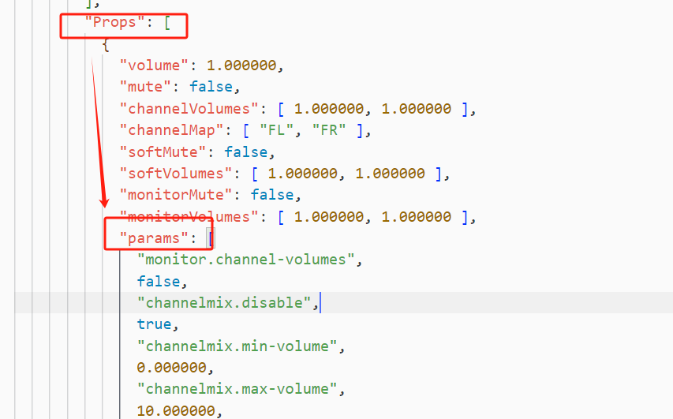

--

# *SPA_FALLTHROUGH*


SPA_FALLTHROUGH是一个注释，

用于抑制有关switch的编译器警告  没有中断或返回声明而失败的案例。

SPA_FALLTHROUGH仅在具有代码的情况下才需要：

```
switch (foo) {
  case 1: // These cases have no code. No fallthrough annotations are needed.
  case 2:
  case 3:
    foo = 4; // This case has code, so a fallthrough annotation is needed:
    SPA_FALLTHROUGH;
  default:
    return foo;
}
```

本质是一个编译器attribute

```
#  define SPA_FALLTHROUGH __attribute__ ((fallthrough));
```

# spa_handle_factory

```
struct spa_handle 
struct spa_interface_info
struct spa_support
struct spa_handle_factory 

```

# spa-monitor

这个文件是一个用于操作和监控设备的示例程序，基于 **Simple Plugin API (SPA)**，这是 PipeWire 框架的基础部分。它展示了如何动态加载插件、枚举工厂和接口，以及与设备交互的基本过程。

### **功能解析**

| 功能模块               | 作用                                                         |
| ---------------------- | ------------------------------------------------------------ |
| **动态加载插件**       | 使用 `dlopen` 和 `dlsym` 动态加载共享库（`.so`文件），实现插件化的架构，便于扩展功能。 |
| **工厂枚举与接口发现** | 使用 `spa_handle_factory_enum_func_t` 枚举工厂（factories），并获取支持的接口类型。 |
| **设备枚举与操作**     | 针对设备接口 (`SPA_TYPE_INTERFACE_Device`)，通过事件回调 (`on_device_info` 和 `on_device_object_info`) 监控设备的变化。 |
| **事件监听与处理**     | 利用 `poll` 系统调用监听文件描述符的事件变化，并调用相应的回调函数。 |
| **日志记录与支持功能** | 使用 `spa_log` 实现基本的日志记录，并通过 `spa_support` 传递支持的功能模块。 |

------

### **重要代码分析**

1. **动态加载插件**

   ```c
   if ((handle = dlopen(argv[1], RTLD_NOW)) == NULL) {
       printf("can't load %s\n", argv[1]);
       return -1;
   }
   ```

   - 从命令行参数指定的 `.so` 文件加载插件。
   - 使用 `dlsym` 获取插件中工厂的枚举函数 `spa_handle_factory_enum_func_t`。

2. **枚举工厂和接口**

   ```c
   if ((res = enum_func(&factory, &fidx)) <= 0) { ... }
   ```

   - 枚举插件中定义的工厂，获取每个工厂支持的接口类型。
   - 针对设备接口（`SPA_TYPE_INTERFACE_Device`），实例化工厂对象并获取接口。

3. **设备监听与事件处理**

   ```c
   static void on_device_object_info(void *_data, uint32_t id, const struct spa_device_object_info *info) {
       if (info == NULL) {
           fprintf(stderr, "removed: %u\n", id);
       } else {
           fprintf(stderr, "added/changed: %u\n", id);
           inspect_info(data, info);
       }
   }
   ```

   - 定义回调函数处理设备的添加、移除或状态更新。
   - 使用 `poll` 监听事件，并调用设备提供的回调函数进行响应。

4. **主循环与资源管理**

   ```c
   while (true) {
       r = poll((struct pollfd *) data->fds, data->n_fds, -1);
       if (r < 0) { if (errno == EINTR) continue; break; }
       for (i = 0; i < data->n_sources; i++) {
           struct spa_source *p = &data->sources[i];
           p->func(p);
       }
   }
   ```

   - `poll` 监听事件文件描述符变化。
   - 遍历所有事件源，并调用其绑定的回调函数处理。

------

### **应用场景**

1. 设备检测与监控
   - 可以用来检测设备的插拔，或者设备状态的变化。
2. 插件化架构的使用示例
   - 演示如何动态加载插件并实现功能扩展。
3. 日志调试与测试
   - 利用 `spa_log` 记录设备状态和事件信息，便于调试和监控。

------

### **注意事项**

1. 动态库路径
   - 需要确保 `.so` 文件路径正确且可用。
2. 文件描述符限制
   - `struct data` 中 `fds` 和 `sources` 的数量有限（16个），对于复杂场景需调整或动态分配。
3. 错误处理
   - 目前示例程序中对错误处理有限，生产环境中需更严格的检查和日志记录。


```
# spa-monitor /usr/lib/spa-0.2/alsa/libspa-alsa.so 
flags:00000000 n_items:10
  object.path = "alsa:pcm:AMLAUGESOUND"
  device.api = "alsa:pcm"
  media.class = "Audio/Device"
  api.alsa.path = "hw:0"
  api.alsa.card.id = "AMLAUGESOUND"
  api.alsa.card.components = ""
  api.alsa.card.driver = "AML-AUGESOUND"
  api.alsa.card.name = "AML-AUGESOUND"
  api.alsa.card.longname = "AML-AUGESOUND"
  api.alsa.card.mixername = ""
```

# pw-dot代码分析


# pw-loopback用法

`pw-loopback` 是 PipeWire 提供的一个实用工具，用于创建音频设备之间的回环连接。它的主要作用是在两个音频节点之间建立实时的音频流桥接。例如，可以用来将音频从一个输入设备（如麦克风）传输到输出设备（如扬声器），或者在虚拟设备之间转发音频。

------

### **主要用途**

1. 实时音频传输
   - 将音频从一个设备直接回环到另一个设备，例如从麦克风到扬声器。
2. 测试和调试
   - 测试音频设备的性能，分析延迟和音质。
3. 音频流桥接
   - 在虚拟音频设备之间创建连接，用于复杂音频路由配置。
4. 低延迟设置
   - 在需要低延迟的场景下（如音频处理或音乐制作）使用。

------

### **用法举例**

1. **基本用法**

   ```bash
   pw-loopback
   ```

   - 默认在系统中查找可用的音频输入和输出设备，并将它们连接起来。
   - 没有指定输入和输出设备时，使用系统默认设备。

2. **指定输入和输出设备**

   ```bash
   pw-loopback --capture-props='media.class=Audio/Source' --playback-props='media.class=Audio/Sink'
   ```

   - `--capture-props`：指定音频输入（捕获）设备的属性，例如麦克风。
   - `--playback-props`：指定音频输出（回放）设备的属性，例如扬声器。

3. **调整缓冲时间和延迟**

   ```bash
   pw-loopback --latency=256/48000
   ```

   - `--latency` 设置音频缓冲区大小，`256/48000` 表示缓冲 256 帧，采样率为 48kHz。
   - 较小的延迟适合实时应用，但可能增加 CPU 占用。

4. **使用虚拟设备**

   - 可以与虚拟设备（如 

     ```
     pw-jack
     ```

      创建的虚拟 JACK 设备）结合使用：

     ```bash
     pw-loopback --capture-props='node.name=VirtualInput' --playback-props='node.name=VirtualOutput'
     ```

5. **录音示例**

   - 将麦克风音频直接回送到扬声器：

     ```bash
     pw-loopback --capture-props='media.class=Audio/Source' --playback-props='media.class=Audio/Sink'
     ```

------

### **常用选项**

| 参数               | 功能                                 |
| ------------------ | ------------------------------------ |
| `--capture-props`  | 指定输入设备的属性（如麦克风）。     |
| `--playback-props` | 指定输出设备的属性（如扬声器）。     |
| `--latency`        | 设置缓冲区大小，影响延迟和流畅性。   |
| `--rate`           | 指定采样率（如 48000 Hz）。          |
| `--channels`       | 设置音频通道数（如单声道或立体声）。 |
| `--verbose`        | 启用详细日志输出，便于调试。         |

------

### **实际应用场景**

1. 音频路由
   - 从 USB 麦克风捕获音频并回放到蓝牙耳机。
2. 音乐制作
   - 将音频信号路由到特定的虚拟设备，配合 DAW（数字音频工作站）。
3. 在线会议优化
   - 将多路输入合成成一路音频流发送给会议软件。
4. 延迟测试
   - 测量系统的音频延迟，调试设备设置。

------

### **注意事项**

- 使用前确保 PipeWire 服务已正常运行。
- 需要指定合适的输入和输出设备，避免误将同一个设备作为输入和输出。
- 调试时可以结合 `pw-top` 和 `pw-dump` 查看设备和流信息。

# pw-loopback

### **pw-loopback 命令示例**

以下是一个通过命令实现输入设备和输出设备连接的示例：

```bash
pw-loopback --capture-props='media.class=Audio/Source node.name=MyCapture' \
            --playback-props='media.class=Audio/Sink node.name=MyPlayback' \
            --latency=256/48000
```

- 输入设备

  ：

  - `media.class=Audio/Source`：选择音频源（如麦克风）。
  - `node.name=MyCapture`：指定音频输入节点名称。

- 输出设备

  ：

  - `media.class=Audio/Sink`：选择音频接收设备（如扬声器）。
  - `node.name=MyPlayback`：指定音频输出节点名称。

- 延迟设置

  ：

  - `--latency=256/48000`：设置缓冲大小和采样率。

------

### **在配置文件中创建相同链路**

PipeWire 的配置文件可以用来定义静态链接设备的方法。在 `~/.config/pipewire/pipewire.conf` 或 `/etc/pipewire/pipewire.conf` 中，添加如下内容以模拟上述命令：

#### **1. 定义输入和输出设备**

在配置文件的 `[stream]` 块中添加以下内容：

```ini
context.modules = [
    {
        name = libpipewire-module-loopback
        args = {
            capture.props = {
                media.class = "Audio/Source"
                node.name = "MyCapture"
            }
            playback.props = {
                media.class = "Audio/Sink"
                node.name = "MyPlayback"
            }
            latency = 256/48000
        }
    }
]
```

- `libpipewire-module-loopback`：加载 loopback 模块。
- `capture.props`：定义捕获设备的属性（类似命令中的 `--capture-props`）。
- `playback.props`：定义回放设备的属性（类似命令中的 `--playback-props`）。
- `latency`：设置缓冲大小和采样率。

------

#### **2. 重启 PipeWire 服务**

添加配置后，需要重启 PipeWire 服务以使其生效：

```bash
systemctl --user restart pipewire
```

------

### **检查链路状态**

1. **使用 `pw-top` 查看活动节点**

   ```bash
   pw-top
   ```

   确保 `MyCapture` 和 `MyPlayback` 节点已经连接。

2. **使用 `pw-dump` 检查链路**

   ```bash
   pw-dump | grep -A 10 MyCapture
   ```

   验证是否存在输入和输出设备的链接。

------

### **动态修改配置的优势**

通过命令和配置文件的方式均可实现音频链路配置：

- **命令方式**：适合临时测试和快速搭建链路。
- **配置文件**：适合需要持久化的场景，如长期固定的设备路由需求。

如果需要动态修改链路，可以结合 PipeWire 的 API 或通过工具（如 `pw-cli`）手动调整。

```
Audio
 ├─ Devices:
 │
 ├─ Sinks:
 │  *   31. my-default-sink                     [vol: 1.00]
 │
 ├─ Sources:
 │
 ├─ Filters:
 │    - loopback-2982-19
 │      84. MyCapture                                                    [Audio/Source]
 │      94. MyPlayback                                                   [Audio/Sink]
 │
 └─ Streams:
```


# audio adapter

上面这段说明是对 PipeWire 中的 **Audio Adapter**（音频适配器）功能的描述。下面我将逐步解释每个关键部分：

### 1. **SPA Node 和 SPA Device Node**

- **SPA Node**：在 PipeWire 中，`SPA Node` 是一个代表音频处理或输出的基本单位。它可以是音频源、接收器或者音频效果处理节点。
- **SPA Device Node**：这是指一个实际的设备节点，通常代表物理设备，比如声卡或虚拟音频设备。在这里，`SPA Device Node` 是指音频适配器内部使用的设备节点。

### 2. **适配器的功能**

- **格式转换（Format Conversion）**：适配器会将音频设备的原始数据格式转换为所需的外部格式。例如，将一个硬件设备输出的格式转换为系统或其他设备所需要的格式。
- **采样率转换（Sample Rate Conversion）**：适配器还负责将音频流的采样率进行转换。例如，将音频设备采样率为 44.1 kHz 的音频流转换为 48 kHz，或者其他采样率。
- **声道混合/重映射（Channel Remixing/Remapping）**：适配器可以调整音频的声道布局，确保音频流的通道数和排列符合外部要求。例如，可能需要将 5.1 环绕声映射为 2 通道立体声，或者将立体声映射为单声道。

### 3. **暴露为独立的单声道端口（Mono Ports）**

- 在音频处理的过程中，适配器会将多通道音频（例如立体声或环绕声）拆分为多个独立的单声道端口。每个声道将会作为一个单独的端口进行处理和输出，这在 DSP（数字信号处理）过程中是很常见的。

### 4. **Passthrough模式**

- 在某些情况下，音频适配器可以配置为“Passthrough模式”。在此模式下，适配器不会进行任何转换，它只是将音频数据从内部节点直接传递出去，不做任何处理或格式转换。Passthrough 模式通常用于需要直接访问硬件的场景，例如需要进行独占访问（Exclusive Access）时。

### 5. **PortConfig 参数**

- **PortConfig** 是一个参数，用于配置适配器的不同模式。它可以用来调整适配器的行为，例如设置是否进行格式转换、采样率转换、声道重映射等，或者是否启用 passthrough 模式。

### 总结

音频适配器在 PipeWire 中的作用是充当音频格式转换的桥梁，将设备的原始音频格式转换为适合外部使用的格式。此外，它还负责将多声道音频拆分为独立的声道端口进行处理。在 Passthrough 模式下，适配器不进行任何转换，仅仅传递音频数据。通过调整 `PortConfig` 参数，用户可以配置适配器的行为，满足不同的音频处理需求。

# pw-cli查看latency

查询 id 为 58 的 ALSA 节点的当前内部延迟：

```
$ pw-cli e 58 ProcessLatency
Object: size 80, type Spa:Pod:Object:Param:ProcessLatency (262156), id Spa:Enum:ParamId:ProcessLatency (16)
  Prop: key Spa:Pod:Object:Param:ProcessLatency:quantum (1), flags 00000000
    Float 0.000000
  Prop: key Spa:Pod:Object:Param:ProcessLatency:rate (2), flags 00000000
    Int 0
  Prop: key Spa:Pod:Object:Param:ProcessLatency:ns (3), flags 00000000
    Long 0
```

# rules的规则写法

没有看到全面的说明。

只有自言片语。

只能自己去代码里挖掘。

https://pipewire.pages.freedesktop.org/wireplumber/daemon/configuration/modifying_configuration.html

我从chatgpt那里到到一个重要信息，

就是actions里面除了update-props，还可以update其他的东西。

而具体可以update哪些，可以在pw-dump的信息里看出来。

例如这个node，它就可以update-props / update-params、update-input-ports等操作。

```
      "change-mask": [ "input-ports", "output-ports", "state", "props", "params" ],
      "n-input-ports": 0,
      "n-output-ports": 2,
```


# pipewire的rules匹配规则是怎样的

在 `PipeWire` 中，匹配规则 (`rules`) 是用来根据节点（node）的属性动态地应用配置的。`PipeWire` 和 `WirePlumber` 都使用规则来匹配节点，规则通常是基于节点的属性（如 `node.name`、`media.class` 等）来工作的。

### **PipeWire 的 rules 匹配规则**

1. **规则的定义：**
   - 规则是一个 JSON 风格的配置，可以在 `PipeWire` 的配置文件中定义，例如 `~/.config/pipewire/pipewire.conf` 或 `/etc/pipewire/pipewire.conf`。
   - 每条规则通常包含以下部分：
     - 匹配条件（`matches`）：用于匹配节点的属性。
     - 动作（`actions`）：当规则匹配时执行的操作。

   示例配置：
   ```ini
   context.rules = [
       {
           matches = [
               { "node.name" = "MyNode" }
           ]
           actions = {
               update-props = {
                   "node.description" = "Custom Node"
               }
           }
       },
       {
           matches = [
               { "media.class" = "Audio/Sink" }
           ]
           actions = {
               update-props = {
                   "priority" = 100
               }
           }
       }
   ]
   ```

2. **规则匹配的顺序：**
   - 配置文件中 `context.rules` 的规则按顺序定义，并按顺序进行匹配。
   - **多个规则匹配时，所有匹配的规则都会被执行**，因此规则之间没有“阻断”机制。
   - 如果两条规则都匹配同一个节点，它们的 `actions` 会被依次执行。**最后执行的规则会覆盖之前的设置**，如果它们修改了相同的属性。

3. **匹配逻辑：**
   - 每条规则的 `matches` 列出了一组条件，条件之间是“与”的关系（`AND`）。
   - 如果 `matches` 中所有条件都满足，则规则被认为匹配成功。
   - 匹配的条件可以基于节点属性、媒体属性、设备属性等。

### **匹配规则的代码实现**

`PipeWire` 的规则匹配逻辑主要在以下文件中实现：

1. **规则的初始化和解析：**
   - `src/pipewire/context.c`：负责加载和解析 `context.rules`。
   - `src/pipewire/conf.c`：负责读取和解析配置文件内容。

2. **具体的规则匹配逻辑：**
   - `src/pipewire/properties.c`：
     - 函数 `pw_properties_match()` 实现了属性匹配的核心逻辑。
     - 这个函数会遍历规则的 `matches` 部分，与节点的属性逐一比对。

3. **应用规则的逻辑：**
   - `src/pipewire/node.c`：
     - 函数 `pw_node_update_properties()` 用于更新节点属性。
     - 当规则匹配时，`actions` 中的 `update-props` 会通过这个函数应用到节点。

### **WirePlumber 的规则匹配**

`WirePlumber` 是 `PipeWire` 的会话管理器，它也使用规则（通过 Lua 脚本或配置文件）来匹配节点并动态管理设备或流。虽然它的规则系统与 `PipeWire` 类似，但更高级一些。

1. **规则定义：**
   - `WirePlumber` 的规则通常定义在 `/usr/share/wireplumber/policy.lua.d/` 或类似的 Lua 脚本中。
   - 例如：
     ```lua
     rule = {
         matches = {
             { node.name = "MyNode" },
             { ["media.class"] = "Audio/Sink" }
         },
         apply_properties = {
             ["node.description"] = "Custom Node",
             ["priority"] = 100
         }
     }
     ```

2. **匹配逻辑：**
   - `WirePlumber` 的规则也会按顺序匹配，多个规则可以叠加。
   - Lua 脚本中，`matches` 和 `apply_properties` 类似于 `PipeWire` 的 `matches` 和 `actions`。

3. **代码实现：**
   - `WirePlumber` 的匹配逻辑主要在其代码库的 `lib/wp/node.lua` 和 `src/wp/policy` 中实现。

### 总结：如果两条规则都匹配上了

无论是在 `PipeWire` 还是 `WirePlumber` 中，两条规则都匹配上时：
- **两条规则的动作都会执行**。
- 如果两个规则的动作修改了相同的属性，则后一个规则的修改会覆盖前一个规则的修改。
- 在 `PipeWire` 中，规则按配置文件中出现的顺序执行。

如果需要确保某些规则优先级更高，可以通过调整规则的顺序或使用更精确的匹配条件来实现。


# 这里的matches里可以使用完整的正则表达式语法吗？给出复杂的例子。

在 `PipeWire` 的规则中，`matches` 部分支持使用 **模式匹配**，但不是完整的正则表达式语法，而是基于 **通配符（wildcard matching）** 的匹配机制。具体来说，`PipeWire` 使用的是 **glib 的通配符匹配函数**，类似于 Unix shell 中的文件名匹配规则。例如：

- `*`：匹配零个或多个字符。
- `?`：匹配单个字符。
- `[abc]`：匹配括号内的任意一个字符。
- `[!abc]`：匹配括号内未列出的字符。

**完整正则表达式并不直接支持**，但可以通过其他手段（如 `WirePlumber` 的 Lua 脚本）实现复杂匹配。

---

### **复杂的 `matches` 例子**

以下是一些复杂的通配符匹配示例：

#### 1. 基于 `node.name` 匹配复杂规则

```ini
context.rules = [
    {
        matches = [
            { "node.name" = "~MyApp*" }       # 匹配以 "MyApp" 开头的所有节点
        ]
        actions = {
            update-props = {
                "node.description" = "My Application Node"
            }
        }
    },
    {
        matches = [
            { "node.name" = "~Audio[123]Node" }  # 匹配 "Audio1Node"、"Audio2Node" 或 "Audio3Node"
        ]
        actions = {
            update-props = {
                "priority" = 200
            }
        }
    },
    {
        matches = [
            { "node.name" = "~*Stream[!0-9]*" }  # 匹配包含 "Stream" 且后续不是数字的节点
        ]
        actions = {
            update-props = {
                "stream.type" = "Non-Numeric"
            }
        }
    }
]
```

#### 2. 基于 `media.class` 匹配特定媒体类型

```ini
context.rules = [
    {
        matches = [
            { "media.class" = "~Audio/*" }   # 匹配所有 "Audio/" 开头的媒体类型
        ]
        actions = {
            update-props = {
                "volume" = 0.8
            }
        }
    },
    {
        matches = [
            { "media.class" = "~Video/Sink" } # 精确匹配 "Video/Sink" 媒体类型
        ]
        actions = {
            update-props = {
                "priority" = 100
            }
        }
    },
    {
        matches = [
            { "media.class" = "~Audio/[!Sink]*" } # 匹配所有 "Audio/" 开头且不包含 "Sink" 的媒体类型
        ]
        actions = {
            update-props = {
                "stream.type" = "Custom Audio"
            }
        }
    }
]
```

#### 3. 匹配多个属性组合

```ini
context.rules = [
    {
        matches = [
            { "node.name" = "~MyApp*" },
            { "media.class" = "~Audio/[!Sink]*" } # 同时匹配 node.name 和 media.class
        ]
        actions = {
            update-props = {
                "node.description" = "My Audio Application",
                "priority" = 300
            }
        }
    }
]
```

---

### **扩展：如果需要完整的正则表达式**

如果需要更复杂的正则表达式（如 PCRE），`PipeWire` 本身不支持，但可以通过 `WirePlumber` 的 Lua 脚本实现。例如，`WirePlumber` 支持 Lua 的正则表达式匹配（基于 Lua 的 `string.match`）。

#### WirePlumber Lua 脚本的复杂正则匹配示例

```lua
table.insert(rules, {
    matches = {
        {
            node = {
                name = function(name)
                    return string.match(name, "^MyApp[0-9]+$")
                end
            }
        },
        {
            media = {
                class = function(class)
                    return string.match(class, "Audio/[A-Z]+")
                end
            }
        }
    },
    apply_properties = {
        ["node.description"] = "Matched with Lua Regex",
        ["priority"] = 500
    }
})
```

在上述示例中，`string.match` 函数允许我们使用 Lua 的正则表达式语法来进行更灵活的匹配。

---

### **总结**

- **PipeWire 的 `matches` 使用的是通配符匹配**，支持 `*`、`?` 和字符集等简单规则，但不支持完整正则表达式。
- **如果需要正则表达式支持**，可以使用 `WirePlumber` 的 Lua 脚本，通过 Lua 的正则表达式实现复杂匹配。
- 复杂匹配可以结合多个属性，如 `node.name` 和 `media.class`，从而实现更精确的规则应用。

# 全局采样率

PipeWire 在处理管道中使用全局采样率。所有信号都会被转换为这个采样率，然后转换为设备的采样率。

您可以在 `pipewire.conf` 中更改采样率。找到该行，取消注释并修改：

```json
default.clock.rate  =    48000
```

也可以在运行时动态强制采样率，

```
pw-metadata -n settings 0 clock.rate <value>
```

请注意，默认时钟速率决定了下面最小/最大/默认量化的时间长度。当你改变默认时钟速率时，你可能需要改变量化以保持量化的时间长度相同。


# pw_context_recalc_graph

这个在graph有变动的时候，都要重新计算。

例如增加了node、device的时候。


# 一个bis source 多bis的问题的讨论解决

https://gitlab.freedesktop.org/pipewire/pipewire/-/issues/4462

目前，我使用 bluez5.bcast_source.config 配置 LE Audio 广播源。

当我使用 pw-play xxx.wav 时，可以在 btmon 日志中看到 ISO Data TX。

然而，从 hci_log 来看，只创建了一个 BIG 和一个 BIS。

我了解 BlueZ 和 PipeWire 都已经支持多个 BIS。我应该如何配置 PipeWire 来创建一个 BIG，其中包含两个 BIS，BIS 1 广播左声道音频，BIS 2 广播右声道音频？

bluez5.bcast_source.config 中的 "bis" 是一个 JSON 列表，你应该为每个想要的 bis 放一个条目。

```
bluez5.bcast_source.config = [
{
"broadcast_code": "bistest",
"encryption": true,
"bis": [
{
"qos_preset": "48_4_1",
"audio_channel_allocation": 3,
"metadata": [
{ "type": 1, "value": [ 4, 0 ] }
]
}
]
}
]
```

添加2个bis

```
bluez5.bcast_source.config = [ { "broadcast_code": "bistest", "encryption": false, "bis": [ { "qos_preset": "48_4_1", "audio_channel_allocation": 1, "metadata": [ { "type": 1, "value": [ 4, 0 ] } ] }, { "qos_preset": "48_4_1", "audio_channel_allocation": 2, "metadata": [ { "type": 1, "value": [ 4, 0 ] } ] } ] } ] 
```

应该这样设置吗？然而，从 wpctl status 来看，bis1 & bis2 是两个独立的单声道设备。

BIS 将目前作为独立的单声道设备出现。

你现在需要手动在它们前面加入一个 combine sink, 

https://gitlab.freedesktop.org/pipewire/pipewire/-/wikis/Virtual-Devices#combine-streams 

或者使用 helvum/pw-link 连接流通道。

回放需要某些输入流连接到所有的 BIS 在 BIG 中。


# pipewire的leaudio

https://gitlab.freedesktop.org/pipewire/pipewire/-/wikis/LE-Audio-+-LC3-support

实现由三个项目的部分组成：(i) Linux 内核，(ii) BlueZ，(iii) 声音服务器部分，即 Pipewire。

LE Audio 实现的主要部分在(i)和(ii)中。Pipewire 部分(iii)相对较小且简单，主要负责编解码支持以及与声音系统其余部分的集成。

如果 Pipewire 编译时支持 LC3，就会有一个名为 `libspa-codec-bluez5-lc3.so` 的文件。

# log级别控制

https://docs.pipewire.org/page_daemon.html

`PIPEWIRE_DEBUG=[<level>][,<glob1>:<level1>][,<glob2>:<level2>,...]` 

其中，globs 是用于匹配日志主题的通配符，levels 是为此主题设置的日志级别。

globs 按顺序应用，匹配的 glob 会覆盖该类别的早期 glob。

没有 glob 前缀的级别将设置全局日志级别，这是 `*:<level>` 的更高效版本。

例如， `PIPEWIRE_DEBUG=E,mod.*:D,mod.foo:X` 启用全局错误消息，在所有模块中启用调试模式，但 foo 模块不输出消息。


`<level>` 指定日志级别：

- `X` 或 `0` : 未启用日志记录。
- `E` 或 `1` : 错误日志记录已启用。
- `W` 或 `2` : 已启用警告。
- `I` 或 `3` : 信息消息已启用。
- `D` 或 `4` : 调试消息已启用。
- `T` 或 `5` : 跟踪消息已启用。这些消息可以从实时线程中记录。

PipeWire 使用 `category.topic` 命名方案，包括以下类别：

- `pw.*` : PipeWire 内部的。
- `mod.*` : 模块的日志
- `ms.*`: media-session的。
- `ms.mod.*`: media-session模块的。
- `conn.*`: 与连接相关的log，例如打印通过通信套接字发送的原始消息。这些主题通常会被单独分命名空间，因为它们比正常的调试主题详细得多。此命名空间必须通过一个 `conn.<glob>` 通配符显式启用。


`PIPEWIRE_LOG=<filename>` : 将日志重定向到给定的文件名。

在pipewire里，有97个模块。里面一大部分是pulseaudio的兼容模块。

```
bluez-session
rtp-session
netjack2-driver
jackdbus-detect
vban-send
pulse-tunnel
roc-sink
client-node
example-source
raop-discover
vban-recv
parametric-eq
snapcast-discover
ffado-driver
protocol-simple
protocol-native
combine-stream
rt
roc-source
example-filter
rtp-source
profiler
example-sink
rtp-sap
loopback
raop-sink
avb
control
pipe-tunnel
fallback-sink
echo-cancel
portal
reserve
adapter
rtp-sink
zeroconf-discover
link-factory
access
metadata
jack-tunnel
filter-chain
x11-bell
protocol-pulse
netjack2-manager
settings
client-device
adapter
session
endpoint-stream
endpoint
endpoint-link
metadata
spa-device-factory
spa-node-factory
spa-device
spa-node
protocol-native
session
client-session
endpoint-stream
endpoint-link
client-endpoint
endpoint
gsettings
jackdbus-detect
roc-sink
ladspa-source
raop-discover
device-restore
protocol-tcp
remap-sink
combine-sink
rtp-recv
roc-source
loopback
switch-on-connect
alsa-source
stream-restore
ladspa-sink
pipe-source
always-sink
simple-protocol-tcp
roc-sink-input
device-manager
pipe-sink
remap-sink
null-sink
zeroconf-discover
tunnel-source
rtp-send
echo-cancel
zeroconf-publish
virtual-source
alsa-sink
x11-bell
tunnel-sink
virtual-sink
```

# monitor是指什么

Monitor

Finding devices and handling hotplugging

就是监控设备的热插拔的。

# context.properties  里的键值对，除了标准的之外，可以自由指定吗？

我产生这个疑问，是我看到minimal.conf了，有这样的配置项：

```
minimal.use-udev = true
minimal.use-pulse = true
```

而这个key在其他地方是搜索不到的。

又考虑到属性是dict类型，应该是可以自由定义的。所以有这个疑问。


是的，在`context.properties`中，除了标准的键值对（如`media.*`或`audio.*`等），你可以自由地指定自定义键值对。PipeWire设计为模块化且灵活，允许用户和开发者为具体需求定义额外的上下文信息。

### 说明：

1. **标准键值对：**
   - 这些键值对是PipeWire内置支持的，用于与PipeWire核心模块和WirePlumber等管理器进行交互。
   - 例如：
     - `media.class`
     - `node.name`
     - `audio.rate`
2. **自定义键值对：**
   - 你可以自由添加，例如：`my.custom.property=example`。
   - 这些自定义的键值对不会被PipeWire核心直接使用，但可以被WirePlumber脚本、客户端应用、或者其他模块识别和处理。

### 使用场景：

- **模块间通信：** 自定义键值对可以携带模块或应用的元数据，便于上下文感知配置。
- **个性化需求：** 定制化的行为，比如为特定设备配置专属的规则。
- **调试信息：** 可以嵌入调试相关的信息，用于定位问题。

### 注意事项：

- 确保命名空间的唯一性，避免与标准键值对冲突。例如，可以使用自定义前缀，如`myapp.*`。
- 如果涉及到WirePlumber的规则，记得在脚本中正确解析和使用这些自定义属性。

你有具体的场景需求或疑问吗？我可以帮你进一步细化配置方案。

# modules

```
# pw-cli ls Module
        id 1, type PipeWire:Interface:Module/3
                object.serial = "1"
                module.name = "libpipewire-module-rt"
        id 2, type PipeWire:Interface:Module/3
                object.serial = "2"
                module.name = "libpipewire-module-protocol-native"
        id 4, type PipeWire:Interface:Module/3
                object.serial = "4"
                module.name = "libpipewire-module-profiler"
        id 6, type PipeWire:Interface:Module/3
                object.serial = "6"
                module.name = "libpipewire-module-metadata"
        id 8, type PipeWire:Interface:Module/3
                object.serial = "8"
                module.name = "libpipewire-module-spa-device-factory"
        id 10, type PipeWire:Interface:Module/3
                object.serial = "10"
                module.name = "libpipewire-module-spa-node-factory"
        id 12, type PipeWire:Interface:Module/3
                object.serial = "12"
                module.name = "libpipewire-module-client-node"
        id 14, type PipeWire:Interface:Module/3
                object.serial = "14"
                module.name = "libpipewire-module-client-device"
        id 16, type PipeWire:Interface:Module/3
                object.serial = "16"
                module.name = "libpipewire-module-portal"
        id 17, type PipeWire:Interface:Module/3
                object.serial = "17"
                module.name = "libpipewire-module-access"
        id 18, type PipeWire:Interface:Module/3
                object.serial = "18"
                module.name = "libpipewire-module-adapter"
        id 20, type PipeWire:Interface:Module/3
                object.serial = "20"
                module.name = "libpipewire-module-link-factory"
        id 22, type PipeWire:Interface:Module/3
                object.serial = "22"
                module.name = "libpipewire-module-session-manager"
```

# pipewire里，对于一个adapter object，不指定media.class有关系吗？

在 PipeWire 中，对于一个 `adapter object`，**是否指定 `media.class`** 会影响其用途和行为，因为 `media.class` 是描述对象类别和用途的重要属性。虽然不强制必须指定，但缺少该属性可能会导致不明确的行为或兼容性问题。

------

### **1. 什么是 `media.class`？**

- `media.class` 是 PipeWire 中用来定义节点或资源类别的标准属性。
- 它影响模块如何处理对象、连接规则、以及在客户端或其他节点中的呈现。

------

### **2. 如果不指定 `media.class` 的影响**

| 情况                         | 可能的后果                                                   |
| ---------------------------- | ------------------------------------------------------------ |
| **自动分配默认行为**         | 一些模块可能为未定义 `media.class` 的对象分配默认值（如 `Generic`）。 |
| **连接规则可能不匹配**       | WirePlumber 的规则（如 `monitor.bluez.rules`）通常依赖 `media.class` 进行匹配。缺失时，规则可能无法正确生效。 |
| **无法在客户端显示正确类别** | 如音频设备不显示为 `Audio/Sink` 或 `Audio/Source`，导致应用无法识别或列出资源。 |
| **潜在功能限制**             | 某些功能（如音频设备的声道映射）需要明确的 `media.class` 才能正常工作。 |
| **调试和管理不便**           | 在 `pw-cli` 或 `wpctl` 中查看时，缺乏清晰的分类信息。        |

------

### **3. 推荐的 `media.class` 值**

| 类别               | `media.class` 值     | 说明                   |
| ------------------ | -------------------- | ---------------------- |
| 音频输出（扬声器） | `Audio/Sink`         | 表示音频播放设备。     |
| 音频输入（麦克风） | `Audio/Source`       | 表示音频录制设备。     |
| 视频输出           | `Video/Sink`         | 表示视频播放设备。     |
| 视频输入（摄像头） | `Video/Source`       | 表示视频捕获设备。     |
| 其他设备           | `Generic` 或自定义值 | 对应非标准用途的设备。 |

------

### **4. Adapter Object 的典型配置**

当创建一个 `adapter` 时，建议明确指定 `media.class`，以确保其行为符合预期。

**示例：音频适配器**

```ini
context.objects = [
  {
    factory = adapter
    args = {
      node.name = "my-audio-adapter"
      media.class = "Audio/Sink"
      audio.position = [ FL FR ]
    }
  }
]
```

**示例：通用适配器（无明确功能）**

```ini
context.objects = [
  {
    factory = adapter
    args = {
      node.name = "my-generic-adapter"
    }
  }
]
```

------

### **5. 什么时候可以不指定 `media.class`？**

- 如果你明确知道该对象只会被特定的自定义模块使用，且这些模块无需依赖 `media.class`。
- 当 `adapter object` 的用途是纯粹的中间层（如数据路由）而非最终设备。

------

### **6. 总结建议**

- **尽量指定 `media.class`**，尤其是用于音频/视频相关的对象。
- **调试阶段**：缺省值可能适合快速测试，但生产环境建议完整配置。
- 如果你遇到具体问题或特殊需求，可以进一步调整配置规则并验证。

需要进一步协助时，可以分享你具体的使用场景！

# 一个关于音量调节易用性的讨论

https://gitlab.freedesktop.org/pipewire/wireplumber/-/issues/257


# props分析

https://docs.pipewire.org/page_man_pipewire-props_7.html

所有的对象都有props。

大多数props都可以

* 静态设置。在conf里配置，
* 动态设置。在对象创建后的runtime时动态修改。

pipewire里的object有哪些类型：

* Device
* Node
* Port
* Link
* Monitor
* Client

## 通用props

一些属性是“通用属性”（例如 `node.description` ），可以在给定类型的所有对象上设置。其他属性控制特定类型设备或节点（ALSA、蓝牙，...）的设置，只有对于这些对象才有意义。

通常，所有属性都在会话管理器配置中进行配置。

关于如何进行配置，请参见会话管理器文档。

在没有会话管理器的 minimal PipeWire 设置中，

它们可以通过 pipewire.conf(5)中的 context.objects 进行配置。

下面的属性描述的内容：

```
common device props
common node props
	identify props
	classify props
	schedule props
	session manager props
audio adapter props
alsa props
bt props
port props
link props
client props
runtime settings
acp
other
```


## common device props

都是以device开头的。

```
device.name
device.nick
device.plugged
device.description
device.serial

device.vendor.id
device.vendror.name
device.product.id
device.product.name

device.class
device.form-factor
device.icon
device.icon-name

device.intended-roles

device.disabled = false

```

有个复杂的**device.param.PARAM = { ... }** 

`device.Param.Props = { ... }` to set `Props`.

设置命令：

```
pw-cli set-param 31 Props "{ mute = false } "

pw-cli set-param 31 Props "{ mute = true } "
```

用板子验证命令是有效果的。


set-param可以修改哪些内容？处理Props的。

可以从pw-dump的结果里看到。

跟Props并且在params 对象里的，还有：

```
EnumFormat
PropInfo
Props
Format
EnumPortConfig
PortConfig
Latency
ProcessLatency
Tag
```

set-param命令格式：

```
set-param object-id param-id param-json
```

这里有实用set-param带复杂参数的例子。

https://gitlab.freedesktop.org/pipewire/pipewire/-/issues/4166

```
pw-cli set-param 35 Props '{ params = [ "enabled" 0.0 ] }'     
```

## common node props

### identify props

```
node.name
node.description

media.name
media.title
media.artist
media.copyright
media.software
media.language
media.filename
media.icon
media.icon-name
media.comment
media.date
media.format

object.linger
device.id


```

### classify props

节点的分类属性

用于将信号route到dest和用于配置设置。

```
media.type: Audio/Video/Midi
media.category
	Playback
	Capture
	Duplex
	Monitor
	Manager
media.role
	Music
	Movie ...
media.class
	Audio/Source
	Audio/Sink     这个表示node
	Stream/Output/Audio  这个表示stream
	Stream/Input/Audio
	
```

### schedule props

```
node.latency
	= 1024/48000,表示48K的采样率，延迟1024个sample，计算得到是21ms左右。
node.lock-quantum
node.force-quantum
node.rate
node.lock-rate
node.force-rate
node.always-process

```

### session manager props

```
node.autoconnect = true
	指示sm把这个node自动连接到其他node。
	一般是对sink和source节点而言。
node.exclusive = false
	如果node只想跟sink/source连接，那么设置为false。
node.target
	这个已经废弃。
	用target.objec替代了。
	表示要连接的目标node是哪个。
	可以是name或者serial。
target.object
	表示要连接的目标node是哪个。
	可以是name或者serial。
node.dont-reconnect
node.passive
node.link-group
stream.dont-remix = false
	指示会话管理器不要重新混音流的声道。
	通常流的声道配置会更改以匹配其连接的接收端/源。
	将此属性设置为 true 后，流将保持其原始声道布局，会话管理器将链接匹配的声道与接收端。
	
```

### format props

对于stream和node都可以配置。

```
audio.rate
audio.channels
audoi.format
	S16, S32, F32, F64, S16LE, S16BE
	...
audio.allowed-rates
	
```

### 其他props

```
node.param.PARAM = {}# JSON
node.disabled = false
```

## audio adapter props

大多数音频节点（ALSA、蓝牙、应用程序的音频流等）都有共同的音频适配器属性。

适配器执行采样格式、采样率和通道混音操作。

adapter都是node。

PipeWire 在客户端（或者在 pulseaudio 服务器的情况下，在创建流的 pipewire-pulse 服务器中）执行大部分的采样转换和重采样。

这确保所有转换都卸载到客户端，服务器可以从性能角度处理单一格式。

## alsa props

```
monitor props
	alsa.use-acp
	alsa.udev.expose-busy
	
device props
	api.alsa.path
	api.alsa.use-ucm
		当启用了 ACP 并且设备有可用的 UCM 配置时，
		默认情况下会使用 UCM 配置而不是 ACP 配置文件。
		此选项允许您禁用此功能并使用 ACP 配置文件。
	api.alsa.soft-mixer
		将此选项设置为 true 将禁用硬件混音器进行音量控制和静音
		随后所有音量处理将使用软件音量和静音
	api.alsa.ignore-dB 
	
node props
	audio.channels
	...
	api.alsa.period-size
	api.alsa.period-num
	
```

## bt props

```
monitor props
	bluez5.roles
	一堆bluez5开头的属性。比较独立。
	
```

写到这里，我突然意识到，这里所谓monitor props，在配置文件里是有体现的：

```
monitor.bluez.properties
```

也不是。感觉就是一个比较随意的字符串。

```
src/config/wireplumber.conf.d.examples/bluetooth.conf
11:monitor.bluez.properties = {

src/scripts/monitors/bluez.lua
17:config.properties = Conf.get_section_as_properties ("monitor.bluez.properties")
```

## runtime setting

对象，如设备和节点，在创建对象之后也可以修改其参数。

例如，活动设备配置文件、信道音量等。

对于某些对象，参数也允许更改一些属性。

大多数 ALSA 和虚拟设备的参数也可以在运行时进行配置。

==这些设置可在设备参数 `Props` 的 `params` 字段中获得。==

例如，可通过 `pw-dump <id>` 查看 ALSA 设备的这些设置：

设置就是这样：

```
pw-cli s <id> Props '{ params = [ "api.alsa.headroom" 1024 ] }'
```

只有这里出现的，才能通过pw-cli set-param的方式配置。



这些设置不会保存，需要在每次重启会话管理器时重新应用。

# PipeWire 和 PipeWire-Pulse配合

### **PipeWire 和 PipeWire-Pulse 的角色分工**

| 组件               | 功能描述                                                     |
| ------------------ | ------------------------------------------------------------ |
| **PipeWire**       | 提供多媒体框架，处理音频和视频流的管理、路由、混音等功能，支持低延迟和高性能。 |
| **PipeWire-Pulse** | PulseAudio 的兼容层，充当 PulseAudio 客户端和 PipeWire 之间的桥梁，使旧的 PulseAudio 应用可用。 |

### **协作机制**

1. **PipeWire** 负责管理底层的音频硬件设备（如 `hw:0,1`），执行音频流的调度和混合。
2. **PipeWire-Pulse** 模拟 PulseAudio 的服务接口（通过 `pulseaudio` 的 `libpulse` 库），将传统依赖 PulseAudio 的应用的音频请求转发给 PipeWire。

# xx-types.h头文件

pipewire里总共就这些。大部分是在param目录下面。

```
./spa/plugins/vulkan/vulkan-types.h
./spa/include/spa/param/props-types.h
./spa/include/spa/param/latency-types.h
./spa/include/spa/param/audio/wma-types.h
./spa/include/spa/param/audio/aac-types.h
./spa/include/spa/param/audio/amr-types.h
./spa/include/spa/param/audio/raw-types.h
./spa/include/spa/param/audio/mp3-types.h
./spa/include/spa/param/audio/iec958-types.h
./spa/include/spa/param/profile-types.h
./spa/include/spa/param/format-types.h
./spa/include/spa/param/video/raw-types.h
./spa/include/spa/param/buffers-types.h
./spa/include/spa/param/param-types.h
./spa/include/spa/param/profiler-types.h
./spa/include/spa/param/tag-types.h
./spa/include/spa/param/port-config-types.h
./spa/include/spa/param/route-types.h
./spa/include/spa/utils/enum-types.h
```

这些types.h头文件的主要作用是什么？


头文件的规律是：

xx.h里定义enum。

xx-types.h里使用xx.h里的enum来定义spa_type_info结构体。


# stream.dont-remix

这个在wireplumber里使用。

在pipewire里反而没有使用。

```
modules/module-si-standard-link.c

  str = wp_session_item_get_property (WP_SESSION_ITEM (out->si), "stream.dont-remix");
  out->dont_remix = str && pw_properties_parse_bool (str);
  str = wp_session_item_get_property (WP_SESSION_ITEM (in->si), "stream.dont-remix");
  in->dont_remix = str && pw_properties_parse_bool (str);
```

看起来是对in和out同时生效。

```
struct adapter *out, *in,
```

adapter结构体：

```
struct adapter
{
  WpSiAdapter *si;
  gboolean is_device;
  gboolean dont_remix;
  gboolean unpositioned;
  gboolean no_dsp;
  WpSpaPod *fmt;
  const gchar *mode;
};
```

# design

混合和播放多个音频流。

设计更类似于 CRAS（Chromium 音频服务器），而不是 PulseAudio，

并且还具有处理可以以图形方式排列的优势。

本地协议和对象模型类似于 Wayland，但消息的序列化/反序列化是自定义的。这是因为消息中的数据结构更为复杂，不容易用 XML 表达。详情请参见 Protocol Native。


适配器的功能是将设备原格式转换为所需的外部格式。这可以包括格式或采样率转换，也可能包括声道重新混音/映射。


维基百科上的《音视频同步》文章指出：

对于电视应用，

高级电视系统委员会建议音频领先视频不超过15毫秒，

音频落后视频不超过45毫秒。

然而，国际电信联盟进行了严格控制的测试，并与专业观众一起发现可察觉的阈值为-125ms至+45ms。

对于电影来说，可接受的嘴唇同步偏差被认为不超过22毫秒。

我们看到缓冲区目前没有延迟。

在下一步中，您将需要输出的`名称`和`端口`。

在这个例子中，它们分别是`bluez_card.28_11_A5_84_B6_F9`和`speaker-output`。 

将您的卡的缓冲区大小（延迟）设置为适当的值，使用以下命令模式：

 pactl set-port-latency-offset 以下命令的延迟单位为微秒，

因此我在这里使用了50毫秒的缓冲区来执行命令：

```
    pactl set-port-latency-offset bluez_card.28_11_A5_84_B6_F9 speaker-output 50000 
```

https://gitlab.freedesktop.org/pipewire/pipewire/-/issues/4269

`pw-cli s <node-name> ProcessLatency '{ nsec=<latency> }'`.

# pw-loopback

```
# pw-loopback -h
pw-loopback [options]
  -h, --help                            Show this help
      --version                         Show version
  -r, --remote                          Remote daemon name
  -n, --name                            Node name (default 'pw-loopback-3776')
  -g, --group                           Node group (default 'pw-loopback-3776')
  -c, --channels                        Number of channels (default 2)
  -m, --channel-map                     Channel map (default '[ FL, FR ]')
  -l, --latency                         Desired latency in ms
  -d, --delay                           Desired delay in float s
  -C  --capture                         Capture source to connect to (name or serial)
      --capture-props                   Capture stream properties
  -P  --playback                        Playback sink to connect to (name or serial)
      --playback-props                  Playback stream properties
```

https://gitlab.freedesktop.org/pipewire/pipewire/-/issues/3064


直接执行pw-loopback命令，不带任何参数，也是启动了一个filter。

wpctl status看到是这样：

```
 ├─ Filters:
 │    - loopback-2914-19
 │      55. output.pw-loopback-2914                                      [Stream/Output/Audio]
 │      56. input.pw-loopback-2914                                       [Stream/Input/Audio]
```

这个命令等价于：

```
pactl load-module module-loopback
```


创建一个可以在应用程序中选择的接收器，并将数据转发到另一个接收器。

```plaintext
pw-loopback -m '[ FL FR]' --capture-props='media.class=Audio/Sink node.name=my-sink'
```

创建一个可以在应用程序中选择的源，并将另一个源的数据转发出去。

```plaintext
pw-loopback -m '[ FL FR]' --playback-props='media.class=Audio/Source node.name=my-source'
```

创建一个可以在应用程序中选择的接收器，并且该接收器可以交换左声道和右声道到另一个接收器。

```plaintext
pw-loopback --capture-props='media.class=Audio/Sink node.name=my-sink audio.position=[FL FR]' --playback-props='audio.position=[FR FL]'
```

对于更复杂的虚拟接收器，请使用filter-chain。


`stream.dont-remix` 属性确保只有捕获设备的 FL 端口被链接（而不是所有端口混合到 FL 中）。


`node.passive` 属性指示会话管理器在流和设备节点之间创建被动链接，以便当源端口未连接任何内容时，两个流都将空闲（如果会话管理器配置了此选项，则会暂停）。

`node.target` 使流由会话管理器自动连接到命名设备。请注意，如果设备被移除，流将会移动到其他设备，直到命名设备重新出现。如果你想让虚拟设备与真实设备一同出现和消失，你需要使用一个 WirePlumber 脚本。

# 有2套keys.h

* 一套是spa的。这个是集中在api.xx这一类。不过spa也还有个spa/node/keys.h的。里面只有10个左右的，主要是node和port的。

* 一套是pw的。这个是集中在node、port、link、device、module、factory、stream、media、audio、target这一类。


# aplay -D pipewire

可以使用环境变量

```
PIPEWIRE_ALSA
PIPEWIRE_NODE
```


# 为什么创建combine stream是context.modules，而不是context.objects方式？

在 PipeWire 和 WirePlumber 的配置中，**`context.modules`** 和 **`context.objects`** 都用于加载功能和资源，但它们的用途和适用场景有所区别：

------

### **1. `context.modules` 的特点**

- **用于加载模块（Module）**：
   `context.modules` 是 PipeWire 的核心机制，用于加载功能模块。这些模块通常是底层功能的实现，例如音频设备模拟、流处理、协议支持等。
- **模块的功能范围广泛**：
   它们提供系统级别的功能，比如 `libpipewire-module-combine-stream` 模块用于组合多个音频流，而不是具体的节点或流对象。
- **生命周期和配置紧密绑定**：
   模块的加载和卸载与 PipeWire 实例的生命周期绑定，一旦模块被加载，它会持续运行直到 PipeWire 停止或模块被卸载。

------

### **2. `context.objects` 的特点**

- **用于创建逻辑对象**：
   `context.objects` 是 WirePlumber 提供的高级功能，用于创建更高层次的逻辑对象，例如节点、设备、链接等。
- **对象更灵活**：
   它们通常对应 PipeWire 的实体，如 `Node`、`Link`，可用于动态管理设备间的链接和连接规则。
- **面向具体场景**：
   `context.objects` 更适合在运行时动态修改设备的行为，而不是加载系统级功能。

------

### **为什么 `combine-stream` 使用 `context.modules`？**

- **模块级别功能**：
   `libpipewire-module-combine-stream` 是一个核心模块，负责处理多个音频流的组合。它是底层实现，不仅仅是一个逻辑对象，而是提供组合流功能的系统模块。
- **不可拆分的功能性**：
   `combine-stream` 是一个整体功能模块，无法通过 WirePlumber 的 `context.objects` 单独实现。它需要通过 `context.modules` 提前加载并初始化。
- **作用范围**：
   模块加载后，PipeWire 会自动创建对应的节点和流。通过 `context.modules` 加载后，可以通过规则定义其行为（如 `stream.rules`）。

------

### **`context.objects` 适合的场景**

- 动态创建或管理逻辑对象（如设备、链接）。
- 需要运行时调整或响应特定事件的配置。
- 例如，创建一个蓝牙设备节点并自动连接到某个输出设备：

```lua
context.objects = [
    {
        name = "bluez-auto-link"
        type = "link"
        args = {
            node.name = "bluez_output.00_00_00_00_00_00"
            target.name = "my-default-sink"
        }
    }
]
```

------

### **总结**

- **`context.modules`**：用于加载系统功能模块，如 `libpipewire-module-combine-stream`，这是模块级别的功能实现。
- **`context.objects`**：用于动态创建和管理运行时的逻辑对象，更适合用于管理链接、节点或设备的行为。

`combine-stream` 需要模块支持，因此使用 `context.modules` 是合适的选择。


# 兼容层

PipeWire 提供了三个兼容层：通过 PCM 设备与 ALSA 兼容，通过 pipewire-pulse 服务器与 PulseAudio 兼容，以及通过 `pw-jack` 命令与 Jack 兼容。


实际上，这是一种 LTV（长度-类型-值）格式，因此使用字节计数分帧，其中长度和类型是固定的 32 位值，帧总是 8 字节对齐。因此，通常会为不对齐的值添加填充。（注意：分帧是指值的开始和结束的概念，如何分隔。）

这种格式的优点是它是一种“原封不动”的格式，可以直接在网络上传输、从内存中读取、存储在堆栈或磁盘上而无需额外的打包处理。

该库是一个仅包含头文件的无依赖 C 库，这使其非常容易进行测试。


有很多插件和使用它们的不同方式。有些接口是异步的，并通过注册的事件处理程序和钩子使用回调，有些是同步的。

SPA 的一般概念可能看起来有些繁琐且令人失望：固定工厂名称在头文件中定义，固定接口，然后从动态加载库中手动获取它们，再根据信息使用其中的方法。


PipeWire 使用 POD 对消息（方法和事件）进行编码，以及对服务器上对象的一些属性进行编码。

同时，SPA 库用于在服务器的图中创建对象。


图中的对象是通过 SPA 工厂创建的插件：实现特定接口的对象。其中一些对象始终存在——如核心和注册表这样的单例，而其他对象则动态出现——无论是由模块创建还是由会话管理器创建。


PipeWire，就像 PulseAudio 一样，具有插件架构：核心部分很小，其他一切都是模块，在这种情况下是 SPA 插件。这使其非常扩展和动态。

这些通过 SPA 工厂创建的对象都有 ID。其中一个对象，核心单例对象，具有固定的 ID 0，以便客户端总是能够找到它。

客户端随后可以“绑定”——这就是我们所说的获取远程对象的代理——将注册表单例对象绑定到该注册表，以便列出所有服务器端存在的对象（如果需要，也可以绑定到它们）。

绑定是必要的，以便能够调用对象的方法或注册它们发出的事件


一些对象与媒体处理相关，例如节点、链接和端口——是的，这些都是图中的独立实体。其他对象是扩展核心模块，或用于创建其他对象的工厂（工厂也可以生活在图中），或会话管理相关的对象。

这些工厂创建的对象实现的一些接口示例：

- PipeWire:Interface:Core (`struct pw_core`)
- PipeWire:Interface:Registry (`struct pw_registry`)
- PipeWire:Interface:Module (`struct pw_module`)
- PipeWire:Interface:Factory (`struct pw_factory`)
- PipeWire:Interface:Client (`struct pw_client`)
- PipeWire:Interface:Metadata (`struct pw_metadata`)
- PipeWire:Interface:Device (`struct pw_device`)
- PipeWire:Interface:Node (`struct pw_node`)
- PipeWire:Interface:Port (`struct pw_port`)
- PipeWire:Interface:Link (`struct pw_link`)

PipeWire 守护进程提供了一个事件循环，

在事件到达时依次处理这些事件。

客户端可以与图中远程对象进行交互，

调用方法并注册以接收实现上述接口的事件，

通过代理（bind）可以调用它们所遵循的接口相关的方法。

如果你对 Wayland 有所了解，这种进行 IPC 的方式会让你想起 Wayland 异步 IPC 设计。不错，因为 PipeWire 事件循环、代理和注册机制都受到了 Wayland 异步 IPC 设计的启发。

然而，与 Wayland 不同，这些接口仍然仅仅在头文件中定义，并未在 XML 文件中定义，因此你必须像我们在上一个 SPA 示例中所做的那样查阅它们。


作为客户端，这具体表现为与 PipeWire 服务器建立初始连接，

服务器返回核心对象的代理（ID=0），

然后是一个持续的事件循环，

用于检测新的活动。


然后我们使用 `pw_context_connect` 连接到 PipeWire 服务器，

这将返回单例核心对象的代理，

一个 `struct pw_core` 。

最后，当循环结束时，我们需要清理对象、销毁我们创建的代理、断开与核心的连接、销毁上下文，并销毁循环。


如我们所说，通常我们会绑定以获取一个 `struct pw_registry` 代理，并注册“global”事件，

该事件会为图中每个存在的对象发出事件。

在事件回调中钩住“global”事件，

我们可以选择绑定我们被告知的任何对象，

以执行更多操作：检查元素属性、调用它们的方法，或注册它们可以发出的事件。


此外，除了注册表对象，

核心对象本身还获得了有趣的事件，

可以通知新的客户端绑定、对象创建、错误等。

一个有用的是“done”事件，

在核心处理“sync”方法（以及相同的序列号设置）之后会发出。

这听起来可能无害，

但由于核心是顺序处理一切，

这意味着在“sync”之前发送的任何内容都将被处理完毕。

这是一种异步了解之前发送的内容是否已到达服务器并确实“完成”的好方法。


PipeWire 客户端要么加载特定的配置文件，要么默认加载 `client.conf` 。它们会在加入图形并被会话管理器的策略连接到其他节点之前进行此配置步骤。

这些文件包含我们之前见过的常规部分，

同时还包含两个其他部分 `fitler.properties` 和 `stream.properties` ，

用于配置如何内部处理过滤器和流。

客户端主要负责样本转换、混音和重采样，因此这些部分描述了具体是如何进行的。


会话管理器是负责策略的软件：

- 查找和配置设备、
- 将它们适当地连接到图形中、
- 在需要时设置和恢复其属性、
- 将流路由到正确的设备、
- 设置其音量等。


WirePlumber 是一个基于 Glib/GObject 的更高级的会话管理器，用于封装 PipeWire 类型/功能，并主要依赖 Lua 插件实现其额外逻辑。

这意味着，一方面，你可以使用通常的 Glib 工具来调试 WirePlumber，例如环境变量 `G_MESSAGES_DEBUG=all` （尽管它已被 `WIREPLUMBER_DEBUG` 代替），另一方面，你可以通过添加 lua 插件来扩展其功能以满足你的需求。

我曾尝试使用 Rust 构建一些东西，然而 Rust 的绑定，尤其是与 POD 和 SPA 相关的部分，仍然处于开发中。由于 PipeWire 库主要只有 `static inline` 函数，因此绑定起来非常困难。


pipewire-pulse，

正如我们所说，

是一个加载模块 `libpipewire-module-protocol-pulse` 的包装器，

允许在 PipeWire 兼容层上使用大多数 PulseAudio 功能和软件。

该模块本身可以在 `pipewire-pulse.conf` 中通过某些选项进行配置，如这里所示。

它甚至涵盖了网络协议支持的模块。


它因此让我们可以使用习惯使用的 PulseAudio 用户界面，

如 pavucontrol、pulsemixer、pamixer 等。

这还包括命令行工具 `pactl` ，

它给我们提供了另一种与 PipeWire 交互的方式，而不是 `pw-cli` 。


https://gitlab.freedesktop.org/pipewire/pipewire/-/wikis/Migrate-PulseAudio

# metadata

在pw-dump的输出内容里搜索PipeWire:Interface:Metadata，就可以找到

```
  {
    "id": 32,
    "type": "PipeWire:Interface:Metadata",
    "version": 3,
    "permissions": [ "r", "w", "x" ],
    "props": {
      "metadata.name": "settings",
      "object.serial": 32
    },
    "metadata": [
      { "subject": 0, "key": "log.level", "type": "", "value": 2 },
      { "subject": 0, "key": "clock.rate", "type": "", "value": 48000 },
      { "subject": 0, "key": "clock.allowed-rates", "type": "", "value": "[ 48000 ]" },
      { "subject": 0, "key": "clock.quantum", "type": "", "value": 1024 },
      { "subject": 0, "key": "clock.min-quantum", "type": "", "value": 32 },
      { "subject": 0, "key": "clock.max-quantum", "type": "", "value": 2048 },
      { "subject": 0, "key": "clock.force-quantum", "type": "", "value": 0 },
      { "subject": 0, "key": "clock.force-rate", "type": "", "value": 0 }
    ]
  },
```

可以看到pipewire的metadata默认就是log和clock开头的这些。

wireplumber注册了2份metadata。sm-settings和default。

```
{
    "id": 36,
    "type": "PipeWire:Interface:Metadata",
    "version": 3,
    "permissions": [ "r", "w", "x" ],
    "props": {
      "client.id": 33,
      "factory.id": 7,
      "metadata.name": "sm-settings",
      "module.id": 6,
      "object.serial": 36
    },
    "metadata": [
      { "subject": 0, "key": "bluetooth.use-persistent-storage", "type": "Spa:String:JSON", "value": true },
      { "subject": 0, "key": "bluetooth.autoswitch-to-headset-profile", "type": "Spa:String:JSON", "value": true },
      { "subject": 0, "key": "device.restore-profile", "type": "Spa:String:JSON", "value": true },
      { "subject": 0, "key": "device.restore-routes", "type": "Spa:String:JSON", "value": true },
      { "subject": 0, "key": "device.routes.default-sink-volume", "type": "Spa:String:JSON", "value": 0.064000 },
      { "subject": 0, "key": "device.routes.default-source-volume", "type": "Spa:String:JSON", "value": 1.000000 },
      { "subject": 0, "key": "linking.allow-moving-streams", "type": "Spa:String:JSON", "value": true },
      { "subject": 0, "key": "linking.follow-default-target", "type": "Spa:String:JSON", "value": true },
      { "subject": 0, "key": "monitor.camera-discovery-timeout", "type": "Spa:String:JSON", "value": 100 },
      { "subject": 0, "key": "node.features.audio.no-dsp", "type": "Spa:String:JSON", "value": false },
      { "subject": 0, "key": "node.features.audio.monitor-ports", "type": "Spa:String:JSON", "value": true },
      { "subject": 0, "key": "node.features.audio.control-port", "type": "Spa:String:JSON", "value": false },
      { "subject": 0, "key": "node.stream.restore-props", "type": "Spa:String:JSON", "value": true },
      { "subject": 0, "key": "node.stream.restore-target", "type": "Spa:String:JSON", "value": true },
      { "subject": 0, "key": "node.stream.default-playback-volume", "type": "Spa:String:JSON", "value": 1.000000 },
      { "subject": 0, "key": "node.stream.default-capture-volume", "type": "Spa:String:JSON", "value": 1.000000 },
      { "subject": 0, "key": "node.filter.forward-format", "type": "Spa:String:JSON", "value": false },
      { "subject": 0, "key": "node.restore-default-targets", "type": "Spa:String:JSON", "value": true }
    ]
  },
```

```
  {
    "id": 38,
    "type": "PipeWire:Interface:Metadata",
    "version": 3,
    "permissions": [ "r", "w", "x" ],
    "props": {
      "client.id": 33,
      "factory.id": 7,
      "metadata.name": "default",
      "module.id": 6,
      "object.serial": 38
    },
    "metadata": [
      { "subject": 0, "key": "default.audio.sink", "type": "Spa:String:JSON", "value": { "name": "my-default-sink" } },
      { "subject": 0, "key": "default.audio.source", "type": "Spa:String:JSON", "value": { "name": "my-default-sink" } }
    ]
  },
```

default的只有2个以default开头的metadata。

看最新的wireplumber，增加了sm-objects

```
    metadata.sm-settings = required
    metadata.sm-objects = required
    
    metadata.filters
```


# node.virtual

`node.virtual`：标记为虚拟节点，意味着它不是一个真实的物理设备。

`monitor.channel-volumes`：允许监控通道音量。


# 蓝牙的DeviceSet是什么概念

在蓝牙（特别是蓝牙 LE Audio）中，**DeviceSet** 是一个逻辑概念，用于表示一组设备的集合，这些设备可以协同工作并共享配对信息或音频流。这个概念的引入是为了支持诸如耳机双耳模式、多设备播放等复杂应用场景。

以下是DeviceSet的核心特点和作用：

| 特点/作用          | 描述                                                         |
| ------------------ | ------------------------------------------------------------ |
| **设备组管理**     | 允许多个蓝牙设备作为一个整体进行操作，例如一对左右耳机。     |
| **同步操作**       | 保证设备组中的所有设备能够同步工作，比如左右耳机播放同一音频流时保持时序同步。 |
| **共享配对信息**   | 设备组可以共享一个配对记录，简化用户与多个设备的交互流程。   |
| **支持LE Audio**   | 在LE Audio中，DeviceSet用于实现广播音频（Broadcast Audio）或通用音频分组（Coordinated Audio Sharing）。 |
| **多设备场景支持** | 例如两个音箱组成立体声模式，或者多个麦克风协同录音。         |

### 应用场景

1. **双耳模式耳机**：左右耳机组成一个DeviceSet，共享音频源。
2. **多房间音频**：多个音响设备组成一个DeviceSet，实现同步播放。
3. **广播音频**：用于LE Audio中通过广播方式将音频发送到多个设备。

通过DeviceSet，蓝牙协议栈能更高效地管理和操作多设备，改善用户体验并简化开发复杂的多设备应用。

pipewire里只有这一个地方。

```
spa/plugins/bluez5/bluez5-device.c
540:    items[n_items++] = SPA_DICT_ITEM_INIT("api.bluez5.set.leader", "true");
```

# Stream Node和Device Node

Stream Node的class是这些的：

```
Stream/Output/Audio  例如pw-play
Stream/Input/Audio   例如pw-record
```

而Device Node是这些class

```
Audio/Sink     例如喇叭
Audio/Source   例如麦克风
```

大多数情况下，都是把Stream Node连接到Device Node。

一个Stream确定class之后，就有多个Device Node可以跟它匹配。

这个就需要一个匹配的策略。

如果找不到，就不会进行连接。

## Stream Node的跟link相关的props

```
target.object
	stream要连接的device的名称。
	如果有这个属性。
	那么wireplumber会尝试找到这个node。
	并检查是否可以连接。
	如果没有指定，那么就根据lua的脚本逻辑自动找一个。
node.dont-reconnect
	说明当目标node不存在的时候，不要把stream node连接到新的节点。
	但是一般是配置为false。
	也就要要重新连接。
node.dont-move
node.dont-fallback
node.linger
	没有找到目标node，而且node.dont-fallback是true的是，
	是否进行停留。
	如果为true，找不到目标节点的时候，
	wireplumber不会向client发送错误，也不会销毁stream node。
	
```

# props分类

主要的props分为3大类：

* monitor。都是bluez5开头的。alsa的就2个，忽略。
* device。api.alsa开头的、bluez开头的。大部分是device开头的。
* node。api.alsa开头的比较多、audio开头的、channelmix开头的、media开头的、node开头的、resample开头的。

https://docs.pipewire.org/page_man_pipewire-props_7.html

看这个网页最后面的index部分，就很清晰。

有些属性是device和node都有的。

例如api.alsa.path。


有个疑问，为什么link没有场景的props列举出来呢？

port的有几个，很少。


# latency.internal.ns 和node.latency是什么关系


# mlock具体指什么

- `mlock`的作用是将内存保留在物理RAM中，==防止被内核交换到磁盘==，这对实时音频/视频处理至关重要。
- 若`mem.allow-mlock = true`但实际锁定失败（例如因权限不足或`RLIMIT_MEMLOCK`限制），此时`mem.warn-mlock`的状态决定是否记录警告


# 对pipewire作者的采访2021年

https://fedoramagazine.org/pipewire-1-0-an-interview-with-pipewire-creator-wim-taymans/

**Q:人们称赞 PipeWire 的一点是它在 Linux 下改善了对蓝牙耳机等设备的支持。最近在这方面有哪些发展？未来又有什么计划？**

Bluetooth 有了很大的改进。

我们增加了对新编解码器的支持。

PipeWire 现在有一个供应商特定的 OPUS 编解码器，

允许 PipeWire 客户端通过蓝牙使用 OPUS。

这与 Google 的 OPUS 供应商编解码器是并行开发的，因此目前还不兼容。

我们还跟踪了内核和 bluez5 的开发，

并为即将推出的蓝牙 LE 标准（使用 LC3+ 编码）添加了支持。

我们为识别、分组和处理单独蓝牙耳塞的延迟添加了基础设施支持。

我们对提高设备兼容性做了一些调整，

改变了速率控制和数据传输的方式。

现在也支持蓝牙 MIDI，

所以（需要对 bluez5 配置文件进行一些更改）您可以在 PipeWire 中配对并使用蓝牙 MIDI 键盘进行演奏。

我们仍在跟踪内核和 bluez5 中的最新蓝牙 LE 变更。

**Q: 自上次交谈以来的另一个变化是切换到了 WirePlumber 作为会话管理。你现在认为这个过渡已经完成，并且带来了预期的好处吗？**

过渡无疑已经完成，并在许多方面是成功的。

我认为人们也希望使用 lua 脚本来定制他们的体验。我们确实看到有人在特定情况下这样做，但这种情况并不普遍。

我认为在即将发布的 0.5 版本中，一些阻碍 adoption 的障碍已经被移除，这个版本现在进展得相当不错。

我们还没有看到应用程序使用 wireplumber 库。我认为这 partly 一部分是因为 pulseaudio 的兼容性非常好，所以目前还没有必要使用原生应用程序。我听说有人正在用 rust 编写 pavucontrol，并且打算使用 wireplumber 的 API。


# protocol native

libpipewire-module-protocol-native是用于本地通信协议的模块，使用Unix sockets进行通信。这应该是PipeWire中处理本地客户端和服务端之间通信的核心模块。

# filter-chain

1. **模块组成**
   `filter-chain`通过组合多种过滤器构成处理链，支持以下类型：

   - **内置插件**：如均衡器（EQ）、空间化器（spatializers）、混音器等。
   - **第三方插件**：例如LADSPA、LV2等格式的音频处理工具。
   - **特殊模块**：如回声消除（Echo-Cancel）、环路（Loopback）等。
   - **新增插件**：PipeWire 1.0引入了线性、钳位（clamp）、指数（exponential）、对数（log）等内置插件。

2. **配置文件**
   系统提供预设配置文件（位于`/usr/share/pipewire/filter-chain/`），例如：

   - `sink-eq6.conf`：用于参数化均衡。
   - `source-rnnoise.conf`：实时噪声抑制。
   - `sink-virtual-surround-*.conf`：虚拟环绕声效果。
     用户可复制并修改这些文件到`\~/.config/pipewire/`或`/etc/pipewire/`以自定义处理链。

   


# pipewire-module-spa-device

- `pipewire-module-spa-device` 是一个模块，负责创建和管理 SPA 设备。==SPA 设备可以是音频输入或输出设备，例如 ALSA、V4L2 或 Bluetooth 设备。==
- 它通过 SPA 插件 API 提供了灵活的设备配置和操作接口，使得用户可以轻松地对设备进行控制和管理。


# pipewire和pipewire -c filter-chain.conf进程为什么可以同时启动，不会冲突吗

- 当通过`-c filter-chain.conf`启动时，该进程以**客户端模式**运行（例如设置`core.daemon = false`），仅作为效果处理节点连接到主守护进程，而非独立服务。这避免了端口或资源的直接竞争。

若两者配置了相同的端口或资源（如重复加载`module-rtkit`模块），可能导致冲突。此时需检查日志（如`/var/log/pipewire.log`）并调整配置。例如，确保`filter-chain.conf`仅包含特定效果链相关模块，避免重复初始化核心功能


针对专业音频/视频处理需求，PipeWire 采用多项技术确保低延迟与实时性：

- **零拷贝与共享内存**：通过 `memfd` 和 `DMA-BUF` 技术减少数据复制，直接传递文件描述符，降低 CPU 负载。
- **动态缓冲区调整**：支持运行时切换缓冲区大小（如 32 字节缓冲区实现 0.3ms 级延迟），适应不同应用场景的延迟要求。
- **实时调度器**：在实时线程中运行关键路径，优先处理音频流以避免卡顿。


PipeWire 将核心功能与会话管理分离，通过**WirePlumber**实现策略控制：

- **模块化会话管理**：WirePlumber 作为独立服务，负责设备发现、链接策略、优先级配置等，支持 Lua 脚本扩展。
- **动态插件加载**：服务器和客户端均可通过模块扩展功能，例如添加新编解码器或音效处理器。
- **跨平台与嵌入式支持**：设计轻量化，依赖少，已应用于 Automotive Grade Linux 等嵌入式场景，支持汽车多媒体系统。


# decoder-buffer.h

`decode-buffer.h`，其主要目的是为蓝牙音频源（Bluetooth sources）提供缓冲机制和速率校正功能。

下面是对代码内容的逐步分解和详细解释：

- 该文件定义了一个用于蓝牙音频源的解码缓冲区（decode buffer）。
- 缓冲区是一个线性缓冲区，当其填充到一半时会进行压缩。
- 此外，该缓冲区还包含用于维护缓冲区水平在目标值的缓冲逻辑，并计算速率校正因子（rate correction factor）


- 蓝牙音频源的音频数据包间隔时间通常是名义帧持续时间（例如10ms），但由于随机抖动（jitter），实际间隔可能会有偏差，如20ms或更长。
- 正常的定时器周期无法与这些不规则的间隔时间精确对齐，因此`process()`函数可以在任意时间点被调用，以处理缓冲区内的数据。


这段代码的主要功能是为蓝牙音频源提供一个自适应的缓冲区和速率校正机制，以应对蓝牙音频流中的随机抖动和不规则的数据包间隔时间。

通过管理缓冲区的水平和调整播放速率，该代码能够保证音频流的稳定性和连续性，减少断音或卡顿的情况。


# buffer协商

这个函数的主要目的是在两个 SPA 节点之间协商并分配共享缓冲区。

它考虑了各种因素，如内存类型、缓冲区大小、对齐要求等，以确保创建的缓冲区满足both节点的需求。

这在 PipeWire 中用于设置高效的数据传输通道，特别是在处理音频或视频流时。


# Audio/Sink/Internal和Audio/Sink的区别是什么

在 PipeWire 中，`Audio/Sink/Internal` 和 `Audio/Sink` 都是 **sink（接收端）节点**，但它们有细微的区别：

| 类型                    | 说明                                                         |
| ----------------------- | ------------------------------------------------------------ |
| **Audio/Sink**          | 标准音频接收端（sink），通常指向物理音频设备，如声卡或USB音箱。 |
| **Audio/Sink/Internal** | 内部音频接收端（internal sink），通常用于虚拟设备，如软件混音器、回环设备或应用内部处理。 |

### 典型应用场景：

1. Audio/Sink
   - 直接连接到硬件（如 `alsa_output.pci-0000_00_1f.3.analog-stereo`）。
   - 应用程序通常会选择这个类型的 sink 进行音频播放。
2. Audio/Sink/Internal
   - 可能用于软件创建的内部虚拟 sink（如 `module-null-sink`）。
   - 适用于音频处理、软件混音、回环（loopback）等应用。
   - 例如，在 PipeWire 里用 `pactl load-module module-null-sink` 创建的 sink 可能会归类为 `Audio/Sink/Internal`。


# pipewire官方仓库加的question tag列表

https://gitlab.freedesktop.org/pipewire/pipewire/-/issues?sort=updated_desc&state=closed&label_name%5B%5D=question

# pw_stream

stream是一个对pw_client_node proxy的wrapper。

还自带了adapter。

这意味着stream可以自动进行格式转换。

stream可以：

* 消费来自pipewire的数据。
* 生产数据给pipewire。


stream可以用来：

* 实现一个sink。
* 实现一个source。


```
pw_stream_new
pw_stream_connect

pw_stream_dequeue_buffer  消费数据
```

格式协商

buffer协商


# channelmix.rear-delay 为什么要对rear的speaker进行delay？

`channelmix.rear-delay` 主要用于**环绕声（Surround Sound）**系统中，确保后置（rear）扬声器的声音与前置（front）扬声器同步，以提升空间感和沉浸感。在 **PipeWire** 这样的音频处理系统中，它的作用可以总结如下：

------

### **1. 物理距离差导致的声音延迟**

在一个典型的 **5.1 或 7.1 声道**音频系统中：

- **前置扬声器（Front Left/Right）** 离听者更近。
- **后置扬声器（Rear Left/Right）** 通常安装在房间后方，离听者更远。

由于**声音在空气中的传播速度是有限的**（约 343 m/s），如果后置扬声器的声音同时发出，它会**比前置扬声器晚到达**，导致声音失衡。因此，**需要给后置扬声器添加一些延迟**，让它们的声音到达耳朵的时间匹配前置扬声器的声音。

------

### **2. 在 LE Audio 中的应用**

在 **LE Audio 多设备播放**的场景（例如 **BIS 广播 Sink 设备**），后置设备的同步可能会受到：

- **蓝牙传输延迟**
- **设备时钟偏差**
- **PipeWire 处理时延**

此时，`channelmix.rear-delay` 可以确保后置扬声器**播放延迟与前置一致**，保证所有 Sink 设备听到的音频是同步的。

------

### **3. `channelmix.rear-delay` 具体配置**

在 **PipeWire** 的 `pipewire.conf` 或 `bluez-monitor.conf` 中，可以手动调整：

```ini
channelmix.rear-delay = 5.0  # 以毫秒（ms）为单位
```

这里的 **5.0 ms** 是一个示例值，表示**让后置扬声器的音频信号延迟 5 毫秒**，从而和前置扬声器对齐。

如果你发现 BIS Sink 设备的后置音频略快或略慢，可以**调整这个值**来优化同步效果。

------

### **4. 在你的 LE Audio 环境下的建议**

1. 确认 Sink 设备播放是否同步

   ```bash
   pw-cli ls Node | grep bluez
   ```

2. 如果后置音频稍快，增加 `rear-delay`

   ```ini
   channelmix.rear-delay = 10.0
   ```

3. 如果后置音频稍慢，减少 `rear-delay`

   ```ini
   channelmix.rear-delay = 3.0
   ```

4. 测试不同 `rear-delay` 的影响

   ```bash
   systemctl --user restart pipewire
   ```

------

### **总结**

- `channelmix.rear-delay` 主要用于**补偿后置扬声器的延迟**，确保声音到达时间一致。
- 在 **LE Audio BIS 传输**场景下，它可以帮助**多设备同步**。
- **通过调整 `rear-delay`**，你可以优化不同 Sink 设备之间的时间对齐，减少听感上的不同步问题。


# 我看pipewire里只有rear-delay，其他方位的speaker不需要配置delay吗？

在 **PipeWire** 里，`channelmix.rear-delay` 是唯一明确提供的扬声器延迟参数，但这并不意味着其他方向的扬声器不需要调整延迟。不同方位的扬声器延迟调整通常由 **自动延迟补偿** 机制或其他 DSP 处理完成。

------

## **1. 为什么只有 `rear-delay`？**

`channelmix.rear-delay` 主要用于 **环绕声系统（5.1、7.1等）**，目的是 **让后置（rear）扬声器的声音与前置（front）同步**。

- 在 **环绕声系统** 里，后置扬声器通常**比前置更远**，因此会 **比前置扬声器的声音晚到达**。
- `rear-delay` 可以用来 **人为增加后置声音的播放延迟**，让它们在耳朵处与前置扬声器同步。
- 由于 **大多数音频系统假设前置扬声器是基准**，所以 PipeWire 只提供 `rear-delay`，默认不需要调整前置、中置或侧置扬声器的延迟。

------

## **2. 其他方向的扬声器如何调整？**

虽然 **PipeWire** 没有提供 `front-delay`、`center-delay` 之类的参数，但你仍然可以通过 **其他方法** 来调整不同方向扬声器的延迟：

### **方法 1：使用 LADSPA 或 LV2 插件（推荐）**

PipeWire 支持 **LADSPA/LV2 插件**，你可以使用 `delay` 插件来手动调整前置、中置或侧置扬声器的延迟。例如：

```bash
pw-cli create-node ladspa delay_5ms plugin=delay.so delay=5
```

然后将这个延迟节点连接到你想调整的扬声器上。

### **方法 2：使用 `pw-metadata` 手动调整时钟**

如果你的音频设备本身有时钟漂移问题，你可以调整 PipeWire 的时钟：

```bash
pw-metadata -n settings 0 clock.force-rate 48000
```

这种方法适用于 **多设备同步（如 LE Audio 多 Sink 设备）**，但对具体扬声器延迟调整不够精细。

### **方法 3：在 `pipewire.conf` 里手动定义 DSP 延迟**

如果你的系统使用 **ALSA** 或 **PulseAudio 作为后端**，你可以在 PipeWire 配置里调整 ALSA 设备的 `latency`，或者在 PulseAudio 里手动设定 `module-ladspa-sink` 来调整不同扬声器的延迟：

```ini
load-module module-ladspa-sink sink_name=Front plugin=delay.so label=delay control=5.0
```

这样，你就可以对 **前置、中置或侧置** 扬声器分别添加不同的延迟。

------

## **3. 在 LE Audio BIS 环境下的调整**

在 **LE Audio BIS（Broadcast Isochronous Stream）** 多设备环境里，你的 **Sink 设备可能有不同的传输延迟**，这时你可能需要：

1. 调整不同设备的音频播放时间

   ```bash
   pw-metadata -n settings 0 clock.force-rate 48000
   ```

2. 使用 `rear-delay` 来补偿后置设备

   ```ini
   channelmix.rear-delay = 5.0
   ```

3. 对单独的 Sink 设备应用 DSP 延迟

   ```bash
   pw-cli create-node ladspa delay_10ms plugin=delay.so delay=10
   ```

------

## **总结**

- **PipeWire 只有 `rear-delay`，因为一般默认前置、中置和侧置扬声器不需要调整延迟**。
- **如果需要调整其他扬声器的延迟，可以用 LADSPA 插件、`pw-metadata` 或 DSP 处理**。
- **在 LE Audio BIS 多 Sink 设备环境下，可以调整 PipeWire 的时钟同步参数，或者对特定设备应用 DSP 延迟**。

如果你发现 BIS 多设备播放时某个方向的声音不同步，可以考虑用 **LADSPA 插件** 或 **手动配置 PipeWire 时钟** 来解决。


# 音频设备本身有时钟漂移问题具体是指什么？是什么原因导致的？

**音频设备的时钟漂移（Clock Drift）** 是指不同音频设备的时钟频率不完全一致，导致它们在长时间运行后出现同步误差。例如，在 **LE Audio BIS 多设备播放** 或 **JACK 网络音频** 场景下，不同 Sink 设备的音频可能会逐渐偏移，导致卡顿、失真或不同步。

------

## **1. 时钟漂移的表现**

在 **LE Audio BIS 播放** 时，如果不同 Sink 设备的时钟不同步，可能会出现：

- **部分 Sink 设备播放比其他设备快或慢**，导致声音不同步。
- **部分 Sink 设备播放出现卡顿或延迟积累**。
- **播放一段时间后，声音出现回声或重叠**。

在 **JACK 网络音频** 传输时：

- **发送端和接收端的音频数据速率不同**，导致音频丢失或累积。
- **时间长了后，声音会逐渐不同步**，需要重采样或时钟同步。

------

## **2. 产生时钟漂移的原因**

### **(1) 硬件时钟误差**

每个音频设备（如 USB 声卡、蓝牙设备、嵌入式板载 CODEC）的时钟都是基于**石英振荡器（Crystal Oscillator）**，但由于制造公差，实际时钟频率可能略有偏差，例如：

- 标称 **48kHz 采样率**，实际可能是 **48001Hz** 或 **47999Hz**。
- 偏差 **±50ppm（百万分之一）**，意味着**1秒钟内最多偏差 50 微秒**，累积一段时间后就可能导致明显的音频不同步。

### **(2) 不同设备的时钟源不同**

在 **LE Audio BIS 播放** 场景下，Sink 设备的时钟可能来源于：

- **系统主时钟（System Clock）**
   例如，Linux 内核管理的 **clock_gettime()**，但不同设备的主时钟可能不同步。
- **蓝牙主机控制器（Bluetooth Controller Clock）**
   这是蓝牙设备的内部时钟，可能与其他设备存在误差。
- **音频 CODEC 内部 PLL 时钟**
   CODEC 芯片可能使用自己的 PLL（Phase-Locked Loop）生成采样时钟，与主系统时钟有细微差异。

当多个 Sink 设备的时钟来源不同，就会导致音频播放速率的偏差，最终导致播放不同步。

### **(3) 网络传输抖动**

在 **JACK 网络音频** 场景下，音频数据是通过 IP 网络传输的，网络延迟的波动（Jitter）会影响数据包到达的时间，导致接收端时钟与发送端时钟不同步，进而引发时钟漂移。

### **(4) 软件层的误差**

在 Linux 音频系统（PipeWire、JACK、PulseAudio）里，音频数据是基于 **缓冲区（Buffer）** 传输的：

- **如果 Sink 设备比 Source 设备快**，缓冲区会逐渐填满，最终可能导致丢帧。
- **如果 Sink 设备比 Source 设备慢**，缓冲区会逐渐耗尽，导致卡顿或音频数据重复。

长时间运行后，这种误差会不断累积，最终导致音频不同步。

------

## **3. 解决时钟漂移的方法**

### **(1) 使用 PipeWire / JACK 进行时钟同步**

在 **PipeWire** 或 **JACK** 里，可以使用 `clock.force-rate` 来强制所有设备使用相同的时钟：

```bash
pw-metadata -n settings 0 clock.force-rate 48000
```

如果多个设备的时钟不同步，可以启用 **drift compensation**：

```ini
audio.rate-adjust = true
```

这会自动调整 Sink 设备的播放速率，使其与 Source 设备保持同步。

### **(2) 在 LE Audio BIS 场景下启用 `BIG Sync`**

在 **LE Audio BIS 播放** 场景下，所有 Sink 设备需要从 **Source 设备的广播时钟** 进行同步：

```bash
bluetoothctl bis sync
```

确保 Sink 设备 **正确解析了 BIG 广播包中的时钟信息**，并根据 **广播时钟进行播放调整**。

### **(3) 通过 PLL 或 ASRC（异步采样率转换）进行补偿**

部分高端音频设备会使用 **PLL（Phase-Locked Loop）** 或 **ASRC（Asynchronous Sample Rate Conversion）** 来自动调整时钟：

- **PLL：** 硬件自动调整时钟频率，使其与主时钟同步。
- **ASRC：** 通过 DSP 算法动态调整音频采样率，使其匹配 Source 设备的时钟。

在 **PipeWire** 里，部分 LADSPA / LV2 插件可以用于 ASRC 处理：

```bash
pw-cli create-node ladspa resample plugin=resample.so rate=48000
```

### **(4) 让所有设备使用相同的主时钟**

在 **多设备播放** 场景（如 **JACK 网络音频** 或 **LE Audio 多 Sink**），理想情况下，所有设备都应该使用相同的时钟源。例如：

- 在 **有线音频系统** 里，使用 **Word Clock** 或 **AES/EBU 时钟同步**。
- 在 **蓝牙 LE Audio BIS** 里，所有 Sink 设备都应该从 **广播时钟** 进行同步，而不是使用自己的本地时钟。

------

## **4. 总结**

| 问题                              | 产生原因                             | 解决方案                                      |
| --------------------------------- | ------------------------------------ | --------------------------------------------- |
| **时钟漂移**                      | 硬件时钟误差，不同设备时钟源不同     | 让所有设备使用相同时钟（如 `BIG Sync`）       |
| **音频播放速率不同**              | 采样率偏差（如 48001Hz vs 48000Hz）  | 在 PipeWire / JACK 里启用 `rate-adjust`       |
| **播放一段时间后音频不同步**      | 网络延迟抖动、不同 Sink 设备时钟不同 | 使用 `clock.force-rate` 统一时钟              |
| **Sink 设备播放比 Source 快或慢** | 硬件 PLL 误差或软件缓冲区不同步      | 使用 ASRC（异步采样率转换）或 LADSPA 插件调整 |

在你的 **LE Audio BIS 多设备播放** 场景下，最重要的是：

1. **确保所有 Sink 设备正确同步 `BIG` 广播时钟**。
2. **在 PipeWire 里启用 `audio.rate-adjust = true`**，自动补偿时钟漂移。
3. **在 JACK 或 PipeWire 里调整 `clock.force-rate 48000`**，强制所有设备使用相同采样率。

如果你的 Sink 设备仍然有不同步问题，可以考虑 **手动调整设备的音频缓冲区**，或者使用 **异步采样率转换（ASRC）** 进行额外补偿。

# "object.id"和"object.serial"

### 如何理解它们的关系？


- 功能分工

  ：

  - object.id 是运行时的“操作句柄”，用于 PipeWire 的实时管理和交互。
  - object.serial 是历史的“出生证明”，用于追踪对象的创建顺序。

- 依赖性

  ：

  - object.id 的分配可能参考 object.serial，但它们并不直接绑定。
  - object.serial 是全局唯一的，而 object.id 是会话内唯一的。

- 实际使用

  ：

  - 在调试或配置中（如 wpctl），你主要关注 object.id，因为它是操作对象的依据。
  - object.serial 更多用于日志分析或排查问题时的参考。


# spa_bt_latency_recv_errqueue函数

**统计的时间**：蓝牙音频数据从 PipeWire 发送请求到内核完成发送的延迟（tx_time - lat->impl.send[tx_pos]）。

**为什么用错误队列**：蓝牙协议通过错误队列返回时间戳和状态信息，而不是常规数据流。

**两种控制消息**：

- **SCM_TIMESTAMPING**：获取时间戳信息，存储在 tss（struct scm_timestamping）。
- **BT_SCM_ERROR**：获取蓝牙特定的错误信息，存储在 serr（struct sock_extended_err）。


**目的**：从错误队列中提取时间戳和发送状态。


这个latency好像意义也不是很大。


# media_iso_pull 

media_iso_pull 是一个拉取函数，

负责从 PipeWire 的音频管道中获取数据，

并通过蓝牙 ISO 通道传输。

它通过速率控制（rate control）机制，

确保音频数据与蓝牙传输时间对齐，

避免欠载（underrun）或过载（overrun）。


**value**：当前时间（iso_io->now）与参考时间（get_reference_time）的差值，表示实际进度。

**target**：目标时间，设置为 ISO 间隔的 1.5 倍（3/2），即 3/2 个 ISO 周期。

- 为什么 3/2

  ：

  - 1 个周期是避免欠载的最小提前量。
  - 0.5 个周期是安全裕度，确保数据准备好。

**err**：实际进度与目标的误差。

**max_err**：最大允许误差，等于一个 ISO 周期。


**情况 1：需要同步且超前（err >= 0）**：

- 计算需要丢弃的帧数（req）：err 转换为样本数。
- 调用 drop_frames 丢弃多余数据，重新初始化速率控制。

**情况 2：需要同步且滞后（-err >= 0）**：

- 计算需要填充的帧数（req）。
- 使用静音数据（empty）填充，调用 add_data。

**情况 3：误差过大（err > max_err 或 -err > max_err）**：

- 标记 need_resync，表示后续需要重新同步。

**情况 4：正常误差范围**：

- 更新速率控制器（spa_bt_rate_control_update），根据误差调整播放速率。
- 日志输出误差、实际值、目标值和校正系数（corr）。


#### 时间同步

- **目标**：保持音频数据领先蓝牙传输时间 1.5 个 ISO 周期。
- 方法
  - 超前：丢帧。
  - 滞后：填充静音。
  - 大误差：重新同步。
  - 小误差：微调速率。


每个节点有一个目标量子（target quantum），由 node.latency 指定。它告诉 PipeWire 该节点希望处理的缓冲区大小。

例如，设置 node.latency = "2048/48000"，PipeWire 会尝试为该节点的输入/输出缓冲区分配 2048 个样本。

在节点初始化时，PipeWire 会根据 node.latency 配置其内部缓冲区（pw_buffer）。这通过 pw_node_set_param 或类似机制实现。

与全局 quantum 不同，node.latency 只影响该节点及其直接关联的数据流，而不会强制整个图的调度周期。

# 蓝牙decode buffer

我会尽力以PipeWire音频专家的身份解释这段代码注释，

它描述了一个用于蓝牙音频源的缓冲区实现（`decode-buffer.h`）。

这段代码涉及线性缓冲区的设计以及用于管理缓冲区水平的速率校正逻辑。

以下是逐步解析：

---

### 1. **背景：为什么需要缓冲区？**
蓝牙音频传输通常通过A2DP（高级音频分发配置文件）等工作方式进行，数据以离散的“数据包”形式到达。这些数据包的到达时间并不完全均匀，可能会受到以下因素的影响：
- **名义帧持续时间（Nominal Frame Duration）**：例如10ms，但实际间隔可能会有偏差。
- **时间抖动（Jitter）**：数据包到达间隔可能短至5ms，也可能长至20ms甚至30ms。
- **外部因素**：无线干扰、设备性能等可能进一步增加抖动。

由于音频播放需要连续性（不能有中断或“掉帧”），需要一个缓冲区来平滑这些不规则性。

这段代码描述的就是这样一个缓冲区及其管理逻辑。

---

### 2. **缓冲区设计：线性缓冲区**
- **线性缓冲区（Linear Buffer）**：数据按顺序存储在一个连续的内存区域中，类似于一个队列。
- **压缩机制（Compaction）**：
  - 当缓冲区占用达到一半时（“gets half full”），会进行压缩。
  - 压缩的意思可能是将已播放的数据移除，只保留未播放的部分，以节省空间并保持缓冲区高效运行。

这种设计确保缓冲区不会无限制增长，同时为新数据留出空间。

---

### 3. **缓冲区水平（Buffer Level）**
- **定义**：缓冲区水平指的是“最后接收到的样本位置”相对于“当前播放位置”的差值。
  - 如果这个差值大于某个持续时间（`duration`），说明缓冲区有足够的样本，播放不会发生“欠载”（underrun，即缓冲区空了导致音频中断）。
  - 如果差值小于零，则可能发生欠载。
- **目标**：通过速率校正（rate correction）逻辑，保持缓冲区水平的平均值在一个安全裕度（safety margin）附近。

---

### 4. **时间抖动和处理逻辑**
- **数据包间隔示例**：
  - 第一行：`... 5ms | 5ms | 20ms | 5ms | 5ms | 20ms ...`
  - 第二行：`... 3ms | 3ms | 4ms | 30ms | 3ms | 3ms | 4ms | 30ms ...`
  - 这表明数据包到达的时间间隔不固定，名义上是10ms，但实际可能偏短或偏长。
- **定时器问题**：
  - 播放端通常依赖一个固定的定时器周期（例如PipeWire中的音频处理周期）。
  - 但数据包到达时间无法与这个周期完全对齐，因此`process()`（处理函数）可能在任意时刻被调用。
- **解决方案**：
  - 缓冲区通过存储足够的样本，来应对这种时间上的不确定性。
  - 通过动态调整播放速率（rate correction），确保缓冲区不会过满或过空。

---

### 5. **速率校正（Rate Correction）**
- **目的**：保持缓冲区水平稳定在一个目标值（安全裕度）。
- **原理**：
  - 如果缓冲区水平过高（收到数据太多），可能稍微加快播放速率。
  - 如果缓冲区水平过低（数据不足），可能稍微减慢播放速率。
  - 这种调整是动态的，基于平均水平（average level），以避免频繁波动。
- **效果**：
  - 通过这种方式，系统可以适应蓝牙数据流的抖动和不规则性，同时保证音频输出的连续性和流畅性。

---

### 6. **实际应用场景（PipeWire中的蓝牙音频）**
在PipeWire中，这种缓冲区机制可能用于蓝牙音频源的解码和播放：
- **输入**：蓝牙设备通过A2DP传输压缩音频（如SBC、AAC、LDAC）。
- **解码**：PipeWire解码这些数据包，生成PCM样本。
- **缓冲**：这些样本被放入`decode-buffer.h`描述的缓冲区。
- **输出**：PipeWire的音频引擎从缓冲区读取样本，发送到声卡播放。

缓冲区和速率校正共同作用，确保即使数据包到达时间不均匀，播放端也能以稳定的速率输出音频。

---

### 总结
这段代码注释描述了一个针对蓝牙音频源的缓冲区实现，核心特点包括：
- 一个线性缓冲区，在半满时压缩以节省空间。
- 处理数据包到达的时间抖动（例如5ms到30ms不等的间隔）。
- 通过速率校正逻辑，动态调整播放速率，使缓冲区水平保持在安全裕度，避免欠载或溢出。

如果你有更具体的问题（例如想深入某个函数的实现），可以告诉我，我会尽力提供更详细的解答！

# spa_bt_decode_buffer_compact

spa_bt_decode_buffer_compact的目的是管理蓝牙解码缓冲区的内存使用，确保其高效运行。具体功能包括：

1. **清空处理**：如果缓冲区为空，重置指针。

2. **溢出保护**：如果缓冲区过满，丢弃旧数据，保证预留空间。

3. 压缩逻辑

   ：

   - 当缓冲区使用超过一半且read_index不在开头时，将未处理数据移动到缓冲区头部。
   - 更新读写指针，释放已处理的空间。


# process_buffering

process_buffering的主要任务是：

1. 数据流处理

   ：

   - 从蓝牙解码缓冲区读取音频数据。
   - 填充到输出缓冲区，准备播放。

2. 缓冲区管理

   ：

   - 使用free和ready队列管理缓冲区状态。
   - 处理缓冲区不足或数据不足的情况（填充静音）。

3. 延迟控制

   ：

   - 更新目标延迟，结合解码器延迟，确保音频同步。
   - 通过事件通知系统更新。


### 与蓝牙音频的关系

- **场景**：蓝牙音频源（如A2DP）解码后的PCM数据存储在spa_bt_decode_buffer中。

- 流程

  ：

  1. 数据包到达，解码后写入缓冲区。
  2. process_buffering定期从缓冲区读取数据，填充到PipeWire的输出缓冲区。
  3. 输出缓冲区交给音频引擎播放。

- **目标**：通过速率校正和延迟管理，平滑数据流的抖动，确保连续播放。


# spa_bt_ptp

### 在 LE Audio 中的意义

- **spa_bt_ptp**: 跟踪延迟或缓冲区级别的波动，为速率控制提供输入。
- **spa_bt_rate_control**: 通过动态调整播放速率，稳定缓冲区级别，避免音频中断或延迟积累，特别适用于蓝牙 LE Audio 的等时传输。


# target latency

### 在 LE Audio 中的意义

- **目标延迟**: 表示缓冲区应维持的理想数据量（样本数），用于速率控制。

- **动态调整**: 考虑波动（spike）、周期（duration）和缓冲容量（max_buf），适应实时音频需求。

- 避免问题

  :

  - 过低可能导致 underrun（缓冲区欠载）。
  - 过高可能导致 overrun（缓冲区溢出）或增加延迟。


