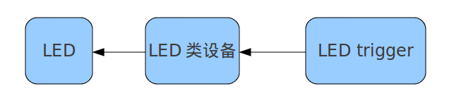
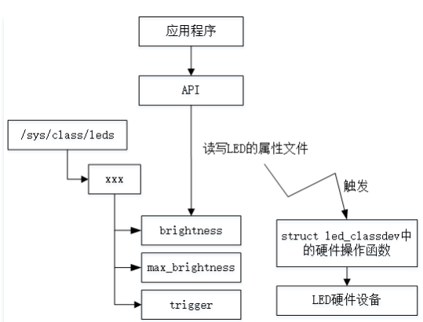

先看树莓派的情况。

```
pi@raspberrypi:/sys/class/leds/led0$ tree
.
├── brightness
├── device -> ../../../soc:leds
├── max_brightness
├── power
│   ├── autosuspend_delay_ms
│   ├── control
│   ├── runtime_active_time
│   ├── runtime_status
│   └── runtime_suspended_time
├── subsystem -> ../../../../../../class/leds
├── trigger
└── uevent

3 directories, 9 files
```

你可以`echo 0> brightness`来把led关闭。

led驱动倒还没有想象的简单。有多了很多的东西。

看drivers/led/leds-bcm6328.c。

# 内核代码分析

关键在于led_classdev_register这个函数。

我还是回到s3c2440的看。

当前这种方式的驱动，没有/dev节点，用户编程要通过sysfs来做。


亮度值是这样的。在linux/leds.h里定义。

```
enum led_brightness {
	LED_OFF		= 0,
	LED_HALF	= 127,
	LED_FULL	= 255,
};
```


```
pi@raspberrypi:/sys/class/leds/led0$ cat trigger 
none kbd-scrollock kbd-numlock kbd-capslock kbd-kanalock kbd-shiftlock kbd-altgrlock kbd-ctrllock kbd-altlock kbd-shiftllock kbd-shiftrlock kbd-ctrlllock kbd-ctrlrlock [mmc0] mmc1 timer oneshot heartbeat backlight gpio cpu0 cpu1 cpu2 cpu3 default-on input rfkill0 rfkill1 
```

看这些会导致led发送变化的原因。

是如何注册进来的呢？

是靠led-triggers.c里的`led_trigger_register_simple`这个函数来注册的。

例如这样：

```
static int __init nand_base_init(void)
{
	led_trigger_register_simple("nand-disk", &nand_led_trigger);
	return 0;
}
```

def_trigger这个属性值得注意。


最后总结一下led、led_classdev、led_trigger的关系：



 也就是说trigger好比是控制LED类设备的算法，

这个算法决定着LED什么时候亮什么时候暗。

LED trigger类设备可以是现实的硬件设备，比如IDE硬盘，也可以是系统心跳等事件。


系统定义了四个默认触发器：

default_on、心跳触发器、硬盘灯触发器、闪烁触发器。

除了硬盘灯触发器，其他触发器没有留从其它内核模块访问的接口。

led子系统的目的主要是给用户空间控制led的。

当然可以定义自己的触发器并留给其它模块访问的接口。


内核中驱动部分维护者针对每个种类的驱动设计一套成熟的、标准的、典型的驱动实现，

并把不同厂家的同类硬件驱动中相同的部分抽出来自己实现好，

再把不同部分留出接口给具体的驱动开发工程师来实现，

这就叫驱动框架。

即标准化的驱动实现,统一管理系统资源，维护系统稳定。

# led驱动框架

## 概述

### （1）LED设备的共性：

1）LED的亮与灭；

2）具有相应的设备节点（设备文件）。

### （2）LED设备的不同点：

1）LED的硬件连接方式不同（GPIO不同）；

2）LED的控制方式不同（低或高电平触发）；

3）其他不同点。

因此，Linux中LED的驱动框架把所有LED设备的共性给实现了，把不同的地方留给驱动工程师去做。

### （3）核心文件：

```javascript
/kernel/driver/leds/led-class.c 
/kernel/driver/leds/led-core.c 
/kernel/driver/leds/led-triggers.c 
/kernel/include/linux/leds.h
```

### （4）辅助文件(根据需求来决定这部分代码是否需要)：

```javascript
/kernel/driver/leds/led-triggers.c 
/kernel/driver/leds/trigger/led-triggers.c 
/kernel/driver/leds/trigger/ledtrig-oneshot.c 
/kernel/driver/leds/trigger/ledtrig-timer.c 
/kernel/driver/leds/trigger/ledtrig-heartbeat.c
```

## 代码分析

subsys_initcall是一个宏，

它的功能是将其声明的函数放到一个特定的段：.initcall4.init。

内核在启动过程中，

内核需要按照先后顺序去进行初始化操作。

因此，内核给是给启动时要调用的所有初始化函数归类，

然后每个类按照一定的次序去调用执行。

这些分类名就叫.initcalln.init，n的值从1到8。

内核开发者在编写内核代码时只要将函数设置合适的级别，

这些函数就会被链接的时候放入特定的段，

内核启动时再按照段顺序去依次执行各个段即可。

module_init()、module_exit()也是一个宏，其功能与subsys_initcall相同，只是指定的段不同。


LED驱动框架使用subsys_initcall宏修饰leds_init()函数，

因此leds_init()函数在内核启动阶段被调用。在led-class.c里。

leds_init()函数的主要工作是：

调用class_create()函数在/sys/class目录下创建一个leds类目录。


leds_class->dev_attrs规定了leds设备类的类属性，

其中的类属性将被sysfs以文件的形式导出至/sys/class/leds目录下，

用户空间通过对这些文件的访问来操作硬件设备。


led_class_attrs结构体数组设置了leds设备类的属性，

即led硬件操作的对象和方法。

分析可知，

leds类设备的操作对象一共由3个

brightness（LED的亮灭状态）、

max_brightness（LED最高亮度值）、

trigger（LED闪烁状态）。

对应的操作规则有读写，即show和store。

这些操作规则内部其实调用了设备体led_classdev内的具体操作函数，

譬如：当用户层试图写brightness这个对象时，会触发操作规则led_brightness_store。


在registerLED设备之前，

需要先定义并初始化一个struct led_classdev结构体变量，

该结构体包含了该LED设备的所有信息。

初始化struct led_classdev结构体变量时，

只需填充如下值即可，其余的在register过程中自动完成填充。


LED设备驱动框架为驱动开发者提供在/sys/class/leds这个类下创建LED设备的接口。

当驱动调用led_classdev_register注册了一个LED设备，

那么就会在/sys/class/leds目录下创建xxx设备，

由sysfs创建该设备的一系列attr属性文件（brightness、max_brightness等）

将被保存至该目录下供用户空间访问。




当用户cat /sys/class/leds/xxx/brightness时，会调用led-class.c中的brightness_show函数。


# 以笔记本的caplock led来分析

```
teddy@thinkpad:/sys/class/leds/input4::capslock$ tree
.
├── brightness
├── device -> ../../input4
├── max_brightness
├── power
│   ├── async
│   ├── autosuspend_delay_ms
│   ├── control
│   ├── runtime_active_kids
│   ├── runtime_active_time
│   ├── runtime_enabled
│   ├── runtime_status
│   ├── runtime_suspended_time
│   └── runtime_usage
├── subsystem -> ../../../../../../../class/leds
├── trigger
└── uevent
```


# rk3308的led

以rk3308的为例。

led对应的设备名字是：rk_led_ctrl。

## 内核里的代码

kernel的配置里，有这2个宏。

CONFIG_LEDS_TRIGGER_MULTI_CTRL=y
CONFIG_LEDS_TRIGGER_CONTROL_RK=y

rk_led_ctrl是一个misc设备。

名字写在ledtrig-control-rk.c文件里。

初始化函数被leds-pwm.c调用。

```
./leds-pwm.c:219:       rk_led_control_init(&pdev->dev,count);
```

当前是配置了3颗led。红绿蓝三种颜色。

在设备树里配置的。


支持的操作

```
#define RK_ECHO_GET_LED_NUM				_IOWR('I', 101, int)
#define RK_ECHO_SET_LED_EFFECT			_IOWR('I', 102, int)
```

定义了灯效数据结构。

```
struct led_effect_data {
	int leds_type;
    int force_bright[LED_NUM_MAX];
    int back_bright[LED_NUM_MAX];
    int bright[LED_NUM_MAX];
	int step_bright[LED_NUM_MAX];
    char data_valid;
    int steps_time;
	struct delayed_work timer_work;
};
```

这个可以实现的灯效还是比较全的。

灯效分类有：

```
2：呼吸灯
3：渐弱。
4：闪烁。
5：exchange
6：marquee
7：light add
8：scroll one。

那些没有翻译的，是因为不知道具体指什么。
0:关闭灯效, 1：常亮 2:呼吸灯效,  3:淡进淡出 4:闪烁灯效 5:互换 6:跑马灯效  7:走马灯效 8：一个灯单色循环
这个是从led_effect.json这个应用层的配置文件里找出来的。

可以看到，驱动里没有处理类型为0和1的灯效。这个估计在应用层就拦截了。
这2个处理倒也简单，直接操作sys下的文件就可以达到目的。
但是其实可以加到驱动里的。

```

重点看看rk_led_ctrl_ioctl这个。

```
ioctl就支持2个命令。
1：获取led数目。
2：设置灯效。
```

简单写一个测试程序。先获取一下led数目看看是否可以生效。

```
#include <stdio.h>
#include <asm-generic/ioctl.h>
#include <fcntl.h>

#define RK_ECHO_GET_LED_NUM				_IOWR('I', 101, int)
#define RK_ECHO_SET_LED_EFFECT			_IOWR('I', 102, int)


int main()
{
	int fd = open("/dev/rk_led_ctrl", O_RDWR);
	if(fd < 0) {
		printf("open rk_led_ctrl fail\n");
		return -1;
	}
	int num = 0;
	int ret = ioctl(fd, RK_ECHO_GET_LED_NUM, &num);
	if(ret < 0) {
		printf("ioctl fail\n");
		return -1;
	}
	printf("get led num:%d\n", num);
	return 0;
}
```

可以正确获取到led数目为3 。

现在看看控制灯效。

```
这需要传递下来的是一个结构体指针：
struct led_effect {
    int period;
    int back_color;
    int fore_color;
    int start;//从哪个等开始。
    int num;//总共点亮几个灯。
    int scroll_num;//跑马灯个数，只对跑马灯灯效有用。其他不填。
    int actions_per_period;//每个周期进行多少次动作。呼吸灯填
    int led_effect_type;
};
```

一个呼吸灯效果的是这样：

```
"led_effect_type": 2,
"back_color": "000000",
"fore_color": "0000FF",
"period": 1000,
"start": 0,
"num": 1,
"actions_per_period": 4
```

```
#include <stdio.h>
#include <asm-generic/ioctl.h>
#include <fcntl.h>
#include <unistd.h>

#define RK_ECHO_GET_LED_NUM				_IOWR('I', 101, int)
#define RK_ECHO_SET_LED_EFFECT			_IOWR('I', 102, int)
struct led_effect {
    int period;
    int back_color;
    int fore_color;
    int start;
    int num;
    int scroll_num;
    int actions_per_period;
    int led_effect_type;
};

int main()
{
	int fd = open("/dev/rk_led_ctrl", O_RDWR);
	if(fd < 0) {
		printf("open rk_led_ctrl fail\n");
		return -1;
	}
	int num = 0;
	int ret = ioctl(fd, RK_ECHO_GET_LED_NUM, &num);
	if(ret < 0) {
		printf("ioctl fail\n");
		return -1;
	}
	printf("get led num:%d\n", num);
	//控制灯效。
	struct led_effect effect = {
		.period = 1000,
		.back_color = 0,
		.fore_color = 0xff,
		.start = 0,
		.num = 1,
		.actions_per_period = 4,
		.led_effect_type =2
	};
	ret = ioctl(fd, RK_ECHO_SET_LED_EFFECT, &effect);
	if(ret < 0) {
		printf("set led effect fail\n");
		return -1;
	}
	return 0;
}
```

上面的代码是实现了蓝牙的呼吸灯效果。


发现一个问题，直接设置颜色，无法结束当前的呼吸灯效果。导致设置常亮时，颜色并不能得到预期的效果。

实际上，驱动里是有处理常亮和灭灯操作的。所以没有必要自己另外去操作sys目录下的文件。而且操作sys文件也没法得到预期效果。

```
switch(leffect->led_effect_type)
        {
            case 0: led_effect_close(leffect);
                break;
            case 1: led_effect_open(leffect);
                break;
            default:break;
        }
```

# trigger的逻辑

以心跳指示这个trigger为例进行分析。

```
static struct led_trigger heartbeat_led_trigger = {
	.name     = "heartbeat",
	.activate = heartbeat_trig_activate,
	.deactivate = heartbeat_trig_deactivate,
};

```


在设备树文件中，d2内容“linux,default-trigger = “heartbeat””，

所以当前触发器为heartbeat，

此时可以观察d2对应的LED灯，正常会每1秒间隔闪烁2次，也就是heartbeat效果。

想要重新设置触发器很简单，使用echo将需要的触发器名称写入trigger文件即可。

> echo timer > /sys/bus/platform/devices/leds/leds/d2/trigger


# 参考资料

1、Linux led子系统

http://www.360doc.com/content/12/0312/20/6828497_193834197.shtml

2、

https://blog.csdn.net/Tommy_wxie/article/details/7622498

3、Linux内核的LED设备驱动框架

https://cloud.tencent.com/developer/article/1600462

4、

https://blog.csdn.net/fengweibo112/article/details/102744366