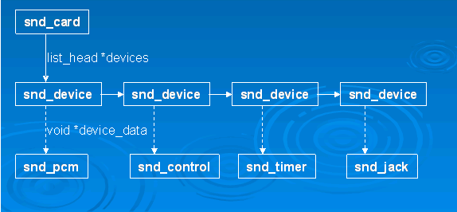
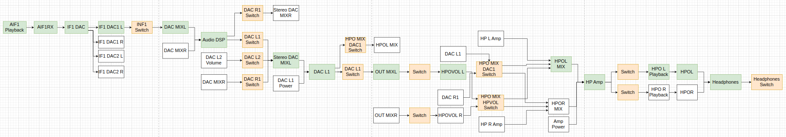
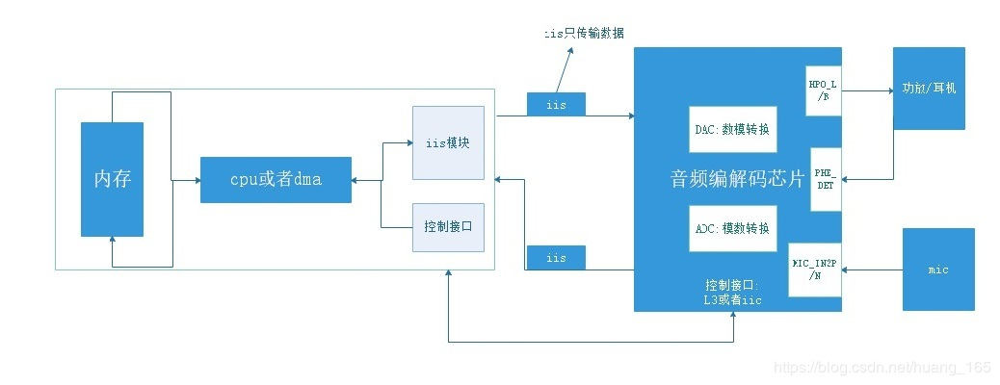

在linux系统中，先后出现了音频设备的3种框架：oss、alsa、asoc。


# 音频设备的硬件接口

出现了3种主要的接口，就是cpu跟音频编解码芯片之间的接口。

1、pcm。脉冲编码调制。

```
1、是最简单的一种接口。
2、由4根线组成：时钟脉冲bclk，帧同步信号fs，数据发送dx，数据接收dr。
3、帧同步信号频率跟采样率一样。
4、pcm接口很容易实现，理论上可以支持任何的数据方案和采样率。
```

2、I2S接口。

```
1、Philips在1980年代发明。
2、由3根线组成，lrclk、bclk、sd。sd是数据收发，半双工的。lrclk为高，左声道，lrclk为低，右声道。
3、I2S更加适合立体声系统。
```

3、ac97接口。

```
1、是1997年，由Intel主导提出的一个方案。
2、比较复杂，但是功能强大。
3、用4根线就可以实现9个音频通道。
```

接口的适用场景：

1、mp3播放器用I2S。

2、移动电话用PCM接口。

3、智能手机、电脑用ac97接口。


# oss音频设备驱动

oss标准中有2个最基本的音频设备：

1、mixer。对应/dev/mixer

驱动重点是ioctl的实现。

2、dsp。对应/dev/dsp

驱动重点是read、write、ioctl、poll的实现。

## oss用户空间编程的例子

实现了录音3秒然后再播放的功能。

```
#define LENGTH 3 //录音的秒数
#define RATE 8000 //采样频率
#define SIZE 8 //量化位数
#define CHANNELS 1 //单声道

unsigned char buf[LENGTH * RATE * SIZE *CHANNELS /8];

int main()
{
    int fd;
    int arg;
    int status;
    fd = open("/dev/dsp", O_RDWR);
    arg = SIZE ;
    ioctl(fd, SOUND_PCM_WRITE_BITS, &arg);
    
    arg = CHANNELS;
    ioctl(fd, SOUND_PCM_WRITE_CHANNELS, &arg);
    
    arg = RATE;
    ioctl(fd, SOUND_PCM_WRITE_RATE, &arg);
    
    while(1) {
        printf("say something...\n");
        read(fd, buf, sizeof(buf));
        printf("what you said: \n");
        write(fd, buf, sizeof(buf));
        
        //等待播放录音完毕、
        ioctl(fd, SOUND_PCM_SYNC, 0);
    }
    return 0;
}
```


# alsa音频设备驱动

## 为什么需要alsa？

因为oss虽然成熟，但是是商业软件，没有开源的。所以linux不再包含它的更新了。

alsa是Advanced Linux Sound Architecture就用来替代oss的。而且比oss更加好用，为用户态编程提供了库文件alsa-lib，不再需要直接进行ioctl这种原始接口相关操作了。但是可以兼容oss。


## alsa组件

1、alsa-driver。非常庞大，代码量达到几十万行以上。

2、alsa-libs。开发包。用户include asoundlib.h，链接libasound.so。

3、alsa-libplugins。插件。

4、alsa-utils。管理工具包。aplay、arecord这些工具。

5、alsa-tools。小程序包。

6、alsa-firmware。特殊音频固件支持包。

7、alsa-oss。兼容oss的模拟层。

上面这些组件只有alsa-driver是必须的。其余都是可选的。


## alsa的用户接口

1、信息接口。/proc/asound。这个是个目录，下面有大概80个文件。

2、控制接口。/dev/snd/controlCX，X取值是0,1等值。

```
树莓派上的情况是这样的。
pi@raspberrypi:/dev/snd$ ls
by-id  by-path  controlC0  controlC1  pcmC0D0p  pcmC0D1p  pcmC1D0c  seq  timer
```

3、音序器接口。seq。

4、定时器接口。timer。

5、pcm接口。

用户程序不要直接使用这些设备，这些是给alsa-lib用的，用户用alsa-lib就好了。


# asoc音频设备驱动

asoc是alsa在soc上的发展和演变。

本质上仍然是alsa，但是进行了这些改动：

1、传统的alsa架构下，同一个音频芯片在不同的CPU下，驱动不同。这个是不符合代码重用的。

2、所以对cpu相关代码和codec相关代码进行了分离。

在嵌入式设备上，推荐用asoc架构的。


## asoc组成

由3个部分组成：

1、codec部分。

2、平台驱动。只关心CPU。

3、板级驱动。

1和2都是可以通用的。


看Linux源代码，可以看到音频相关的驱动，没有像所有其他的驱动那样，放在drivers目录下。

而是在单独的一个sound底层子目录下。

为什么音频驱动这么特立独行呢？

看Linux的历史提交情况看，这个变化是在内核2.5版本开始变化的。

这个时候，开始引入alsa框架，负责人也发生了变化。


看Documentation/sound下面的所有文档。


## Jack-Controls.txt

为什么需要jack kcontrols？

alsa使用kcontrols来export audio的controls到用户空间，包括switch、volume等。

这意味着用户程序例如pulseaudio，可以在检测到耳机拔出的时候，进行关闭耳机，切到音箱的操作。

老的alsa jack代码，只是为每个注册的jack创建了input device，如果不是root身份运行，这些input device不能被用户程序读取。

新的jack 代码，不存在这个问题。


## DAI.txt

DigitalAudio Interfaces (DAI)

AC97, I2S and PCM.

这3个是主要的DAI。

AC97：五根线。在pc声卡上常见。在移动设备上也常见。

reset

out

int

clk

frame

I2S：4根线。在HiFi和移动设备上用得多。

```
Tx
Rx
clk
left/right clock
```

pcm：4根线。跟i2s类似。支持比I2S更加灵活的协议。

## jack.txt

jack的单词含义是：插孔。

jack对应的结构体是：struct snd_soc_jack

alsa有一个标准的api，向用户空间表示一个物理jack。

在include/sound/jack.h里有声明。

CONFIG_SND_JACK 这个配置项。

就5个接口。

```
snd_jack_new
snd_jack_add_new_kctl
snd_jack_set_parent
snd_jack_set_key
snd_jack_report
```

一个jack跟一个snd_card结构体对应起来的。

asoc在普通alsa的基础上，多了2个特性：

1、允许多个jack检测方法一起工作在一个用户可见的jack上。

2、跟DAPM集成。允许DAMP节点基于检测到的jack状态动态更新。

这个是通过把jack从逻辑上分为了3个部分：

1、snd_soc_jack代表了jack自身。

2、snd_soc_jack_pins代表了DAPM节点。

3、提供报告jack状态的机制。

例如，系统有一个立体声耳机插孔，有2个报告机制，一个是耳机的，一个是麦克风的。


DAPM是Dynamic Audio Power Management的缩写，直译过来就是动态音频电源管理的意思，

DAPM是为了使基于linux的移动设备上的音频子系统，**在任何时候都工作在最小功耗状态下**。

**DAPM对用户空间的应用程序来说是透明的，所有与电源相关的开关都在ASoc core中完成。**

用户空间的应用程序无需对代码做出修改，也无需重新编译，

DAPM根据当前激活的音频流（playback/capture）和声卡中的mixer等的配置来决定那些音频控件的电源开关被打开或关闭。

DAPM是**基于kcontrol改进过后的相应框架**，**增加了相应的电源管理机制**，其电源管理机制其实就是按照相应的音频路径，完美的对各种部件的电源进行控制，而且按照某种顺序进行。


了解的顺序

先是看/dev/snd目录下的设备。

然后是struct snd_card结构体。

```
struct list_head devices     记录该声卡下所有逻辑设备的链表
struct list_head controls    记录该声卡下所有的控制单元的链表
void *private_data            声卡的私有数据，可以在创建声卡时通过参数指定数据的大小
```


snd_card_new

snd_device_new，例如jack就是一个device。

sound/drivers/aloop.c 这个是loop声卡，里面就调用了snd_card_new函数。

经过创建后，声卡的逻辑结构是这样的：




每个声卡最多可以包含4个pcm的实例，每个pcm实例对应一个pcm设备文件。

pcm实例数量的**这种限制源于linux设备号所占用的位大小，**如果以后使用64位的设备号，我们将可以创建更多的pcm实例。

不过大多数情况下，在嵌入式设备中，一个pcm实例已经足够了。


ASoC正是为了解决上述种种问题而提出的，目前已经被整合至内核的代码树中：sound/soc。ASoC不能单独存在，他只是建立在标准ALSA驱动上的一个它必须和标准的ALSA驱动框架相结合才能工作。


最重要的头文件就是sound/core.h

这里面定义了结构体：

```
enum snd_device_type
	声卡设备类型枚举。包括：pcm、bus、seq、timer、jack等。
enum snd_device_state
	声卡设备状态。有3种状态：build、registered、disconnected。
struct snd_device 
	这个用途是什么？包含了snd_card指针。
struct snd_card
	这个是主要结构体。
	包含了struct device。
	
snd_card_xx函数
snd_device_xx函数
```

sound/soc.h

这个文件比较长，有1000多行。结构体都是snd_soc_xx格式的。

```
struct snd_soc_card
```

sound/soc/soc-core.c

这个文件比较重要。


声卡的建立流程

# 音频的debugfs

通过 debugfs 文件系统了解音频子系统的状态比较方便，但控制各个 DAPM 小部件的开关则需要其它工具，如 `tinymix` 等。

tinyalsa 可以看作是 ALSA 项目的用户空间程序的简化版本，它包含一个简化版的库，及一些实用的小工具。这些工具包括 `tinyplay`、`tinycap` 和 `tinymix` 等，这几个工具的作用大体与 `aplay`、`arecord` 和 `amixer` 等价。相对于 ALSA 项目的用户空间程序，tinyalsa 的代码更简洁，因而移植和调试分析也就更简单。本文中所做的测试和调试用 tinyalsa 的工具。

要使播放或录制正常运转，通常需要开启 sound card 及 Audio Codec 中相关各个控制接口的开关。如要播放音频，对于 ALC5651，大概有如下这样的音频路由：



https://www.cnblogs.com/wolfcs/p/17653973.html


# DAPM 小部件

DAPM（Dynamic Audio Power Management）是 ALSA（Advanced Linux Sound Architecture）中的一个重要组件，==用于音频设备的功耗管理和控制。==

在 ALSA 中，DAPM 小部件（DAPM Widgets）是==构建音频设备拓扑图==的组成部分。

这些小部件代表了音频设备中的功能单元，

比如声音输入、输出、控制开关、增益等。

DAPM 小部件可以连接在一起形成一个设备的拓扑结构，描述了音频设备内各个组件之间的连接和依赖关系。

DAPM 小部件通常包括以下类型：

1. **Source/Sink**：声音的输入（Source）或输出（Sink）。

2. **Mux/Demux**：多路复用器（Mux）或分解器（Demux），用于选择不同的输入或输出路径。

3. **Switch**：开关，用于控制不同的信号通路。

4. **PGA**：可编程增益放大器，用于调节信号的增益。

5. **Route**：路由，连接不同的信号通路。

DAPM 小部件的连接形成了一个设备的音频路径，

通过这些路径，音频数据可以在各个功能单元之间流动。

通过配置 DAPM 小部件之间的连接关系和依赖关系，可以实现对音频设备的功耗进行管理和控制，

使得在不需要的时候关闭部分功能单元，节省能耗。

总的来说，DAPM 小部件是 ALSA 中用于描述和管理音频设备拓扑结构的重要组成部分，有助于实现动态的音频功耗管理。


这里我们简单提一下dapm：

(1) 当音频路径发生改变（比如上层使用tinymix工具设置音频通路）时，或发生数据流事件（比如启动或停止播放）时，==都会触发dapm去遍历所有邻近的widget==，检查是否存在完整的音频路径，如果存在完整的音频路径，则该路径上面的所有widget都是需要上电的，其他widget则下电；

(2) ==widget的上下电都是dapm根据策略自主控制的，外部无法干预，可以说dapm是一个专门为音频系统设计的自成体系的电源管理模块，独立于Linux电源管理之外。==即使SoC休眠了，codec仍可以在正常工作，试想下这个情景：语音通话，modem dai连接到codec dai，语音数据不经过SoC，因此这种情形下SoC可以进入睡眠以降低功耗，只保持Codec正常工作就行了。


# ALC5651

数据手册

https://item.szlcsc.com/1049415.html

看起来这个东西价格还不便宜。

2012年左右出的芯片，也比较老了。

是一个code芯片。2ch的。

支持输入和输出。

适合在手机和平板上使用。



```
开发板 ：NanoPC-T4开发板
eMMC ：16GB
LPDDR3 ：4GB
显示屏 ：15.6英寸HDMI接口显示屏
u-boot ：2023.04
linux  ：6.3
```


参考资料

1、

https://www.wpgdadatong.com.cn/blog/detail/40887

2、Rockchip RK3399 - Codec驱动（ Realtek ALC5651）

https://www.cnblogs.com/zyly/p/17591411.html


# \#sound-dai-cells

一般这个都是写的0，具体表示什么含义呢？

在 Device Tree（设备树）中，`#sound-dai-cells` 属性用于指定音频设备的 DAI（Digital Audio Interface）单元的数量。DAI 单元描述了音频设备之间的连接和传输方式。

`#sound-dai-cells` 属性的值是一个整数，表示一个 DAI 单元的数量。在这个例子中，`#sound-dai-cells = <0>;` 指定了这个音频设备的 DAI 单元数量为 0。

在 Device Tree 中，通常的表示方式是：

- 如果音频设备之间的连接不需要额外的参数（比如 I2S 传输方式不需要额外的参数），则 DAI 单元数量为 0。
- 如果连接需要额外的参数，比如传输格式、时钟等，就会设置不同的 DAI 单元数量。这些参数通常作为 DAI 单元的子节点属性。

在这个例子中，==由于音频设备可能不需要额外的参数来描述其连接方式，因此设置了 `#sound-dai-cells = <0>;`，表示音频设备之间的连接不需要任何附加的 DAI 参数。==

## \#sound-dai-cells 不为0的情况举例

当 `#sound-dai-cells` 不为 0 时，通常表示需要额外的参数来描述音频设备之间的连接和传输方式。这些额外的参数会作为 DAI 单元的子节点属性来提供。

举个例子，假设一个音频设备需要描述 I2S（Inter-IC Sound）接口的连接，I2S 接口通常需要一些额外的参数，比如传输格式、时钟源等。在设备树中可能会有类似如下的描述：

```yaml
codec: codec@1a {
    #sound-dai-cells = <2>; // 指定了 2 个 DAI 单元

    dai-params {
        #sound-dai-cell;
        // 这里可能会包含 I2S 接口需要的参数
        // 比如传输格式、时钟源、数据位宽等
    };

    cpu: cpu {
        // 其他设备连接的描述
    };
};
```

在这个示例中，`codec` 设备有一个 `#sound-dai-cells = <2>;` 属性，表示该设备需要两个 DAI 单元来描述它与其他设备的连接方式。在 `dai-params` 节点下，可能会包含描述 I2S 接口所需的参数，这些参数可能包括传输格式（比如 I2S、PCM 等）、时钟源、数据位宽等等，以便准确地描述音频设备之间的连接方式和传输特性。

这种情况下，`#sound-dai-cells` 不为 0，意味着需要更多的 DAI 单元来描述音频设备之间的连接，并可能需要提供额外的参数来描述这些连接的细节。

# 总体框架

```
              +--------+  +--------+  +--------+
              |tinyplay|  |tinycap |  |tinymix |
              +--------+  +--------+  +--------+
                   |           ^           ^ 
                   V           |           V
              +--------------------------------+
              |        ALSA Library API        |
              |      (tinyalsa, alsa-lib)      |
              +--------------------------------+
  user space                   ^
-------------------------------|---------------------
  kernel space                 V
              +--------------------------------+
              |           ALSA CORE            |
              | +-------+ +-------+ +------+   |
              | |  PCM  | |CONTROL| | MIDI |...|
              | +-------+ +-------+ +------+   |
              +--------------------------------+
                               |
              +--------------------------------+
              |           ASoC CORE            |
              +--------------------------------+
                               |
              +--------------------------------+
              |        hardware driver         |
              |  +-------+ +--------+ +-----+  |
              |  |Machine| |Platform| |Codec|  |
              |  +-------+ +--------+ +-----+  |
              +--------------------------------+

```


https://blog.csdn.net/zyuanyun/article/details/59170418

# 参考资料

1、为什么Linux的音频驱动位于sound目录下而不是driver/sound？

http://blog.chinaunix.net/uid-30374564-id-5571674.html

2、ALSA声卡驱动的DAPM（一）-DPAM详解

https://www.cnblogs.com/linhaostudy/archive/2018/03/05/8509899.html

3、Linux音频子系统

这个系列文章不错。

https://blog.csdn.net/droidphone/category_1118446.html

4、

https://www.cnblogs.com/hzl6255/p/9979377.html