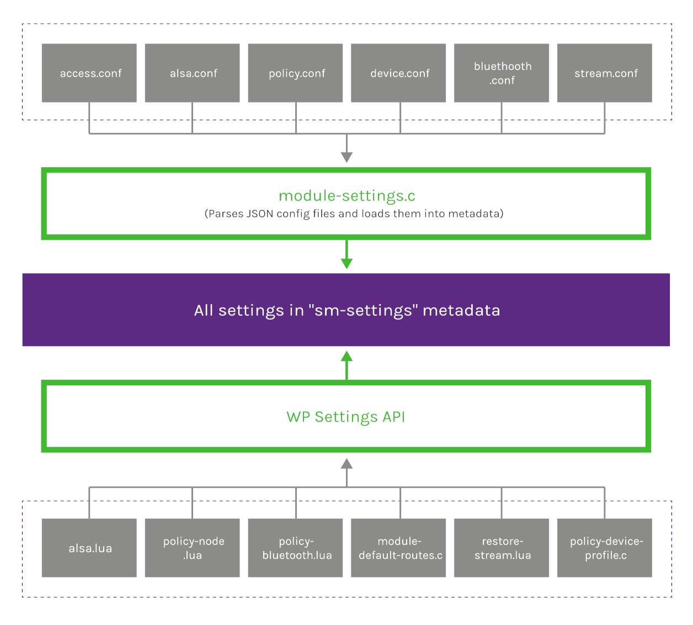

--

# 资源收集

官网文档

https://pipewire.pages.freedesktop.org/wireplumber/

重构wireplumber的配置文件系统：从lua到json

https://www.collabora.com/news-and-blog/blog/2022/10/27/from-lua-to-json-refactoring-wireplumber-configuration-system/

# 简介

PipeWire 的主要目的是充当应用程序和设备之间的中间层。

为此，它为应用程序提供了一种创建媒体流的通用方法，

然后可以将其定向到任何设备或其他应用程序进行播放或捕获。

此功能将 PipeWire 定义为流交换框架。

然而，除了提供创建媒体流的机制外，流交换还需要一种机制来定义谁在与谁交换数据。

换句话说，它需要一种机制来决定哪个应用程序将连接到哪个设备，如何以及何时连接。


在传统设置中，

应用程序可以直接访问设备。

这意味着他们需要自己选择他们想要打开的设备，

并根据他们的媒体要求进行设置（即选择音频采样率、格式、视频分辨率等）。

虽然系统配置可以具有“系统默认”设备（例如在ALSA中），

但在某些设置中并非如此，

这给应用程序开发人员提供了一种配置设备选择的方法。

此外，此类设置不允许设备的透明切换（例如，在播放音乐时将音频播放从笔记本电脑扬声器切换到蓝牙耳机），除非应用程序实现这样做所需的复杂操作。

在某些情况下，另一个问题是设备完全由单个应用程序控制，不允许需要共享设备的更复杂的用例。

最后但并非最不重要的一点是，

访问设备直接增加了应用程序媒体管道的复杂性，以便处理多种设备格式或处理行为异常/非标准设备。


PulseAudio 显著改善了音频应用的这种情况。

在 PulseAudio 中，音频设备在内部打开和配置，音频应用程序可以创建任何所需格式的流，并请求从“默认”设备播放或捕获。

应用程序开发人员不再需要提供配置要使用的设备的方法，尽管如果他们愿意，他们仍然可以这样做。

PulseAudio 在内部维护此“默认”设备首选项，

并自动创建必要的内部链接，

以便在从应用程序传入新流时使工作正常。

可以在运行时更改此默认设备首选项，

并且可以透明地将应用程序流重新存储到另一个设备，从而消除所有复杂性。

然而，这里的问题是，虽然这种逻辑对大多数桌面应用程序来说非常有用，但它不能很好地扩展到其他用例。此外，PulseAudio 不处理视频流......


另一方面是 JACK，它也处理一个特定的用例：专业音频。

JACK 同样允许应用程序只创建流而忘记设备。

但与 PulseAudio 不同的是，它在内部没有实现任何连接逻辑。

这留给一个外部组件：会话管理器。

会话管理器监视应用程序连接或断开连接，

并使用自己的逻辑将它们链接到设备或对等应用程序。

这可能涉及“默认”设备目标，

但它通常遵循一组更复杂的用户可配置规则，

允许灵活地为专业音频应用设置音频处理阶段。

然而，这里的问题是，JACK不能很好地处理典型的桌面用例，并且对于非专业人士来说很复杂。


这让我们回到了 PipeWire......PipeWire将所有这些设计的一部分结合在一起，提供了一个灵活的媒体服务器，可用于实现音频和视频的桌面、嵌入式、专业和非专业用例。

为了获得最大利益，PipeWire 还由会话管理器提供支持，类似于 JACK 中的会话管理器，但具有更多可用功能。


PipeWire 上游有一个非常有限的示例会话管理器。

它是构建新示例的一个很好的示例，

并且具有一些用于基本桌面用例和测试的功能，但它仅此而已。

WirePlumber 作为此示例的替代品，还提供了一个用于构建自定义会话管理器的框架。


WirePlumber 作为会话管理器的主要目标显然是监视来自应用程序的流，并确保它们根据其实现的用例规则链接到适当的设备或对等应用程序。

但是，与 JACK 会话管理器不同，PipeWire 会话管理器具有更多职责。


PipeWire 本身在启动时实际上不会打开任何设备。

它提供了可以执行此操作的组件，

但默认情况下不会在守护程序中加载这些组件。

会话管理器的主要任务是为其感兴趣的设备加载这些组件，并适当地配置设备。


作为会话管理器的一部分是合理的，

因为要探测哪些设备以及如何配置它们的决定特定于用例。

汽车的音频硬件需要与台式机的声卡不同的配置。


WirePlumber 提供了一个处理监控设备的模块，该模块适用于实现spa_device接口的所有 PipeWire 设备监控组件。

这包括 ALSA、V4L2 和 bluez5 显示器。

此外，它还提供了一个模块来加载特殊的“JACK”设备，

该模块允许 PipeWire 作为 JACK 音频服务器的客户端运行。


PipeWire 非常重视安全性，并默认假设所有应用程序都是不可信的。

在内部，它提供了一个类似于UNIX文件系统上的权限系统，

允许在客户端可以通过其IPC协议访问的所有对象上设置读取，写入和执行（rwx）位。

没有访问对象所需权限的客户端无法对其执行任何恶意操作。


因此，会话管理器的另一项任务是对客户端进行身份验证并授予它们适当的权限。

WirePlumber 为此提供了一个模块，

尽管在撰写本文时，该模块是虚拟的，并且没有进行适当的权限管理;

它只是授予所有客户端对所有对象的完全访问权限。

不过，有计划为 AGL 和桌面正确实现这一点，敬请期待。


PipeWire 在内部使用称为“节点”的组件图来表示媒体流，

这些组件相互链接。

这些是上图中的紫色和绿色框。

节点抽象处理逻辑，

并提供一种将数据传入和传出 PipeWire 的方法，将处理委托给客户端或设备。


在管理此图时，通常需要将多个节点作为单个实体一起管理，以提供更复杂的功能。

例如，在音频设备上运行的音频 DSP 滤波器将由直接链接到该音频设备节点的节点表示。

然后，希望其音频通过该筛选器的应用程序应将其节点与筛选器节点（而不是设备节点）链接。

这增加了任何组件的复杂性，无论哪个组件决定在哪里链接什么，因为它现在需要对这个过滤器的操作有特定的了解。

此外，这不适用于 pavucontrol 或 GNOME 的声音设置等配置 UI，

这些 UI 是围绕应用程序直接连接到设备的概念构建的，两者之间没有任何内容。


另一个问题是，在现代系统中，流通常与用例相关联。

这在桌面系统上并不明显，

但想想你的手机。

传递音乐的音频流与传递通知或警报声音的音频流是分开的，

它们带有单独的音量控制和策略，

包括它们是否可听见、是否被强调（所有其他流都静音或躲避到较低的音量）等......

类似的属性也适用于视频流，

例如，用于在屏幕上实时预览的相机源与用于视频录制的源和用于静止图像（照片）捕获的源具有不同的编码和分辨率。


虽然这听起来可能并不复杂，但在嵌入式系统中，将流与用例相关联可能非常复杂。

例如，在纯软件中，音频用例的实现只是对应用程序流进行分类，并根据策略配置调整其音量控制或链接状态。

然而，在嵌入式中，所有这些都是在专用的硬件 DSP 上实现的，

该 DSP 通过不同的路径接收所有流，

并在硬件中应用所有混音、音量变化、效果和策略。

因此，控制此硬件的操作变得特定于设备，

这意味着 CPU 端的会话管理器需要为策略配置提供一个抽象层，以便在不同的设备上类似地工作。


所有这些问题都可以在 WirePlumber 中通过实现某些称为端点的对象来解决。

端点，就像节点一样，也相互链接，形成一个图。

它们中的每一个都代表一个用户可以想象的位置，

媒体可以在其中路由到/路由到/传出（例如一对扬声器或蓝牙耳机的麦克风），并提供一组端点流，

这些端点流表示可以到达该位置的逻辑路径，通常与用例相关联。


此端点图（在文档中也称为“会话管理图”）的目的是提供一种从更高层次的角度查看节点图的方法，该视角涉及用户可以理解的用例和目标。

这样可以更轻松地编写策略和其他配置，使用户能够了解特定于设备的详细信息，并专注于此配置将提供的实际用户体验。


最后但并非最不重要的一点是，WirePlumber 提供了一个模块，该模块根据用户可配置的策略规则在端点之间创建链接。

这是它作为会话管理器的主要目标。

不幸的是，当前的策略配置方式并不像我们希望的那样灵活，

尽管它是编写策略管理模块的第二次尝试。

在不久的将来，我的计划是尝试使用基于 lua 的脚本来描述此策略。

这个主题将在以后的博客文章中进一步讨论，所以我将在这里保持简短。


在上面所有关于 WirePlumber 功能的文本中，

我都提到它提供了提供功能的“模块”。

这是 WirePlumber 的一个关键设计方面。

每个功能都是一个模块，

它基于共享库构建，具有通用功能和接口，允许模块协同工作。

WirePlumber 的公共库基于 GObject，

它允许轻松实现与其他语言的绑定。

虽然当前的模块都是用 C 语言编写的，但存在允许以不同语言实现它们的机制。


# wireplumber是什么

WirePlumber 是 PipeWire 的一个强大的会话和策略管理器。

基于模块化设计，使用实现实际管理功能的 Lua 插件，具有高度可配置性和可扩展性。

安装 wireplumber 软件包。它将与其他 PipeWire 会话管理器冲突，并确保它们已卸载。

WirePlumber 的配置由全局 PipeWire 风格的 JSON 对象组成，

例如 `context` 和 `alsa_monitor` 经过修改以更改其行为。

配置文件从 `~/.config/wireplumber/` （用户配置）、

 `/etc/wireplumber/` （全局配置）

和 `/usr/share/wireplumber/` （库存配置）中读取。

WirePlumber 首先读取主配置文件。

这是一个类似 JSON 的文件，

用于设置 PipeWire 上下文、SPA 插件、模块和组件。

在这些组件中，Lua 脚本引擎用于动态修改全局对象。

单实例配置文件位于 `/usr/share/wireplumber/wireplumber.conf` .这是默认配置，它包括一个进程中所有其他配置的功能。


配置 WirePlumber 的推荐方法

是将 SPA-JSON 文件添加到 

 `~/.config/wireplumber/` 

`/etc/wireplumber/` 相应 `wireplumber.conf.d/` 目录。

需要考虑的一些事项是：

如果要覆盖现有配置，请将其从 `/usr/share/wireplumber/` 目标复制到目标，同时保持其名称相同。具有相同名称但位于较低优先级位置的配置文件将被忽略。

否则，如果要添加新配置，则应以大于 50 的数字（例如 `51-my-config.conf` ）开头，因为默认配置主要以字母数字顺序等于或低于 50 完成。

# wireplumber的启动方式

**context.exec**

字典数组。数组中的每个条目都是字典，其中包含要在启动时执行的程序的路径和可选参数。

此数组曾经包含用于启动会话管理器的条目，但此后此操作模式已降级为开发辅助。避免在生产环境中以这种方式启动会话管理器。

==就直接手动执行wireplumber命令启动就可以。==


# 配置

WirePlumber 是一个高度模块化的守护进程。

==就其本身而言，除了加载其配置的组件之外，它不执行任何操作。==

实际的管理逻辑是在这些组件内部实现的。

启动时，WirePlumber 读取其配置文件（与其可能具有的所有片段相结合）并加载所选配置文件中指定的组件。

这配置了操作上下文。

==然后，这些组件接管并驱动整个守护进程的操作。==

## 配置文件

从 WirePlumber 0.5 开始，这是 WirePlumber 读取以加载配置的唯一文件（及其片段 - 见下文）。

过去，WirePlumber 还用来读取从 `wireplumber.conf` 引用的 Lua 配置文件，所有繁重的工作都是在 Lua 中完成的。

现在情况不再是这样，并且不再支持 Lua 配置文件。请参阅从 0.4 迁移配置。

请注意，Lua 仍然是 WirePlumber 的脚本语言，但它仅用于实际脚本编写，而不用于配置。

### spa json格式

此配置文件的格式是 JSON 的变体，

也用于 PipeWire 配置文件（也称为 SPA-JSON）。

该文件由一个未显式键入的全局 JSON 对象和一个部分列表组成，

这些部分本质上是该全局 JSON 对象的键值对。

每个部分通常是一个 JSON 对象，但也可以是一个 JSON 数组。

SPA-JSON 是标准 JSON 的超集，因此任何有效的 JSON 文件也是有效的 SPA-JSON 文件。但是，它比标准 JSON 更宽松。首先，它允许输入不带引号的字符串（ `"` ），除了标准的 `:` 作为键和值之间的分隔符 。这可以使其看起来类似于 INI 文件或人们熟悉的其他自定义配置格式，从而使用户更容易阅读和编辑。


就像 PipeWire 一样，WirePlumber 支持配置片段。

这意味着主配置文件可以拆分为多个文件，

所有这些文件都将被加载并合并在一起。

==这对于允许用户自定义其配置而无需修改主文件非常有用。==

## 配置的section

| 配置名字         | 说明                                                         |
| ---------------- | ------------------------------------------------------------ |
| components       | 一个数组，列出了 WirePlumber 可以加载的组件。                |
| componetns.rules | 也是数组，里面是修改components的一些规则                     |
| profiles         | 可以加载的配置文件，就类似蓝牙的profile那种概念，是一系列配置的组合。目前只有一个main profile。 |
| settings         | 修改wireplumber的行为                                        |
| settings.schema  | 验证修改                                                     |
| 其他             |                                                              |

另外，还有libpipewire来读取并发送给pipewire的部分。

```
context.properties
context.spa-libs
context.modules

```

### 组件类型

组件的主要类型有：

script/lua

一种 Lua 脚本，通常包含一个或多个事件挂钩和/或其他自定义逻辑。这是主要的组件类型，因为 WirePlumber 的业务逻辑主要是用 Lua 编写的。

module

WirePlumber 模块，它是一个可以动态加载的共享库。模块通常提供一些供脚本使用的捆绑逻辑或 WirePlumber 与外部服务之间的一些集成。

pw-module

PipeWire 模块，也是一个可以动态加载的共享库，但扩展了底层 libpipewire 库的功能。在 WirePlumber 上下文中加载 PipeWire 模块对于加载自定义协议扩展或从 PipeWire 守护程序卸载某些功能非常有用。

virtual

虚拟组件只是加载目标，可用于通过定义依赖关系来引入其他组件。它们本身不提供任何功能。请注意，此类组件没有“名称”。

built-in

这些组件是已内置到 WirePlumber 库中的功能部件。他们主要提供内部支持元素和检查。


添加片段以修改默认配置的最简单方法是创建一个名为 `~/.config/wireplumber/wireplumber.conf.d` 的目录并将片段放置在那里。

所有片段文件都需要具有 `.conf` 扩展名，并且必须是有效的 SPA-JSON 文件。片段按字母数字顺序加载，因此您可以通过相应命名来控制它们的加载顺序。建议使用数字前缀作为文件名，例如 `10-my-fragment.conf` 、 `20-my-other-fragment.conf` 等，以便您可以轻松控制它们的加载顺序。

如果您不想附加新规则，而是用新规则覆盖整个数组，则可以通过在数组名称上使用 `override.` 前缀来实现：

```
override.monitor.alsa.rules = [
  {
    matches = [
      {
        device.name = "~alsa_card.*"
      }
    ]
    actions = {
      update-props = {
        api.alsa.use-ucm  = false
      }
    }
  }
]
```

## alsa配置

ALSA 监视器是 WirePlumber 的组件之一。

==该监视器负责为系统上可用的所有 ALSA 卡创建 PipeWire 设备和节点。==

它还管理这些设备的配置。

ALSA 监视器默认启用，可以使用配置文件中的 `monitor.alsa` 功能禁用。

与所有设备监视器一样，该监视器作为 SPA 插件实现，

并且是 PipeWire 的一部分。 

**WirePlumber 只是加载插件并让它完成工作。**

然后，该插件监视 UDev 并为系统上可用的所有 ALSA 卡创建设备和节点对象。

> 这里值得记住的一件事是，在 ALSA 中，“卡”代表物理声音控制器设备，而“设备”是逻辑访问点，代表卡的一部分的一组输入和/或输出。在 PipeWire 中，“设备”直接相当于 ALSA“卡”，而“节点”几乎相当于（接近，但不完全）ALSA“设备”。

### acp

```
monitor.alsa.properties = {
  alsa.use-acp = true
}
```

这将探测设备并配置可用的配置文件、端口和混音设置。

用于执行此操作的代码直接来自 PulseAudio，

提供看起来和感觉完全像 PulseAudio 设备的设备。

跟ACP对等的一个配置是UCM。


## 蓝牙配置

# 会话管理

PipeWire 会话管理器是一个负责做很多事情的工具。

许多人将“会话管理器”一词理解为负责管理节点之间链接的工具，

但这只是众多任务之一。

要了解其整个操作，我们需要首先讨论 PipeWire 的工作原理。

当 PipeWire 启动时，

它会加载在其配置文件中定义的一组模块。

这些模块为 PipeWire 提供功能，

否则它只是一个不执行任何操作的空进程。


正常情况下，PipeWire启动时加载的模块包含对象工厂，

以及允许进程间通信的本机协议模块。

==除此之外，PipeWire 并不真正加载或执行任何其他操作。==

==这是会话管理开始的地方。==


会话管理基本上就是设置 PipeWire 来做一些有用的事情。

这是通过利用 PipeWire 公开的对象工厂来创建一些有用的对象，

然后使用它们的方法来修改并随后销毁它们来实现的。

这些对象包括设备、节点、端口、链路等。

==这项任务需要持续监控和采取行动，==

==对系统使用过程中发生的大量不同事件做出反应。==


WirePlumber 构建在 libwireplumber 库之上，

该库提供了用于表达所有会话管理逻辑的基本构建块。

 Libwireplumber是用C语言编写的，

基于GObject，包装了PipeWire API，

并提供了更高级别和更方便的API。

虽然 WirePlumber 守护程序实现会话管理逻辑，

但也可以在 WirePlumber 守护程序范围之外使用底层库。

这允许创建与 PipeWire 交互的外部工具和 GUI。


该库基于 GObject，具有自省功能，可以在任何支持 GObject 自省的语言中使用。该库还可以作为 C API 提供。


PipeWire 通过 IPC 协议公开多个对象，

例如节点和端口，

其方式很难使用标准面向对象原理进行交互，因为它是异步的。

例如，当创建一个对象时，它的存在是通过协议宣布的，但其属性稍后在辅助消息上宣布。

如果某些东西需要对此对象创建事件做出反应，它通常需要访问对象的属性，

因此它必须等到属性被发送。

这样做可能听起来很简单，而且确实如此，

但是在任何地方都这样做而不是专注于编写实际的事件处理逻辑，这会成为一个乏味的重复过程。


==WirePlumber 的库通过创建代理对象来解决这个问题，==

这些代理对象在每个对象的生命周期中缓存从 PipeWire 接收的所有信息和更新。

然后，它通过 WpObjectManager API 使它们可用，该 API 能够等到某些信息（例如属性）已缓存在每个对象上后再宣布。


Lua 脚本实现了大部分会话管理。 

libwireplumber API 在 Lua 中提供，具有惯用的绑定，这使得编写会话管理逻辑变得非常容易。

选择Lua是因为它是一种非常轻量级的脚本语言，适合嵌入。

它也非常容易学习和使用，并将其绑定到 C 代码。

然而，WirePlumber 可以轻松扩展以支持 Lua 以外的脚本语言。

==整个Lua脚本系统是作为一个模块实现的。==


会话管理就是对事件做出反应并采取必要的操作。这就是为什么 WirePlumber 的逻辑全部构建在事件和钩子上。

## session管理的内容

### 设备启用

启用设备是操作的一个基本领域。

它是通过使用设备监视器对象（或简称“监视器”）来实现的，

这些对象通常作为 PipeWire 中的 SPA 插件实现，

但由 WirePlumber 加载。

他们的任务是发现可用的媒体设备并在 PipeWire 中创建提供与它们交互的方式的对象。

### 设备配置

从计算机的角度来看，大多数设备都具有复杂的功能，

需要对其进行管理才能提供简单流畅的用户体验。

例如，出于这个原因，音频设备被组织成配置文件和路由，

这允许将它们设置为服务于特定的用例。

这些需要由会话管理器进行配置和管理。

### 权限控制

当客户端应用程序连接到 PipeWire 时，

它们需要获得权限才能访问 PipeWire 公开的对象并与其交互。

在某些情况和配置中，会话管理器还负责决定应向每个客户端授予哪些权限。

### node配置

节点是媒体处理的基本元素。

==它们通常由设备监视器或客户端应用程序创建。==

当它们被创建时，它们处于无法链接的状态。

链接它们需要一些配置，

例如配置媒体格式以及随后应公开的端口的数量和类型。

此外，可能需要根据用户偏好设置与节点相关的一些属性和元数据。

所有这些都由会话管理器负责。

### link管理

当节点最终准备好使用时，

会话管理器还负责决定如何将它们链接在一起以便媒体能够流动。

例如，音频播放流节点很可能需要链接到默认音频输出设备节点。

然后，会话管理器还需要==创建所有这些链接并监视可能影响它们的所有条件，==

以便在发生变化时（例如，如果设备断开连接）可以进行动态重新链接。

在某些情况下，由于创建或销毁链路，设备和节点配置也可能需要更改。

### 元数据管理

在操作过程中，PipeWire 和 WirePlumber 都将有关对象及其操作的一些附加属性

存储在这些对象外部的存储中。

这些属性称为“元数据”，

它们存储在“元数据对象”中。

该元数据可以通过 pw-metadata 等工具从外部进行更改，也可以通过其他工具进行更改。

在某些情况下，此元数据需要与会话管理器内部的逻辑进行交互。

最值得注意的是，

选择默认音频和视频输入和输出是通过设置元数据来完成的。

然后，会话管理器需要验证此信息，存储它并在下次重新启动时恢复它，但还要确保在动态插入和拔出设备时默认输入和输出保持有效和合理。


# lua

WirePlumber 使用 Lua 版本 5.4 来实现其引擎。对于较旧的系统，还支持 Lua 5.3。

==可以使用该 `wpexec` 工具运行脚本。==

WirePlumber 的脚本引擎将 lua 脚本沙盒到一个安全的环境中。

在此环境中，以下规则适用：

* 脚本是相互隔离的;一个脚本中的全局变量在另一个脚本中不可见，即使它们实际上是在同一个 `lua_State` 脚本中执行的
* 保存 API 方法的表不可写。虽然这听起来可能很奇怪，但标准 Lua 允许您更改标准 API，例如 `string.format = rogue_format` 在沙盒之外有效。WirePlumber 不允许这样做。
* 标准 Lua API 仅限于安全函数的子集。例如，不允许与文件系统 （io.*） 和进程状态 （例如：os.exit） 交互的函数
* 对象方法不会在公共表中公开。要调用对象方法，您必须使用 Lua 的方法调用语法，即 `object:method(params)`

例如，以下内容无效：

```
-- this will cause an exception
local node = ...
Node.send_command(node, "Suspend")

```

正确的形式是这样的：

```
local node = ...
node:send_command("Suspend")
```


为 WirePlumber 脚本提供支持的 Lua 引擎提供了与 GObject 的直接集成。

您将在 lua 脚本中处理的大多数对象都是包装 GObjects。

为了使用脚本，您首先需要对 GObject 的基本概念（例如信号和属性）有一个基本的了解。

所有 GObject 都具有属性的能力。

在 C 语言中，我们通常使用 g_object_get 来检索它们，g_object_set 来设置它们。

在 WirePlumber 的 lua 引擎中，这些属性作为 Lua 对象的对象成员公开。

GObjects 还具有将事件传递到外部回调的通用机制。

这些事件称为信号。

要连接到信号并处理它，您可以使用 connect 方法：


# wpctl命令

```
Usage:
  wpctl [OPTION?] COMMAND [COMMAND_OPTIONS] - WirePlumber Control CLI

Commands:
  status 
  inspect ID
  set-default ID
  set-volume ID VOL
  set-mute ID 1|0|toggle
  set-profile ID INDEX
  clear-default [ID]
```

## status

没有播放音乐的时候，

```
PipeWire 'pipewire-0' [1.1.81, root@buildroot, cookie:4213201345]
 └─ Clients:
        32. WirePlumber                         [1.1.81, root@buildroot, pid:4004]
        33. WirePlumber [export]                [1.1.81, root@buildroot, pid:4004]
        54. wpctl                               [1.1.81, root@buildroot, pid:5921]

Audio
 ├─ Devices:
 │      36. Built-in Audio                      [alsa]
 │      37. Built-in Audio                      [alsa]
 │  
 ├─ Sinks:
 │      38. Built-in Audio Stereo               [vol: 0.74]
 │  *   40. Built-in Audio Analog Stereo        [vol: 0.74]
 │  
 ├─ Sink endpoints:
 │  
 ├─ Sources:
 │      39. Built-in Audio Stereo               [vol: 0.74]
 │  *   41. Built-in Audio Analog Stereo        [vol: 0.74]
 │  
 ├─ Source endpoints:
 │  
 └─ Streams:

Video
 ├─ Devices:
 │  
 ├─ Sinks:
 │  
 ├─ Sink endpoints:
 │  
 ├─ Sources:
 │  
 ├─ Source endpoints:
 │  
 └─ Streams:

Settings
 └─ Default Configured Node Names:
```

用pw-play播放音乐后

```
# wpctl status
PipeWire 'pipewire-0' [1.1.81, root@buildroot, cookie:4213201345]
 └─ Clients:
        32. WirePlumber                         [1.1.81, root@buildroot, pid:4004]
        33. WirePlumber [export]                [1.1.81, root@buildroot, pid:4004]
        54. pw-cat                              [1.1.81, root@buildroot, pid:13101]
        56. wpctl                               [1.1.81, root@buildroot, pid:13116]

Audio
 ├─ Devices:
 │      36. Built-in Audio                      [alsa]
 │      37. Built-in Audio                      [alsa]
 │  
 ├─ Sinks:
 │      38. Built-in Audio Stereo               [vol: 0.74]
 │  *   40. Built-in Audio Analog Stereo        [vol: 0.74]
 │  
 ├─ Sink endpoints:
 │  
 ├─ Sources:
 │      39. Built-in Audio Stereo               [vol: 0.74]
 │  *   41. Built-in Audio Analog Stereo        [vol: 0.74]
 │  
 ├─ Source endpoints:
 │  
 └─ Streams:
        55. pw-play                                                     

Video
 ├─ Devices:
 │  
 ├─ Sinks:
 │  
 ├─ Sink endpoints:
 │  
 ├─ Sources:
 │  
 ├─ Source endpoints:
 │  
 └─ Streams:

Settings
 └─ Default Configured Node Names:
```

## inspect

```
# wpctl inspect 36
id 36, type PipeWire:Interface:Device
    alsa.card = "0"
    alsa.card_name = "AML-AUGESOUND"
    alsa.driver_name = "amlogic_snd_soc"
    alsa.id = "AMLAUGESOUND"
    alsa.long_card_name = "AML-AUGESOUND"
    api.acp.auto-port = "false"
    api.acp.auto-profile = "false"
    api.alsa.card = "0"
    api.alsa.card.longname = "AML-AUGESOUND"
    api.alsa.card.name = "AML-AUGESOUND"
    api.alsa.path = "hw:0"
    api.alsa.use-acp = "true"
    api.dbus.ReserveDevice1 = "Audio0"
  * client.id = "33"
  * device.api = "alsa"
    device.bus-path = "/sys/devices/platform/auge_sound/sound/card0"
  * device.description = "Built-in Audio"
    device.enum.api = "udev"
    device.form-factor = "internal"
    device.icon-name = "audio-card-analog"
  * device.name = "alsa_card._sys_devices_platform_auge_sound_sound_card0"
  * device.nick = "AML-AUGESOUND"
    device.plugged.usec = "3764562"
    device.string = "0"
    device.subsystem = "sound"
    device.sysfs.path = "/devices/platform/auge_sound/sound/card0"
  * factory.id = "15"
  * media.class = "Audio/Device"
    object.path = "alsa:acp:AMLAUGESOUND"
  * object.serial = "36"
```

## set-default

https://forum.manjaro.org/t/how-do-i-permanently-set-the-default-audio-device-in-manjaro-xfce-with-pipewire/117967/18

这个人想要做的事情跟我的一样，就是想用wpctl来设置默认的sink设备。

但是看起来他没有得到答案。

## settings

```
wpctl settings --save device.routes.default-sink-volume 0.5
```

可以在配置文件里写：

```
wireplumber.settings = {
  device.routes.default-sink-volume = 0.5
}
```


# wpexec

这个是用来执行lua脚本的。相当于一个lua解释器。

随便写一个test.lua，

```
print("hello pw")
```

wpexec test.lua

可以打印，但是会卡住不会自动退出。


# debug 日志

```
wpctl set-log-level D     # enable debug logging for Wireplumber
wpctl set-log-level -     # restore default logging for Wireplumber

wpctl set-log-level 0 4   # enable debug logging for Pipewire daemon
wpctl set-log-level 0 -   # restore default logging for Pipewire daemon
```


```
WIREPLUMBER_DEBUG=2,wp-registry:4,pw.*:4,m-*:4
```

从 WirePlumber 0.3 开始，不再使用 `G_MESSAGES_DEBUG` ，因为 libwireplumber 替换了默认的日志处理程序。

这样启动日志打印比较详细。

```
WIREPLUMBER_DEBUG=4 wireplumber
```


# 运行多个实例

WirePlumber 能够作为单个实例守护程序或多个实例运行，这意味着可以有多个进程，每个进程执行不同的任务。

为了实现多实例设置，可以多次启动 WirePlumber，并在每个实例中加载不同的配置文件。这可以通过使用 `--profile` 命令行选项来选择要加载的配置文件来实现：

```
$ wireplumber --profile=custom
```

当未指定特定配置文件时，将加载 `main` 配置文件。

为了使其更易于使用，提供了一个模板 systemd 单元，该单元以配置文件的名称作为模板参数启动：

```
$ systemctl --user disable wireplumber # disable the "main" instance

$ systemctl --user enable wireplumber@policy
$ systemctl --user enable wireplumber@audio
$ systemctl --user enable wireplumber@camera
$ systemctl --user enable wireplumber@bluetooth
```


# 板端配置文件分析


# wireplumber优点和缺点

## 优点

WirePlumber是专门为GNOME设计的，

这使得它在与GNOME桌面环境集成方面表现出色。

它能够更好地支持GNOME的特性和用户体验。

==WirePlumber支持使用LUA脚本来实现设置和配置规则，==

==这使得用户可以根据自己的需求进行高度定制。==

这种灵活性对于需要复杂配置的用户来说是一个显著优势。

WirePlumber被认为是PipeWire的新一代会话管理器，它结合了PulseAudio和JACK的功能，并增加了视频处理的能力。

WirePlumber可以在多种Linux发行版上安装和配置，包括基于Arch、Ubuntu/Debian等系统的支持。这使得它能够覆盖更多用户群体。

WirePlumber支持蓝牙MIDI设备，这是其在多媒体设备支持方面的一个重要优势。此外，它还支持压缩解码离载，这可以在某些设备上提高性能。

## 缺点

尽管WirePlumber提供了高度的自定义能力，但这也可能导致较高的学习曲线。对于不熟悉LUA脚本的用户来说，配置和维护可能会比较困难。

WirePlumber是为GNOME设计的，因此它可能不适用于所有类型的Linux系统，特别是那些不使用GNOME桌面环境的系统。

相比于一些成熟的框架，如Phonon，WirePlumber可能在社区和文档支持方面还有待提升。新用户可能需要花费更多时间来解决问题。

WirePlumber在灵活性、集成度和功能性方面具有显著优势，但同时也存在一定的局限性和挑战。


WirePlumber 使用 Lua 脚本来实现节点和连接管理的方式

主要体现在其对 Lua 的集成和应用上。

这种集成允许 WirePlumber 利用 Lua 的灵活性和高效性来进行复杂的配置和管理任务。

WirePlumber 的设计包括了对 Lua 脚本的使用，

这些脚本可以用于实现设置和配置规则，

如设备和流的设置和配置，以及基于流的元数据和系统的管理 。

这表明 Lua 脚本在 WirePlumber 中扮演着核心角色，特别是在处理和管理 PipeWire 会话方面。

通过这些 API，开发者可以编写自定义的 Lua 脚本来满足特定的需求，从而实现更细粒度的控制和管理。

总结来说，WirePlumber 中的 Lua 脚本通过提供一个强大且灵活的编程环境，使得用户和开发者能够有效地管理节点和连接。


就是这样！WirePlumber 现在已经检测到我们的 ALSA 接收器和源，并将它们作为节点添加到 PipeWire 图中。它将检测我们添加到图形中的源节点，并将它们链接到 ALSA 接收器节点，输出音频供我们的耳朵欣赏。


与 WirePlumber 的交互将使用 `wpctl` CLI 工具完成。它允许人们使用 `wpctl status` .WirePlumber 控制输出音频的主要方法是设置默认接收器，这可以使用 `wpctl set-default $ID` . `set-volume` 和 `get-volume` `set-mute` 命令公开音量控制。例如，以下是将当前输出音量提高 10% 所需的命令： `wpctl set-volume @DEFAULT_SINK@ 10%+` 。


这2个命令可以用的。有效果。

```
wpctl set-volume @DEFAULT_SINK@ 10%+

wpctl get-volume @DEFAULT_SINK@ 
```


把wireplumber里跟alsa有关系的日志拷贝出来分析。


```
opening fragment file:  /usr/share/wireplumber/wireplumber.conf.d/alsa-vm.conf
	打开这个配置片段文件。看里面内容是就是一个match pci的声卡的。
map factory regex 'api.alsa.*' to 'alsa/libspa-alsa
	映射factory，来自于context.spa-libs配置
 loaded plugin:'/usr/lib/spa-0.2/alsa/libspa-alsa.so'
 	然后就把so载入了。
  loading component 'monitor.alsa.reserve-device [virtual]'
    这个是因为被alsa wants了。
 s-monitors alsa.lua:351:createMonitor: Activating ALSA monitor
 	lua脚本里创建alsa monitor。
 	查找到路径是/usr/share/wireplumber/scripts/monitors/alsa.lua
  section 'monitor.alsa.rules' is used as-is from '/usr/share/wireplumber/wireplumber.conf.d/alsa-vm.conf'
  	从这里读取rules
load lib:'alsa/libspa-alsa' factory-name:'api.alsa.enum.udev'
loaded plugin:'/usr/lib/spa-0.2/alsa/libspa-alsa.so'
../spa/plugins/alsa/alsa-udev.c:712:check_access: /dev/snd/pcmC0D4c accessible:1
	C0D4是loopback-a。为什么最先是这个？
check_access: /dev/snd/pcmC0D4c accessible:1
check_pcm_device_availability: card 0 has 8 PCM device(s)
check_pcm_device_availability: card 0 pcm device pcm0c free
check_pcm_device_availability: card 0 pcm device pcm0p free
check_pcm_device_availability: card 0 pcm device pcm1c free
check_pcm_device_availability: card 0 pcm device pcm1p free
check_pcm_device_availability: card 0 pcm device pcm2c free
check_pcm_device_availability: card 0 pcm device pcm3c free
check_pcm_device_availability: card 0 pcm device pcm3p free
check_pcm_device_availability: card 0 pcm device pcm4c free
emit_added_object_info:     device.bus-path = "/sys/devices/platform/auge_sound/sound/card0"
find_match: 'node.name' fail '(null)' < > '~alsa_input.pci.*'
	这个是不是因为不存在pci接口的声卡？是的。但是没有关系。
Enabling the use of ACP on alsa_card._sys_devices_platform_auge_sound_sound_card0
check_access: /dev/snd/pcmC1D1c accessible:1
emit_added_object_info:     device.bus-path = "/sys/devices/platform/snd_aloop.0/sound/card1"
	loopback声卡的。
Enabling the use of ACP on alsa_card._sys_devices_platform_snd_aloop.0_sound_card1
../spa/plugins/alsa/alsa-acp-device.c:1065:impl_init: probe card hw:0
Unable to find the top-level configuration file '/usr/share/alsa/ucm2/ucm.conf'.
snd_use_case_mgr_open: error: failed to import AML-AUGESOUND use case configuration -2

pa_config_parse: Parsing configuration file '/usr/share/alsa-card-profile/mixer/profile-sets/default.conf'
	这个文件是存在的，是ini格式的。
 spa.alsa confmisc.c:1377:snd_func_refer: Unable to find definition 'cards.0.pcm.front.0:CARD=0'
 	然后接下来就是根据从default.conf读取的各种配置进行解析。
 	大部分都是无效的。
 pa_alsa_open_by_device_string: Trying hw:0,0 with SND_PCM_NO_AUTO_FORMAT 
 	这样依次打开关闭所有的设备。
```

```
Registering DBus media endpoint: /MediaEndpointLE/BAPSource/lc3
Registering DBus media endpoint: /MediaEndpointLE/BAPSink/lc3
Registering DBus media endpoint: /MediaEndpointLE/BAPBroadcastSource/lc3
Registering DBus media endpoint: /MediaEndpointLE/BAPBroadcastSink/lc3
Registering DBus media endpoint: /MediaEndpoint/A2DPSource/aac
Registering DBus media endpoint: /MediaEndpoint/A2DPSink/aac
Registering DBus media endpoint: /MediaEndpoint/A2DPSource/sbc
Registering DBus media endpoint: /MediaEndpoint/A2DPSink/sbc
Registering DBus media endpoint: /MediaEndpoint/A2DPSource/sbc_xq
Registering DBus media endpoint: /MediaEndpoint/A2DPSink/sbc_xq
Registering DBus media endpoint: /MediaEndpoint/A2DPSource/faststream
Registering DBus media endpoint: /MediaEndpoint/A2DPSource/faststream_duplex


wp_state_save: <WpState:0x13df5d0> saving state into /.local/state/wireplumber/default-routes


```

# /.local/state/wireplumber/

```
/ # ls /.local/state/wireplumber/
default-routes     stream-properties
```

这里列出的 `/.local/state/wireplumber/` 目录包含了 WirePlumber 的一些状态信息和配置文件。让我们看一下这些文件的含义：

- **default-routes**: 这个文件可能包含 WirePlumber 当前的默认路由配置。默认路由是指当没有特定路由配置时，WirePlumber 将音频流路由到的默认目的地。可以在这个文件中查看或修改默认路由配置。

- **stream-properties**: 这个文件可能包含了 WirePlumber 当前正在运行的音频流的属性信息。音频流属性描述了每个音频流的特征和配置。你可以在这个文件中查看或修改音频流的属性。

这些文件可能是 WirePlumber 在运行过程中生成和维护的。通过查看这些文件，你可以了解当前 WirePlumber 的配置和状态信息，以及对其进行必要的调整和管理。

# @DEFAULT_SINK@

```
src/tools/wpctl.c:124:  if (allow_def_audio && (g_strcmp0(arg, "@DEFAULT_SINK@") == 0 ||
```

所以这个不是什么特殊的语法，就是一个写死的字符串而已。


WirePlumber 首先读取主配置文件。

这是一个类似 JSON 的文件，

用于设置 PipeWire 上下文、SPA 插件、模块和组件。

==在这些组件中，Lua 脚本引擎用于动态修改全局对象。==

单实例配置文件位于 `/usr/share/wireplumber/wireplumber.conf` .这是默认配置，它包括一个进程中所有其他配置的功能。

配置 WirePlumber 的推荐方法是将 SPA-JSON 文件添加到 或 `~/.config/wireplumber/` 中的 `/etc/wireplumber/` 相应 `wireplumber.conf.d/` 目录。需要考虑的一些事项是：

如果要覆盖现有配置，请将其从 `/usr/share/wireplumber/` 目标复制到目标，同时保持其名称相同。具有相同名称但位于较低优先级位置的配置文件将被忽略

否则，如果要添加新配置，则应以大于 50 的数字（例如 `51-my-config.conf` ）开头，

因为默认配置主要以字母数字顺序等于或低于 50 的文件中完成。

```
wpctl status
查看到默认的sink是48
然后用 wpctl inspect 48 查看信息
```

选择 `device.name` or `node.name` 属性以用于 Lua 配置脚本中 `matches` 的规则。

避免使用 `device.id` ，它是动态的，经常变化。

例如，要更改 ALSA 节点的描述，您需要创建一个文件，例如：

```
/etc/wireplumber/wireplumber.conf.d/51-device-rename.conf (or ~/.config/wireplumber/wireplumber.conf.d/51-device-rename.conf)
monitor.alsa.rules = [
  {
    matches = [
      {
        node.name = "alsa_output.pci-0000_00_1f.3.output_analog-stereo"
      }
    ]
    actions = {
      update-props = {
        node.description = "Laptop"
      }
    }
  }
]
```

# 修改一个alsa节点的名字

例如，要更改 ALSA 节点的描述，您会创建一个文件，如：

```
/etc/wireplumber/wireplumber.conf.d/51-device-rename.conf
```

```
monitor.alsa.rules = [
  {
    matches = [
      {
        node.name = "alsa_output.pci-0000_00_1f.3.output_analog-stereo"
      }
    ]
    actions = {
      update-props = {
        node.description = "Laptop"
      }
    }
  }
]
```

如果要更改蓝牙节点或设备上的某些内容，可以创建一个文件

创建这样的一个文件：

```
/etc/wireplumber/wireplumber.conf.d/52-bluez-rename.conf 
```

内容：

```
monitor.bluez.rules = [
  {
    matches = [
      {
        node.name = "bluez_output.02_11_45_A0_B3_27.a2dp-sink"
      }
    ]
    actions = {
      update-props = {
        node.nick = "Headphones"
      }
    }
  }
]
```

# lua配置切换到json

https://www.collabora.com/news-and-blog/blog/2022/10/27/from-lua-to-json-refactoring-wireplumber-configuration-system/

使用 Lua 作为配置语言有一些优势，

因为它可以轻松且直接地与 Lua 代码和 C 代码集成。

此外，基于规则/条件的设置实现（这是 PipeWire 的特色，即其中的每个实体都是一个对象，每个对象都有属性，这些属性可以用于应用设置）在 Lua 中实现起来非常简便。

然而，存在一些明显的缺点。

举几个例子：

设置无法在运行时更改，因为它们是静态设置，用户可以进行覆盖，但这既不优雅也不直观，而且使用模式验证配置几乎是不可能的。

就其价值而言，我非常享受使用 Lua 作为脚本语言和配置系统。然而，是时候告别将其用作配置系统了。


经过深思熟虑，我们决定使用 PipeWire 的 JSON 语法来定义设置。

这克服了 Lua 配置的缺点，并在整个 PipeWire 生态系统中提供了一种更统一的配置方法。


PipeWire 的 JSON 语法是 JSON 的一种变体，称为“SPA JSON”，它是 PipeWire 内置的。

SPA JSON 解析器是一个非常轻量级的解析器，

主要忽略所有中间字符，

因此可以解析各种变体，包括严格的 JSON。


现在回到新的 JSON 配置系统。

设置现在在主配置文件（wireplumber.conf）中的新部分 "wireplumber.settings" 下定义。

这个部分不是作为一个整体定义的，

而是分布在不同的设置文件（*.conf）下，

位于 `wireplumber.conf.d/` 下。

WirePlumber 将在启动时浏览这些文件并将其缝合在一起。


每个 conf 文件是一个设置、模块和脚本的逻辑分组。

例如：以下是 `device.conf` ，其中包含所有设备相关的配置。

```
# Settings to Track/store/restore user choices about devices

wireplumber.settings = {
  # Below syntax defines key-value pair style settings.
  device.use-persistent-storage = true
  device.auto-echo-cancel = true
  device.echo-cancel-sink-name = echo-cancel-sink
  device.echo-cancel-source-name = echo-cancel-source

  # Below syntax defines a rule/condition based settings.
  device.rules = [
    {
      matches = [
          # Matches all devices
          { device.name = "~*" }
      ]
      actions = {
        update-props = {
          profile_names = "off pro-audio"
        }
      }
    }
  ]
}

# WirePlumber modules and scripts are also loaded from the config files.
wireplumber.components = [
  { name = libwireplumber-module-default-nodes , type = module }
  { name = policy-device-profile.lua, type = script/lua }
]
```

为了方便熟悉 Lua 配置的用户，我整理了以下表格，映射了旧的 Lua 配置文件及其对应的新的 JSON 配置文件：

| Old Lua config file 旧的 Lua 配置文件                        | New JSON config file 新 JSON 配置文件 |
| ------------------------------------------------------------ | ------------------------------------- |
| 10-default-policy.lua                                        | policy.conf                           |
| **40-device-defaults.lua, 50-default-access-config.lua 40 ** | device.conf                           |
| 40-stream-defaults.lua                                       | stream.conf                           |
| 20-default-access.lua                                        | access.conf                           |
| **30-alsa-monitor.lua, 50-alsa-config.lua**                  | alsa.conf                             |
| 30-libcamera-monitor.lua, 50-libcamera-config.lua            | libcamera.conf                        |
| 30-v4l2-monitor.lua, 50-v4l2-config.lua                      | v4l2.conf                             |

您可能已经注意到，在某些情况下，两个 Lua 配置文件（如上加粗所示）被合并成一个 JSON 配置文件。

我们希望这将使功能模块化大为简化。

现在让我们来看看这个新的 JSON 配置系统的系统特性和设计，以及客户端功能。


启动时，WirePlumber 从 .conf 文件==加载所有设置到名为 "sm-settings" 的 PipeWire 元数据对象中。==

Lua 脚本、模块和 WirePlumber 客户端可以使用 PipeWire 元数据工具和 API 在运行时更改设置。

正如您可能知道的，这些命令也可以从命令提示符中发出。

```
pw-metadata -n sm-settings 0 "policy.default.move" true Spa:String:JSON
pw-metadata -n sm-settings 0 "device.echo-cancel-source-name" "echo-cancel-source-bal" Spa:String:JSON
```

上述命令不仅在运行时更改设置，而且还会实时应用到 WirePlumber 上，如下面的部分所解释的。


Lua 脚本、模块或 WirePlumber 客户端，

如果对任何设置感兴趣，也可以订阅回调以了解设置的变化。

这使它们不仅能够知道设置的变化，还可以实时应用这些变化。

让我举个例子来强调这一点。

你必须知道，WirePlumber 会保存流的属性（音量、静音状态等）。

现在，你可以使用以下命令关闭此行为的运行时，无需重启/重置。真棒，不是吗？

```
pw-metadata -n sm-settings 0 stream.restore-props false Spa:String:JSON
```


轻松的用户自定义是这次整个操作最方便的结果。

听起来太正式了？

让我把事情放在合适的角度。

比如说，如果一个用户想要自定义 WirePlumber 的流设置。

他们需要复制流配置文件（ `/usr/share/wireplumber/40-stream-defaults.lua` ），更改他们需要的部分，然后将其放置在 `/etc/wireplumber/40-stream-defaults.lua` ，并重新启动 WirePlumber。

WirePlumber 总是加载这个新的配置文件，而忽略默认的配置文件。

那么，如果这个文件在上游发生了变化呢？

在这种情况下，一旦 WirePlumber 升级，用户很可能会遇到麻烦。

今天，override功能在配置文件级别工作。

override将此扩展到单个设置级别。

这意味着用户只能触及他们感兴趣的设置。我们希望这将使分发包构建者的工作更加轻松。

WirePlumber 设置将遵循 PipeWire 和 WirePlumber 配置的其余部分相同的语法。

换句话说，WirePlumber 设置与其他 PipeWire 配置一样。


如果用户/客户端希望在运行时更改设置（使用 pw-metadata，如在动态设置中所解释的），我们建议考虑启用持久行为（或简单地持久性），这样设置更改将被保存到状态文件中，并在重新启动后被记住。


当持久性启用时，设置将仅从配置文件中读取一次，对于后续重启，将从状态文件中初始化。

请注意，持久性默认是禁用的。

可以通过以下设置在 wireplumber.conf 中启用它。

```
wireplumber.settings = {
  persistent.settings = true
}
```


使用 WirePlumber 库构建的客户端现在能够透明地访问 WirePlumber 守护进程当前正在运行的运行时设置。

向您提出另一种可能性，

用户现在可以在 .conf 中添加新的设置，

或者通过 pw-metadata，

并从他们的脚本/模块中开始查询它们，围绕这些设置构建逻辑。

构建这种开发者友好的功能正是我们持续前进的动力。


JSON 设置允许我们针对模式进行验证。这一功能已被考虑在内，但不会包含在新系统的第一版中，因为还需要更多的工作来完成它。



如您所见，与 Lua 相比，我们不得不构建了大量的基础设施。我个人在这项工作上已经进行了 2-3 个月。我们相信这一切都是值得的，因为上面描述的功能非常丰富。

# WirePlumber 的事件分发器

https://www.collabora.com/news-and-blog/blog/2023/06/15/wireplumber-event-dispatcher-new-simplified-way-handling-pipewire-events/

事件调度器是一种自定义的 PipeWire 事件调度机制，

旨在解决 WirePlumber 中的许多基本问题。

这个想法是由我的同事兼导师乔治·基亚加达基斯提出的，

他是 WirePlumber 的主要作者，我有幸与他合作。

乔治不仅提出了这个想法，

还对核心 WirePlumber 库（libwireplumber）进行了所有更改，以支持这种机制。

当他接近完成核心更改时，他向我们介绍了这个想法。

我立即认识到这个想法的价值，

并很高兴他让我将所有 Lua 脚本和 WirePlumber 模块移植到新的事件分发器。

我们已经在这个项目上工作了将近七个月。

在这个过程中，我移植了所有脚本和模块，并对核心事件分发器做了一些关键的修改。

完成所有这些工作后，我觉得 WirePlumber 已经成熟，现在准备好处理任何实际世界的问题。


PipeWire 保持一组对象的集合，

如设备、节点、端口和链接，

这些对象通过本地 Unix 套接字上的协议进行查询和更新。

尽管协议本身是同步的，

==但在获取或更新对象信息时，往往需要多个连续的协议调用，==

这意味着任何操作可能需要非平凡的时间。

在此期间，其他 PipeWire 客户端也可能查询和/或更新相同的对象，

从单个客户端的角度来看，这会导致并发问题。

为了解决这些问题，WirePlumber 已被设计为==通过异步对象 API 隐藏协议的复杂性==。

然后，该 API 被模块和脚本消费，用于构建与 PipeWire 对象交互的逻辑。


不幸的是，这个 API 有一些限制。

首先，为了接收这些对象、模块和脚本上的事件通知，需要注册回调。

尽管 WirePlumber 是单线程的，

但没有机制保证这些回调执行的顺序。

这意味着需要对相同事件做出反应的不同模块可能会以随机顺序触发。

其次，对任何 PipeWire 对象进行更改会启动异步操作。

通常，这些更改需要在某些事件的响应下进行，但由于存在多个在相同事件上做出反应的回调在不同模块中，因此有可能所有回调都会开始对同一个 PipeWire 对象进行类似的更改，而没有等待彼此完成。

这可能导致操作之间的干扰，引发问题，并需要额外的处理来防止这些问题。


这个问题通过一个例子解释得更好。

考虑一个新的设备（例如，USB 耳机）连接到系统。

然后，ALSA 设备监控器在 PipeWire 上创建一个新的设备对象。

这在 WirePlumber 中表现为一个新的设备添加信号，触发 policy-device-profile.lua 脚本，该脚本选择并设置设备的配置文件。

在同一信号下，另一个脚本（policy-device-routes.lua）启用设备的路由（即子设备路径，如声音卡上的扬声器或耳机）。

然而，路由依赖于配置文件，

因此理想情况下，首先需要选择配置文件。

否则，路由脚本将为初始设备配置文件选择路由，当第一个脚本更改配置文件时，需要重新评估路由。


当配置被选择时，设备监控器开始创建一个或多个节点，

对应于个人输入和输出（例如，扬声器和麦克风）。

这会产生一个或多个新的节点添加信号。

然后，触发 restore-stream.lua 脚本检查节点是否为流，以便恢复之前存储的流属性，如音量、静音状态、通道映射和通道音量。

在同一信号上，module-default-nodes.c 模块重新计算默认输出和输入，

而 create-item.lua 脚本创建一个会话项对象来控制这个节点。


不幸的是，设备监控器不会等待policy-device-profile.lua   脚本选择配置文件，可能会提前为初始设备配置创建节点。

这意味着，在新添加的节点开始执行其逻辑时，节点实际上可能会被销毁和重新创建，导致所有操作都需要再次执行。


最终，当会话项创建时，会触发一个会话项创建信号，

启动 policy-node.lua 脚本重新扫描图，

并可能将一些节点连接在一起（例如，流节点与设备节点）。

此脚本的逻辑取决于已选择的默认接收器和源。

然而，不能保证 module-default-nodes.c 会更早完成其操作，因此需要检查以确保 policy-node.lua 不将流连接到旧的默认接收器或发送器。

可以看到，有很多信号处理器在监听相同的信号并启动可能相互干扰的操作。

这种情况导致了许多竞态条件，

并需要丑陋的补丁作为解决方法（主要策略脚本，policy-node.lua，充满了这些补丁）。

这也导致了代码中的大量冗余，因为在不同的地方进行了类似的检查。

## 优雅的解决方案：事件分发器

为了解决这个问题，我们提出了一种新的方法：事件调度器。

这种新的机制将所有 PipeWire 事件信号转换为事件对象，

并将这些事件对象推入具有预定义优先级编号的优先队列中。

然后根据这些事件的优先级进行分发，从而实现执行顺序的可预测性。


不同于直接在 pipewire 对象上注册回调的先前方法，

现在所有信号处理器都作为挂钩对象实现，

它们会自己向队列中的事件注册。

这些挂钩之间存在依赖关系，这确保了它们执行的顺序也是可预测的。


钩子可能是同步或异步的。

同步意味着它们只包含一个执行任务并立即完成操作的函数。

异步意味着它们包含多个函数，并对可能需要一些时间才能完成操作的对象执行操作。


在任何情况下，事件分发器只允许一次运行一个挂钩。

对于异步挂钩，这意味着在执行另一个挂钩之前，整个操作需要完成。

这确保了操作之间没有干扰。

事件对象是瞬态的，

意味着它们是响应 PipeWire 事件创建的，

它们被放置在优先队列中，并在分发后被销毁，即所有注册的挂钩都已执行。

另一方面，挂钩对象是持久的，意味着它们总是与事件调度器注册，并等待事件。


每个钩子都可以声明对特定事件的兴趣。

当钩子对事件“感兴趣”时，

意味着 Interest 对象上声明的属性与事件的属性相匹配。

当事件被推入队列时，

对这个事件“感兴趣”的钩子被收集到事件对象上的一个列表中，

并根据它们的相互依赖性进行排序。

当事件被分发时，收集到的钩子将按列表中出现的顺序一个接一个地执行。


事件调度器还支持抢占。

允许更高优先级的事件中断并优先于当前正在处理的较低优先级事件。

在事件处理过程中，

一旦特定事件的钩子执行完毕，

事件调度器会检查队列中是否还有更高优先级的事件等待处理。

如果有，事件调度器会切换当前正在处理的事件，开始执行更高优先级事件相关的钩子。


当乔治第一次提出这个想法时，我们花了些时间去理解。

它需要一些思考。

为了帮助你理解这一点，下面的简短视频演示了在常见场景中事件分发器的工作方式：蓝牙自动切换。

在这个场景中，蓝牙耳机已经连接并设置为 A2DP 配置文件，该配置文件具有高质量音频但麦克风被禁用。

然后，用户开始使用 Zoom 通话，需要音频输入。

WirePlumber 然后自动将耳机切换到 HFP 配置文件，该配置文件允许麦克风工作。


事件调度器不仅解决了我们面临的主要问题，

而且还从根本上改变了我们处理 WirePlumber 的 Lua 脚本的方式。

我们现在将每个脚本视为响应事件的挂钩，

这些事件由响应相同事件的不同挂钩执行一系列操作的一部分。

==这使我们能够将 WirePlumber 想象为响应各种事件的挂钩集合，==

对决策和操作产生微小的影响。


我们已经回顾并重新整理了所有主要任务和脚本，

如 restore-stream、default-nodes、policy-node 等，

通过事件调度器的视角审视它们。

在这个过程中，我们有机会对其进行清理，移除大量 hack，

并将其分解为更小、更易于管理的部分。

结果是 Lua 代码模块化、用户可配置，并且易于扩展。

在我的下一篇文章中，我可能会更详细地讨论策略清理的话题。


这是一个挂钩，

它使用之前挂钩选择的默认 sink 或 source，

并通过更新 PipeWire 元数据来应用它。

目前，这个任务由 WirePlumber 模块，module-default-nodes.c 完成，这个模块不太模块化。

```
SimpleEventHook {
  name = "default-nodes/apply-default-node",
  after = { "default-nodes/find-best-default-node",
            "default-nodes/find-echo-cancel-default-node",
            "default-nodes/find-selected-default-node",
            "default-nodes/find-stored-default-node" },
  interests = {
    EventInterest {
      Constraint { "event.type", "=", "select-default-node" },
    },
  },
  execute = function (event)
    local source = event:get_source ()
    local props = event:get_properties ()
    local def_node_type = props ["default-node.type"]
    local selected_node = event:get_data ("selected-node")

    local om = source:call ("get-object-manager", "metadata")
    local metadata = om:lookup { Constraint { "metadata.name", "=", "default" } }

    if selected_node then
      local key = "default." .. def_node_type

      Log.info ("set default node for " .. key .. " " .. selected_node)

      metadata:set (0, key, "Spa:String:JSON",
          Json.Object { ["name"] = selected_node }:to_string ())
    else
      metadata:set (0, "default." .. def_node_type, nil, nil)
    end
  end
}:register ()
```

这是钩子的解剖结构

- 每个钩子都有一个 `name` 。
- 钩子排序（排序）使用 `after` / `before` 标签控制，灵感来源于 systemd，可以列出必须在当前钩子之前或之后执行的其他钩子的名称，分别对应。
- 钩子可以表示其 `interests` 来选择它们响应的事件。 `EventInterest` 表使用与 `WpObjectInterest` API 相同的 API，该 API 也用于 `ObjectManager` 今天。约束不仅限于事件类型，还可以列出导致此事件的对象的属性，允许更复杂的筛选。
- 每个钩子都有一个主体功能，并被赋予指向 `event` 的引用。这是为了简单的（同步）钩子。异步钩子有一个状态机，其主体包含多个函数。
- 每个钩子最终都是一个对象，被 `register` 事件分发器绑定。

审视这个钩子，

想象一下，如果你想影响选择默认接收器的逻辑。而不是编辑现有的脚本，

你可以在自己的 Lua 源文件中编写你的逻辑作为钩子。

添加 `before = "default-nodes/apply-default-node"` 标签和 `after` 标签，列出所有其他上游钩子（如上所示），就完成了！

你的钩子现在将在显示的钩子执行之后，所有其他选择逻辑已经执行完毕，执行。

在主体函数中，你现在有机会在应用到元数据之前改变选择的默认接收器，而无需更改上游的任何代码。

今天，所有这些逻辑都集中在单一的模块（module-default-nodes.c）中，进行这样的干预需要你理解所有内容并进行更改。


# 探索使用事件分发器的 Lua 脚本

这是关于即将发布的 WirePlumber 0.5 版本的一系列博客文章中的第三篇。

前两篇讨论了配置系统重构以及新事件调度器的介绍。

最新的一篇探索了 WirePlumber 的 Lua 脚本如何通过事件调度器进行转换。

WirePlumber lua 脚本通过事件分发器进行转换，

它们看起来和感觉完全不同。

它们更加模块化和可扩展，几乎没有重复处理，

并且几乎没有 hack。

传统上，它们使用对象管理器 API，正如上一篇博客文章中解释的原因，我们已经将它们转移到了事件分发器。

现在，它们是一系列响应适当事件的挂钩。

对于 WirePlumber 的所有系统脚本（如 policy-node.lua，default-nodes，restore-stream，monitor/alsa.lua 等），

您可以在 PipeWire Media Session 项目中找到它们的.c 对应版本。

在 WirePlumber 的初期，我们将这种 C 逻辑翻译成了 Lua；

当然，这是在考虑了 WirePlumber 元素如 Object Manager 的情况下。

但是随着 Event Dispatcher 的出现，它们已经不再是原来的模样。

在本文中，我将分解它们发生了什么变化。


policy-node.lua 是主要的链接脚本。

它就像整个 pipewire 交响乐的指挥，

因此，为了应对任务的复杂性，它能够从一个单一的 lua 源文件中实现如此多的功能。

让我尽量简洁地总结一下它的功能。

它寻找新启动的流，新增的设备，以及用户偏好的变化，

并重新扫描图形，即扫描所有可连接的节点并连接它们，以便媒体开始通过管道流动（而不是 PipeWire :)）。

整个复杂性都从一个单一的文件中处理，即 policy-node.lua 文件，

主要集中在其中的一个单一函数，即 handleLinkable 函数。

让我尝试概述这个函数的功能。

handleLinkable 尝试为给定的流节点（例如 pw-play/pw-cat 客户端节点）找到目标节点；

为此，它首先查找用户首选的目标，然后是默认目标。

如果两者都不可用，它会查找可用目标中最好的一个。

最后，它准备并链接它们，因此代码并不模块化。


再加上，有很多技巧和相当多的冗余处理。

所有 WirePlumber 模块和脚本都注册了对象管理器回调。

有时它们会为同一个回调注册（例如 node-added，default-nodes-changed）。

由于无法控制这些回调执行的顺序，

模块和脚本被迫添加冗余检查和处理。

由于链接脚本处理这种类型的许多通用对象管理器，

它注册了如此多的回调，

因此存在许多这些冗余检查和处理，

例如 scheduleRescan()被多次调用，从代码的不同部分调用。


这段是 WirePlumber 不太令人愉快的部分。

从我之前的工作公司来，

WirePlumber/PipeWire 的代码和设计看起来相当整洁，

但 rescan()的处理方式对我来说难以接受。

它被调用的事件太多，大多数时候函数会空手而归。

也就是说，它没有进行处理，

更糟糕的是，在处理过程中，由于未满足某些条件或出现了需要中止当前处理的新回调，它会在中途退出。

经常，它会自行排队进行重新扫描并退出，这是设计平庸的典型迹象，

因此，当我们有机会自己清理混乱时，感觉更加满足和值得挽回。


有时，链接脚本会在对象管理器回调中改变对象管理器中 Pipewire 对象的属性/状态，

而其他一些脚本可能依赖于相同对象的状态，

因此代码容易出现像这种情况的竞态条件。

解决这些情况的方法是使用 hack。


当我进行了冗余处理时，

一有扫描事件突然触发，

这就是问题的关键。

在事件分发器的帮助下，现在扫描事件被转换为事件，并被赋予最低优先级，这意味着在处理完所有更高优先级的事件后，它才有机会执行，也就是在所有混乱都平息之后。

欢迎查看上一篇博客中的这个视频，以了解它是如何实现的。


因此，Link放到最后才进行，消除了大部分冗余处理。

policy-node.lua被拆分成多个模块。


rescan.lua 对于重新扫描事件注册了一个挂钩，

该事件的优先级最低，

并为特定的源流节点（例如 pw-play/pw-cat 客户端节点）触发一个 `select-target` 事件。

请注意，只有在处理更高优先级事件（如节点添加/移除等）之后才会捕获重新扫描事件。

如果这让你感到困惑，我再次建议你观看视频来理解其中的关联。


select-event 遍历 `find*`钩子，用来选择target。

选择的目标被准备（prepare-link.lua）并最终链接（link-target.lua）。

有三个 find 钩子，

- 第一个（find-defined-target.lua）寻找定义的目标，
- 如果没有定义的目标，第二个钩子出现并检查定义的目标（find-default-target.lua）。
- 如果目标仍然找不到，第三个钩子（find-best-target.lua）帮助选择最佳目标。


所有钩子按照上述顺序运行，

这得益于它们内置的优先级机制。

钩子使用 `before` 和 `after` 标签定义（灵感来源于 systemd）。

对于更详细的钩子解析，请参阅我们之前的博客文章（查找“一个示例钩子”部分）


用户可以通过选择正确的事件

并使用正确的优先级针对此事件注册自定义挂钩，

从而覆盖 WirePlumber 的默认处理方式。

只需在单独的 Lua 源文件中添加这个新挂钩，

然后在 wireplumber.conf 中添加一条记录。

然后，你的挂钩就会被执行，而无需更改任何上游代码的一行。


例如，find-user-target.lua.example 是一个示例挂钩，

展示了如何添加自定义方法来选择链接的目标。

这是一个针对 select-target 事件注册的挂钩，它将是此事件的第一个挂钩运行。


应用相似的推理，剩余的系统脚本，

如默认节点模块、设备配置选择脚本和设备路由选择脚本，也逻辑地分解为重新扫描、查找和应用。


WirePlumber 用户脚本是一些从较小到相当大的 Lua 代码片段，

主要使用对象管理器编写，这里有一大堆示例。

如果你还没有尝试过，你应该试一试，这是一种通过 WirePlumber Lua API 利用 PipeWire 功能非常简单的方法。


这些脚本只需使用 `wpexec` 运行。

另一种方法是将它们复制到 src/scripts 文件夹，

并在 wireplumber.conf 中添加一条记录。

使用 wpexec，它作为单独的进程运行，

在后一种方法中，它作为 WirePlumber 服务的一部分运行。


现在，对于这种使用场景，我们建议继续使用对象管理器。

然而，如果用户对影响 WirePlumber 守护进程逻辑感兴趣，例如链接、默认节点、配置文件、路由等，我们邀请他/她通过事件和挂钩来实现。

借助事件分发器，WirePlumber 可以轻松地被覆盖或扩展。


您可能希望同时向板载和外部设备输出声音，

即使外部设备不总是插在插孔中也是如此。

为了实现这一目标，我们创建了一个虚拟节点，

该节点始终存在，无论插入了什么硬件。

然后，每当它们被插入时，我们将瞬态硬件（例如 USB 耳机）链接到虚拟节点。

首先创建一个脚本，在登录时运行（这通常可以通过您的窗口管理器的启动功能完成）。

/usr/local/sbin/create-virtual-sink.sh

```
#!/bin/bash

# Create a new sink called Simultaneous Output
pw-cli create-node adapter '{ factory.name=support.null-audio-sink node.name="Simultaneous Output" node.description="Simultaneous Output" media.class=Audio/Sink object.linger=true audio.position=[FL FR] }'

# Connect the normal permanent sound card output to the new sink
pw-link "Simultaneous Output:monitor_FL" alsa_output.pci-0000_05_04.0.analog-stereo:playback_FL
pw-link "Simultaneous Output:monitor_FR" alsa_output.pci-0000_05_04.0.analog-stereo:playback_FR

# Switch the default output to the new virtual sink
wpctl set-default `wpctl status | grep "\. Simultaneous Output" | egrep '^ │( )*[0-9]*' -o | cut -c6-55 | egrep -o '[0-9]*'
```

在上述示例中，最初唯一的输出设备是我们普通的内部声卡（alsa_output.pci-0000_05_04.0.analog-stereo）。你可以通过运行 `wpctl status` 和 `wpctl inspect` 来找到你的卡的标识符。

当您的 USB 耳机插入时，运行以下脚本以将它们链接到虚拟接收器：

link-virtual-sink-headphones.sh

```
#!/bin/bash
# link the virtual sync to your headphones should run when detected by UDEV

# wait a second for the drivers to load
sleep 1s

# link the headphones to your virtual sink
sudo -u user1 env XDG_RUNTIME_DIR=/run/user/1000 pw-link "Simultaneous Output:monitor_FL" alsa_output.usb-Kingston_HyperX_Cloud_Flight_S_000000000001-00.analog-stereo:playback_FL
sudo -u user1 env XDG_RUNTIME_DIR=/run/user/1000 pw-link "Simultaneous Output:monitor_FR" alsa_output.usb-Kingston_HyperX_Cloud_Flight_S_000000000001-00.analog-stereo:playback_FR

# finish and return the code for success
exit 0
```

理想情况下，您会在插入耳机时自动运行此脚本。

Udev 页面上的说明描述了如何为此创建自定义规则。

（请注意，您不能直接运行此脚本 - 因为 UDEV 将在指定的脚本运行后才加载驱动程序。因此，您需要有一个中间脚本，使用一些 nohup 技巧或其他类似方法。）

您还需要修改上述脚本，使 XDG_RUNTIME_DIR 与您的用户 ID 号匹配，并将 user1 替换为您的用户名。

# 一些技巧

如果 WirePlumber 的设置被破坏，可以删除所有用户设置：

```
$ systemctl --user stop wireplumber.service
$ rm -r ~/.local/state/wireplumber # deletes settings
$ systemctl --user start wireplumber.service
```


提高音量，上限为 150%：

```
$ wpctl set-volume -l 1.5 @DEFAULT_AUDIO_SINK@ 5%+
```

降低音量：

```
$ wpctl set-volume @DEFAULT_AUDIO_SINK@ 5%-
```

静音/取消静音音量：

```
$ wpctl set-mute @DEFAULT_AUDIO_SINK@ toggle
```

获取默认音轨的音量级别和静音状态：

```
$ wpctl get-volume @DEFAULT_AUDIO_SINK@
```


如果不希望 Pipewire/Wireplumber 接管您的音频设备，

因为您选择了不同的音频解决方案（例如 Pulseaudio/JACK/ALSA），

但仍然希望它用于屏幕共享/视频目的，

您可以使用 `wireplumber@.service` 模板单元来启用不同的默认配置文件集。

Wireplumber 随附的配置文件允许仅启用视频部分，

并通过启用 `video-only` 模板用户单元来禁用音频集成（包括蓝牙音频）。

# libwireplumber-module-reserve-device 作用

`libwireplumber-module-reserve-device` 是 WirePlumber 中的一个模块，

主要用于管理音频设备的**设备预留（device reservation）**功能。

它通过与 **D-Bus** 的 `org.freedesktop.ReserveDevice1` 接口交互，

确保音频设备的独占使用，避免资源冲突。

---

### **主要作用**

| 功能               | 描述                                                         |
| ------------------ | ------------------------------------------------------------ |
| **设备冲突管理**   | 确保当前音频设备不会被其他音频服务器（如 PulseAudio 或其他 PipeWire 实例）占用。如果设备已被占用，则会进行适当的冲突处理。 |
| **独占访问**       | 如果设备已经被 WirePlumber 预留，其他音频服务尝试访问该设备时会收到资源占用错误，从而保证唯一性和设备稳定性。 |
| **D-Bus 接口支持** | 使用 `org.freedesktop.ReserveDevice1` 协议，通过 D-Bus 与其他音频服务协同工作，支持多音频服务同时运行时的资源管理。 |
| **释放与回收机制** | 当音频设备被释放（如停止使用或服务退出）时，自动解除预留状态，让其他服务可以重新使用该设备。 |

---

### **工作原理**

1. **注册设备到 D-Bus**
   - 当 WirePlumber 启动并加载该模块时，它会将音频设备通过 `org.freedesktop.ReserveDevice1` 接口注册到 D-Bus。

2. **检查设备占用状态**
   - 在分配音频资源前，模块会通过 D-Bus 检查目标设备是否已被占用。如果已被其他服务预留，它可以选择等待、竞争或放弃访问。

3. **协调设备使用**
   - 如果设备由 WirePlumber 成功预留，其它服务（如 PulseAudio）将无法直接访问设备，除非设备被释放或服务退出。

---

### **典型使用场景**

1. **PipeWire 与 PulseAudio 共存**
   - 在同时运行 PipeWire 和 PulseAudio 的系统上，避免这两个服务争抢同一个音频设备。

2. **独占硬件资源**
   - 保证某些音频应用（如实时音频处理程序）对特定硬件的独占访问权限。

3. **多实例 PipeWire**
   - 当运行多个 PipeWire 实例时，防止不同实例冲突访问同一设备。

---

### **配置与使用**

该模块通常在 WirePlumber 的默认配置中启用。如果需要手动加载，可以在 WirePlumber 的配置目录中编辑相关文件：

#### **加载模块**
在 `/etc/wireplumber/main.lua.d/` 添加或修改文件（如 `50-reserve.lua`）：

```lua
reserve_device = require("reserve-device")
reserve_device:activate({
    -- 配置选项（可选）
})
```

#### **模块选项**
可以通过配置文件或动态脚本调整模块行为，例如设置等待策略、设备优先级等。

---

### **调试与验证**

1. **检查模块是否加载**
   
   ```bash
   wireplumber -v
   ```
   查看 `libwireplumber-module-reserve-device` 是否在输出中列出。
   
2. **检查设备预留状态**
   使用 `dbus-monitor` 观察 `org.freedesktop.ReserveDevice1` 接口的调用和状态。

3. **测试冲突处理**
   启动 PulseAudio 和 PipeWire，同时尝试访问同一个设备，观察是否有冲突提示。

---

### **总结**

`libwireplumber-module-reserve-device` 主要用于解决多音频服务之间的资源竞争问题，通过 D-Bus 接口实现设备预留与冲突管理，适用于需要独占音频设备的场景。

# wireplumber是怎么跟驱动协商alsa参数的？

WirePlumber 通过与 PipeWire 的协作，利用 ALSA（Advanced Linux Sound Architecture）接口来与驱动进行参数协商。整个流程分为几个主要步骤，包括节点的创建、设备的发现、参数的设置和验证。

以下是详细的协商流程：

---

### **1. 设备发现与初始化**

#### **1.1 ALSA 设备的枚举**
PipeWire 使用 `libalsa` 枚举系统上的音频设备，并为每个设备创建一个 PipeWire 节点。这些节点表示硬件接口，如 `hw:0,0` 或 `hw:1,0`。

- **设备枚举过程：**
  - ALSA PCM 设备通过 `snd_pcm_open()` 打开。
  - 检测设备支持的方向（如播放、录音）。
  - 创建 PipeWire 节点，标识音频设备。

WirePlumber 通过 `alsa-monitor` 脚本配置监听这些节点，并添加必要的规则和属性。

---

### **2. WirePlumber 与 PipeWire 的节点协商**

#### **2.1 配置规则应用**
WirePlumber 的配置文件定义了哪些设备和节点符合规则，并对这些节点应用特定属性。例如：

```lua
alsa_monitor.rules = {
    {
        matches = {
            { "device.name", "matches", "alsa_card.*" },
        },
        apply_properties = {
            ["api.alsa.period-size"] = 256,
            ["api.alsa.format"] = "S16_LE",
            ["api.alsa.rate"] = 48000,
            ["api.alsa.channels"] = 2,
        },
    },
}
```

- **常见属性：**
  - `period-size`：表示每次硬件中断的帧数。
  - `format`：音频数据格式（如 `S16_LE` 表示 16-bit little-endian）。
  - `rate`：采样率。
  - `channels`：通道数量。

WirePlumber 将这些属性通过 PipeWire 传递到 ALSA。

#### **2.2 节点创建与连接**
PipeWire 为每个音频流创建一个客户端节点。WirePlumber 使用 `node` 监听这些节点，动态调整它们的属性。

---

### **3. 参数协商过程**

#### **3.1 参数协商的触发**
当一个音频流需要与硬件交互时（例如播放或录音），PipeWire 向驱动发送 `hw_params` 请求。

- PipeWire 向 ALSA 驱动发送 `snd_pcm_hw_params()`，传递硬件参数。
- ALSA 驱动尝试设置这些参数，如果失败则返回错误。

#### **3.2 参数优化的过程**
PipeWire 可能会根据驱动反馈调整参数，比如减少通道数或降低采样率，直到找到设备支持的配置。

- **典型参数：**
  - **通道数**：通常是单声道（1）、立体声（2），或更多。
  - **采样率**：常见值如 44100Hz、48000Hz 等。
  - **数据格式**：如 `S16_LE`（16-bit）或 `S24_LE`（24-bit）。
  - **缓冲区大小**：如 `1024` 帧。

#### **3.3 参数设置成功**
当驱动接受参数后，PipeWire 完成流的初始化，开始音频数据传输。

---

### **4. 驱动中的协商逻辑**

#### **4.1 驱动如何处理参数**
ALSA 驱动中的 `hw_params` 实现了参数检查和设置：
- **通道数检查**：如 `params_channels(hw_params)`。
- **采样率检查**：如 `params_rate(hw_params)`。
- **格式检查**：如 `params_format(hw_params)`。

如果某个参数不支持，驱动返回 `-EINVAL`，并向日志报告错误。

#### **4.2 特殊硬件支持**
某些驱动可能支持动态参数调整或固定参数。WirePlumber 可以通过配置适配这些驱动。

---

### **5. 调试与问题排查**

#### **5.1 查看PipeWire节点**
使用 `pw-cli` 查看PipeWire节点属性：
```bash
pw-cli dump Node
```

#### **5.2 检查 ALSA 参数**
使用 `pw-dump` 查看配置的 ALSA 参数：
```bash
pw-dump | grep -A10 "alsa"
```

#### **5.3 查看驱动日志**
使用 `dmesg` 检查驱动日志，了解 `hw_params` 错误原因。

---

### **总结**

WirePlumber 通过 PipeWire 与 ALSA 驱动协商参数，依靠配置规则和驱动反馈动态调整硬件参数。驱动在 `hw_params` 阶段对参数进行验证，并可能返回错误。通过调试工具（如 `pw-cli` 和 `dmesg`），可以排查配置问题并优化参数设置。

# src\config\wireplumber.conf.d.examples\alsa.conf

这个值得分析一下。


# device.name = "~alsa_card.*" 这个匹配规则说明


# src\config\wireplumber.conf.d.examples\device.conf 这个文件的作用

`src/config/wireplumber.conf.d.examples/device.conf` 是 WirePlumber 的一个配置文件，用于管理音频设备的通用规则和行为。它的主要作用是定义如何处理设备节点，包括设备的枚举、管理策略以及设备属性的配置。

以下是文件的作用和常见配置的详细说明：

---

### **1. 文件的主要作用**

| 功能                 | 描述                                                         |
| -------------------- | ------------------------------------------------------------ |
| **设备枚举**         | 定义如何匹配和识别设备，例如 ALSA 声卡、蓝牙音频设备等。     |
| **设备属性设置**     | 为设备节点应用属性（如优先级、显示名称、行为策略等）。       |
| **音频路由和优先级** | 设置设备之间的路由策略和优先级，例如扬声器优先于耳机。       |
| **设备管理规则**     | 定义如何启用、禁用或为设备分配资源，例如在特定场景下切换设备。 |

---

### **2. 常见配置结构**

以下是一个典型的 `device.conf` 配置文件结构示例：

```lua
device = {
    -- 定义如何管理设备
    default_profiles = {
        "output:*",      -- 默认输出设备
        "input:*",       -- 默认输入设备
    },
    -- 匹配规则
    rules = {
        -- 规则 1：匹配 ALSA 声卡设备
        {
            matches = {
                { "device.name", "matches", "alsa_card.*" },
            },
            apply_properties = {
                ["priority.session"] = 100,         -- 会话优先级
                ["device.description"] = "ALSA Audio Device",  -- 设备描述
            },
        },
        -- 规则 2：匹配蓝牙音频设备
        {
            matches = {
                { "device.name", "matches", "bluez_card.*" },
            },
            apply_properties = {
                ["priority.session"] = 50,          -- 蓝牙设备优先级较低
                ["device.description"] = "Bluetooth Audio Device",
            },
        },
    },
}
```

---

### **3. 配置的关键部分解析**

#### **3.1 匹配规则 (`matches`)**
匹配 `device.name` 或其他设备属性，用于识别和分类设备。
- **常见匹配字段**：
  - `device.name`：设备名称（如 `alsa_card.pci-0000_00_1f.3`）。
  - `device.bus`：设备总线类型（如 `pci`、`usb`、`bluetooth`）。
  - `device.subsystem`：子系统（如 `sound`）。
  
#### **3.2 属性设置 (`apply_properties`)**
为匹配的设备应用属性，用于调整设备的行为或描述。
- **常见属性**：
  | 属性名称                 | 描述                                     |
  | ------------------------ | ---------------------------------------- |
  | `priority.session`       | 设备优先级，数值越大优先级越高。         |
  | `device.description`     | 设备描述，用于显示在应用程序中。         |
  | `device.disabled`        | 是否禁用设备（`true` 或 `false`）。      |
  | `api.alsa.disable-batch` | 是否禁用批处理模式，仅适用于 ALSA 设备。 |

---

### **4. 配置示例**

#### **4.1 指定某个 ALSA 声卡为默认设备**
```lua
device = {
    rules = {
        {
            matches = {
                { "device.name", "equals", "alsa_card.pci-0000_00_1f.3" }
            },
            apply_properties = {
                ["priority.session"] = 200,  -- 提高优先级，使其成为默认设备
                ["device.description"] = "Preferred Sound Card",
            },
        },
    },
}
```

#### **4.2 禁用特定设备**
```lua
device = {
    rules = {
        {
            matches = {
                { "device.name", "equals", "alsa_card.pci-0000_00_1b.0" },
            },
            apply_properties = {
                ["device.disabled"] = true,  -- 禁用此设备
            },
        },
    },
}
```

#### **4.3 蓝牙设备低优先级**
```lua
device = {
    rules = {
        {
            matches = {
                { "device.name", "matches", "bluez_card.*" }
            },
            apply_properties = {
                ["priority.session"] = 50,   -- 蓝牙设备优先级低于其他设备
            },
        },
    },
}
```

---

### **5. 验证与调试**

1. **重启 WirePlumber 服务**
   ```bash
   systemctl restart wireplumber
   ```

2. **检查设备属性**
   使用 `pw-cli` 或 `pw-dump` 查看设备属性是否正确应用：
   
   ```bash
   pw-dump | grep -A10 "alsa_card"
   ```
   
3. **查看日志**
   使用 `journalctl` 查看 WirePlumber 日志：
   ```bash
   journalctl -u wireplumber -f
   ```

---

### **总结**

`device.conf` 是 WirePlumber 配置设备行为的关键文件。它通过匹配规则定义设备的属性、优先级和管理策略。修改该文件后，可以实现自定义设备的优先级调整、特定设备禁用或参数优化等功能。在调试过程中，可以通过日志和 `pw-cli` 工具验证配置是否正确应用。

# 反转左右声道的配置

~/.config/wireplumber/wireplumber.conf.d/51-flip-stereo.conf

```
monitor.alsa.rules = [
  {
      matches = [
          # Matches all sources.
          { "node.name" = "~alsa_input.*" },
          ## Matches all sinks.
          { "node.name" = "~alsa_output.*" },
      ],
      actions = {
        update-props = {
          audio.channels = 2,
          audio.position = ["FR", "FL"]
        }
      }
  }
]
```

老的lua方式是这样：~/.config/wireplumber/main.lua.d/51-reverse-channels.lua

```
reverse = {
    matches = {
        {
        -- Matches all sources.
        { "node.name", "matches", "alsa_input.*" },
        },
        {
        -- Matches all sinks.
        { "node.name", "matches", "alsa_output.*" },
        },
    },
    apply_properties = {
        ["audio.channels"]         = 2,
        ["audio.position"]         = "FR,FL",
    },
}

table.insert(alsa_monitor.rules, reverse)
```

https://forum.endeavouros.com/t/where-are-pipewire-config/44753/5


# wpctl set-default

```
#!/bin/bash
# Sets the default sound device
# Set space as the delimiter
IFS=' '

# Read the split words into an array based on space delimiter
read -a strarr < <( wpctl status | grep HDMI )
# We will have to check whether our device is already the default; 
# in that case, the ID entry starts with an asterisk.
# As it is complicated in bash to check if a string contains an asterisk (because it is a wildcard character), 
# checking is only done if the first element of the array is alphanumeric or not 
# Hopefully, wireplumber's IDs will always remain two-digit numbers :)
if [[ ${strarr[1]:0:2} = *[^[:alnum:]]* ]]; then
   foundID="${strarr[2]:0:2}"
   else
   foundID="${strarr[1]:0:2}"
fi
wpctl set-default "${foundID}"
```

https://forum.manjaro.org/t/how-do-i-permanently-set-the-default-audio-device-in-manjaro-xfce-with-pipewire/117967/2

现在linux的桌面环境就是这么混乱。

只能这么去设置default 播放设备。

因为id总是会变化。


`wireplumber`忽略我在 中配置的默认音频接收器和源`pipewire`，

而是选择其自己的默认值。

因此，每次重启后，我都必须运行`wpctl status`以找到所需的音频接收器和源的 ID，

然后运行`wpctl set-default`两次以设置正确的接收器和源。

在 中`/usr/local/etc/pipewire/pipewire.conf`，

我有以下配置，

这是我几个月前从 PulseAudio 切换到 PipeWire 时经过一些谷歌搜索后创建的：

```
context.properties = {
[...]
    # default sink & source
    default.audio.sink = "alsa_output.pci-0000_00_1b.0.analog-stereo"
    default.audio.source = "alsa_input.pci-0000_00_1b.0.analog-stereo"
    default.configured.audio.sink = "alsa_output.pci-0000_00_1b.0.analog-stereo"
    default.configured.audio.source = "alsa_input.pci-0000_00_1b.0.analog-stereo"
}
[...]
context.objects = [
[...]
    # Use the metadata factory to create metadata and some default values.
    { factory = metadata
        args = {
            metadata.name = default-metadata
            metadata.values = [
                { key = default.audio.sink   value = { name = "alsa_output.pci-0000_00_1b.0.analog-stereo" } }
                { key = default.audio.source value = { name = "alsa_input.pci-0000_00_1b.0.analog-stereo" } }
                { key = default.configured.audio.sink   value = { name = "alsa_output.pci-0000_00_1b.0.analog-stereo" } }
                { key = default.configured.audio.source value = { name = "alsa_input.pci-0000_00_1b.0.analog-stereo" } }
            ]
        }
    }
]

```

所以我最大的问题是，我该如何告诉`wireplumber`尊重`pipewire`的配置，或者我如何以及在哪里可以配置`wireplumber`选择为“设置 => 默认配置的设备”的内容？

使用 PulseAudio，这就像两行一样简单...

```plaintext
default-sink = alsa_output.pci-0000_00_1b.0.analog-stereo
default-source = alsa_input.pci-0000_00_1b.0.analog-stereo
```

我不知道你在哪里看到这个例子，但它根本就不应该这样工作。没有组件尊重这些设置。

要配置默认接收器和源，您需要编写一些 alsa 监控规则来提高要选择的设备的优先级。

也许是这样的：

```plaintext
monitor.alsa.rules = [
  {
    matches = [
      {
        node.name = "alsa_output.pci-0000_00_1b.0.analog-stereo"
      }
    ]
    actions = {
      update-props = {
        priority.session        = 1500
      }
    }
  }
  {
    matches = [
      {
        node.name = "alsa_input.pci-0000_00_1b.0.analog-stereo"
      }
    ]
    actions = {
      update-props = {
        priority.session        = 2500
      }
    }
  }
]
```

WirePlumber 确实有一个状态，

并且会记住您在运行时使用 wpctl、pactl、pavucontrol、gnome-settings 或类似工具选择默认设备的时间...

为了忘记这个状态，您需要运行`wpctl clear-default`，

然后它会尊重优先级（直到您使用其中一个工具再次手动选择默认设备）


https://gitlab.freedesktop.org/pipewire/wireplumber/-/issues/644


# wireplumber典型场景举例

在 **WirePlumber** 中，新的配置语法基于 **SPA JSON** 格式，而不是之前的 Lua 脚本。以下是使用新的 SPA JSON 语法来实现典型场景的配置示例，包括如何动态管理设备和音频路由。

------

### **场景 1：为蓝牙设备设置优先级**

目标：当蓝牙耳机连接时，优先将音频输出路由到蓝牙耳机。

#### 配置文件路径

SPA JSON 配置通常位于以下路径：

- 系统级：`/usr/share/wireplumber/`
- 用户级：`~/.config/wireplumber/`

#### 配置文件内容

创建或修改文件 `bluez-policy.json`：

```json
{
  "policy": {
    "name": "bluez-priority-policy",
    "description": "Set priority for Bluetooth devices",
    "rules": [
      {
        "matches": [
          { "node.name": "bluez_sink.*" }
        ],
        "actions": [
          { "action": "set-priority", "priority": 100 }
        ]
      },
      {
        "matches": [
          { "node.name": "alsa_output.*" }
        ],
        "actions": [
          { "action": "set-priority", "priority": 50 }
        ]
      }
    ]
  }
}
```

#### 行为说明

- 蓝牙输出节点（`bluez_sink.*`）的优先级设置为 100。
- ALSA 输出节点（`alsa_output.*`）的优先级设置为 50。
- 当蓝牙耳机连接时，WirePlumber 将优先选择蓝牙设备作为音频输出。

------

### **场景 2：自动路由麦克风**

目标：当 USB 麦克风连接时，自动将其设为默认输入设备。

#### 配置文件内容

创建或修改文件 `usb-mic-policy.json`：

```json
{
  "policy": {
    "name": "usb-mic-policy",
    "description": "Automatically route USB microphone",
    "rules": [
      {
        "matches": [
          { "node.name": "alsa_input.usb-*" }
        ],
        "actions": [
          { "action": "set-default", "role": "input" }
        ]
      }
    ]
  }
}
```

#### 行为说明

- 匹配 USB 输入设备（`alsa_input.usb-*`）时，自动将其设为默认输入设备。

------

### **场景 3：阻止特定设备使用**

目标：阻止某个特定的设备被创建或使用。

#### 配置文件内容

创建或修改文件 `block-device-policy.json`：

```json
{
  "policy": {
    "name": "block-device-policy",
    "description": "Block a specific device",
    "rules": [
      {
        "matches": [
          { "node.name": "alsa_output.pci-0000_00_1f.3.*" }
        ],
        "actions": [
          { "action": "block" }
        ]
      }
    ]
  }
}
```

#### 行为说明

- 禁止 PCI 声卡（`alsa_output.pci-0000_00_1f.3.*`）的音频节点被创建。

------

### **场景 4：配置默认音频设备**

目标：设置特定设备为默认输出设备。

#### 配置文件内容

创建或修改文件 `default-device-policy.json`：

```json
{
  "policy": {
    "name": "default-device-policy",
    "description": "Set a default audio output device",
    "rules": [
      {
        "matches": [
          { "node.name": "alsa_output.pci-0000_00_1b.0.*" }
        ],
        "actions": [
          { "action": "set-default", "role": "output" }
        ]
      }
    ]
  }
}
```

#### 行为说明

- 将 PCI 声卡（`alsa_output.pci-0000_00_1b.0.*`）设置为默认输出设备。

------

### **场景 5：定义自定义规则集合**

目标：创建一个完整的路由策略，包括输入、输出和设备优先级。

#### 配置文件内容

创建文件 `custom-policy.json`：

```json
{
  "policy": {
    "name": "custom-policy",
    "description": "Custom audio routing policy",
    "rules": [
      {
        "matches": [
          { "node.name": "bluez_sink.*" }
        ],
        "actions": [
          { "action": "set-priority", "priority": 90 },
          { "action": "set-default", "role": "output" }
        ]
      },
      {
        "matches": [
          { "node.name": "alsa_output.*" }
        ],
        "actions": [
          { "action": "set-priority", "priority": 80 }
        ]
      },
      {
        "matches": [
          { "node.name": "alsa_input.*" }
        ],
        "actions": [
          { "action": "set-default", "role": "input" }
        ]
      }
    ]
  }
}
```

#### 行为说明

- 设置蓝牙设备为默认输出，优先级为 90。
- 设置 ALSA 设备为次优先输出，优先级为 80。
- 设置 ALSA 输入设备为默认输入。

------

### **启用和验证配置**

1. **放置配置文件**： 将 SPA JSON 文件保存到以下路径之一：

   - 系统级：`/usr/share/wireplumber/`
   - 用户级：`~/.config/wireplumber/`

2. **重新加载 WirePlumber**：

   ```bash
   systemctl --user restart wireplumber
   ```

3. **验证规则是否生效**： 使用以下工具检查节点和路由：

   ```bash
   pw-cli dump
   ```

------

### **总结**

- WirePlumber 的 SPA JSON 语法简单直观，便于规则管理。
- 通过定义匹配规则和动作，可以实现自动设备管理、优先级设置等。
- 配置文件的修改无需重新编译，支持动态加载。

# api.lua

其他lua里用到的lua数据结构，都是在这里可以找到定义的。

所以这个需要重点看一下。

然后还有api.c。实现在这个里面。


# wpexec的实际用途举例

`wpexec` 是 WirePlumber 提供的一个命令行工具，主要用于执行与 PipeWire 相关的操作，通常用于调试、测试和管理 WirePlumber 的各种功能。它允许用户在命令行界面中执行与 WirePlumber 配置和操作相关的任务。

### **常见用途和示例**

1. **调试和测试脚本** `wpexec` 允许用户执行 Lua 脚本或其他配置，来测试 WirePlumber 中的各种规则和配置。这个功能对于开发人员在调试自定义的 WirePlumber 配置时非常有用。

   **示例**：运行一个 Lua 脚本来改变音频设备的行为。

   ```bash
   wpexec "some-lua-script.lua"
   ```

2. **配置和应用自定义规则** 通过 `wpexec`，用户可以在不重新启动 WirePlumber 的情况下动态加载和应用自定义的规则（例如音频设备的优先级或特性设置）。

   **示例**：应用一个自定义规则来调整音频设备的优先级。

   ```bash
   wpexec "Rule{
     matches = { {\"node.name\", \"matches\", \"alsa_output.*\"} },
     apply_properties = { [\"node.priority\"] = 1 }
   }"
   ```

3. **查看和操作 WirePlumber 内部对象** `wpexec` 可以用于查看和操作 WirePlumber 中的对象，如设备、节点、链接等。它可以帮助开发人员和管理员在运行时检查和调整对象状态。

   **示例**：列出所有的设备节点。

   ```bash
   wpexec "for node in context:enumerate_nodes() do print(node.name) end"
   ```

4. **动态加载或卸载模块** `wpexec` 还可以用来动态加载或卸载 WirePlumber 中的模块。在调试和测试过程中，这对于验证模块行为或模块之间的交互非常有帮助。

   **示例**：加载一个模块

   ```bash
   wpexec "context:load_module('module-name')"
   ```

5. **交互式操作** `wpexec` 还可以启动一个交互式的 shell，允许用户通过命令行直接与 WirePlumber 进行交互，实时控制和调试系统。

   **示例**：启动交互式 shell

   ```bash
   wpexec --interactive
   ```

------

### **总结**

`wpexec` 是一个非常灵活的工具，通常用于：

- 调试和测试 WirePlumber 配置和规则。
- 动态管理和调整音频设备行为。
- 在没有重启 WirePlumber 的情况下应用更改。

它特别适用于开发人员和高级用户，允许在不重启 WirePlumber 的情况下实时调整和管理系统配置。

# wireplumber里的alsa.lua这些lua脚本，在什么时候被load到内存，在什么时候被触发执行里面的逻辑？

在 WirePlumber 中，`alsa.lua` 这些 Lua 脚本主要用于配置和管理 ALSA 音频设备的相关操作。它们在 WirePlumber 启动时加载，并且在特定条件下执行脚本中的逻辑。

### 加载时机

1. **启动时加载**：`alsa.lua` 脚本会在 WirePlumber 启动时被加载。WirePlumber 会读取其配置目录中的所有 Lua 脚本（包括 `alsa.lua`），并将它们加载到内存中。这些脚本在 WirePlumber 的初始化过程中被解析。
2. **动态加载**：除了启动时加载，WirePlumber 在运行时也会根据需要动态加载和执行其他 Lua 脚本，尤其是在设备管理、音频流控制等相关事件发生时。

### 触发执行时机

1. **设备事件**：当系统中的 ALSA 设备（如音频卡、PCM 设备等）发生变化时，WirePlumber 会触发与这些设备相关的逻辑。比如，当设备被插入或拔出时，脚本中的逻辑会被执行来更新设备状态、配置音频流等。
2. **配置变更**：当 WirePlumber 的配置发生变化（如动态添加或修改音频源、目标设备等）时，`alsa.lua` 脚本中的相关逻辑也会被触发执行。
3. **蓝牙设备相关事件**：对于蓝牙音频设备，脚本中的逻辑可能在蓝牙设备连接、断开时执行，用于更新与 ALSA 相关的配置。

总结来说，`alsa.lua` 脚本在 WirePlumber 启动时加载，并会在 ALSA 设备事件、配置变化或相关的蓝牙设备事件发生时，触发并执行脚本中的逻辑。

# 配置文件层级

WirePlumber 的配置由全局的 PipeWire 风味 JSON 对象 `context` 和 `alsa_monitor` 组成，

这些对象被修改以改变其行为。

配置文件从 `~/.config/wireplumber/` （用户配置）、 `/etc/wireplumber/` （全局配置）和 `/usr/share/wireplumber/` （出厂配置）读取。


WirePlumber 从读取主配置文件开始。

这是一个类似于 JSON 的文件，

用于设置 PipeWire 上下文、SPA 插件、模块和组件。

这些组件中包括 Lua 脚本引擎，用于动态修改全局对象。


wireplumber里的配置项，只有2个是用context开头的。

其余都是wireplumber开头的。

```
wireplumber.profiles 
wireplumber.components 
	这些组件在连接到pipewire的时候创建。
wireplumber.components.rules
wireplumber.settings.schema
```


# 蓝牙配置

# 注册的gobject类型

就这7个。

```
  g_type_ensure (WP_TYPE_CLIENT);
  g_type_ensure (WP_TYPE_DEVICE);
  g_type_ensure (WP_TYPE_LINK);
  g_type_ensure (WP_TYPE_METADATA);
  g_type_ensure (WP_TYPE_NODE);
  g_type_ensure (WP_TYPE_PORT);
  g_type_ensure (WP_TYPE_FACTORY);
```

# wp_transition 

`WpTransition` 是 WirePlumber 中的一个结构，

主要用于表示异步操作中的过渡过程。

它是一个状态机，每个过渡（transition）包含一系列的步骤，

这些步骤按顺序执行，直到操作完成。

### 主要概念

1. **异步操作**：`WpTransition` 作为一个异步任务，涉及到一系列的“步骤”来完成一个操作。每个步骤可能会启动一个异步操作，并且在操作完成后会触发相应的回调。
2. **步骤和状态机**：每个步骤的执行通过 `WpTransitionClass::get_next_step()` 方法决定下一个要执行的步骤。`WpTransitionClass::execute_step()` 方法则用于执行当前步骤所需的操作。当步骤完成后，`wp_transition_advance()` 被调用以推进到下一个步骤。
3. **错误处理**：如果在任何步骤中发生错误，代码应调用 `wp_transition_return_error()`，以便立即结束过渡操作，并通过 `wp_transition_had_error()` 检查是否发生了错误。
4. **完成状态**：过渡的完成由 `completed` 属性表示，当过渡的最后一步完成或发生错误时，`completed` 属性会被设置为 `TRUE`。这意味着过渡操作已经完成，无论是成功还是失败。此属性只会从 `FALSE` 变为 `TRUE` 一次。

### 属性（`GProperties`）

- completed

   (

  ```
  gboolean
  ```

  )：

  - 该属性表示过渡操作是否已完成。
  - 当过渡操作的最后一步完成，或者调用 `wp_transition_return_error()` 时，`completed` 会被设置为 `TRUE`。
  - 该属性的值从 `FALSE` 变为 `TRUE` 只会发生一次。
  - `GObject` 的 `notify` 信号会在回调被调用后立即触发。

### 工作流程

1. `WpTransition` 会通过多个步骤逐步执行操作。
2. 每个步骤通常会启动一个异步操作。异步操作完成后，步骤会调用 `wp_transition_advance()` 来继续下一个步骤。
3. 如果出现错误，操作会通过 `wp_transition_return_error()` 终止。
4. 通过监控 `completed` 属性的变化，可以知道操作是否已完成。

### 总结

`WpTransition` 是 WirePlumber 中用于管理复杂异步操作的机制，通过一系列步骤和状态机来控制异步任务的执行。这种设计使得 WirePlumber 可以顺序且可靠地执行操作，确保每个操作在步骤之间的过渡顺利进行，并且能够处理可能出现的错误。

# 参考资料

1、arch wiki

https://wiki.archlinux.org/title/WirePlumber

2、官方文档

https://pipewire.pages.freedesktop.org/wireplumber/

3、

https://www.collabora.com/news-and-blog/blog/2020/05/07/wireplumber-the-pipewire-session-manager/