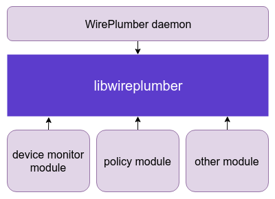

--

# 资源收集

官网文档

https://pipewire.pages.freedesktop.org/wireplumber/

# 简介

PipeWire 的主要目的是充当应用程序和设备之间的中间层。

为此，它为应用程序提供了一种创建媒体流的通用方法，

然后可以将其定向到任何设备或其他应用程序进行播放或捕获。

此功能将 PipeWire 定义为流交换框架。

然而，除了提供创建媒体流的机制外，流交换还需要一种机制来定义谁在与谁交换数据。

换句话说，它需要一种机制来决定哪个应用程序将连接到哪个设备，如何以及何时连接。


在传统设置中，

应用程序可以直接访问设备。

这意味着他们需要自己选择他们想要打开的设备，

并根据他们的媒体要求进行设置（即选择音频采样率、格式、视频分辨率等）。

虽然系统配置可以具有“系统默认”设备（例如在ALSA中），

但在某些设置中并非如此，

这给应用程序开发人员提供了一种配置设备选择的方法。

此外，此类设置不允许设备的透明切换（例如，在播放音乐时将音频播放从笔记本电脑扬声器切换到蓝牙耳机），除非应用程序实现这样做所需的复杂操作。

在某些情况下，另一个问题是设备完全由单个应用程序控制，不允许需要共享设备的更复杂的用例。

最后但并非最不重要的一点是，

访问设备直接增加了应用程序媒体管道的复杂性，以便处理多种设备格式或处理行为异常/非标准设备。


PulseAudio 显著改善了音频应用的这种情况。

在 PulseAudio 中，音频设备在内部打开和配置，音频应用程序可以创建任何所需格式的流，并请求从“默认”设备播放或捕获。

应用程序开发人员不再需要提供配置要使用的设备的方法，尽管如果他们愿意，他们仍然可以这样做。

PulseAudio 在内部维护此“默认”设备首选项，

并自动创建必要的内部链接，

以便在从应用程序传入新流时使工作正常。

可以在运行时更改此默认设备首选项，

并且可以透明地将应用程序流重新存储到另一个设备，从而消除所有复杂性。

然而，这里的问题是，虽然这种逻辑对大多数桌面应用程序来说非常有用，但它不能很好地扩展到其他用例。此外，PulseAudio 不处理视频流......


另一方面是 JACK，它也处理一个特定的用例：专业音频。

JACK 同样允许应用程序只创建流而忘记设备。

但与 PulseAudio 不同的是，它在内部没有实现任何连接逻辑。

这留给一个外部组件：会话管理器。

会话管理器监视应用程序连接或断开连接，

并使用自己的逻辑将它们链接到设备或对等应用程序。

这可能涉及“默认”设备目标，

但它通常遵循一组更复杂的用户可配置规则，

允许灵活地为专业音频应用设置音频处理阶段。

然而，这里的问题是，JACK不能很好地处理典型的桌面用例，并且对于非专业人士来说很复杂。


这让我们回到了 PipeWire......PipeWire将所有这些设计的一部分结合在一起，提供了一个灵活的媒体服务器，可用于实现音频和视频的桌面、嵌入式、专业和非专业用例。

为了获得最大利益，PipeWire 还由会话管理器提供支持，类似于 JACK 中的会话管理器，但具有更多可用功能。


PipeWire 上游有一个非常有限的示例会话管理器。

它是构建新示例的一个很好的示例，

并且具有一些用于基本桌面用例和测试的功能，但它仅此而已。

WirePlumber 作为此示例的替代品，还提供了一个用于构建自定义会话管理器的框架。


WirePlumber 作为会话管理器的主要目标显然是监视来自应用程序的流，并确保它们根据其实现的用例规则链接到适当的设备或对等应用程序。

但是，与 JACK 会话管理器不同，PipeWire 会话管理器具有更多职责。


PipeWire 本身在启动时实际上不会打开任何设备。

它提供了可以执行此操作的组件，

但默认情况下不会在守护程序中加载这些组件。

会话管理器的主要任务是为其感兴趣的设备加载这些组件，并适当地配置设备。


作为会话管理器的一部分是合理的，

因为要探测哪些设备以及如何配置它们的决定特定于用例。

汽车的音频硬件需要与台式机的声卡不同的配置。


WirePlumber 提供了一个处理监控设备的模块，该模块适用于实现spa_device接口的所有 PipeWire 设备监控组件。

这包括 ALSA、V4L2 和 bluez5 显示器。

此外，它还提供了一个模块来加载特殊的“JACK”设备，

该模块允许 PipeWire 作为 JACK 音频服务器的客户端运行。


PipeWire 非常重视安全性，并默认假设所有应用程序都是不可信的。

在内部，它提供了一个类似于UNIX文件系统上的权限系统，

允许在客户端可以通过其IPC协议访问的所有对象上设置读取，写入和执行（rwx）位。

没有访问对象所需权限的客户端无法对其执行任何恶意操作。


因此，会话管理器的另一项任务是对客户端进行身份验证并授予它们适当的权限。

WirePlumber 为此提供了一个模块，

尽管在撰写本文时，该模块是虚拟的，并且没有进行适当的权限管理;

它只是授予所有客户端对所有对象的完全访问权限。

不过，有计划为 AGL 和桌面正确实现这一点，敬请期待。


PipeWire 在内部使用称为“节点”的组件图来表示媒体流，

这些组件相互链接。

这些是上图中的紫色和绿色框。

节点抽象处理逻辑，

并提供一种将数据传入和传出 PipeWire 的方法，将处理委托给客户端或设备。


在管理此图时，通常需要将多个节点作为单个实体一起管理，以提供更复杂的功能。

例如，在音频设备上运行的音频 DSP 滤波器将由直接链接到该音频设备节点的节点表示。

然后，希望其音频通过该筛选器的应用程序应将其节点与筛选器节点（而不是设备节点）链接。

这增加了任何组件的复杂性，无论哪个组件决定在哪里链接什么，因为它现在需要对这个过滤器的操作有特定的了解。

此外，这不适用于 pavucontrol 或 GNOME 的声音设置等配置 UI，

这些 UI 是围绕应用程序直接连接到设备的概念构建的，两者之间没有任何内容。


另一个问题是，在现代系统中，流通常与用例相关联。

这在桌面系统上并不明显，

但想想你的手机。

传递音乐的音频流与传递通知或警报声音的音频流是分开的，

它们带有单独的音量控制和策略，

包括它们是否可听见、是否被强调（所有其他流都静音或躲避到较低的音量）等......

类似的属性也适用于视频流，

例如，用于在屏幕上实时预览的相机源与用于视频录制的源和用于静止图像（照片）捕获的源具有不同的编码和分辨率。


虽然这听起来可能并不复杂，但在嵌入式系统中，将流与用例相关联可能非常复杂。

例如，在纯软件中，音频用例的实现只是对应用程序流进行分类，并根据策略配置调整其音量控制或链接状态。

然而，在嵌入式中，所有这些都是在专用的硬件 DSP 上实现的，

该 DSP 通过不同的路径接收所有流，

并在硬件中应用所有混音、音量变化、效果和策略。

因此，控制此硬件的操作变得特定于设备，

这意味着 CPU 端的会话管理器需要为策略配置提供一个抽象层，以便在不同的设备上类似地工作。


所有这些问题都可以在 WirePlumber 中通过实现某些称为端点的对象来解决。

端点，就像节点一样，也相互链接，形成一个图。

它们中的每一个都代表一个用户可以想象的位置，

媒体可以在其中路由到/路由到/传出（例如一对扬声器或蓝牙耳机的麦克风），并提供一组端点流，

这些端点流表示可以到达该位置的逻辑路径，通常与用例相关联。


此端点图（在文档中也称为“会话管理图”）的目的是提供一种从更高层次的角度查看节点图的方法，该视角涉及用户可以理解的用例和目标。

这样可以更轻松地编写策略和其他配置，使用户能够了解特定于设备的详细信息，并专注于此配置将提供的实际用户体验。


最后但并非最不重要的一点是，WirePlumber 提供了一个模块，该模块根据用户可配置的策略规则在端点之间创建链接。

这是它作为会话管理器的主要目标。

不幸的是，当前的策略配置方式并不像我们希望的那样灵活，

尽管它是编写策略管理模块的第二次尝试。

在不久的将来，我的计划是尝试使用基于 lua 的脚本来描述此策略。

这个主题将在以后的博客文章中进一步讨论，所以我将在这里保持简短。


在上面所有关于 WirePlumber 功能的文本中，

我都提到它提供了提供功能的“模块”。

这是 WirePlumber 的一个关键设计方面。

每个功能都是一个模块，

它基于共享库构建，具有通用功能和接口，允许模块协同工作。

WirePlumber 的公共库基于 GObject，

它允许轻松实现与其他语言的绑定。

虽然当前的模块都是用 C 语言编写的，但存在允许以不同语言实现它们的机制。




# wireplumber是什么

WirePlumber 是 PipeWire 的一个强大的会话和策略管理器。

基于模块化设计，使用实现实际管理功能的 Lua 插件，具有高度可配置性和可扩展性。

安装 wireplumber 软件包。它将与其他 PipeWire 会话管理器冲突，并确保它们已卸载。

WirePlumber 的配置由全局 PipeWire 风格的 JSON 对象组成，

例如 `context` 和 `alsa_monitor` 经过修改以更改其行为。

配置文件从 `~/.config/wireplumber/` （用户配置）、

 `/etc/wireplumber/` （全局配置）

和 `/usr/share/wireplumber/` （库存配置）中读取。

WirePlumber 首先读取主配置文件。

这是一个类似 JSON 的文件，

用于设置 PipeWire 上下文、SPA 插件、模块和组件。

在这些组件中，Lua 脚本引擎用于动态修改全局对象。

单实例配置文件位于 `/usr/share/wireplumber/wireplumber.conf` .这是默认配置，它包括一个进程中所有其他配置的功能。


主配置文件位于 `/usr/share/wireplumber/main.conf` .

这将加载 WirePlumber 内核所需的模块和组件，并从 `*config-dir*/main.lua.d/` 加载 Lua 配置文件 

蓝牙配置文件位于 `/usr/share/wireplumber/bluetooth.conf` .

这适用于处理核心进程的蓝牙连接的 WirePlumber 进程。

这会从 `*config-dir*/bluetooth.lua.d/` 加载 Lua 文件。

策略配置文件位于 `/usr/share/wireplumber/policy.conf` 。

这封装了策略功能，这就是 WirePlumber 做出有关移动和更改节点的决策的方式。

这将从 Lua 文件加载 `*config-dir*/policy.lua.d/`


配置 WirePlumber 的推荐方法

是将 SPA-JSON 文件添加到 

 `~/.config/wireplumber/` 

`/etc/wireplumber/` 相应 `wireplumber.conf.d/` 目录。

需要考虑的一些事项是：

如果要覆盖现有配置，请将其从 `/usr/share/wireplumber/` 目标复制到目标，同时保持其名称相同。具有相同名称但位于较低优先级位置的配置文件将被忽略。

否则，如果要添加新配置，则应以大于 50 的数字（例如 `51-my-config.conf` ）开头，因为默认配置主要以字母数字顺序等于或低于 50 完成。

# 配置

WirePlumber 是一个高度模块化的守护进程。

==就其本身而言，除了加载其配置的组件之外，它不执行任何操作。==

实际的管理逻辑是在这些组件内部实现的。

启动时，WirePlumber 读取其配置文件（与其可能具有的所有片段相结合）并加载所选配置文件中指定的组件。

这配置了操作上下文。

==然后，这些组件接管并驱动整个守护进程的操作。==

## 配置文件

从 WirePlumber 0.5 开始，这是 WirePlumber 读取以加载配置的唯一文件（及其片段 - 见下文）。

过去，WirePlumber 还用来读取从 `wireplumber.conf` 引用的 Lua 配置文件，所有繁重的工作都是在 Lua 中完成的。

现在情况不再是这样，并且不再支持 Lua 配置文件。请参阅从 0.4 迁移配置。

请注意，Lua 仍然是 WirePlumber 的脚本语言，但它仅用于实际脚本编写，而不用于配置。

### spa json格式

此配置文件的格式是 JSON 的变体，

也用于 PipeWire 配置文件（也称为 SPA-JSON）。

该文件由一个未显式键入的全局 JSON 对象和一个部分列表组成，

这些部分本质上是该全局 JSON 对象的键值对。

每个部分通常是一个 JSON 对象，但也可以是一个 JSON 数组。

SPA-JSON 是标准 JSON 的超集，因此任何有效的 JSON 文件也是有效的 SPA-JSON 文件。但是，它比标准 JSON 更宽松。首先，它允许输入不带引号的字符串（ `"` ），除了标准的 `:` 作为键和值之间的分隔符 。这可以使其看起来类似于 INI 文件或人们熟悉的其他自定义配置格式，从而使用户更容易阅读和编辑。


就像 PipeWire 一样，WirePlumber 支持配置片段。

这意味着主配置文件可以拆分为多个文件，

所有这些文件都将被加载并合并在一起。

==这对于允许用户自定义其配置而无需修改主文件非常有用。==

## 配置的section

| 配置名字         | 说明                                          |
| ---------------- | --------------------------------------------- |
| components       | 一个数组，列出了 WirePlumber 可以加载的组件。 |
| componetns.rules | 也是数组，里面是修改components的一些规则      |
| profiles         | 可以加载的配置文件                            |
| settings         | 修改wireplumber的行为                         |
| settings.schema  | 验证修改                                      |
| 其他             |                                               |

另外，还有libpipewire来读取并发送给pipewire的部分。

```
context.properties
context.spa-libs
context.modules

```


添加片段以修改默认配置的最简单方法是创建一个名为 `~/.config/wireplumber/wireplumber.conf.d` 的目录并将片段放置在那里。

所有片段文件都需要具有 `.conf` 扩展名，并且必须是有效的 SPA-JSON 文件。片段按字母数字顺序加载，因此您可以通过相应命名来控制它们的加载顺序。建议使用数字前缀作为文件名，例如 `10-my-fragment.conf` 、 `20-my-other-fragment.conf` 等，以便您可以轻松控制它们的加载顺序。

如果您不想附加新规则，而是用新规则覆盖整个数组，则可以通过在数组名称上使用 `override.` 前缀来实现：

```
override.monitor.alsa.rules = [
  {
    matches = [
      {
        device.name = "~alsa_card.*"
      }
    ]
    actions = {
      update-props = {
        api.alsa.use-ucm  = false
      }
    }
  }
]
```

## alsa配置

ALSA 监视器是 WirePlumber 的组件之一。

该监视器负责为系统上可用的所有 ALSA 卡创建 PipeWire 设备和节点。

它还管理这些设备的配置。

ALSA 监视器默认启用，可以使用配置文件中的 `monitor.alsa` 功能禁用。

与所有设备监视器一样，该监视器作为 SPA 插件实现，

并且是 PipeWire 的一部分。 

**WirePlumber 只是加载插件并让它完成工作。**

然后，该插件监视 UDev 并为系统上可用的所有 ALSA 卡创建设备和节点对象。

> 这里值得记住的一件事是，在 ALSA 中，“卡”代表物理声音控制器设备，而“设备”是逻辑访问点，代表卡的一部分的一组输入和/或输出。在 PipeWire 中，“设备”直接相当于 ALSA“卡”，而“节点”几乎相当于（接近，但不完全）ALSA“设备”。

## 蓝牙配置

# 会话管理

PipeWire 会话管理器是一个负责做很多事情的工具。许多人将“会话管理器”一词理解为负责管理节点之间链接的工具，但这只是众多任务之一。要了解其整个操作，我们需要首先讨论 PipeWire 的工作原理。

当 PipeWire 启动时，它会加载在其配置文件中定义的一组模块。这些模块为 PipeWire 提供功能，否则它只是一个不执行任何操作的空进程。正常情况下，PipeWire启动时加载的模块包含对象工厂，以及允许进程间通信的本机协议模块。除此之外，PipeWire 并不真正加载或执行任何其他操作。这是会话管理开始的地方。

会话管理基本上就是设置 PipeWire 来做一些有用的事情。这是通过利用 PipeWire 公开的对象工厂来创建一些有用的对象，然后使用它们的方法来修改并随后销毁它们来实现的。这些对象包括设备、节点、端口、链路等。这项任务需要持续监控和采取行动，对系统使用过程中发生的大量不同事件做出反应。


WirePlumber 构建在 libwireplumber 库之上，该库提供了用于表达所有会话管理逻辑的基本构建块。 Libwireplumber是用C语言编写的，基于GObject，包装了PipeWire API，并提供了更高级别和更方便的API。虽然 WirePlumber 守护程序实现会话管理逻辑，但也可以在 WirePlumber 守护程序范围之外使用底层库。这允许创建与 PipeWire 交互的外部工具和 GUI。

该库基于 GObject，具有自省功能，可以在任何支持 GObject 自省的语言中使用。该库还可以作为 C API 提供。


PipeWire 通过 IPC 协议公开多个对象，例如节点和端口，其方式很难使用标准面向对象原理进行交互，因为它是异步的。例如，当创建一个对象时，它的存在是通过协议宣布的，但其属性稍后在辅助消息上宣布。如果某些东西需要对此对象创建事件做出反应，它通常需要访问对象的属性，因此它必须等到属性被发送。这样做可能听起来很简单，而且确实如此，但是在任何地方都这样做而不是专注于编写实际的事件处理逻辑，这会成为一个乏味的重复过程。

WirePlumber 的库通过创建代理对象来解决这个问题，这些代理对象在每个对象的生命周期中缓存从 PipeWire 接收的所有信息和更新。然后，它通过 WpObjectManager API 使它们可用，该 API 能够等到某些信息（例如属性）已缓存在每个对象上后再宣布。


Lua 脚本实现了大部分会话管理。 libwireplumber API 在 Lua 中提供，具有惯用的绑定，这使得编写会话管理逻辑变得非常容易。

选择Lua是因为它是一种非常轻量级的脚本语言，适合嵌入。它也非常容易学习和使用，并将其绑定到 C 代码。然而，WirePlumber 可以轻松扩展以支持 Lua 以外的脚本语言。整个Lua脚本系统是作为一个模块实现的。


会话管理就是对事件做出反应并采取必要的操作。这就是为什么 WirePlumber 的逻辑全部构建在事件和钩子上。


# lua

WirePlumber 使用 Lua 版本 5.4 来实现其引擎。对于较旧的系统，还支持 Lua 5.3。

==可以使用该 `wpexec` 工具运行脚本。==

WirePlumber 的脚本引擎将 lua 脚本沙盒到一个安全的环境中。

在此环境中，以下规则适用：

* 脚本是相互隔离的;一个脚本中的全局变量在另一个脚本中不可见，即使它们实际上是在同一个 `lua_State` 脚本中执行的
* 保存 API 方法的表不可写。虽然这听起来可能很奇怪，但标准 Lua 允许您更改标准 API，例如 `string.format = rogue_format` 在沙盒之外有效。WirePlumber 不允许这样做。
* 标准 Lua API 仅限于安全函数的子集。例如，不允许与文件系统 （io.*） 和进程状态 （例如：os.exit） 交互的函数
* 对象方法不会在公共表中公开。要调用对象方法，您必须使用 Lua 的方法调用语法，即 `object:method(params)`

例如，以下内容无效：

```
-- this will cause an exception
local node = ...
Node.send_command(node, "Suspend")

```

正确的形式是这样的：

```
local node = ...
node:send_command("Suspend")
```


为 WirePlumber 脚本提供支持的 Lua 引擎提供了与 GObject 的直接集成。

您将在 lua 脚本中处理的大多数对象都是包装 GObjects。

为了使用脚本，您首先需要对 GObject 的基本概念（例如信号和属性）有一个基本的了解。

所有 GObject 都具有属性的能力。

在 C 语言中，我们通常使用 g_object_get 来检索它们，g_object_set 来设置它们。

在 WirePlumber 的 lua 引擎中，这些属性作为 Lua 对象的对象成员公开。

GObjects 还具有将事件传递到外部回调的通用机制。

这些事件称为信号。

要连接到信号并处理它，您可以使用 connect 方法：


# wpctl命令

```
Usage:
  wpctl [OPTION?] COMMAND [COMMAND_OPTIONS] - WirePlumber Control CLI

Commands:
  status 
  inspect ID
  set-default ID
  set-volume ID VOL
  set-mute ID 1|0|toggle
  set-profile ID INDEX
  clear-default [ID]
```

## status

没有播放音乐的时候，

```
PipeWire 'pipewire-0' [1.1.81, root@buildroot, cookie:4213201345]
 └─ Clients:
        32. WirePlumber                         [1.1.81, root@buildroot, pid:4004]
        33. WirePlumber [export]                [1.1.81, root@buildroot, pid:4004]
        54. wpctl                               [1.1.81, root@buildroot, pid:5921]

Audio
 ├─ Devices:
 │      36. Built-in Audio                      [alsa]
 │      37. Built-in Audio                      [alsa]
 │  
 ├─ Sinks:
 │      38. Built-in Audio Stereo               [vol: 0.74]
 │  *   40. Built-in Audio Analog Stereo        [vol: 0.74]
 │  
 ├─ Sink endpoints:
 │  
 ├─ Sources:
 │      39. Built-in Audio Stereo               [vol: 0.74]
 │  *   41. Built-in Audio Analog Stereo        [vol: 0.74]
 │  
 ├─ Source endpoints:
 │  
 └─ Streams:

Video
 ├─ Devices:
 │  
 ├─ Sinks:
 │  
 ├─ Sink endpoints:
 │  
 ├─ Sources:
 │  
 ├─ Source endpoints:
 │  
 └─ Streams:

Settings
 └─ Default Configured Node Names:
```

用pw-play播放音乐后

```
# wpctl status
PipeWire 'pipewire-0' [1.1.81, root@buildroot, cookie:4213201345]
 └─ Clients:
        32. WirePlumber                         [1.1.81, root@buildroot, pid:4004]
        33. WirePlumber [export]                [1.1.81, root@buildroot, pid:4004]
        54. pw-cat                              [1.1.81, root@buildroot, pid:13101]
        56. wpctl                               [1.1.81, root@buildroot, pid:13116]

Audio
 ├─ Devices:
 │      36. Built-in Audio                      [alsa]
 │      37. Built-in Audio                      [alsa]
 │  
 ├─ Sinks:
 │      38. Built-in Audio Stereo               [vol: 0.74]
 │  *   40. Built-in Audio Analog Stereo        [vol: 0.74]
 │  
 ├─ Sink endpoints:
 │  
 ├─ Sources:
 │      39. Built-in Audio Stereo               [vol: 0.74]
 │  *   41. Built-in Audio Analog Stereo        [vol: 0.74]
 │  
 ├─ Source endpoints:
 │  
 └─ Streams:
        55. pw-play                                                     

Video
 ├─ Devices:
 │  
 ├─ Sinks:
 │  
 ├─ Sink endpoints:
 │  
 ├─ Sources:
 │  
 ├─ Source endpoints:
 │  
 └─ Streams:

Settings
 └─ Default Configured Node Names:
```

## inspect

```
# wpctl inspect 36
id 36, type PipeWire:Interface:Device
    alsa.card = "0"
    alsa.card_name = "AML-AUGESOUND"
    alsa.driver_name = "amlogic_snd_soc"
    alsa.id = "AMLAUGESOUND"
    alsa.long_card_name = "AML-AUGESOUND"
    api.acp.auto-port = "false"
    api.acp.auto-profile = "false"
    api.alsa.card = "0"
    api.alsa.card.longname = "AML-AUGESOUND"
    api.alsa.card.name = "AML-AUGESOUND"
    api.alsa.path = "hw:0"
    api.alsa.use-acp = "true"
    api.dbus.ReserveDevice1 = "Audio0"
  * client.id = "33"
  * device.api = "alsa"
    device.bus-path = "/sys/devices/platform/auge_sound/sound/card0"
  * device.description = "Built-in Audio"
    device.enum.api = "udev"
    device.form-factor = "internal"
    device.icon-name = "audio-card-analog"
  * device.name = "alsa_card._sys_devices_platform_auge_sound_sound_card0"
  * device.nick = "AML-AUGESOUND"
    device.plugged.usec = "3764562"
    device.string = "0"
    device.subsystem = "sound"
    device.sysfs.path = "/devices/platform/auge_sound/sound/card0"
  * factory.id = "15"
  * media.class = "Audio/Device"
    object.path = "alsa:acp:AMLAUGESOUND"
  * object.serial = "36"
```

# 板端配置文件分析

在板端的文件，跟在output/target下面的文件还不一样。

感觉像是执行期间生成的。

```
wireplumber.components = [
  #{ name = <component-name>, type = <component-type> }
  #
  # WirePlumber components to load
  #

  # The lua scripting engine
  { name = libwireplumber-module-lua-scripting, type = module }

  # The lua configuration file(s)
  # Other components are loaded from there
  { name = main.lua, type = config/lua }
  { name = policy.lua, type = config/lua }
  { name = bluetooth.lua, type = config/lua }
]

```

不是，这个应该就是老的方案的。


# 参考资料

1、arch wiki

https://wiki.archlinux.org/title/WirePlumber

2、官方文档

https://pipewire.pages.freedesktop.org/wireplumber/

3、

https://www.collabora.com/news-and-blog/blog/2020/05/07/wireplumber-the-pipewire-session-manager/