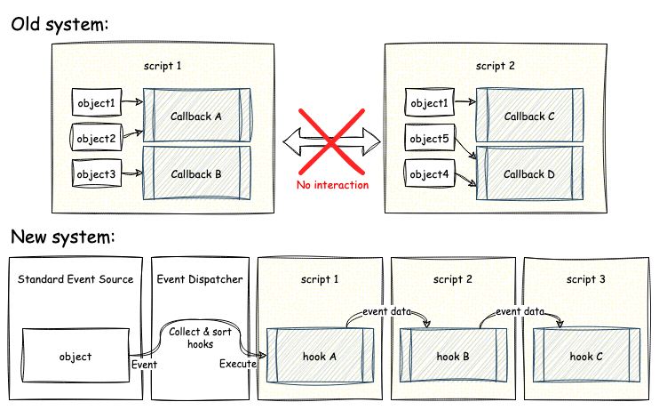
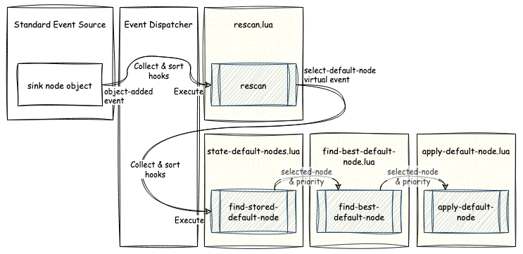
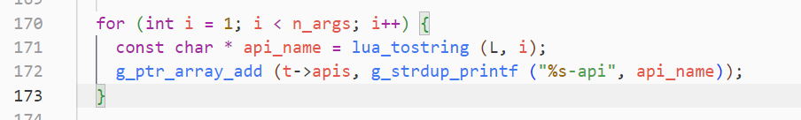
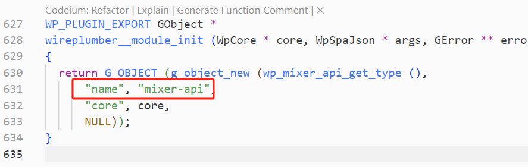
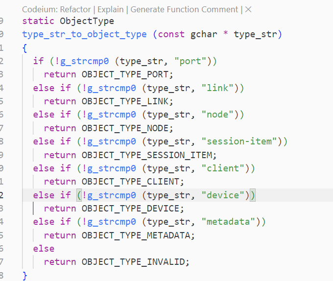

--

# 用wireplumber来自动连接pipewire node

https://bennett.dev/auto-link-pipewire-ports-wireplumber/

我非常支持 Linux 桌面环境下的 Pipewire。

我做很多业余音频录制和音乐制作，

长期以来一直在努力平衡 Jack 和 Pulseaudio，

使其能够顺畅工作。

Pipewire 和 Wireplumber 大部分已经解决了这个问题

——但每当打开某些应用程序时，我经常需要手动跳入我的 patchbay 来连接节点。

就像任何人一样，我决定查阅文档并编写一个 Wireplumber 脚本来自动为我连接这些节点。


Pipewire 可以被认为是一个图，图中的节点会路由信息流贯穿你的计算机。

节点是图中的节点，链接是边。

但是节点只能通过端口连接到其他节点。

这些端口可以有方向（ `in` 或 `out` ），甚至可以表示某些命名的音频通道（如 `FR` 、 `AUX1` 、 `AUX2` ）。


Wireplumber 是一个可脚本化的会话管理器，

用于管理 Pipewire 图中的所有节点和连接。

Wireplumber 内部的大部分逻辑都是用 Lua 插件实现的，

这意味着你可以很容易地跳进去编写自己的脚本和策略。

Wireplumber 脚本可以直接操作 Pipewire 图，但需要在你的 Wireplumber 配置文件中安装为自定义组件。


现在你知道这些 Lua 脚本该放在哪里了，你可以继续创建你的第一个 `Link` 对象并将两个端口连接起来。

```lua
function link_ports(output_port, input_port)
	local args = {
		-- The node and port to connect from
		["link.output.node"] = output_port.properties["node.id"],
		["link.output.port"] = output_port.properties["object.id"],

		-- The node and port to connect to
		["link.input.node"] = input_port.properties["node.id"],
		["link.input.port"] = input_port.properties["object.id"],

		-- I found that not having this entry in the args would fail
		-- to create the link. Setting it to nil seems to work
		["object.id"] = nil,

		-- I'm not completely sure what this does but it seems to
		-- make the link much more reliable
		["object.linger"] = true
	}

	link = Link("link-factory", args)
	link:activate(1)
end
```

使用这种方法，你现在可以将两个 `Port` 对象连接在一起。要获取这些端口，你需要使用 `ObjectManager` 查询 Pipewire 图。


`ObjectManager` 是一个工具，可以让您查询 Pipewire 图形并在特定节点使用约束条件监听更改。

在这个例子中，我正在查找所有方向为 `in` 且别名与字符串 `"My Output:*"` 模糊匹配的端口

```lua
ObjectManager {
	Interest {
		type = "port",
		Constraint {
		  "port.alias", "matches", "My Output:*"
		},
		Constraint {
		  "port.direction", "equals", "in"
		}
	}
}
```

如果你想更好地了解可用的端口和字段，

我在我自己的 dotfiles 中写了一个 dump-ports.lua 工具，

这可能会对你有帮助。

你可以使用 `wpexec` 命令执行任何 Wireplumber 脚本：

```unknown
wpexec ./dump-ports.lua
```

现在我们知道了如何查询 Pipewire 图中的端口，

并可以使用我们的 `link_ports` 工具将它们连接起来——让我们写一个函数将两者结合起来。

我们将创建两个对象管理器，它们将根据用户传递的约束监听输入和输出端口。

然后我们将使用用户传递的映射，在对象管理器触发“object-added”事件时将两个端口链接在一起。

最后我们将激活两个对象管理器，使它们开始监听事件。

```lua
function auto_link_ports(args)
	local input_constraint = args["input"]
	local output_constraint = args["output"]
	local connections = args["connect"]

	local input_om = ObjectManager {
		Interest {
			type = "port"
			input_constraint,
			Constraint {
				"port.direction", "equals", "in"
			}
		}
	}

	local output_om = ObjectManager {
		Interest {
			type = "port",
			input_constraint,
			Constraint {
				"port.direction", "equals", "out"
			}
		}
	}

	function _connect()
		for output_name, input_name in pairs(args.connect) do
			local output = output_om:lookup {
				Constraint {
					"audio.channel", "equals", output_name
				}
			}

			local input = input_om:lookup {
			    Constraint {
				    "audio.channel", "equals", input_name
				}
			}
			
			link_port(output, input)
		end
	end

	output_om:connect("object-added", _connect)
	input_om:connect("object-added", _connect)
	
	output_om:activate()
	input_om:activate()
end
```

现在我们有了这些方法，

就可以用它来连接两个 Pipewire 节点。

在这个例子中，我将 "My Output" 连接到 "My Input"，

并将端口 "FL" 映射到 "AUX0"，"FR" 映射到 "AUX1"：

```lua
-- ~/.config/wireplumber/scripts/my-script.lua

auto_connect_ports {
	output = Constraint { "port.alias", "matches", "My Output:*"},
	input = Constraint { "port.alias", "matches", "My Input:*"}

	connect = {
		["FL"] = "AUX0",
		["FR"] = "AUX1"
	}
}
```

请确保在 Wireplumber 启动时执行脚本，方法是将其添加到您的配置中：

```conf
# ~/.config/wireplumber/wireplumber.conf.d/91-user-scripts.conf

wireplumber.components = [
  {
    name = ~/.config/wireplumber/scripts/auto-connect-ports.lua,
    type = script/lua
    provides = custom.my-script
  }
]

wireplumber.profiles = {
  main = {
    custom.my-script = required
  }
}
```

我老实说真的没想到这个问题的解决方案还没有被记录下来。

我想 Pipewire 和 Wireplumber 大部分情况下开箱即用，

所以这方面的需求可能确实比较小众。

不过还是希望能有一些更高级的功能内置进来，

比如可以处理替换链接之类的事情。

或许这可以是版本二的内容。

如果你想查看这种技术在实际中是如何使用的——你可以在我的 dotfiles 中找到相关的脚本：

- [auto-connect-ports.lua](https://github.com/bennetthardwick/dotfiles/blob/master/.config/wireplumber/scripts/auto-connect-ports.lua)
- [99-auto-connect-ports.conf](https://github.com/bennetthardwick/dotfiles/blob/master/.config/wireplumber/wireplumber.conf.d/90-auto-connect-ports.conf)

# auto_attach_filter.lua

https://gist.github.com/THS-on/a8fe22891c1008454a948e86d25315f5

# wireplumber的最新进展

https://www.collabora.com/news-and-blog/blog/2024/02/19/whats-the-latest-with-wireplumber/

设计中最主要的限制因素是 WirePlumber 最强大的功能：脚本系统。

当我们设计脚本系统时，

假设如果提供一个 API，

允许脚本获取 PipeWire 对象的引用并独立订阅其事件，

那么任何功能都可以轻松构建在其上。

这完全错了，

因为实际情况是，

基于脚本构建的组件实际上相互依赖，

有时确保事件处理程序（回调）执行顺序至关重要。

此外，我们还意识到编写相对较小的脚本很困难。

大量的逻辑很快就在单个脚本文件中积累起来，

使它们很难使用。

这也使得用户无法在不先复制整个脚本的情况下稍微修改某些行为变得不可能。

解决方案是用不同的方式重新设计脚本系统。

我们不再让脚本随意执行，

而是引入了一个中央组件来管理所有 PipeWire 对象的引用，

即“标准事件源”。

此外，我们还增加了一种机制，

让脚本能够通过我们称之为“钩子”的其他对象订阅这些对象的事件。

钩子之间可以有依赖关系，

从而可以排序，

它们还可以传递数据，使它们能够合作做出决策，而不是彼此竞争。



在这个过程中，

我们还意识到可以==引入==不源自 PipeWire 对象的==虚拟事件==，

以便运行挂钩链以做出决策。

例如，选择哪个“sink”节点将成为系统的默认音频输出的过程是通过一个名为“select-default-node”的虚拟事件实现的。

这个事件在响应多个可以解释为可能影响 sink 的变化的事件的挂钩中生成。

当事件生成时，会收集可用的 sink 节点及其属性列表，并将其作为事件数据传递给“select-default-node”挂钩。

之后，每个挂钩会遍历这个列表，

并根据某些启发式方法尝试做出决策。

如果挂钩做出了决策，它会将选定的节点及其优先级存储在事件数据中。

然后，链中的下一个挂钩从这里开始，做出自己的决策，但如果优先级高于之前的优先级，则仅更改结果。



除了脚本系统的变化，

这段时间还积累了一些其他功能。

我们对配置系统进行了更改，

使用了 SPA-JSON 文件，

基于依赖关系的组件加载系统，

以及通过 wpctl 动态访问的设置。

我们还引入了“智能过滤器”，

这是一种自动在设备节点前插入过滤节点的系统，

并在此基础上重构了蓝牙自动切换机制，

以始终提供一个虚拟蓝牙源，

在该源与应用程序链接时，自动将底层耳机设备切换到 HSP/HFP 配置文件。

所有这些都通过链接策略的改进得到了进一步增强，

现在支持通过新的节点属性进行更精细的调整，

并内置了相机设备的去重机制，

允许 libcamera 和 V4L2 监视器并行运行，

但每个相机只有一个节点提供，取决于相机类型。

# pipewire和wireplumber配置文件的关系

两者的关系是：

PipeWire处理底层的多媒体流和设备通信，其配置文件定义全局设置和模块；

WirePlumber作为上层管理器，处理会话策略和设备连接，其配置文件管理具体的策略和组件。

两者的配置文件路径不同，格式逐渐统一为JSON，但功能各有侧重，需要协同工作。

# hooks不是必须的

hooks是对于有前后依赖关联的时候才需要。

否则直接ObjectManager 监听就好了。

# wireplumber.settings.schema

WirePlumber 的 `wireplumber.settings.schema` 是用于定义配置文件中 `wireplumber.settings` 部分的模式（Schema），

其核心作用是对设置的合法性进行验证。

- **验证设置合法性**：当在 `wireplumber.settings` 中定义或通过运行时工具（如 `pw-metadata`）修改设置时，`schema` 会检查设置的键值是否符合预定义的数据类型和格式。例如，若某个配置项应为布尔值，而用户输入字符串，`schema` 会阻止无效配置的加载或应用 。
- **运行时动态验证**：即使配置在运行时被修改（如通过元数据接口），`schema` 仍会持续验证这些变更，确保系统的稳定性和一致性


# github上找到的一些wireplumber lua脚本

https://github.com/Electrostasy/dots/blob/1acdfa7380239de81801b74c52e492236a566977/hosts/terra/wpexec-defaults.lua

https://github.com/bplaum/gmerlin-control/blob/8d791f7ae78dc28316311f229ee71cb9f30b5e1e/plugins/wireplumber_monitor.lua

https://github.com/Red-M/dotfiles/blob/3e6114a40661bbf8de5b0dc649217c494c98c327/.config/wireplumber/scripts/auto_fix_mic.lua#L27

这个不错。

https://github.com/kmatzen/millennium/blob/7e89c78fecee084ec1b60e339e225bc98fc6ae55/host/mono-sinks.lua#L118


https://github.com/baerchen201/jubilant-octo-funicular/blob/1fd4c6f2996af36e118591beefc6d0d857d2a75f/linux/connect-virtual-mic.lua#L106

https://github.com/MontaVista-OpenSourceTechnology/meta-agl/blob/d0811149804c8ee56bfc7fdbc7a6795f4a66eb97/meta-pipewire/recipes-multimedia/wireplumber/wireplumber-config-agl/alsa-suspend.lua#L27

# require_api可以一次多个

```lua
Core.require_api("default-nodes", "mixer", function(...)
  local default_nodes, mixer = ...

  -- "get-default-node" and "get-volume" are action signals of the
  -- "default-nodes-api" and "mixer-api" plugins respectively
  local id = default_nodes:call("get-default-node", "Audio/Sink")
  local volume = mixer:call("get-volume", id)

  -- the return value of "get-volume" is a GVariant(a{sv}),
  -- which gets translated to a Lua table
  Debug.dump_table(volume)
end)
```



xx-api。后面的api这部分是自动补全的。

而xx-api。这个是在模块初始化的时候设置的name。



# Core.quit()

退出当前 wpexec 进程

这只能在脚本在 wpexec 中运行时调用；如果它在主 WirePlumber 守护程序中运行，它将打印警告并什么都不做

# Interest的type取值

```
client
node
device


plugin
siLink
properties
```

应该是合法的gobject类型都可以。

那跟字符串是怎么对应的呢？

```
g_type_name (self->gtype)
```

是不是主要是这些？



# Script.async_activation = true 

`Script.async_activation = true` 是 WirePlumber 配置中的一个选项，作用是 **异步加载 Lua 脚本**，避免阻塞 WirePlumber 的主线程。

### 作用：

- **默认情况下**，WirePlumber 在启动时同步执行 Lua 脚本，如果某个脚本执行较慢，可能会导致 WirePlumber 启动延迟。
- **设置为 `true` 后**，脚本会以异步方式执行，WirePlumber 继续初始化，不会被卡住。

### 适用场景：

- 适用于

   需要较长时间初始化的 Lua 脚本，比如：

  - 访问 D-Bus 进行初始化
  - 需要等待外部资源（如设备出现）

- **不适用于** 需要同步执行的脚本（比如影响关键音频策略的配置）

# EventDispatcher

`EventDispatcher.push_event { type = "test-event", priority = 1 }` 是 WirePlumber Lua API 中用于**触发自定义事件**的函数。

### 作用：

该函数调用 `EventDispatcher.push_event()` 方法，向 WirePlumber 的事件系统推送一个名为 `"test-event"` 的事件，并设置其**优先级**为 `1`（数字越小，优先级越高）。

### 具体行为：

1. **注册监听器**：如果有 Lua 脚本或 WirePlumber 组件监听 `"test-event"`，它们会按优先级处理这个事件。
2. **事件调度**：事件进入 WirePlumber 的事件队列后，将根据优先级和调度策略触发回调函数。
3. **执行回调**：如果某个模块对 `"test-event"` 进行了 `EventDispatcher.connect()` 监听，那么它的回调函数会被执行。

### 示例：

如果你想监听这个事件，可以这样写：

```lua
EventDispatcher.connect("test-event", function(event)
    print("Received test-event with priority:", event.priority)
end)

-- 触发事件
EventDispatcher.push_event { type = "test-event", priority = 1 }
```

这样，当 `push_event` 触发 `"test-event"` 后，回调函数就会打印 `"Received test-event with priority: 1"`。

### 适用场景：

- **异步通知**：可以在某个操作完成后触发事件，让其他模块响应，比如设备检测、音频路由变更等。
- **模块间通信**：让不同的 WirePlumber Lua 脚本之间交换信息，而不需要直接调用彼此的 API。

# Script:finish_activation

`Script:finish_activation()` 是 WirePlumber Lua API 中用于**完成脚本激活**的函数。

### **作用**

当 `Script.async_activation = true` 时，WirePlumber **不会立即执行完脚本**，而是等待 `Script:finish_activation()` 被调用，才会认为脚本初始化完成。

如果你写了一个异步脚本（比如要等待某些外部资源），你可以这样使用：

```lua
Script.async_activation = true

print("Script is initializing...")

-- 模拟异步操作，比如 D-Bus 交互或设备检测
Core.timeout_add(1000, function()
    print("Script finished initialization")
    Script:finish_activation()
end)
```

在这个例子中：

1. **脚本不会立即完成**，WirePlumber 认为它“仍在初始化”。
2. **1秒后**（`timeout_add(1000)`），`Script:finish_activation()` 被调用，表示脚本已经准备好，WirePlumber 继续正常运行。

### **适用场景**

- **等待外部资源**：比如 D-Bus 连接、设备检测、网络请求等。
- **初始化异步逻辑**：如果脚本依赖某些条件，需要在满足后才完成激活。

如果你在调试 WirePlumber 的脚本加载逻辑，观察 `Script.async_activation = true` 的脚本是否最终调用 `Script:finish_activation()`，否则 WirePlumber 可能会认为脚本仍未完成加载。

# wireplumber里为什么很多的属性以item为前缀

在 WirePlumber 里，许多属性以 **`item.`** 为前缀，比如 `item.factory.name`、`item.node`、`item.active` 等。这主要是因为 **WirePlumber 采用了“项（Item）”作为管理单元**，这些 `item` 代表不同的 PipeWire 资源，比如节点（Node）、设备（Device）、会话（Session）等。

------

### **1. `item.` 前缀的作用**

- **区分 WirePlumber 自己的管理对象**
- **统一不同类型的 PipeWire 资源**
- **提供通用的管理方式**

在 WirePlumber 里，很多实体（如 `Node`、`Device`、`Session`）都抽象成 `Item`，这样可以用 **相同的 API 进行管理**。

------

### **2. 常见的 `item.` 属性**

| **属性**                | **说明**                                              |
| ----------------------- | ----------------------------------------------------- |
| `item.factory.name`     | `Item` 的创建工厂，比如 `"si-audio-node"`（音频节点） |
| `item.node`             | 绑定的 PipeWire `Node`                                |
| `item.active`           | `Item` 是否激活（`true` / `false`）                   |
| `item.priority.session` | 会话优先级                                            |
| `item.client`           | 绑定的 `Client`（客户端）                             |

------

### **3. `item` 的用法示例**

假设你在 Lua 脚本里遍历 `Item`，可以这样访问：

```lua
for name, item in pairs(Session.items) do
  Log.info("Item:", name, "Factory:", item.properties["item.factory.name"])
end
```

如果 `item.factory.name` 是 `"si-audio-node"`，说明这是一个音频节点。

------

### **4. `item.` 机制的好处**

- **解耦底层 PipeWire 资源**，WirePlumber 只需要管理 `Item`
- **可以动态扩展**，不同类型的 `Item` 只要实现相应接口即可
- **方便管理和调试**，在 `wpctl status` 里可以看到很多 `item.*` 相关信息

------

### **总结**

WirePlumber 里 `item.` 前缀是为了**抽象 PipeWire 资源，提供统一的管理方式**。


```
"item.node");
"item.features.no-format");
"item.features.control-port");
"item.features.monitor");
"item.features.no-dsp");
"item.node.type");

"item.node.supports-encoded-fmts",
"item.node.encoded-only",
"item.node.unpositioned",
"item.factory.name", SI_FACTORY_NAME);

```


```
connect("object-added", function (_, node)
connect("object-removed", function (_, node)
connect("changed", handle_metadata_changed)
connect("installed", function (om)

connect("object-added", function (om, client)
connect("object-removed", function (om, client)

connect("state-changed", function(node, old_state, cur_state)

si_link:connect("link-error", function (_, error_msg)

dbus:connect("notify::state", function (b, pspec)

metadata_om:connect("objects-changed", function (om)

60:      proxy:connect("bound", function(p, id)
262:   om:connect("objects-changed", function (om)
282:   om:connect("objects-changed", function (obj_mgr)

```

# G_TYPE_FROM_CLASS

搜索这个字符串，可以找到wireplumber里gobject 注册的signal。

```
rg G_TYPE_FROM_CLASS

modules/module-logind.c
141:      "get-state", G_TYPE_FROM_CLASS (klass),
147:      "state-changed", G_TYPE_FROM_CLASS (klass),

modules/module-file-monitor-api.c
187:      "add-watch", G_TYPE_FROM_CLASS (klass),
194:      "remove-watch", G_TYPE_FROM_CLASS (klass),
201:      "changed", G_TYPE_FROM_CLASS (klass),

modules/module-standard-event-source.c
457:      "get-object-manager", G_TYPE_FROM_CLASS (klass),
463:      "create-event", G_TYPE_FROM_CLASS (klass),
470:      "push-event", G_TYPE_FROM_CLASS (klass),
477:      "schedule-rescan", G_TYPE_FROM_CLASS (klass),

modules/module-si-standard-link.c
732:      "link-error", G_TYPE_FROM_CLASS (klass), G_SIGNAL_RUN_FIRST,

modules/module-mixer-api.c
609:      "set-volume", G_TYPE_FROM_CLASS (klass),
616:      "get-volume", G_TYPE_FROM_CLASS (klass),
623:      "changed", G_TYPE_FROM_CLASS (klass),

modules/module-portal-permissionstore.c
227:      "get-dbus", G_TYPE_FROM_CLASS (klass),
243:      "lookup", G_TYPE_FROM_CLASS (klass),
261:      "set", G_TYPE_FROM_CLASS (klass),
279:      "changed", G_TYPE_FROM_CLASS (klass),

modules/module-default-nodes-api.c
286:      "get-default-node", G_TYPE_FROM_CLASS (klass),
293:      "get-default-configured-node-name", G_TYPE_FROM_CLASS (klass),
300:      "set-default-configured-node-name", G_TYPE_FROM_CLASS (klass),
307:      "changed", G_TYPE_FROM_CLASS (klass),

tests/script-tester.c
159:      "create-stream", G_TYPE_FROM_CLASS (klass),
165:      "restart-plugin", G_TYPE_FROM_CLASS (klass),

modules/module-reserve-device/reserve-device.c
399:      "acquire", G_TYPE_FROM_CLASS (klass),
410:      "release", G_TYPE_FROM_CLASS (klass),
421:      "deny-release", G_TYPE_FROM_CLASS (klass),
440:      "release-requested", G_TYPE_FROM_CLASS (klass),

modules/module-reserve-device/plugin.c
209:      "create-reservation", G_TYPE_FROM_CLASS (klass),
223:      "destroy-reservation", G_TYPE_FROM_CLASS (klass),
238:      "get-reservation", G_TYPE_FROM_CLASS (klass),
250:      "get-dbus", G_TYPE_FROM_CLASS (klass),

lib/wp/object-manager.c
227:      "object-added", G_TYPE_FROM_CLASS (klass), G_SIGNAL_RUN_FIRST,
231:      "object-removed", G_TYPE_FROM_CLASS (klass), G_SIGNAL_RUN_FIRST,
235:      "objects-changed", G_TYPE_FROM_CLASS (klass), G_SIGNAL_RUN_FIRST,
239:      "installed", G_TYPE_FROM_CLASS (klass), G_SIGNAL_RUN_FIRST,

lib/wp/proxy.c
256:      "pw-proxy-created", G_TYPE_FROM_CLASS (klass), G_SIGNAL_RUN_FIRST,
261:      "pw-proxy-destroyed", G_TYPE_FROM_CLASS (klass), G_SIGNAL_RUN_FIRST,
266:      "bound", G_TYPE_FROM_CLASS (klass), G_SIGNAL_RUN_FIRST,
271:      "error", G_TYPE_FROM_CLASS (klass), G_SIGNAL_RUN_FIRST,

lib/wp/node.c
309:      "state-changed", G_TYPE_FROM_CLASS (klass),
314:      "ports-changed", G_TYPE_FROM_CLASS (klass),

lib/wp/metadata.c
317:  signals[SIGNAL_CHANGED] = g_signal_new ("changed", G_TYPE_FROM_CLASS (klass),

lib/wp/core.c
642:      G_TYPE_FROM_CLASS (klass), G_SIGNAL_RUN_LAST, 0, NULL, NULL, NULL,
646:      G_TYPE_FROM_CLASS (klass), G_SIGNAL_RUN_LAST, 0, NULL, NULL, NULL,

lib/wp/device.c
649:      "create-object", G_TYPE_FROM_CLASS (klass), G_SIGNAL_RUN_FIRST,
654:      "object-removed", G_TYPE_FROM_CLASS (klass), G_SIGNAL_RUN_FIRST,

lib/wp/link.c
170:      "state-changed", G_TYPE_FROM_CLASS (klass),

tests/wplua/wplua.c
205:  g_signal_new ("change", G_TYPE_FROM_CLASS (klass),
211:  g_signal_new ("acquire", G_TYPE_FROM_CLASS (klass), G_SIGNAL_RUN_LAST,
```

对这些signal，可以call。

```
-- Load the necessary wireplumber api modules
Core.require_api("default-nodes", "mixer", function(...)
  local default_nodes, mixer = ...

  -- configure volumes to be printed in the cubic scale
  -- this is also what the pulseaudio API shows
  mixer.scale = "cubic"

  local id = default_nodes:call("get-default-node", "Audio/Sink")
  local volume = mixer:call("get-volume", id)

  -- dump everything
  Debug.dump_table(volume)

  -- or maybe just the volume...
  -- print(volume.volume)

  Core.quit()
end)
```


```
GObject.connect(self, detailed_signal, callback)
GObject.call(self, action_signal, ...)
```

gobject有用来把event分发给外部callback的通用机制。

这些event被叫做signal。

连接到一个event，需要使用connect函数。

connect函数里的回调函数的签名，跟signal签名一样。第一个参数固定是object本身。

# bound-id

```
src/scripts/default-nodes/rescan.lua
136:    Constraint { "bound-id", "=", device_id, type = "gobject" }
```


```
    -- 'bound-id' and 'global-properties' are GObject
    -- properties of WpProxy / WpGlobalProxy
```


# WirePlumber 和WirePlumber [export] 

在使用 `wpctl status` 查看 WirePlumber 连接到 PipeWire 后的状态时，看到两个客户端（clients）——`WirePlumber` 和 `WirePlumber [export]`——是 WirePlumber 的设计和实现导致的正常现象。我会详细解释它们的含义及其关系。

---

### `wpctl status` 输出示例
运行 `wpctl status` 时，你可能会看到类似下面的输出：
```
PipeWire 'pipewire-0' [1.0.0, user@host, cookie:123456789]
 └─ Clients:
      31. WirePlumber           [1.0.0, user@host, pid:1234]
      32. WirePlumber [export]  [1.0.0, user@host, pid:1234]
      33. wpctl                [1.0.0, user@host, pid:5678]
 ...
```
其中，`WirePlumber` 和 `WirePlumber [export]` 是两个独立的客户端条目，但它们的 `pid`（进程 ID）相同（例如 `1234`），这表明它们实际上属于同一个 WirePlumber 进程。

---

### 两个客户端的含义

#### 1. `WirePlumber`
- **含义**：这是 WirePlumber 主会话管理器（session manager）的核心客户端。
- **作用**：
  - 负责与 PipeWire 核心交互，管理音频和视频设备的会话和策略。
  - 执行诸如设备监控、格式协商、节点链接等核心功能。
  - 它是 WirePlumber 守护进程（daemon）的主要实例，加载并运行 Lua 脚本（如 `main.lua`）来实现策略逻辑。
- **实现**：在源码中，这对应于 WirePlumber 的主组件，通常由 `src/daemon/wireplumber.c` 初始化。它通过 `pw_context_connect` 连接到 PipeWire，并注册为一个客户端。

#### 2. `WirePlumber [export]`
- **含义**：这是 WirePlumber 的“导出”客户端，用于处理额外的功能，通常与元数据（metadata）或外部接口相关。
- **作用**：
  - 主要负责导出 WirePlumber 的状态和配置信息，例如默认设备、音量设置等，通过 PipeWire 的元数据机制（`pw_metadata`）。
  - 它允许其他客户端（例如 `wpctl` 或 GUI 工具）查询和管理 WirePlumber 的运行时状态。
  - 在某些情况下，它还可能与特定的模块（如蓝牙或 ALSA 监控）交互，处理动态更新的元数据。
- **实现**：这通常由 WirePlumber 的某个模块（如 `libwireplumber/module-metadata.c`）创建。它是 WirePlumber 进程的一个子客户端，共享同一个进程空间，但注册为独立的 PipeWire 客户端。

---

### 它们的关系
1. **同一进程的两个客户端**：
   - `WirePlumber` 和 `WirePlumber [export]` 都运行在同一个 WirePlumber 进程中（`pid` 相同），但它们在 PipeWire 中注册为两个独立的客户端。
   - PipeWire 的客户端模型允许一个进程创建多个客户端连接，每个客户端可以有不同的角色或权限。

2. **功能分工**：
   - `WirePlumber` 是核心会话管理器，专注于设备和流的管理。
   - `WirePlumber [export]` 是辅助客户端，负责将 WirePlumber 的状态和设置暴露给外部（例如通过 `pw_metadata` 接口）。

3. **为什么需要两个客户端**：
   - **模块化设计**：WirePlumber 采用模块化架构，`[export]` 客户端的存在使得元数据管理和外部交互与核心会话管理逻辑分离，提高了灵活性和可维护性。
   - **元数据同步**：PipeWire 使用元数据对象（如 `default.audio.sink`）来存储全局配置。`WirePlumber [export]` 负责更新和维护这些元数据，而主 `WirePlumber` 客户端专注于实时处理。

---

### 代码中的体现
在 WirePlumber 的源码中（`src/daemon/` 和 `libwireplumber/`）：
- **主客户端初始化**：
  - 在 `wireplumber.c` 中，WirePlumber 使用 `pw_context_connect` 创建主客户端连接：
    ```c
    struct pw_context *context = pw_context_new(...);
    struct pw_core *core = pw_context_connect(context, NULL, 0);
    ```
  - 这对应于 `WirePlumber` 客户端。

- **导出客户端**：
  - 在模块加载时（例如 `module-metadata.c`），WirePlumber 创建额外的客户端连接，用于元数据管理：
    ```c
    struct pw_proxy *proxy = pw_core_export(core, PW_TYPE_INTERFACE_Metadata, ...);
    ```
  - 这对应于 `WirePlumber [export]`。

- **客户端名称**：
  - WirePlumber 在注册客户端时设置名称，主客户端命名为 `"WirePlumber"`，而导出客户端通常附加 `[export]` 后缀，以区分功能。

---

### 为什么 `wpctl status` 显示两个？
- `wpctl status` 显示的是 PipeWire 的所有客户端（`PipeWire:Interface:Client`）。WirePlumber 进程内部创建了两个客户端连接，因此 PipeWire 将它们视为独立的实体。
- 每个客户端都有唯一的 ID（例如 31 和 32），但它们的 `pid` 相同，表明它们共享同一个进程。

---

### 对用户的影响
- **正常现象**：看到这两个客户端是 WirePlumber 正常运行的表现，不需要特别处理。
- **调试时**：如果你使用 `pw-dump` 或 `pw-cli ls Client`，也可以看到这两个客户端的详细信息，包括它们的属性和角色。
- **管理时**：通过 `wpctl`，你主要与 `WirePlumber` 的核心功能交互，`[export]` 客户端对用户是透明的，主要服务于内部通信。

---

### 总结
- **`WirePlumber`** 是核心会话管理客户端，负责设备和流的管理。
- **`WirePlumber [export]`** 是辅助客户端，负责元数据导出和外部交互。
- **关系**：它们同属一个 WirePlumber 进程，分担不同职责，通过 PipeWire 的多客户端机制实现功能分离。
- **原因**：这是 WirePlumber 模块化设计的结果，旨在提高灵活性和可扩展性。

如果你有更具体的场景或输出需要分析，可以提供给我，我会进一步帮你解读！
