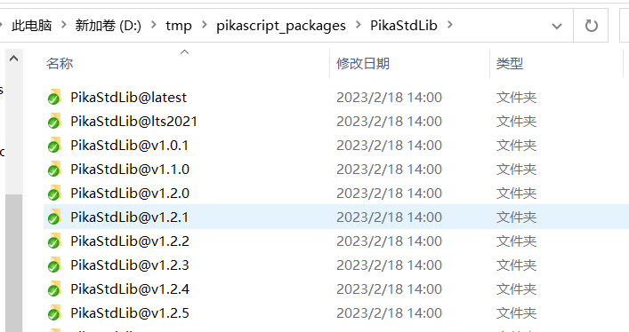
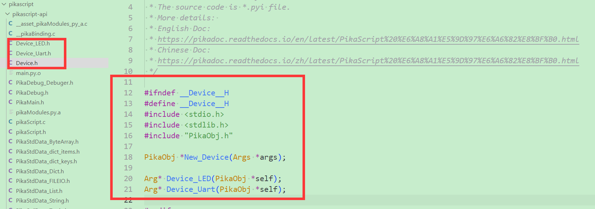

以这里生成的lvgl的工程目录来作为阅读材料。

http://pikascript.com/

看官方仓库还是内容多了，不容易甄别。

之前在rt-thread的开发者会议上认识了作者。

看着这个系统逐渐完善起来。

现在觉得有必要系统学习一下。

因为micropython真的很乱。那种写法让我很难阅读和分析。

pika的代码量不大，写法也是比较清晰的。

最长的文件，是pikaVM.c，也只有3000多行。

```
obj_runNativeMethod
	
```


# 搭建docker环境

https://pikadoc.readthedocs.io/zh/latest/get-start_linux.html

下载代码：

```
git clone https://gitee.com/lyon1998/pikapython
cd pikapython/docker 
# build镜像
bash build.sh
# 运行容器
sh run.sh

```

然后要初始化linux port

```
cd port/linux
bash pull-core.sh
bash init.sh
```

运行repl

```
bash run.sh
```

但是这种方式并没有成功。

# 直接在linux下进行编译操作

因为docker方式没有成功。

我直接在linux下进行安装和编译看看。


# visual studio工程

直接从官网下载visual studio的硬件无关的工程。

因为我的vs是2017版本的。

所以直接打开工程文件编译是有问题的。

把问题在谷歌搜索一下，根据提示进行解决。都是需要设置一下就好了。

可以正常运行。

# 增加python代码

参考这一节。

https://pikadoc.readthedocs.io/zh/latest/module_import.html

在main.py的相同目录下，新建一个test.py文件。

```
# test.py
def mytest():
    print('hello from test.py!')

def add(a, b):
    return a + b
```

然后在main.py里调用

```
import PikaStdLib

print('hello pikascript')
import test

print('test start...')

test.mytest()
print(test.add(3, 5))

print('test end...')
```

然后双击执行一下rust-msc-latest-win10.exe文件。

就会把python文件内容提取生成到c文件里。

然后编译执行就可以看到效果了。

# PikaPackage工具

PikaPackage 是一个 windows 平台的单体应用程序。基于 go 语言开发，集成了 go-git 组件，能够在不安装 git 的情况下，实现 git 仓库的拉取、更新和版本切换功能。

下载的代码在这里：

D:\tmp\pikascript_packages

会有多个版本的代码。



/tmp 目录指的是 pikaPackage.exe 当前所处的磁盘的根目录里的 tmp 文件夹。

比如，如果 pikaPackage.exe 在C盘，那么 /tmp 就是 C:/tmp ，如果在 D 盘，那么 /tmp 就是 D:/tmp 。


# 编写C模块

上面我们看了新增python代码的方式，非常简单。

那么怎么增加C模块实现呢？

参考这个

https://pikadoc.readthedocs.io/zh/latest/PikaScript%20%E6%A8%A1%E5%9D%97%E6%A6%82%E8%BF%B0.html

每一个 PikaPython **C模块** 由 **模块接口** 和 **模块实现** (package implement)两部分组成。

我们继续在vs的工程下面来做。

新增一个Device.pyi的文件。这个就是模块接口文件。

```
# Device.pyi

class LED:
    def on(self):
        pass
    def off(self):
        pass

class Uart:
    def send(self, data:str):
        pass
    def setName(self, name:str):
        pass
    def printName(self):
        pass
```

可以看到，Device.pyi 中使用 pyhon 标准语法定义了两个类，分别是 `LED` 类和 `Uart` 类。

LED类中定义了两个方法，分别是 `on()` 方法和 `off()` 方法，而`Uart`类则定义了 `send(data:str)` 方法、 `setName(name:str)` 方法和 `printName()` 方法。

可以看到，这些方法都有一个特点，

与其说这是方法的 **定义**，不如说是方法的 **声明**（注解），

因为所有的方法实现都 pass 掉了，都没有写实现。

而且方法的入口参数都是带有 **类型声明** 的。

比如 `data:str` 就表示一个`data` 参数，参数类型为 `str` 即字符串类型。

这是因为这个模块的模块实现是由 C 语言编写的，

也就是说，PikaPython 的 C 模块，

都是使用 python 语法编写声明，

而使用 C 语言编写实现。

PikaPython 的模块开发是一种 **面向接口** 编程的 **混合编程** 技术。

然而在使用已有的模块时，是不需要了解模块实现的，只需要了解模块接口，即可使用这个模块。

新增执行rust工具生成api接口文件。如下：



接下来我们就需要对这些函数进行实现。

为了模块管理的方便，我们把实现文件都放在 pikascript-lib 文件夹下，

在pikascript-lib目录下，新建一个Device目录。然后目录下新建2个c文件。

建议用 "模块名_类名.c" 的命名方式为每一个类新建一个 .c 文件，提高代码的清晰性。

```
Device_LED.c
Device_Uart.c
```

需要实现的函数，在生成的头文件里已经有了。

我们把原型拷贝过来修改。

```
#include <stdio.h>
#include <stdlib.h>
#include "PikaObj.h"

void Device_LED_off(PikaObj *self) {
    pika_platform_printf("[c]device led on called\n");
}
void Device_LED_on(PikaObj *self){
    pika_platform_printf("[c]device led off called\n");
}

```

然后rust工具生成一下代码。

在vs里把新增的2个c文件加入到编译里。

就可以运行测试代码：

```
# main.py
import Device
import PikaStdLib

led = Device.LED()
uart = Device.Uart()
mem = PikaStdLib.MemChecker()

print('hello wrold')
uart.setName('com1')
uart.send('My name is:')
uart.printName()
print('mem used max:')
mem.max()
print('mem used now:')
mem.now()
```

使用完全正常。

# 跟lvgl的binding

这个是比较实用的一个功能。

顺便一起分析一下lvgl的整体构成。

lvgl的基础是lv_obj_t这个结构体。

```
lv_obj_class_t
	对象所属的类。
struct _lv_obj_t * parent;
	父对象。
	
```

lv_obj_class_t 的构成

```
const struct _lv_obj_class_t * base_class;
	基类。
constructor_cb
	构造函数
destructor_cb
	析构函数
	参数都是_lv_obj_class_t和_lv_obj_t指针。
event_cb
	时间回调。
	
```


# 代码分析

这个对应python里的`__new__`和`__init__`函数。

```
typedef PikaObj* (*NewFun)(Args* args);
typedef PikaObj* (*InitFun)(PikaObj* self, Args* args);
```


```
class_defineMethod

一个普通的方法
typedef void (*Method)(PikaObj* self, Args* args);
```


有不少自动生成的代码。这个是比较关键的点。

生成代码的方案，比用宏定义展开的可读性要更好。

这个是pika跟micropython的重要区别。


很多New_xx命名的函数。这种很重要。


pika在lvgl ubuntu vscode sim下运行

因为我只有这个测试环境。

也比较习惯这个测试环境。看看怎么跑起来。


# 参考资料

1、

