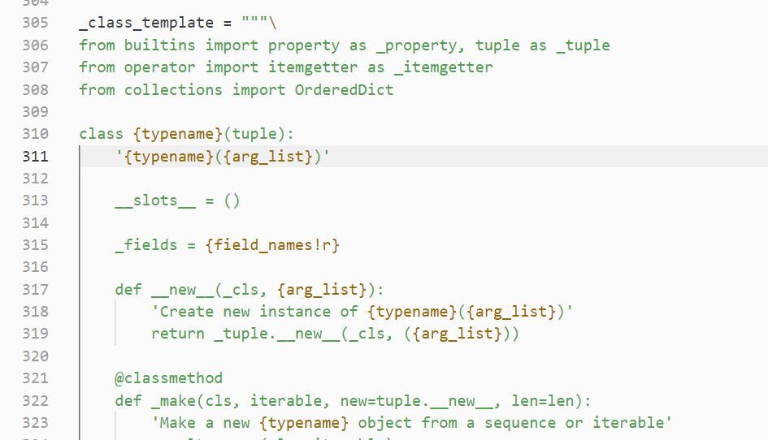

Python里的容器类。

我们先看help可以看到信息。

```
DESCRIPTION
    This module implements specialized container datatypes providing
    alternatives to Python's general purpose built-in containers, dict,
    list, set, and tuple.
    
    * namedtuple   factory function for creating tuple subclasses with named fields
    * deque        list-like container with fast appends and pops on either end
    * Counter      dict subclass for counting hashable objects
    * OrderedDict  dict subclass that remembers the order entries were added
    * defaultdict  dict subclass that calls a factory function to supply missing values
```

collections模块，是用来提供对python内建容器tuple/list/dict/set的替代选择。

```
Counter
	dict的子类。提供了可哈希对象的计数功能。
	里面的内容是：以对象的hash值为key，以该对象的出现次数为value。
	具体可以运用在哪些场景呢？
	
```


我们一个个学习一下。

# namedtuple

有名元组。

为什么要引入这个类呢？

tuple，我们知道它的作用就是表示一个不变的集合。

一个坐标点，我们可以这样表示：

```
p = (1,2)
```

但是我们也难直接看出这个tuple是表示一个坐标的。

当然我们可以自己定义一个类来表示，但是这样太小题大做了。

所以就引入了namedtuple这个东西。

可以这样用：

```
from collections import namedtuple
Point = namedtuple('Point', ['x', 'y'])
p = Point(1,2)
print(p.x, p.y)
```

这个在代码内部，还是通过代码模板生成了一个实实在在的class的。



# deque

双向队列。

这个是为了解决list插入删除元素很慢的问题。

```
#!/usr/bin/python3

from collections import deque

q = deque(['a', 'b', 'c'])
q.append('x')
q.appendleft('y')
print(q)
```

```
teddy@teddy-ubuntu:~/work/test/python$ ./test.py 
deque(['y', 'a', 'b', 'c', 'x'])
```


# Counter

Counter是一个简单的计数器。

例如可以用来统计字符出现的次数。

```
#!/usr/bin/python2

from collections import Counter
c = Counter()
for ch in 'programming':
	c[ch] = c[ch] + 1
print c
```

```
teddy@teddy-ubuntu:~/work/test/python$ ./test.py 
Counter({'g': 2, 'm': 2, 'r': 2, 'a': 1, 'i': 1, 'o': 1, 'n': 1, 'p': 1})
```

`Counter` 是 Python 标准库 `collections` 模块中的一个类，用于计数可迭代对象中各元素的出现次数。它提供了一种方便快捷的方式来统计元素的频率，通常用于对数据集进行频率分析、统计词频等。

以下是 `Counter` 类的一些常用方法和功能：

1. **计数元素出现次数**：
   `Counter` 类可以接受任何可迭代对象作为输入，例如列表、字符串、元组等，并统计其中元素的出现次数。

   ```python
   from collections import Counter

   data = ['a', 'b', 'c', 'a', 'b', 'a']
   counter = Counter(data)
   print(counter)  # 输出: Counter({'a': 3, 'b': 2, 'c': 1})
   ```

2. **访问计数结果**：
   可以通过元素的键来访问其对应的计数结果。

   ```python
   print(counter['a'])  # 输出: 3
   ```

3. **计算不同元素的数量**：
   使用 `len()` 函数可以获取计数器中不同元素的数量。

   ```python
   print(len(counter))  # 输出: 3
   ```

4. **获取最常见的元素**：
   `Counter` 对象提供了 `most_common()` 方法，可以返回出现频率最高的元素及其计数。

   ```python
   print(counter.most_common(2))  # 输出: [('a', 3), ('b', 2)]
   ```

5. **更新计数**：
   可以使用 `update()` 方法更新计数器的计数。

   ```python
   counter.update(['a', 'b', 'c', 'd'])
   print(counter)  # 输出: Counter({'a': 4, 'b': 3, 'c': 2, 'd': 1})
   ```

`Counter` 类提供了一种非常方便的方式来快速统计可迭代对象中元素的出现次数，并且可以轻松地进行统计结果的操作和分析。

# OrderedDict

对于dict，key是无序的，所以在对dict进行迭代的时候，无法确定key的顺序。

如果我们要保证是有序的。

就要使用OrderedDict。

```
#!/usr/bin/python2

from collections import OrderedDict
d = dict([('a',1), ('b',2), ('c', 3)])
print d
od = OrderedDict([('a', 1), ('b', 2), ('c', 3)])
print od
```

```
teddy@teddy-ubuntu:~/work/test/python$ ./test.py 
{'a': 1, 'c': 3, 'b': 2}
OrderedDict([('a', 1), ('b', 2), ('c', 3)])
```


# defaultdict

defaultdict跟dict的不同在于：

dict在key不存在的时候，会抛出KeyError，

而defaultdict会返回一个默认值。

```
#!/usr/bin/python2

from collections import defaultdict
dd = defaultdict(lambda: 'N/A')
dd['key1'] = 'aaa'
print dd['key1']
print dd['key2']
```

`defaultdict` 是 Python 标准库中 `collections` 模块中的一个类，

它是 `dict` 的一个子类，

提供了一个方便的方式来创建默认值（default values）的字典。

在普通的字典中，如果访问一个不存在的键，会抛出 KeyError 异常，

而 `defaultdict` 允许我们指定默认值的类型，当访问不存在的键时，会自动返回该默认值。

以下是 `defaultdict` 类的一些常用方法和功能：

1. **创建 `defaultdict` 对象**：
   可以通过传递一个默认工厂函数（default factory function）作为参数来创建 `defaultdict` 对象。当访问不存在的键时，该函数会被调用以生成默认值。

   ```python
   from collections import defaultdict

   # 创建一个默认值为 int 类型的 defaultdict 对象
   d = defaultdict(int)
   ```

2. **添加元素**：
   与普通字典一样，可以使用键来向 `defaultdict` 中添加元素。

   ```python
   d['a'] = 1
   d['b'] = 2
   ```

3. **访问元素**：
   与普通字典一样，可以通过键来访问 `defaultdict` 中的元素。如果访问的键不存在，则返回默认值。

   ```python
   print(d['a'])  # 输出: 1
   print(d['c'])  # 输出: 0 (因为 int 的默认值是 0)
   ```

4. **自定义默认值**：
   除了使用内置类型作为默认值外，还可以传递一个自定义的函数作为默认工厂函数，以生成自定义类型的默认值。

   ```python
   from collections import defaultdict

   # 创建一个默认值为 list 类型的 defaultdict 对象
   d = defaultdict(list)

   d['a'].append(1)
   d['b'].append(2)

   print(d['a'])  # 输出: [1]
   print(d['c'])  # 输出: [] (因为 list 的默认值是空列表)
   ```

`defaultdict` 类提供了一种方便的方式来处理字典中的缺失键，并且可以避免使用额外的逻辑来处理 KeyError 异常。

# ChainMap

`ChainMap` 是 Python 标准库中 `collections` 模块中的一个类，用于将多个字典或映射（mapping）链式链接起来，形成一个逻辑上的字典视图。它可以用于在多个字典之间进行快速的查找操作，并且可以保持字典的原始顺序。

以下是 `ChainMap` 类的一些常用方法和功能：

1. **创建 `ChainMap` 对象**：
   可以通过传递多个字典或映射对象作为参数来创建 `ChainMap` 对象。

   ```python
   from collections import ChainMap

   # 创建一个 ChainMap 对象
   dict1 = {'a': 1, 'b': 2}
   dict2 = {'b': 3, 'c': 4}
   chain_map = ChainMap(dict1, dict2)
   ```

2. **访问元素**：
   可以通过键来访问 `ChainMap` 对象中的元素。如果键在多个字典中存在，则返回第一个找到的键对应的值。

   ```python
   print(chain_map['a'])  # 输出: 1
   print(chain_map['b'])  # 输出: 2 (在 dict1 中找到了键 'b'，因此返回 2)
   print(chain_map['c'])  # 输出: 4
   ```

3. **更新元素**：
   `ChainMap` 对象支持更新操作，可以像普通字典一样对其进行修改、添加和删除操作。

   ```python
   chain_map['d'] = 5  # 添加新元素
   del chain_map['a']  # 删除元素
   ```

4. **查找子地图（子视图）**：
   可以通过 `maps` 属性来获取 `ChainMap` 对象中所有的字典或映射。

   ```python
   print(chain_map.maps)  # 输出: [{'a': 1, 'b': 2}, {'b': 3, 'c': 4}]
   ```

5. **新建子地图**：
   可以通过 `new_child()` 方法来创建一个新的 `ChainMap` 对象，包含一个新的字典作为第一个地图，而其他地图保持不变。

   ```python
   new_dict = {'e': 6, 'f': 7}
   new_chain_map = chain_map.new_child(new_dict)
   ```

`ChainMap` 类提供了一种方便的方式来组合多个字典或映射对象，并且可以在逻辑上将它们链接在一起，形成一个单一的视图。这使得在多个字典之间进行查找和更新操作变得更加简单和高效。

# 参考资料

1、Python中collections的用法

https://blog.csdn.net/u013007900/article/details/55271530