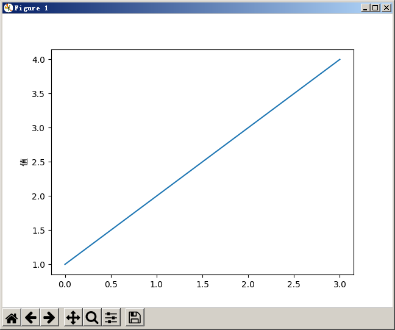
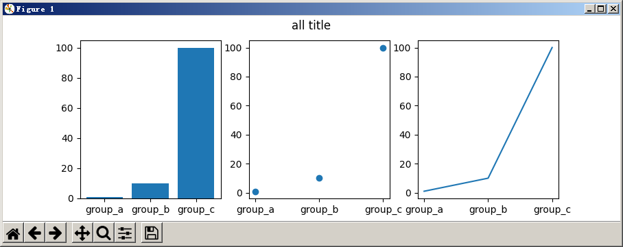
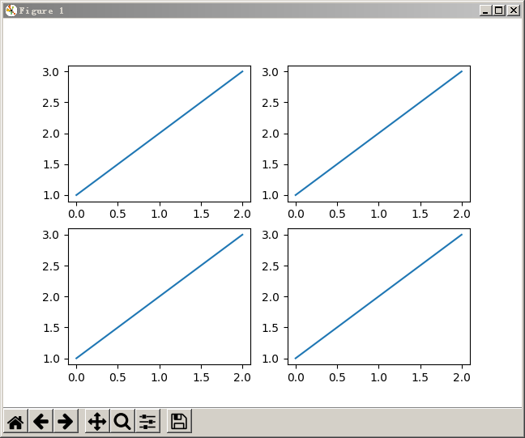
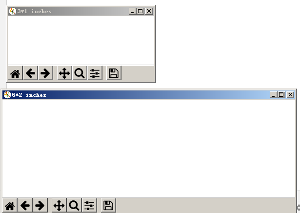

--

# pylot api

这是一组命令样式函数，使matplotlib的工作方式类似于matlab。

每个pylot函数对图形进行一些修改。

例如：创建图形、在图形中创建绘图区域、在绘图区域里绘制一些线、使用标签装饰绘图。

# 面向对象的api

matplotlib的核心是面向对象的。

如果要对plots进行更多控制和自定义，建议使用对象的方式。


我先只看pylot api的。因为我只是简单使用。

```
import matplotlib.pyplot as plt

plt.plot([1,2,3,4])
plt.ylabel('值', fontproperties = 'SimHei')
plt.show()
```

fontproperties必须要，不然中文显示不出来。



可以看到，x轴是从0到3，而y轴是1到4 

因为如果你只给plot函数提供一个list，那么就被当成y轴数据。

然后另外单独给你生成x轴的数据。

plot()函数是一个多用途的函数。

可以接收多个参数。

例如这样：

```
x_data = [1,2,3,4]
y_data = [1,4,9,16]
plt.plot(x_data, y_data)
```

设置你的图形的风格

除了x、y轴数据，后面还可以有一个参数，用来指定图形的风格。

这个风格跟matlab里类似。

默认的风格是`b-`，表示的是蓝色的实线。

如果你想要改成红色的点，那么这样：

```
plt.plot(x_data, y_data, 'ro')
```

在一个图里，画多个图形。

```
import matplotlib.pyplot as plt

names = ['group_a', 'group_b', 'group_c']
values = [1,10,100]

plt.figure(figsize=(9,3))

plt.subplot(131)
plt.bar(names, values)

plt.subplot(132)
plt.scatter(names, values)

plt.subplot(133)
plt.plot(names, values)

plt.suptitle('all title')
plt.show()
```




subplot函数

它的参数怎样理解？

```
# plot a line, implicitly creating a subplot(111)
plt.plot([1, 2, 3])
```

默认plot的，那么对应的subplot是subplot(111)

其实是可以分开成3个参数(1,1,1)

```
subplot(nrows, ncols, index, **kwargs)
```

第一个数字：行数。

第二个数字：列数。

第三个数字：索引值。

index从左上角的为1，往右边递增。

index还可以是一个元组(1,2)这样。这样就占据2/3的宽度。


我现在要画4个子图。

那就是两行两列。

```
subplot(2,2,1)
subplot(2,2,2)
subplot(2,2,3)
subplot(2,2,4)
```


```
import numpy as np
import matplotlib.pyplot as plt

plt.subplot(2,2,1)
plt.plot([1,2,3])

plt.subplot(2,2,2)
plt.plot([1,2,3])

plt.subplot(2,2,3)
plt.plot([1,2,3])

plt.subplot(2,2,4)
plt.plot([1,2,3])

plt.show()
```

得到的图形这样：



基本符合我的要求了。

现在要加上标题。


# figure函数

```
import numpy as np
import matplotlib.pyplot as plt
 
fig1 = plt.figure(num="3*1 inches",figsize=(3,1))   
fig2 = plt.figure(num="6*2 inches",figsize=(6,2))
 
plt.show()
plt.close
```

这样得到的是2个窗口。一个figure就是一个窗口。

figsize:以英寸为单位的宽高，缺省值为 rc figure.figsize (1英寸等于2.54厘米)





查看图片，可以用explorer.exe来打开图片。这样就是调用系统默认的图片查看工具来打开的。

现在显示图片没有问题，就是横轴需要拉长。


正弦波的，只要选取一个周期的。

直线型的，就把全部数据取出来。

# 生成exe

现在生成的exe运行不起来。

看执行的过程中，有打印一些错误。

```
23626 INFO: Import to be excluded not found: 'PySide'

ModuleNotFoundError: No module named 'tornado'
```

安装tornado试一下看看。

还是不行，看一下执行的错误信息。

```
Could not find the matplotlib data files
```

网上搜索了一下，说是需要把matplotlib版本降低到3.0.3或者3.1.3的。

我当前安装的是3.3.3的。

那就降级到3.0.3看看。

现在报错不一样了。

```
ModuleNotFoundError: No module named 'matplotlib.backends.backend_tkagg'
```

这个即使在pycharm里运行也是报这个错误。

```
ModuleNotFoundError: No module named 'tkinter'
```

安装一些tkinter，pycharm里运行再看看。

还是不行。

在我的python文件里，加上这个matplotlib.use("Agg")就可以了。

如下：

```
import matplotlib
matplotlib.use("Agg")
import matplotlib.pyplot as plt
```

现在再生成exe，执行也正常了。


参考资料

1、

https://www.matplotlib.org.cn/API/

2、三、Matplotlib系列---pyplot的中文显示

https://blog.csdn.net/skyli114/article/details/77508247

3、例子

https://www.matplotlib.org.cn/gallery/#lines-bars-and-markers

4、

https://matplotlib.org/3.3.3/api/_as_gen/matplotlib.pyplot.subplot.html

5、matplotlib将图横向拉长，自定义x轴

https://blog.csdn.net/TH_NUM/article/details/108817356

6、

https://stackoverflow.com/questions/63103147/could-not-find-the-matplotlib-data-files

7、

https://blog.csdn.net/a214919447/article/details/73870705