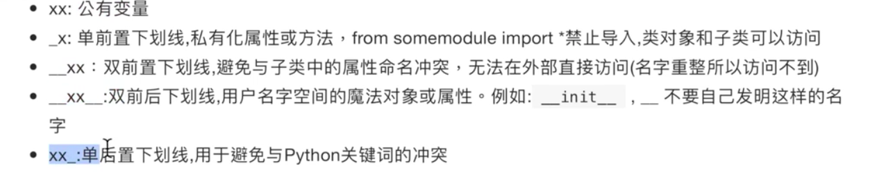

1

dunder名称：d表示double。表示双下划线。

sunder名称：s表示single。表示单下划线。




Python里的下划线分单下划线和双下划线两种。位置有前、后两个。

所以，样式有下面这些：

没有解释的，表示一般不这么用。

```
_aa：表示文件的私有的属性。from xx import *不会导入这种的。
aa_
_aa_
__aa：类的私有变量名。
aa__
__aa__：系统定义名字。

```


在命令行交互里，表示上一条命令的执行的结果。类似shell里的`$?`。

举例：

```
>>> 42
42
>>> _
42
>>> 
```


# python里类的保留方法

## 类的基础方法

1、新建一个类对象。

```
x = MyClass()
实际调用x.__init__()
```

2、字符串的官方表现形式。

```
repr(x)
实际调用x.__repr__()
```

3、字符串的非官方表现形式。

```
str(x)
实际调用x.__str__()
```

4、字节数组的非正式值。

```
bytes(x)
实际上调用x.__bytes__()
```

5、格式化字符串。

```
format(x, fmt）
实际调用x.__format__(fmt)
```

## 行为方式跟迭代器类似的类

1、遍历某个序列。

```
iter(seq)
实际调用seq.__iter__()
```

2、从迭代器取下一个值。

```
next(seq)
实际调用seq.__next__()
```

3、按逆序创建一个迭代器

```
reversed(seq)
实际调用seq.__reversed__()
```

## 可以在with语句块里使用的类

witch open(filename) as f:

实际上调用了：

```
f.__enter__()
f.__exit__()
```


本文介绍了Python中单下划线和双下划线（"dunder"）的各种含义和命名约定，

名称修饰（name mangling）的工作原理，以及它如何影响你自己的Python类。


单下划线和双下划线在Python变量和方法名称中都各有其含义。

有一些含义仅仅是依照约定，被视作是对程序员的提示 

而有一些含义是由Python解释器严格执行的。


# 参考资料

1、Python中下划线---完全解读

https://www.cnblogs.com/skying555/p/6169110.html

2、Python中下划线的5种含义

https://zhuanlan.zhihu.com/p/36173202