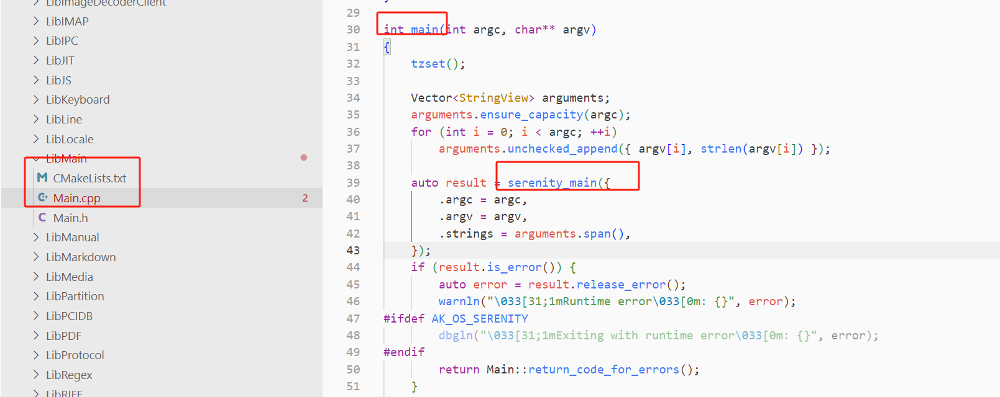

--

# 资源收集

SerenityOS: From zero to HTML in a year

https://serenityos.org/happy/1st/

# 简介

代码都是基于bsd协议的，所以非常适合在自己的项目里进行复用。

虽然目前的界面是比较复古的。但是软件上的设计理念都是很现代化的。


# Andreas Kling的技术能力和背景介绍

**Andreas Kling** 是一位经验丰富的开发者，以其在开源项目**SerenityOS** 和**Ladybird** 浏览器引擎的工作而闻名。他的技术背景和能力体现在以下几个方面：

### 技术能力与背景：
1. **自学成才**：
   - Andreas Kling 并没有正式的计算机科学教育背景，他是通过自学掌握了编程和软件开发的技能。他在多年的工作中积累了丰富的实践经验，并且对低层系统编程有深入的理解【25†source】。

2. **开源项目贡献者**：
   - Kling 最为人熟知的是他发起并主导开发了 **SerenityOS**，一个从零开始构建的复古风格的操作系统。这个项目展示了他在操作系统开发、图形用户界面、内核开发和应用开发方面的广泛能力。SerenityOS 不仅仅是一个操作系统，更是一个完整的生态系统，包括文件管理器、文本编辑器、音乐播放器等应用，这些都是 Kling 亲自编写或指导开发的【25†source】【26†source】。

3. **Ladybird 浏览器开发**：
   - 作为**Ladybird** 浏览器项目的领导者，Kling 展示了他在浏览器引擎开发方面的深厚技术功底。Ladybird 是一个从头开发的浏览器引擎，旨在与现代Web标准兼容，这要求对 HTML、CSS、JavaScript 引擎以及网络协议的深刻理解。

4. **职业背景**：
   - 在创立 SerenityOS 之前，Kling 曾在多个软件公司工作，担任过不同的开发职位。他的职业生涯涵盖了广泛的软件开发领域，包括桌面应用、系统工具和开发工具的开发。

5. **内容创作与教育**：
   - Kling 也非常活跃于技术博客和视频内容的制作中，他经常分享他的开发过程、技术见解和编程知识，这些内容在技术社区中获得了广泛的关注和支持。他的YouTube频道详细记录了 SerenityOS 和 Ladybird 的开发过程，为开发者提供了宝贵的学习资源【26†source】。

### 影响与期望：
- Kling 的工作不仅为开源社区带来了新的项目和工具，还激励了许多开发者参与到低层次编程和操作系统开发中。SerenityOS 和 Ladybird 都体现了他追求高质量、精简设计的理念，他通过这些项目展示了如何从零开始构建复杂的系统。

Kling 的技术能力和持续的贡献使他成为开源社区中备受尊敬的开发者之一。

# 编译执行

参考这里来做。

https://github.com/SerenityOS/serenity/blob/master/Documentation/BuildInstructions.md

对编译器的要求是支持c++23，所以需要gcc 13或者clang 17以上版本。

越新越好。

```
sudo apt install build-essential cmake curl libmpfr-dev libmpc-dev libgmp-dev e2fsprogs ninja-build qemu-system-gui qemu-system-x86 qemu-utils ccache rsync unzip texinfo libssl-dev
```

```
sudo apt install gcc-13 g++-13
```

然后执行下面命令进行构建：

```
Meta/serenity.sh run
```

会输出到Build/x86_64/Root目录下。然后在完成后自动启动qemu进行执行。

请注意，默认情况下， `anon`用户无需密码即可成为`root` ，以方便开发。为了防止这种情况，请从`wheel`组中删除`anon` ，它将不再能够运行`/bin/su` 。

默认情况下， `anon`用户帐户的密码是： `foo`

所有的编译都是从顶层的CMakeLists.txt来控制的。

编译kernel和应用一起来了。

c库是怎么编译的？

依赖关系是怎么制定的？

总的来说，是基本杜绝了Makefile。

都拷贝cmake和脚本来做的。

从编译打印看，总共是需要编译大概6000个文件。

编译时把cpu都占满了。

我需要指定一下并行编译的数量。

```
export MAKEJOBS=10
Meta/serenity.sh run
```

编译很顺利。没有报错。

但是我的linux桌面本来就是docker的方式运行的。里面再启动qemu就报错了。


# 编码规范

Documentation\CodingStyle.md

这个编码规范还是不错的。约定还比较清晰。

首先是有一个全局的.clang-format文件。

需要clang-format版本18以上。

命名结合使用了驼峰和蛇形命名。

简单来说，就是python的那种命名风格。

class等数据类型使用驼峰，namespace也是。

所有的变量和函数名都用蛇形。

常量都使用全大写。

尽量不使用缩写，除非是很常见的容易理解的。

成员变量使用`m_`前缀。

static变量使用`s_`前缀。

global变量使用`g_`前缀。

对于成员变量的get/set这样：

```
void set_count(int);
int count() const;//而不是get_count()，这样啰嗦了。
```

但是如果是通过参数的方式来返回内容的get函数，需要加上get。例如：

```
void get_filename_and_inode_id(String& , InodeIdentifier &);
```

当一个变量有两个getter，其中一个自动确保请求的对象被实例化时，在getter函数前加上ensure_。因为它确保创建了一个对象，所以它也应该返回一个引用，而不是指针。

```cpp
Inode* inode();
Inode& ensure_inode();
```

在函数声明中排除无意义的变量名。

一个好的经验法则是，如果参数类型名称包含参数名称（不包括尾随数字或复数形式），那么就不需要参数名称。通常，布尔值、字符串和数字类型应该有参数名称。 

```cpp
void set_count(int);//就是这里形参没有写，因为很明显。

void do_something(Context*);
```

使用const来替代#define。

使用`#pragma once`替代`#ifdef`。

循环优先使用迭代器。

关于指针和引用：

函数的 out 参数应通过引用传递，除非在极少数情况下它是可选的，在这种情况下它应通过指针传递。

看下面的例子：

```cpp
void MyClass::get_some_value(OutArgumentType& out_argument) const
{
    out_argument = m_value;
}

void MyClass::do_something(OutArgumentType* out_argument) const
{
    do_the_thing();
    if (out_argument)
        *out_argument = m_value;
}
```

关于using的使用，直接写全称。不use namespace。

在class和struct的使用上，优先使用class。

struct里的变量，不要使用`m_`前缀。所有内容都public。

关于单例模式。使用一个名字为the的函数。

```cpp
class UniqueObject {
public:
    static UniqueObject& the();
...
```

注释要写得规范，像一个规范的句子，首字母大写，结尾用句号。

# 一些常用的pattern

这些模式是从长期的开发过程中总结出来的。

## TRY错误处理

是一个宏。

TRY()这个宏包围的任何代码都被尝试执行。

出现错误则就会立即返回。

作用类似rust里的`?`操作符。

## MUST宏

跟TRY这个宏类似，但是失败的话，就会导致abort。

## serenity_main入口函数

用这个替代了main。处理错误机制更方便。

```
#include <LibMain/Main.h>

ErrorOr<int> serenity_main(Main::Arguments arguments)
{
    return 0; 
}
```

Userland\Libraries\LibMain\Main.h 在这里定义。



以About这个app为例。

Userland\Applications\About\CMakeLists.txt

链接了LibMain来得到可执行文件：

```
target_link_libraries(About PRIVATE LibCore LibGfx LibGUI LibMain)
```


https://github.com/SerenityOS/serenity/blob/master/Documentation/Patterns.md

# AK库

ak库是serenity的基础库。类似c++的stl。

这里有关于这个库的文档的讨论。

https://github.com/SerenityOS/serenity/issues/1344


# 移植的一些库和代码

https://github.com/SerenityOS/serenity/blob/master/Ports/AvailablePorts.md

# gui编程

https://awesomekling.github.io/Introduction-to-SerenityOS-GUI-programming/

# monorepo是一个什么开发理念

Monorepo（单一代码库）是一种软件开发理念，指的是将多个相关项目或模块存储在同一个代码仓库中，而不是为每个项目分别维护独立的代码库。

### 主要特点

1. **统一管理**：
   - 所有代码在一个仓库中，便于版本控制和管理。

2. **共享代码**：
   - 各个项目之间可以轻松共享代码和依赖，减少重复工作。

3. **一致性**：
   - 统一的依赖管理和工具链，可以保持项目间的一致性。

4. **简化协作**：
   - 团队成员可以在同一个仓库中协作，减少了跨仓库的沟通成本。

### 优点

- **简化依赖管理**：由于所有项目在同一仓库中，依赖关系更易于管理。
- **提高开发效率**：可以跨项目进行更改，减少了版本不兼容的问题。
- **更好的代码可重用性**：推动模块化设计，鼓励重用代码。
- **简化 CI/CD**：持续集成和持续部署流程可以在同一环境中运行，简化了配置。

### 缺点

- **仓库规模庞大**：随着项目增多，代码库可能变得庞大，影响克隆和构建速度。
- **复杂的工具链**：管理和构建多个项目可能需要复杂的工具支持。
- **权限管理**：难以对不同团队或项目设置不同的访问权限。

### 适用场景

- 大型企业或组织，开发多个紧密相关的产品。
- 需要频繁共享代码和库的项目。
- 追求高效协作和一致性开发流程的团队。

### 示例

一些著名的公司，如 Google、Facebook 和 Twitter，都采用了 monorepo 的开发策略，以提高代码管理和团队协作的效率。