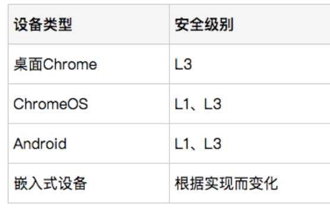
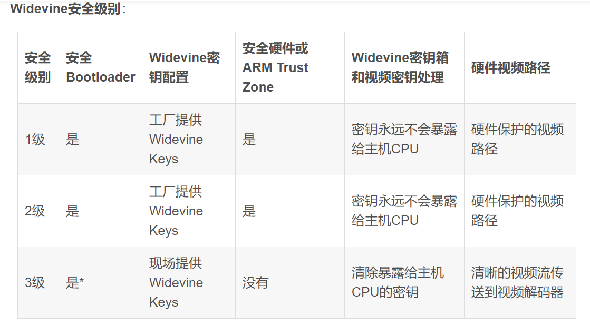

--

最近要使用AmazonMusic，就涉及到Widewine的内容。研究一下。

# 什么是widewine

Widevine DRM是谷歌旗下的DRM解决方案（谷歌于2010年收购了Widevine）。

它是一种流行的DRM解决方案，在Web和移动生态系统中获得了广泛支持。

先来了解Widevine的历史及其支持。Widevine一共有两个版本，分别是Classic和Modular。

Widevine Classic

Widevine Classic仅在传统设备中支持，并且要求媒体被打包成专有的**.wvm**格式。它曾支持旧版本的Android系统（3.1~5.1）、传统智能电视、Google TV等等，现在已不再使用。

Widevine Modular

Widevine Modular是Widevine的当前版本，支持MPEG-DASH、HLS和MSS协议，同时支持CMAF、CENC和HTML5标准（如EME和MSE）。

Widevine主要由以下几部分构成：

**1. CENC、CDM、EME和MSE**

**2. Widevine许可证服务器**

Widevine提供一个许可证服务器，其中包含了安全加密和解密媒体所需的信息。

**3. Shaka 打包器**

Widevine提供了一个完全开源的MPEG-DASH打包软件——Shaka Packager

# widewine工作原理

## 第一步

当用户按下播放时，第一步就开始了。

应用从cdn下载mpd。

```
mpd就是mpeg-dash，是一个清单文件。
```

在解析mpd文件后，就可以确定该video是否使用widewine加密视频。

浏览器从文件中提取initData并作为event发送给播放器。

## 第二步

播放器无法解密内容，需要专业的解密软件的帮助。

所以他把初始化信息发送给CDM（Content Decrypttion Module内容解密模块）

## 第三步

CDM接收到播放器发来的初始化信息，创建license request，回复给播放器。

## 第四步

播放器收到license request后，把这个请求转发给Widewine license server。

这个request是加密的，不会被破解。

## 第五步

Widewine license server收到请求后，执行：

1、解密请求，并在自己的数据库里找到license信息。

2、把找到的license加密并回复给播放器。

3、回复的信息包括：秘钥、过期时间。

## 第六步

播放器收到license，传递给CDM。

## 第七步

因为CDM不在可信层里，所以它必须把license传递给可信层里的OEMCrypto Module。

解密实际由OEMCrypto Module来完成。

## 第八步

一旦内容被解密，视频会以切片的方式发送给屏幕。

不会存储在设备里。

# widewine的3个安全级别

## L1

L1是Widewine里最高的安全级别，提供硬件级别的解密，这个比软件方式要更加安全。

内容解密、媒体解码和渲染都在TEE里完成。

## L2

只有解密是在TEE里完成。

解码后的视频数据发给应用进行解码和渲染。

## L3

这个安全性最低，用于没有TEE的低端硬件。





# mpeg-dash

DASH，又叫MPEG DASH，

DASH：Dynamic Adaptive Streaming over HTTP ，

是一种在互联网上传送动态码率的Video Streaming技术，

类似于苹果的HLS，

DASH会通过media presentation description (MPD)将视频内容切片成一个很短的文件片段，

每个切片都有多个不同的码率，

DASH Client可以根据网络的情况选择一个码率进行播放，支持在不同码率之间无缝切换。


DASH是由MPEG (Moving Picture Experts Group)组织制定，

2010年开始启动，

2011年11月发布Draft版本，

2012年4月发布第一稿Version（ISO/IEC 23009-1:2012），

2014年5月发布第二稿（ISO/IEC 23009-1:2014），

最新稿（ISO/IEC 23009-3:2015）。


参考资料

1、

https://blog.csdn.net/huawei_eSDK/article/details/52123181

2、

https://blog.csdn.net/EasyNVR/article/details/104669809

# 参考资料

1、Google Widevine及其工作原理

https://blog.csdn.net/vn9PLgZvnPs1522s82g/article/details/123735585

2、

https://blog.csdn.net/songkai320/article/details/81702409