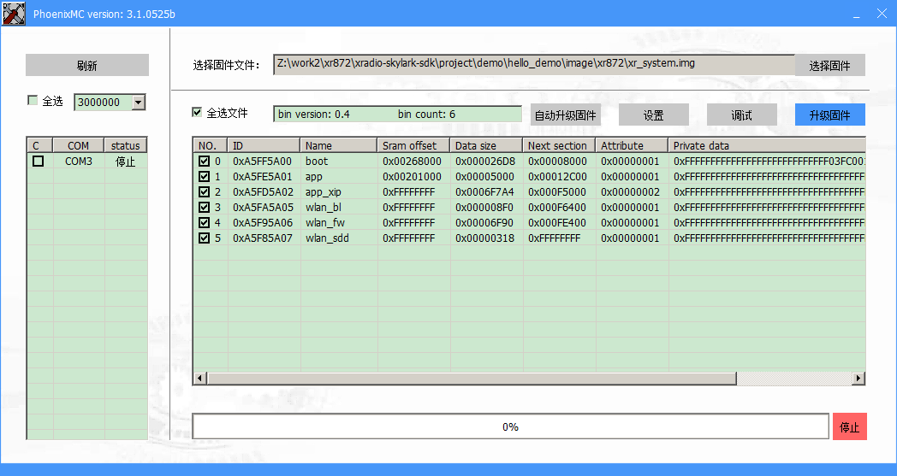
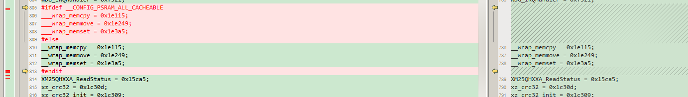
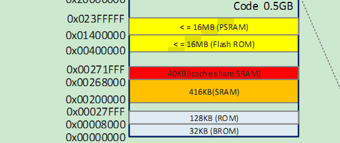
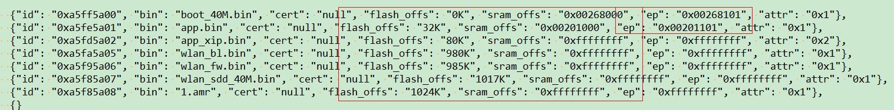
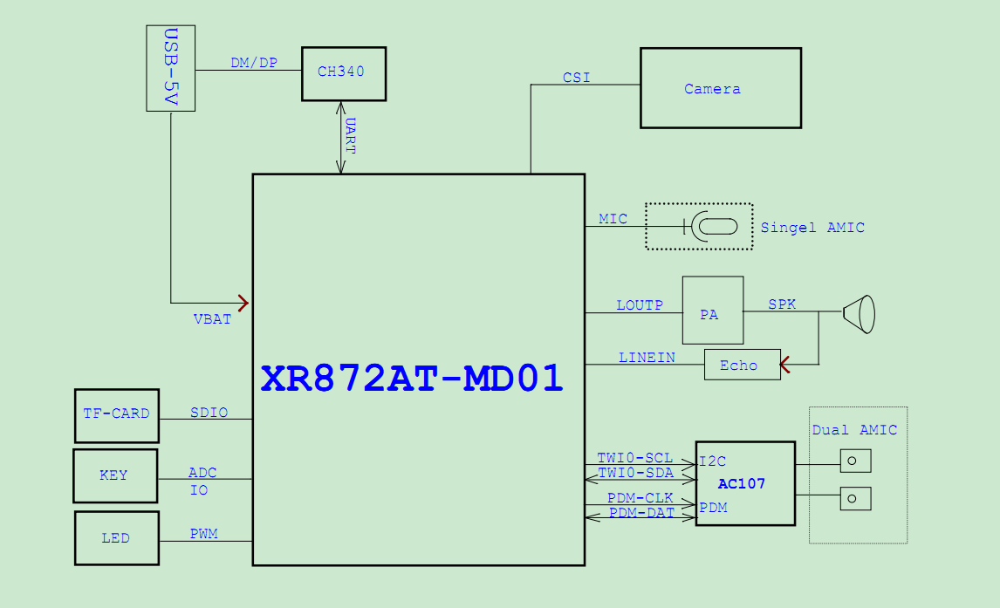
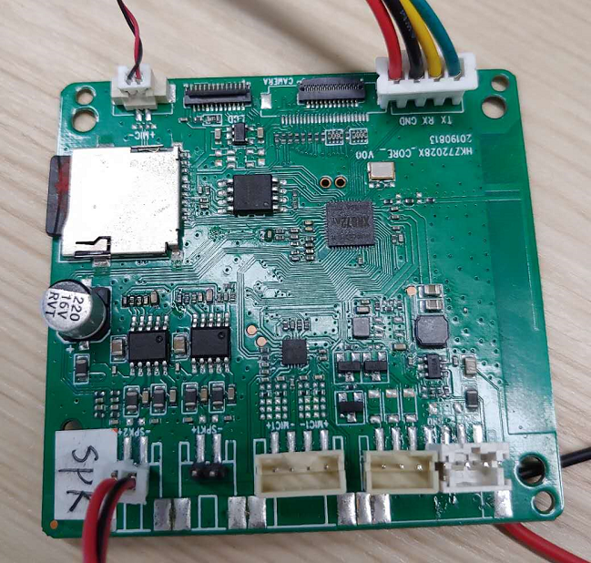
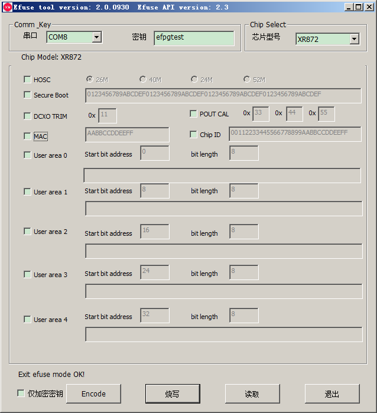

1

芯片是芯之联的。成立于2015年，在深圳南山。是全志的子公司。

2019.10 - 发布高性能智能WiFi MCU XR872

这里是评估板的手册。

https://xradiotech-developer-guide.readthedocs.io/zh/latest/download/2.%E4%BA%A7%E5%93%81%E6%8C%87%E5%AF%BC/XR872_EVB_User_Guide_V1.0.pdf

这个芯片是专注音频和图传的。

芯片架构是Cortex M4架构。主频384MHz。内置无线。

52个引脚的封装。

416K的ram，160K的内置rom。

评估板带了SIP 4M的PSRAM

4M的spi flash。

**内置的audio codec，支持单路mic输入，和单路的line out输出。**

**支持line in输入，用来做回采通路。**

先下载xr872的官方sdk，下载工具链，编译看看过程。

对比这一套跟stm32的区别。

主要看是在哪里封装寄存器的操作。

对freertos的接口进行了封装，接口比freertos的要清晰一些。

官方sdk下载地址：

https://github.com/XradioTech/xradio-skylark-sdk

工具链使用gcc。在Linux下进行开发。也可以用cygwin的方式。

目录：

```
├── bin 这里放的是一些bin文件。例如boot。
├── ChangeLog.md
├── chip.mk
├── config.mk
├── configure.sh 这个生成.config文件，就2个选项，一个soc的类型，一个晶振的频率。
├── gcc.mk 
├── include
├── lib  一些静态库。芯片的寄存器操作都已经封装到这里面了。这些还是src里的内容编译出来的。没有必要放在git上。估计他们错误上传了。
├── project
├── README.md
├── src  
└── tools 一些windows图形界面工具，进行烧录等操作。
```

寄存器的地址定义在include/driver/chip/chip.h里。

```
#define PWM_BASE            (PERIPH_BASE + 0x00042800)
#define I2S_BASE            (PERIPH_BASE + 0x00042C00)
#define GPADC_BASE          (PERIPH_BASE + 0x00043000)
```

相当于是一个Cortex M4的核心，跟一些无线电路进行了封装成一个新的芯片。

比起自己用stm32的通用芯片加外围无线电路的方式，集成度更高一些。

成本应该也要低一些。

对芯片的魔改没有很多。

软件的整体运行方式，还是很常规的单片机的方式。

没有像炬力那么神奇的搞法。也好。这样比较通用。调试难度没有那么大。

以examples/audio_record_and_play这个例子来分析。

```
int main(void)
{
	platform_init();

	printf("audio play + record start.\n");

	check_sample_rate(SAMPLE_RATE_OF_RECORD, SAMPLE_RATE_OF_PLAY);

	audio_play_start();

	audio_record_start();

	return 0;
}
```

为什么main函数没有阻塞呢？正常来说，这样就直接退出了。

那么就可能是修改了main函数的行为。

找一下它的命令行的实现方式。

在demo/hello_demo里。

这里的main函数就阻塞死循环了。这个阻塞的死循环不是必须的。因为audio_demo里，就没有阻塞死循环。

```
int main(void)
{
	platform_init();

	while (1) {
		OS_Sleep(10);
		printf("Hello world! @ %u sec\n", OS_GetTicks());
	}
	return 0;
}
```

在project/common/startup/gcc/startup.s里。这里死循环了。

```
  bl   _start # 这里会调用到main

LoopForever:
  b LoopForever
```

我还是有一点疑问，这个操作为什么不是把cpu占满100%呢？

应该是这样：cpu的占用率，是系统的统计行为，它把这个空转统计为空闲行为。

本质上，cpu一直在干活。

在startup/gcc目录下，

```
retarget.c  
retarget_main.c  
retarget_stdout.c
startup.s
```

仔细看上面这几个文件，可以看到用gcc的--wrap特性，把main函数替换为了`__wrap_main`。

```
int __wrap_main(void)
{
	static const GPIO_GlobalInitParam gpio_param = {
		.portIRQUsed  = PRJCONF_GPIO_PORT_IRQ_USED,
		.portPmBackup = PRJCONF_GPIO_PORT_PM_BACKUP
	};

	SystemCoreClockUpdate();
	timeofday_restore();
	HAL_GlobalInit();
	HAL_GPIO_GlobalInit(&gpio_param);
#if PRJCONF_SWD_EN
	HAL_SWD_Init();
#endif
#if PRJCONF_UART_EN
	stdout_init();
#endif
	main_task_start();
	return -1;
}
```

然后靠main_task_start里创建一个线程，去调用真正的main函数（用户实现）。

```
static void main_task(void *arg)
{
	__real_main();//这个就调用到用户的main函数了。所以可以阻塞，也可以不阻塞。没有关系。
	OS_ThreadDelete(&g_main_thread);
}

void main_task_start(void)
{
	if (OS_ThreadCreate(&g_main_thread,
	                    "main",
	                    main_task,
	                    NULL,
	                    PRJCONF_MAIN_THREAD_PRIO,
	                    PRJCONF_MAIN_THREAD_STACK_SIZE) != OS_OK) {
		printf("[ERR] create main task failed\n");
	}

	OS_ThreadStartScheduler();//这里是死循环阻塞，就是freertos的任务调度。
```

看看用户的main函数，需要做的事情有哪些？看hello_demo的main.c就好

```
int main(void)
{
	platform_init();

	while (1) {
		OS_Sleep(10);
		printf("Hello world! @ %u sec\n", OS_GetTicks());
	}
	return 0;
}
```

只有一个必须调用的函数：platform_init里就完成了所有必要的初始化操作。

```
platform_init
	platform_init_level0
		pm_start 电源管理。
		HAL_Flash_Init(0) 初始化flash
```


除了xip执行，还可以怎么执行？ram执行吗？太占内存了吧。

分析一下编译Makefile的层次关系，以及配置方法。

还是以hello_demo作为分析对象。

在hello_demo/gcc目录下，只有2个文件：Makefile和localconfig.mk。

Makefile内容：

```
首先包含localconfig.mk
	这个里面默认就2个配置，配置以__CONFIG_XX这种格式。
	export __CONFIG_XIP := y
	export __CONFIG_OTA := y
	所以默认是xip方式的。这个够用了。
include $(ROOT_PATH)/gcc.mk
	定义工具链。
	include $(ROOT_PATH)/config.mk
		include $(ROOT_PATH)/chip.mk
			-include $(ROOT_PATH)/.config
				这个里面就配置了芯片类型和晶振频率。
				__CONFIG_CHIP_TYPE ?= xr872
				__CONFIG_HOSC_TYPE ?= 40
			如果是872，则版本为2：
			__CONFIG_CHIP_ARCH_VER := 2
			
         定义了对标准库的wrap开关。
         允许对malloc进行跟踪。
         默认使用8.2.3的freertos版本。
         lwip默认用1.4.1的。
         是否支持wlan。
         __CONFIG_PSRAM 这个默认关闭。
         默认关闭bootloader。
include $(PRJ_MAKE_RULES)
	这个就是执行编译动作的。
```


看看编译出来的镜像文件。用工具读取出来是这样。

app和app_xip有什么区别？



看project下的文件。


先看看官网的文档。

https://xradiotech-developer-guide.readthedocs.io/zh/latest/zh_CN/get-started/

*XRADIOTECH的MCU平台仅支持串口打印信息辅助调试，暂不支持Keil，IAR等IDE集成开发环境*


# 链接脚本

从官网资料描述，链接脚本同时使用了sram、flash这多个段，靠链接脚本根据需要把不同的部分放在不同的位置里。

修改需要注意这些约束条件：

1、在中断里执行的代码和数据，不能位于.xip里。

2、没有指定到xip和psram的，默认是链接到sram里。


# 讯飞XR872套件

软件上功能包含语音唤醒+iFLYOS云端操作系统+离线命令词。

单麦降噪唤醒引擎，通过新一代神经网络降噪、去混响及 AGC 算法对拾取音频进行处理，实现普通环境下 3 米远场语音唤醒成功率 90%以上，近场语音唤醒成功率 95%以上，唤醒响应时间在毫秒级。

内存：SRAM 416KB

闪存：外挂8MB

重点看一下这个文档。

https://cdn.iflyos.cn/docs/xr872/development_manual.pdf

参考这个文档来把环境搭好。先编译出来跑起来。

金源德默认的用cygwin环境的，我刚好有cygwin的环境，也就按照他们的要求来。不节外生枝。

1、修改工具链路径。xradio-skylark-sdk-xradio-skylark-sdk-1.0.2/gcc.mk里。

2、

```
cd jyd_evm/gcc
make
make image
```

这个工程的localconfig.mk

```
export __CONFIG_XIP := y
export __CONFIG_OTA := y
export __CONFIG_PSRAM := y
export __CONFIG_XPLAYER := y
```

有psram。

它这一套可以放在xr872的sdk的外面，就是jyd_evm/gcc/Makefile里：

```
ROOT_PATH := ../../xradio-skylark-sdk-xradio-skylark-sdk-1.0.2
```


还需要搞清楚的是spi flash被用来做了什么。

当前看生成的image文件，是2M。这个在片内flash是放不下的。

那么只能放在spi flash里了。

我估计不完全是，有些xip的，应该还是烧录到片内flash的。

另外的部分，可能是从spi flash读取到psram里执行的。

所以还是看链接脚本。

对于XR872，`__CONFIG_ROM`默认是打开的。

```
# rom
ifeq ($(__CONFIG_CHIP_ARCH_VER), 1)
  __CONFIG_ROM ?= n
else
  __CONFIG_ROM ?= y
endif
```

所以下面的代码是打开的：

```
#if (defined(__CONFIG_ROM))
INCLUDE rom_symbol.ld
#endif
```

rom_symbol.ld里的内容，应该是动态生成的。是把所有的符号的位置列出来了。

```
abs = 0x20e2d;
ADC_DisableFifoDataDRQ = 0x8625;
ADC_DisableFifoDataIRQ = 0x8605;
ADC_EnableFifoDataDRQ = 0x8615;
__adddf3 = 0x25cad;
__aeabi_cdcmpeq = 0x264d1;
//...
```


sram在2M的位置。

rom在4M的位置。

psram在20M的位置，长度是4M。

xip里放的，大部分是应用库，例如网络、媒体。

以及rodata。

```
    .xip :
    {
        . = ALIGN(4);
        __xip_start__ = .;

        /* MUST not put IRQ handler/callback in .xip section */
        *libmp3.a: (.text .text.* .rodata .rodata.*)
        *libaac.a: (.text .text.* .rodata .rodata.*)
```

在compiler.h里。

```
#define __xip_text      __attribute__((section (".xip_text")))
#define __xip_rodata    __attribute__((section (".xip_rodata")))

#define __nonxip_text   __attribute__((section (".nonxip_text")))
#define __nonxip_rodata __attribute__((section (".nonxip_rodata")))
#define __nonxip_data   __attribute__((section (".nonxip_data")))
#define __nonxip_bss    __attribute__((section (".nonxip_bss")))

#define __psram_text    __attribute__((section (".psram_text")))
#define __psram_rodata  __attribute__((section (".psram_rodata")))
#define __psram_data    __attribute__((section (".psram_data")))
#define __psram_bss     __attribute__((section (".psram_bss")))

```

大部分的data，都是放在psram里。

```
    .psram_data :
    {
        . = ALIGN(4);
        __psram_data_start__ = .;
        *libmp3.a: ( .data .data.* vtable )
        *libaac.a: ( .data .data.* vtable )
        *libwav.a: ( .data .data.* vtable )
```

bss也是：

````
    .psram_bss :
    {
        . = ALIGN(4);
        __psram_bss_start__ = .;
        *libmp3.a: ( .bss .bss.* COMMON )
        *libaac.a: ( .bss .bss.* COMMON )
        *libwav.a: ( .bss .bss.* COMMON )
````

-R表示移除，hello_demo.bin就是移除xip段的结果。

而-j表示只保留，hello_demo_xip.bin就是只保留了xip段的结果。

```
~/tools/gcc-arm-none-eabi-4_9-2015q2/bin/arm-none-eabi-objcopy -O binary -R .xip   hello_demo.axf hello_demo.bin
~/tools/gcc-arm-none-eabi-4_9-2015q2/bin/arm-none-eabi-objcopy -O binary -j .xip hello_demo.axf hello_demo_xip.bin
~/tools/gcc-arm-none-eabi-4_9-2015q2/bin/arm-none-eabi-size hello_demo.axf
```

现在有个很大的疑问：HAL_CCM_BusDisablePeriphClock这个在哪里定义？

搜索到的是在rom_bin目录下，但是通过在文件里加错误，可以看到并没有编译对应的文件。

```
void HAL_GlobalInit(void)
{
	HAL_NVIC_SetPriorityGrouping(NVIC_PRIORITYGROUP_DEFAULT);
	HAL_CCM_BusDisablePeriphClock(~CCM->BUS_PERIPH_RST_CTRL);

}
```

在rom_symbol.ld里，有罗列出来。

本质上还是对链接机制理解不够深入。

本质上是把一个提前设置好的rom_symbol.ld文件读取，往里面加一点东西。

```
arm-none-eabi-gcc -E -P -CC -D__CONFIG_CHIP_XR872 rom_symbol.ld - < ../../../../lib/xradio_v2/rom_symbol.ld
```

就是往里面加宏定义。



那么问题来了。提前预设的这个rom_symbol.ld文件，依据是什么？

我如果要修改，应该怎么做？

分析一下里面的内容。

里面的内容是src/rom/rom_bin下面的代码编译得到的结果。这个不需要我们进行编译。

看地址是在哪里。

```
abs = 0x20e2d;
ADC_DisableFifoDataDRQ = 0x8625;
ADC_DisableFifoDataIRQ = 0x8605;
ADC_EnableFifoDataDRQ = 0x8615;
__adddf3 = 0x25cad;
__aeabi_cdcmpeq = 0x264d1;
```



所谓的rom，就是芯片内部固化了的寄存器操作函数。

这些我们不用改，也改不了。

给我们代码就是给我看看里面做了一些什么。

这个也好。

另外os的也固化到里面了。

总共不到1000个符号。


尽量不要改动project目录之外的内容。

```
一般情况下，用户只需要修改以下文件来实现工程配置定义： * project/[prj]/gcc/Makefile * project/[prj]/gcc/localconfig.mk（覆盖“config.mk”中的默认配置） * project/[prj]/prj_config.h（覆盖“project/common/prj_conf_opt.h”中的默认配置）
```

```
修改“project/[prj]/gcc/localconfig.mk”文件后，必须先执行“make build_clean”清除中间文件后，才可执行“make build”进行代码编译和镜像创建,否则可能出现配置错误或冲突
```

另外，board的也需要修改一些，根据板子的不同，需要修改pinmux的配置。

做法是：

```
# 忽略板端的标准的
DIRS_IGNORE += $(ROOT_PATH)/project/common/board/%
# 定义自己的
DIRS += $(PRJ_BOARD)
```

# 运行测试

就用XF7266的板子。

运行hello_demo。

烧录使用300 0000的波特率。烧录需要1分钟左右。

烧录后可以正常运行。我把串口拔插了一下。这个具体怎样才能正常看到打印，还不确定。

至少在我重新拔插之前，没有看到打印。


# 启动模式

启动脚本没有什么特别的。

就是调用了_start。在之前没有做什么特别的操作。


# XF7266电路分析

BK3266是一个低功耗，高度集成的蓝牙系统芯片(SoC)音频设备。它集成了高性能的蓝牙射频收发器、功能丰富的基带处理器、闪存控制器、多个模拟和数字外围设备，**以及一个包含蓝牙软件栈的系统**。播放音频、语音和SPP配置文件。

基于缓存的体系结构使SIP8M闪存设备具有完全的可编程性，并可用于控制和多媒体混合应用程序。

硬件实现均衡器卸载单片机，使芯片成为低功耗耳机的理想应用轻松学习英语。

# 讯飞云端对接

先看看具体做了哪些交互。

嵌入式协议（Embedded iFLYOS Voice Service， 简称EVS）是一个相对IVS更简单的协议，为厂商接入提供方便，降低设备运行要求，本协议采取websocket进行通讯。

`iFLYOS Voice Service`(简称`IVS`)协议是iFLYOS服务端与设备端之间的通讯协议，是一套把iFLYOS的智能语音交互能力向智能硬件设备开放的API。

IVS协议由指令、事件、端状态三个部分组成。

这个从名字就可以看出是在模仿AVS的。按照AVS的来理解就好了。

目前IVS服务提供基于HTTP2的传输层协议，详细内容阅读[传输层协议](https://doc.iflyos.cn/device/transfer_protocol.html)文档。

说明 IVS SDK 已停止迭代，新设备若需要接入，请使用[EVS API](https://doc.iflyos.cn/device/evs/)进行接入。若需要SDK或公版，请联系商务。

这个思路就是：先抄AVS的，后面自己优化一下。

所以现在是时延EVS。EVS是使用websocket协议的，而不是像AVS那样使用HTTP2协议。

这里是Linux下的demo。是在树莓派上测试运行的。

https://github.com/iFLYOS-OPEN/SDK-EVS-Linux

业务逻辑用js写的。

# OS_XX封装接口

文件不多，接口也不多，但是够用了。

os_common.h

```
定义了2个枚举。
2个类型。
枚举：
	OS_Priority：任务优先级。
	OS_Status：5种错误。
	
类型：
typedef void * OS_Handle_t;
typedef uint32_t OS_Time_t;
```

os_errno.h

```
2个接口：
int OS_GetErrno(void);
void OS_SetErrno(int err);
```

os_mutex.h

```
OS_Status OS_MutexCreate(OS_Mutex_t *mutex);
OS_Status OS_MutexDelete(OS_Mutex_t *mutex);
OS_Status OS_MutexLock(OS_Mutex_t *mutex, OS_Time_t waitMS);
OS_Status OS_MutexUnlock(OS_Mutex_t *mutex);
```

os_queue.h

```
OS_Status OS_QueueCreate(OS_Queue_t *queue, uint32_t queueLen, uint32_t itemSize);
OS_Status OS_QueueDelete(OS_Queue_t *queue);
OS_Status OS_QueueSend(OS_Queue_t *queue, const void *item, OS_Time_t waitMS);
OS_Status OS_QueueReceive(OS_Queue_t *queue, void *item, OS_Time_t waitMS);
```

os_semaphore.h

```
OS_Status OS_SemaphoreCreate(OS_Semaphore_t *sem, uint32_t initCount, uint32_t maxCount);
OS_Status OS_SemaphoreCreateBinary(OS_Semaphore_t *sem);
OS_Status OS_SemaphoreDelete(OS_Semaphore_t *sem);
OS_Status OS_SemaphoreWait(OS_Semaphore_t *sem, OS_Time_t waitMS);
OS_Status OS_SemaphoreRelease(OS_Semaphore_t *sem);
```

os_thread.h

```
OS_ThreadCreate
OS_ThreadDelete
OS_ThreadSleep
OS_ThreadYield
OS_ThreadStartScheduler
OS_ThreadSuspendScheduler
OS_ThreadResumeScheduler
OS_ThreadIsSchedulerRunning

```

os_time.h

```
OS_GetTime 这个是获取开机以来的描述。
OS_GetTicks  开机以来的tick数。
OS_MSleep
OS_Sleep
uint32_t OS_Rand32(void);
	假的随机数，实际上是用当前时间值计算得到。
```

os_timer.h

```
OS_TimerCreate
OS_TimerDelete
OS_TimerStart
OS_TimerChangePeriod
OS_TimerStopOS_TimerIsActive
OS_TimerIsActive
```

# 第三方库的适配

看到有不少的第三方库被集成进行，看看这些库进行了哪些修改。

以udhcp的为例。对比原始的代码跟xr872里集成的代码。

基本上是在这个基础上进行了大量修改。

可以看到还有不少的调试代码。

nopoll是一个websocket库。

building pure WebSocket solutions or to provide WebSocket support to existing TCP oriented applications.

目的是给tcp应用增加websocket支持。


# printf的实现

```
# wrap standard input/output/error functions
__CONFIG_LIBC_WRAP_STDIO ?= y
```

这个宏默认的打开的。

看retarget_stdout.c内容。

在src/libc/wrap_stdio.c里。

```
int __wrap_printf(const char *format, ...)
{
	int len;
	va_list ap;

	stdout_mutex_lock();

	if (s_stdio_write == NULL) {
		len = 0;
	} else {
		va_start(ap, format);
		len = vsnprintf(s_stdout_buf, WRAP_STDOUT_BUF_SIZE, format, ap);
		va_end(ap);
		len = stdio_wrap_write(s_stdout_buf, len, WRAP_STDOUT_BUF_SIZE - 1);
	}

	stdout_mutex_unlock();

	return len;
}
```

s_stdio_write 这个是注册进来的写串口操作。

```
static int stdout_write(const char *buf, int len)
{	
	return board_uart_write(g_stdout_uart_id, buf, len);
}
static __inline int32_t board_uart_write(UART_ID uart_id, const char *buf, int len)
{
	return HAL_UART_Transmit_Poll(uart_id, (uint8_t *)buf, len);
}
```


# sys_ctrl

这个是framework里的一部分。是framework的核心。

在project目录下。

sys_ctrl目录下，一共6个文件。

```
container.c  
event_queue.c  
looper.c  
observer.c  
publisher.c  
sys_ctrl.c
	这个是对外的接口。上面那些文件，都是为了实现这个文件里的功能。
	主要就是事件机制。
```

```
g_sys_queue
	系统事件队列。
	
```

一个event是一个32位的数。高16位是事件类型，低16位是子类型。

```
event_queue.h
	2个数据结构。
	struct event_msg
	struct event_queue
	1个接口。
	normal_event_queue_create
container.h
	1个数据结构。
	struct container_base
	1个接口。
	sorted_list_create
looper.h
	2个数据结构
	struct looper_base
	struct looper_factory
	2个接口。
	looper_create
	looper_factory_create
observer.h
	3个枚举：
	observer_types
		3种：event观察、callback观察、thread观察。
	observer_modes
		2种：单次，多次。
	observer_state
		idle、attached、attached once、detached、working。
	4种数据结构
	observer_base，相当于下面3种的父类。
	event_observer
	callback_observer：有事件发生的时候，触发回调的调用。这个最常用的。目前只用了这个。
	thread_observer
	接口：
	event_observer_create
	callback_observer_create
	thread_observer_create
	observer_destroy
	
publisher.h
	2个数据结构
	publisher_base
	publisher_factory
	2个接口：
	publisher_create
	publisher_factory_create
	
sys_ctrl.h
	一个枚举：
	ctrl_msg_type
		有这些消息：
			system
			network
			key
			volume
			sdcard
			fs
			audio
			handler 这种也比较有用。
			user=0x100，用户自定义。
	没有数据结构定义。
	sys_callback_observer_create
		创建一个回调观察者。
		这个接口用得最多。
	sys_ctrl_create
		系统初始化调用一次。
		过程：
		1、创建g_sys_queue队列。
		2、创建g_sys_publisher
	sys_event_handler_send
		这个跟sys_event_send的区别在于，它会带上一个回调函数。
```

处理的主循环是在looper里。

```
static void main_looper(void *arg)
{
	base->queue->recv
	if (msg->execute)
	{
		msg->execute(msg);
	}
	extend = base->extend;
	while (extend != NULL)
	{
		extend = (looper_extend)base->extend(msg, base->arg);
	}
	if (msg->destruct != NULL)
			msg->destruct(msg);
}
```

```
looper_create
	OS_ThreadCreate(&base->thd, "Looper", main_looper,
```


# example

example和demo的区别：

example不能直接编译通过。

可以通过把example下的内容拷贝到hello_demo下面进行编译。

现在因为电路板跟官方的不同，所以只能测试通用性质的内容。

## SmartConfig

这个测试ok。


# 烧录问题

有时候会烧录不了。

正确的烧录顺序应该是：先保证串口是接好的，点击烧录，然后再上电。这个烧录应该是靠内置的bootrom来完成串口通信。


烧录固件首先要保证设备进入到升级模式。

设备进入升级模式的方法有：

1、没有烧录过固件的设备（也就是flash里没有有效内容），会自动进入到升级模式。

2、在设备启动后，给设备发送一条upgrade命令。点击烧录工具的按钮，也是给设备发送了一条upgrade命令。

3、把PB02/PB03这2个gpio同时接地，然后上电，就可以进入到升级模式。

4、短接flash的MISO引脚到地，这个其实是模拟了第一种方法。

# 存储

目前sdk支持的存储类型有4种。

SRAM：上电就能用。

PSRAM：需要在PSRAM驱动初始化完成后才能用。XR872才有。

ROM：上电就能用。只有XR872才有。

XIP：需要在XIP驱动初始化完成后才能用。比ROM慢，而且不能存放中断相关的代码。

我之前还以为xip是指在rom里片内执行的行为呢。

项目开启xip功能的，需要关注3个配置文件：

localconfig.mk：这里定义变量打开XIP

appos.ld：XIP内容的分布。

image.cfg：确定xip的bin文件会被初始化到XIP空间位置。


XIP的技术是基于flash特性而设计的。

工程开启xip支持后，就会影响到编译、链接、启动这些流程。

XIP的初始化过程主要分为3大步骤：

1、flash ctrl初始化。电源配置，时钟配置。

2、flash chip初始化。xip类型适配，xip内部寄存器初始化。

3、xip内容初始化。把app_xip.bin拷贝到指定的位置。


## 提高性能

nor flash的内容如果在cache里有缓存，那就可以直接从cache里读取数据。


## 布局

image的大小是4M左右。

```
#define PRJCONF_IMG_MAX_SIZE            ((4096 - 4-64) * 1024)
```

sysinfo存放在4M的最后4K的位置后。

```
#define PRJCONF_SYSINFO_SIZE            (4 * 1024)
```

sysinfo里存放的应该就是配网信息。token等。





boot_40M.bin和app.bin，这2个是在ram里运行的。所以这2个有ep这个属性。

其余的都是在spi flash里。片内rom并没有使用。不差那点flash了。

boot_40M.bin是在ram的靠近最后面的位置。

```
sram heap space [0x2082dc, 0x26dc00), total size 416036 Bytes
```

heap内存有400K左右。

## 参数保存

struct sysinfo是保存在flash的最后4K的位置。

这个只有wifi的几个参数。

我自己的自定义参数，应该怎么做比较好？

当然不希望改动sysinfo结构体。

但是好像也没有看到预留给自定义的位置。

目前直接改sysinfo结构体吧。


# ota

ota policy

默认是ping pong模式。

```
# ota policy, choose ota mode
#   - 0x00: ping-pong mode
#   - 0x01: image compression mode
__CONFIG_OTA_POLICY ?= 0x00
```


官方的参考板子

使用AC107来做双mic的输入芯片。

如果是单mic的，则可以不加外围音频芯片。XR872本身就可以完成音频输入和输出。




# 评估板



现在找到这样一块评估板。

跑一下录音和播放的例子。

SD卡是可以正常识别的。

播放没有声音。

看板子上是有一颗AC107的codec芯片的。

那么就在proj_config.h里，选择使用AC107，这个打印了错误：

```
[AUDIO_PCM]Invalid sound card num [0]!
[SND_ERR][F:SoundStreamSelectOpen][L:274] open sound stream fail. type(0)
sound stream control assertion!
sound stream control assertion!
sound stream control assertion!
sound stream control assertion!
sound stream control assertion!
```

打开AC107的调试打印。是I2C地址非法。

```
[AC107_CODEC] --->ac107_codec_register
[AC107_CODEC] AC107-[0x36] on I2C-[0] auto detect success  这个倒是成功了。
[HAL ERR] I2C_IRQHandler():336, Invalid IIC address
[HAL ERR] I2C_IRQHandler():336, Invalid IIC address
[HAL ERR] I2C_IRQHandler():336, Invalid IIC address
```

把psram打开看看。在localconfig.mk里。

仔细看了一下板子，虽然有AC107的芯片。但是并没有使用。

是双mic的才需要用这个。

当前用的都是内置的acodec，录音和播放都是。

当前看看为什么没有声音播放出来。

评估板的flash只有4M。那就不要打开ota。

需要根据原理图，把board_config.c改一下。

关键的一点就是pa_switch音频开关这个gpio的配置。

配置好之后，可以正常播放了。

播放sd卡里的mp3文件，播放pcm文件，播放fifo里的数据，都ok。

录音也是正常的。

自己做录音和播放命令。

接下来可以看看唤醒库是否工作正常了。

加入唤醒库代码。

写一个唤醒的例子。编译。空间有点问题。

```
err: bin 1 and bin 2 were overlaped!
Overlapped size: 168564 Byte(165kB)
bin 1 name:app.bin    begin: 0x00008000    end: 0x0003BE74
bin 2 name:app_xip.bin    begin: 0x00012C00
```

我当前还没有把加的唤醒库加到ld文件里指定到psram里。

加上。

再编译，还是提示image文件里有相互覆盖的。

提示说自动调整了一个位置，放在image/xr872/image_auto_cal.cfg

我在Makefile里，指定使用这个文件就好了。

```
IMAGE_CFG := ./image_auto_cal.cfg
```

编译运行，可正常运行起来。

唤醒功能还不正常。

虽然我是这么配置的录音。

```
	config.channels = 2;
	config.format = PCM_FORMAT_S16_LE;
	config.period_count = 2;
	config.period_size = 1024;
	config.rate = 16000;
```

但是得到的内容，还是单声道的，如果设置为双声道，则数据只有2.5秒。明显是不对的。

而且当前录音音量小。

examples目录下有个speech，就是打断唤醒的例子。

先分析一下。

是靠这里来设置的。

```
	/* enable 4 channels */
    audio_manager_handler(AUDIO_SND_CARD_DEFAULT, AUDIO_MANAGER_SET_ROUTE, AUDIO_IN_DEV_AMIC, 1);
    audio_manager_handler(AUDIO_SND_CARD_DEFAULT, AUDIO_MANAGER_SET_ROUTE, AUDIO_IN_DEV_LINEIN, 1);
```

声音相关的初始化。

在platform_init_level2里调用：

```
#if PRJCONF_INTERNAL_SOUNDCARD_EN || PRJCONF_AC107_SOUNDCARD_EN
	board_soundcard_init();

	audio_manager_init();
	snd_pcm_init();
  #if PRJCONF_AUDIO_CTRL_EN
	audio_ctrl_init();
  #endif
#endif

#ifdef __CONFIG_XPLAYER
	platform_cedarx_init();
#endif
```

如果有psram，那么codec就是使用的psram。否则就是使用ram。

```
#if (__CONFIG_CODEC_HEAP_MODE == 1)
#define XRADIO_CODEC_MALLOC             psram_malloc
#define XRADIO_CODEC_FREE               psram_free
```

继续加内容，现在连重新生成image.cfg文件都不行了。

```
Bin files are too big to generat new cfg file! OTA area is overlapped, please check.
```

主要是app.bin太大了。

没有关系，从其他地方拷贝一个image.cfg过来，编译，帮我们生成了一个image.cfg。

然后就可以了。

反正现在空间是足够的。只能放的位置需要调整。

现在跑起来，录音有2个声道了。

第一个声道是mic的，第二个声道是播放回采的。


# 声卡配置

在prj_config.h里

```
/* Xradio internal codec sound card enable/disable */
#define PRJCONF_INTERNAL_SOUNDCARD_EN	1

/* AC107 sound card enable/disable */
#define PRJCONF_AC107_SOUNDCARD_EN		0
```

在prj_conf_opt.h里

```
#if PRJCONF_INTERNAL_SOUNDCARD_EN || PRJCONF_PLATFORM_I2S_EN
#define PRJCONF_AUDIO_SNDCARD_EN		1
#else
#define PRJCONF_AUDIO_SNDCARD_EN		0
#endif
```

PRJCONF_PLATFORM_I2S_EN 

```
#if PRJCONF_AC107_SOUNDCARD_EN || PRJCONF_AC101_SOUNDCARD_EN || PRJCONF_I2S_NULL_SOUNDCARD_EN
#define PRJCONF_PLATFORM_I2S_EN			1
#else
#define PRJCONF_PLATFORM_I2S_EN			0
#endif
```


使用内部声卡，跟AC107是互斥的。

二选一。

当前评估板就是AC107 。

# wlan

启动过程

```
platform_init_level1
	net_ctrl_init();
	net_sys_init();
		tcpip_init//调用lwip的协议栈初始化函数。
	读取sysinfo里的wlan_mode
	net_sys_start
		wlan_sys_init
		g_wlan_netif = net_open(mode, net_ctrl_msg_send);
			wlan_attach(cb);//注册消息回调函数。
			wlan_start//启动网卡。
```

涉及的相关文件

net_ctrl.c

相关消息有：

```
static const char * const net_ctrl_msg_str[] = {
	"wlan connected",
	"wlan disconnected",
	"wlan scan success",
	"wlan scan failed",
	"wlan 4way handshake failed",
	"wlan connect failed",
	"wlan connect loss",
	"network up",
	"network down",
```

net_sys.c

```
struct netif *g_wlan_netif
	全局的网卡变量。
里面的函数都是以net_sys_xx格式的。
总共4个函数：
net_sys_init
net_sys_start
net_sys_stop
net_sys_onoff
	这个只被pm模块调用。
```

wlan.h

```
这个是wlan固件的接口。
接口分为三类：
wlan_xx
wlan_sta_xx
wlan_ap_xx

wlan_sys_init
	这个被net_sys_start调用。
wlan_attach
	注册回调。
wlan_netif_create
wlan_start
wlan_stop

wlan_get_mac_addr
	只被一个地方调用了。ethernetif_init
wlan_set_mac_addr
	初始化的时候，从sysinfo里读取出来。
```


打开sta模式

3步走：

```
net_switch_mode(WLAN_MODE_STA);
wlan_sta_set//设置ssid和密码。
wlan_sta_enable
```

打开ap模式：

```
net_switch_mode(WLAN_MODE_HOSTAP);
wlan_ap_disable//先禁用，才能设置参数。
wlan_ap_set
wlan_ap_enable
```

系统提供了一个ping函数。可以用来测试网络是否就绪。

ping函数接受一个参数，ping_data。

一般这样赋值：sin_addr是目标地址，count给3，data_long给100 。

```
struct ping_data {
   ip_addr_t sin_addr;
   u32_t count;                /* number of ping */
   u32_t data_long;          /* the ping packet data long */
};
```

ping函数返回值：大于0，则表示成功的次数，-1表示失败。


# 数据手册

xr872是继承了高性能wifi的soc方案，主要为AI和AIOT应用设计。

例如智能音频、人脸识别、M2M，智慧家庭，智能电网。

核心是CM4，主频384M。

内置416K的SRAM和160K的ROM。

四线SPI接口（QSPI），可以连接最多16MB的spi flash。

一个OPI接口，连接4M的PSRAM。

集成了I-CACHE来加速flash和PSRAM的XIP。

集成了D-CACHE来加速PSRAM的读写。

音频子系统

一个数字mic接口。

一个24bit的DAC通道，支持采样率从8KHz到192KHz。

一个24bit的ADC通道，支持采样率从8Khz到48KHz。

一个24bit的ADC通道给linein用途。采样率从8K到48K。

dma和中断都支持。


```
XRADIO Skylark SDK 1.1.1 Jul 3 2020 10:02:34
__text_start__ 0x201000
__text_end__ 0x20a6a4
__etext 0x20a6ac
__data_start__ 0x20a6ac
__data_end__ 0x20ab94
__bss_start__ 0x20ab94
__bss_end__ 0x20b37c
__end__ 0x20b37c
end 0x20b37c
__HeapLimit 0x20b37c
__StackLimit 0x268000
__StackTop 0x268000
__stack 0x268000
_estack 0x268000
__ram_table_lma_start__ 0x20ab94
__ram_table_lma_end__ 0x20af94
sram heap space [0x20b37c, 0x267c00), total size 379012 Bytes
psram heap space [0x14005a0, 0x1800000), total size 4192864 Bytes
cpu clock 240000000 Hz
ahb1 clock 240000000 Hz
ahb2 clock 120000000 Hz
apb clock 40000000 Hz
dev clock 192000000 Hz
apbs clock 48000000 Hz
dev2 clock 384000000 Hz
HF clock 40000000 Hz
LF clock 32768 Hz
sdk option:
XIP : enable
PSRAM : enable
INT LF OSC : enable
```

mac地址是怎么烧录进去的呢？

在tools目录下，有个efuse_tool。是通过串口通信的。




```
struct sysinfo {
	uint32_t version;

#if PRJCONF_NET_EN
	uint32_t sta_use_dhcp : 1;

	uint8_t mac_addr[SYSINFO_MAC_ADDR_LEN];

	enum wlan_mode wlan_mode;

	struct sysinfo_wlan_sta_param wlan_sta_param;
	struct sysinfo_wlan_ap_param wlan_ap_param;

	struct sysinfo_netif_param netif_sta_param;
	struct sysinfo_netif_param netif_ap_param;
#endif
};
```

mac地址的存放位置，可以是写死在代码里，在efuse里，根据chipid生成，在flash里。

```
#define SYSINFO_MAC_ADDR_CODE		(0x0U)
#define SYSINFO_MAC_ADDR_EFUSE		(0x1U)
#define SYSINFO_MAC_ADDR_CHIPID		(0x2U)
#if PRJCONF_SYSINFO_SAVE_TO_FLASH
#define SYSINFO_MAC_ADDR_FLASH		(0x3U)
#endif
```

如果没有定义，默认是根据chipid生成的。

```
./project/common/prj_conf_opt.h:127:#ifndef PRJCONF_MAC_ADDR_SOURCE
./project/common/prj_conf_opt.h:128:#define PRJCONF_MAC_ADDR_SOURCE         SYSINFO_MAC_ADDR_CHIPID
```


# 软件架构特点

## 实现隐藏

有这样一个特点：

xxx模块

xxx.h头文件

```
struct XxxS {
	struct XxxOpsS *ops;//这里面只有函数指针。
};
```

xxx.c

```
struct XxxImpl {
	struct XxxS base;
	//数据成员变量。
	//...
};

struct XxxS *xxx_create()
{
	struct XxxImpl *impl;
	impl = malloc(sizeof(*impl));
	//初始化
	return &impl->base;
}
```

这样只对外暴露必要的接口。内部实现被隐藏。

是一种值得学习的架构方式。

这个还可以用来做简单的继承。


## 观察者模式

这里实现了一个消息机制，看起来很不错。

可以提取成一个我的C语言的通用模块。


## 工厂模式

## builder模式

这个很简单，就是返回对应的结构体指针，可以进行链式操作。


# 死机问题

## 配网死机

本来配网是好的。

我把代码调整了一下，就不行了。

其实本质上没有改动什么，只是调整了代码的组织方式。

现在就稳定死机在4ca355这个位置。

用addr2line来查看。这个是属于wireless的fwio里的问题。

```
~/tools/gcc-arm-none-eabi-4_9-2015q2/bin/arm-none-eabi-addr2line -e ./doss_clock.axf -a 4ca355
0x004ca355
/home/xieqihai/IOT/sdk/git/wlan/src/driver/wireless/xradio/common/fwio.c:901
```

烧录其他镜像没有问题。

把flash完全擦除了一次。

现在死机的问题变了。

```
/home/hlxiong/work2/xr872/sdk/xr872/src/net/lwip-1.4.1/src/core/timers.c:459
```

回退代码就没有问题。

那就是我改的代码的问题。

单独回退配网代码，还是一样死机，那么死机就不是配网代码改动导致的。

问题找到了。只要链接了唤醒库，就会出现这样的死机问题。

可能跟链接脚本有点关系。

是的，我从其他地方拷贝的，不太对。

把text段也放到了psram里。改到xip里就好了。

但是这样改了后，唤醒回调一定卡死。

是调用了我的函数导致了卡死。

难道是因为cpu负载太高了？

现在把cpu频率提升一下。

我记得之前在哪个文档里提到了相关的改法，现在怎么找不到？

不是负载高导致的。

是git导致的版本问题，我改动的代码丢失了一点，有一个野指针。

现在唤醒交互正常。

基本功能完成。

## lwip invalid recv mbox

```
netconn_recv_data: invalid recvmbox at line 384 in src/api/api_lib.c
exception:6 happen!!
appos pstack:0x21a4a0 msp:0x267fe0 psp:0x21a4c0
usage fault happen, UFSR:0x2
CPU registers:
R00:[0x21a4c0]: 0x002135ec
R01:[0x21a4c4]: 0x00219c7c
```

经常出现上面这样的死机情况。

从这篇文章看，

https://blog.csdn.net/shauew/article/details/55719747

与我的情况并不相符。

```
1.在使用close()之后再去操作已经被关闭的socket（如read、write等操作），会报错sock != NULL。 
2.在read()未超时之前调用close()关闭socket，则会报错netconn_accept:invalid recvmboxed。 
因此在对socket进行操作的时候，请不要操作已经关闭的socket（在多线程应用中容易发生这种情况）；在read还没结束之前，请不要讲socket关闭。
```

可能是在recv期间被disconnect导致。

哪里在recv阻塞呢？

loop线程，需要有退出机制。

出现概率还非常高。

不是因为重连导致的。

```
[xhl][DEBUG][_handle_directive][1016][17]: find recognizer.stop_capture proc
[xhl][DEBUG][_thinking][45][18]: --------------thinking---------------
[xhl][DEBUG][_send_thread_proc][261][18]: msg len:7, is_binary:0
exception:6 happen!!
appos pstack:0x21a660 msp:0x267fe0 psp:0x21a680
usage fault happen, UFSR:0x2
```

这个时候，是收发在同时进行。

应该是内存错误。

为什么会内存错误呢？

难道是我发送后，马上释放了对应的内存导致的？

我先不释放看看。

这个会有问题。马上就内存耗尽了。

跟踪函数执行，在nopoll的函数里，有执行拷贝，所以在应用层释放是没有关系的。

```
memcpy (send_buffer + header_size, content, length);
```

感觉是频繁发送语音数据导致的。

把语音数据不发送，则一切正常。

我又把语音的打开，现在又反复测试不死机。

难道是网络状况不好就容易死机？

把音频的改成同步发送的。这个就会开始，但是没有崩掉。


```
[xhl][DEBUG][_sync_send][248][53]: sent not complete, origin:1280, actual:0
tcpip_thread: invalid message at line 154 in src/api/tcpip.c
[XRADIO_INTERNAL_CODEC] Rx : overrun and stop dma rx...
```

这篇文章有提供一些思路。

https://www.jianshu.com/p/e6bcb9cfb53b

这个是因为tcpip线程收到的msg，类型不在预期之内。

可能是内存越界导致的。

LWIP_MBOX_TRACE 把这个选项打开。

调试一下看看。

现在死机的位置非常固定。


```
{"name":"system.error"},"payload":{"code":400,"message":"No audio was sent within 2000 ms, recognize aborted"}}]}
```

这种是播放在线mp3文件结束时，断开连接的打印。

```
free mbox 0x1407db8, avail 8, used 0, max 6, err 0
```

当前毫无疑问是有内存泄漏。

发现一个地方，是我的疏忽，生成json后，没有发送，没有发送则不会释放。

_handle_directive

用_sbrk(0)来取得heap的位置，来看函数执行后，释放增加了内存使用。

_handle_directive 这个函数没有内存泄漏。


如果出现了发送失败的时候，很容易死机，不发送失败，则不死机。

有一个问题，就是不是所有的播放状态变化都有必要上报。

也只是增加了一点没有必要的数据，不算大问题。

但是感觉不对，_gen_event肯定是分配了内存，为什么计算得到还是0？

```
[xhl][DEBUG][_gen_event][940][17]: used mem:0, json len:761, p:0x23eb68
```

用这个不靠谱。

还是直接靠heap指针值来做。

我在Linux上这样来做。

```
int main(int argc, char const *argv[])
{
    char *p1 = sbrk(0);
    char *p = malloc(1);
    char *p2 = sbrk(0);
    printf("p2-p1:%d\n", p2-p1);
    return 0;
}
```

得到的结果也是不符合预期的。

当前嵌入式系统里，我直接用heap的值来计算。

有一个地方，感觉不太对。

```
[xhl][DEBUG][_player_callback][48][16]: media is prepared. play media now.
[xhl][DEBUG][_gen_event][940][16]: used mem:3000, json len:890, p:0x243a60
```

```
[xhl][DEBUG][_player_callback][48][18]: media is prepared. play media now.
[xhl][DEBUG][_gen_event][940][18]: used mem:6424, json len:890, p:0x245860
xplayer thread dealing with msg.messageId: 0x105
[XRADIO_INTERNAL_CODEC] LINEOUT set volume Level-[20]
[XRADIO_INTERNAL_CODEC] Route(play): lineout Enable
[xhl][DEBUG][_sync_send][252][18]: free:0x245860
```

感觉就是在_gen_event里有内存泄漏。

应该是某种特殊的事件才导致了。

因为不是所有的gen_event都这样。

是哪种事件呢？

是音乐开始播放这种事件。


```
ERROR : awplayer : recv err(104)
ERROR : tcpStream : __CdxTcpStreamRead error(104): Connection reset by peer. recvSize(0)
ERROR : awplayer : Read failed.
ERROR : httpStream : Io error.
free mbox 0x1407db8, avail 8, used 0, max 8, err 37
mbox 0x1407db8, avail 8, max 1
mbox 0x1407db8, avail 8, max 2
mbox 0x1407db8, avail 8, max 3
mbox 0x1407db8, avail 8, max 4
mbox 0x1407db8, avail 8, max 5
mbox 0x1407db8, avail 8, max 6
mbox 0x1407db8, avail 8, max 7
mbox 0x1407db8, avail 8, max 8
[XRADIO_INTERNAL_CODEC] Tx : underrun and stop dma tx...
```

```
其实从上面这些方向来看，最终发现接收和发送数据的函数放在一个线程中执行就不会报错了，从这个方向来看，还是属于lwip并没有设计好。
```

https://lwip.fandom.com/wiki/LwIP_and_multithreading

Sockets generally can't be used by more than one application thread (on udp/raw netconn, doing a sendto/recv is currently possible).

我现在加一个标志，在接收的时候，不允许真正执行发送操作，要等待接收完成。

因为接收不受控，而发送可以受控。

但是还是出现死机问题。

```
[xhl][DEBUG][_gen_event][950][62]: used mem:0, json len:889, p:0x241c38
[xhl][DEBUG][_sync_send][258][63]: free:0x241c38
[xhl][DEBUG][_gen_event][908][63]: --------event:recognizer.audio_in
[xhl][DEBUG][_gen_event][917][63]: p2-p1:0
[xhl][DEBUG][_gen_event][920][63]: p2-p1:0
[xhl][DEBUG][_gen_event][923][63]: p2-p1:0
[xhl][DEBUG][_gen_event][926][63]: p2-p1:0
[xhl][DEBUG][_on_msg][191][63]: {"iflyos_meta":{"is_last":true,"trace_id":"ea62a0faab9171ef51b2bd7f2509ea6d","request_id":"62875"},"iflyos_responses":[]}
[xhl][DEBUG][_gen_event][950][63]: used mem:0, json len:884, p:0x241d40
[xhl][DEBUG][_sync_send][258][63]: free:0x241d40
exception:6 happen!!
appos pstack:0x21a978 msp:0x267fe0 psp:0x21a998
```

看起来是有不少的播放状态上报。我先把这个禁止掉看看。

还是会出现死机情况。

试一下lwip的2.0.3的。

好像没有那么容易死机。

目前还没有碰到死机。

就用2.0.3的版本。

还是出现了死机的情况。


## 解析json失败

我在XR872上对接iflyos的云端。

对设备说：背诵滕王阁序。

则返回的内容会导致解析json失败。

知道了，因为是分多次接收的。

要接收完成后，提交给协议处理。

nopoll_msg_is_fragment：前面的数据。

nopoll_msg_is_final：最后一段数据。符合这个条件，才进行处理。

nopoll_msg_join靠这个消息来进行拼接。


# camera

现在有在xr872上使用摄像头的需求。

看官网的sdk里有提供对ov7670的支持。这个sensor我还有所了解，就看这个。

对应的Component是csi_camera。

camera.h

```
HAL_CAMERA_xx
接口都是这种格式。
HAL_CAMERA_Init
HAL_CAMERA_IoCtl
HAL_CAMERA_CaptureImage
```

还有录制视频的接口，先不管，现在不用视频的。

```
typedef enum {
	CAMERA_OUT_YUV420,
	CAMERA_OUT_JPEG,
} CAMERA_OutFmt;
```

细节我不管。

总之拍照和扫描功能都可以有接口实现。


# 文件在flash里的存放

与其把文件写到flash的指定位置上，不如把文件内容提取成C语言数组，直接编译到代码里。

一样都是占用flash空间，这样还方便一些。

做一下测试。

这样定义一个1M的数组。

```
static  const char fakefile[1024*1024]  = {0,1,2,3};
```

如果不使用，是会被剔除掉的。

随便找到地方使用一下这个变量。

编译的时候，提示：

```
doss_lamp.axf section `.text' will not fit in region `RAM'
region RAM overflowed with stack
region `RAM' overflowed by 690380 bytes
```

看来此路不通。只能用烧录到flash上的位置的方式。

还是可以的。这样来定义，加上`__xip_rodata`就可以。

```
__xip_rodata static   const char fakefile[1024*400]  = {0,1,2,3};
```


参考资料

1、官网资料

资料很全。多看看。

https://xradiotech-developer-guide.readthedocs.io/zh/latest/zh_CN/get-started/

2、XR872开发套件使用指南

https://doc.iflyos.cn/dev_kits/xr872.html#xr872%E5%BC%80%E5%8F%91%E5%A5%97%E4%BB%B6%E6%9E%84%E6%88%90

