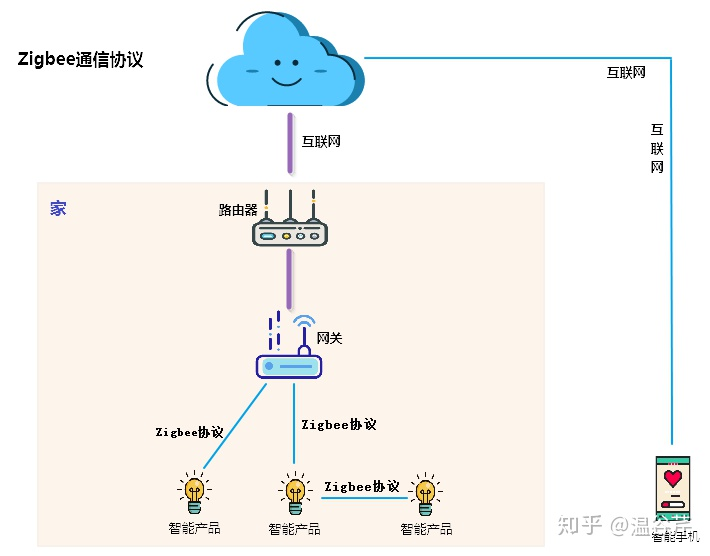
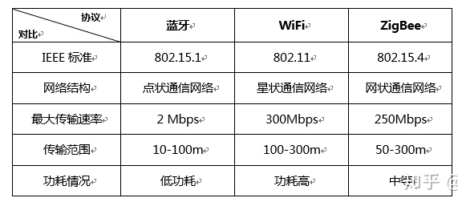

1

目前智能家居物联网中最流行的三种通信协议，Zigbee、WiFi以及BLE（蓝牙）。以及大家在挑选智能家居的时候，应该怎么样选择硬件的协议。

Zigbee协议又称紫蜂协议

Zigbee作为短距离、低功耗的无线通信协议，

**最大的优势就是可以自动组成一个设备网络，**

将各个设备直接的数据传输联动起来，

但在这个自组网络中**需要一个中心节点**来管理整个Zigbee网络，

也就意味着在Zigbee设备网络中**必须要有一个类似于“路由器”的组件**，

将各个设备连接到一起，实现Zigbee设备之间的联动效应。

而这个额外的“路由器”组件，就是我们所说的网关了。

此外，Zigbee的接入上限也非常高，理论上，Zigbee的网络节点数最高可达65000个！

除了优势之外，Zigbee的劣势也不少，

对于用户来说Zigbee的安装门槛还是存在的是，

因为大多数Zigbee设备都是不自带网关，

所以单一Zigbee设备基本上都是无法被我们手机直接控制的，需要一个网关作为设备与手机之间的连接枢纽。

BLE（低功耗蓝牙技术）就相当于WiFi跟Zigbee的中间者，既拥有Zigbee的低功耗（比WiFi更低的功耗），快速响应的特点，又有WiFi轻松使用的优势（无需网关就可以连上手机网络），特别是在手机使用上，目前蓝牙协议也跟WiFi一样，成为的智能手机中的标配协议。

而BLE技术的最大劣势就是在，穿墙能力偏弱，隔堵墙之后信号非常微弱。无法进行联动。

而目前智能家居厂商，大体上智能设备选用协议原则都是：

1) 插电的设备，用WiFi协议；

2) 需要和手机交互的，用BLE协议；

3) 传感器用Zigbee。

# zigbee芯片有哪些

目前市场上主要ZigBee芯片提供商（2.4GHZ），主要有：

TI/CHIPCON、

EMBER(ST)、

JENNIC(捷力)、

FREESCALE、

MICROCHIP。

目前ZigBee技术提供方式有三种： 

## 1) ZigBee RF+MCU 

TI CC2420+MSP430 ：

CC2420被称为第一款满足2.4GHz ZigBee产品使用要求的射频IC,

拟应用于家庭及楼宇自动化系统、工业监控系统和无线传感网络。

CC2420基于Chipcon（已被TI收购）公司的SmartRF 03技术,是用0.18μm CMOS工艺生产的。

CC2420采用7mm×7mm QFN 48封装。

TI推出MSP430实验板，其部件号为MSP-EXP430FG4618。

该工具可帮助设计人员利用高集成度片上信号链(SCoC)MSP430FG4618或14引脚小型F2013微控制器快速开发超低功耗医疗、工业与消费类嵌入式系统。

该电路板除集成两个16位MSP430器件外，还包含一个TI(Chipcon产品线)射频(RF)模块连接器，以用于开发低功耗无线网络。

## 2)单芯片集成SOC

TI CC2430/CC2431(8051内核) ：

Freescale MC1321X：

## 3)单芯片内置ZIGBEE协议栈＋外挂芯片

除了CC2430/CC2431外，其他四家公司都是采用自己的微处理器。只有CC2430/CC2431采用标准的8051处理器。

ZigBee协议栈 

目前TI 提供CC2430/CC2431 ZIGBEE 2006协议栈，

全套协议栈原来报价10万人民币，目前已经开放免费下载，

这是一个巨大的惊人之举。

**虽然开放下载的协议栈是库文件，但是全功能**，包括网状网络拓扑的全功能协议栈，

从10万到零，将其他对手远远抛在后面。

# CC2530

以这个芯片作为切入点来分析。

 **CC2530微控制器**内部使用业界标准的**增强型8051内核**，

结合了领先的RF收发器，是用于2.4GHz IEEE802.15.4的**Zigbee应用**的一个**片上系统(SOC)**解决方案。

要进行CC2530的应用开发，就先要安装IAR相关的开发环境。

IAR根据支持的微处理器种类不同分为许多不同的版本，

由于CC2530使用的是增强型8051内核，所以这里应该选用的**版本**是**IAR Embedded Workbench for 8051**。

安装TI的Zigbee协议栈：ZStack-CC2530-2.5.1a。

本质上就是51单片机编程。

参考资料

1、

https://zhuanlan.zhihu.com/p/71295311

2、

https://www.zhihu.com/question/60078068

3、【CC2530入门教程-01】CC2530微控制器开发入门基础

https://www.cnblogs.com/ALittleBee/p/7056525.html