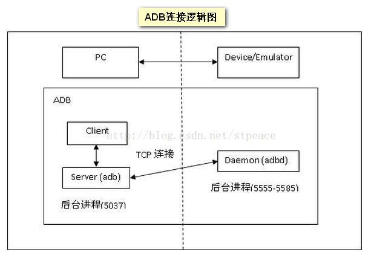

1

adb的全称的Android Debug Brigdge。

可以运行在两种底层介质上：

网络或者usb。



可见，协议涉及的部分有3个：

1、adb client。

2、adb server。

3、adbd。

adb client和adb server都是运行在PC上的。

adbd运行在板端。

adb client和adbd中间通过adb server来桥接。

adb server监听在5037端口。adb client通过127.0.0.1:5037连接到adb server。

adb server跟adbd通过usb（也可以通过网络）连接。

用python来测试一下。

```
import sys, socket

s = socket.socket(socket.AF_INET, socket.SOCK_STREAM)
s.connect(("127.0.0.1", 5037))

s.send(b'000c')
s.send(b'host:version')
content = s.recv(1024)
print(content)
```

返回结果：

```
b'OKAY'
```


参考资料

1、adb 协议

https://www.cnblogs.com/armlinux/archive/2011/02/16/2396845.html

2、adb client, adb server, adbd原理浅析

https://blog.csdn.net/stpeace/article/details/24933813