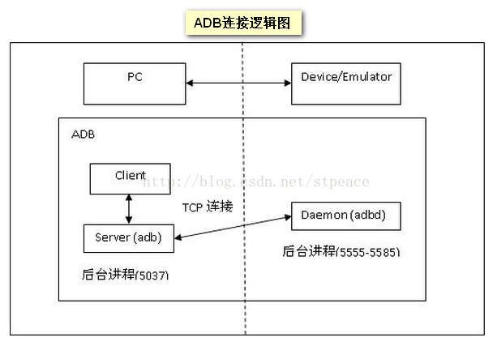

--

# 使用经验


## adb乱码问题解决

https://www.cnblogs.com/xilifeng/archive/2013/03/15/2961456.html


## 在bat文件里使用adb

test.bat内容：

```
adb shell < cmd.txt
```

在cmd.txt里写入需要执行的命令。

## Windows下adb shell使用有问题

有这些问题：

1、vi不能用。

2、adb shell里不能tab补全。

下载这个adb专用的putty就可以了。

https://github.com/sztupy/adbputty/downloads

hostname那里填写：transport-usb 。连接类型选择：adb。

这样就可以正常使用了。

## 后台有程序运行，无法exit

exit提示

```
/data/doss # exit
You have stopped jobs.
```

只需要把后台的杀掉就好了。

```
/data/doss # kill %1
[1]+  Terminated                 tail -f wakeup.log
```


# adb协议

adb的全称的Android Debug Brigdge。

可以运行在两种底层介质上：

网络或者usb。



可见，协议涉及的部分有3个：

1、adb client。

2、adb server。

3、adbd。

adb client和adb server都是运行在PC上的。

adbd运行在板端。

adb client和adbd中间通过adb server来桥接。

adb server监听在5037端口。adb client通过127.0.0.1:5037连接到adb server。

adb server跟adbd通过usb（也可以通过网络）连接。

用python来测试一下。

```
import sys, socket

s = socket.socket(socket.AF_INET, socket.SOCK_STREAM)
s.connect(("127.0.0.1", 5037))

s.send(b'000c')
s.send(b'host:version')
content = s.recv(1024)
print(content)
```

返回结果：

```
b'OKAY'
```


# 代码分析

rk3308的Linux开发包支持adb的方式进行调试。

板端运行了adbd。

启动脚本是/etc/init.d/S50usbdevice。这个脚本放在buildroot/package/rockchip/usbdevice/S50usbdevice。

usbdevice目录下的文件有：

```
├── 61-usbdevice.rules 这个会被安装到/lib/udev/rules.d目录下。
├── Config.in
├── NOTICE
├── S50usbdevice 这个安装到/etc/init.d目录。
├── usbdevice  这个是一个脚本，被安装到/usr/bin目录。
└── usbdevice.mk
```

靠这个来使能的。可能使能不同的功能。现在使能的是adb功能。也可以使能mtp功能。

```
/etc/init.d # cat .usb_config     
usb_adb_en                        
```

61-usbdevice.rules内容：

```
SUBSYSTEM=="udc",ACTION=="change",DRIVER=="configfs-gadget",RUN+="/usr/bin/usbdevice %E{DEVPATH}"
```


涉及的系统目录有：

```
/sys/kernel/config/usb_gadget
/sys/class/android_usb
```


在系统里的选配是：BR2_PACKAGE_ANDROID_TOOLS_ADBD [=y] 

这个包是在

```
 Target packages
 	System tools  ---> 
 		[*] android-tools
 		-*-   adbd
 		[ ]   fastboot 
		[ ]   adb      
```

看看fastboot的package怎么写的。

并不存在一个package的名字叫fastboot。

是在android-tools这个目录下。

到这个目录下看看代码。

```
├── bootimg.c
├── engine.c
├── fastboot.c
├── fastboot.h
├── protocol.c
├── usb.h
├── usb_linux.c
├── usb_osx.c
├── usbtest.c
├── usb_windows.c
├── util_linux.c
├── util_osx.c
└── util_windows.c
```


Ubuntu下安装：

```
sudo apt-get install android-tools-adb  android-tools-adbd android-tools-fastboot
```


use the USB Gadget ConfigFS to configure the USB peripheral port.

操作是靠fd，ioctl来做的 。

io是基于epoll来做的。


adbd也是使用了libusb来跟usb进行通信的。不是，是有多种实现，但是编译的是usb_linux.c。

```
SRCS+= transport_usb.c
SRCS+= usb_linux.c
SRCS+= usb_vendors.c
```

实际上是用usb_linux_client.c。

```
void usb_init()
{
    if (access(USB_FFS_ADB_EP0, F_OK) == 0)
        usb_ffs_init();//这个分支。
    else
        usb_adb_init();
}
```

靠打开/dev/usb-ffs/adb目录下的这3个ep节点来操作。

```
# ls /dev/usb-ffs/adb/
ep0  ep1  ep2
```

ep0是控制信息。

ep2是输入数据。

ep1是输出数据。

```
#define USB_FFS_ADB_EP0   USB_FFS_ADB_EP(ep0)
#define USB_FFS_ADB_OUT   USB_FFS_ADB_EP(ep1)
#define USB_FFS_ADB_IN    USB_FFS_ADB_EP(ep2)
```

ffs的functionfs的缩写。


# amlogic

```
插上usb

[10908.072309@0]  android_work: sent uevent USB_STATE=CONNECTED
[10908.148132@0]  configfs-gadget gadget: high-speed config #1: amlogic
[10908.148898@0]  android_work: sent uevent USB_STATE=CONFIGURED
[10908.248995@1]  android_work: sent uevent USB_STATE=DISCONNECTED
[10908.259319@0]  read descriptors
[10908.259358@0]  read strings
[10908.731871@0]  android_work: sent uevent USB_STATE=CONNECTED
```


首先，我们知道，开发中在使用[ADB](https://so.csdn.net/so/search?q=ADB&spm=1001.2101.3001.7020)的时经常使用的是USB连接Android开发设备。

我们今天就主要对USB通信进行分析；

不过我们不会对USB本身的协议、原理、实现等方面进行说明，

那些不在我们讨论的范围内，我们只是就USB通信在ADB的的使用进行源代码层面的梳理。

我们的USB通信是连接host端的adb程序和Android端的adbd程序，

所以我们需要分别对adb 和adbd 的运行过程有所了解，

具体可以参考前面讨论过的文章；


# 频繁自动断开的问题解决

现在有个问题，就是一直自动断开又连接

```
[  605.302239@0]  android_work: sent uevent USB_STATE=DISCONNECTED
[  605.389669@0]  android_work: sent uevent USB_STATE=CONNECTED
```


https://e2e.ti.com/support/processors-group/processors/f/processors-forum/403872/problem-with-adb

这篇没用。

https://blog.csdn.net/encourage2011/article/details/75807945

这篇也没用。

那就尝试用mdev来做。不要用当前的usb_monitor。

```
根本原因是androidtools 4.2.2版本 在usb拔掉后重新插拔后有一个DISCONNECTED状态  所以之前引入了 usb_monitor这个守护程序  现在这个程序不适用了
在yocto上我们升级到5.1.1版本就可以解决这个问题了

buildroot的 upstream 没有5.1.1版本  这个要升级比较困难

https://wiki.archlinux.org/title/Udev
udevadm: 检测事件
udevadm monitor --environment --udev
修改或添加/etc/udev/ 下的配置和脚本 (里面已经有例子 U盘插拔和网线插拔自动识别)
```


```
在把usb拔掉，查看这个，还是有正确的值的。
cat /sys/kernel/config/usb_gadget/amlogic/UDC
再插上，这个值就清空了。插上后，收到了disconnected事件。
清空了就不能正常使用adb了。
所以之前在收到disconnect事件后，重新进行写入UDC值的操作。
echo fdd00000.crgudc2 > /sys/kernel/config/usb_gadget/amlogic/UDC

现在手动写入，不行。会提示device busy。
先写none就可以
echo none > /sys/kernel/config/usb_gadget/amlogic/UDC
echo fdd00000.crgudc2 > /sys/kernel/config/usb_gadget/amlogic/UDC

```

明白这个了。就有思路了。

就直接加时间过滤就好了。

当前反复触发连接断开的原因就是：

先有一个disconnect，然后进行了config，config也会有disconnect事件，就这样循环往复。

就过滤连续2s内的disconnect事件就好了。

不行。

有其他的问题。

```
[54219.554690@1]  android_work: sent uevent USB_STATE=DISCONNECTED
[54219.565404@2]  configfs-gadget fdd00000.crgudc2: failed to start amlogic: -19
[54219.565412@0]  read descriptors
[54219.565423@0]  read strings
[54219.565689@2]  configfs-gadget fdd00000.crgudc2: failed to start amlogic: -19
```

这个是因为那个200ms的延时还是需要的。因为udc驱动加载需要一点时间。


现在根本原因是要搞清楚，为什么UDC的内容会在拔掉usb后被清空。

这个工作逻辑是什么？

*UDC*（*USB*设备控制器）

usbfs files 

# adb push/pull速度提升


https://blog.csdn.net/weijory/article/details/73088916


# adb代码分析

```
kernel层的代码在如下路径：
drivers/usb/gadget/f_adb.c
drivers/usb/gadget/android.c
他提供给上层应用的是如下的设备节点：/dev/android_adb
应用层的代码在如下路径：
system/core/adb目录
针对device，该目录编译的输出是adbd
```

**1、ADB client**

提供HOST端运行的命令

**2、ADB service**

HOST端上的一个后台进程

**3、ADB daemom**

DEVICE端（真实的机器或者模拟器）的守护进程

ADB代码位于/system/core/adb目录下，**[通过查看Android.mk](https://link.zhihu.com/?target=https%3A//github.com/weiqifa0/android-adb/blob/master/Android.mk)**，

可以知道，该目录下的代码生成了两个MODULE，

分别是**adb**和**adbd**,

 **adb client和adb service都是由adb这个可执行文件实现**， **adb daemon由adbd实现**。

adb和adbd的一些源代码文件是用同一个的，

编译时通过**LOCAL_CFLAGS**的参数**ADB_HOST**来区分，

这种你中有我我中有你的关系，对于初次接触的朋友们，多少增加了些困扰。

理清了ADB几部分的关系，以及源代码的结构，对ADB的认识已经有一个飞越了。

## USBDEVFS_SUBMITURB

`USBDEVFS_SUBMITURB` 是一个用于向 USB 设备提交 URB（USB Request Block）的 ioctl（Input/Output Control）命令。

在 Linux 中，USB 设备的访问和控制通常通过设备文件 `/dev/bus/usb/<bus>/<device>` 进行。

通过向这些设备文件发送 IOCTL 命令，可以执行各种 USB 操作，如发送控制命令、读取/写入数据等。

`USBDEVFS_SUBMITURB` 命令的主要作用是提交一个 URB，以与 USB 设备进行数据交换。

URB 是一个数据结构，用于描述 USB 设备与主机之间的数据传输操作。

它包含了一些关键的信息，如数据缓冲区的位置、数据传输方向、数据长度等。

通过使用 `USBDEVFS_SUBMITURB` 命令，用户空间程序可以向 USB 设备发送数据或者从 USB 设备接收数据，从而实现与 USB 设备的通信。

这个命令通常是通过调用 `ioctl` 系统调用来执行的。

在 Linux 内核源码中，`USBDEVFS_SUBMITURB` 命令的处理逻辑通常位于 `usbdevfs` 子系统中，具体的实现可以在相应的源文件中找到。

```
SRCS+=	usb_linux_client.c
```

usb_ffs_init

usb_ffs_open_thread


https://bbs.kanxue.com/thread-276404.htm

# buildroot上使用网络方式连接adb

关键就是要禁用掉usb的adb那部分脚本，然后手动启动adbd就可以。

pc上用adb connect 192.168.137.24:5555 ，然后adb push文件就可以了。

但是速度非常慢。

# 参考资料

1、

https://developer.toradex.com/knowledge-base/usb-device-mode-(linux)

2、ADB(七)_USB连接 (ABD通过USB连接的流程分析)

https://blog.csdn.net/weixin_38140931/article/details/104523213