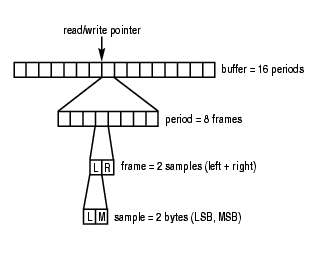

1



readi和readn


period time和buffer time具体指什么？二者的关系是什么？

period time是配置的硬件中断周期。表示的是输入延迟。

例如，period time配置为10ms。则声卡每10ms产生一次中断，把采集到的数据往上传递。

一个frame，例如S16LE的双声道的frame。

其大小是：2byte * 2 chn = 4字节。

一个period放多少个frame。这个是自己设置的。都可以。


每个声卡都有一个硬件缓冲区。用来保存记录的数据。

当这个硬件缓冲区满的时候，硬件就会产生一个中断。

这个缓冲区是一个环形缓冲区。

alsa维护一个指针来指向硬件缓冲区和应用缓冲区的当前位置。

我们只对应用程序的缓冲区有兴趣。所以下面所说的缓冲区，都是应用程序缓冲区。


应用程序的缓冲区大小，可以通过alsa接口函数来配置。

这个缓冲区就可以配置很大。

但是缓冲区太大了，就导致有明显的延迟。

为了解决这个问题，alsa又把缓冲区拆分为一个个周期（period）。

alsa以period为单位来传输数据。

一个period里有多个frame。

一个frame，如我们上面所计算的，对于S16LE双声道的，是4个字节。


```
size = frames * 4; /* 2 bytes/sample, 2 channels */
buffer = (char *) malloc(size);
```


```
#include <alsa/asoundlib.h>

int main() {
long loops;
int rc;
int size;
snd_pcm_t *handle;
snd_pcm_hw_params_t *params;
unsigned int val;
int dir;
snd_pcm_uframes_t frames;
char *buffer;

/* Open PCM device for recording (capture). */
rc = snd_pcm_open(&handle, "default",
                    SND_PCM_STREAM_CAPTURE, 0);
if (rc < 0) {
    fprintf(stderr,
            "unable to open pcm device: %s\n",
            snd_strerror(rc));
    exit(1);
}

/* Allocate a hardware parameters object. */
snd_pcm_hw_params_alloca(&params);

/* Fill it in with default values. */
snd_pcm_hw_params_any(handle, params);

/* Set the desired hardware parameters. */

/* Interleaved mode */
snd_pcm_hw_params_set_access(handle, params,
                      SND_PCM_ACCESS_RW_INTERLEAVED);

/* Signed 16-bit little-endian format */
snd_pcm_hw_params_set_format(handle, params,
                              SND_PCM_FORMAT_S16_LE);

/* Two channels (stereo) */
snd_pcm_hw_params_set_channels(handle, params, 2);

/* 44100 bits/second sampling rate (CD quality) */
val = 44100;
snd_pcm_hw_params_set_rate_near(handle, params,
                                  &val, &dir);

/* Set period size to 32 frames. */
frames = 32;
snd_pcm_hw_params_set_period_size_near(handle,
                              params, &frames, &dir);

/* Write the parameters to the driver */
rc = snd_pcm_hw_params(handle, params);
if (rc < 0) {
    fprintf(stderr,
            "unable to set hw parameters: %s\n",
            snd_strerror(rc));
    exit(1);
}

/* Use a buffer large enough to hold one period */
snd_pcm_hw_params_get_period_size(params,
                                      &frames, &dir);
size = frames * 4; /* 2 bytes/sample, 2 channels */
buffer = (char *) malloc(size);

/* We want to loop for 5 seconds */
snd_pcm_hw_params_get_period_time(params,
                                         &val, &dir);
loops = 5000000 / val;

while (loops > 0) {
    loops--;
    rc = snd_pcm_readi(handle, buffer, frames);
    if (rc == -EPIPE) {
      /* EPIPE means overrun */
      fprintf(stderr, "overrun occurred\n");
      snd_pcm_prepare(handle);
    } else if (rc < 0) {
      fprintf(stderr,
              "error from read: %s\n",
              snd_strerror(rc));
    } else if (rc != (int)frames) {
      fprintf(stderr, "short read, read %d frames\n", rc);
    }
    rc = write(1, buffer, size);
    if (rc != size)
      fprintf(stderr,
              "short write: wrote %d bytes\n", rc);
}

snd_pcm_drain(handle);
snd_pcm_close(handle);
free(buffer);

return 0;
}
```


参考资料

1、

http://blog.chinaunix.net/uid-22896670-id-240006.html