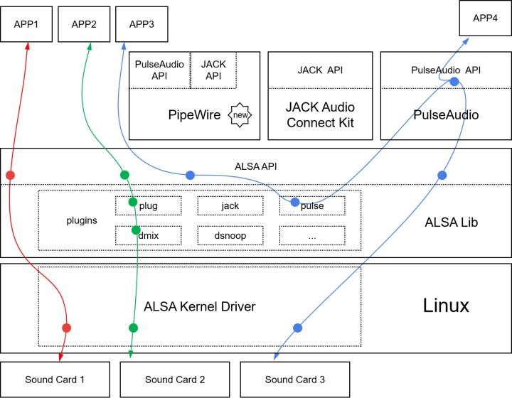

--

# 资源收集

这个alsalib的文档，比官方的可读性要好。
https://vovkos.github.io/doxyrest/samples/alsa/group_PCM_Dump.html

# 框架




ALSA分为两部分：

一部分是在Linux Kernel的声卡驱动，

主要是对声卡硬件（支持的采样率、声道、格式等）的描述和抽象；

另一部分是在User Space的alsa-lib，

有一套插件机制，包括resampling、mixing、channel mapping等功能都可以通过插件实现。


有ALSA还不够，

比如说，对多个应用同时播放的支持，

虽然可以通过ALSA的dmix插件实现，但不够好。

所以PulseAudio作为一个Sound Server登场了，

PulseAudio来接管各种音频的输入输出，

包括ALSA音频、蓝牙音频、网络音频等；

**会自动切换声卡，比如有USB声卡接入，播放自动切到USB声卡；**

还有控制每个应用独立的音量，等等。

**现在Linux桌面发行版大多都默认安装了PulseAudio。**


另一个类似PulseAudio的Sound Server是JACK Audio Connection Kit，

JACK针对的是实时性高、低延时的**专业音频应用**。

还有一个正在火热开发的新项目叫PipeWire，

其设计目标是集合PulseAudio + Jack两者的优点，

加入权限管理的安全机制，另外添加了对视频（摄像头设备）分发和管理的支持。

PipeWire看起来很有前景，值得关注一下。


有了PulseAudio、JACK和PipeWire，

他们都有提供各自的API，那么我们先要录音和播放，到底选择用哪种API呢？


## **对于大部分应用，最佳的选择依然是用ALSA的API。**


PCM设备与声卡设备有所不同，PCM设备可以由ALSA的插件产生。

系统安装PulseAudio之后，

ALSA pulse插件会生成名为`pulse`的PCM设备，且这pulse会被设为默认设备。

 如果不用PulseAudio，想实现同时多个应用播放和录音可以使用`dmix`和`dsnoop`插件，

这两个插件支持采样频率、通道和格式有限，

通常会在这俩之上加上`plug`插件，多个插件可以（有限的）级联在一起使用的 。


个人来说，最推荐前面直接用`aplay`和`arecord`重定向的方式，

没什么依赖， 稳定可靠，重定向的pipe提供缓冲功能，而且是多进程跑。


在alsa驱动这一层，目前为止，抽象出了4层设备：

一是hw:0,0；

二是plughw:0,0；

三是default:0；

四是default。

至于一是清楚了，

二和二以上可以做数据转换，以支持一个动态的范围，

比如你要播放7000hz的东西，那么就可以用二和二以上的。

而你用7000hz作为参数，去设置一，就会报错。

三和四，支持软件混音。

我觉得default:0表示对第一个声卡软件混音，default表示对整个系统软件混音。


这里提出两点：

1.1.1 一般为了让所有的程序都可以发音，为使用更多的默认策略，我们选用三和四，这样少一些控制权，多一些方便。

1.1.2 对不同的层次的设备，相同的函数，结果可能是不一样的。

比如，设置Hardware Parameters里的period和buffer size，这个是对硬件的设置，

所以，default和default:0这两种设备是不能设置的。

如果直接操作hw:0,0，那么snd_pcm_writei只能写如8的倍数的frame，比如16、24等，

否则就会剩下一点不写入而退回，而 default，就可以想写多少就写多少，我们也不必要关心里面具体的策略。


# 交叉模式

interleaved。就是左右声道数据交叉存储，而不是先全部放左声道，然后全部放右声道的方式。

snd_pcm_readi，这个i就是表示interleaved模式。


# xrun

xrun包括两种情况：

overrun，就是录音的时候可能会出现。应用层取数据太慢了。

underrun：就是播放的时候出现。应用层写得快，硬件层来不及处理。


EPIPE错误表示overrun错误。

## overrun和underrun怎么理解记忆

在 ALSA 或音频开发中，**overrun** 和 **underrun** 是常见的术语，指的是音频缓冲区在数据流处理中出现的问题。以下是它们的含义和简单记忆方法：

---

| 术语         | 描述                                                         | 记忆技巧                                            |
| ------------ | ------------------------------------------------------------ | --------------------------------------------------- |
| **Overrun**  | **缓冲区满了**：应用程序没来得及从缓冲区读取数据，导致新数据无法写入，旧数据被覆盖或丢失。 | **"Over" 意为过多**，想象“数据堆积如山，溢出来了”。 |
| **Underrun** | **缓冲区空了**：应用程序没来得及往缓冲区写入数据，导致音频设备没数据播放，可能出现“卡顿”或静音。 | **"Under" 意为不足**，想象“数据用光了，无法维持”。  |

---

### 图解帮助记忆

1. **Overrun**
   - 缓冲区太满 → 应用程序动作太慢，数据堵塞。
   - 类比：水桶快满了，但水龙头还在流，水溢出。

2. **Underrun**
   - 缓冲区没数据 → 应用程序动作太慢，数据不足。
   - 类比：水桶快见底了，但没有及时加水，空了。

---

### 实际场景
1. **Overrun**：当应用程序处理音频数据的速度跟不上录音设备生成数据的速度时。
2. **Underrun**：当应用程序提供数据的速度跟不上播放设备消耗数据的速度时。

### 避免办法
- **优化缓冲区大小**：增加缓冲区的深度。
- **实时优化**：提高应用的优先级，减少延迟。
- **流量控制**：对音频数据流速进行控制，确保均衡。

# alsa的plughw工作原理

ALSA 中的 `plughw` 插件（也称为 "Pulse Code Modulation (PCM) plugin"）

是==一种==用于音频格式==转换==和采样率转换的==插件==。

它允许应用程序使用不同的音频格式和采样率进行播放或录制，

而不需要显式地修改应用程序的代码。

`plughw` 插件在 ALSA 的 PCM 接口中扮演着重要角色，用于处理音频数据的格式和采样率问题。

以下是 `plughw` 插件的一般工作原理：

1. **应用程序请求播放/录制：** 当一个音频应用程序请求播放或录制音频数据时，它将指定所需的音频格式和采样率。

2. **`plughw` 插件介入：** 如果音频应用程序的请求与硬件设备的实际支持不匹配（例如，应用程序请求的格式和采样率与硬件不匹配），`plughw` 插件会介入处理。

3. **格式和采样率转换：** `plughw` 插件会执行必要的音频格式转换和采样率转换，以将应用程序的请求调整为硬件设备所支持的格式和采样率。这可能涉及将音频数据从一个格式转换为另一个格式，或者将采样率从一个频率转换为另一个频率。

4. **数据传输：** 一旦音频数据被转换为适合硬件设备的格式和采样率，`plughw` 插件将这些数据发送到硬件设备进行播放或录制。

# alsalisp.c

`alsalisp.c` 是 ALSA (Advanced Linux Sound Architecture) 项目中一个工具文件，用于提供交互式的音频调试和控制功能。它是一个基于Lisp语法的命令行工具，旨在测试和操作 ALSA 的各种功能。

它的主要作用包括：

| 功能               | 描述                                                         |
| ------------------ | ------------------------------------------------------------ |
| **音频设备测试**   | 可以直接通过Lisp语法测试音频设备的不同功能，比如播放、录制、调整音量等。 |
| **调用ALSA API**   | 提供一个可以直接调用 ALSA 函数的接口，用于检查接口行为和结果。 |
| **快速原型开发**   | 利用脚本化语法快速验证音频逻辑，比如配置 PCM（音频设备）参数、操作 Mixer 控件。 |
| **调试和问题排查** | 开发者可以快速使用 Lisp 风格命令与底层 ALSA 接口交互，方便调试驱动或应用程序的音频问题。 |

这个工具的用法大致是编译后运行，然后在其交互式环境中输入类似 Lisp 的命令。例如：

```lisp
(pcm.open "hw:0,0")
(pcm.set_params ...)
(pcm.write ...)
```

如果你在开发或调试 ALSA 音频相关功能，`alsalisp.c` 非常适合快速验证想法和检查问题。

### 编译与运行方法
通常在 ALSA 源码目录下，通过以下命令编译：
```bash
gcc -o alsalisp alsalisp.c -lasound
```

运行后，进入一个交互式命令行环境，可以输入相关命令操作音频设备。如果需要更详细的功能分析，可以阅读 `alsalisp.c` 源码。

# plugin

alsa的plugin是个什么概念？

https://alsa.opensrc.org/ALSA_plugins

这里有说明。

什么是plugin？

是用来创建虚拟设备，这些虚拟设备可以当成硬件设备来用。


在/etc/asound.conf和~/.asoundrc这2个配置文件里进行配置。

一个基本的插件配置样式是：

```
pcm.SOMENAME {
    type PLUGINTYPE
    slave {
        pcm SLAVENAME
    }
}
```

上面的语句，创建了一个名字叫SOMENAME的插件。类型是PLUGINTYPE。**一个插件相当于一个pipe，它的后端就是slave里的东西。**

==插件的名字，有些是已经被预定义了的，例如default，dmix 。==

**slave，可以是另一个插件，也可以是硬件设备。例如可以是hw:0,0**

（我是否可以这么理解：插件就是在硬件前面的预处理？）

```
插件1 -> 插件2 -> ... -> 插件N -> 硬件
```

一个.asoundrc的写法：

```
pcm.myplugdev {
	type plug
	slave {
		pcm default
		rate 44100
	}
}
```

然后我们播放命令这样写：

```
aplay -D myplugdev 1.wav
```


hw也是一种插件。它表示直接跟Linux驱动通信的插件。

```
pcm.myplugdev {
	type hw
	card 0
	subdevice 0
}
```

有一个特别的插件，类型是plug。

经常用到，它的作用是进行通道、采用率、格式的转化。


## hw

==这个类型主要是给声卡设备起别名用的。==

With the 'PCM hw type' you are able to define aliases for your devices.

```
pcm.primary {
        type hw
        card 0
        device 0
}
```

## plug

type plug的对type rate等几种类型的综合。

## dmix

在没有dmix之前，Linux上软件混音，只能靠artsd、esd、jack这些应用来完成。

dmix就是提供一个底层的混音方案。

==实际上，还没有多少应用使用了这个特性。==

dmix插件不是基于client/server架构。

它直接写入到声卡的DMA缓冲区。


插件类型在alsalib代码里的体现：

在alsalib/include/pcm.h里。

```
/** PCM type */
enum _snd_pcm_type {
	/** Kernel level PCM */
	SND_PCM_TYPE_HW = 0,
	/** Hooked PCM */
	SND_PCM_TYPE_HOOKS,
	/** One or more linked PCM with exclusive access to selected
	    channels */
	SND_PCM_TYPE_MULTI,
	/** File writing plugin */
	SND_PCM_TYPE_FILE,
	/** Null endpoint PCM */
	SND_PCM_TYPE_NULL,
	/** Shared memory client PCM */
	SND_PCM_TYPE_SHM,
	/** INET client PCM (not yet implemented) */
	SND_PCM_TYPE_INET,
	/** Copying plugin */
	SND_PCM_TYPE_COPY,
	/** Linear format conversion PCM */
	SND_PCM_TYPE_LINEAR,
	/** A-Law format conversion PCM */
	SND_PCM_TYPE_ALAW,
	/** Mu-Law format conversion PCM */
	SND_PCM_TYPE_MULAW,
	/** IMA-ADPCM format conversion PCM */
	SND_PCM_TYPE_ADPCM,
	/** Rate conversion PCM */
	SND_PCM_TYPE_RATE,
	/** Attenuated static route PCM */
	SND_PCM_TYPE_ROUTE,
	/** Format adjusted PCM */
	SND_PCM_TYPE_PLUG,
	/** Sharing PCM */
	SND_PCM_TYPE_SHARE,
	/** Meter plugin */
	SND_PCM_TYPE_METER,
	/** Mixing PCM */
	SND_PCM_TYPE_MIX,
	/** Attenuated dynamic route PCM (not yet implemented) */
	SND_PCM_TYPE_DROUTE,
	/** Loopback server plugin (not yet implemented) */
	SND_PCM_TYPE_LBSERVER,
	/** Linear Integer <-> Linear Float format conversion PCM */
	SND_PCM_TYPE_LINEAR_FLOAT,
	/** LADSPA integration plugin */
	SND_PCM_TYPE_LADSPA,
	/** Direct Mixing plugin */
	SND_PCM_TYPE_DMIX,
	/** Jack Audio Connection Kit plugin */
	SND_PCM_TYPE_JACK,
	/** Direct Snooping plugin */
	SND_PCM_TYPE_DSNOOP,
	/** Direct Sharing plugin */
	SND_PCM_TYPE_DSHARE,
	/** IEC958 subframe plugin */
	SND_PCM_TYPE_IEC958,
	/** Soft volume plugin */
	SND_PCM_TYPE_SOFTVOL,
	/** External I/O plugin */
	SND_PCM_TYPE_IOPLUG,
	/** External filter plugin */
	SND_PCM_TYPE_EXTPLUG,
	/** Mmap-emulation plugin */
	SND_PCM_TYPE_MMAP_EMUL,
	SND_PCM_TYPE_LAST = SND_PCM_TYPE_MMAP_EMUL
};
```


**alsa采用环形队列来存放输出和输入的数据。**


如果要支持多个应用同时打开声卡，需要支持混音功能。

**大多数的声卡不支持硬件混音。只有专业的声卡才支持。**

**所以需要软件混音。**

alsa自带了一个很简单的混音器dmix。

dmix的字母d，是Direct的意思。

使用dmix的方法，是把dmix作为默认设备。

我们先输出给dmix，让dmix去处理各个不同声音的混音。


alsa的接口分为：

```
control interface
	对应设备节点：/dev/snd/controlCX
	在我的笔记本上，有controlC0、controlC1、controlC7 这3个节点。
	功能：
		注册声卡。
		请求可用设备。
pcm interface
	对应节点：/dev/snd/pcmCXDX
	我的笔记本上有：pcmC0D0c  pcmC0D0p  pcmC1D3p 这3个节点。
	这个是最常用的接口。管理录音和播放。
	C代表Card。D代表Device。
raw midi interface
	设备节点：midiCXDX
	提供对声卡上midi总线的访问。
	我的笔记本没有对应的节点。
	
timer interface
	对应设备节点：/dev/snd/timer
	这个名字是固定的。
	
seq interface
	设备节点：/dev/snd/seq
	时序器接口。
mixer interface
	设备节点：/dev/snd/mixerCXDX
	笔记本没有。
	一般都没有这个节点，是硬件混音？
	
```

### alsa dmix的原理

ALSA 中的 `dmix` 插件（也称为 "Direct Mixing" 插件）是一种用于音频混音的插件，它允许多个应用程序同时共享一个音频设备而不会发生冲突。`dmix` 插件通过在软件层面执行音频混合，将多个应用程序的音频数据混合成一个流，然后将混合后的音频数据发送到硬件设备进行播放。

以下是 `dmix` 插件的一般工作原理：

1. **配置 `dmix` 插件：** 在 ALSA 配置文件中，你可以配置 `dmix` 插件作为默认的 PCM 设备（播放设备）。这将使所有音频应用程序都默认使用 `dmix` 插件进行播放。

2. **应用程序请求播放：** 当一个音频应用程序请求播放音频数据时，它会将音频数据写入 `dmix` 插件的缓冲区。

3. **数据混合：** 如果多个应用程序都请求播放，它们的音频数据会被写入 `dmix` 插件的缓冲区中。`dmix` 插件会根据每个应用程序的音频数据进行混合，计算出混合后的音频数据。

4. **数据发送到硬件设备：** 一旦混合后的音频数据准备好，`dmix` 插件会将这些数据发送到硬件设备（声卡）进行播放。

5. **时间同步和流控制：** `dmix` 插件还负责处理多个应用程序的音频数据之间的时间同步和流控制，以确保音频数据按照正确的速率被混合和发送，从而避免音频播放不同步或溢出问题。

使用 `dmix` 插件的好处是，它允许多个应用程序共享一个音频设备，避免了独占设备的问题。这对于多任务操作系统和同时运行多个音频应用程序的情况非常有用。然而，由于 `dmix` 插件是在软件层面进行混音的，可能会对 CPU 资源产生一定的负担，特别是在同时播放多个音频流的情况下。

需要注意的是，`dmix` 插件的配置和使用可能会因 ALSA 版本和配置而有所不同。如果想详细了解特定版本的 `dmix` 插件的原理和配置，请查阅相应版本的 ALSA 文档或资料。

# buffer-size和period-size

48K采样率，双声道，S16_LE格式，一个音频帧是多大？上面的buffer-size和period-size对应的字节数计算

如果我们设置：

- `buffer-size=64`
- `period-size=32`

这意味着：

- 每个缓冲区能存储64帧音频数据。
- 每32帧数据会触发一次硬件中断或数据传输。

建议：

- **低延迟要求**: 尽量减小 `buffer-size` 和 `period-size`，同时确保不会出现音频丢失。
- **稳定性要求**: 适当增大 `buffer-size` 和 `period-size`，以减少 CPU 负担和音频丢失。


| 参数        | 帧数 (frames) | 字节数 (bytes) |
| ----------- | ------------- | -------------- |
| Buffer Size | 64            | 256            |
| Period Size | 32            | 128            |

通过这些计算，你可以更好地理解 `buffer-size` 和 `period-size` 设置在内存中的实际占用情况，并根据需要进行调整以优化延迟和稳定性。

# 接口列表

```
/proc/asound
	信息接口。
/dev/snd/controlC0
	控制接口。
/dev/snd/mixerC0D0
	mixer接口。
/dev/snd/pcmC0D0
	pcm接口。
/dev/snd/midiC0D0
	rawmidi接口。
/dev/snd/seq
	时序器接口。
/dev/snd/timer
	时钟接口。
	
不一定要所有接口都有。seq、mixer很多时候可以没有。
```


# snd_interval理解

```
// openmin和openmax表示开集,如果2个全为1,那么就表示,range范围为(min,max)即2个开区间
// openmin为1,openmax为0,range范围为(min,max] 即开区间和闭区间
// integer等于1,表示it不是一个范围区间,而是一个固定的interger整型值
// dir等于0,表示为interger设置,dir < 0表示(min-1,max),dir > 0表示(min, max-1)
struct snd_interval {
    unsigned int min, max;
    unsigned int openmin:1,
             openmax:1,
             integer:1,
             empty:1;
};
```


```
struct snd_interval {
		unsigned int min, max;
		//openmin和openmax代表开集：
		//openmin和openmax都为1时，代表开区间，range范围为(min,max)
		//openmin=1,openmax=0时，range范围为(min,max] 即开区间和闭区间
		unsigned int openmin:1,
					 openmax:1,
					 //integer等于1,表示it不是一个范围区间,而是一个固定的interger整型值
					 integer:1,
					 empty:1;
}
```


https://blog.csdn.net/dengdun6257/article/details/102283475

# near接口问题


`__old_snd_pcm_hw_params_get_rate` 只能接收2个参数，val是一个内部变量，从而导致返回值错误，但是为什么动态链接和静态链接调用堆栈不同还不清楚

解决办法
目前想到的就是不用这些接口，即`__OLD_GET，__OLD_GET1，__OLD_NEAR，__OLD_NEAR1`修饰的接口都不用，包括官网的例子也没用这样的接口，如下：


https://blog.csdn.net/u010687717/article/details/103704419


# snd_pcm_hw_refine

```
changed = snd_mask_refine(m, constrs_mask(constrs, k));
                //changed masks，如果成功重定义了参数，cmask记录下是哪个参数被改变
                if (changed)
                        params->cmask |= 1 << k;
                if (changed < 0)
                        return changed;
```


```
snd_pcm_hw_refine函数里面有个很重要的参数：constrs = &substream->runtime->hw_constraints
hw_constraints即硬件约束条件，这里是在哪里赋值的呢？
其实是在snd_pcm_hw_constraints_complete函数里面：
```

在 ALSA 中，`snd_pcm_hw_refine()` 是一个用于优化或调整 PCM 硬件参数的函数，其中 `refine` 表示“细化”或“优化配置”。

### 作用
`snd_pcm_hw_refine()` 的主要功能是根据硬件的能力和用户提供的约束条件，对 PCM 参数集（如采样率、通道数、帧大小等）进行优化，使得最终的参数符合硬件支持的范围。

- **输入**：一个包含当前参数约束的结构（`snd_pcm_hw_params_t`）。
- **输出**：在输入基础上细化后的参数范围（更新约束条件）。

### 工作原理
1. 用户初始化一个参数对象，通常会设置一些初始约束（例如采样率范围）。
2. 调用 `snd_pcm_hw_refine()`，这个函数会根据硬件的实际能力调整这些约束，使其更加精确（即在硬件支持范围内）。
3. 返回的结果可以用于进一步配置硬件参数。

### 示例流程

```c
snd_pcm_hw_params_t *params;
// 初始化参数对象
snd_pcm_hw_params_alloca(&params);
snd_pcm_hw_params_any(handle, params); // 获取所有支持的参数范围

// 添加自定义约束，例如限制采样率
snd_pcm_hw_params_set_rate_min(handle, params, 44100);

// 调用 refine 优化参数
int err = snd_pcm_hw_refine(handle, params);
if (err < 0) {
    printf("Refine error: %s\n", snd_strerror(err));
} else {
    // 可以进一步获取细化后的参数范围
}
```

### 细化示例
- 如果硬件支持的采样率范围是 44100 ~ 192000，用户约束设置为 44100 ~ 48000，则 `snd_pcm_hw_refine()` 会将参数精确细化为硬件实际支持的 44100 ~ 48000 范围。
- 若用户设置的约束完全不符合硬件支持，函数会返回错误。

### 总结
`snd_pcm_hw_refine()` 是一个“动态适配器”，它会根据用户需求和硬件支持细化参数范围，确保最终设置能够成功应用于硬件设备。


https://blog.csdn.net/Guet_Kite/article/details/114314003


# 调试方法

```
export LIBASOUND_DEBUG=1
	这个环境变量控制了这些打印：
	hw_params配置有问题时的打印，靠这个来控制。
	--with-debug=no 会关闭这个特性。
	只在dump_hw_params函数里使用了这个环境变量。
	
REFINE_DEBUG
	这个是在refine函数调整参数把调整的细节打印出来。
	
```


```
#define ALSA_PCM_OLD_HW_PARAMS_API
#define ALSA_PCM_OLD_SW_PARAMS_API
#include <alsa/asoundlib.h>
```

# --with-versioned   

```
--with-versioned        shared library will be compiled with versioned
                          symbols (default = yes)
```

我在yocto下编译得到的alsa-lib总是有问题。

而buildroot的没有问题。

经过对比发现是这个选项不一样。

buildroot默认带上了这个选项：

```
--without-versioned
```

这个选项对代码的实际影响是什么？

```
VERSIONED_SYMBOLS 
```


```
#if defined(PIC) && defined(VERSIONED_SYMBOLS) /* might be also configurable */
#define USE_VERSIONED_SYMBOLS
#endif
```


```
#ifdef USE_VERSIONED_SYMBOLS
#define use_symbol_version(real, name, version) \
		symbol_version(real, name, version)
#define use_default_symbol_version(real, name, version) \
		default_symbol_version(real, name, version)
#else
#define use_symbol_version(real, name, version) /* nothing */
```


## 参考资料

1、

https://blog.csdn.net/njuitjf/article/details/40544659

2、

https://www.cnblogs.com/arnoldlu/p/13552504.html

3、

https://stackoverflow.com/questions/35480928/alsa-unexpected-results-when-called-from-shared-library

# alsa-lib的aserver作用是什么

在 ALSA（Advanced Linux Sound Architecture）音频架构中，

`aserver` 是一个用于音频服务器的应用程序。

它是 ALSA 工具集中的一部分，

用于提供音频服务器功能，

以实现多个应用程序共享音频设备的能力。

`aserver` 实际上是一个用于音频设备共享的后台音频服务器。

以下是 `aserver` 的主要作用：

1. **音频设备共享：** `aserver` 的主要功能是将音频设备（例如声卡或其他音频输出设备）的访问权共享给多个应用程序。**这允许多个应用程序同时访问音频设备**，以播放声音或进行录制等操作。

2. **解决音频冲突：** 在使用单一音频设备的情况下，多个应用程序可能会竞争访问设备，导致音频冲突。`aserver` 解决了这种冲突，通过接受多个应用程序的音频数据，并在合适的时间将其混合并发送到音频设备，从而实现协调的音频播放。

3. **降低延迟：** `aserver` 可以帮助降低音频的播放延迟。在某些情况下，由于应用程序之间的竞争，音频数据可能会被缓冲或延迟，从而影响实时性能。`aserver` 可以协调音频数据的传输，以减少延迟。

需要注意的是，随着时间的推移，`aserver` 在 ALSA 架构中的重要性逐渐减弱，因为 ALSA 本身提供了更高级的音频管理能力，允许应用程序通过 ALSA API 直接与音频设备交互，而无需使用 `aserver`。**然而，对于一些特殊的用例和旧有的系统，`aserver` 仍然可能有一些作用。**

如果你在使用 ALSA 并需要共享音频设备，你可能需要了解如何配置和使用 `aserver`。请注意，随着 Linux 和音频技术的发展，一些新的解决方案和工具可能会更适合你的需求。

# aplay -L看到的设备怎么使用？

这些设备实际上是 ALSA 提供的虚拟设备，用于将音频重定向到不同的通道或进行回路测试。

==它们在测试音频系统或调试音频问题时非常有用。==

你可以使用这些设备来播放音频文件，就像使用任何其他 ALSA 设备一样。

例如，要使用 `sysdefault:CARD=AMLAUGESOUND` 设备播放音频文件，可以执行以下命令：

```bash
aplay -D sysdefault:CARD=AMLAUGESOUND your_audio_file.wav
```

类似地，你可以使用其他设备来播放音频文件。

例如，如果要使用 `surround51:CARD=Loopback,DEV=0` 设备，可以执行以下命令：

```bash
aplay -D surround51:CARD=Loopback,DEV=0 your_audio_file.wav
```

这将使用指定的 ALSA 设备播放音频文件。根据你的需要和音频系统的配置，选择适当的设备来播放音频。

## 这样播放有什么不一样？

这些不同的设备配置提供了不同的音频输出通道和布局。这会影响音频在环绕声系统中的播放方式，以及在多声道环境中的声音定位和分布。

举例来说：

- `sysdefault:CARD=AMLAUGESOUND` 是默认的音频设备，它通常用于标准立体声输出。

- `surround51:CARD=Loopback,DEV=0` 是一个环绕声设备，适用于 5.1 声道环绕音频系统。它会在前置、中央、后置和低音炮的不同位置播放声音，提供更加沉浸式的音频体验。

根据你的音频需求和设备配置，选择合适的设备来播放音频会影响到你感知到的声音效果。


# aplay -L 和aplay -l看到的设备的区别

`aplay` 是 ALSA 提供的一个音频播放工具，它可以用来列出和测试音频设备。`aplay -L` 和 `aplay -l` 的输出内容有显著的区别，具体如下：

---

| 命令           | 描述                                                         | 输出内容                                                     |
| -------------- | ------------------------------------------------------------ | ------------------------------------------------------------ |
| **`aplay -L`** | **列出所有音频设备的可用逻辑设备（逻辑名）**，包括硬件设备（hw）、软混音设备（dmix）、插件设备等。 | 列出设备名称及其描述，显示的是音频设备的逻辑配置，例如 `default`、`dmix`、`hw:x,y`、`plughw:x,y` 等。 |
| **`aplay -l`** | **列出所有实际存在的硬件设备（物理设备）**，包括声卡及其支持的 PCM 子设备（硬件层次的信息）。 | 显示具体的声卡信息，如 `card x` 和 `device y`，它们对应 ALSA 中的硬件编号，通常以 `hw:x,y` 标识。 |

---

### **具体区别**

1. **输出范围**
   - `aplay -L` 列出逻辑设备，包含用户空间定义的各种音频路径，能显示软件插件（如 `dmix`、`dsnoop`）。
   - `aplay -l` 列出物理设备，只关心实际存在的声卡和 PCM 子设备。

2. **适用场景**
   - **`aplay -L`**：用于查看完整的 ALSA 配置，测试使用哪个逻辑设备（例如 `dmix` 用于混音）。
   - **`aplay -l`**：用于查看硬件层的设备，了解系统有哪些声卡、设备号，用于开发或硬件调试。

---

### **示例**

#### **`aplay -L` 输出**
```plaintext
default
    Default ALSA Output (Card 0)
sysdefault:CARD=PCH
    HDA Intel PCH, ALC887 Analog
dmix:CARD=PCH,DEV=0
    HDA Intel PCH, ALC887 Analog
hw:CARD=PCH,DEV=0
    HDA Intel PCH, ALC887 Analog
```

- `default` 是默认设备，可能通过软件层处理。
- `dmix` 提供混音功能，允许多个应用同时使用。
- `hw` 表示硬件设备。

#### **`aplay -l` 输出**
```plaintext
**** List of PLAYBACK Hardware Devices ****
card 0: PCH [HDA Intel PCH], device 0: ALC887 Analog [ALC887 Analog]
  Subdevices: 1/1
  Subdevice #0: subdevice #0
card 0: PCH [HDA Intel PCH], device 1: ALC887 Digital [ALC887 Digital]
  Subdevices: 1/1
  Subdevice #0: subdevice #0
```

- 显示的是具体的声卡（`card 0`）及其子设备（`device 0`，`device 1`）。
- 对应的设备名可以用 `hw:0,0` 和 `hw:0,1` 访问。

---

### **总结**

| 命令           | 适用场景                             |
| -------------- | ------------------------------------ |
| **`aplay -L`** | 配置音频输出逻辑或测试软件音频路径。 |
| **`aplay -l`** | 查看硬件设备，用于开发或硬件调试。   |

# arecord和aplay使用mmap方式，应该怎么设置参数

使用`arecord`和`aplay`工具进行音频捕捉和播放时，可以使用内存映射（mmap）模式来减少延迟。内存映射模式允许应用程序直接访问硬件缓冲区，从而减少数据传输的开销。

以下是使用mmap模式设置`arecord`和`aplay`参数的示例：

### 设置参数
使用`--mmap`选项启用内存映射模式。

### 完整命令
结合之前的低延迟设置，完整命令如下：

```bash
arecord -D hw:0,0 -r 48000 -c 2 -f S16_LE --buffer-size=64 --period-size=32 --mmap | aplay -D hw:0,1 -r 48000 -c 2 -f S16_LE --buffer-size=64 --period-size=32 --mmap
```

### 示例解释

- `-D hw:0,0` 和 `-D hw:0,1` 指定录音和播放设备。
- `-r 48000` 指定采样率为48000 Hz。
- `-c 2` 指定双声道。
- `-f S16_LE` 指定采样格式为16位小端。
- `--buffer-size=64` 指定缓冲区大小为64帧。
- `--period-size=32` 指定周期大小为32帧。
- `--mmap` 启用内存映射模式。

### 进一步优化
除了使用mmap模式，还可以通过调整其他参数进一步优化延迟。以下是一些常用参数：

- `--periods`：设置周期数。可以尝试不同的值以找到最佳配置。
- `--latency`：设置期望的延迟时间。可以通过调整这个参数来优化延迟。

例如：

```bash
arecord -D hw:0,0 -r 48000 -c 2 -f S16_LE --buffer-size=64 --period-size=32 --mmap --periods=2 | aplay -D hw:0,1 -r 48000 -c 2 -f S16_LE --buffer-size=64 --period-size=32 --mmap --periods=2
```

通过这些设置，你可以进一步优化音频录制和播放的延迟。根据具体硬件和应用场景，可能需要多次尝试不同的参数组合来达到最佳效果。

# sysclk_bclk_ratio 这个比例是做什么的

`sysclk_bclk_ratio` 是用于音频设备中时钟配置的一个参数，通常与音频流的时钟同步和采样率相关。具体来说，它表示系统时钟（`sysclk`）与比特时钟（`bclk`）之间的比例关系。

### 作用：

1. **时钟同步**：在音频传输中，系统时钟负责生成音频数据流的时间基准，而比特时钟则控制数据传输的速率。合适的比例确保音频数据在正确的时间被采样和传输。

2. **采样率控制**：不同的音频格式和设备可能需要不同的采样率。`sysclk_bclk_ratio` 直接影响到音频流的采样频率。例如，如果 `sysclk` 是 48 kHz 而 `bclk` 是 12 MHz，则比例可能是 1:256（因为每个音频样本需要多个比特时钟周期）。

3. **音质和延迟**：合适的比例有助于降低音频延迟和提高音质。如果比例设置不当，可能会导致音频失真或时钟漂移，从而影响音频播放的稳定性。

### 示例：

假设一个设备的 `sysclk` 为 24.576 MHz，`bclk` 为 12 MHz：

- 计算比例：  
  `sysclk_bclk_ratio = sysclk / bclk = 24.576 MHz / 12 MHz = 2.048`

在这种情况下，比例为 2.048，意味着每两个系统时钟周期就会生成一个比特时钟周期。

### 总结：

`sysclk_bclk_ratio` 是音频设备中一个重要的时钟参数，确保音频数据的正确采样和传输，是音频质量和稳定性的关键因素。如果你有特定的应用场景或问题，欢迎继续询问！

# ladspa

记忆为拉丁SPA。

Linux Audio Developer's Simple Plugin API（LADSPA）是一个用于音频处理的插件接口标准，旨在为音频应用程序提供简单而灵活的插件支持。

LADSPA 主要用于音频效果处理和合成，

广泛应用于 Linux 音频软件中。

### 主要特点

1. **简单性**：LADSPA 设计简洁，易于实现，适合开发者快速创建音频插件。

2. **跨平台**：虽然主要用于 Linux，但 LADSPA 也可以被移植到其他平台。

3. **实时处理**：支持实时音频处理，适合用于音乐制作和音频效果应用。

4. **多种插件类型**：支持各种类型的音频插件，包括效果器、合成器和分析工具。

5. **开放标准**：LADSPA 是一个开放标准，任何人都可以开发和使用兼容的插件。

### 结构

- **插件接口**：LADSPA 定义了一组 C 函数和数据结构，开发者可以实现这些接口来创建自己的插件。
- **参数管理**：插件可以有可调参数，用户可以在主机应用中对这些参数进行调整。
- **输入和输出**：支持多通道音频输入和输出，方便处理立体声和多声道音频。

### 应用

LADSPA 被广泛用于多种音频软件中，包括：

- **音频工作站**：如 Ardour 和 Audacity，提供音频录制和编辑功能。
- **合成器和效果器**：许多音频效果处理器和合成器实现了 LADSPA 插件支持。

### 总结

LADSPA 提供了一个简单而有效的框架，用于开发音频插件，使得开发者能够轻松创建和集成音频处理效果。它在 Linux 音频开发中发挥了重要作用，促进了音频软件的多样性和功能扩展。

# ladspa的主要接口

LADSPA（Linux Audio Developer's Simple Plugin API）的主要接口定义了一组标准化的结构和函数，允许音频插件与宿主应用程序进行交互。以下是 LADSPA 的核心接口和相关组件：

### 1. **插件描述结构**

每个 LADSPA 插件都需要实现一个描述结构，用于提供插件的基本信息。这些信息包含在 `LADSPA_Descriptor` 结构中，主要字段包括：

- **Unique ID**：插件的唯一标识符。
- **Label**：插件的标签，通常是一个简短的名称。
- **Name**：插件的完整名称，用于用户界面显示。
- **Maker**：插件的开发者或公司名称。
- **Copyright**：版权信息。
- **Port Count**：插件输入和输出端口的数量。
- **Port Descriptor**：指向输入和输出端口描述的指针。
- **Instantiate**：用于创建插件实例的函数指针。
- **Connect Port**：连接端口的函数指针。
- **Run**：处理音频数据的主要函数指针。
- **Cleanup**：用于清理和释放资源的函数指针。

### 2. **端口描述**

每个端口（输入或输出）都有一个描述，定义其类型、方向和属性。端口描述通过以下结构实现：

- **Port Descriptor**：指示端口的类型和特性，包括：
  - **Input/Output**：指示端口是输入还是输出。
  - **Type**：端口的数据类型（如浮点数、整数等）。
  - **Name**：端口的名称，用于用户界面显示。

### 3. **函数指针**

LADSPA 定义了一些关键的函数指针，用于插件的生命周期管理和处理：

- **Instantiate**：创建插件实例并返回指向该实例的指针。
- **Connect Port**：连接插件的输入和输出端口，通常在插件实例化后调用。
- **Run**：执行音频处理，处理输入数据并生成输出数据。
- **Cleanup**：释放插件实例占用的资源。

### 4. **数据类型**

LADSPA 支持多种数据类型，常用的数据类型包括：

- **LADSPA_Data**：通常是一个浮点数（`float`），用于传输音频样本。
- **LADSPA_PortType**：定义端口的数据类型，通常包括：
  - **LADSPA_PORT_INPUT**：输入端口。
  - **LADSPA_PORT_OUTPUT**：输出端口。
  - **LADSPA_PORT_CONTROL**：控制端口，用于参数调节。

### 示例代码片段

下面是一个简单的 LADSPA 插件描述结构的示例：

```c
#include <ladspa.h>

LADSPA_Descriptor my_plugin_descriptor = {
    .UniqueID = 1234,
    .Label = "MyPlugin",
    .Name = "My Example Plugin",
    .Maker = "My Name",
    .Copyright = "2024 My Company",
    .PortCount = 2,
    .PortDescriptors = port_descriptors,
    .Instantiate = instantiate_my_plugin,
    .ConnectPort = connect_my_plugin_port,
    .Run = run_my_plugin,
    .Cleanup = cleanup_my_plugin
};
```

### 总结

LADSPA 的接口结构提供了一种简单而有效的方式，使音频插件能够与宿主应用程序进行交互。通过标准化的描述和函数接口，开发者可以快速构建和集成音频处理插件，从而丰富音频处理的功能和灵活性。


# pyalsaaudio 用法

### PyAlsaAudio 用法

`pyalsaaudio` 是一个用于与 ALSA（Advanced Linux Sound Architecture）交互的 Python 模块，允许你进行音频播放和录制。

#### 安装

确保你已经安装了 `pyalsaaudio`。可以使用 pip 安装：

```bash
pip install pyalsaaudio
```

#### 基本用法

以下是一些基本操作的示例，包括播放和录制音频。

---

### 1. 播放音频

```python
import alsaaudio
import wave

# 打开音频文件
wf = wave.open('your_audio_file.wav', 'rb')

# 创建 PCM 输出设备
output = alsaaudio.PCM(alsaaudio.PCM_PLAYBACK)

# 设置参数
output.setchannels(wf.getnchannels())
output.setrate(wf.getframerate())
output.setformat(alsaaudio.PCM_FORMAT_S16_LE)
output.setperiodsize(1024)

# 播放音频数据
data = wf.readframes(1024)
while data:
    output.write(data)
    data = wf.readframes(1024)

wf.close()
```

### 2. 录制音频

```python
import alsaaudio
import wave

# 创建 PCM 输入设备
input = alsaaudio.PCM(alsaaudio.PCM_CAPTURE)

# 设置参数
input.setchannels(1)  # 单声道
input.setrate(44100)  # 采样率
input.setformat(alsaaudio.PCM_FORMAT_S16_LE)
input.setperiodsize(1024)

# 打开文件以保存录音
wf = wave.open('recorded_audio.wav', 'wb')
wf.setnchannels(1)
wf.setsampwidth(2)  # 16-bit
wf.setframerate(44100)

# 录制音频数据
for _ in range(0, 10):  # 录制10个周期
    l, data = input.read()
    wf.writeframes(data)

wf.close()
```

### 3. 控制音量

```python
import alsaaudio

# 获取默认音频控件
mixer = alsaaudio.Mixer()

# 获取当前音量
current_volume = mixer.getvolume()
print(f'Current volume: {current_volume[0]}')

# 设置音量到50%
mixer.setvolume(50)
```

### 4. 获取和设置设备列表

```python
import alsaaudio

# 列出所有可用的声卡
devices = alsaaudio.pcms()
print("Available PCM devices:")
for device in devices:
    print(device)
```

---

### 注意事项

- 确保你的系统已经安装了 ALSA 库，并且你的用户有权限访问音频设备。
- 在使用 `pyalsaaudio` 时，处理音频数据时要注意缓冲区的大小，避免过多或过少的数据导致播放或录制问题。

### 参考文档

更详细的信息和功能可以参考 [pyalsaaudio 的 GitHub 页面](https://github.com/mzsanford/pyalsaaudio)。

使用 `pyalsaaudio` 可以轻松地在 Python 中处理音频，适用于各种音频应用程序。

# ucm说明

以下是几个实际使用UCM（Use Case Manager）的场景示例：

### 1. 播放高质量音乐
**场景**：用户希望使用耳机播放高质量音乐。

**配置**：
- **使用案例**：`HiFi`
- **启用序列**：将耳机音量设置为50%，并确保耳机播放开关处于开启状态。
- **文件示例**：
  
  ```plaintext
  SectionUseCase."HiFi" {
      File "HiFi"
      Comment "Play high quality music"
  }
  ```

### 2. 电话通话
**场景**：用户在进行语音通话时，需要切换到麦克风和扬声器。

**配置**：
- **使用案例**：`Voice Call`
- **启用序列**：启用麦克风并设置扬声器为通话模式。
- **文件示例**：
  ```plaintext
  SectionUseCase."Voice Call" {
      File "VoiceCall"
      Comment "Use for voice calls"
  }
  ```

### 3. 低功耗播放
**场景**：用户想在移动设备上播放音频，同时节省电池。

**配置**：
- **使用案例**：`HiFi Low Power`
- **启用序列**：设置低功耗模式并调整音量。
- **文件示例**：
  
  ```plaintext
  SectionUseCase."HiFi Low Power" {
      File "HiFiLowPower"
      Comment "Play audio in low power mode"
  }
  ```

### 4. FM收音机
**场景**：用户希望使用设备收听FM电台。

**配置**：
- **使用案例**：`FM Analog Radio`
- **启用序列**：切换到FM接收模式并设置相关音量。
- **文件示例**：
  ```plaintext
  SectionUseCase."FM Analog Radio" {
      File "FMAnalogRadio"
      Comment "Use for FM radio"
  }
  ```

### 5. 监控耳机插拔
**场景**：用户插入耳机时自动切换音频输出。

**配置**：
- **使用案例**：`JackControl`
- **启用序列**：检测耳机插入并切换到耳机输出。
- **文件示例**：
  
  ```plaintext
  SectionDevice."Headphone" {
      EnableSequence [
          cset "name='Headphone Playback Switch' on"
      ]
      DisableSequence [
          cset "name='Headphone Playback Switch' off"
      ]
  }
  ```

### 总结
UCM通过定义不同的使用案例，能够根据用户的需求灵活调整音频配置，实现各种音频场景的优化管理。每个场景的配置可以根据具体设备和需求进行定制。

# ucm为什么没有被大量使用？

UCM（Use Case Manager）在实际应用中未被广泛使用的原因主要包括以下几点：

### 1. **复杂性**
- **配置难度**：UCM的配置文件需要用户具备一定的音频知识，特别是对ALSA的理解。对于普通用户来说，编写和调试这些配置可能较为复杂。

### 2. **工具支持不足**
- **软件生态**：虽然UCM为ALSA提供了灵活性，但与PulseAudio等更高级的音频管理工具相比，其工具和社区支持相对较少，导致用户更倾向于使用更成熟的解决方案。

### 3. **兼容性问题**
- **硬件差异**：不同设备可能需要不同的配置，UCM的通用性受到限制，导致用户在设备间切换时需要重新配置，增加了使用成本。

### 4. **替代方案**
- **PulseAudio和PipeWire**：这些更高级的音频系统提供了更丰富的功能和更好的用户体验，包括更简单的配置界面和多种音频处理功能，使得UCM显得不够必要。

### 5. **文档和教育资源不足**
- **学习曲线**：缺乏足够的文档和示例使得新用户难以快速上手，尤其是在学习如何创建和调试UCM配置上。

### 结论
虽然UCM在某些特定场景下提供了灵活的解决方案，但其复杂性和替代方案的优势使得其没有被广泛采用。随着音频管理工具的发展，用户更倾向于使用更易于配置和使用的系统。

# latency测试

# master音量

我看电脑，还是某些板子上，都有一个Master Volume来控制音量。

但是我调的板子都没有。

今天才弄清楚，因为我的板子都是多个codec芯片。

例如2片tas5707 ，在设备树里，就需要配置prefix，不然会初始化失败。

如果只有一片tas5707，则不需要prefixname。这样就可以看到Master Volume。


# hw和plughw

hw：直接使用硬件。

plughw：会自己根据需要自行使用rate等插件。

而且plughw不会增加latency。不同于dmix。

看/usr/share/alsa/alsa.conf里的hint内容：

```
plughw的是这样：
Hardware device with all software conversions

hw的是这样：
Direct hardware device without any conversions
```


参考资料

1、

https://raspberrypi.stackexchange.com/questions/69058/difference-between-hwplug-and-hw

2、

https://stackoverflow.com/questions/49970117/low-latency-and-plughw-vs-hw-devices


# 参考资料

1、深入了解ALSA

https://www.cnblogs.com/lifan3a/articles/5553664.html

2、alsa-lib, alsa-utils交叉编译及在嵌入式上使用

https://blog.csdn.net/luckywang1103/article/details/45626201

3、ALSA编程细节分析

https://blog.csdn.net/azloong/article/details/6277457

4、怎样使用alsa API

https://blog.csdn.net/weixin_34123613/article/details/86122554

5、

https://blog.csdn.net/reille/article/details/5855859

6、Linux音频编程

https://www.cnblogs.com/hzl6255/p/8245578.html

7、

这篇文章特别好。

https://www.cnblogs.com/cslunatic/p/3677729.html

8、

https://blog.csdn.net/isunbin/article/details/81503152

9、alsa的 snd_pcm_readi 和 snd_pcm_writei

https://blog.csdn.net/junjun5156/article/details/70169912

10、alsa声卡驱动原理分析

https://wenku.baidu.com/view/29edc08a680203d8ce2f2408.html

11、ALSA声音编程介绍+underrun

https://blog.csdn.net/zhang_danf/article/details/39005767

12、音频出现Xrun（underrun或overrun）的原因与解决办法

https://blog.csdn.net/Qidi_Huang/article/details/53100493

13、

https://stackoverflow.com/questions/26545139/alsa-cannot-recovery-from-underrun-prepare-failed-broken-pipe

14、Softvol

https://alsa.opensrc.org/Softvol

15、利用alsa dmix实现混音

https://blog.csdn.net/Swallow_he/article/details/80456759

16、

https://blog.csdn.net/cnclenovo/article/details/47106743

17、这个系列文章可以。

https://www.cnblogs.com/jason-lu/tag/ALSA/

18、Linux音频编程

https://www.cnblogs.com/hzl6255/p/8245578.html

19、ALSA中PCM的使用

https://blog.csdn.net/explore_world/article/details/51013942

20、

https://blog.csdn.net/sssuperqiqi/article/details/97033472

21、Linux下录音和播放

这篇文章非常好。

https://zhuanlan.zhihu.com/p/58834651

22、A Guide Through The Linux Sound API Jungle

http://0pointer.de/blog/projects/guide-to-sound-apis.html