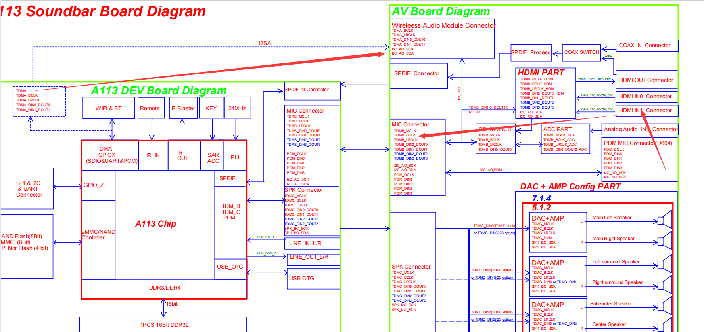
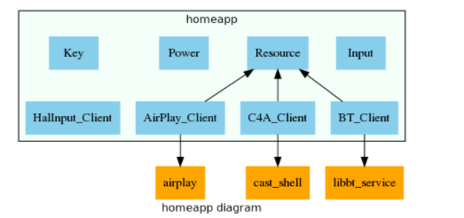
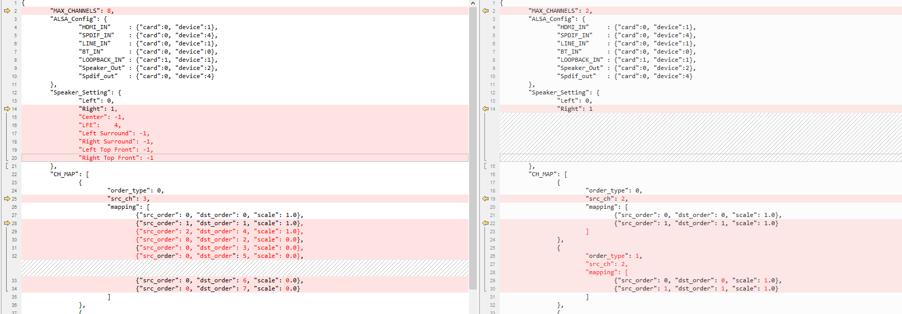

--

# 学习方式

1、直接看代码。

2、通过提交记录看代码的修改历史。了解之前碰到和解决过什么问题。


src目录下

```
aml_event.c
	函数以AmlEvent_为前缀。
	核心数据结构：AmlEvent_t和AmlEventHandler_t
	AmlEvent_t：
		id。时间戳。void *的参数。next指针。
	AmlEventHandler_t
		包含一个AmlEvent_t链表。
		thread/mutex/cond。这一套线程来处理。
		2个函数指针：
			event_handler。2个参数：id和param。
			add_event_func。这个所有的调用地方，都是彻底了null。所以都是使用默认的。
				这个就是分配一个event，赋值，挂到链表上。
	对外提供的接口：
		AmlEvent_Open
			把event_handler和event_add函数指针传递进来，创建线程跑起来。
			被as_client.c、bt_client.cpp、halaudio.c、resource_manager.c、usb_player.c这5个文件调用了。
			as_client.c里的这个的对应的调用栈是：
				homeapp的main函数
					AS_Client_Init
						AmlEvent_Open
			事件的处理回调是homeapp里的asclient_callback
			as_client.c里这个event id固定是0，是notify处理。
			notify有多种，有一个枚举。void * 的param是一个json字符串。
			最后处理这些notify是这样做：
				input chn改变：
				音量改变
				音频格式改变
			homeapp里的相当于总的，它的回调最后调用了InputMgr_CallbackHandler
			相当于把事件进行了继续分发。
			这个里面会遍历InputHandler_list。调用对应的ASCallback_handler进行处理。
		AmlEvent_Close
		AmlEvent_AddEvent
			这个相当于trigger的含义。
		AmlEvent_DelEvent
aml_syslog.c
as_alsa.c
	对外接口：alsa_init
	调用栈：
	AS_Volume_Init
		alsa_init
	主要是amixer接口处理音量。
as_client.c
	对外接口：AS_Client_Init
	主要处理作为dbus client的事务。
	
as_client_shm.c
	共享内存，只被as_client.c调用。
	AS_Client_Play的时候，调用了client_shm_init，这里分配了一块shm。
	AS_Client_Play只被usb_player.c里调用了一次。
as_config.c
	大部分都是Get接口，用来获取json里的某个元素。
	还有init、save、restore。
as_external_wrap.c
	对external的内容进行包装，对外提供接口。
asplay.c
	命令行工具。地位相当于as_client.c。
as_volume.c
	通过amixer接口来设置音量。
audioservice.c
	audioservice的入口文件。作为dbus server端。
	处理各种消息。
data_player.c
	被audioservice.c里的函数调用。
dolby_decoder.c
	跟ffmpeg并列的。音频解码。
ffmpeg_decoder.c
halaudio.c
	这个很重要。是音频的硬件抽象层。
	重要结构体：
	一个共用体。
		AmlHalAudioEventParam_u，就是各种事件param。
		入口是HalAudio_Init
		调用栈是：
			audioservice.c main函数
				AS_Input_Init 参数是配置文件名。
					HalAudio_Init(NULL, codec_config);
						codec_config是这样：
						"audio_codec_config":	{
                            "ffmpeg": ["mp3", "wav", "flac"]
                            },
halaudio_spdif.c
halhdmicec.c
halhdmicec_control.c
hardware_buildroot.c
	这个是提供了接口，可以跟Android的接口进行兼容。Android就不需要编译这个文件。
input_mgr.c
	
pa_config.c
pa_volume.c
	portaudio接口方式。默认没有用。
```

homeapp目录下

```
airplay_client.c
avs_client.c
halaudio_client.c
homeapp.c
	这个是入口文件。
input_manage.c
	Install_Input_Apps 这个函数比较重要。
led.c
	这个是显示状态信息的。
	可以显示文字。
ota_upgrade.c
resource_manage.c
	这个值得注意一下。
	这个res是指什么资源？有请求和释放这2种操作。
	被调用的地方还比较多。
	AMLResHandler 这个是句柄，就是一个void *的指针。
	例如蓝牙的，AMLResHandler bt_res_handler;是一个全局变量。
	
simulate_key.c
	这个的命令行工具，模拟按键操作。
speaker_process.c
	对音频进行处理。跟bt、halaudio是一个级别的东西。
syskey.c
	按键处理。
tm1640_anode.c
tm2_external.c
usb_player.c
```


btHandleEvents.h

这个头文件找不到。对于buildroot的，bt完全没有在代码里体现，都是靠开机脚本启动的bluealsa来做的。


libasexternal_input.so

这个动态库包含了哪些内容？起什么作用？

symbolic link to libasexternal_m6350.so

对应的就是src/external下面的文件。

外面用一个结构体进行包装，把这个动态库load进来，把一些接口函数抽取出来赋值给包装结构体。

AS_Config_GetEDID

在conf文件里，是这样写的内容：

```
"edid": [
        "0x35",
        "0x09", "0x7f", "0x07",
        "0x0f", "0x7f", "0x07",
        "0x15", "0x07", "0x50",
        "0x3d", "0x1e", "0xc0",
        "0x57", "0x07", "0x03",
        "0x5f", "0x7e", "0x01",
        "0x67", "0x7e", "0x03"
        ],
```

创建了一个线程来跟hdmi repeater来通信。

mcuinfochange_int_thread

```
//使用epoll来等待事件
external_input_interrupt_poll
```

是把这个加入到epoll的监听中。

```
#define GPIO_I2S_INT  "/sys/class/gpio/gpio415/value"
#define GPIO_I2S_MUTE_INT  "/sys/class/gpio/gpio455/value"
```

这个本质还是靠gpio的变化来通知的。

这里感知到gpio变化，然后就去读取i2c的数据。得到详细的信息。


我还是觉得这里的事件机制非常坑。导致逻辑非常不清晰。

主要是没有必要。

而且dbus的方式很难读。

换成jsonrpc就会清晰多了。


```
AM_CONDITIONAL([HALAUDIO_ENABLE], [test x$halaudio = xtrue])
```


当前各种枚举太多了。感觉相互关系很不清晰。

audioservice.h里的枚举

```
AS_Input_e
特点是：
INPUT_XX_ALL = 0x18100
INPUT_XX_1 = 0X18101
INPUT_XX_2 = 0X18102
可以用下面这样的宏来判断是否属于这一类。
其实也是挺别扭的。
#define IsLINEINInput(a)  \
  (AML_AS_INPUT_LINEIN_ALL == ((a) & (~AML_AS_INPUT_INDEX_MASK)))
  
  

AS_Output_e
	输出有Speaker、headphone、arc、spdif、bt这5种。
	其实只用了Speaker这一种。其余的都没有用。
	
AML_AS_AudioFormat_e
	pcm、ac3、dts、MP3
	MP3、aac、flac、dolby true hd
	
AML_AS_NOTIFYID_e
	通知有这些：
	用100的间隔来分割不同的通知。
	0:3个，audio format、volume、mute改变。
	100：4个。src改变前，src改变后，halaudio切换完成，input chn改变
	300:2个。解码开始，解码ringbuf的状态。
	400：1个。dbus的状态。
	500:2个，SD卡插入、移除。
	600:1个。mcu变化。
	700：3个。日志优先级变化、日志级别变化、trace级别变化。
	900：4个。电源变化。
	2000:1个。有ota升级。
	
```

event，很多都是在一个文件内部，自己产生，自己处理。

主要应该是为了不阻塞。

# usb player

这个逻辑比较集中。适合用来做分析入口。

## 入口函数

```
USBPlayer_Init
	处理逻辑：
	1、拿到json文件里的ffmpeg和dolby配置。保存起来。
	2、分配通知参数结构体。InputNotifyParam_t
	3、创建事件处理线程，作为模块内的异步机制。
	4、创建U盘检测线程。
	5、创建资源管理器，注册对应的回调。
	6、拿到当前的input id
	7、如果当前的input id是usb player，那么调用AmlRes_AppRequest请求资源。
```

## usb player status枚举定义

```
invalid = 0
usb inserted 这个是0x8000 0000 ，用bit31来做标识。
active 0x1
scan 0x2 
playing 0x4 
stopping 0x8
starting 0x10
```

## usb event枚举

```
事件分为三大类
1、player事件。播放、停止等。
2、res 资源管理事件。grant、revoke、release这3个。
3、U盘事件。插入，拔出、开机挂载、扫描结束，找到music。
```

## U盘检测线程的处理逻辑

```
usb_detect_thread
	1、创建一个netlink socket。使用select来监听。
	2、while循环里
		recv读取到buf。
		如果buf的开头是add@，说明是插入。
		如果buf的开头是remove@，说明是移除。
		其他情况，不管。
		buf里还有usb设备的节点名字。
		通过这个把事件触发。
		AmlEvent_AddEvent(usbhandler, USB_PLAYER_USBDISK_INSERT, (void*)usb_device);
		
对insert事件的处理
	1、usb_mount。调用system函数来mount。
	2、给status加上inserted的flag（bit31）
```

## U盘扫描线程

在usb_player_start函数里才调用的，这个是不是有点晚？

```
usb_scan_thread
	这个不是死循环。主要是为了不阻塞。
	主要调用scan_dir这个函数。
```

这个逻辑能不能提取出来做通用工具函数呢？

这个扫描肯定是需要时间的，如果扫描中途拔掉了U盘，能不能正确释放相关的内存？


## notify_param

这个是usbplayer、btplayer、airplayer这些才有的一个机制。

结构体构成：

```
typedef struct _tag_notify_param {
  char input_name[MAX_INPUT_NAME_LENGTH];
  char sub_app[MAX_INPUT_NAME_LENGTH];
  int play_state;
  int connect_state;
  double during_time; // seconds
  double current_time; // seconds
  double total_time; // seconds
  double machine_time;
  InputMusicInfo_t music_info;
  InputAudioFormat_t audio_format;
  bool enable_pairing;
  AS_Input_e input_id;
} InputNotifyParam_t;
```


# 用shm做了什么

DataPlayerRingbufHead_t

AS_Client_Play函数里调用了client_shm_init

client_shm_init的流程：

```
shmget(key, size, 0666);
```

用来把文件读取到这里来进行播放。

具体用法有点没看懂。不知道头部的长度怎么来的。

# 硬件图和音频通路分析

现在对照着D621的硬件框图和audioservice的配置文件一起看，就对得上了。

例如，板端aplay -l，信息是这样：

```
aplay -l
**** List of PLAYBACK Hardware Devices ****
card 0: AMLAUGESOUND [AML-AUGESOUND], device 0: TDM-A-dummy multicodec-0 []
  Subdevices: 1/1
  Subdevice #0: subdevice #0
card 0: AMLAUGESOUND [AML-AUGESOUND], device 1: TDM-B-dummy-alsaPORT-i2sCapture dummy-1 []
  Subdevices: 1/1
  Subdevice #0: subdevice #0
card 0: AMLAUGESOUND [AML-AUGESOUND], device 2: TDM-C-tas5782m multicodec-2 []
  Subdevices: 1/1
  Subdevice #0: subdevice #0
card 0: AMLAUGESOUND [AML-AUGESOUND], device 4: SPDIF-A-dummy dummy-4 []
  Subdevices: 1/1
  Subdevice #0: subdevice #0
```

在audioservice的配置文件里是这样：

```
"speaker_8ch": {
        "MAX_CHANNELS": 8,
        "ALSA_Config": {
            "HDMI_IN": {
                "card": 0,
                "device": 1
            },
            "SPDIF_IN": {
                "card": 0,
                "device": 4
            },
            "LINE_IN": {
                "card": 0,
                "device": 1
            },
            "BT_IN": {
                "card": 0,
                "device": 0
            },
            "LOOPBACK_IN": {
                "card": 1,
                "device": 1
            },
            "Speaker_Out": {
                "card": 0,
                "device": 2
            },
            "Spdif_out": {
                "card": 0,
                "device": 4
            }
        },
```

可以看到hdmi输入的对应hw:0,1，spdif in的对应hw:0,4

而在D621（hdmi repeater板）的硬件框图上，是这样：



可以看到，hdmi in是连接到了tdmb这个口上。

这个在aplay -l里看到的是：

```
card 0: AMLAUGESOUND [AML-AUGESOUND], device 1: TDM-B-dummy-alsaPORT-i2sCapture dummy-1 []
```

而蓝牙的，是连到了tdma上，就是hw:0,0了。

而spdif的，是对应hw:0,4的。

# homeapp分析

这个还可以把avs和gva的对接进来？

对应的函数实现在这里：

```
./multimedia/avs/Client/AvsClient.c
```

是在avs的源代码里，自己写了一个c文件。输出一个动态库。

先不细看。


homeapp里的内容还比较多。

包括了对mcu进行在线升级的内容。

把目录梳理一下

```
├── airplay_client.c 对接AirPlay
├── airplay_client.h
├── aml_uart   这个没有被编译。
│   ├── aml_uart.c
│   ├── aml_uart.h
│   ├── Android.mk
│   ├── cmd_define.h
│   ├── device_status.c
│   ├── device_status.h
│   ├── dsp_sendback.c
│   ├── dsp_sendback.h
│   ├── mcu_cmds.c
│   ├── mcu_cmds.h
│   ├── ringqueue.c
│   ├── ringqueue.h
│   ├── syscfg.c
│   ├── syscfg.h
│   ├── sys_tool.c
│   ├── sys_tool.h
│   ├── tcl_ota
│   │   ├── aml_downloader.c
│   │   ├── aml_downloader.h
│   │   ├── aml_gethostbyname.c
│   │   ├── aml_md5.c
│   │   ├── aml_md5.h
│   │   ├── Android.mk
│   │   ├── common.h
│   │   ├── Makefile
│   │   ├── swupdate-md5check.sh
│   │   ├── tcl_ota.c
│   │   ├── tcl_ota.h
│   │   ├── tcl_ota_test.c
│   │   ├── upgrade_config_file
│   │   └── upgrade_test.c
│   ├── uartcmd.c
│   ├── uartcmd.h
│   ├── uart_mcu_upgrade
│   │   ├── Android.mk
│   │   └── mcu_upgrade.c
│   ├── wifi_mgr.c
│   └── wifi_mgr.h
├── Android.mk
├── avs_client.c 
├── avs_client.h
├── bt_client.cpp
├── bt_client.h
├── gen_simulate_key_h.sh
├── gva_castcontrol.h
├── gva_client.cpp
├── gva_client.h
├── halaudio_client.c
├── halaudio_client.h
├── homeapp.c
├── input_manage.c
├── input_manage.h
├── led.c
├── led_char_16.h
├── led.h
├── Makefile.am
├── ota_upgrade.c
├── resource_manage.c
├── resource_manage.h
├── sh_cmd.c
├── simulate_key.c
├── speaker_process.c
├── syskey.c
├── syskey.h
├── tm1640_anode.c
├── tm1640_anode.h
├── tm2_external.c
├── tm2_external.h
├── usb_player.c
└── usb_player.h
```

当前只编译了这些

```
homeapp_SOURCES = homeapp.c syskey.c tm1640_anode.c led.c \
                  resource_manage.c input_manage.c
```

还是可以选配编译uart的。

```
if AML_UART_ENABLE
homeapp_SOURCES += \
	aml_uart/dsp_sendback.c \
	aml_uart/mcu_cmds.c \
	aml_uart/ringqueue.c \
	aml_uart/sys_tool.c \
	aml_uart/syscfg.c \
	aml_uart/uartcmd.c \
	aml_uart/aml_uart.c \
	aml_uart/device_status.c
```

resource request，资源管理

包括了改变CPU的频率。

例如这个：

```
case INPUT_NOTIFY_TYPE_RES_CHANGE:
       if (!IsHDMIInput(param->input_id)) {
         halaudio_switch_cpu_frequency(_HALAUDIO_CPU_1_2_G_);
       }
       break;
```

bt_client.cpp没有编译。里面的函数也是找不到的。

android.mk的有加。所以是只对GVA的有使用。

## homeapp.c文件

这个相当于跟用户交互的前端部分。

asclient_callback 这个是处理后端的通知消息的回调。

audioservice调用了这个来发送通知：

```
snprintf(notify_str, 64,
            "{\"id\": %d,"
            "\"input_chs\": %d}",
            AML_AS_NOTIFY_INPUT_CHS_NUM_CHANGE, pHandle->channel_num);
      audioservice_notify_system_update(notify_str);
```

led的显示，都是靠这个来做的。

```
收到AML_AS_NOTIFY_AUDIO_FORMAT_CHANGED消息，调用show_audioinfo

```


# 打开日志调试

编译层面：

```
#ifdef AML_LOG_ENABLE
#include "aml_log.h"
#endif
```

AML_LOG_ENABLE这个宏是定义了的。

用加编译错误的方式确认了。

那么日志函数就是这样的：

```
#ifdef AML_LOG_ENABLE
#define AML_SYSLOG(priority, args...)                                          \
  do {                                                                         \
    AML_LOG(priority_to_level(priority), ##args);                              \
  } while (0)
#else
```

AML_LOG在哪里定义？

应该是这个头文件

```
#include "aml_log.h"
```

在这个目录下./vendor/amlogic/aml_commonlib/aml_log/aml_log.h

```
#define AML_LOG(level, fmt, ...) AML_LOG_CAT(DEFAULT, level, fmt, ##__VA_ARGS__)
```

```
#define AML_LOG_CAT(cat, level, fmt, ...)                                                          \
    do {                                                                                           \
        if (AML_LOG_CAT_ENABLE(&(AML_LOG_GET_CAT_(cat)), level)) {                                 \
            aml_log_msg(&(AML_LOG_GET_CAT_(cat)), level, __FILE__, __func__, __LINE__, fmt,        \
                            ##__VA_ARGS__);                                                        \
        }                                                                                          \
    } while (0)
```

AML_LOG_CAT_ENABLE这个决定了级别。

aml_log_msg这个的实现是怎样的？

```
    va_start(ap, fmt);
    vsnprintf(&buf[len], sizeof(buf) - len, fmt, ap);
    va_end(ap);
    fprintf(log_fp ?: stdout, "%s", buf);
```

如果没有log_fp，那么打印到stdout上。


当前在/tmp目录下，有这2个以AML_LOG开头的文件。

```
AML_LOG_audioservice 
AML_LOG_homeapp      
```

里面内容是：

```
# cat AML_LOG_homeapp
all:LOG_ERR
```

那么看起来是基本配置。

这个是在aml_log.c里默认生成的。

动态监听了这2个配置文件的。

我修改一下看看。

改成LOG_DEBUG。

现在从运行层面看看。

当前怎么启动的audioservice和homeapp。

```
/usr/bin/audioservice /etc/default_audioservice.conf&
/usr/bin/homeapp -r /dev/input/event0 -a /dev/input/event3 -D music_vol -s &
```

都是后台运行。

我改成手动前台运行的，就可以看到在stdout上打印的日志了。

对于默认启动的，可以加重定向到文件的方式来记录日志。

不过，log_fp为什么没有是有效值呢？

是需要调用这个aml_log_set_output_file函数才有效。

## asplay设置set-logpriority和set-loglevel过程

trace level是指什么？跟loglevel有什么区别？

都是被audioservice的on_handle_system_command函数处理。

sys_command_setloglevel函数处理。

调用了这个函数aml_log_set_from_string

是设置给了aml_log.c里的函数。

有这么两个函数

```
void aml_log_set_from_string(const char *str);
void aml_trace_set_from_string(const char *str);
```

区别是这样：

```
void aml_log_set_from_string(const char *str) {
    if (!strncmp(level_str, str, strlen(str))) return;
    strncpy(level_str, str, 256);
    aml_log_sync_config_file(str);
    get_setting_from_string(AML_DEBUG_LOG, str);
}

void aml_trace_set_from_string(const char *str) {
    get_setting_from_string(AML_TRACE_LOG, str);
}
```

AML_SYSLOG展开是这样

```
AML_SYSLOG(LOG_INFO, "aaa");
展开得到：
AML_LOG_CAT(DEFAULT,  LOG_INFO, "aaa")
进一步展开：
do {                                                                                           \
        if (AML_LOG_DEFAULT->log_level > LOG_INFO) {                                 \
            aml_log_msg(&(AML_LOG_DEFAULT), LOG_INFO, __FILE__, __func__, __LINE__, "aaa");                                                        \
        }                                                                                          \
    } while (0)
	
static struct AmlLogCat AML_LOG_LAST = {NULL, 0, 0, NULL};
struct AmlLogCat AML_LOG_DEFAULT = {"default", 1, 1, &AML_LOG_LAST};
aml_log_msg里面就是把buf构造处理，然后调用fprintf打印。

```

LOG_INFO 这个宏是从syslog里借用来的。

```
#define LOG_EMERG   0
#define LOG_ALERT   1
#define LOG_CRIT    2
#define LOG_ERR     3
#define LOG_WARNING 4
#define LOG_NOTICE  5
#define LOG_INFO    6
#define LOG_DEBUG   7
```

当前这么设计，没有看出什么特别的用处来，是可以分文件、分模块来设置吗？怎么配置呢？


下面这个是控制halaudio层的打印

```
echo "AML_AUDIO_DEBUG=1" >/tmp/AML_AUDIO_DEBUG
echo "AML_AUDIO_DEBUG=2" >/tmp/AML_AUDIO_DEBUG
echo "AML_AUDIO_DEBUG=3" >/tmp/AML_AUDIO_DEBUG
echo "AML_AUDIO_DEBUG=4" >/tmp/AML_AUDIO_DEBUG
echo "AML_AUDIO_DEBUG=5" >/tmp/AML_AUDIO_DEBUG
1=LEVEL_INFO  2=LEVEL_DEBUG  3=LEVEL_WARN  4=LEVEL_ERROR 5=LEVEL_FATAL
```

文件是被动态监听的，所以修改可以实时生效。


这样来按模块控制日志级别。

```
AML_LOG_DEFINE(USBPlayer)
#define AML_LOG_DEFAULT AML_LOG_GET_CAT(USBPlayer)
```

目前audioservice里，只有2个单独定义的。

```
halaudio_client.c (homeapp) line 41 : AML_LOG_DEFINE(halaudio_client)
usb_player.c (homeapp) line 40 : AML_LOG_DEFINE(USBPlayer)
```

```
AML_LOG_DEFINE(USBPlayer)
展开是：
struct AmlLogCat AML_LOG_USBPlayer = {
	"USBPlayer",
	AML_LOG_LEVEL_INVALID,
	AML_LOG_LEVEL_INVALID,
	NULL
};
```

如果要单独关闭USBPlayer的日志，应该这样配置

```
aml_log_set_from_string("USBPlayer:LOG_ERR,halaudio_client:LOG_INFO");

aml_log_set_from_string("USBPlayer:LOG_QUIET");
```

```
echo all:LOG_ERR,USBPlayer:LOG_INFO > /tmp/AML_LOG_homeapp
```


## 最终处理方法

把S90audioservice的start方法这样改。

```
start() {
    echo "all:LOG_DEBUG" > /tmp/AML_LOG_audioservice
    echo "all:LOG_DEBUG" > /tmp/AML_LOG_homeapp
    printf "Starting audioservice: "
    /usr/bin/audioservice /etc/default_audioservice.conf > /tmp/audioservice.log &
    /usr/bin/homeapp -r /dev/input/event0 -a /dev/input/event3 -D music_vol  -s > /tmp/homeapp.log &
    echo "OK" 
}
```


还有方法是，运行后，设置这个，可以动态调整级别。

```
asplay set-logpriority LOG_DEBUG
```


参考资料

https://confluence.amlogic.com/pages/viewpage.action?pageId=74514632

https://confluence.amlogic.com/display/SW/BR-AML_LOG

# 当前的日志分析

开头的一段：注意这个声卡的分配情况。

```
audio_hw_device_get_module 
it is TV
max channel 8
Device name=HDMI_IN card=0 device=1
Device name=SPDIF_IN card=0 device=4
Device name=LINE_IN card=0 device=1
Device name=BT_IN card=0 device=0
Device name=LOOPBACK_IN card=1 device=1
Device name=Speaker_Out card=0 device=2
Device name=Spdif_out card=0 device=4
```

然后有一个这个错误

```
6.786332 audioservice[2333] default ERR tid:2333 (as_volume.c 1107 in_AS_Volume_ParseVolumeConfig): unable to open pcm device(tas5782m): No such file or directory
```

然后设置了halaudio的音量

```
6.809002 audioservice[2333] default DEBUG tid:2333 (as_volume.c 566 in_HalAudio_SetVolume): Set hal master volume soft = 100.000000, hardware = 0.000000
6.811026 audioservice[2333] default DEBUG tid:2333 (halaudio_spdif.c 453 HalAudio_SetCommand):  cmd = master_vol=1.000000
```

然后调用了

```
(external/mcu6350_func.c 80 mcu6350_set_update): type:2
```

然后设置了settings里的各个配置项。

一连串的这个打印

```
6.818988 audioservice[2333] default DEBUG tid:2333 (halaudio_spdif.c 416 allinput_halaudio): set halaudio config=file=/etc/dap_tuning_files.xml:endpoint=internal_speaker:virt-enable
6.820516 audioservice[2333] default DEBUG tid:2333 (halaudio.c 127 HalAudio_InputSet): enter6.820540 audioservice[2333] default DEBUG tid:2333 (halaudio_spdif.c 656 halaudio_input_set): setting type = speakers
```

然后打印了

```
(input_mgr.c 1327 AS_Input_Init): Input init successfully
```


# 完整测试环境

现在打算用树莓派4b来作为hdmi输出。

当前的情况是：

1、切换到hdmi输出，没有声音出来。

2、切换到bt的。手机连上来播放，有声音。

3、切换到hdmi arc，会打印内核错误，但是没有死机。

4、直接在板子上执行speaker-test -t pink，有声音输出到外部Speaker。

5、树莓派的耳机孔，接到板子的LINEIN，且板子这边切到LINEIN输入方式，可以正常听到声音。


是树莓派的hdmi输出有问题？

我用电脑试一下。也是不行。


现在是所有的板子的HDMI输入都没有声音。

另外再找了一块板子，这个就可以了。电脑这边连接是有显示声音设备的，播放声音也可以正常出来。


# event机制

就是一个异步机制，跟我一般用的Executor是类似的，相当于提交一个任务到专门的线程来处理，避免阻塞。

# IT66321

电平变化，外面不知道有没有进行一个电平反转。


# audioservice和homeapp的通信协议

收到

```
Method call: GetInputSettings
{"name": "volume"}
```

返回

```
{"name": "volume", "return": 60.0}
```

然后从这个json里解析出需要的60.0这个值。

协议是很简单，但是实现真的很麻烦。主要cjson使用太麻烦了。


在xml里是这样定义的：

```
    <method name="GetInputSettings">
      <arg name="input" direction="in" type="s"/>
      <arg name="settings" direction="out" type="s"/>
      <arg name="reply" direction="out" type="i"/>
    </method>
```

## 协议扒出来

可以从asplay.py里来扒，因为这个json的生成和解析都比较直观。

syscommand

```
发送
{"syscommand": "exit"}
返回
NULL 有些是不用返回的。
有些是需要返回的，例如：

```


# atmos调试

这里有一些经验文章

https://confluence.amlogic.com/pages/viewpage.action?pageId=74514632


# audioservice的文档

在这里有详细的文档。

https://confluence.amlogic.com/display/SW/aml_log

```
asplay set-loglevel “all:LOG_ERR” or  asplay set-logpriority LOG_ERR
```

# AS resource管理

当前资源管理只管理了alsa device。其实很简单，就是在使用input A的时候，先把input B的停掉，就是做这个事情。

尽管当前使用了dmix插件来避免冲突，但是dmix可能导致延迟，导致某些GVA/C4A认证测试通不过。




HalInput_Client: Manage the input like HDMI, AUX, SPDIF, ARC


## C4A


# bt_client

这个在buildroot下，并没有编译。只有c4a的android.mk里有加入编译。

但是buildroot下确实可以用蓝牙，那么具体是怎么实现的呢？

如果要替换为bluez，应该怎么替换呢？

是通过halaudio统一管理的？应该是。bt的是连接到tdma接口上的。反正都是当成声卡来处理的。

这一点从硬件层面怎么理解呢？

蓝牙模块上有pcm引脚，直接接到芯片的tdma引脚上，就这么回事。

所以当前蓝牙是一直开启的，即使没有切换到蓝牙模式。

那么这样播放音乐，蓝牙的声音会出来吗？

不会出来。

# ffmpeg

默认没有配置

```
# BR2_PACKAGE_AUDIOSERVICE_FFMPEG is not set
```

# main volume

这个的意义是什么？

就调节amixer的音量就够了吧。

另外弄一个软件音量，用在什么情况？

遥控能调到吗？


HALAUDIO_EXT_ARCVOLUME_CHANGE

这个是表示什么场景？

表示通过arc连接tv？tv遥控器修改了tv的音量？

把什么信息传递给soundbar了？

是mcu有中断来了。且当前是arc input的模式。

先拿到arc的音量值，然后跟当前的main volume比较，发现不同，就进行设置。

还把external_input_arc_setvolume再设回到tv。


# uart cmd

这个的主要作用是什么？

什么情况下使能？

针对哪些芯片可以正常工作？

是单独编译得到asr_uartcmd这个可执行文件。

有一个对应的启动脚本S91asr_uartcmd。

感觉这个是对S410这个板子专用的代码。

这样启动服务

```
function start_srv(){
	echo "start_srv............................................."
	if [ ! -d "/sys/class/gpio/gpio415/" ];then
		echo 415 > /sys/class/gpio/export
	fi
	echo out > /sys/class/gpio/gpio415/direction

	if [ ! -d "/sys/class/gpio/gpio416/" ];then
		echo 416 > /sys/class/gpio/export
	fi
	echo out > /sys/class/gpio/gpio416/direction

	/usr/bin/asr_uartcmd &
}
```

就是把2个引脚设置为output。

从代码看，感觉就是通过uart对mcu进行升级的代码。

那不用管，现在用不上。


/etc/alsa_bsa.conf  

这个文件里只有一行：device=default

在post_build.sh里

```
# Change the ALSA device for BT
if [ -f $1/etc/alsa_bsa.conf ] ; then
	textexist=$(cat $1/etc/alsa_bsa.conf | grep 2to8)
	# echo "textexist = $textexist"
	if [ -z "$textexist" ] ; then
		sed -i 's/dmixer_avs_auto/2to8/g' $1/etc/alsa_bsa.conf
	fi
fi
```


# /etc/halaudio目录

下面有这些文件

```
2.1chaml_audio_config.json  8ch_aml_audio_config.json
2ch_aml_audio_config.json   aml_audio_config.json
6chaml_audio_config.json
```

从multimedia/aml_halaudio/config这个目录拷贝过来的。

2.1和2的区别如下，左边是2.1的。



这个内容，在audioservice的配置文件里也有。

应该是从这里弄过去的。

我们用的应该是audioservice的。


# AS_EXTERNAL_ENABLE

这个是指使能tas5707这个东西吗？

也就是控制音量有一个external的配置？而当前并没有配置。

但是mcu6350的也被归入这个宏的配置范围。确实是这样。

```
#ifdef AS_EXTERNAL_ENABLE
#include "mcu6350_func.h"
#endif
```

但是现在为什么好像是mcu6350的打开，而tas5707的单独被关闭呢？

AS_EXTERNAL_TAS5782_ENABLE

还有一个这样的宏来控制TAS的。


# 一些提交记录

## ==

看git log，里面有个这样的修改。

```
#ifdef AS_S400SBR_ENABLE
  // temp solution for slove the conflict of HDMI and LINEIN
  if (id_json->valueint == AML_AS_INPUT_HDMI1 || id_json->valueint == AML_AS_INPUT_HDMI2)
    system("echo 0xff6344AC 0x11111101 > /sys/kernel/debug/aml_reg/paddr; cat /sys/kernel/debug/aml_reg/paddr");
  else if (id_json->valueint == AML_AS_INPUT_LINEIN1)
    system("echo 0xff6344AC 0x11111111 > /sys/kernel/debug/aml_reg/paddr; cat /sys/kernel/debug/aml_reg/paddr");
#endif
```

## ==

有个这样的提交。

```
config BR2_PACKAGE_AUDIOSERVICE_S400_SBR
	bool  "Amlogic SoundBar Refernece platform"
	default n
	help
	  It's for dynamic control MCLK and SCLK. 注意这里
```

对应的提交日志

```
Problem:
    HDMI not need MCLK_B, but LINEIN need MCLK_B, they have conflit

Solution:
    temp solution: app change reg directly

```

port to gva的，很多都是小的改动，估计是Android编译框架的检查规则比较严。

代码的确是一步步完善起来的，例如i2c的操作，之前都是没有加锁的，后面为了解决问题才加的锁。

最开始的poll机制也是poll，而不是现在的epoll。

HDMI ARC是后面添加的。

homeapp是后面添加的

```
PD#SWPL-4741

Problem:
  System need a homeapp to key management, app management

Solution:
  Add homeapp which include as_client and gva_client

```

usbplayer也是后面加的。

## 切换到linein有噪音的解决

提交日志

```
PD#SWPL-9454

Problem:
  Audio Noise when switch to LINEIN

Solution:
  Rootcause: MCU 6350 switch is asynchronous, when halaudio start to
  capture LINEIN data, it still does not finish switching. So halaudio
  capture the HDMI's data, and cause the noise.
  Add a delay (100ms) after MCU6350 switching

```

代码体现上就是这个

```
    case AML_AS_INPUT_LINEIN1:
      AML_SYSLOG(LOG_INFO, " Switch to INPUT LINE\n");
      mcu6350_select_linein();
      // wait MCU to finish switching, delay 100ms
      // according to ITE's feedback, this no way to know when it's done
      usleep(100*1000);
```

在后面，把100ms，提取到外面，所有情况下都做这个延时。

```
  // wait MCU to finish switching, delay 100ms
  // according to ITE's feedback, this no way to know when it's done
  usleep(100*1000);
```

## audio focus管理

在这次提交增加的

```
PD#SWPL-7736
Problem:
     add set focus audio, mute all another audio except focus audio.

Solution:
     set focus audio will mute all another audio except focus audio.
     softaudio mainly include: halaudio, music audio and notify audio.
     hal audio: HDMI, LineIN, and SPDIF.
     music audio: USB, BT and airplay.
     nofity audio: avs and gva.

```

改动的文件较多。

as_client.c就增加这2个接口。

```
ASErrorCode_e AS_Client_SetAudioFocus(AS_Input_e source_id, bool enable);
ASErrorCode_e AS_Client_GetAudioFocus(AS_Input_e *source_id);
```

as_volume进行了较多改动，集中在各种音量。

还有一个AS_Volume_SetAudioFocus函数。

focus这个主要是给gva和avs用的。

## ==

```
PD#SWPL-11925

Problem:
  USBPlayer cannot output mormally on Purely SoundBar environment

Solution:
  On purely SoundBar environment, there is no dmix exist, so when
  open alsa device, it must wait other input is closed totally.

```

## ==

```
* audioservice: HDMI no audio [1/1]

PD#SWPL-11688

Problem:
  Switch HDMI1 to BT then switch back to HDMI1, no audio output.

Solution:
  Now current solution, when switch to HDMI, audioservice will wait
  MCU's HDMI format interrupt, then enable audio output.
  But for this case, for MCU side, HDMI port is no changed. So there
  is not format interrupt.
  Solution, when switch to APP input source, ask MCU to switch to
  linein. It's temporary solution, final solution should ask MCU to
  power off HDMI repeater.

```

## app这边收到的volume变化慢

```
PD#SWPL-23563

Problem:
  Mobile's UI change is not smooth when press mobile volume up/down
  continuously.

Solution:
  When APP update volume change, homeapp will handle it cycle bye cycle.
  If one cycle is not finished, do not start a new cycle.

```

这个就是为了as_volume设计那么复杂的原因之一。


# bitstream

这个在代码里有几处体现。具体是指什么呢？

有个这样的提交记录

```
PD#SWPL-5184

Problem:
  HDMI Audio break when audio format is bitstream

Solution:
  Root cause: audio service handles some audio format change,
 which causes audio break, because audioservice should close
 and re-open current halaudio patch.
  Solution: AudioService only handle audio format change when
 stream_type or channel number is changed. Ignore sample rate
 change

```

# 音量调节

在这次提交增加的。

```
PD#SWPL-6319

Problem:
    control external amplifier and halaudio software volume at the same time

Solution:
    control external amplifier and halaudio software volume at the same time

```

# GPIO_I2S_MUTE_INT

这个是gpio A18，这个是专门改的。

```
* audioservice: add HDMI I2S IN MUTE control [1/1]

PD#SWPL-11688

Problem:
    IT66321 will get audio data error, audio stop
    or switch different audio format in HDMI input,
    need close HDMI I2S output

Solution:
    add HDMI I2S IN MUTE control

```

是把pdm in的din3引脚改了做这个用途。是因为没有用mic输入，所以可以占用这个？

这个是后面改板子，手动飞线的。mic用了，但是只用pdin0的引脚。后面的都是空闲的。

```
	pdmin: pdmin {
		mux {
			groups = "pdm_dclk_a14",
				"pdm_din0",
				"pdm_din1",
				"pdm_din2";
				/* "pdm_din3"; */ /* HDMI I2S IN MUTE control*/
			function = "pdm";
		};
	};
```

# as_client_shm.c

这个是如何实现播放的？

play_thread函数里，只是把数据读取到shm里。

解码器怎么来读取使用的呢？

```
    pt = ((unsigned char *)pHead) + sizeof(DataPlayerRingbufHead_t) + w_index;

    if (buf_left > 0x1000)
      buf_left = 0x1000;
    ret = fread((void *)pt, 1, buf_left, client_fp);
```

这里有传递shm的id过来。

```
bool client_start(char *parameter) {
  GError *error = NULL;
  int reply;

  client_shm_start();
  ASCLIENT_MUTEX_LOCK();
  audioservice_call_decoder_start_sync(as_proxy, parameter, &reply, NULL, &error);
  ASCLIENT_MUTEX_UNLOCK();

  return reply;
}
```

所以调用到这里

```
AS_dataplayer_start((char *)arg_dhandle);
```

板端直接播放音频文件的，只打开了ffmpeg的。dolby的没有做。

dolby应该只支持通过hdmi这些方式进行输入的。

当前从U盘读取内容放入ringbuf，跟界面取用，这二者的同步性是怎么保证的？

这是一个典型的生产者消费者模型。


# ffmpeg decoder

层次关系是这样：

```
data_player.c 抽象层，被上层调用。
	ffmpeg_decoder.c
	dolby_decoder.c
```

注册函数指针进去。

AudioDecoderHandler_t 这个是主要结构体。

里面是函数指针，和一些ctx结构体指针。

上层接口

```
AS_dataplayer_open
```

在as_common.h里，就这3个重要结构体

```
typedef struct _tag_decoder_config {
  unsigned int audio_format;
  unsigned int ringbuf_size; // 0, audio service will allocate a default size 2M
                             // This default size 2M which should negotiate with
                             // decoder owner
  int decoder_type;
  char output_type[20]; // alsa or pulse
} DataPlayerConfig_t;

typedef struct _tag_decoder_handler {
  int channel_id; // decoder channel_id, for multiple decoders
  key_t shm_key;  // Share memory id
  unsigned int shm_size;
} DataPlayerHandler_t;

typedef struct _tag_as_ringbuf_head {
  unsigned int size;
  unsigned int w_index;
  unsigned int r_index;
} DataPlayerRingbufHead_t;
```

对ffmpeg，填充的output参数是这样

```
  pHandle->output_config.out_format = AV_SAMPLE_FMT_S16;
  pHandle->output_config.out_codec = AV_CODEC_ID_PCM_S16LE;
  pHandle->output_config.out_channels = 2;
  pHandle->output_config.out_samples = 512;
  pHandle->output_config.sample_rate = 44100;
```

一个典型的解码线程处理。

# 架构分析

# audioservice和homeapp公共头文件分析

重要的就这3个头文件。

## audioservice.h

```
定义了枚举和结构体。
一部分是AML_AS开头，一部分是AS_开头。

AS_Input_e
AS_Output_e
AML_AS_AudioFormat_e
AML_AS_NOTIFYID_e
AML_AS_Power_e
VolumeMap_e


AML_AS_AudioInfo_t
AML_AS_Volume_t
```

### 通知枚举

这个值得展开说一下。

```
音频格式改变
音量改变
mute改变

source改变前
source改变后
halaudio切换完成
通道数改变

解码开始
解码ringbuf状态变化

dbus服务状态变化

U盘插入
U盘移除

mcu中断

log级别改变

power改变

有ota可用

设置app名字
查询app名字
更新app名字


```

搜索AML_AS_NOTIFYID_e，就可以看到，每种播放器，以及homeapp都会去处理这个通知。

大部分只处理其中一小部分。

homeapp处理多一些。

播放器的都是通过InputMgr_CallbackHandler这里来遍历调用的。

```
temp = InputHandler_list;
  while (NULL != temp) {
    if (temp->ASCallback_handler)
      temp->ASCallback_handler(type, param);
    temp = temp->next;
  }
```

所以，实际上，可以说是homeApp和inputManager这2个进行了处理。

更进一步看，实际上只有homeapp是最上层的调用。InputManager也是在homeapp的回调里调用的。


## as_client.h

```
ASClientNotifyParam_u
	这个联合体，把各种通知都集合到一起。
ASClientNotifyParam_t
	这个进一步包含ASClientNotifyParam_u，再加2个成员，一个cjson指针，一个通知枚举。通知枚举就是audioservice.h里的那个。
ASClientNotify
		这个函数类型。参数就是通知枚举和ASClientNotifyParam_t。
输入相关的
	AS_Client_OpenInput
	AS_Client_CloseInput
	AS_Client_CloseCurInput
	AS_Client_OpenInputByName
	AS_Client_CloseInputByName
音量相关的
	AS_Client_GetVolume
	AS_Client_SetVolume
	AS_Client_GetMute
	AS_Client_SetMute
	AS_Client_GetVolumeByType
播放相关
	AS_Client_Play
	AS_Client_Stop
	AS_Client_Pause
	AS_Client_Resume
设置相关
	AS_Client_GetSetting
	AS_Client_SetSetting
	AS_Client_SetHalSetting
	AS_Client_GetHalSetting
```

## as_common.h

```
就定义了3个文件播放相关的结构体。
DataPlayerConfig_t
DataPlayerHandler_t
DataPlayerRingbufHead_t
成员都不多。就4个左右。
```

# audioservice独有头文件分析

## as_config.h

这个就是以配置文件json解析为核心。

没有什么特别的。


## halaudio.h

```
函数
	input相关
	output相关
		都是留空的。
	setting相关
	
结构体
	AmlHalAudioEventParam_u共用体。
	用来做内部事件通知用的。
```


## input_mgr.h

这个封装了halaudio的接口，主要使用这里的接口来进行input的设置。

```
只有一下函数API。没有数据结构。
函数都是AS_XX这种格式的。
大多数都有一个char *arg_input的参数。
```

# input_manager.h

## volume相关

关于volume，定义了这12个宏。

```
INPUTMGR_VOLUME_DEFINE
INPUTMGR_VOLUME_INIT
INPUTMGR_VOLUME_DEINIT  就是free内存。

INPUTMGR_MUTE_SYNC_APP
INPUTMGR_MUTE_SYNC_AS
INPUTMGR_MUTE_FORCESYNC_AS

INPUTMGR_INTVOLUME_SYNC_APP
INPUTMGR_INTVOLUME_SYNC_AS
INPUTMGR_INTVOLUME_FORCESYNC_AS

INPUTMGR_DBVOLUME_SYNC_APP
INPUTMGR_DBVOLUME_SYNC_AS
INPUTMGR_DBVOLUME_FORCESYNC_AS
```

定义音量，

```
airplay_client.c (homeapp) line 75 : INPUTMGR_VOLUME_DEFINE(airplay);
airplay_client.c (homeapp) line 548 : INPUTMGR_VOLUME_DEFINE(gva);
bt_client.cpp (homeapp) line 55 :   INPUTMGR_VOLUME_DEFINE(bt);
```

就是定义一个指针

```
static VolumeMap_t* psaved_volume_##name = NULL
```

初始化音量

例如在AirPlay_Init里，分配结构体，并赋值。

```
INPUTMGR_VOLUME_INIT(airplay, -144.0f, 0.0f, -30.0f);
```

## notify相关

InputNotifyParam_t 核心结构体是这个。

# dbus分析

```
audioservice这边
1、
guint own_id = g_bus_own_name(
      G_BUS_TYPE_SESSION, "aml.linux.dbus.audioservice",
      G_BUS_NAME_OWNER_FLAGS_NONE, GBusAcquired_Callback,
      GBusNameAcquired_Callback, GBusNameLost_Callback, (gpointer)s, NULL);
2、
GBusAcquired_Callback
就这个进行了实现，另外2个回调都是空的。
static Audioservice *skeleton = NULL;
skeleton = audioservice_skeleton_new(); 创建skeleton
安装函数
g_signal_connect(skeleton, "handle-get-input-list",
                   G_CALLBACK(on_handle_get_input_list), NULL);
输出
g_dbus_interface_skeleton_export(G_DBUS_INTERFACE_SKELETON(skeleton),
                                   connection, "/aml/linux/dbus/audioservice",
                                   &error);
在audioservice_gdbus.c里。
handle-get-input-list对应了GetInputList这个名字。表示client是使用这个名字来调用的。
但是好像也不像。
AS_Client_GetInputList里，调用了audioservice_call_get_input_list_sync

处理函数
on_handle_get_input_list

对于client端

static Audioservice *as_proxy = NULL;
连接到总线
as_proxy = audioservice_proxy_new_for_bus_sync(
      G_BUS_TYPE_SESSION, G_DBUS_PROXY_FLAGS_NONE,
      "aml.linux.dbus.audioservice", "/aml/linux/dbus/audioservice", NULL,
      &error);
g_signal_connect(as_proxy, "notify::g-name-owner",
                  G_CALLBACK (cb_OwnerNameChangedNotify), NULL);
				  
超过10s没有连上，就会退出。
client主要需要一个回调来处理signal。
其余的主动调用，都是用audioservice_call_get_input_list_sync这样的函数。
```

# notify机制分析

```
把notify逻辑梳理一下。
哪些地方调用了notify？
这个结构体
ASClientNotifyParam_t
这个回调类型
ASClientNotify

as_client.c里，saved_callback，这个保存了代码里唯一的一个ASClientNotify回调。
这个callback的调用逻辑是这样的：
AS_Client_MainLoop主循环函数，
	main_loop_func
		监听了这个dbus signal "system-update"
		对应的处理函数asclient_system_update_handler
			AmlEvent_AddEvent 添加事件，事件固定为0
			事件的处理函数 asclient_notify_handle_func
				调用saved_callback
saved_callback是homeapp.c里注册的。
对应asclient_callback
处理都是一些显示的操作，或者只是简单的打印。
而通知的发起，是靠这里
audioservice_notify_system_update
通知的参数是字符串。
这个函数被很多地方调用。
都是先拼接一个json字符串，通过dbus进行signal。
dbus client收到后进行解析显示。
```

homeapp.c的那个回调，可以算是总的。

各个播放器模块本身，也有进行监听。

回调的定义本质是一样的，参数和返回值都一样。

```
int (*ASCallback_handler)(AML_AS_NOTIFYID_e type, ASClientNotifyParam_t *param);
```

# mcu中断处理循环

```
event线程和中断线程都是在halaudio.c里。
mcuinfochange_int_thread
	while (1) {
		ext_input_handle->external_input_interrupt_poll//返回非0，则continue，但是好像不会返回非0的。
			external_input_interrupt_poll//这里就是中断触发。
				while(1) {
					//最后会return，这个这并不是死循环。
					//前提是等到了event。没有event还是一直阻塞的。
					//设置的event，在下面被处理。
				}
		//格式改变：
			HalAudio_SetHDMIAudioInfo
				触发事件HALAUDIO_INPUT_SET_AUDIOINFO，所以这里就涉及到一个事件线程。==
				in_HalAudio_HandleHDMIAudioInfo
					对halaudio进行close再open。
			发notify。
		//arc音量改变
		//mute
			直接调用函数：（没有通过事件）
			in_HalAudio_HandleExtMute
				先删除事件HALAUDIO_INPUT_SET_AUDIOINFO
				in_HalAudio_HandleExtMute
					halaudio close
					清空格式。
					
	}
```

# asplay各种设置参数的区别

```
有这么些set，区别是什么？
asplay set setting_name value 
	{"set", func_set, 2, true},
	调用AS_Client_SetSetting
	把输入拼成这样："{\"settings\": {\"%s\":%f}}", setting_name, value);
	后面跟的数值。用atof来转的。
	AS_Client_SetSetting只有这里调用了。
	最终调用的 audioservice_call_set_input_settings_sync，这个被多个setting函数调用了。
	到audioservice里的AS_SetInputSettings
	这个可以设置哪些值呢？
	
asplay sset dap [mode=2|mode=3|mode=4] //set DAP 
	这个多的s表示字符串。和set的区别就在于此。set是设置数值。
	
	{"sset", func_setting_set, 2, true},
	把输入内容拼成这样：
	"{\"settings\": {\"%s\":\"%s\"}}", setting_name, pstr
	
asplay halaudioset [capture_samplerate=48000]
	{"halaudioset", func_halaudio_Setsetting, 1, true},
	后面跟的是一个=连接的字符串。
	调用AS_Client_SetHalSetting
	内容拼接："{\"halcmd\": \"%s\"}", pstr);
	最后还是调用audioservice_call_set_input_settings_sync
	
asplay soundeffect-set [dap|bm|drc|post|upmix|virt|hfilt|loudness|vlamp|vmcal]
	对应{"soundeffect-set", AS_Client_soundeffect_setting, 1, true},
	这个的特点是先get，再set。因为他们的值是需要轮转的。
	
asplay sys-command [0|1 => source|exit] 
	只有exit，suspend等几个值，直接给数值的。
asplay sset setting_name valuestring 
	

```

我要加的，就模仿set的方式。

```
asplay set mute 1
```

加好了。工作正常。

看看get的如何添加。

```
asplay sget dap
这个可以，得到
[@dap:profile=1@]
```

```
asplay get dap
这个不行，得到空的{}
```

二者没有什么本质区别吧。

当前给空的，相当于走到这个分支。

```
if (NULL == input || cJSON_IsNull(input)) {
    // printf_cJSON("audioservice_root:", audioservice_root);
    setting_json = cJSON_GetObjectItem(audioservice_root, CJSON_ITEM_SETTINGS);
    // printf_cJSON("system setting_json: ", setting_json);
    setting_str = cJSON_Print(setting_json);
  }
```

要实现功能，就需要在config里的settings里加这些字段。

加上测试可以。

还差一个点，就是初始化的时候，从配置文件读取出来初始化。

放in_AS_set_Settings这个函数里调用。

不用专门去调用，默认就处理到这个初始化了。

# 经过hdmi和不经过hdmi的信号分开初始化

现在需要加快开机出声音的速度。

等待mcu ready耗时比较长。

有些信号根本不依赖mcu ready状态。所以可以不用等。

加一个函数进行判断，判断当前的input 信号是否依赖mcu ready。

然后分开处理。

# 再梳理一遍audioservice

```
现在要把audioservice的代码再理解一次。
其实代码也并不多。完全在可控范围内。

libasclient.so包括的文件有：
	audioservice_gdbus.c 
	aml_syslog.c 
	as_client.c 
	as_client_shm.c 
	aml_event.c
audioservice、homeapp、asplay都链接到了这个库。

audio_hw_device_set_config_jason
	把json字符串传递给halaudio。存到全局变量里。然后adev_open的时候会用到。
	
	
	
HalAudio_Init
	1、audio_hw_device_set_config_jason
	2、halaudio_spdif_init
		2.1、audio_hw_device_get_module
		2.2、audio_hw_device_open
	3、in_HalAudio_EventInit
		halaudio.c里的event线程创建。
	4、AS_External_InputInit
		对hdmi repeater进行初始化。
		放在这里有必要吗？
		repeater跟halaudio并没有关联吧。
		我觉得可以把external的提取到halaudio之外。
		直接放在input_mgr.c里。
		还是有些external接口需要在这halaudio里调用。例如open的。
		in_HalAudio_HandleInputOpen调用了AS_External_InputOpen
		
要明确每个文件的作用以及函数命名。
要像拆解机器零件的方式，
as_alsa.c
	amixer调节音量。
	这个功能独立，没有疑问。
as_client_shm.c
	只有100多行代码。
	client_shm_init
	就是对一个buffer进行写入操作。
	没有提供头文件。只被as_client.c使用了。在这个文件里都使用extern声明了对应的几个函数。
	
as_client.c
	接口都是这种格式
	AS_Client_XX
	文件较长，有2600行。
	主要的作用是：
	代表了一个dbus client。
	所以homeapp和asplay主要基于这个进行通信。
	除了各种set接口，还有一个重要的东西，就是通知。接收audioservice发出来的signal。
	收到signal时，调用这个：
	if (asclient_notify_handle)
		AmlEvent_AddEvent(asclient_notify_handle, 0, (void*)arg_json);
	收到的signal内容是json字符串。
	
	AS_Client_Play：可以被usb_player.c调用。这个应该就是走halaudio方式的usb播放。
		调用audioservice_call_decoder_open_sync
		最后是调用AS_dataplayer_open
		是操作shmem。这个跟halaudio进行通信了吗？
		data_player.c里，有ffmpeg和dolby这2套解码方式。
		那就还是要用这里的ffmpeg的方式？
		因为我们只播放普通的。
		这一层封装，主要是为了兼容ffmpeg和dolby。如果只用ffmpeg方式，那么是没有必要的。
asplay.c xx.wav
	可以直接播放文件的。
	

homeapp不直接操作config文件。都通过dbus让audioservice去操作。
虽然麻烦了一点，但是这样是对的。应该这样。

```


