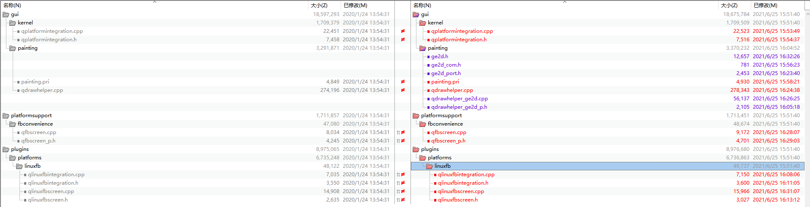

--

分为：屏幕驱动和fb驱动。

又进一步分为：uboot下的驱动和kernel下的驱动。

开始是完全不显示，通过回退版本对比，发现是某一次修改时序相关的寄存器导致了无法显示。

去掉对应的修改，显示屏可以正常驱动。

uboot和kernel做一样的修改，都可以驱动显示屏。

现在uboot和kernel 的fb显示都不正常。

uboot下的表现是：显示的logo是完全乱的。

kernel下的表现是：完全显示不出来。

```
cat /dev/urandom > /dev/fb0
```

这个命令没有看到效果。

uboot的logo显示是乱的，是因为uboot针对新的CPU做了修改。没有兼顾到老的CPU。

就一个宏，新的芯片是64字节对齐，而老的芯片是32字节对齐。改了就好了。

kernel同一个宏也要做一样的修改。

这个时候，kernel里的显示还不正常。

还需要修改：

1、uboot里的fb_width和fb_height要设置为正确值。

2、设备树里的meson-fb也要设置这个为正确值。

```
display_size_default = <720 720 720 1440 32>;
```

现在执行fb的测试程序。就正常了。

用urandom随机数也可以正常了。

接下来就是qt的测试。qt直接就正常的了。

然后是触摸屏和qt触摸屏的结合。这个在《qt之触摸支持.md》里有写。

跑wearable这个qt的官方例子，是比较符合我们的需求的。

然后是性能评估。这个需要梳理一下总体的思路。

经过对directfb和ge2d的编译验证。

现在的方向是：qt+ge2d。不要使用directfb。

directfb有问题。

而当前我的qt之所以还没有用上ge2d。是因为我当前用的是5.12版本的qt。

而之前他们的补丁都是在5.8上做的。

当前我有两个选择：

1、把5.8的patch放到5.12上来用。

2、使用5.8版本的qt。

先看看5.8的patch能不能打到5.12上来。

我看看5.8版本和5.9版本的patch的区别有多大。

区别不大，5.9版本的补丁更加集中一些。

我尝试用5.9版本的补丁打到5.12的看看。

当前没有看到哪里配置了5.12啊。

在package/qt5/qt5.mk里配置的。

```
QT5_VERSION_MAJOR = 5.12
QT5_VERSION = $(QT5_VERSION_MAJOR).7
```

补丁打不上去。所以还是使用5.9.2的版本吧。

需要改动这些：

```
QT5_VERSION_MAJOR = 5.9
QT5_VERSION = $(QT5_VERSION_MAJOR).2
QT5_SOURCE_TARBALL_PREFIX = opensource-src # opensource现在的版本是叫everywhere
```

make一下。

报错。

```
ERROR: No hash found for qtbase-opensource-src-5.9.2.tar.xz
```

这个方向可能更加麻烦。

我还是尝试一下把补丁内容合入到5.12版本里。

先试一下。看改动并不多。

src/gui/kernel/qplatformintegration.cpp

加了一个空函数。

```
unsigned long QPlatformIntegration::get_phy_info(unsigned long mem)
{
}
```

src/gui/kernel/qplatformintegration.h

加上声明。

```
virtual unsigned long get_phy_info(unsigned long mem);
```

src/gui/painting/ge2d.h

新增这个文件。

src/gui/painting/ge2d_com.h

新增这个文件。

src/gui/painting/ge2d_port.h

新增

src/gui/painting/painting.pri

加上这2个文件。

```
+        painting/qpathsimplifier_p.h \
+        painting/qdrawhelper_ge2d_p.h
```

```
+        painting/qpathsimplifier.cpp \
+        painting/qdrawhelper_ge2d.cpp
```

src/gui/painting/qdrawhelper.cpp

```

```

都手动把修改点改了。

3个补丁自己修改自己。我就合并成一个补丁了。

```
diff -uprN qt5base-5.12.7 qt5base-5.12.7-modify > 0005-qt5base-fix-ge2d.patch
```

把补丁放入目录。

然后编译qt5base。没有报错。

很好。

完整编译，烧录镜像看看。

现在看ge2d的中断还是没有。

看看开机过程的ge2d相关打印。只有这4行。

```
[    6.845663@3]- ge2d: ge2d_init_module
[    6.846764@3]- ge2d: ge2d clock is 249 MHZ
[    6.850006@3]- ge2d: reserved mem is not used
[    6.854314@3]- ge2d: ge2d start monitor
```

那就要到qt里加打印调试了。

ge2d是怎样控制的？有设备节点吗？

发现有一个ge2d_feature_test的程序。

执行一下，提示：

```
[ion.c - ion_open:111]open /dev/ion failed: No such file or directory
ionmem error: No such file or directory failed: '(null)'
```

libion这个库是做什么用到？

 ION是google在Android4.0 为了解决内存碎片管理而引入的通用内存管理器,

在面向程序员编程方面，它和ashmem很相似。但是终究还是ION更胜一筹。

目前系统里倒是有一个/dev/ionvideo的节点。

ge2d_feature_test在这个目录下 hardware\aml-4.9\amlogic\libge2d\

看readme里有这样的描述

```

if dma buffer is allocated by ge2d, please add content blow in DTS:

/ {
    /* ...... */
    reserved-memory {
        /* ...... */
            ge2d_cma_reserved:linux,ge2d_cma {
                compatible = "shared-dma-pool";
                reusable;
                status = "okay";
                size = <0x0 0x1800000>;
                alignment = <0x0 0x400000>;
            };
    }
    /* ...... */
    ge2d {
        /* ...... */
        memory-region = <&ge2d_cma_reserved>;
    };
}
```

目前设备树里没有为ge2d预留内存。

这个好像就是一大块预留的内存，也配了一个设备节点来进行操作。代码很简单。

```
int ion_open() {
    int fd = open("/dev/ion", O_RDONLY | O_CLOEXEC);
    if (fd < 0) ALOGE("open /dev/ion failed: %s", strerror(errno));

    return fd;
}
```

这个暂时不管。这个是这个测试程序需要的东西。

把qt里针对ge2d的改动梳理一下。

改动主要涉及：

```
src/gui/kernel
	这个下面是平台集成。加了一个空函数。
	get_phy_info 这个要返回值的，都没有返回，那么默认就是返回0估计。写了个代码验证了一下，是返回0.
src/gui/painting
	这个加的多一点。
	加了qdrawerhelper_ge2d.cpp，还有几个头文件。
	
```

看qdrawerhelper.cpp里

```
static bool is_format_support_ge2d(int format, int *pxiel_format)
{
enum  {
    PIXEL_FORMAT_RGBA_8888          = 1,
    PIXEL_FORMAT_RGBX_8888          = 2,
    PIXEL_FORMAT_RGB_888            = 3,
    PIXEL_FORMAT_RGB_565            = 4,
    PIXEL_FORMAT_BGRA_8888          = 5,
    PIXEL_FORMAT_ARGB_8888          = 6,
}pixel_format_t;
```

只支持这些格式，那么我当前用的又是哪种格式呢？

PIXEL_FORMAT_ARGB_8888 这个的可能性比较大。

感觉加的这个代码分支进不来。

```
    int ge2d_src_format, ge2d_dst_format;
    if (is_continous_phys_addr(src_addr, &src_addr_phys) && is_continous_phys_addr(dst_addr, &dst_addr_phys) &&
        is_format_support_ge2d(src_format, &ge2d_src_format) && is_format_support_ge2d(dst_format,&ge2d_dst_format)) {
        aml_ge2d_info_t ge2dinfo;
        ge2dinfo.src_info[0].canvas_w = src_width;
        ge2dinfo.src_info[0].canvas_h = src_height;
```


```
#define FILE_NAME_GE2D        "/dev/ge2d"
```

还是需要把对qt的修改代码调用流程分析一下。

入口在哪里？改动的文件是这些。



改动在3个目录下。

gui目录：

```
gui/kernel
	这个下面是加了个空函数，不知道意义何在？
	get_phy_info
	知道了，这个空函数相当于是父类的默认实现。并不使用。
	实际上用的是linuxfb的实现。
	unsigned long QLinuxFbIntegration::get_phy_info(unsigned long mem)
{
    return m_primaryScreen->getfbinfo(mem);
}
```

platformsupport目录：

plugins目录：


需要从qlinuxfbscreen.cpp开始看，这个相当于底层。

增加了一个结构体定义

```
    struct {
        void            *mem;
        int             size;
        unsigned int    xres;
        unsigned int    yres;
        unsigned int    bits_per_pixel;
        unsigned long   phys;
    } gfx_fb;
```

增加了2个成员函数。

```
void setfbinfo(void *mem, int size, unsigned long phys, unsigned int xres, unsigned int yres, unsigned int bits_per_pixel);
    unsigned long getfbinfo(unsigned long mem);
```


我在对比代码的时候，发现有一些不符合预期的地方，

产生的原因是patch导致的。

我一个目录是手动改的，然后把这个目录跟原始目录对比生成patch，再对原始目录打上这个patch。

打上patch后的结果，跟我手动修改的有出入。

不过这些出入先不管。应该没有影响。

先还是看调用流程。


以analogclock的为例进行分析。

```
QGuiApplication app(argc, argv);
```

这一个构造函数，产生了哪些调用？

```
QGuiApplication::QGuiApplication(int &argc, char **argv, int flags)
    : QCoreApplication(*new QGuiApplicationPrivate(argc, argv, flags))
```

直接调用了QCoreApplication的构造函数。

把参数构造成了QGuiApplicationPrivate，在进一步调用coreapp的private的构造。

```
QCoreApplicationPrivate(argc, argv, flags)
```

这个构造函数就调用了QObjectPrivate，另外加argc等的赋值。

这个就没有必要进一步跟进去了。

回到QCoreApplication，这个主要是建立了一个eventdispatcher。


QPlatformIntegrationFactory 这个就一个create的static函数。

看看哪里调用的。

在qguiapplication.cpp里的init_platform函数里。

createPlatformIntegration 这个就是在创建event dispatcher的时候调用的。

然后相当于调用了：

```
QPlatformIntegrationFactory::create("linuxfb")
```

这样的方式来调用对应的模块的：

```
qLoadPlugin<QPlatformIntegration, QPlatformIntegrationPlugin>(loader(), platform, paramList, argc, argv);
```

那么我就认为是调用到了qlinuxfbintegration.cpp里的函数了。

先是构造函数：

```
m_primaryScreen = new QLinuxFbScreen(paramList);
```

创建了一个screen。

然后是QLinuxFbIntegration::initialize 这个函数


get_phy_info 实际调用的是：

```
unsigned long QLinuxFbIntegration::get_phy_info(unsigned long mem)
```


```
unsigned long QFbScreen::getfbinfo(unsigned long mem)
	
```


```
void QFbScreen::setfbinfo
这个函数被谁调用了？
在这个初始化的时候：
bool QLinuxFbScreen::initialize()
是通过读取fb的info来设置的。
然后对fb进行了mmap。
```


qBlendTexture 关键看这个函数被谁调用了。

只被这函数调用：

```
void QSpanData::adjustSpanMethods()
```

还是处理文字的情况。

我跑一个有文字显示的例子。ge2d还是没有中断。

lsof |grep ge2d ，也没有看到有进程使用了/dev/ge2d这个设备文件。

倒是有个内核线程

```
 1916 root     [ge2d_monitor]
```

看看什么时候起来的，起什么作用。

```
static int ge2d_start_monitor(void)
{
	int ret = 0;

	ge2d_log_info("ge2d start monitor\n");
	ge2d_manager.process_queue_state = GE2D_PROCESS_QUEUE_START;
	ge2d_manager.ge2d_thread = kthread_run(ge2d_monitor_thread,
					       &ge2d_manager,
					       "ge2d_monitor");
	if (IS_ERR(ge2d_manager.ge2d_thread)) {
		ret = PTR_ERR(ge2d_manager.ge2d_thread);
		ge2d_log_err("ge2d failed to start kthread (%d)\n", ret);
	}
	return ret;
}
```

那先从为什么没有打开ge2d这个点进行切入。

打开就这个地方：

```
int ge2d_blend_Texture(aml_ge2d_info_t *pge2dinfo)
{
    if (ge2d_fd < 0)
        ge2d_fd = ge2d_open();
```


现在找一下这个函数的调用的地方：adjustSpanMethods

先在这这里面加一个打印。提交so看看哪些地方调用了。

加了打印，这个库libQt5Gui.so.5.12.7 需要推送到板端。

adjustSpanMethods 在quickcontrols2/contactlist例子运行时，多次被调用到。

但是type值，只有0和1这两种情况。

```
enum Type {
        None,
        Solid,
        LinearGradient,
        RadialGradient,
        ConicalGradient,
        Texture
    } type : 8;
```

而我们的改动是对Texture，也就是5的情况才起作用。

我把ge2d_com.h里的`__DEBUG`打开看看。

跑quickcontrols2/texteditor 这个例子，有Texture的情况。

但是ge2d还是没有看到调用。

是这里判断条件不符合。

```
src is continue:0, dst is continue:0, src is support:1, dst is support:1
```


QFbScreen::setfbinfo 

这里为什么要明确写使用QFbScreen这个类的这个函数？

QFbScreen和QLinuxFbScreen是什么关系？

QFbScreen 在platformsupport/fbconvenience目录下。

QLinuxFbScreen是在plugins/platforms/linuxfb目录下。

这2个类，都定义了一个一样的结构体：

```
struct {
        void            *mem;
        int             size;
        unsigned int    xres;
        unsigned int    yres;
        unsigned int    bits_per_pixel;
        unsigned long   phys;
    } gfx_fb;
```

那这里就值得看一下了。是不是我漏了一行代码。

还真是我写错了。

```
setfbinfo(mMmap.data,mMmap.size, finfo.smem_start + mMmap.offset,
    vinfo.xres, vinfo.yres,vinfo.bits_per_pixel);
 被我错写成：
QFbScreen::setfbinfo(mMmap.data,mMmap.size, finfo.smem_start + mMmap.offset,
    vinfo.xres, vinfo.yres,vinfo.bits_per_pixel);
```

改回来。再看看。

不是不是，我之前没有改错。

在第二个patch里，就是改setfbinfo为QFbScreen::setfbinfo。

而且还刻意在QLinuxFbScreen里，对setfbinfo和getfbinfo进行了空的处理。


当前这个函数里

```
unsigned long QFbScreen::getfbinfo(unsigned long mem)
{
    unsigned long phys = 0;
    unsigned long vir_mem_base = (unsigned long)gfx_fb.mem;


    if ((mem >= vir_mem_base) && (mem - vir_mem_base) <= gfx_fb.size)
        phys = gfx_fb.phys + (mem - vir_mem_base);
    //if (phys > 0)
    //    printf("!QFbScreen:: %s,phys=%x,gfx_fb.size=%x,mem=%x,vir_mem_base=%x\n",__func__,phys,gfx_fb.size,mem,vir_mem_base);
    return phys;

}
```

mem 一直比gfx_fb.mem 要小。所以phys一直是返回0 。

gfx_fb.mem 的值怎么来的？为什么这么大？

是setfbinfo设置的。他的值是这样赋值过来的。

````
mMmap.data = data + mMmap.offset;
````

data这个指针，是对fb进行mmap得到的。

为什么getfbinfo的时候，传递进来的mem参数，总是不符合要求的呢？

为什么会这样呢？

当前的gfx_fb.mem是一个很大的值，

而程序里的内存值，都是比较小的。根本没可能大于gfx_fb.mem的值。

也不一定，像这一次，就比较接近了。

```
xhl -- mem:0xf00a5008, vir_mem_base:0xf24fe000
```

测试了多次，还是没有碰到满足条件的。


# 评估性能

评估性能，有哪些维度呢？

可以从直观感受开始，到量化的数据。

从粗略到细致。

从简单到复杂。

从整体到局部。


直观感受：

流畅度，显示效果。


当前有没有vsync，怎么加入vsync？

把性能测试的跑起来。


```
      1.  Amlogic 评估能否直接使用QT显示将数据直接送到VPU/FB？跳过GE2D？
      2.  Alpha混合是在VPU还是OSD中完成的？
      3.  可以同时混合多少个Alpha的通道？ 如何验证？
      4.  Amlogic去评估跳过GE2D方式帧率是多少？ 是GE2D限制了帧率吗？ 如果不是GE2D限制，那么低帧率的瓶颈是哪里？
      5.  当使用DSI以60fps写入显示器时，如果从RAM中获取数据，则存在撕裂的风险（即显示器一般是旧帧数据一般是新帧数据），Amlogic是如何管理撕裂的？使用垂直同步？还是其他的方式？
      6.  每个Alpha通道有多大X * Y（以像素为单位）？
      7.  最终的数据如何送到DSI （示意图参考附件ppt）
           将每帧直接写入DSI PHY @ 60fps（Alt 2）？
           将每帧写入RAM @ 60fps（Alt 1A / B）中的“输出帧缓冲区”？

      8.  DSI PHY可以从两个不同的“输出帧缓冲区”中获取数据吗？
      9.  VPU可以在两个“输出帧缓冲器”之间交替使用吗？
      10.  DSI PHY是否充当DMA？
      11.  VPU是否充当DMA？
      12.  ACPU是否参与了任何阶段的显示渲染？
```


# 参考资料

1、ION详细分析

https://blog.csdn.net/pillarbuaa/article/details/79206224