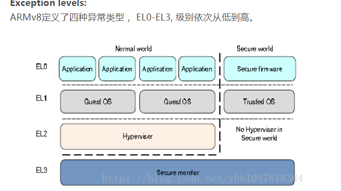

1

新建hello.s文件。

```
.text

.global main
main:
        ldr x0, addr_of_keep_x30
        str x30, [x0]

        ldr x0, addr_of_msg
        bl puts

        ldr x0, addr_of_keep_x30
        ldr x30, [x0]

        mov w0, #0
        ret


addr_of_msg: .dword msg
addr_of_keep_x30: .dword keep_x30
.data
msg: .asciz "hello world!\n"
keep_x30: .dword 0

```

Makefile这样写。

```
all:
	aarch64-linux-gnu-as   hello.s -o hello.o
	aarch64-linux-gnu-gcc -static hello.o -o hello

```

运行：

```
hlxiong@hlxiong-VirtualBox:~/work/test/asm$ qemu-aarch64 ./hello
hello world!

```

arm公司有推出一个叫DS-5的工具（基于eclipse的）。可以进行汇编模拟调试。


ARMv8拥有两种执行模式： 
AArch64执行A64指令，使用64bit的通用寄存器； 
AArch32执行A32/T32指令，使用32bit的通用寄存器；


```
x0到x30 
	通用寄存器。可以当32位寄存器用。这个时候写做w0到w30
plr
	就是x30寄存器。保存返回地址。
	produce link register, 连接寄存器
SP_EL0到3
	栈指针寄存器。
ELR_EL1到3
	exception link registers，异常链接寄存器
SPSR_EL1到3
	保存进入ELx状态时的状态寄存器。
V0到V31
	浮点寄存器。128位的。
PC
	
```




EL0为普通用户程序 
EL1是操作系统内核相关 
EL2是Hypervisor, 可以理解为上面跑多个虚拟OS 
EL3是Secure Monitor(ARM Trusted Firmware)


参考资料

1、这个系列文章不错

https://blog.csdn.net/yhb1047818384/article/details/80382783