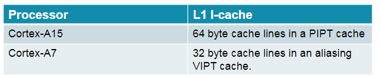

# 什么是big little架构

形象比喻就是男女搭配。

big核心就是男人，干活有劲，但是吃得多。

little核心就是女人，干不了太重的活，但是吃得少。

所以，浏览网页、播放mp3，这种小活，女人干就好了。男人就在那里休息。

等到玩游戏的时候，男人就起来干活了。

**big little的前提是，big核心和little核心架构版本要相同。**

例如，A15和A7都是armv7的架构。

A53和A57也可以搭配，因为它们都是armv8的架构。

big little和smp有什么关系？

Linux内核里如何处理big little呢？

目前的Linux内核实现的CPU负载均衡算法是基于SMP模型的，并没有考虑到big.LITTLE模型，因此Linaro组织对big.LITTLE模型开发了全新的负载均衡调度器，称为HMP调度器。

HMP调度器并没有合并到Linux内核中，因此我们采用Linaro组织开发的Linux内核分支，它最新的代码是Linux3.10, ，本文以该内核版本(linux-linaro-stable-3.10.100-2016.03.tar.bz2)为蓝本。HMP调度器算不上完美，有点粗糙，各大手机芯片以及手机厂商根据Linaro开发的这个HMP调度器为蓝本在结合各自不同的需要做了不少的特别的优化，比如MTK，高通等。

在迁移完成以后的一段时间里，**保持小核的cache仍然活动一段时间**，此时是大小核同时运行，以功耗换性能，等大核完成cache同步以后再彻底关闭小核。

8核CPU或者是更多核的处理器，这些CPU有可能不完全对称。

有的是4个A15和4个A7，或者是4个A57和4个A53，

甚至像海思麒麟935处理器（4核A53 2.2 GHz + 4核A53 1.5 GHz），

这8个核的频率可能不一样，则使用过程中需要大小核切换（频率高的是大核，频率低的是小核）。

本文以ARM cortex-A7为例，**分析大小核切换的代码**，

着重于分析实现切换的代码，对于为什么要这样切换、以及什么时候切换，不做过多探讨。

主要代码分布：

arch/arm/common/bL_switcher.c

arch/arm/include/asm/bL_switcher.h

drivers/cpufreq/Arm_big_little.c

该技术能够同时打开所有核心吗？

在早期的 big.LITTLE 软件模型中（集群迁移和 CPU 迁移），**软件在核心之间切换，不能同时打开所有核心。**

在更新的软件模型“全局任务调度”中，软件可以让所有核心同时处于活动状态，

**因为操作系统能够识别系统中的 big 和 LITTLE 核心，而且直接控制可用核心之间的线程分配。**

使用全局任务调度，操作系统电源管理机制会继续让未使用的核心保持空闲状态，这与当前标准多核系统中的做法相同。

软件是否类似于 DVFS 和 SMP 调度等现有机制？

在当前的智能手机和平板电脑中，人们使用动态电压和频率调节 (DVFS) 来适应所需性能的即时变化。

big.LITTLE 迁移模式延伸了这一概念，当 LITTLE 核心超过最高 DVFS 运行点时，它会将任务迁移到“big”CPU 核心。

这种迁移需要大约 30 微秒。

相反，DVFS 驱动程序通常每 50 毫秒对操作系统和各个核心的性能进行一次评估，

有些实施的采样稍微更加频繁。它需要大约 100 微秒来改变电压和频率。由于迁移 CPU 或集群所需的时间短于 DVFS 更改时间，甚至比 DVFS 更改需要的操作系统评估时间短一个数量级，因此 big.LITTLE 迁移让处理器能够在更低的运行点运行，运行频率更高，而且让用户丝毫察觉不到。

**big.LITTLE 软件是以 Linux 内核的补丁集形式提供的。**

在 Android 系统下，它在内核中有效运行。

全局任务调度软件（ARM 的“全局任务调试”实施在开源树中称为 big.LITTLE MP）托管在 Linaro git 树上，

可供所有用户自由访问，正处在上游提交过程中。

该补丁集可以应用于 Android 系统下运行的标准 Linux 内核。

ARM已经在多个开发板上演示了全局任务调度，还与主要合作伙伴在量产芯片上进行了演示，包括在私人活动以及全球移动大会和国际消费电子展上。

big.LITTLE 的第一次量产实施使用了集群迁移和 CPU 迁移模式，因为这些系统的软件冻结日期是在 2012 年。全局任务调度预期在 2013 下半年开始在量产系统上应用。

一般我们说到多核，大都是指SMP(Symmetric multi-processing)，而ARM的big.LITTLE的CPU组合方案则属于**HMP**(Heterogeneous multi-processing)系统。

这里的"**big**"是指性能更强，同时功耗更高的CPU（大核），而"**LITTLE**"则是与之相对的性能略弱，但功耗较低的CPU（小核）。

这里的兼容包括了指令集（ISA）的兼容，大核和小核都属于ARM架构，只是在micro-architecture上有所区别（比如A15有6个event counter，而A7只有4个），所以它们可以运行同一个操作系统。

多个同构的大核构成了一个big cluster，多个同构的小核构成了一个LITTLE cluster，同一cluster的CPU共享L2 cache。

big cluster和LITTLE cluster共享中断控制器（比如GIC-400），且通过支持cache一致性的interconnect相连接（比如coreLink CCI-400）。

如果没有硬件层面的cache一致性，数据在大核和小核之间的传输将必须经过共享内存，这会严重影响效率。

big cluster和LITTLE cluster中的CPU被同一个操作系统所调度，OS中的任务在执行时，可以根据负载的情况，在大小核之间动态地迁移（on the fly），以提高灵活性。

从OS调度的角度，迁移的方案可分为两种，其中最早出现也是相对最简单的是cluster migration。

在这种方案中，OS在任何时刻都只能使用其中的一个cluster，当负载变化时，任务将从一个cluster整体切换到另一个cluster上去，也就是说，它是以cluster为单位进行migration的。早期的三星Exynos 5 Octa (5410)和NVIDIA的Tegra X1使用的就是这种模型。

这种方案的好处是：在任一时刻，OS要么全在big cores上运行，要么全在LITTLE cores上运行，**虽然整个系统是HMP的，但从OS的角度，具体到每个时刻，操作的对象都是SMP的，因此对于那些默认支持SMP的系统，使用big.LILLTE芯片时，不需要进行太多代码的修改。**

但是，以cluster为迁移单位，粒度实在太大了点，对于任务的负载介于big cluster和LITTLE cluster之间的，并不需要对一个cluster中的所有cores进行迁移。

这就是以单个core为迁移单位的CPU migration方案，具体的做法是：一个大核和一个小核进行组队，形成一个pair。调度器可以使用每一组pair，但在同一时刻，只允许pair中的一个 core运行，负载高时在大核上运行，低就在小核上运行。

从OS的角度，在任一时刻，每个pair看起来都像只有一个core一样，所以这样的pair又被称为"virtual core"（或pseudo CPU）。

这套机制被称为**IKS**(In-kernel Switcher)，由Linaro实现（参考ELC: In-kernel switcher for big.LITTLE），被NVIDIA的Tegra 3所采用。

不管是cluster migration，还是CPU migration，在某一个时刻，都只有一半的CPU cores可以处在运行状态（假设系统中大核和小核的数目相等），这对CPU资源是一种浪费。所以，一种可以充分利用各个物理核的**GTS**(Global Task Scheduling)方案应运而生。

三星的Exynos 5 Octa系列自5420开始，包括5422和5430，以及苹果公司的A11，都采用的是GTS

Cortex-A系列的ARM芯片通常是配合Linux系统使用的，而Linux在针对多核应用的设计上主要面向的是SMP，这就会带来一些问题。

其中之一就是：任务在大核和小核之间切换，但大核和小核的**cache line的大小**通常是不一致的（比如大核是64字节，小核是 32字节），在某些情况下这可能引发未知的bug。

DynamIQ的方案于2017年5月出现，它是基于big.LITTLE进行扩展和设计的，可视作是big.LITTLE技术的演进。

同原生的big.LITTLE不同的是，**因为它采用了ARMv8.2中一些独有的特性，因此与之前的ARM架构不能完全兼容**，所以开始阶段只用在较新的Cortex-A75和Cortex-A55处理器上。

# 参考资料

1、如何评价 ARM 的 big.LITTLE 大小核切换技术？

https://www.zhihu.com/question/23299449

2、HMP大小核调度

https://zhuanlan.zhihu.com/p/23966171

3、ARM Linux 大小核切换——cortex-A7 big.LITTLE 大小切换代码分析

https://www.cnblogs.com/fozu/p/4552938.html

4、有关big.LITTLE，你需要知道的十件事情

https://community.arm.com/cn/b/blog/posts/big-little-1717646945

5、从big.LITTE到DynamIQ

https://www.ershicimi.com/p/11f9a9741c93e8531826426448d435ee