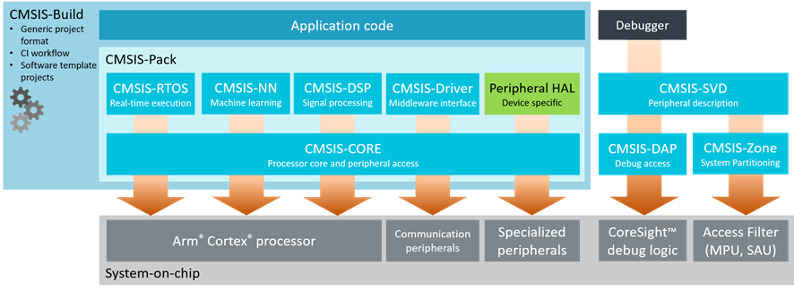

--

# 简介

CMSIS（Cortex Microcontroller Software Interface Standard）是一种由ARM（Advanced RISC Machines）推出的标准，旨在提供一致的软件接口和抽象层，以简化嵌入式系统中的Cortex-M微控制器的开发。CMSIS是ARM为其Cortex-M处理器核心提供的一种软件生态系统，它为嵌入式开发者提供了一套通用的、可移植的工具和库，以简化嵌入式系统的开发和移植。

以下是CMSIS的一些主要组成部分和功能：

1. **Core（核心）**: CMSIS Core 提供了与Cortex-M处理器核心的基本操作和功能相关的抽象层。这包括了中断控制、系统控制、调试和观测等方面的API。

2. **DSP库**：CMSIS DSP库（Digital Signal Processing）包括了一组针对数字信号处理的优化函数。这对于实现音频处理、图像处理、通信和控制应用等领域非常有用。

3. **RTOS**：CMSIS RTOS是一个用于实时操作系统（RTOS）的API规范，使开发者能够编写可移植的多线程嵌入式应用程序。它支持不同的RTOS内核，如FreeRTOS、Keil RTX等。

4. **DAP（Debug Access Port）**：CMSIS-DAP是一种用于调试的标准接口，它允许开发者使用通用的调试工具与Cortex-M处理器进行交互。这包括调试器、编程器和仿真器。

5. **Pack格式**：CMSIS-Pack是一种用于封装设备支持、软件组件和文档的标准格式。它有助于将设备支持信息、外设驱动程序和其他软件组件整合到开发环境中。

6. **设备支持**：CMSIS提供了一种方式来描述不同Cortex-M处理器核心的设备特性和寄存器映射。这有助于开发工具和驱动程序的开发者在不同的Cortex-M设备上实现兼容性。

CMSIS的主要目标是提供一种通用的、可移植的开发环境，使开发者能够更轻松地开发、移植和调试嵌入式系统，特别是基于Cortex-M处理器核心的系统。这有助于加速嵌入式系统的开发周期，提高开发效率，并促进嵌入式应用的创新。

## CMSIS Core

CMSIS Core 是 CMSIS（Cortex Microcontroller Software Interface Standard）的一部分，

它提供了与Cortex-M微控制器核心相关的基本操作和功能的抽象层。

CMSIS Core 定义了一组通用的、可移植的API，

以简化Cortex-M处理器的编程和开发。

以下是 CMSIS Core 中包括的主要组件和功能：

1. **核心寄存器访问**：CMSIS Core 包括了一组API，允许开发者访问Cortex-M处理器的核心寄存器，如通用寄存器（General-Purpose Registers）、特殊寄存器（Special-Purpose Registers）和标志寄存器（Flag Registers）。这些API允许开发者执行底层的处理器控制操作。

2. **中断控制器**：CMSIS Core 定义了一组API，用于配置和管理Cortex-M处理器的中断控制器。这包括中断的使能和禁用、中断优先级的配置、中断向量表的设置等功能。

3. **系统控制和配置**：CMSIS Core 提供了一组API，用于配置和管理Cortex-M处理器的系统控制寄存器，如系统控制单元（System Control Unit）和系统控制块（System Control Block）。这些API允许开发者控制处理器的时钟、复位、调试和其他系统级功能。

4. **调试和观测**：CMSIS Core 包括了一组API，用于与调试和观测相关的操作。这些API允许开发者控制调试模式、访问调试寄存器、触发断点等。

5. **位操作和位段操作**：CMSIS Core 提供了一些用于位操作和位段（Bit-Field）操作的宏和函数，使开发者能够轻松地进行位级别的操作。

总之，CMSIS Core 提供了一组通用的、可移植的API，用于访问和控制Cortex-M微控制器核心的基本功能和寄存器。这些API有助于开发者编写跨不同Cortex-M设备的可移植代码，并更容易地访问底层的硬件功能。这使得嵌入式系统开发更加便捷和高效。不同版本的CMSIS Core可能会包含略有不同的功能和API，具体取决于Cortex-M核心的版本和特性。

### api

CMSIS Core 的API代码通常是以头文件的形式提供的，

这些头文件包含了函数声明、宏定义和数据结构定义等信息，

以便在您的嵌入式项目中包含和使用。

这些头文件通常以 ".h" 扩展名结尾，

名称可能因供应商和Cortex-M核心的版本而异。

以下是一些常见的CMSIS Core头文件和供应商：

1. **ARM官方提供的CMSIS Core**：ARM提供了官方的CMSIS Core头文件，可以从ARM官方网站或ARM开发工具（如Keil MDK）的安装目录中获取。它们通常包括以下头文件：
   
   - `core_cm0.h`：用于Cortex-M0核心。
   - `core_cm3.h`：用于Cortex-M3核心。
   - `core_cm4.h`：用于Cortex-M4核心。
   - `core_cm7.h`：用于Cortex-M7核心。
   
ARM还提供了相应的文档，其中包括CMSIS-Core规范和相关的API文档，可以在ARM官方网站上找到。
   
2. **供应商特定的CMSIS Core**：一些芯片制造商为其特定的Cortex-M微控制器提供了CMSIS Core头文件和文档。这些头文件通常与供应商的嵌入式开发工具一起提供，或者可以从供应商的网站上获取。

要使用CMSIS Core的API，您需要将适当的头文件包含到您的项目中，并按照文档中的说明使用这些API。通常，这些头文件中包含了有关API的注释和文档，以帮助您了解如何正确使用它们。

请注意，CMSIS Core的具体内容和命名可能会因Cortex-M核心的版本和供应商而异，因此建议查阅相关的文档和头文件以获取特定的信息。一般来说，CMSIS Core是为了提供通用性和可移植性而设计的，以便在不同的Cortex-M设备上开发和移植嵌入式应用程序。

# 代码

代码：

https://github.com/ARM-software/CMSIS_5

文档：

https://arm-software.github.io/CMSIS_5/General/html/index.html

CMSIS 是一组工具、API、框架和工作流程，

有助于简化软件重用、缩短微控制器开发人员的学习曲线、加速项目构建和调试，

从而缩短新应用程序的上市时间。

CMSIS 最初是一个独立于供应商的硬件抽象层基于 Arm® Cortex®-M 的处理器，

后来扩展到支持基于 Arm Cortex-A 的入门级处理器。

为了简化访问，CMSIS 定义了通用工具接口，并通过为处理器和外设提供简单的软件接口来实现一致的设备支持。

CMSIS 是与各种芯片和软件供应商密切合作定义的，

并提供了与外设、实时操作系统和中间件组件接口的通用方法。

它旨在实现来自多个供应商的软件组件的组合。

CMSIS 是开源的，并在 GitHub 上协作开发。

包含的组件：

| CMSIS-...                                                    | Target Processors                        | Description                                                  |
| ------------------------------------------------------------ | ---------------------------------------- | ------------------------------------------------------------ |
| [**Core(M)**](https://arm-software.github.io/CMSIS_5/Core/html/index.html) | All Cortex-M, SecurCore                  | Standardized API for the Cortex-M processor core and peripherals. Includes intrinsic functions for Cortex-M4/M7/M33/M35P SIMD instructions. |
| [**Core(A)**](https://arm-software.github.io/CMSIS_5/Core_A/html/index.html) | Cortex-A5/A7/A9                          | Standardized API and basic run-time system for the Cortex-A5/A7/A9 processor core and peripherals. |
| [**Driver**](https://arm-software.github.io/CMSIS_5/Driver/html/index.html) | All Cortex                               | Generic peripheral driver interfaces for middleware. Connects microcontroller peripherals with middleware that implements for example communication stacks, file systems, or graphic user interfaces. |
| [**DSP**](https://arm-software.github.io/CMSIS_5/DSP/html/index.html) | All Cortex-M                             | DSP library collection with over 60 functions for various data types: fixed-point (fractional q7, q15, q31) and single precision floating-point (32-bit). Implementations optimized for the SIMD instruction set are available for Cortex-M4/M7/M33/M35P. |
| [**NN**](https://arm-software.github.io/CMSIS_5/NN/html/index.html) | All Cortex-M                             | Collection of efficient neural network kernels developed to maximize the performance and minimize the memory footprint on Cortex-M processor cores. |
| [**RTOS v1**](https://arm-software.github.io/CMSIS_5/RTOS/html/index.html) | Cortex-M0/M0+/M3/M4/M7                   | Common API for real-time operating systems along with a reference implementation based on RTX. It enables software components that can work across multiple RTOS systems. |
| [**RTOS v2**](https://arm-software.github.io/CMSIS_5/RTOS2/html/index.html) | All Cortex-M, Cortex-A5/A7/A9            | Extends CMSIS-RTOS v1 with Armv8-M support, dynamic object creation, provisions for multi-core systems, binary compatible interface. |
| [**Pack**](https://arm-software.github.io/CMSIS_5/Pack/html/index.html) | All Cortex-M, SecurCore, Cortex-A5/A7/A9 | Describes a delivery mechanism for software components, device parameters, and evaluation board support. It simplifies software re-use and product life-cycle management (PLM). Is part of the [**Open CMSIS Pack project**](https://www.open-cmsis-pack.org/). |
| [**Build**](https://arm-software.github.io/CMSIS_5/Build/html/index.html) | All Cortex-M, SecurCore, Cortex-A5/A7/A9 | A set of tools, software frameworks, and work flows that improve productivity, for example with Continuous Integration (CI). Is replaced with the [**CMSIS-Toolbox**](https://github.com/Open-CMSIS-Pack/devtools/tree/main/tools). |
| [**SVD**](https://arm-software.github.io/CMSIS_5/SVD/html/index.html) | All Cortex-M, SecurCore                  | Peripheral description of a device that can be used to create peripheral awareness in debuggers or CMSIS-Core header files. |
| [**DAP**](https://arm-software.github.io/CMSIS_5/DAP/html/index.html) | All Cortex                               | Firmware for a debug unit that interfaces to the CoreSight Debug Access Port. |
| [**Zone**](https://arm-software.github.io/CMSIS_5/Zone/html/index.html) | All Cortex-M                             | Defines methods to describe system resources and to partition these resources into multiple projects and execution areas. |


CMSIS 的创建是为了帮助行业实现标准化。

它可以在各种开发工具和微控制器上实现一致的软件层和设备支持。

 CMSIS 并不是一个巨大的软件层，会带来开销，并且没有定义标准外设。

因此，芯片行业可以通过此通用标准支持各种基于 Arm Cortex 处理器的设备。

架构：




## 编码规则

CMSIS 使用以下基本编码规则和约定：

符合 ANSI C (C99) 和 C++ (C++03)。
使用 stdint.h 中定义的 ANSI C 标准数据类型。
变量和参数有完整的数据类型。
\#define 常量的表达式包含在括号中。
符合 MISRA 2012（但不声称符合 MISRA）。违反 MISRA 规则的行为都会被记录下来。
此外，CMSIS 建议采用以下标识符约定：

用于标识核心寄存器、外设寄存器和 CPU 指令的大写名称。
CamelCase 名称用于标识函数名称和中断函数。
Namespace_ 前缀避免与用户标识符冲突并提供功能组（即用于外设、RTOS 或 DSP 库）。


CMSIS 在源文件中记录为：

使用 C 或 C++ 风格的注释。
符合 Doxygen 的函数注释提供：
简要功能概述。
功能的详细描述。
详细参数解释。
有关返回值的详细信息。

Doxygen comment example:

```
/**
 * @brief  Enable Interrupt in NVIC Interrupt Controller
 * @param  IRQn  interrupt number that specifies the interrupt
 * @return none.
 * Enable the specified interrupt in the NVIC Interrupt Controller.
 * Other settings of the interrupt such as priority are not affected.
 */
```


CMSIS 的各个组件均使用主流编译器进行验证。

为了获得多样化的覆盖范围，各种测试中使用了 Arm Compiler v5（基于 EDG 前端）、Arm Compiler v6（基于 LLVM 前端）和 GCC。

对于每个组件，“验证”部分描述了各种验证步骤的范围。

CMSIS 组件与一系列 C 和 C++ 语言标准兼容。 

CMSIS 组件符合 Arm 架构的应用程序二进制接口 (ABI)（CMSIS-RTOS v1 除外）。

这确保了 C API 接口支持各种工具链之间的互操作。

由于 CMSIS 定义了可扩展到各种处理器和设备的 API 接口和函数，

因此运行时测试覆盖范围是有限的。

但是，有几个组件是使用专用测试套件（CMSIS-Driver、CMSIS-RTOS v1 和 CMSIS-RTOS v2）进行验证的。

使用 PC-Lint 检查 CMSIS 源代码是否符合 MISRA C:2012。 

MISRA 偏差已通过合理的努力记录下来，但 Arm 并不声称遵守 MISRA，因为目前还没有指南执行计划。

不会检查 CMSIS 源代码是否符合 MISRA C++:2008，

因为存在与 C 语言标准不兼容的风险，特别是各种 C 编译器可能生成的警告。


# 参考资料

1、CMSIS

https://baike.baidu.com/item/CMSIS/4082822?fr=aladdin