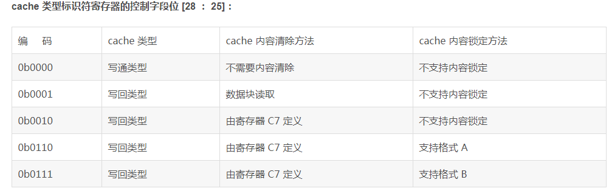

1

在基于ARM的嵌入式系统中，存储系统通常是通过系统控制协处理器CP15完成的。

CP15可以包含16个32位的寄存器，其编号为0-15。名字是C0到C15

实际上对于某些编号的寄存器可能对应有多个物理寄存器。

在指令中指定特定的标志位来区分这些物理寄存器。

有些类似于ARM寄存器中，处于不同的处理器模式时，ARM某些寄存器可能不同。

指令的基本格式是：

```
MCR{cond}    coproc，opcode1，Rd，CRn，CRm，opcode2
MRC{cond}    coproc，opcode1，Rd，CRn，CRm，opcode2
```

coproc，协处理器名字，标准名是pn，n取值0到15 。我们现在讨论的就是p15这个。

opcode1，写处理器特定操作码，对于cp15来说，这个取值固定为0 。

Rd，目标寄存器。

CRn，存放第一个操作数的寄存器。

CRm，存放第二个操作数的寄存器。用来区分同一个编号的不同物理寄存器。不需要的时候，填C0

opcode2，可选的协处理器操作码。用来区分同一个编号的不同物理寄存器。不需要的时候，填0


# C0

根据opcode2的不同，有2种用途。

如果opcode2为0，这个是标识符寄存器。

```
mrc p15, 0, r0, c0, c0, 0 ; 把主标志寄存器内容读取到r0寄存器。
```


如果opcode2为1，表示cache类型标识符寄存器

```
mrc p15, 0, r0, c0, c0, 1; 
```


bit24：这个表示dcache和icache是统一的还是分开的。为0表示统一。

bit28到bit25的：这个比较重要。



# C1

CP15中的寄存器C1是一个**控制寄存器**，它包括以下控制功能：

1、**禁止或使能MMU**以及其他与存储系统相关的功能

2、配置存储系统以及ARM处理器中的相关部分的工作

# C2

C2寄存器的别名：Translation table base (TTB) register

**C2寄存器用来保存页表的基地址**，即一级映射描述符表的基地址。

# C3

CP15 中的寄存器 C3 定义了 ARM 处理器的 16 个域的访问权限。

每2个bit构成一个域。

# C5

CP15 中的寄存器 C5 是失效状态寄存器，分为指令状态失效和数据状态失效。

```
MRC p15, 0, <Rd>, c5, c0, 0   访问数据失效状态寄存器
MRC p15, 0, <Rd>, c5, c0, 1   访问指令状态失效寄存器
```

# C6

CP15 中的寄存器 C6 是失效地址寄存器，**其中保存了引起存储访问失效的地址**，分为数据失效地址寄存器和指令失效地址寄存器

```
MRC p15, 0, <Rd>, c6, c0, 0  访问数据失效地址寄存器
MRC p15, 0, <Rd>, c6, c0, 2  访问指令失效地址寄存器
```

# C7

CP15 的 C7 寄存器用来控制 cache 和写缓存，它是一个只写寄存器，读操作将产生不可预知的后果。

# C8

系统协处理器CP15的寄存器C8就是清除TLB内容的相关操作。它是一个只写的寄存器。

# C12

CP15寄存器C12用来设置异常向量基地址，其编码格式如下所示：

**只有ARM11和cortex-a 可以任意修改异常向量基地址。arm7,ARM9,ARM10只可以在0地址或0xffff0000中** 


# C13

CP15中的寄存器C13用于快速上下文切换。

参考资料

1、ARM协处理器CP15寄存器详解

https://blog.csdn.net/qq_33160790/article/details/75570892