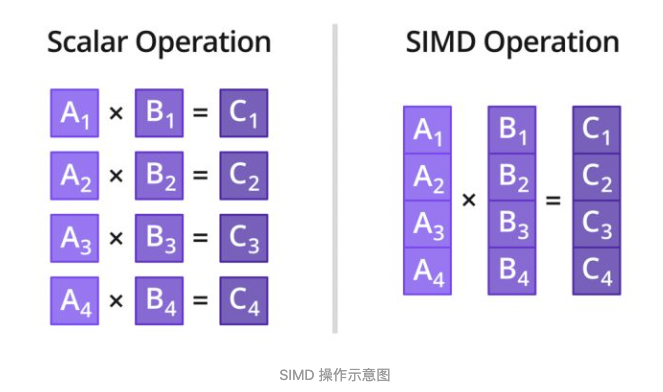

--

# 简介

VFP(Vector Floating Point)指令

该指令用于向量化加速浮点运算。

自ARMv7开始正式引入NEON指令，

**NEON性能远超VFP，因此VFP指令被废弃。**

类似于Intel CPU下的MMX/SSE/AVX/FMA指令，

ARM CPU的NEON指令同样是通过向量化来进行速度优化。


熟悉arm processor的朋友应该知道arm的Cortex-A是带有FPU和NEON的，

==FPU用来做浮点数运算的，==

==而NEON是SIMD指令做并行运算的。==

==在现有Cortex-A的设计里，NEON和FPU是不可分的，也就是不能单独只有NEON或是FPU。==

在比较高性能的Cortex-A CPU（比如Cortex-A15/A57/A72/A73/A75)中，NEON和FPU是不能在RTL配置里去掉的，

==在高能效的Cortex－A的CPU（比如Cortex-A7/A53/A55)中NEON和FPU是可以在RTL配置里面配置有或是没有。==


NEON和FPU毕竟是占面积的，也许你会认为你的应用可能用不到NEON或是FPU，所以你可以配置RTL没有NEON／FPU，以减少面积die size或功耗。


这在Armv7里可能不是问题，但是在armv8 64位里需要非常小心，

也许因为这个配置导致你的芯片称为无用的废片，有些客户因此遭受损失，虽然我们已经尽可能地告知客户们。


# arm neon指令汇编举例

NEON（Advanced SIMD）指令集是 ARM 处理器上的一组 SIMD（Single Instruction, Multiple Data）指令，用于高效地执行并行数据处理。

以下是一些 NEON 指令的简单汇编示例：

1. **加法指令（VADD）：**

   ```assembly
   // 向量加法
   vadd.i32 q0, q1, q2   // q0 = q1 + q2
   ```

2. **减法指令（VSUB）：**

   ```assembly
   // 向量减法
   vsub.i32 q0, q1, q2   // q0 = q1 - q2
   ```

3. **乘法指令（VMUL）：**

   ```assembly
   // 向量乘法
   vmul.f32 q0, q1, q2   // q0 = q1 * q2 (单精度浮点数)
   ```

4. **累加指令（VADDL）：**

   ```assembly
   // 向量累加并扩展为长整型
   vaddl.s16 q0, d1, d2   // q0 = (int32_t)d1 + (int32_t)d2
   ```

5. **比较指令（VQABS）：**

   ```assembly
   // 向量绝对值（饱和）
   vqabs.s32 q0, q1   // q0 = abs(q1) 饱和到 int32_t 范围
   ```

6. **加载/存储指令（VLD1 / VST1）：**

   ```assembly
   // 加载/存储单精度浮点数向量
   vld1.f32 {d0-d3}, [r0]!   // 从地址 r0 加载 4 个单精度浮点数到寄存器 d0-d3，并递增地址
   vst1.f32 {d4-d7}, [r1]!   // 将寄存器 d4-d7 存储到地址 r1，并递增地址
   ```

7. **运算指令（VRECPS）：**

   ```assembly
   // 逆元素运算
   vrecps.f32 q0, q1   // q0 = 1.0 / q1
   ```

8. **向量运算指令（VDIV）：**

   ```assembly
   // 向量除法
   vdiv.f32 q0, q1, q2   // q0 = q1 / q2
   ```

这些只是 NEON 指令的一小部分，NEON 还包括了许多其他指令，用于执行不同类型的操作，如位运算、逻辑运算等。具体的 NEON 指令使用取决于所执行的任务和数据类型。要深入了解 NEON 指令集，请参考 ARM 的文档和参考资料。

# ffmpeg的neon优化

首先就是ffmpeg-x264编译的时候一定要启用neon优化，

启用neon优化后在我的nexus5手机上用sws_scale将`1080*1920`的RGBA原始数据转换成`486*864`的YUV420格式的帧数据

基本可以控制在平均30多毫秒的样子。

在这个过程中我也尝试过使用另外一个库Ne10，

它是ARM官方发布的一个开源库，里面提供了大量的浮点运算、矢量计算，和矩阵操作函数，可以快速创建Neon应用。


在ARM架构的处理器中，NEON指令集是一种SIMD（Single Instruction Multiple Data）指令集，它可以同时处理多个数据元素。NEON指令集可以大幅提高多媒体处理的性能，尤其适用于FFmpeg这种需要高效处理大量数据的场景。

为了充分利用NEON指令集的优势，FFmpeg对其进行了针对性的优化。首先，FFmpeg使用NEON指令集来加速音频和视频的解码和编码过程。NEON指令集可以以SIMD的方式同时处理多个数据，这样就可以在同一条指令中处理多个音频或视频样本，大大提高了解码和编码的速度。

其次，FFmpeg还使用NEON指令集来加速视频的转码过程。在视频转码过程中，需要对视频的每一帧进行多次运算，包括图像处理、色彩空间转换等操作。NEON指令集的并行处理能力可以显著提高这些运算的速度，从而加快视频的转码速度。

此外，FFmpeg还针对NEON指令集进行了一系列的优化，包括算法优化、数据布局优化等。通过优化算法，FFmpeg可以更好地利用NEON的并行处理能力，提高解码、编码和转码的性能。通过优化数据布局，FFmpeg可以更好地利用NEON的数据预取机制，减少数据访问延迟，提高数据访问效率。


http://phonegap.me/post/37.html

# Ne10开源库

Ne10是一个单独的开源库，

可以把它直接嵌入到工程里面去（目前支持linux，android，ios），

直接调用里面的函数。

Ne10已实现一些接口，可分为4个模块：

dsp、math、imgproc、physics。

比如dsp中目前就已封装了fft，fir，irr算法函数接口，

用户直接调用这些接口函数就可以实现相应算法。

==Ne10中的所有接口函数既有基于neon实现又有基于c语言实现，==

==这样保证了Ne10库的可移植性。==

当平台支持neon时，则调用neon函数，否则调用c函数。

代码：https://github.com/projectNe10/Ne10


https://blog.csdn.net/EmSoftEn/article/details/51882068


# simd的操作示意图



SIMD的优势与不足：

**优势：**

1. 效率高
2. 适合计算密集型
3. 提供专用指令

**不足：**

1. 适用场景有限
2. 功耗高和芯片面积大
3. 开发难度大
4. 数据对齐要求


ARM NEON 单元默认包含在 Cortex-A7 和 Cortex-A15 处理器中，但在其他 ARMv7 Cortex-A 系列处理器中是可选的，某些实现 ARMv7–A 或 ARMv7–R 架构配置文件的Cortex-A 系列处理器可能不包含NEON单元。


https://zhuanlan.zhihu.com/p/500754521

# 参考资料

1、

https://blog.csdn.net/weixin_41965270/article/details/89150413

2、Armv8上不弃不离的NEON／FPU

https://www.jianshu.com/p/a19cc2ca59da