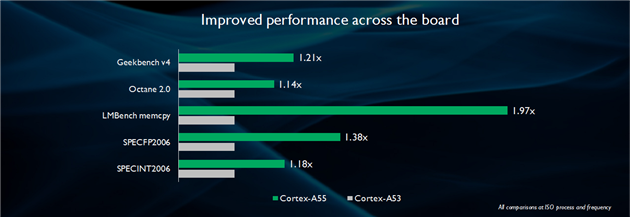

--

# arm架构发展历史

ARM架构是一种RISC（精简指令集计算机）架构，它在过去几十年中经历了以下主要的发展阶段：

1. **ARMv1（1985年）**：ARM架构的首个版本，由Acorn Computers开发。ARMv1是一个32位的架构，用于Acorn的个人电脑系列。

2. **ARMv2（1986年）**：ARMv2引入了对高级数据处理（例如乘法和除法）的支持，同时改进了存储器管理单元（MMU）。

3. **ARMv3（1992年）**：ARMv3架构引入了Thumb指令集，这是一种16位的指令集，可以显著减小程序的存储空间，提高代码密度。

4. **ARMv4（1994年）**：ARMv4架构引入了Jazelle技术，它允许在ARM处理器上直接执行Java字节码。

5. **ARMv5（1997年）**：ARMv5架构引入了增强的Thumb指令集（Thumb-2），它将16位指令和32位指令混合使用，提供了更高的性能和代码密度。

6. **ARMv6（2002年）**：ARMv6架构引入了ARM Cortex系列处理器，其中包括Cortex-A和Cortex-R系列。Cortex-A系列用于高性能应用处理器，而Cortex-R系列用于实时嵌入式系统。

7. **ARMv7（2004年）**：ARMv7架构引入了更高级的功能，如虚拟化支持和NEON SIMD（单指令多数据）扩展，提供了更好的图形和多媒体处理能力。

8. **ARMv8（2011年）**：ARMv8架构是ARM的64位架构，也被称为ARM64或AArch64。它增加了对64位寻址和64位数据处理的支持，提供了更大的内存寻址空间和更高的性能。

9. **ARMv9（2021年）**：ARMv9架构是ARM的最新版本，引入了许多新功能和改进，包括对机器学习、安全性和虚拟化的增强支持。

这些是ARM架构的主要发展阶段，每个新版本都引入了新的功能和改进，提高了性能、能效和功能扩展。ARM架构在移动设备、嵌入式系统和服务器等领域得到广泛应用，并成为了世界上最流行的处理器架构之一。

# aapcs-linux和lp64

```
config BR2_GCC_TARGET_ABI
	default "aapcs-linux"	if BR2_arm || BR2_armeb
	default "lp64"		if BR2_aarch64 || BR2_aarch64_be

```


看buildroot里，配置为arm时：

```
BR2_GCC_TARGET_ABI="aapcs-linux"
```

配置为aarch64时

```
BR2_GCC_TARGET_ABI="lp64"
```

"AAPCS-linux" 和 "LP64" 分别涉及到两个不同的概念，与 ARM 架构和数据模型相关。

### AAPCS-linux (ARM Architecture Procedure Call Standard for Linux)

AAPCS-linux 是 ARM 架构下专门为 Linux 系统定义的过程调用标准。这个标准规定了在 ARM Linux 操作系统中函数调用的规则，包括寄存器的使用、参数传递、栈的处理等。ARM 处理器在不同的操作系统上可能有不同的调用约定，而 AAPCS-linux 就是专门为 Linux 系统定义的调用约定。

### LP64 (Long, Pointer 64)

LP64 是一种数据模型，其中 long 类型和指针（pointer）都占用 64 位。在这种模型中，int 类型通常是 32 位。这个模型主要在 64 位操作系统上使用，例如在大多数现代的 64 位 UNIX 系统上，如 Linux、macOS 和 Solaris。

==在 LP64 数据模型中：==

- ==`int` 类型是 32 位。==
- ==`long` 类型和指针（包括函数指针）都是 64 位。==
- ==`long long` 类型是 64 位。==

**这样的设计使得数据模型更为一致，有助于简化编程，特别是在处理大内存和大文件时。**

在 ARM 架构中，LP64 数据模型通常与 64 位操作系统一起使用，而 AAPCS-linux 通常与 32 位操作系统（尤其是 Linux）一起使用。 ARM64（AArch64）架构通常使用 LP64 数据模型，而 ARM32 架构通常使用 AAPCS-linux 数据模型。

# arm处理器的fp和vfp区别

在 ARM 处理器中，FP（Floating Point，浮点）和 VFP（Vector Floating Point，矢量浮点）是与浮点运算相关的两种不同的扩展或架构。这两者的主要区别在于对浮点运算的支持程度和性能。

### FP（Floating Point）:

1. **FP 指令集：** 最初的 ARM 处理器只支持基本的浮点运算指令，这就是 FP（浮点）指令集。

2. **性能：** FP 指令集提供了有限的浮点运算能力，但在执行一些复杂的浮点运算时，性能可能较低。

3. **精度：** FP 指令集可能不支持一些高级的浮点运算和精确度要求更高的计算。

### VFP（Vector Floating Point）:

1. **VFP 指令集：** 随着对浮点运算需求的增加，ARM 引入了 VFP（矢量浮点）指令集，用于提供更丰富、更高性能的浮点运算支持。

2. **SIMD：** ==VFP 指令集引入了 SIMD（Single Instruction, Multiple Data）能力，可以同时对多个浮点数进行操作，提高了浮点运算的效率。==

3. **性能：** VFP 提供更强大的浮点运算性能，尤其在需要进行大量相似运算的场景中效果更为显著。

4. **精度：** VFP 支持更高的浮点精度和一些高级的浮点运算，使其更适用于科学计算等需要高精度浮点运算的领域。

在实际应用中，VFP 已经成为 ARM 处理器中的标准浮点单元，并且几乎所有的 ARM 处理器都支持 VFP ==指令集。==

==因此，一般而言，当提到 ARM 处理器的浮点运算时，通常是指 VFP 指令集。==

# A55和A53对比




Cortex-A55 支持ARMv8.1，并采用最新的 ARMv8.2 架构，并在其前代产品的基础上打造而成。它在性能方面突破了极限，**同时依旧保持了与 Cortex-A53 相同的功耗水平**。我们尽全力改进 Cortex-A53，并赋予其以下特性：

- 在相同的频率与工艺条件下，内存性能最高可达 Cortex-A53 的两倍
- 在相同的频率与工艺条件下，效能比 Cortex-A53 高 15%
- 扩展性比 Cortex-A53 高十倍以上


这些归功于我们专注于 Cortex-A53 现有的设计理念并挑战这些理念。

- 我们对分支预测程序（branch predictor)进行了全面修改，在其算法中融入了神经网络元素（neural network elements）来改进预测。此外还新增了零周期分支预测程序（Zero-cycle branch predictor）以便进一步减少流水线中的泡沫。这样可以使指令之间的空闲时间越来越短。

- private *Level 2* (L2) cache，使二级高速缓存对每一颗 CPU 而言都是专用 **private**缓存，这样一来与 Cortex-A53 相比，二级高速缓存的存取时间缩短了 50% 以上。我们还将二级高速缓存的工作频率设计成与 CPU 相同的频率。通过降低延迟大幅提升 CPU 在各类基准测试工具中的性能。

- 我们推出了三级高速缓存，可供集群（cluster）内的所有 Cortex-A55 CPU 共享。这让 DynamIQ 集群能够得益于 CPU 附近增多的内存容量（enhanced memory capacity），从而提升性能、降低系统功率。三级高速缓存是 DynamIQ 共享单元 (DynamIQ Shared Unit ，DSU) 的一部分，DSU 是 [DynamIQ 处理器](https://developer.arm.com/technologies/dynamiq?utm_source=Community&utm_medium=Launch blog&utm_campaign=Cortex-A55&utm_content=DynamIQ)中的一个新的功能单元。

- 8 位整数矩阵乘法对神经网络性能的影响超过85%。Cortex-A55 [NEON](https://developer.arm.com/technologies/neon?utm_source=Community&utm_medium=Launch blog&utm_campaign=Cortex-A55&utm_content=NEON) 流水线中增添了新的架构指令，使其能够在每个周期执行 16 次 8 位整数运算。这些新的指令还使该 CPU 能够在每个周期执行 8 次 16 位浮点运算、对两条 MAC 指令进行舍入操作，有利于色彩空间转换。

## 为什么我编译的基于cortex A55的程序比基于cortex A53的程序运行效率还差？

性能差异可能是由多种因素引起的，而且在比较两个程序的性能时，需要考虑多个因素。以下是一些可能的原因：

1. **编译器优化：** 使用不同的编译器选项和优化级别可能会影响生成的代码质量。确保针对不同架构使用了适当的优化选项，以充分利用目标架构的特性。

2. **指令集使用：** Cortex-A55 和 Cortex-A53 架构支持的指令集可能有所不同。确保你的程序能够利用目标架构的优势，例如使用 NEON 指令集进行 SIMD 并行计算。

3. **内存访问模式：** 不同的架构可能对内存访问模式有不同的响应。优化内存访问模式以适应目标架构的特性可能对性能有显著影响。

4. **编译器选项：** 某些编译器选项可能会影响生成的代码，例如启用或禁用优化、调整对齐方式等。检查编译器选项，确保它们与目标架构相匹配。

5. **程序特性：** 如果程序本身具有架构相关的特性，例如对某些硬件特性的依赖，那么在不同的架构上可能表现不同。

6. **工作负载：** 不同的应用负载可能对不同架构的性能产生不同的影响。确保你的性能测试考虑到了实际应用的要求。

7. **系统配置：** 如果两个程序在不同的硬件平台上运行，硬件配置的不同也可能导致性能差异。例如，内存速度、缓存大小等因素都可能对性能产生影响。

在调试性能差异时，建议使用性能分析工具来深入了解程序的瓶颈和性能瓶颈所在。这些工具可以帮助你确定在不同架构上程序的性能瓶颈，并优化代码以适应目标架构。

## 可以从生成的可执行文件看出使用了哪些编译选项吗？

在生成的可执行文件中通常无法直接查看使用的具体编译选项。编译选项是编译器在编译源代码时使用的命令行参数，它们用于配置编译过程中的行为，例如优化级别、目标架构、调试信息等。

然而，你可以通过一些方法来获取有关编译选项的信息：

1. **查看符号表信息：** 你可以使用 `nm` 命令查看可执行文件的符号表信息。这可能包含一些关于编译选项的信息，尽管它可能不是非常详细或易读。例如：

    ```bash
    nm -C -S your_executable
    ```

    `-C` 参数表示对符号进行 demangling，`-S` 参数表示显示段的大小。

2. **查看编译时产生的文件：** 编译器通常会生成一些中间文件，例如汇编代码、目标文件等。你可以查看这些文件来获取更多关于编译选项的信息。在编译过程中，查找生成的 `.o` 或 `.s` 文件，然后查看这些文件中的注释或头部信息。

3. **使用反汇编工具：** 使用反汇编工具（例如 `objdump`）可以查看可执行文件的汇编代码。尽管这可能不会直接显示编译选项，但你可以通过查看汇编代码来猜测一些优化等级或目标架构的信息。

    ```bash
    objdump -d your_executable
    ```

请注意，这些方法提供的信息可能有限，而且并不总是能够完全反映所有编译选项。如果你需要详细的编译选项信息，最好查看编译时生成的构建日志或 Makefile，这些信息通常会在构建过程中记录。


## 怎么查看编译的arm程序是否使用了neon指令和硬浮点

要查看编译的 ARM 程序是否使用了 NEON 指令和硬浮点，可以通过以下几种方式：

1. **反汇编检查：** 使用反汇编工具，如 `objdump`，来查看程序的汇编代码。NEON 指令和硬浮点指令通常会以特定的模式出现。例如，NEON 指令通常以 "v" 开头，而硬浮点指令可能涉及到 `vfp`（浮点运算处理器）等。以下是示例命令：

    ```bash
    objdump -d your_executable
    ```

    在输出中搜索 NEON 或 VFP 相关的指令，以确定是否使用了这些特性。

2. **使用 `readelf` 工具：** 使用 `readelf` 工具查看程序的 ELF 头信息。以下是示例命令：

    ```bash
    readelf -A your_executable
    ```

    在输出中查找包含 `Tag_ABI_VFP_args` 或 `Tag_ABI_HardFP_use` 等标签的信息，这些标签指示是否启用了硬浮点。

3. **查看编译选项和目标架构：** 检查程序的编译选项和目标架构，以确保使用了 NEON 和硬浮点。可以通过查看编译过程的构建日志或 Makefile，以及使用 `nm` 命令查看符号表信息。

    ```bash
    nm -C -S your_executable
    ```

请注意，这些方法提供的信息可能会因编译器版本和具体代码而有所不同。如果你有访问源代码的权限，还可以检查代码中是否有直接使用 NEON 指令的部分。


参考资料

1、

https://blog.csdn.net/luolaihua2018/article/details/128893285