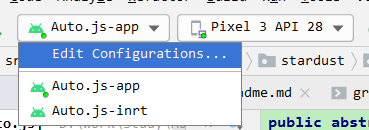

1

直接从github把最新的代码clone到本地。

Android Studio打开工程。

点击build，构建可能出错，提示junit找不到。

网上搜索方法是，点击File -- 清空缓存，重启Android Studio。

再build。成功。

工程里有2个可以运行的东西。



选择Auto.js-app

在模拟器运行。

正常。

如果碰到错误，只需要搜索一下对应的错误，网上都可以找到解决办法。

代码是没有问题的。

这个版本的的版本号是：

```
{
  "appVersionCode": 461,
  "appVersionName": "4.1.1 Alpha2",
  "target": 28,
  "mini": 17,
  "compile": 28,
  "buildTool": "28.0.3"
}
```

看提交记录，是从2017年开始的项目。


参考资料

1、

