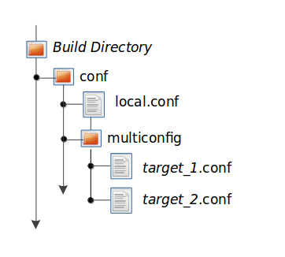

--

https://docs.yoctoproject.org/bitbake/2.6/bitbake-user-manual/bitbake-user-manual-intro.html

把这个手册总结一下。

# overview

## 介绍

从根本上来说，BitBake 是一个通用任务执行引擎，

允许 shell 和 Python 任务在复杂的任务间依赖约束下高效并行运行。 

BitBake 的主要用户之一 OpenEmbedded 采用该核心并使用面向任务的方法构建嵌入式 Linux 软件堆栈。

从概念上讲，BitBake 在某些方面与 GNU Make 类似，但也有显着差异：

- BitBake 根据提供的构建任务的元数据执行任务。元数据存储在配方 (.bb) 和相关配方“追加”(.bbappend) 文件、配置 (.conf) 和底层包含 (.inc) 文件以及类 (.bbclass) 文件中。元数据为 BitBake 提供有关要运行哪些任务以及这些任务之间的依赖关系的说明。
- BitBake 包含一个fetcher库，用于从各种位置（例如本地文件、源控制系统或网站）获取源代码。
- 要构建的每个单元（例如一个软件）的指令称为“配方”文件，包含有关该单元的所有信息（依赖项、源文件位置、校验和、描述等）。
- BitBake 包含客户端/服务器抽象，可以从命令行使用，也可以作为 XML-RPC 上的服务使用，并且具有多种不同的用户界面。

## 历史和目标

BitBake 最初是 OpenEmbedded 项目的一部分。

它的灵感来自于 Gentoo Linux 发行版使用的 Portage 包管理系统。 

2004 年 12 月 7 日，OpenEmbedded 项目团队成员 Chris Larson 将项目分为两个不同的部分：

- BitBake，通用任务执行器
- OpenEmbedded，BitBake 使用的元数据集

如今，BitBake 是 OpenEmbedded 项目的主要基础，

该项目用于构建和维护 Linux 发行版，例如在 Yocto 项目下开发的 Poky Reference Distribution。

在 BitBake 之前，没有其他构建工具能够充分满足有抱负的嵌入式 Linux 发行版的需求。

传统桌面 Linux 发行版使用的所有构建系统都缺乏重要的功能，

==并且嵌入式领域中流行的基于 Buildroot 的临时系统都不是可扩展或可维护的。==


BitBake 的一些重要的原始目标是：

- 处理交叉编译。
- 处理包间依赖关系（目标架构上的构建时间、本机架构上的构建时间和运行时）。
- 支持在给定包中运行任意数量的任务，包括但不限于获取上游源、解压它们、修补它们、配置它们等等。
- 对于构建系统和目标系统来说，Linux 发行版都是不可知的。
- 与架构无关。
- 支持多种构建和目标操作系统（例如 Cygwin、BSD 等）。
- 是独立的，而不是紧密集成到构建机器的根文件系统中。
- 处理目标架构、操作系统、发行版和机器上的条件元数据。
- 易于使用工具来提供要操作的本地元数据和包。
- 可以轻松地使用 BitBake 在多个项目之间进行协作以进行构建。
- 提供继承机制以在许多包之间共享公共元数据。


随着时间的推移，很明显需要一些进一步的要求：

- 处理基本配方的变体（例如本机、sdk 和 multilib）。
- 将元数据拆分为图层，并允许图层增强或覆盖其他图层。
- ==允许将任务的一组给定输入变量表示为校验和==。基于该校验和，允许使用预构建组件加速构建。

## 概念

BitBake 是一个用Python 语言编写的程序。

在最高级别，BitBake 解释元数据，决定需要运行哪些任务，并执行这些任务。

与 GNU Make 类似，BitBake 控制软件的构建方式。 

GNU Make通过“makefiles”来实现控制，而BitBake则使用“recipes”。

BitBake 通过允许定义更复杂的任务（例如组装整个嵌入式 Linux 发行版）来扩展 GNU Make 等简单工具的功能。

本节的其余部分介绍了几个应该理解的概念，以便更好地利用 BitBake 的强大功能。

### recipe

BitBake Recipes 由文件扩展名 .bb 表示，是最基本的元数据文件。

这些配方文件为 BitBake 提供以下内容：

- 有关包的描述性信息（作者、主页、许可证等）
- recipe的版本
- 现有依赖项（构建和运行时依赖项）
- 源代码所在的位置以及如何获取它
- 源代码是否需要任何补丁、在哪里可以找到它们以及如何应用它们
- 如何配置和编译源代码
- 如何将生成的工件组装到一个或多个可安装包中
- 在目标计算机上安装一个或多个创建的包的位置


在 BitBake 或使用 BitBake 作为其构建系统的任何项目的上下文中，具有 .bb 扩展名的文件称为配方。

### conf文件

配置文件以 .conf 扩展名表示，

定义了管理项目构建过程的各种配置变量。

这些文件分为几个区域，

定义机器配置、分发配置、可能的编译器调整、通用配置和用户配置。

主要配置文件是示例 bitbake.conf 文件，该文件位于 BitBake 源代码树 conf 目录中。

### class

类文件以 .bbclass 扩展名表示，

包含可在元数据文件之间共享的有用信息。 

BitBake 源代码树当前附带一个名为 base.bbclass 的类元数据文件。

您可以在类目录中找到该文件。 

==base.bbclass 类文件很特殊，因为它始终自动包含在所有配方和类中。==

此类包含标准基本任务的定义，

例如获取、解包、配置（默认为空）、==编译（运行任何存在的 Makefile）==、安装（默认为空）和打包（默认为空）。

这些任务通常会被项目开发过程中添加的其他类覆盖或扩展。

### layer

层允许您将不同类型的自定义彼此隔离。

虽然您可能会发现在处理单个项目时将所有内容保留在一层中很诱人，但元数据越模块化，就越容易应对未来的变化。

为了说明如何使用层来保持模块化，请考虑您可能进行的自定义以支持特定的目标计算机。

这些类型的定制通常驻留在特殊层中，而不是通用层中，称为板支持包（BSP）层。

此外，例如，机器定制应与支持新 GUI 环境的配方和元数据隔离。

这种情况为您提供了几层：

一层用于机器配置，一层用于 GUI 环境。

然而，重要的是要理解，BSP 层仍然可以对 GUI 环境层内的配方进行特定于机器的添加，而不会因这些特定于机器的更改而污染 GUI 层本身。

您可以通过 BitBake 追加 (.bbappend) 文件形式的配方来完成此操作。

### append文件

追加文件是具有 .bbappend 文件扩展名的文件，可扩展或覆盖现有配方文件中的信息。

BitBake 期望每个附加文件都有一个相应的配方文件。

此外，附加文件和相应的配方文件必须使用相同的根文件名。

文件名仅在所使用的文件类型后缀方面有所不同（例如 formfactor_0.0.bb 和 formfactor_0.0.bbappend）。

附加文件中的信息扩展或覆盖底层、名称类似的配方文件中的信息。

命名附加文件时，可以使用“%”通配符来匹配配方名称。

例如，假设您有一个名为如下的附加文件：

```
busybox_1.21.%.bbappend
```

该附加文件将与配方的任何 busybox_1.21.x.bb 版本匹配。

因此，附加文件将匹配以下配方名称：

```
busybox_1.21.1.bb
busybox_1.21.2.bb
busybox_1.21.3.bb
```

> “%”字符的使用受到限制，因为它只能直接用在附加文件名称的 .bbappend 部分前面。您不能在名称的任何其他位置使用通配符。

## 获取bitbake

不管这个。

## bitbake命令

bitbake 命令是 BitBake 工具的主要接口。本节介绍 BitBake 命令语法并提供几个执行示例。

### 用法和语法

bitbake -h查看

### 示例

#### 在一个recipe上执行一个task

执行单个配方文件的任务相对简单。

您指定需要的文件，BitBake 会解析它并执行指定的任务。

如果您没有指定任务，BitBake 将执行默认任务，即“build”。

这样做时，BitBake 遵循任务间依赖性。

以下命令在 foo_1.0.bb 配方文件上运行构建任务，这是默认任务：

```
$ bitbake -b foo_1.0.bb
```

```
$ bitbake -b foo.bb -c clean
```

“-b”选项明确不处理配方依赖性。除了用于调试目的之外，建议您使用下一节中介绍的语法

#### 在多个recipes上执行一组tasks

当想要管理多个 .bb 文件时，会带来许多额外的复杂性。

显然，需要有一种方法来告诉 BitBake 哪些文件可用，以及您想要执行哪些文件。

每个配方还需要有一种方法来表达其依赖关系，

无论是构建时还是运行时。

当多个配方提供相同的功能，或者当配方有多个版本时，必须有一种方法可以让您表达配方偏好。

bitbake 命令在不使用“--buildfile”或“-b”时仅接受“PROVIDES”。

你无法提供任何其他东西。

默认情况下，配方文件通常“提供”其“包名称”，如下例所示：

```
$ bitbake foo
```

#### 执行一组recipe和task的组合

当您指定多个目标时，BitBake 命令行支持为各个目标指定不同的任务。

例如，假设您有两个目标（或菜谱）myfirstrecipe 和 mysecondrecipe，

并且您需要 BitBake 为第一个菜谱运行任务 A，为第二个菜谱运行任务 B：

```
$ bitbake myfirstrecipe:do_taskA mysecondrecipe:do_taskB
```

#### 生成依赖图

BitBake 能够使用dot语法生成依赖图。

您可以使用 Graphviz 的dot工具将这些图形转换为图像。

当您生成依赖关系图时，BitBake 会将两个文件写入当前工作目录：

- task-depends.dot：显示任务之间的依赖关系。这些依赖项与 BitBake 的内部任务执行列表相匹配。
- pn-buildlist：显示要构建的目标的简单列表。

要停止依赖于常见的依赖项，请使用 -I dependent 选项，

BitBake 会从图表中忽略它们。

忽略此信息可以生成更易读的图表。

这样，您可以从图表中删除 DEPENDS 来自继承类（例如 base.bbclass）。

以下是创建依赖图的两个示例。

第二个示例从图中省略了 OpenEmbedded 中常见的依赖项：

```
$ bitbake -g foo

$ bitbake -g -I virtual/kernel -I eglibc foo
```

#### 进行一次multiconfig的build

BitBake 能够使用单个命令构建多个图像或包，

其中不同的目标需要不同的配置（多个配置构建）。

在这种情况下，每个目标都称为“多重配置”。

要完成多配置构建，您必须使用构建目录中的并行配置文件单独定义每个目标的配置。

这些多重配置配置文件的位置是特定的。

它们必须驻留在当前构建目录中名为 multiconfig 的 conf 子目录中。

以下是两个单独目标的示例：



之所以需要这种文件层次结构，是因为在解析各层之前不会构建 BBPATH 变量。

因此，除非配置文件位于当前工作目录中，否则不可能将其用作预配置文件。

至少，每个配置文件必须定义机器和 BitBake 用于构建的临时目录。

建议的做法是不要与构建期间使用的临时目录重叠。

除了每个目标的单独配置文件之外，您还必须启用 BitBake 来执行多个配置构建。

通过在 local.conf 配置文件中设置 BBMULTICONFIG 变量来完成启用。

例如，假设您在构建目录中定义了 target1 和 target2 的配置文件。 

local.conf 文件中的以下语句既使 BitBake 能够执行多个配置构建，又指定两个额外的多重配置：

```
BBMULTICONFIG = "target1 target2"
```

一旦目标配置文件就位并且 BitBake 已启用以执行多个配置构建，请使用以下命令形式启动构建：

```
$ bitbake [mc:multiconfigname:]target [[[mc:multiconfigname:]target] ... ]
```

以下是两个额外多重配置的示例：target1 和 target2：

```
$ bitbake mc::target mc:target1:target mc:target2:target
```

#### 使能multiconfig build依赖

有时，多配置构建中的目标（多重配置）之间可能存在依赖关系。

例如，假设为了构建特定架构的映像，需要存在针对不同架构的另一个构建的根文件系统。

换句话说，第一个多重配置的映像取决于第二个多重配置的根文件系统。

这种依赖性本质上是构建一个多重配置的配方中的任务依赖于构建另一个多重配置的配方中的任务的完成。

要在多配置构建中启用依赖项，您必须使用以下语句形式在配方中声明依赖项：

```
task_or_package[mcdepends] = "mc:from_multiconfig:to_multiconfig:recipe_name:task_on_which_to_depend"
```

为了更好地展示如何使用此语句，请考虑具有两个多重配置的示例：target1 和 target2：

```
image_task[mcdepends] = "mc:target1:target2:image2:rootfs_task"
```

在此示例中，from_multiconfig 是“target1”，to_multiconfig 是“target2”。

配方包含 image_task 的映像所执行的任务取决于用于构建 image2 的 rootfs_task 的完成情况，该任务与“target2”多重配置关联。

设置此依赖项后，您可以使用 BitBake 命令构建“target1”多重配置，如下所示：

```
$ bitbake mc:target1:image1
```

此命令执行为“target1”多重配置创建 image1 所需的所有任务。

由于依赖性，BitBake 还通过 rootfs_task 执行“target2”多重配置构建。

让配方依赖于另一个版本的根文件系统可能看起来没那么有用。

考虑对 image1 配方中的语句进行以下更改：

```
image_task[mcdepends] = "mc:target1:target2:image2:image_task"
```

在这种情况下，BitBake 必须为“target2”构建创建 image2，因为“target1”构建依赖于它。

由于“target1”和“target2”针对多个配置构建启用，并且具有单独的配置文件，因此 BitBake 将每个构建的工件放置在各自的临时构建目录中。

# execution

运行 BitBake 的主要目的是生成某种输出，

例如单个可安装包、内核、软件开发工具包，

甚至是完整的、特定于板的可引导 Linux 映像，

包括引导加载程序、内核和根文件系统。

当然，您可以使用选项来执行 bitbake 命令，使其执行单个任务、编译单个配方文件、捕获或清除数据，或者只是返回有关执行环境的信息。

本章介绍了使用 BitBake 创建镜像时从头到尾的执行过程。

使用以下命令形式启动执行过程：

```
$ bitbake target
```

## 解析基础conf元数据

BitBake 做的第一件事是解析基本配置元数据。

基本配置元数据包含：

- 项目的 bblayers.conf 文件（用于确定 BitBake 需要识别哪些层）、
- 所有必要的 layer.conf 文件（每层一个）和 
- bitbake.conf。

数据本身有多种类型：

配方：有关特定软件的详细信息。

类数据：公共构建信息的抽象（例如如何构建 Linux 内核）。

配置数据：特定于机器的设置、策略决策等。配置数据充当将所有内容粘合在一起的粘合剂。


**Layer.conf 文件用于构造 BBPATH 和 BBFILES 等关键变量。** 

BBPATH 用于分别搜索conf 和classes 目录下的配置文件和类文件。 

BBFILES 用于定位配方和配方附加文件（.bb 和 .bbappend）。

==如果没有 bblayers.conf 文件，则假定用户直接在环境中设置了 BBPATH 和 BBFILES。==

接下来，使用刚刚构建的 BBPATH 变量来定位 bitbake.conf 文件。 

bitbake.conf 文件还可以使用 include 或 require 指令包含其他配置文件。


在解析配置文件之前，BitBake 会查看某些变量，包括：

- BB_ENV_PASSTHROUGH
- BB_ENV_PASSTHROUGH_ADDITIONS
- BB_PRESERVE_ENV
- BB_ORIGENV
- BITBAKE_UI

此列表中的前四个变量与 BitBake 在任务执行期间如何处理 shell 环境变量有关。

==默认情况下，BitBake 会清理环境变量并提供对 shell 执行环境的严格控制。==

但是，通过使用前四个变量，您可以对任务执行期间允许 BitBake 在 shell 中使用的环境变量进行控制。

请参阅“将信息传递到构建任务环境”部分以及变量术语表中有关这些变量的信息，

以获取有关它们如何工作以及如何使用它们的更多信息。


基本配置元数据是全局的，

因此会影响所有执行的配方和任务。

BitBake 首先在当前工作目录中搜索可选的 conf/bblayers.conf 配置文件。

该文件应包含 BBLAYERS 变量，该变量是一个以空格分隔的“层”目录列表。

回想一下，如果 BitBake 找不到 bblayers.conf 文件，则假定用户已直接在环境中设置 BBPATH 和 BBFILES 变量。


对于此列表中的每个目录（层），将定位并解析 conf/layer.conf 文件，并将 LAYERDIR 变量设置为找到该层的目录。

这个想法是这些文件自动为给定的构建目录正确设置 BBPATH 和其他变量。


然后 BitBake 期望在用户指定的 BBPATH 中的某个位置找到 conf/bitbake.conf 文件。

该配置文件通常具有包含指令来拉入任何其他元数据，

例如特定于体系结构、计算机、本地环境等的文件。


==BitBake .conf 文件中仅允许变量定义和包含指令。==

有些变量直接影响 BitBake 的行为。

这些变量可能是从环境中设置的，具体取决于前面提到的或配置文件中设置的环境变量。 

“变量术语表”一章提供了完整的变量列表。


**解析配置文件后，BitBake使用其基本的继承机制，即通过类文件来继承一些标准类。**

**当遇到负责获取该类的继承指令时，BitBake 会解析该类。**


始终包含 base.bbclass 文件。

还包括使用 INHERIT 变量在配置中指定的其他类。 

BitBake以与配置文件相同的方式在BBPATH中的路径下的classes子目录中搜索类文件。

了解执行环境中使用的配置文件和类文件的一个好方法是运行以下 BitBake 命令：

```
$ bitbake -e > mybb.log
```

检查 mybb.log 的顶部会显示执行环境中使用的许多配置文件和类文件。


您需要了解 BitBake 如何解析花括号。

如果配方在函数内使用右大括号并且字符没有前导空格，则 BitBake 会产生解析错误。

如果在 shell 函数中使用一对大括号，则右大括号不得位于没有前导空格的行的开头。

以下是导致 BitBake 产生解析错误的示例：

```
fakeroot create_shar() {
   cat << "EOF" > ${SDK_DEPLOY}/${TOOLCHAIN_OUTPUTNAME}.sh
usage()
{
   echo "test"
   ######  The following "}" at the start of the line causes a parsing error ######
}
EOF
}

Writing the recipe this way avoids the error:
fakeroot create_shar() {
   cat << "EOF" > ${SDK_DEPLOY}/${TOOLCHAIN_OUTPUTNAME}.sh
usage()
{
   echo "test"
   ###### The following "}" with a leading space at the start of the line avoids the error ######
 }
EOF
}
```

## 定位和解析recipe

在配置阶段，BitBake 将设置 BBFILES。 

BitBake 现在使用它来构建要解析的配方列表，

以及要应用的任何附加文件 (.bbappend)。 

BBFILES 是可用文件的空格分隔列表，并支持通配符。

一个例子是：

```
BBFILES = "/path/to/bbfiles/*.bb /path/to/appends/*.bbappend"
```

BitBake 解析位于 BBFILES 中的每个配方和附加文件，并将各种变量的值存储到数据存储中。

==追加文件按照它们在 BBFILES 中遇到的顺序应用。==


对于每个文件，都会创建基本配置的新副本，然后逐行解析配方。

任何继承语句都会导致 BitBake 使用 BBPATH 作为搜索路径查找并解析类文件 (.bbclass)。

最后，BitBake 按顺序解析 BBFILES 中找到的任何附加文件。

==一种常见的约定是使用配方文件名来定义元数据片段。==

例如，在 bitbake.conf 中，配方名称和版本用于设置变量 PN 和 PV：

```
PN = "${@bb.parse.vars_from_file(d.getVar('FILE', False),d)[0] or 'defaultpkgname'}"
PV = "${@bb.parse.vars_from_file(d.getVar('FILE', False),d)[1] or '1.0'}"
```

在此示例中，名为“something_1.2.3.bb”的配方会将 PN 设置为“something”，将 PV 设置为“1.2.3”。

当配方解析完成时，BitBake 拥有配方定义的任务列表和一组由键和值组成的数据以及有关任务的依赖信息。

==BitBake 不需要所有这些信息。==

==它只需要一小部分信息就可以做出有关配方的决策。==

因此，BitBake 会缓存它感兴趣的值，并且不会存储其余信息。

==经验表明，重新解析元数据比尝试将其写入磁盘然后重新加载要快。==


如果可能，后续 BitBake 命令会重用此配方信息缓存。

该缓存的有效性是通过首先计算基本配置数据的校验和（请参阅 BB_HASHCONFIG_IGNORE_VARS）然后检查校验和是否匹配来确定的。

==如果该校验和与缓存中的内容匹配，并且配方和类文件未更改，则 BitBake 能够使用缓存。==

然后，BitBake 重新加载有关配方的缓存信息，而不是从头开始重新解析。

配方文件集合的存在是为了允许用户拥有多个包含相同包的 .bb 文件存储库。

例如，人们可以轻松地使用它们来制作自己的上游存储库的本地副本，但进行了不需要上游的自定义修改。

这是一个例子：

```
BBFILES = "/stuff/openembedded/*/*.bb /stuff/openembedded.modified/*/*.bb"
BBFILE_COLLECTIONS = "upstream local"
BBFILE_PATTERN_upstream = "^/stuff/openembedded/"
BBFILE_PATTERN_local = "^/stuff/openembedded.modified/"
BBFILE_PRIORITY_upstream = "5"
BBFILE_PRIORITY_local = "10"
```

层机制现在是收集代码的首选方法。

**虽然集合代码仍然存在，但其主要用途是设置层优先级并处理层之间的重叠（冲突）。**

## provider

假设 BitBake 已被指示执行目标并且所有配方文件均已解析，BitBake 开始弄清楚如何构建目标。 

BitBake 查看每个食谱的 PROVIDES 列表。 

PROVIDES 列表是可以得知配方的名称列表。

每个配方的 PROVIDES 列表是通过配方的 PN 变量隐式创建的，并通过配方的 PROVIDES 变量显式创建的，该变量是可选的。

==当配方使用 PROVIDES 时，可以在隐式 PN 名称之外的一个或多个替代名称下找到该配方的功能。==

例如，假设名为keyboard_1.0.bb 的配方包含以下内容：

```
PROVIDES += "fullkeyboard"
```

此配方的 PROVIDES 列表变为“keyboard”（隐式）和“fullkeyboard”（显式）。

因此，keyboard_1.0.bb 中的功能可以在两个不同的名称下找到。

## preference优先选择

PROVIDES 列表只是找出目标配方的解决方案的一部分。

由于目标可能有多个提供商，BitBake 需要通过确定提供商偏好来确定提供商的优先级。

目标具有多个提供程序的一个常见示例是“virtual/kernel”，

它位于每个内核配方的提供列表中。

每台机器通常通过在机器配置文件中使用类似于以下内容的行来选择最佳的内核提供程序：

```
PREFERRED_PROVIDER_virtual/kernel = "linux-yocto"
```

默认的 PREFERRED_PROVIDER 是与目标同名的提供者。 

BitBake 会迭代构建所需的每个目标，并使用此过程解析它们及其依赖项。

由于给定提供程序可能存在多个版本，因此了解如何选择提供程序变得很复杂。 

BitBake 默认使用Provider的最高版本。

版本比较采用与 Debian 相同的方法。

您可以使用 PREFERRED_VERSION 变量来指定特定版本。

您可以使用 DEFAULT_PREFERENCE 变量来影响顺序。


默认情况下，文件的首选项为“0”。

将 DEFAULT_PREFERENCE 设置为“-1”会使配方不太可能被使用，除非明确引用它。

将 DEFAULT_PREFERENCE 设置为“1”可能会使用该配方。 

PREFERRED_VERSION 会覆盖任何 DEFAULT_PREFERENCE 设置。 

==DEFAULT_PREFERENCE 通常用于标记更新且更具实验性的配方版本，直到它们经过足够的测试才被认为是稳定的。==


当给定配方有多个“版本”时，BitBake 默认选择最新版本，除非另有说明。

如果相关配方的 DEFAULT_PREFERENCE 设置低于其他配方（默认值为 0），则不会选择该配方。

这允许维护配方文件存储库的一个或多个人员指定他们对默认选定版本的偏好。

此外，用户可以指定他们的首选版本。


如果第一个配方名为 a_1.1.bb，则 PN 变量将设置为“a”，PV 变量将设置为 1.1。

因此，如果存在名为 a_1.2.bb 的配方，BitBake 将默认选择 1.2。

但是，如果您在 BitBake 解析的 .conf 文件中定义以下变量，则可以更改该首选项：

```
PREFERRED_VERSION_a = "1.1"
```


==配方通常提供两个版本——一个稳定的、编号的（首选）版本，以及一个从源代码存储库自动签出的版本，该版本被认为更“前沿”，但只能显式选择。==

例如，在 OpenEmbedded 代码库中，

BusyBox 有一个标准的版本化配方文件 busybox_1.22.1.bb，

但也有一个基于 Git 的版本 busybox_git.bb，

其中明确包含以下行

```
DEFAULT_PREFERENCE = "-1"
```

确保编号稳定的版本始终是首选，除非开发人员另有选择。

## 依赖

每个目标 BitBake 构建都包含多个任务，

例如获取、解包、修补、配置和编译。

==为了在多核系统上获得最佳性能，BitBake 将每个任务视为具有自己的依赖集的独立实体。==

依赖关系是通过几个变量定义的。

您可以在本手册末尾附近的变量术语表中找到有关 BitBake 使用的变量的信息。

==在基础层面上，知道 BitBake 在计算依赖关系时使用 DEPENDS 和 RDEPENDS 变量就足够了。==

有关 BitBake 如何处理依赖关系的更多信息，请参阅依赖关系部分。

## task list

根据生成的提供程序列表和依赖项信息，

BitBake 现在可以准确计算需要运行哪些任务以及运行这些任务的顺序。

执行任务部分提供了有关 BitBake 如何选择下一步执行哪个任务的更多信息。

现在，构建从 BitBake 分叉线程开始，直至达到 BB_NUMBER_THREADS 变量中设置的限制。

只要有任务准备运行、这些任务满足其所有依赖关系并且尚未超过线程阈值，BitBake 就会继续分叉线程。

值得注意的是，通过正确设置 BB_NUMBER_THREADS 变量可以大大加快构建时间。

==每个任务完成时，时间戳都会写入 STAMP 变量指定的目录中。==

在后续运行中，BitBake 会在 tmp/stamps 内的构建目录中查找，并且不会重新运行已完成的任务，除非发现时间戳无效。

目前，仅在每个配方文件的基础上考虑无效时间戳。

==因此，例如，如果配置标记的时间戳大于给定目标的编译时间戳，则编译任务将重新运行。==

但是，再次运行编译任务不会对依赖于该目标的其他提供程序产生任何影响。


Timestamp的确切格式是部分可配置的。

在 BitBake 的现代版本中，哈希值会附加到标记中，

这样，如果配置发生更改，标记就会失效，并且任务会自动重新运行。

此哈希值或使用的签名由配置的签名策略控制（有关信息，请参阅校验和（签名）部分）。

还可以使用 [stamp-extra-info] 任务标志将额外的元数据附加到标记。

例如，OpenEmbedded 使用此标志来使某些任务特定于机器。


==有些任务被标记为“nostamp”任务。运行这些任务时不会创建时间戳文件。因此，“nostamp”任务总是重新运行。==

## 执行task

任务可以是 shell 任务，也可以是 Python 任务。

`对于 shell 任务，BitBake 将 shell 脚本写入 ${T}/run.do_taskname.pid，然后执行该脚本。生成的 shell 脚本包含所有导出的变量，以及展开所有变量的 shell 函数。 shell 脚本的输出将转到文件 ${T}/log.do_taskname.pid。`

==查看运行文件中扩展的 shell 函数和日志文件中的输出是一种有用的调试技术。==

对于Python任务，BitBake在内部执行任务并将信息记录到控制终端。 

BitBake 的未来版本会将函数写入文件，类似于处理 shell 任务的方式。

日志记录的处理方式也与 shell 任务类似。

BitBake 运行任务的顺序由其任务调度程序控制。

可以配置调度程序并为特定用例定义自定义实现。

有关更多信息，请参阅控制行为的这些变量：

BB_SCHEDULER

BB_SCHEDULERS

可以让函数在任务的主函数之前和之后运行。

这是使用列出要运行的函数的任务的 [prefuncs] 和 [postfuncs] 标志来完成的。

## checksum

校验和是任务输入的唯一签名。

==任务的签名可用于确定是否需要运行任务。==

由于任务输入的变化会触发任务运行，

因此 BitBake 需要检测给定任务的所有输入。

对于 shell 任务，这相当容易，因为 BitBake 为每个任务生成一个“运行”shell 脚本，并且可以创建一个校验和，让您很好地了解任务数据何时发生变化。

为了使问题复杂化，有些东西不应该包含在校验和中。

首先，有给定任务的实际特定构建路径 - 工作目录。

工作目录是否更改并不重要，因为它不应该影响目标包的输出。

排除工作目录的简单方法是将其设置为某个固定值并为“运行”脚本创建校验和。 

BitBake 更进一步，使用 BB_BASEHASH_IGNORE_VARS 变量来定义生成签名时不应包含的变量列表。

另一个问题是由包含可能会或可能不会被调用的函数的“运行”脚本引起的。

增量构建解决方案包含计算 shell 函数之间依赖关系的代码。

该代码用于将“运行”脚本修剪到最小集，从而缓解此问题并使“运行”脚本更具可读性。


到目前为止我们已经有了针对 shell 脚本的解决方案。 

Python 任务怎么样？

即使这些任务更加困难，也可以采用相同的方法。

该过程需要弄清楚 Python 函数访问哪些变量以及调用哪些函数。

同样，增量构建解决方案包含的代码首先找出变量和函数依赖关系，然后为用作任务输入的数据创建校验和。

与工作目录的情况一样，存在应忽略依赖关系的情况。

对于这些情况，您可以使用如下所示的行指示构建过程忽略依赖项：

```
PACKAGE_ARCHS[vardepsexclude] = "MACHINE"
```

此示例确保 PACKAGE_ARCHS 变量不依赖于 MACHINE 的值，即使它确实引用了它。

同样，在某些情况下我们需要添加 BitBake 无法找到的依赖项。

您可以使用如下所示的行来完成此操作：

```
PACKAGE_ARCHS[vardeps] = "MACHINE"
```

此示例显式添加 MACHINE 变量作为 PACKAGE_ARCHS 的依赖项。

例如，考虑使用内联 Python 的情况，其中 BitBake 无法找出依赖关系。

当在调试模式下运行时（即使用 -DDD），

BitBake 在发现无法找出依赖关系的内容时会生成输出。


到目前为止，本节的讨论仅限于任务的直接输入。

基于直接输入的信息在代码中称为“basehash”。

然而，仍然存在任务的间接输入的问题——已经构建并存在于构建目录中的东西。

特定任务的校验和（或签名）需要添加该特定任务所依赖的所有任务的哈希值。

选择添加哪些依赖项是一个策略决定。

然而，效果是生成一个主校验和，该校验和结合了基本哈希和任务依赖项的哈希。


在代码级别，有多种方式可以影响基本哈希和相关任务哈希。

在 BitBake 配置文件中，我们可以为 BitBake 提供一些额外的信息来帮助它构建基本哈希。

以下语句有效地生成全局变量依赖性排除列表 - 从未包含在任何校验和中的变量。

此示例使用 OpenEmbedded 中的变量来帮助说明该概念：

```
BB_BASEHASH_IGNORE_VARS ?= "TMPDIR FILE PATH PWD BB_TASKHASH BBPATH DL_DIR \
    SSTATE_DIR THISDIR FILESEXTRAPATHS FILE_DIRNAME HOME LOGNAME SHELL \
    USER FILESPATH STAGING_DIR_HOST STAGING_DIR_TARGET COREBASE PRSERV_HOST \
    PRSERV_DUMPDIR PRSERV_DUMPFILE PRSERV_LOCKDOWN PARALLEL_MAKE \
    CCACHE_DIR EXTERNAL_TOOLCHAIN CCACHE CCACHE_DISABLE LICENSE_PATH SDKPKGSUFFIX"
```

前面的示例排除了工作目录，它是 TMPDIR 的一部分。

决定通过依赖链包含哪些依赖任务的哈希的规则更加复杂，

并且通常使用 Python 函数来完成。 

meta/lib/oe/sstatesig.py 中的代码显示了这方面的两个示例，

并且还说明了如何在需要时将自己的策略插入到系统中。

该文件定义了 OpenEmbedded-Core 使用的基本签名生成器：“OEBasicHash”。

==默认情况下，BitBake 中启用了一个虚拟的“noop”签名处理程序。==

这意味着行为与以前的版本相比没有变化。 

==OE-Core 通过 bitbake.conf 文件中的此设置默认使用“OEBasicHash”签名处理程序：==

```
BB_SIGNATURE_HANDLER ?= "OEBasicHash"
```


“OEBasicHash”BB_SIGNATURE_HANDLER 的主要功能是将任务哈希添加到标记文件中。

因此，任何元数据更改都会更改任务哈希，自动导致任务再次运行。

这消除了提高 PR 值的需要，并且元数据的更改会自动在整个构建中产生影响。

还值得注意的是，签名生成器的最终结果是为构建提供一些依赖项和哈希信息。

这些信息包括：

- BB_BASEHASH_task-taskname：配方中每个任务的基本哈希值。
- BB_BASEHASH_filename:taskname：每个相关任务的基本哈希值。
- BB_TASKHASH：当前正在运行的任务的哈希值。

值得注意的是，BitBake 的“-S”选项可以让您调试 BitBake 对签名的处理。

传递给 -S 的选项允许使用不同的调试模式，

可以使用 BitBake 自己的调试函数，

也可以使用元数据/签名处理程序本身中定义的调试函数。

最简单的参数是“none”，

它会导致一组签名信息被写入与指定目标相对应的 STAMPS_DIR 中。

当前另一个可用的参数是“printdiff”，

它会导致 BitBake 尝试建立最接近的签名匹配（例如在 sstate 缓存中），

然后对匹配运行 bitbake-diffsigs 以确定这两个标记树所在的标记和增量发散。

> BitBake 的未来版本可能会提供通过附加“-S”参数触发的其他签名处理程序。

## setscene

setscene 进程使 BitBake ==能够处理“预构建”工件。==

处理和重用这些工件的能力使 BitBake 不必每次都从头开始构建某些东西。

相反，如果可能，BitBake 可以使用现有的构建工件。

BitBake 需要有可靠的数据来指示工件是否兼容。

上一节中描述的签名提供了一种表示工件是否兼容的理想方式。

如果签名相同，则可以重复使用对象。

如果一个对象可以重用，那么问题就变成了如何用预构建的工件替换给定的任务或一组任务。 

BitBake 通过“setscene”流程解决了这个问题。

当 BitBake 被要求构建给定目标时，在构建任何内容之前，它首先询问缓存的信息是否可用于它正在构建的任何目标或任何中间目标。

如果缓存信息可用，BitBake 将使用此信息而不是运行主任务。

BitBake 首先使用 BB_HASHCHECK_FUNCTION 变量定义的函数以及要构建的任务列表和相应的哈希值来调用。

该函数设计得很快，并返回它认为可以获得工件的任务列表。


接下来，对于作为可能性返回的每个任务，BitBake 执行可能的工件所涵盖的任务的 setscene 版本。

任务的 Setscene 版本在任务名称后附加字符串“_setscene”。

例如，名为 xxx 的任务有一个名为 xxx_setscene 的 setscene 任务。

任务的 setscene 版本执行并提供返回成功或失败的必要工件。

如前所述，一个工件可以涵盖多个任务。

例如，如果您已经拥有已编译的二进制文件，那么获取编译器是没有意义的。

为了处理这个问题，BitBake 为每个成功的 setscene 任务调用 BB_SETSCENE_DEPVALID 函数，以了解是否需要获取该任务的依赖项。

您可以在任务校验和和 Setscene 部分找到有关 setscene 元数据的更多信息。

## log

除了用于控制执行时构建的详细程度的标准命令行选项之外，

bitbake 还支持通过 BB_LOGCONFIG 变量对 Python 日志记录工具进行用户定义的配置。

此变量定义 JSON 或 YAML 日志记录配置，该配置将智能地合并到默认配置中。

日志记录配置使用以下规则合并：

- 如果顶级键 bitbake_merge 设置为值 False，则用户定义的配置将完全替换默认配置。在这种情况下，所有其他规则都将被忽略。
- 用户配置必须具有顶级版本，该版本必须与默认配置的值匹配。
- 处理程序、格式化程序或过滤器中定义的任何键都将合并到默认配置中的同一部分，如果存在冲突，用户指定的键将替换默认键。实际上，这意味着如果默认配置和用户配置都指定了名为 myhandler 的处理程序，则用户定义的处理程序将替换默认配置。为了防止用户无意中替换默认处理程序、格式化程序或过滤器，所有默认处理程序、格式化程序或过滤器都以“BitBake”前缀命名。
- 如果用户定义记录器并将键 bitbake_merge 设置为 False，则该记录器将完全被用户配置替换。在这种情况下，没有其他规则将适用于该记录器。
- 给定记录器的所有用户定义的过滤器和处理程序属性将与默认记录器中的相应属性合并。例如，如果用户配置将名为 myFilter 的过滤器添加到 BitBake.SigGen，并且默认配置添加名为 BitBake.defaultFilter 的过滤器，则这两个过滤器都将应用于记录器

作为第一个示例，您可以创建一个 hashequiv.json 用户日志配置文件，

以将所有 VERBOSE 或更高优先级的哈希等价相关消息记录到名为 hashequiv.log 的文件中：

```
{
    "version": 1,
    "handlers": {
        "autobuilderlog": {
            "class": "logging.FileHandler",
            "formatter": "logfileFormatter",
            "level": "DEBUG",
            "filename": "hashequiv.log",
            "mode": "w"
        }
    },
    "formatters": {
            "logfileFormatter": {
                "format": "%(name)s: %(levelname)s: %(message)s"
            }
    },
    "loggers": {
        "BitBake.SigGen.HashEquiv": {
            "level": "VERBOSE",
            "handlers": ["autobuilderlog"]
        },
        "BitBake.RunQueue.HashEquiv": {
            "level": "VERBOSE",
            "handlers": ["autobuilderlog"]
        }
    }
}
```

然后在conf/local.conf中设置BB_LOGCONFIG变量：

```
BB_LOGCONFIG = "hashequiv.json"
```

另一个示例是这个 warn.json 文件，用于将所有警告和更高优先级的消息记录到 warn.log 文件中：

```
{
    "version": 1,
    "formatters": {
        "warnlogFormatter": {
            "()": "bb.msg.BBLogFormatter",
            "format": "%(levelname)s: %(message)s"
        }
    },

    "handlers": {
        "warnlog": {
            "class": "logging.FileHandler",
            "formatter": "warnlogFormatter",
            "level": "WARNING",
            "filename": "warn.log"
        }
    },

    "loggers": {
        "BitBake": {
            "handlers": ["warnlog"]
        }
    },

    "@disable_existing_loggers": false
}
```

请注意，BitBake 用于结构化日志记录的帮助程序类在 lib/bb/msg.py 中实现。

# syntax和operators

BitBake 文件有自己的语法。

该语法与其他几种语言有相似之处，但也有一些独特的功能。

本节介绍可用的语法和运算符并提供示例。

## 基础语法

本节提供一些基本语法示例。

### 基本变量设置

以下示例将 VARIABLE 设置为“value”。

该赋值在语句被解析时立即发生。

这是一项“hard”赋值。

```
VARIABLE = "value"
```

正如预期的那样，如果您在赋值中包含前导或尾随空格，则这些空格将被保留：

```
VARIABLE = " value"
VARIABLE = "value "
```

将 VARIABLE 设置为“”会将其设置为空字符串，而将变量设置为“ ”将其设置为空格（即，这些不是相同的值）。

```
VARIABLE = ""
VARIABLE = " "
```

设置变量值时可以使用单引号而不是双引号。

这样做允许您使用包含双引号字符的值：

```
VARIABLE = 'I have a " in my value'
```

> 与 Bourne shell 不同，单引号在所有其他方面的工作方式与双引号相同。它们不抑制变量扩展。

### 修改已经存在的变量

有时您需要修改现有变量。

在以下一些情况下，您可能会发现需要修改现有变量：

- 自定义使用该变量的配方。
- 更改 *.bbclass 文件中使用的变量的默认值。
- 更改 *.bbappend 文件中的变量以覆盖原始配方中的变量。
- 更改配置文件中的变量，以便该值覆盖现有配置。

更改变量值有时取决于该值最初的分配方式以及更改的预期意图。

特别是，当您将值附加到具有默认值的变量时，结果值可能不是您所期望的。

在这种情况下，您提供的值可能会替换该值，而不是附加到默认值。

如果更改变量的值后出现无法解释的情况，您可以使用 BitBake 检查可疑变量的实际值。

您可以对配置和配方级别更改进行这些检查：

### 续行

在函数之外，BitBake 在解析语句之前会将任何以反斜杠字符 (“\”) 结尾的行与下一行连接起来。

“\”字符最常见的用途是将变量分配拆分为多行，

如下例所示：

```
FOO = "bar \
       baz \
       qaz"
```

连接行时，“\”字符及其后面的换行符都会被删除。

因此，FOO 的值中不会出现换行符。

考虑这个附加示例，其中两个分配都将“barbaz”分配给 FOO：

```
FOO = "barbaz"
FOO = "bar\
baz"
```

### 变量展开

变量可以使用类似于 Bourne shell 中的变量扩展的语法来引用其他变量的内容。

以下赋值导致 A 包含“aval”，

B 计算结果为“preavalpost”。

```
A = "aval"
B = "pre${A}post"
```

> 与 Bourne shell 不同，花括号是强制性的：`只有 ${FOO} 而不是 $FOO 被识别为 FOO 的扩展`。

==“=”运算符不会立即展开右侧的变量引用。==

相反，扩展会被推迟，直到分配给的变量被实际使用为止。

结果取决于引用变量的当前值。

以下示例应阐明此行为：

```
A = "${B} baz"
B = "${C} bar"
C = "foo"
*At this point, ${A} equals "foo bar baz"*
C = "qux"
*At this point, ${A} equals "qux bar baz"*
B = "norf"
*At this point, ${A} equals "norf baz"*
```

将此行为与立即变量扩展 (:=) 运算符进行对比。

==如果对不存在的变量使用变量扩展语法，则字符串将保持原样。==

==例如，给定以下赋值，只要 FOO 不存在，BAR 就会扩展为文字字符串“${FOO}”。==

### 设置默认值?=

您可以使用“?=”运算符来实现变量的“更软”赋值。

这种类型的赋值允许您在解析语句时定义未定义的变量，

但如果变量有值则保留该值。

这是一个例子：

```
A ?= "aval"
```

如果在解析此语句时设置了 A，则该变量将保留其值。

但是，如果未设置 A，则该变量将设置为“aval”。

==此任务是立即执行的。因此，如果存在对单个变量的多个“?=”赋值，则最终会使用第一个。==

### 弱默认值??=

变量的弱默认值是在没有通过任何其他赋值运算符为该变量赋值的情况下该变量将扩展为的值。 

“??=”运算符立即生效，

替换任何先前定义的弱默认值。

这是一个例子：

```
W ??= "x"
A := "${W}" # Immediate variable expansion
W ??= "y"
B := "${W}" # Immediate variable expansion
W ??= "z"
C = "${W}"
W ?= "i"
```

结果是这样：

```
A = "x"
B = "y"
C = "i"
W = "i"
```

追加和前置==非覆盖式==不会替换弱默认值，这意味着解析后：

```
W ??= "x"
W += "y"
```

结果：

```
W = " y"
```

另一方面，在替换任何活动的弱默认值之后，将应用==覆盖式==追加/前置/删除：

```
W ??= "x"
W:append = "y"
```

结果：

```
W = "xy"
```

### 立即赋值:=

“:=”运算符会导致变量的内容立即展开，而不是在实际使用变量时展开：

```
T = "123"
A := "test ${T}"
T = "456"
B := "${T} ${C}"
C = "cval"
C := "${C}append"
```

在此示例中，A 包含“test 123”，即使 T 的最终值为“456”。

变量 B 最终将包含“456 cvalappend”。

这是因为对未定义变量的引用在（立即）扩展期间按原样保留。

==这与 GNU Make 形成鲜明对比，GNU Make 中未定义的变量会扩展为空。==

变量 C 包含“cvalappend”，因为 ${C} 立即扩展为“cval”。

### +=和=+ 带空格

附加和前置值很常见，可以使用“+=”和“=+”运算符来完成。

==这些运算符在当前值和前置或附加值之间插入一个空格。==

这些运算符在解析期间立即生效。这里有些例子：

```
B = "bval"
B += "additionaldata"
C = "cval"
C =+ "test"
```

变量 B 包含“bval extradata”，C 包含“test cval”。

### .=和=. 不带空格

如果要在不插入空格的情况下追加或前置值，请使用“.=”和“=.”运营商。

这些运算符在解析期间立即生效。这里有些例子：

```
B = "bval"
B .= "additionaldata"
C = "cval"
C =. "test"
```

变量 B 包含“bvaladditionaldata”，C 包含“testcval”。

### append和prepend 覆盖式语法

您还可以使用覆盖样式语法附加和前置变量的值。

使用此语法时，不会插入空格。

==这些运算符与“:=”、“.=”、“=.”、“+=”和“=+”运算符的不同之处在于，==

==它们的效果是在变量扩展时应用，而不是立即应用。==

这里有些例子：

```
B = "bval"
B:append = " additional data"
C = "cval"
C:prepend = "additional data "
D = "dval"
D:append = "additional data"
```

The variable [B](https://docs.yoctoproject.org/bitbake/2.6/bitbake-user-manual/bitbake-user-manual-ref-variables.html#term-B) becomes “bval additional data” and `C` becomes “additional data cval”. The variable `D` becomes “dvaladditional data”.

使用这个的时候，你要自己控制前后的所有空格。

==覆盖按以下顺序应用：“:append”、“:prepend”、“:remove”。==


还可以附加和前置到 shell 函数和 BitBake 风格的 Python 函数。

有关示例，请参阅“Shell 函数”和“BitBake 风格的 Python 函数”部分。

### 移除（使用覆盖式语法）

您可以使用删除覆盖样式语法从列表中删除值。

指定要删除的值会导致从变量中删除所有出现的该值。

==与“:append”和“:prepend”不同，==

==不需要在值中添加前导或尾随空格。==

当您使用此语法时，BitBake 需要一个或多个字符串。

周围的空间和间距被保留。

这是一个例子：

```
FOO = "123 456 789 123456 123 456 123 456"
FOO:remove = "123"
FOO:remove = "456"
FOO2 = " abc def ghi abcdef abc def abc def def"
FOO2:remove = "\
    def \
    abc \
    ghi \
    "
```

与“:append”和“:prepend”一样，“:remove”在变量扩展时应用。

### 覆盖式操作的优势

与“+=”和“=+”运算符相比，

覆盖样式操作“:append”、“:prepend”和“:remove”的优点==是覆盖样式运算符提供有保证的操作。==

例如，考虑一个类 foo.bbclass 需要将值“val”添加到变量 FOO，以及一个使用 foo.bbclass 的配方，如下所示：

```
inherit foo
FOO = "initial"
```

如果 foo.bbclass 使用“+=”运算符，如下所示，那么 FOO 的最终值将是“initial”，这不是我们想要的：

```
FOO += "val"
```

另一方面，如果 foo.bbclass 使用“:append”运算符，那么 FOO 的最终值将是“initial val”，正如预期的那样：

```
FOO:append = " val"
```

没有必要将“+=”与“:append”一起使用。以下分配序列将“barbaz”附加到 FOO：

```
FOO:append = "bar"
FOO:append = "baz"
```

覆盖样式操作的另一个优点是您可以将它们与其他覆盖结合起来，如“条件语法（覆盖）”部分中所述。

### 变量flag语法

变量标志是 BitBake 对变量属性或属性的实现。

这是一种将额外信息标记到变量上的方法。

您可以在“变量标志”部分中找到有关变量标志的更多信息。

您可以为变量标志定义、追加和前置值。

==前面提到的所有标准语法操作都适用于变量标志，==

==除了覆盖样式语法（即“:prepend”、“:append”和“:remove”）。==

以下是一些示例，展示了如何设置变量标志：

```
FOO[a] = "abc"
FOO[b] = "123"
FOO[a] += "456"
```

变量 FOO 有两个标志：[a] 和 [b]。

标志立即分别设置为“abc”和“123”。 

[a] 标志变为“abc 456”。

无需预先定义变量标志。

您可以简单地开始使用它们。

==一种极其常见的应用是将一些简短的文档附加到 BitBake 变量，如下所示==：

```
CACHE[doc] = "The directory holding the cache of the metadata."
```

允许以下划线` (_) `字符开头的变量标志名称，

但会被 Python 代码中的 d.getVarFlags('VAR') 忽略。

此类标志名称由 BitBake 内部使用。

### 内联的python变量展开

您可以使用内联 Python 变量扩展来设置变量。这是一个例子：

```
DATE = "${@time.strftime('%Y%m%d',time.gmtime())}"
```

此示例导致 DATE 变量设置为当前日期。

此功能最常见的用途可能是从 BitBake 的内部数据字典 d 中提取变量的值。

以下行分别选择包名称及其版本号的值：

```
PN = "${@bb.parse.vars_from_file(d.getVar('FILE', False),d)[0] or 'defaultpkgname'}"
PV = "${@bb.parse.vars_from_file(d.getVar('FILE', False),d)[1] or '1.0'}"
```

就“=”和“:=”运算符而言，内联 Python 表达式的工作方式与变量扩展类似。

给定以下赋值，每次扩展 FOO 时都会调用 foo()：

```
FOO = "${@foo()}"
```

将此与以下立即赋值进行对比，其中 foo() 在解析赋值时仅调用一次：

```
FOO := "${@foo()}"
```

有关在解析期间使用 Python 代码设置变量的不同方法，请参阅“匿名 Python 函数”部分。

### 取消变量

使用“unset”关键字可以从 BitBake 的内部数据字典中完全删除变量或变量标志。

这是一个例子：

```
unset DATE
unset do_fetch[noexec]
```

### 提供pathname

指定用于 BitBake 的路径名时，请勿使用波浪号（“~”）字符作为主目录的快捷方式这样做可能会导致 BitBake 无法识别路径，==因为 BitBake 不会像 shell 那样扩展此字符。==

相反，请提供更完整的路径，如下例所示：

```
BBLAYERS ?= " \
    /home/scott-lenovo/LayerA \
"
```

## export变量到环境变量

您可以使用export关键字将变量导出到运行任务的环境中。

例如，在以下示例中，do_foo 任务在运行时打印“来自环境的值”：

```
export ENV_VARIABLE
ENV_VARIABLE = "value from the environment"

do_foo() {
    bbplain "$ENV_VARIABLE"
}
```

> 在这种情况下，`BitBake 不会扩展 $ENV_VARIABLE，因为它缺少必需的 {} 。相反，$ENV_VARIABLE 由 shell 扩展。`

==导出 ENV_VARIABLE 出现在分配给 ENV_VARIABLE 之前还是之后并不重要。==

还可以将导出与设置变量值结合起来。这是一个例子：

```
export ENV_VARIABLE = "variable-value"
```

在 bitbake -e 的输出中，导出到环境的变量前面带有“export”。

通常导出到环境的变量包括 CC 和 CFLAGS，它们被许多构建系统所采用。

## 条件语法（也就是override机制）

BitBake 使用 OVERRIDES 来控制 BitBake 解析配方和配置文件后覆盖哪些变量。

本节介绍如何使用 OVERRIDES 作为条件元数据，

讨论与 OVERRIDES 相关的键扩展，并提供一些示例来帮助理解。

### 条件元数据

您可以使用 OVERRIDES 有条件地选择变量的特定版本，并有条件地追加或添加变量的值。

> 覆盖只能使用小写字符、数字和破折号。特别是，覆盖名称中不允许使用冒号，因为它们用于将覆盖彼此以及与变量名称分隔开。

#### 选择变量：

 OVERRIDES 变量是一个以冒号字符分隔的列表，其中包含要满足条件的项目。因此，如果您有一个以“arm”为条件的变量，并且“arm”处于 OVERRIDES 状态，则将使用该变量的特定于“arm”的版本，而不是非条件版本。这是一个例子：

```
OVERRIDES = "architecture:os:machine"
TEST = "default"
TEST:os = "osspecific"
TEST:nooverride = "othercondvalue"
```

在此示例中，OVERRIDES 变量列出了三个覆盖：“architecture”、“os”和“machine”。

变量 TEST 本身有一个默认值“default”。

您可以通过将“os”覆盖附加到变量（即 TEST:os）来选择 TEST 变量的特定于操作系统的版本。


为了更好地理解这一点，请考虑一个实际示例，该示例假设有一个基于 OpenEmbedded 元数据的 Linux 内核配方文件。

配方文件中的以下几行首先将内核分支变量 KBRANCH 设置为默认值，然后根据构建的体系结构有条件地覆盖该值：

```
KBRANCH = "standard/base"
KBRANCH:qemuarm = "standard/arm-versatile-926ejs"
KBRANCH:qemumips = "standard/mti-malta32"
KBRANCH:qemuppc = "standard/qemuppc"
KBRANCH:qemux86 = "standard/common-pc/base"
KBRANCH:qemux86-64 = "standard/common-pc-64/base"
KBRANCH:qemumips64 = "standard/mti-malta64"
```

#### append和prepend

BitBake 还支持根据特定项目是否在 OVERRIDES 中列出来对变量值进行追加和前置操作。

这是一个例子：

```
DEPENDS = "glibc ncurses"
OVERRIDES = "machine:local"
DEPENDS:append:machine = "libmad"
```

在此示例中，DEPENDS 变为“glibc ncurses libmad”。

再次使用基于 OpenEmbedded 元数据的内核配方文件作为示例，

以下行将根据架构有条件地附加到 KERNEL_FEATURES 变量：

```
KERNEL_FEATURES:append = " ${KERNEL_EXTRA_FEATURES}"
KERNEL_FEATURES:append:qemux86=" cfg/sound.scc cfg/paravirt_kvm.scc"
KERNEL_FEATURES:append:qemux86-64=" cfg/sound.scc cfg/paravirt_kvm.scc"
```

#### 给一个recipe设置一个变量

BitBake 支持仅在单个任务的持续时间内设置变量。这是一个例子：

```
FOO:task-configure = "val 1"
FOO:task-compile = "val 2"
```

在前面的示例中，执行 do_configure 任务时，FOO 的值为“val 1”，执行 do_compile 任务时，FOO 的值为“val 2”。

在内部，这是通过将任务（例如“task-compile:”）前置到 do_compile 任务的本地数据存储的 OVERRIDES 值来实现的。

您还可以将此语法与其他组合一起使用（例如“:prepend”），如下例所示：

```
EXTRA_OEMAKE:prepend:task-compile = "${PARALLEL_MAKE} "
```

> `在 BitBake 1.52 (Honister 3.4) 之前，OVERRIDES 的语法使用 _ 而不是 :，因此您仍然会发现大量使用 _append、_prepend 和 _remove 等文档。`
>
> 有关详细信息，请参阅 Yocto 项目手动迁移说明中的覆盖语法更改部分。

### key扩展

```
A${B} = "X"
B = "2"
A2 = "Y"
```

在这种情况下，当所有解析完成后，BitBake 将 ${B} 扩展为“2”。

此扩展导致扩展前设置为“Y”的 A2 变为“X”。

### 示例

尽管前面的解释显示了变量定义的不同形式，

但很难准确地弄清楚当变量运算符、条件覆盖和无条件覆盖组合在一起时会发生什么。

本节介绍一些常见场景以及通常使用户感到困惑的可变交互的解释。

关于覆盖和各种“追加”运算符生效的顺序经常会出现混乱。

回想一下，使用“:append”和“:prepend”的追加或前置操作不会像“+=”、“.=”、“=+”或“=.”那样导致立即赋值。

考虑以下示例：

```
OVERRIDES = "foo"
A = "Z"
A:foo:append = "X"
```

对于这种情况，A 无条件设置为“Z”，“X”无条件立即附加到变量 A:foo。由于尚未应用覆盖，因此 A:foo 由于追加而设置为“X”，并且 A 简单地等于“Z”。


然而，应用覆盖会改变事情。由于 OVERRIDES 中列出了“foo”，因此条件变量 A 被替换为“foo”版本，它等于“X”。因此，A:foo 有效地取代了 A。

下一个示例更改了覆盖和附加的顺序：

```
OVERRIDES = "foo"
A = "Z"
A:append:foo = "X"
```

对于这种情况，在处理覆盖之前，A 设置为“Z”，A:append:foo 设置为“X”。

然而，一旦应用“foo”的覆盖，A 就会附加“X”。

因此，A 变为“ZX”。请注意，未附加空格。

下一个示例的附加和覆盖顺序与第一个示例相反：

```
OVERRIDES = "foo"
A = "Y"
A:foo:append = "Z"
A:foo:append = "X"
```

对于这种情况，在解决任何覆盖之前，使用立即分配将 A 设置为“Y”。

立即赋值后，A:foo 被设置为“Z”，然后进一步附加“X”，使变量设置为“ZX”。

最后，对“foo”应用覆盖会导致条件变量 A 变为“ZX”（即 A 被替换为 A:foo）。

对于这种情况，在解决任何覆盖之前，使用立即分配将 A 设置为“Y”。立即赋值后，A:foo 被设置为“Z”，然后进一步附加“X”，使变量设置为“ZX”。最后，对“foo”应用覆盖会导致条件变量 A 变为“ZX”（即 A 被替换为 A:foo）。

最后一个示例混合了一些不同的运算符：

```
A = "1"
A:append = "2"
A:append = "3"
A += "4"
A .= "5"
```

对于这种情况，当 BitBake 多次通过代码时，附加运算符的类型会影响赋值的顺序。

==最初，由于三个语句使用立即运算符，因此 A 设置为“1 45”。==

==完成这些分配后，BitBake 将应用“:append”操作。这些操作的结果是 A 变成“1 4523”。==

## 元数据复用

BitBake 允许通过包含文件 (.inc) 和类文件 (.bbclass) 进行元数据共享。

例如，假设您有一项常见功能，例如您想要在多个配方之间共享的任务定义。

在这种情况下，创建包含通用功能的 .bbclass 文件，然后在配方中使用继承指令来继承该类将是共享任务的常见方法。

本节介绍 BitBake 提供的机制，允许您在配方之间共享功能。

具体来说，这些机制包括 include、inherit、INHERIT 和 require 指令。

### 查找include和class文件

BitBake 使用 BBPATH 变量来定位所需的包含文件和类文件。

此外，BitBake 会在当前目录中搜索 include 和 require 指令。

BBPATH 变量类似于环境变量 PATH 。

==为了让 BitBake 能够找到包含文件和类文件，它们需要位于 BBPATH 中的“classes”子目录中。==

### inherit指令

编写配方或类文件时，可以使用继承指令来继承类 (.bbclass) 的功能。 

==BitBake 仅在配方和类文件（即 .bb 和 .bbclass）中使用时支持此指令。==

继承指令是指定配方所需的类文件中包含的功能的基本方法。

例如，您可以轻松地抽象出构建使用 Autoconf 和 Automake 的包所涉及的任务，并将这些任务放入类文件中，然后让您的配方继承该类文件。

例如，您的配方可以使用以下指令来继承 autotools.bbclass 文件。

该类文件将包含使用可以在配方之间共享的 Autotools 的通用功能：

```
inherit autotools
```

如果要使用该指令继承多个类，请用空格分隔它们。以下示例显示如何继承 buildhistory 和 rm_work 类：

```
inherit buildhistory rm_work
```

与 include 和 require 指令相比，inherit 指令的一个优点是您可以有条件地继承类文件。

您可以通过在继承语句后使用变量表达式来完成此操作。这是一个例子：

```
inherit ${VARNAME}
```

如果要设置 VARNAME，则需要在解析继承语句之前设置它。

在这种情况下实现条件继承的一种方法是使用覆盖：

```
VARIABLE = ""
VARIABLE:someoverride = "myclass"
```

另一种方法是使用匿名 Python。这是一个例子：

```
python () {
    if condition == value:
        d.setVar('VARIABLE', 'myclass')
    else:
        d.setVar('VARIABLE', '')
}
```

或者，您可以使用以下形式的内联 Python 表达式：

```
inherit ${@'classname' if condition else ''}
inherit ${@functionname(params)}
```

在所有情况下，如果表达式的计算结果为空字符串，则该语句不会触发语法错误，因为它变为无操作。

### include指令

BitBake 理解 include 指令。

该指令使 BitBake 解析您指定的任何文件，并将该文件插入到该位置。

该指令与 Make 中的等效指令非常相似，

==不同之处在于，如果包含行上指定的路径是相对路径，则 BitBake 会定位它可以在 BBPATH 中找到的第一个文件。==

与继承指令相比，包含指令是一种更通用的包含功能的方法，继承指令仅限于类（即 .bbclass）文件。 include 指令适用于不适合 .bbclass 文件的任何其他类型的共享或封装功能或配置。

例如，假设您需要一个包含一些自测试定义的配方：

```
include test_defs.inc
```

> 当找不到文件时，include 指令不会产生错误。因此，建议如果您要包含的文件预计存在，则应使用 require 而不是 include 。这样做可以确保在找不到文件时产生错误。

### require指令

BitBake 理解 require 指令。

该指令的行为与 include 指令类似，但如果找不到要包含的文件，BitBake 会引发解析错误。

因此，您需要的任何文件都会插入到正在解析的指令位置的文件中。

require 指令与前面描述的 include 指令类似，是一种比继承指令更通用的包含功能的方法，后者仅限于类（即 .bbclass）文件。 

require 指令适用于不适合 .bbclass 文件的任何其他类型的共享或封装功能或配置。

与 BitBake 处理 include 的方式类似，如果 require 行上指定的路径是相对路径，则 BitBake 会定位它可以在 BBPATH 中找到的第一个文件。

例如，假设您有一个配方的两个版本（例如 foo_1.2.2.bb 和 foo_2.0.0.bb），其中每个版本都包含一些可以共享的相同功能。

您可以创建一个名为 foo.inc 的包含文件，其中包含构建“foo”所需的通用定义。

您需要确保 foo.inc 也与您的两个配方文件位于同一目录中。

设置这些条件后，您可以使用每个配方中的 require 指令共享功能：

```
require foo.inc
```

### INHERIT配置指令

创建配置文件 (.conf) 时，可以使用 INHERIT 配置指令来继承类。 BitBake 仅在配置文件中使用时支持此指令。

例如，假设您需要从配置文件继承一个名为 abc.bbclass 的类文件，如下所示：

```
INHERIT += "abc"
```

==因为 .conf 文件在 BitBake 执行期间首先被解析，所以使用 INHERIT 继承类可以有效地全局继承该类（即对于所有配方）。==

如果要使用指令继承多个类，可以在 local.conf 文件的同一行中提供它们。

使用空格来分隔类。

以下示例显示如何继承 autotools 和 pkgconfig 类：

```
INHERIT += "autotools pkgconfig"
```

## 函数

与大多数语言一样，函数是用于将操作构建为任务的构建块。 

BitBake 支持以下类型的函数：

- Shell 函数：用 shell 脚本编写并直接作为函数、任务或两者执行的函数。它们也可以被其他 shell 函数调用。
- BitBake 风格的 Python 函数：用 Python 编写并由 BitBake 或其他 Python 函数使用 bb.build.exec_func() 执行的函数。
- Python 函数：用 Python 编写并由 Python 执行的函数。
- 匿名Python函数：在解析过程中自动执行的Python函数。

无论函数类型如何，您都只能在类 (.bbclass) 和配方（.bb 或 .inc）文件中定义它们。

### shell函数

用 shell 脚本编写的函数可以直接作为函数、任务或两者一起执行。

它们也可以被其他 shell 函数调用。

下面是一个 shell 函数定义示例：

```
some_function () {
    echo "Hello World"
}
```

当您在配方或类文件中创建这些类型的函数时，您需要遵循 shell 编程规则。

这些脚本由 /bin/sh 执行，它可能不是 bash shell，但可能是 dash 之类的东西。

您不应该使用 Bash 特定的脚本 (bashisms)。

==覆盖和覆盖式运算符（如 :append 和 :prepend）也可以应用于 shell 函数。==

最常见的是，此应用程序将在 .bbappend 文件中使用，以修改主配方中的函数。

它还可用于修改从类继承的函数。

例如，请考虑以下情况：

```
do_foo() {
    bbplain first
    fn
}

fn:prepend() {
    bbplain second
}

fn() {
    bbplain third
}

do_foo:append() {
    bbplain fourth
}
```

Running `do_foo` prints the following:

```
recipename do_foo: first
recipename do_foo: second
recipename do_foo: third
recipename do_foo: fourth
```

覆盖和覆盖式运算符可以应用于任何 shell 函数，而不仅仅是任务。

### bitbake风格的python函数

是指以python这个字符串开头，后面跟函数名的函数。

这些函数是用 Python 编写的，并由 BitBake 或其他 Python 函数使用 bb.build.exec_func() 执行。

BitBake 函数的示例是：

```
python some_python_function () {
    d.setVar("TEXT", "Hello World")
    print d.getVar("TEXT")
}
```

由于Python“bb”和“os”模块已经导入，因此您不需要导入这些模块。

此外，在这些类型的函数中，==数据存储（“d”）是全局变量，并且始终自动可用。==

> 变量表达式（例如 ${X} ）不再在 Python 函数中扩展。此行为是有意为之，以便您可以自由地将变量值设置为可扩展表达式，而不会使其过早扩展。如果您确实希望在 Python 函数中扩展变量，请使用 d.getVar('X') 。或者，对于更复杂的表达式，请使用 d.expand()。

与 shell 函数类似，您还可以将覆盖和覆盖样式运算符应用于 BitBake 样式的 Python 函数。

例如，请考虑以下情况：

```
python do_foo:prepend() {
    bb.plain("first")
}

python do_foo() {
    bb.plain("second")
}

python do_foo:append() {
    bb.plain("third")
}
```

Running `do_foo` prints the following:

```
recipename do_foo: first
recipename do_foo: second
recipename do_foo: third
```

### python函数

是指以def开头来定义的函数。

这些函数是用 Python 编写的，并由其他 Python 代码执行。 

Python 函数的示例是您打算从内联 Python 或其他 Python 函数中调用的实用程序函数。这是一个例子：

```
def get_depends(d):
    if d.getVar('SOMECONDITION'):
        return "dependencywithcond"
    else:
        return "dependency"

SOMECONDITION = "1"
DEPENDS = "${@get_depends(d)}"
```

这将导致 DEPENDS 包含 dependencywithcond。

以下是有关 Python 函数的一些知识：

- Python 函数可以带参数。
- ==BitBake 数据存储不会自动可用。因此，您必须将其作为参数传递给函数。==
- “bb”和“os”Python 模块自动可用。您不需要导入它们。

### bitbake风格的python函数和普通python函数对比

以下是 BitBake 风格的 Python 函数和使用“def”定义的常规 Python 函数之间的一些重要区别：

- 只有 BitBake 风格的 Python 函数可以是任务。
- 覆盖和覆盖式运算符只能应用于 BitBake 式 Python 函数。
- ==只有常规 Python 函数可以接受参数并返回值。==
- [dirs]、[cleandirs] 和 [lockfiles] 等变量标志可以在 BitBake 风格的 Python 函数上使用，但不能在常规 Python 函数上使用。
- `BitBake 风格的 Python 函数生成一个单独的 ${T}/run.function-name.pid 脚本，执行该脚本来运行该函数，并且还会在 ${T}/log.function-name.pid 中生成一个日志文件（如果它们）作为任务执行。`
- 常规 Python 函数“内联”执行，并且不会在 ${T} 中生成任何文件。
- 常规 Python 函数使用常用的 Python 语法进行调用。 BitBake 风格的 Python 函数通常是任务，由 BitBake 直接调用，但也可以使用 bb.build.exec_func() 函数从 Python 代码手动调用。这是一个例子：`bb.build.exec_func("my_bitbake_style_function", d)`


bb.build.exec_func() 还可用于从 Python 代码运行 shell 函数。

如果您想在同一任务中的 Python 函数之前运行 shell 函数，

则可以使用父辅助 Python 函数，

该函数首先使用 bb.build.exec_func() 运行 shell 函数，然后运行 Python 代码。

要检测使用 bb.build.exec_func() 执行的函数中的错误，您可以捕获 bb.build.FuncFailed 异常。

### 匿名python函数

有时，在解析期间以编程方式设置变量或执行其他操作很有用。

为此，您可以定义特殊的 Python 函数（称为匿名 Python 函数），==该函数在解析结束时运行。==

例如，以下内容根据另一个变量的值有条件地设置一个变量：

```
python () {
    if d.getVar('SOMEVAR') == 'value':
        d.setVar('ANOTHERVAR', 'value2')
}
```

==将函数标记为匿名函数的等效方法是将其命名为“__anonymous”，而不是不命名。==

匿名 Python 函数总是在解析结束时运行，

无论它们是在哪里定义的。

==如果配方包含许多匿名函数，它们的运行顺序与配方中定义的顺序相同。==

作为示例，请考虑以下代码片段：

```
python () {
    d.setVar('FOO', 'foo 2')
}

FOO = "foo 1"

python () {
    d.appendVar('BAR',' bar 2')
}

BAR = "bar 1"
```

前面的示例在概念上等同于以下代码片段：

```
FOO = "foo 1"
BAR = "bar 1"
FOO = "foo 2"
BAR += "bar 2"
```

FOO 最终值为“foo 2”，BAR 最终值为“bar 1 bar 2”。

正如第二个代码片段中一样，为匿名函数中的变量设置的值可供任务使用，这些任务始终在解析后运行。

覆盖和覆盖式运算符（例如“:append”）在匿名函数运行之前应用。

在以下示例中，FOO 最终的值为“foo from anonymous”：

```
FOO = "foo"
FOO:append = " from outside"

python () {
    d.setVar("FOO", "foo from anonymous")
}
```

### class函数的灵活继承

通过编码技术和 EXPORT_FUNCTIONS 的使用，BitBake 支持从类导出函数，使得类函数显示为该函数的默认实现，但如果继承该类的配方需要定义自己的函数版本，则仍然可以调用该函数功能。

要了解此功能的好处，请考虑基本场景，其中类定义任务函数并且您的配方继承该类。

在这个基本场景中，您的配方继承类中定义的任务函数。

如果需要，您的配方可以分别使用“:prepend”或“:append”操作添加到函数的开头和结尾，也可以完全重新定义函数。

但是，如果它重新定义该函数，则无法调用该函数的类版本。 

E==XPORT_FUNCTIONS 提供了一种机制，使配方的函数版本能够调用函数的原始版本。==

要利用此技术，您需要具备以下条件：

1、使用下面的方法来定义函数名字：

```
classname_functionname
```

例如，如果您有一个类文件 bar.bbclass 和一个名为 do_foo 的函数，则该类必须按如下方式定义该函数：

```
bar_do_foo
```

2、该类需要包含 EXPORT_FUNCTIONS 语句，如下所示：

```
EXPORT_FUNCTIONS functionname
```

例如，继续相同的示例，bar.bbclass 中的语句如下所示：

```
EXPORT_FUNCTIONS do_foo
```

3、您需要从您的配方中适当地调用该函数。

继续相同的示例，如果您的配方需要调用函数的类版本，则应调用 bar_do_foo。

假设 do_foo 是一个 shell 函数并且如上所述使用了 EXPORT_FUNCTIONS，

则配方的函数可以有条件地调用该函数的类版本，如下所示：

```
do_foo() {
    if [ somecondition ] ; then
        bar_do_foo
    else
        # Do something else
    fi
}
```

要调用配方中定义的函数的修改版本，请将其命名为 do_foo。

满足这些条件后，您的单个配方可以在类文件中定义的原始函数和配方中的修改函数之间自由选择。如果您不设置这些条件，则您只能使用其中一种功能。

## task

任务是 BitBake 执行单元，构成 BitBake 可以为给定配方运行的步骤。

任务仅在配方和类中受支持（即在 .bb 文件以及从 .bb 文件包含或继承的文件中）。

按照惯例，任务的名称以“do_”开头。

### 把一个函数提升为一个task

任务是 shell 函数或 BitBake 风格的 Python 函数，

==使用 addtask 命令提升为任务。== 

addtask 命令还可以选择描述任务和其他任务之间的依赖关系。

以下示例展示了如何定义任务并声明一些依赖项：

```
python do_printdate () {
    import time
    print time.strftime('%Y%m%d', time.gmtime())
}
addtask printdate after do_fetch before do_build
```

addtask 的第一个参数是要提升为任务的函数的名称。

`如果名称不以“do_”开头，则隐式添加“do_”，这强制执行所有任务名称都以“do_”开头的约定。`

在前面的示例中，do_printdate 任务成为 do_build 任务的依赖项，do_build 任务是默认任务（即由 bitbake 命令运行的任务，除非显式指定另一个任务）。

此外，do_printdate 任务变得依赖于 do_fetch 任务。运行 do_build 任务会导致 do_printdate 任务首先运行。


==如果您尝试前面的示例，您可能会发现 do_printdate 任务仅在您第一次使用 bitbake 命令构建配方时运行。==

这是因为 BitBake 在初次运行后认为该任务是“最新的”。

如果您想强制任务始终重新运行以进行实验，

您可以使用 [nostamp] 变量标志使 BitBake 始终认为任务“过时”，如下所示：

```
do_printdate[nostamp] = "1"
```

您还可以显式运行该任务并提供 -f 选项，如下所示：

```
$ bitbake recipe -c printdate -f
```

当使用 bitbake Recipe -c task 命令手动选择要运行的任务时，您可以省略“do_”前缀作为任务名称的一部分。

您可能想知道使用 addtask 而不指定任何依赖项的实际效果，如下例所示：

```
addtask printdate
```

==在此示例中，假设尚未通过其他方式添加依赖项，==

==则运行任务的唯一方法是使用 bitbakerecipe-c printdate 显式选择它。==

您可以使用 do_listtasks 任务列出配方中定义的所有任务，如下例所示：

```
$ bitbake recipe -c listtasks
```

虽然不常见，但在调用 addtask 时可以将多个任务定义为依赖项。

例如，以下是 OpenEmbedded 类文件 package_tar.bbclass 中的片段：

```
addtask package_write_tar before do_build after do_packagedata do_package
```

请注意 package_write_tar 任务必须等待 do_packagedata 和 do_package 完成。

### 删除一个task

除了能够添加任务之外，您还可以删除它们。

只需使用 deltask 命令即可删除任务。

例如，要删除前面部分中使用的示例任务，您可以使用：

```
deltask printdate
```

如果使用 deltask 命令删除任务并且该任务具有依赖项，则不会重新连接依赖项。

例如，假设您有三个名为 do_a、do_b 和 do_c 的任务。

此外，do_c 依赖于 do_b，而 do_b 又依赖于 do_a。

在这种情况下，如果使用 deltask 删除 do_b，

则 do_c 和 do_a 通过 do_b 之间的隐式依赖关系不再存在，

并且 do_c 依赖关系不会更新为包含 do_a。

因此，do_c 可以在 do_a 之前自由运行。

==如果您希望此类依赖项保持完整，请使用 [noexec] varflag 禁用该任务，而不是使用 deltask 命令删除它：==

```
do_b[noexec] = "1"
```

### 传递信息给build task的env

==运行任务时，BitBake 严格控制构建任务的 shell 执行环境，==

==以确保来自构建机器的不必要的污染不会影响构建。==


> 默认情况下，BitBake 清理环境以仅包含导出或在其直通列表中列出的那些内容，以确保构建环境的可重复性和一致性。
>
> 您可以通过设置 BB_PRESERVE_ENV 变量来防止这种“清理”。


因此，如果您确实希望将某些内容传递到构建任务环境中，则必须执行以下两个步骤：

1、告诉 BitBake 将您想要的内容从环境加载到数据存储中。

您可以通过 BB_ENV_PASSTHROUGH 和 BB_ENV_PASSTHROUGH_ADDITIONS 变量来执行此操作。

例如，假设您想要阻止构建系统访问您的 $HOME/.ccache 目录。

以下命令将环境变量 CCACHE_DIR 添加到 BitBake 的直通列表中，

以允许该变量进入数据存储区：

```
export BB_ENV_PASSTHROUGH_ADDITIONS="$BB_ENV_PASSTHROUGH_ADDITIONS CCACHE_DIR"
```

2、告诉 BitBake 将加载到数据存储中的内容导出到每个正在运行的任务的任务环境中。

将环境中的某些内容加载到数据存储中（上一步）只会使其在数据存储中可用。

要将其导出到每个正在运行的任务的任务环境，

请在本地配置文件 local.conf 或分发配置文件中使用类似于以下内容的命令：

```
export CCACHE_DIR
```

> 前面步骤的一个副作用是 BitBake 将变量记录为构建过程的依赖项，例如 setscene 校验和。如果这样做会导致不必要的任务重建，您还可以标记该变量，以便 setscene 代码在创建校验和时忽略依赖性。

有时，能够从原始执行环境获取信息是很有用的。 

==BitBake 将原始环境的副本保存到名为 BB_ORIGENV 的特殊变量中。==

BB_ORIGENV 变量返回一个数据存储对象，可以使用标准数据存储运算符（例如 getVar(, False)）查询该对象。

例如，数据存储对象对于查找原始 DISPLAY 变量很有用。这是一个例子：

```
origenv = d.getVar("BB_ORIGENV", False)
bar = origenv.getVar("BAR", False)
```

这个示例从原始执行环境返回 BAR。

## 变量flag

变量标志 (varflags) ==有助于控制任务的功能和依赖性。== 

BitBake 使用以下命令形式读取 varflags 并将其写入数据存储：

```
variable = d.getVarFlags("variable")
self.d.setVarFlags("FOO", {"func": True})
```

使用 varflags 时，适用相同的语法（覆盖除外）。

换句话说，您可以像变量一样设置、追加和前置 varflags。

有关详细信息，请参阅“变量标志语法”部分。

BitBake 有一组已定义的 varflags 可用于配方和类。

任务支持许多控制任务各种功能的标志：

| 变量flag         | 说明                                                         |
| ---------------- | ------------------------------------------------------------ |
| cleandirs        | 应在任务运行之前创建的空目录。<br />已存在的目录将被删除并重新创建以清空它们。 |
| depends          | 控制任务间的依赖性。<br />有关详细信息，请参阅 DEPENDS 变量和“任务间依赖关系”部分 |
| deptask          | 控制任务构建时依赖性。<br />有关详细信息，请参阅 DEPENDS 变量和“构建依赖项”部分。 |
| dirs             | 应在任务运行之前创建的目录。<br />已存在的目录将保持原样。<br />==列出的最后一个目录用作任务的当前工作目录。== |
| file-checksums   | 控制任务的文件依赖性。基线文件列表是与 SRC_URI 关联的文件集。可用于设置与 SRC_URI 不关联的文件的附加依赖项。<br />do_configure[file-checksums] += "${MY_DIRPATH}/my-file.txt:True"<br />记录任务所查看和不存在的所有路径非常重要。<br />这意味着，如果这些文件稍后确实存在，则可以使用新的附加文件重新运行该任务。路径后面的“存在”True 或False 值允许对此进行处理。 |
| lockfiles        | 指定任务执行时要锁定的一个或多个锁定文件。只有一个任务可以持有锁文件，任何尝试锁定已锁定文件的任务都将阻塞，直到锁被释放。您可以使用此变量标志来完成互斥。 |
| network          | 当设置为“1”时，允许任务访问网络。<br />默认情况下，只有 do_fetch 任务被授予网络访问权限。<br />配方不应访问 do_fetch 之外的网络，<br />因为它通常会破坏 fetcher 源镜像、图像和许可证清单、软件审核和供应链安全。 |
| noexec           | 当设置为“1”时，将任务标记为空，无需执行。<br />您可以使用 [noexec] 标志将任务设置为依赖占位符，或禁用在其他地方定义的特定配方中不需要的任务。 |
| nostamp          | 当设置为“1”时，告诉 BitBake 不要为任务生成标记文件，这意味着该任务应始终执行。<br />任何依赖（可能间接）[nostamp] 任务的任务也将始终被执行。如果您不小心，这可能会导致不必要的重建。 |
| number_threads   | 将任务在执行期间限制为特定数量的并发线程。当您的构建主机具有大量核心但由于各种资源限制（例如，为了避免网络限制）而需要限制某些任务的速率时，此 varflag 非常有用。 number_threads 的工作方式与 BB_NUMBER_THREADS 变量类似，但特定于任务。<br />全局设置该值。（也就是说，在conf里设置，而不是bb里设置）例如，以下内容确保 do_fetch 任务使用不超过两个同时执行线程： do_fetch[number_threads] = “2” |
| postfuncs        | 任务完成后要调用的函数列表。                                 |
| prefuncs         | 任务执行前调用的函数列表。                                   |
| rdepends         | 控制任务间运行时依赖性。有关详细信息，请参阅 RDEPENDS 变量、RECOMMENDS 变量和“任务间依赖关系”部分。 |
| rdeptask         | 控制任务运行时依赖性。有关详细信息，请参阅 RDEPENDS 变量、RRECOMMENDS 变量和“运行时依赖项”部分。 |
| recideptask      | 与 recrdeptask 一起设置时，指定应检查其他依赖项的任务。      |
| recrdeptask      | 控制任务递归运行时依赖性。有关详细信息，请参阅 RDEPENDS 变量、RRECOMMENDS 变量和“递归依赖关系”部分。 |
| stamp-extra-info | 附加到任务标记的额外标记信息。例如，OpenEmbedded 使用此标志来允许特定于机器的任务。 |
| umask            | 运行任务的 umask。                                           |
|                  |                                                              |

有几个 varflags 对于控制如何计算变量的签名很有用。有关此过程的更多信息，请参阅“校验和（签名）”部分。

| 变量flag           | 说明                                                         |
| ------------------ | ------------------------------------------------------------ |
| vardeps            | 指定以空格分隔的附加变量列表，以添加到变量的依赖项中，以便计算其签名。<br />将变量添加到此列表很有用，例如，当函数以不允许 BitBake 自动确定引用变量的方式引用变量时。 |
| vardepsexclude     | 指定以空格分隔的变量列表，为了计算其签名，应从变量的依赖项中排除这些变量。 |
| vardepvalue        | 如果设置，则指示 BitBake 在计算变量签名时忽略变量的实际值，而是使用指定的值。 |
| vardepvalueexclude | 指定在计算变量签名时从变量值中排除的以竖线分隔的字符串列表。 |

## events

BitBake 允许在配方和类文件中安装事件处理程序。

事件在操作期间的某些点触发，

例如针对给定配方（即*.bb）的操作开始、给定任务的开始、任务失败、任务成功等等。

==目的是让您可以轻松地执行诸如构建失败时的电子邮件通知之类的操作。==

以下是一个示例事件处理程序，它打印事件的名称和 FILE 变量的内容：

```
addhandler myclass_eventhandler
python myclass_eventhandler() {
    from bb.event import getName
    print("The name of the Event is %s" % getName(e))
    print("The file we run for is %s" % d.getVar('FILE'))
}
myclass_eventhandler[eventmask] = "bb.event.BuildStarted
bb.event.BuildCompleted"
```

在前面的示例中，已设置事件掩码，以便处理程序只能看到“BuildStarted”和“BuildCompleted”事件。

每次触发与事件掩码匹配的事件时都会调用此事件处理程序。

定义了一个全局变量“e”，它代表当前事件。

使用 getName(e) 方法，您可以获得触发事件的名称。

全局数据存储可用作“d”。

**在遗留代码中，您可能会看到“e.data”用于获取数据存储。**

**但是，请注意“e.data”已被弃用，您应该继续使用“d”。**


数据存储的上下文适合相关事件。

例如，“BuildStarted”和“BuildCompleted”事件在执行任何任务之前运行，因此将位于全局配置数据存储命名空间中。

该命名空间中不存在特定于配方的元数据。 

“BuildStarted”和“BuildCompleted”事件也在主cooker/服务器进程中运行，而不是在任何工作上下文中运行。

因此，对数据存储所做的任何更改都可以被当前构建中的其他 Cooker/服务器事件看到，但在该构建之外或任何工作上下文中看不到。

因此，在相关实际任务中运行的任务事件具有特定于配方和特定于任务的内容。

这些事件在工作线程上下文中运行，并在任务执行结束时被丢弃。


在标准构建期间，可能会发生以下常见事件。

以下事件是大多数元数据可能有兴趣查看的最常见事件类型：

| event            | 说明                                                         |
| ---------------- | ------------------------------------------------------------ |
| ConfigParsed     | 当基本配置时触发；<br />它由 bitbake.conf、base.bbclass 和任何全局 INHERIT 语句组成；<br />已被解析。<br />当每个工作人员解析基本配置或服务器更改配置并重新解析时，您可以看到多个此类事件。<br />然而，任何给定的数据存储都只能针对它执行一个此类事件。<br />如果事件处理程序在数据存储中设置了 BB_INVALIDCONF，则会重新解析配置并触发新事件，从而允许元数据更新配置。 |
| HeartbeatEvent   | 以一秒的固定时间间隔触发。<br />您可以使用 BB_HEARTBEAT_EVENT 变量配置间隔时间。<br />事件的“time”属性是事件触发时的time.time()值。<br />此事件对于系统状态监控等活动很有用 |
| ParseStarted     | 当 BitBake 即将开始解析食谱时触发。<br />此事件的“total”属性表示 BitBake 计划解析的食谱数量。 |
| ParseProgress    | 随着解析的进行而触发。<br />该事件的“当前”属性是解析的食谱数量以及“总计”属性。 |
| ParseCompleted   | 解析完成后触发。该事件的“cached”、“parsed”、“skipped”、“virtuals”、“masked”和“errors”属性提供了解析结果的统计信息。 |
| BuildStarted     | 当新的构建开始时触发。当启用多个配置 (multiconfig) 时，BitBake 会触发多个“BuildStarted”事件（每个配置一个）。 |
| TaskStarted      | 任务开始时触发。此事件的“taskfile”属性指向任务源自的配方。 “taskname”属性是任务的名称，包含 do_ 前缀，“logfile”属性指向任务输出的存储位置。最后，“time”属性是任务的执行开始时间。 |
| TaskInvalid      | 如果 BitBake 尝试执行不存在的任务，则触发。                  |
| TaskFailedSilent | 当 setscene 任务失败且不应详细呈现给用户时触发。             |
| TaskFailed       | 因正常任务失败而触发                                         |
| TaskSucceeded    | 当任务成功完成时触发。                                       |
| BuildCompleted   | 构建完成时触发。                                             |
| CookerExit       | 当 BitBake 服务器/cooker 关闭时触发。此事件通常仅被 UI 视为它们也应该关闭的标志。 |

下一个示例事件列表是根据对服务器的特定请求发生的。

这些事件通常用于将较大的信息从 BitBake 服务器传递到 BitBake 的其他部分，例如用户界面：

- `bb.event.TreeDataPreparationStarted()`
- `bb.event.TreeDataPreparationProgress()`
- `bb.event.TreeDataPreparationCompleted()`
- `bb.event.DepTreeGenerated()`
- `bb.event.CoreBaseFilesFound()`
- `bb.event.ConfigFilePathFound()`
- `bb.event.FilesMatchingFound()`
- `bb.event.ConfigFilesFound()`
- `bb.event.TargetsTreeGenerated()`

## variant：class扩展机制

BitBake 通过 BBCLASSEXTEND 变量支持配方文件的多种形式。

BBCLASSEXTEND 变量是一个空格分隔的类列表，用于“扩展”每个变体的配方。

这是一个导致当前配方的第二个版本可用的示例。

第二个化身将继承“native”类。

```
BBCLASSEXTEND = "native"
```

此类扩展的机制对于实现来说是极其特定的。

通常，配方的 PROVIDES 、 PN 和 DEPENDS 变量需要由扩展类修改。

有关具体示例，请参阅 OE-Core native 、 nativesdk 和 multilib 类。

## 依赖

为了实现高效的并行处理，BitBake 在任务级别处理依赖关系。

依赖关系既可以存在于单个配方中的任务之间，也可以存在于不同配方中的任务之间。

以下是每个示例：

- 对于单个配方中的任务，配方的 do_configure 任务可能需要先完成，然后才能运行其 do_compile 任务。
- 对于不同配方中的任务，一个配方的 do_configure 任务可能需要另一个配方的 do_populate_sysroot 任务首先完成，以便另一个配方提供的库和标头可用。

本节介绍了声明依赖关系的几种方法。请记住，即使以不同的方式声明依赖关系，它们都只是任务之间的依赖关系。

### bb文件内部的依赖

BitBake 使用 addtask 指令来管理给定配方文件内部的依赖关系。

您可以使用 addtask 指令来指示任务何时依赖于其他任务或其他任务何时依赖于该配方。

这是一个例子：

```
addtask printdate after do_fetch before do_build
```

在此示例中，do_printdate 任务依赖于 do_fetch 任务的完成，do_build 任务依赖于 do_printdate 任务的完成。


对于要运行的任务，它必须直接或间接依赖于计划运行的某个其他任务。

为了便于说明，以下是一些示例：

do_configure 之前的指令 addtask mytask 会导致 do_mytask 在 do_configure 运行之前运行。请注意，仅当 do_mytask 自上次运行以来其输入校验和已更改时，它仍然会运行。 do_mytask 输入校验和的更改也会间接导致 do_configure 运行。

do_configure 之后的指令 addtask mytask 本身永远不会导致 do_mytask 运行。 do_mytask 仍然可以手动运行，如下所示：

```
$ bitbake recipe -c mytask
```

将 do_mytask 声明为计划运行的其他某个任务的依赖项也会导致该任务运行。无论如何，该任务在 do_configure 之后运行。

### build时依赖

BitBake 使用 DEPENDS 变量来管理构建时间依赖性。

任务的 [deptask] varflag 表示 DEPENDS 中列出的每一项任务必须在执行之前完成。

这是一个例子：

```
do_configure[deptask] = "do_populate_sysroot"
```

在此示例中，DEPENDS 中每一项的 do_populate_sysroot 任务必须在 do_configure 执行之前完成。

### 运行时依赖

BitBake 使用 PACKAGES、RDEPENDS 和 RRECOMMENDS 变量来管理运行时依赖性。

PACKAGES 变量列出了运行时包。

其中每个包都可以具有 RDEPENDS 和 RRECOMMENDS 运行时依赖项。

任务的 [rdeptask] 标志用于表示每个项目运行时依赖项的任务，必须先完成该任务才能执行该任务。

```
do_package_qa[rdeptask] = "do_packagedata"
```

在前面的示例中，

RDEPENDS 中每个项目的 do_packagedata 任务必须先完成，

然后 do_package_qa 才能执行。

尽管 RDEPENDS 包含来自运行时依赖项命名空间的条目，

但 BitBake 知道如何将它们映射回定义任务的构建时依赖项命名空间。

### 递归依赖

BitBake 使用 [recrdeptask] 标志来管理递归任务依赖性。 

BitBake 查看当前配方的构建时和运行时依赖关系，查看任务的任务间依赖关系，然后添加列出的任务的依赖关系。

一旦 BitBake 完成此操作，它就会递归地处理这些任务的依赖关系。

迭代过程继续进行，直到发现并添加所有依赖项。

[recrdeptask] 标志最常用于需要等待某些任务“全局”完成的高级配方中。

例如，image.bbclass 具有以下内容：

```
do_rootfs[recrdeptask] += "do_packagedata"
```

该语句表示当前配方的 do_packagedata 任务以及从映像配方==可访问的所有配方（通过依赖关系==）必须在 do_rootfs 任务运行之前运行。

BitBake 允许任务通过在任务列表中引用自身来递归地依赖自身：

```
do_a[recrdeptask] = "do_a do_b"
```

与之前一样，这意味着当前配方的 do_a 和 do_b 任务以及从该配方可到达的所有配方（通过依赖关系）必须在 do_a 任务运行之前运行。

==在这种情况下，BitBake 将忽略当前配方的 do_a 任务对其自身的循环依赖。==

### task之间的依赖

BitBake 以==更通用的形式使用 [depends] 标志来管理任务间依赖关系。==

这种更通用的形式允许对特定任务进行相互依赖性检查，

而不是检查 DEPENDS 中的数据。

这是一个例子：

```
do_patch[depends] = "quilt-native:do_populate_sysroot"
```

在此示例中，目标 quilt-native 的 do_populate_sysroot 任务必须先完成，然后 do_patch 任务才能执行。

[rdepends] 标志以类似的方式工作，但采用运行时命名空间而不是构建时依赖命名空间中的目标。

## 可以从 Python 中调用的函数

BitBake 提供了许多可以从 Python 函数中调用的函数。

本节列出了最常用的函数，并提到在哪里可以找到其他函数。

### 用于访问数据存储变量的函数

通常需要使用 Python 函数访问 BitBake 数据存储中的变量。 BitBake 数据存储有一个允许您进行此访问的 API。

以下是可用操作的列表：

| *Operation*                            | *Description*                                                |
| -------------------------------------- | ------------------------------------------------------------ |
| `d.getVar("X", expand)`                | 返回变量“X”的值。使用“expand=True”扩展该值。如果变量“X”不存在，则返回“None”。 |
| `d.setVar("X", "value")`               | Sets the variable “X” to “value”                             |
| `d.appendVar("X", "value")`            | 将“value”添加到变量“X”的末尾。如果变量“X”不存在，则行为类似于 d.setVar('X', 'value')。 |
| `d.prependVar("X", "value")`           | 将“value”添加到变量“X”的开头。如果变量“X”不存在，则行为类似于 d.setVar('X','value')。 |
| `d.delVar("X")`                        | Deletes the variable “X” from the datastore. Does nothing if the variable “X” does not exist. |
| `d.renameVar("X", "Y")`                | Renames the variable “X” to “Y”. Does nothing if the variable “X” does not exist. |
| `d.getVarFlag("X", flag, expand)`      | 返回变量“X”的值。使用“expand=True”扩展该值。如果变量“X”或命名标志不存在，则返回“None”。 |
| `d.setVarFlag("X", flag, "value")`     | Sets the named flag for variable “X” to “value”.             |
| `d.appendVarFlag("X", flag, "value")`  | Appends “value” to the named flag on the variable “X”. Acts like `d.setVarFlag("X", flag, "value")` if the named flag does not exist. |
| `d.prependVarFlag("X", flag, "value")` | Prepends “value” to the named flag on the variable “X”. Acts like `d.setVarFlag("X", flag, "value")` if the named flag does not exist. |
| `d.delVarFlag("X", flag)`              | Deletes the named flag on the variable “X” from the datastore. |
| `d.setVarFlags("X", flagsdict)`        | Sets the flags specified in the `flagsdict()` parameter. `setVarFlags` does not clear previous flags. Think of this operation as `addVarFlags`. |
| `d.getVarFlags("X")`                   | Returns a `flagsdict` of the flags for the variable “X”. Returns “None” if the variable “X” does not exist. |
| `d.delVarFlags("X")`                   | Deletes all the flags for the variable “X”. Does nothing if the variable “X” does not exist. |
| `d.expand(expression)`                 | 扩展指定字符串表达式中的变量引用。对不存在的变量的引用保持原样。例如，`如果变量“X”不存在，则 d.expand('foo ${X}') 扩展为文字字符串“foo ${X}”。` |

### 其他函数

通过查看 bb 模块的源代码（位于 bitbake/lib/bb 中），您可以找到许多其他可以从 Python 调用的函数。

例如，bitbake/lib/bb/utils.py 包含常用函数 bb.utils.contains() 和 bb.utils.mkdirhier()，它们带有文档字符串。

### 扩展python库函数

如果您希望添加自己的 Python 库代码（例如，提供可以从元数据中的 Python 函数使用的函数/类），您可以使用 addpylib 指令从任何层执行此操作。

该指令通常会添加到您的层配置 (conf/layer.conf) 中，尽管它将在任何 .conf 文件中进行处理。

用法的形式如下：

```
addpylib <directory> <namespace>
```

其中directory 指定要添加到库路径的目录。

指定的命名空间会自动导入，

如果导入的模块指定名为 BBIMPORTS 的属性，则也会迭代并导入该子模块列表。

### 测试和debug bitbake的python代码

OpenEmbedded 构建系统实现了一个方便的 pydevshell 目标，

您可以使用它来访问 BitBake 数据存储并试验您自己的 Python 代码。

有关详细信息，请参阅 Yocto 项目手册中的使用 Python 开发 Shell。

## task的checksum和setscene

BitBake 使用校验和（或签名）以及设置场景来确定是否需要运行任务。

本节描述该过程。

为了帮助理解 BitBake 如何做到这一点，本节假设了一个基于 OpenEmbedded 元数据的示例。

这些校验和存储在 STAMP 中。您可以使用以下 BitBake 命令检查校验和：

```
$ bitbake-dumpsigs
```

此命令以可读格式返回签名数据，

使您可以检查 OpenEmbedded 构建系统生成签名时使用的输入。

例如，使用 bitbake-dumpsigs 允许您检查 C 应用程序（例如 bash）的 do_compile 任务的“sigdata”。运行该命令还显示“CC”变量是散列输入的一部分。

对此变量的任何更改都会使标记无效并导致 do_compile 任务运行。

以下列表描述了相关变量：

- BB_HASHCHECK_FUNCTION：指定在任务执行的“setscene”部分调用的函数名称，以验证任务哈希列表。
- BB_SETSCENE_DEPVALID：指定 BitBake 调用的函数，该函数确定 BitBake 是否需要满足 setscene 依赖性。
- BB_TASKHASH：在执行任务中，此变量保存当前启用的签名生成器返回的任务哈希值。
- STAMP：创建标记文件的基本路径。
- STAMPCLEAN：同样，创建标记文件的基本路径，但可以使用通配符来匹配一系列文件以进行清理操作。

## 变量支持的通配符

对变量中通配符使用的支持因使用它的上下文而异。

例如，某些变量和文件名允许通过“%”和“*”字符有限地使用通配符。

其他变量或名称支持 Python 的 glob 语法、fnmatch 语法或正则表达式 (re) 语法。

对于支持通配符的变量，文档描述了通配符的形式、其用途及其限制。

# 文件下载支持

BitBake 的 fetch 模块是一段独立的库代码，

用于处理从远程系统下载源代码和文件的复杂问题。

获取源代码是构建软件的基石之一。

因此，该模块构成了 BitBake 的重要组成部分。

==当前的 fetch 模块称为“fetch2”，指的是它是 API 的第二个主要版本。==

==原始版本已过时，已从代码库中删除。==

因此，在所有情况下，本手册中的“fetch”均指“fetch2”。

## fetch

BitBake 在获取源代码或文件时需要执行几个步骤。

提取器代码库按顺序处理两个不同的过程：

从某处（缓存或其他方式）获取文件，

然后将这些文件解压到特定位置（可能以特定方式）。

获取并解压文件后通常可以选择性地进行修补。

然而，该模块不包括修补。

执行此过程的第一部分（即获取）的代码如下所示：

```
src_uri = (d.getVar('SRC_URI') or "").split()
fetcher = bb.fetch2.Fetch(src_uri, d)
fetcher.download()
```

此代码设置了 fetch 类的实例。

该实例使用 SRC_URI 变量中以空格分隔的 URL 列表，然后调用 download 方法来下载文件。

fetch类的实例化后通常跟着这样的语句：

```
rootdir = l.getVar('WORKDIR')
fetcher.unpack(rootdir)
```

此代码将下载的文件解压到 WORKDIR 指定的位置。

> 为方便起见，这些示例中的命名与 OpenEmbedded 使用的变量相匹配。如果您想查看上面的代码的实际效果，请检查 OpenEmbedded 类文件 base.bbclass 。


SRC_URI 和 WORKDIR 变量不会硬编码到 fetcher 中，

因为可以（并且）使用不同的变量名称调用这些 fetcher 方法。

例如，在 OpenEmbedded 中，共享状态 (sstate) 代码使用 fetch 模块来获取 sstate 文件。

当调用 download() 方法时，BitBake 尝试通过按特定搜索顺序查找源文件来解析 URL：

- 预镜像站点：BitBake 首先使用预镜像来尝试查找源文件。这些位置是使用 PREMIRRORS 变量定义的。
- 源 URI：如果预镜像失败，BitBake 将使用原始 URL（例如来自 SRC_URI）。
- 镜像站点：如果发生获取失败，BitBake 接下来将使用 MIRRORS 变量定义的镜像位置。

对于传递给获取器的每个 URL，获取器都会调用处理该特定 URL 类型的子模块。

当您为 SRC_URI 变量提供 URL 时，此行为可能会造成一些混乱。

考虑以下两个 URL：

```
https://git.yoctoproject.org/git/poky;protocol=git
git://git.yoctoproject.org/git/poky;protocol=http
```

在前一种情况下，URL 被传递给 wget fetcher，它不理解“git”。

因此，后一种情况是正确的形式，因为 Git fetcher 确实知道如何使用 HTTP 作为传输。

以下是一些显示常用镜像定义的示例：

```
PREMIRRORS ?= "\
   bzr://.*/.\*  http://somemirror.org/sources/ \
   cvs://.*/.\*  http://somemirror.org/sources/ \
   git://.*/.\*  http://somemirror.org/sources/ \
   hg://.*/.\*   http://somemirror.org/sources/ \
   osc://.*/.\*  http://somemirror.org/sources/ \
   p4://.*/.\*   http://somemirror.org/sources/ \
  svn://.*/.\*   http://somemirror.org/sources/"

MIRRORS =+ "\
   ftp://.*/.\*   http://somemirror.org/sources/ \
   http://.*/.\*  http://somemirror.org/sources/ \
   https://.*/.\* http://somemirror.org/sources/"
```

值得注意的是 BitBake 支持跨 URL。

可以将 HTTP 服务器上的 Git 存储库镜像为 tarball。

这就是上一个示例中的 git:// 映射的作用。

由于网络访问速度较慢，BitBake 维护从网络下载的文件的缓存。

==任何非本地的源文件（即从 Internet 下载的）都将放置到由 DL_DIR 变量指定的下载目录中。==

文件完整性对于重现构建至关重要。

对于非本地存档下载，提取器代码可以验证 SHA-256 和 MD5 校验和，以确保存档已正确下载。

您可以通过使用 SRC_URI 变量和适当的 varflags 来指定这些校验和，如下所示：

```
SRC_URI[md5sum] = "value"
SRC_URI[sha256sum] = "value"
```

您还可以将校验和指定为 SRC_URI 上的参数，如下所示：

```
SRC_URI = "http://example.com/foobar.tar.bz2;md5sum=4a8e0f237e961fd7785d19d07fdb994d"
```

如果存在多个 URI，您可以像前面的示例一样直接指定校验和，也可以命名 URL。以下语法显示了如何命名 URI：

```
SRC_URI = "http://example.com/foobar.tar.bz2;name=foo"
SRC_URI[foo.md5sum] = 4a8e0f237e961fd7785d19d07fdb994d
```

下载文件并检查其校验和后，“.done”标记将放置在 DL_DIR 中。 

BitBake 在后续构建期间使用此标记以避免再次下载或比较文件的校验和。


如果设置了 BB_STRICT_CHECKSUM，任何没有校验和的下载都会触发错误消息。 

BB_NO_NETWORK 变量可用于使任何尝试的网络访问成为致命错误，这对于检查镜像是否完整以及其他事情很有用。

如果 BB_CHECK_SSL_CERTS 设置为 0，则将禁用 SSL 证书检查。该变量默认为 1，因此通常会检查 SSL 证书。

## unpack

下载后通常会立即进行解压过程。

对于除 Git URL 之外的所有 URL，BitBake 使用通用的解包方法。

您可以在 URL 中指定许多参数来控制解包阶段的行为：

- unpack：控制是否对 URL 组件进行解包。如果设置为“1”（默认值），则组件将被解包。如果设置为“0”，解包阶段将保留文件。当您希望复制存档而不是解压存档时，此参数非常有用。
- dos：适用于 .zip 和 .jar 文件，并指定是否对文本文件使用 DOS 行结束转换。
- striplevel：提取时从文件名中删除指定数量的前导组件（级别）
- subdir：将特定 URL 解压到根目录中的指定子目录。

unpack 调用会自动解压缩并提取“.Z”、“.z”、“.gz”、“.xz”、“.zip”、“.jar”、“.ipk”、“.rpm”文件。 “.srpm”、“.deb”和“.bz2”扩展名以及 tarball 扩展名的各种组合。

如前所述，Git fetcher 有自己的解包方法，该方法经过优化以与 Git 树配合使用。

基本上，此方法的工作原理是将树克隆到最终目录中。

该过程是使用引用完成的，因此只需要一份 Git 元数据的中央副本。

## 各种Fetchers

如前所述，URL 前缀决定 BitBake 使用哪个提取器子模块。

每个子模块可以支持不同的 URL 参数，这些参数将在以下部分中描述。

### 本地文件file://

该子模块处理以 file:// 开头的 URL。

您在 URL 中指定的文件名可以是文件的绝对路径或相对路径。

如果文件名是相对的，则使用 FILESPATH 变量的内容，就像使用 PATH 查找可执行文件一样。

如果找不到该文件，则假定在调用 download() 方法时该文件在 DL_DIR 中可用。

==如果指定目录，则会解压整个目录。==

以下是几个示例 URL，第一个是相对 URL，第二个是绝对 URL：

```
SRC_URI = "file://relativefile.patch"
SRC_URI = "file:///Users/ich/very_important_software"
```

### http、ftp方式

该提取器从 Web 和 FTP 服务器获取文件。

==在内部，获取器使用 wget 。==

使用的可执行文件和参数由 FETCHCMD_wget 变量指定，该变量默认为合理值。 

fetcher 支持参数“downloadfilename”，该参数允许指定下载文件的名称。

在处理多个同名文件时，指定下载文件的名称有助于避免 DL_DIR 中的冲突。

如果在 SRC_URI 中指定了用户名和密码，则基本授权标头将添加到每个请求，包括跨重定向。

要将授权标头限制为第一个请求，请将“redirectauth=0”添加到参数列表中。

一些示例 URL 如下：

```
SRC_URI = "http://oe.handhelds.org/not_there.aac"
SRC_URI = "ftp://oe.handhelds.org/not_there_as_well.aac"
SRC_URI = "ftp://you@oe.handhelds.org/home/you/secret.plan"
```

由于 URL 参数由分号分隔，因此在解析也包含分号的 URL 时可能会产生歧义，例如：

```
SRC_URI = "http://abc123.org/git/?p=gcc/gcc.git;a=snapshot;h=a5dd47"
```

应通过用“&”字符替换分号来修改此类 URL：

```
SRC_URI = "http://abc123.org/git/?p=gcc/gcc.git&a=snapshot&h=a5dd47"
```

在大多数情况下这应该有效。万维网联盟 (W3C) 建议对查询中的分号和“&”进行相同的处理。请注意，由于 URL 的性质，您可能还必须指定下载文件的名称：

```
SRC_URI = "http://abc123.org/git/?p=gcc/gcc.git&a=snapshot&h=a5dd47;downloadfilename=myfile.bz2"
```

### cvs方式：cvs://

该子模块处理从 CVS 版本控制系统检出文件。

您可以使用许多不同的变量来配置它：

- FETCHCMD_cvs：运行 cvs 命令时使用的可执行文件的名称。该名称通常是“cvs”。
- SRCDATE：获取 CVS 源代码时使用的日期。 “now”的特殊值会导致在每次构建时更新结帐。
- CVSDIR：指定临时签出的保存位置。该位置通常是 DL_DIR/cvs。
- CVS_PROXY_HOST：用作 cvs 命令的“proxy=”参数的名称。
- CVS_PROXY_PORT：用作 cvs 命令的“proxyport=”参数的端口号。

除了标准的用户名和密码 URL 语法之外，您还可以使用各种 URL 参数配置 fetcher：

支持的参数如下：


一些示例 URL 如下：

```
SRC_URI = "cvs://CVSROOT;module=mymodule;tag=some-version;method=ext"
SRC_URI = "cvs://CVSROOT;module=mymodule;date=20060126;localdir=usethat"
```

### svn方式

不看了。很少用。

### git方式

该获取器子模块从 Git 源代码控制系统获取代码。 

fetcher 的工作原理是在 GITDIR 中创建远程的裸克隆，通常是 DL_DIR/git2。

然后，在检出特定树时，在解压阶段将这个裸克隆克隆到工作目录中。

这是通过使用替代项和引用来完成的，以最大程度地减少磁盘上的重复数据量并加快解包过程。

使用的可执行文件可以使用 FETCHCMD_git 设置。

该获取器支持以下参数：

| 参数         | 说明                                                         |
| ------------ | ------------------------------------------------------------ |
| *protocol*   | 用于获取文件的协议。<br />设置主机名时，默认值为“git”。<br />如果未设置主机名，Git 协议为“file”。<br />您还可以使用“http”、“https”、“ssh”和“rsync”。<br />当协议为“ssh”时，SRC_URI 中预期的 URL 与通常传递给 git clone 命令并由 Git 服务器提供用于获取的 URL 不同。<br />例如，通过 SSH 克隆时，GitLab 服务器为 mesa 返回的 URL 为 git@gitlab.freedesktop.org:mesa/mesa.git，但是 SRC_URI 中的预期 URL 如下：<br />SRC_URI = "git://git@gitlab.freedesktop.org/mesa/mesa.git;branch=main;protocol=ssh;..."<br /> |
| *nocheckout* | 当设置为“1”时，告诉提取器在解包时不检出源代码。为具有检查代码的自定义例程的 URL 设置此选项。默认值为“0”。 |
| *rebaseable* | 表示上游 Git 存储库可以重新建立基础。如果修订可能与分支分离，则应将此参数设置为“1”。在这种情况下，源镜像 tarball 是按修订版完成的，这会降低效率。对上游 Git 存储库进行变基可能会导致当前修订版本从上游存储库中消失。此选项提醒提取器小心保留本地缓存以供将来使用。该参数的默认值为“0”。 |
| *nobranch*   | 当设置为“1”时，告诉提取器不检查分支的 SHA 验证。默认值为“0”。为配方设置此选项，该配方引用对任何命名空间（分支、标签等）而不是分支有效的提交。 |
| *bareclone*  | 告诉获取器将裸克隆克隆到目标目录中，而不检查工作树。仅提供原始 Git 元数据。该参数也意味着“nocheckout”参数。 |
| *branch*     | 要克隆的 Git 树的分支。除非“nobranch”设置为“1”，否则这是一个强制参数。分支参数的数量必须与名称参数的数量匹配。 |
| *rev*        | 用于checkout的修订版本。默认为“主”。                         |
| *tag*        | 指定用于checkout的标签。为了正确解析标签，BitBake 必须访问网络。因此，通常不使用标签。就 Git 而言，“tag”参数的行为实际上与“rev”参数相同。 |
| *subpath*    | 将签出限制为树的特定子路径。默认情况下，会签出整个树。       |
| *destsuffix* | 放置checkout的路径的名称。默认路径是git/。                   |
| *usehead*    | 允许本地 git:// URL 使用当前分支 HEAD 作为与 AUTOREV 一起使用的修订版本。 “usehead”参数意味着没有分支，并且仅在传输协议为 file:// 时有效。 |

以下是一些 URL 示例：

```
SRC_URI = "git://github.com/fronteed/icheck.git;protocol=https;branch=${PV};tag=${PV}"
SRC_URI = "git://github.com/asciidoc/asciidoc-py;protocol=https;branch=main"
SRC_URI = "git://git@gitlab.freedesktop.org/mesa/mesa.git;branch=main;protocol=ssh;..."
```

当使用 git 作为软件主源代码的获取器时，应该相应地设置 S：

```
S = "${WORKDIR}/git"
```

> 不支持直接在 git:// url 中指定密码。
>
> 原因有几个： SRC_URI经常被写到日志等地方，很容易泄露密码；
>
> 在不删除密码的情况下共享元数据也太容易了。 
>
> SSH 密钥、~/.netrc 和~/.ssh/config 文件可以用作替代方案。

将标签与 git fetcher 一起使用可能会导致令人惊讶的行为。 

Bitbake 需要将标签解析为特定版本，为此，它必须连接到并使用上游存储库。

这是因为标签指向的修订版可能会发生变化，并且我们已经在众所周知的公共存储库中看到了这种情况发生的情况。

这可能意味着比预期更多的网络连接，并且可能会在每次构建时重新解析配方。

源镜像也将被绕过，因为上游存储库是准确解决修订的唯一事实来源。

由于这些原因，虽然获取器可以支持标签，但我们建议具体说明配方中的修订。

### git submodule ，gitsm://

少用，不管。

### ClearCase方式，ccrc://

少用，不管。

### Perforce方式，p4://

少用，不管。

### repo方式，repo://

少用。

# variable glossary

本章列出了 BitBake 使用的常用变量，并概述了它们的功能和内容。

> 以下是有关本术语表中列出的变量的一些要点：
>
> 本术语表中列出的变量特定于 BitBake。因此，描述仅限于该上下文。
>
> 此外，使用 BitBake 的其他系统（例如 Yocto 项目和 OpenEmbedded）中也存在变量，其名称与本术语表中的名称相同。对于这种情况，这些系统中的变量扩展了变量的功能，如本术语表中所述。

# HelloWorld

## bitbake helloworld

通常用于演示任何新的编程语言或工具的最简单的示例是“Hello World”示例。

本附录以教程形式演示了 BitBake 上下文中的 Hello World。

本教程介绍了如何创建新项目以及允许 BitBake 构建该项目所需的适用元数据文件。

## 获取bitbake

有关如何获取 BitBake 的信息，请参阅获取 BitBake 部分。一旦您的计算机上有了源代码，BitBake 目录将如下所示：

```
$ ls -al
total 108
drwxr-xr-x  9 fawkh 10000  4096 feb 24 12:10 .
drwx------ 36 fawkh 10000  4096 mar  2 17:00 ..
-rw-r--r--  1 fawkh 10000   365 feb 24 12:10 AUTHORS
drwxr-xr-x  2 fawkh 10000  4096 feb 24 12:10 bin
-rw-r--r--  1 fawkh 10000 16501 feb 24 12:10 ChangeLog
drwxr-xr-x  2 fawkh 10000  4096 feb 24 12:10 classes
drwxr-xr-x  2 fawkh 10000  4096 feb 24 12:10 conf
drwxr-xr-x  5 fawkh 10000  4096 feb 24 12:10 contrib
drwxr-xr-x  6 fawkh 10000  4096 feb 24 12:10 doc
drwxr-xr-x  8 fawkh 10000  4096 mar  2 16:26 .git
-rw-r--r--  1 fawkh 10000    31 feb 24 12:10 .gitattributes
-rw-r--r--  1 fawkh 10000   392 feb 24 12:10 .gitignore
drwxr-xr-x 13 fawkh 10000  4096 feb 24 12:11 lib
-rw-r--r--  1 fawkh 10000  1224 feb 24 12:10 LICENSE
-rw-r--r--  1 fawkh 10000 15394 feb 24 12:10 LICENSE.GPL-2.0-only
-rw-r--r--  1 fawkh 10000  1286 feb 24 12:10 LICENSE.MIT
-rw-r--r--  1 fawkh 10000   229 feb 24 12:10 MANIFEST.in
-rw-r--r--  1 fawkh 10000  2413 feb 24 12:10 README
-rw-r--r--  1 fawkh 10000    43 feb 24 12:10 toaster-requirements.txt
-rw-r--r--  1 fawkh 10000  2887 feb 24 12:10 TODO
```

此时，您应该将 BitBake 克隆到与前面的列表匹配（日期和用户名除外）的目录。

## 设置bitbake环境

首先，您需要确保可以运行 BitBake。将工作目录设置为本地 BitBake 文件所在的位置并运行以下命令：

```
$ ./bin/bitbake --version
BitBake Build Tool Core version 2.3.1
```

控制台输出告诉您正在运行的版本。

运行 BitBake 的推荐方法是从您选择的目录中运行。

为了能够从任何目录运行 BitBake，您需要将可执行二进制文件添加到 shell 的环境 PATH 变量中。

## hello world示例

本练习的总体目标是利用任务和层概念构建一个完整的“Hello World”示例。

由于 OpenEmbedded 和 Yocto 项目等现代项目就是这样利用 BitBake 的，因此该示例为理解 BitBake 提供了一个极好的起点。

为了帮助您了解如何使用 BitBake 构建目标，该示例仅从 bitbake 命令开始，这会导致 BitBake 失败并报告问题。

该示例通过向构建添加片段来进行，最终以一个工作的、最小的“Hello World”示例结束。

虽然尽一切努力来解释示例中发生的情况，但描述无法涵盖所有内容。

您可以在本手册中找到更多信息。

此外，您还可以积极参与 https://lists.openembedded.org/g/bitbake-devel 关于 BitBake 构建工具的讨论邮件列表。


如前所述，此示例的目标是最终编译“Hello World”。

然而，尚不清楚 BitBake 需要什么以及您必须提供什么才能实现该目标。

回想一下，BitBake 使用三种类型的元数据文件：配置文件、类和配方。

但他们去哪里呢？ 

BitBake 如何找到它们？ 

BitBake 的错误消息可帮助您回答这些类型的问题，并帮助您更好地了解到底发生了什么。

以下是完整的“Hello World”示例。

1、创建项目目录：

首先，为“Hello World”项目设置一个目录。以下是在主目录中执行此操作的方法：

```
$ mkdir ~/hello
$ cd ~/hello
```

这是 BitBake 将用来完成其所有工作的目录。您可以使用此目录来保存 BitBake 所需的所有图元文件。拥有项目目录是隔离项目的好方法。

2、运行 BitBake：

此时，您除了项目目录之外什么都没有。运行 bitbake 命令并查看它的作用：

```
$ bitbake
ERROR: The BBPATH variable is not set and bitbake did not find a conf/bblayers.conf file in the expected location.
Maybe you accidentally invoked bitbake from the wrong directory?
```

当您运行 BitBake 时，它开始查找元数据文件。 

BBPATH 变量告诉 BitBake 在哪里查找这些文件。 

BBPATH 未设置，您需要设置它。

如果没有 BBPATH，BitBake 根本无法找到任何配置文件 (.conf) 或配方文件 (.bb)。 

BitBake 也找不到 bitbake.conf 文件。

3、设置 BBPATH：

对于本示例，您可以按照附录前面设置 PATH 的相同方式设置 BBPATH。

不过，您应该意识到，在每个项目的配置文件中设置 BBPATH 变量要灵活得多。

在 shell 中，输入以下命令来设置和导出 BBPATH 变量：

```
$ BBPATH="projectdirectory"
$ export BBPATH
```

在命令中使用您的实际项目目录。 BitBake 使用该目录来查找项目所需的元数据。

> 指定项目目录时，请勿使用波形符（“~”）字符，因为 BitBake 不会像 shell 那样扩展该字符。

4、运行 BitBake：

既然您已经定义了 BBPATH，请再次运行 bitbake 命令：

```
$ bitbake
ERROR: Unable to parse /home/scott-lenovo/bitbake/lib/bb/parse/__init__.py
Traceback (most recent call last):
File "/home/scott-lenovo/bitbake/lib/bb/parse/__init__.py", line 127, in resolve_file(fn='conf/bitbake.conf', d=<bb.data_smart.DataSmart object at 0x7f22919a3df0>):
      if not newfn:
>            raise IOError(errno.ENOENT, "file %s not found in %s" % (fn, bbpath))
      fn = newfn
FileNotFoundError: [Errno 2] file conf/bitbake.conf not found in <projectdirectory>
```

此示例输出显示 BitBake 在项目目录中找不到 conf/bitbake.conf 文件。

为了构建目标，BitBake 必须首先找到此文件。

并且，由于本示例的项目目录为空，因此您需要提供conf/bitbake.conf 文件。

5、创建conf/bitbake.conf：

conf/bitbake.conf 包含 BitBake 用于元数据和配方文件的许多配置变量。

对于此示例，您需要在项目目录中创建文件并定义一些关键的 BitBake 变量。

有关 bitbake.conf 文件的更多信息，请参阅 https://git.openembedded.org/bitbake/tree/conf/bitbake.conf。

使用以下命令在项目目录中创建conf目录：

```
$ mkdir conf
```

在conf目录中，使用一些编辑器创建bitbake.conf，使其包含以下内容：

```
PN  = "${@bb.parse.vars_from_file(d.getVar('FILE', False),d)[0] or 'defaultpkgname'}"

TMPDIR  = "${TOPDIR}/tmp"
CACHE   = "${TMPDIR}/cache"
STAMP   = "${TMPDIR}/${PN}/stamps"
T       = "${TMPDIR}/${PN}/work"
B       = "${TMPDIR}/${PN}"
```

> 如果没有 PN 值，变量 STAMP、T 和 B 将阻止多个配方工作。
>
> 您可以通过将 PN 设置为与 OpenEmbedded 和 BitBake 在默认 bitbake.conf 文件中使用的值类似的值来修复此问题（请参阅前面的示例）。
>
> 或者，通过手动更新每个配方来设置 PN。
>
> 您还需要将 PN 作为 STAMP、T 和 B 变量定义的一部分包含在 local.conf 文件中。

TMPDIR 变量建立 BitBake 用于构建输出和中间文件（Setscene 进程使用的缓存信息除外）的目录。这里，TMPDIR目录设置为hello/tmp。

> 您始终可以安全地删除 tmp 目录以重建 BitBake 目标。当您运行 BitBake 时，构建过程会为您创建目录。

有关此示例中定义的每个其他变量的信息，请检查 PN、TOPDIR、CACHE、STAMP、T 或 B 以转到术语表中的定义。

6、运行BitBake：

确保conf/bitbake.conf文件存在后，可以再次运行bitbake命令：

```
$ bitbake
ERROR: Unable to parse /home/scott-lenovo/bitbake/lib/bb/parse/parse_py/BBHandler.py
Traceback (most recent call last):
File "/home/scott-lenovo/bitbake/lib/bb/parse/parse_py/BBHandler.py", line 67, in inherit(files=['base'], fn='configuration INHERITs', lineno=0, d=<bb.data_smart.DataSmart object at 0x7fab6815edf0>):
      if not os.path.exists(file):
>            raise ParseError("Could not inherit file %s" % (file), fn, lineno)

bb.parse.ParseError: ParseError in configuration INHERITs: Could not inherit file classes/base.bbclass
```

在示例输出中，BitBake 找不到classes/base.bbclass 文件。接下来您需要创建该文件。

7、创建classes/base.bbclass

BitBake 使用类文件提供通用代码和功能。 

BitBake 所需的最低类是classes/base.bbclass 文件。

每个配方都隐式继承基类。 

BitBake 在项目的classes 目录中查找类（即本例中的hello/classes）。

```
$ cd $HOME/hello
$ mkdir classes
```

进入classes 目录，然后通过插入以下一行来创建base.bbclass 文件：

```
addtask build
```

BitBake 运行的最小任务是 do_build 任务。

这是构建项目所需的所有示例。

当然，base.bbclass 可以包含更多内容，具体取决于 BitBake 支持的构建环境。

8、运行bitbake。

确保classes/base.bbclass文件存在后，您可以再次运行bitbake命令：

```
$ bitbake
Nothing to do. Use 'bitbake world' to build everything, or run 'bitbake --help' for usage information.
```

9、创建一个layer。

虽然对于这样一个小示例来说并不是真的有必要，但最好创建一个层来将代码与 BitBake 使用的通用元数据分开。

因此，此示例创建并使用名为“mylayer”的层。

至少，您的层中需要一个配方文件和一个层配置文件。

配置文件需要位于层内的conf目录中。

使用以下命令设置层和conf目录：

```
$ cd $HOME
$ mkdir mylayer
$ cd mylayer
$ mkdir conf
```

进入到conf目录并创建一个包含以下内容的layer.conf文件：

```
BBPATH .= ":${LAYERDIR}"
BBFILES += "${LAYERDIR}/*.bb"
BBFILE_COLLECTIONS += "mylayer"
BBFILE_PATTERN_mylayer := "^${LAYERDIR_RE}/"
LAYERSERIES_CORENAMES = "hello_world_example"
LAYERSERIES_COMPAT_mylayer = "hello_world_example"
```

> 在这种特殊情况下，我们同时设置 LAYERSERIES_CORENAMES 和 LAYERSERIES_COMPAT，因为我们使用的是 bitbake，而不是 OpenEmbedded。您通常应该只使用 LAYERSERIES_COMPAT 来指定您的层兼容的 OE-Core 版本，并将元开放嵌入层添加到您的项目中。

接下来您需要创建配方文件。在顶层的层内，使用编辑器创建一个名为 printhello.bb 的配方文件，其中包含以下内容：

```
DESCRIPTION = "Prints Hello World"
PN = 'printhello'
PV = '1'

python do_build() {
   bb.plain("********************");
   bb.plain("*                  *");
   bb.plain("*  Hello, World!   *");
   bb.plain("*                  *");
   bb.plain("********************");
}
```

配方文件仅提供配方的描述、名称、版本和 do_build 任务，该任务将“Hello World”打印到控制台。有关描述、PN 或 PV 的更多信息，请点击术语表链接。

10、bitbake一个target。

```
$ cd $HOME/hello
$ bitbake printhello
ERROR: no recipe files to build, check your BBPATH and BBFILES?

Summary: There was 1 ERROR message shown, returning a non-zero exit code.
```

我们已经使用配方和层配置文件创建了图层，但 BitBake 似乎仍然找不到配方。 BitBake 需要一个 conf/bblayers.conf 来列出项目的层。如果没有此文件，BitBake 无法找到配方。

11、创建conf/bblayers.conf文件。

BitBake 使用conf/bblayers.conf 文件来定位项目所需的层。

该文件必须位于项目的 conf 目录中（即本例中的 hello/conf ）。

将工作目录设置为 hello/conf 目录，然后创建 bblayers.conf 文件，使其包含以下内容：

```
BBLAYERS ?= " \
    /home/<you>/mylayer \
"
```

12、再次运行bitbake

现在您已经提供了bblayers.conf 文件，运行 bitbake 命令并提供目标：

```
$ bitbake printhello
Loading cache: 100% |
Loaded 0 entries from dependency cache.
Parsing recipes: 100% |##################################################################################|
Parsing of 1 .bb files complete (0 cached, 1 parsed). 1 targets, 0 skipped, 0 masked, 0 errors.
NOTE: Resolving any missing task queue dependencies
Initialising tasks: 100% |###############################################################################|
NOTE: No setscene tasks
NOTE: Executing Tasks
********************
*                  *
*  Hello, World!   *
*                  *
********************
NOTE: Tasks Summary: Attempted 1 tasks of which 0 didn't need to be rerun and all succeeded.
```