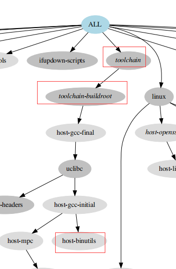
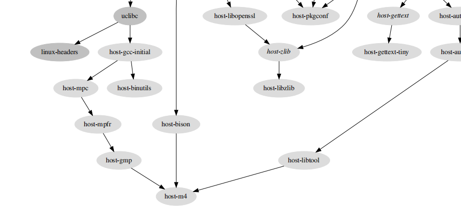

--

现在需要深入使用buildroot。所以需要全面系统地进行掌握。

以rpi4为切入点，进行全面细致的分析。

代码下载：

```
git clone https://git.busybox.net/buildroot
```

使用默认的配置。

```
make raspberrypi4_64_defconfig
```

生成的.config，就在buildroot的根目录。

查看当前选中的package有哪些。

在根Makefile里，加一个

```
$(error --------$(PACKAGES)--------)
```

make一下，看到打印的信息：

```
toolchain-buildroot
	在buildroot\toolchain\toolchain-buildroot\目录下。
	是一个virtual-package。
	对应的配置项。BR2_TOOLCHAIN_BUILDROOT=y
	这个表示的是使用buildroot编译的工具链。而不是外部的工具链。
toolchain
	
busybox
host-dosfstools
host-e2fsprogs
host-genimage
ifupdown-scripts
initscripts
host-kmod
linux-headers
host-mtools
host-patchelf
rpi-firmware
skeleton-init-common
skeleton-init-sysv
skeleton
uclibc
urandom-scripts
host-util-linux
linux
host-acl
host-attr
host-autoconf
host-automake
host-fakeroot
host-libtool
host-libzlib
host-m4
host-makedevs
host-pkgconf
host-skeleton
host-util-linux
host-zlib
```

.config文件是怎样生成的？

```
%_defconfig: $(BUILD_DIR)/buildroot-config/conf $(1)/configs/%_defconfig outputmakefile
	@$$(COMMON_CONFIG_ENV) BR2_DEFCONFIG=$(1)/configs/$$@ \
		$$< --defconfig=$(1)/configs/$$@ $$(CONFIG_CONFIG_IN)
```

COMMON_CONFIG_ENV：这个是一组环境变量。

依赖了conf：这个就是二进制文件。

依赖了outputmakefile。这个是一个伪目标。

```
.PHONY: outputmakefile
outputmakefile:
ifeq ($(NEED_WRAPPER),y)
	$(Q)$(TOPDIR)/support/scripts/mkmakefile $(TOPDIR) $(O)
endif
```

作用就是调用mkmakefile脚本在output目录下生成一个Makefile。但是因为当前默认为output目录。

NEED_WRAPPER是n。所以没有生成一个Makefile。

所以，上面的语句实际是这样：

```
raspberrypi4_64_defconfig: output/build/buildroot-config/conf configs/raspberrypi4_64_defconfig
	BR2_DEFCONFIG=raspberrypi4_64_defconfig conf --defconfig=raspberrypi4_64_defconfig
```

所以，根本还是conf这个程序的执行结果。

conf怎么来的呢？

./support/kconfig，就是这个了。

删掉output目录。

make -n raspberrypi4_64_defconfig 这样看看。

```
make -C support/kconfig -f Makefile.br conf
```

menuconfig执行是什么。是mconf

```
menuconfig: $(BUILD_DIR)/buildroot-config/mconf outputmakefile
	@$(COMMON_CONFIG_ENV) $< $(CONFIG_CONFIG_IN)
```

mconf会把Config.in文件都读取进来。形成一棵树。


BR2_DEFCONFIG 这个就是指向rpi4的那个配置文件。

使用make -d raspberrypi4_64_defconfig

这样看详细的打印信息。

最后打印的是

```
# configuration written to /mnt/nfsroot/hanliang.xiong/work/test/buildrooot-test/buildroot/.config
```


执行make toolchain-buildroot

看看做了什么。

```
首先是 make syncconfig
然后host-skeleton
	这个目录名字只在output/build下有。
	下面是一些flag文件。都是空的。
	这个应该是什么都没有做。
host-binutils
```

会生成到host目录下的，是因为有这个

```
$(eval $(autotools-package))
$(eval $(host-autotools-package)) # 这个导致的。
```


make graph-depends 看看依赖关系。

生成output/graphs/graph-depends.pdf

这个就很清晰地体现了依赖关系。

我当前make toolchain-buildroot。依赖链条的末端是host-binutils。

toolchain是依赖了toolchain-buildroot。




然后编译了host-m4的。因为host-gcc-initial依赖的另一个分支host-mpc的末端就是host-m4。

host-m4也是很多的依赖的末端。



现在编译报错。当前出现这么多的编译问题，是因为我是在windows下clone的。然后压缩打包发送到Linux。所以链接、换行符这些都出问题 了。

```
ERROR: No hash found for gcc-9.3.0.tar.xz
```

这3个finalize的调用时机。

```
.PHONY: host-finalize
host-finalize: $(PACKAGES) $(HOST_DIR) $(HOST_DIR_SYMLINK)
	@$(call MESSAGE,"Finalizing host directory")
	$(call per-package-rsync,$(sort $(PACKAGES)),host,$(HOST_DIR))

.PHONY: staging-finalize
staging-finalize: $(STAGING_DIR_SYMLINK)

.PHONY: target-finalize
```


```
$(TARGETS_ROOTFS): target-finalize
```

```
.PHONY: target-post-image
target-post-image: $(TARGETS_ROOTFS) target-finalize staging-finalize
```

```
.PHONY: world
world: target-post-image
```


参考资料

