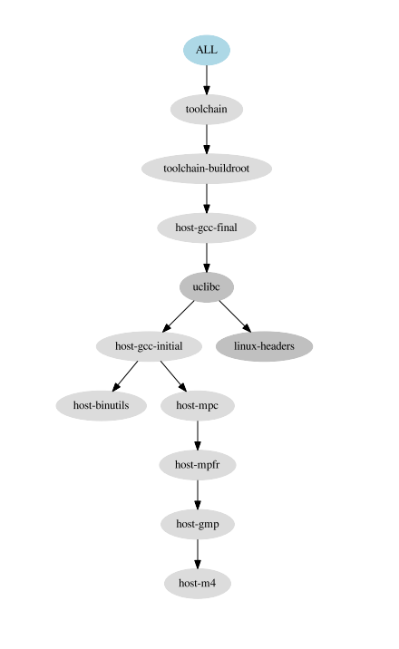

--

# 资料收集

这个gitbook，台湾人写的，不错。

https://hugh712.gitbooks.io/buildroot/content/

写一个系列文章，把buildroot的编译过程梳理一下。

先看顶层Makefile。

```
1、export当前的版本，2012.05 
2、检查make版本，最低要求是3.81
3、不允许在顶层make -j
4、定义TOPDIR
5、配置文件是Config.in。里面内容结构是跟kconfig一样的。
6、输出目录为output目录。
7、包含.config文件。
8、得到shell的名字。
9、定义工具链。
10、
```

```

hlxiong@hlxiong-VirtualBox:~/work2/buildroot/buildroot$ tree -L 1
.
├── arch
├── board
├── boot
├── build
├── CHANGES
├── Config.in
├── Config.in.legacy
├── configs
├── COPYING
├── DEVELOPERS
├── docs
├── fs
├── linux
├── Makefile
├── Makefile.legacy
├── output
├── package
├── README
├── support
├── system
├── toolchain
└── utils
```

默认下来的包，只有4M。解压后是57M。

主要内容都是要靠编译过程中下载的。

查看make help信息。

```
hlxiong@hlxiong-VirtualBox:~/work2/buildroot/buildroot$ make help
Cleaning:
  clean                  - 删除build生成的所有文件。
  distclean              - 删除了配置文件等。

Build:
  all                    - 等价于make world
  toolchain              - 构建工具链build toolchain
  sdk                    - 构建sdk，build relocatable SDK

Configuration:
  menuconfig             - interactive curses-based configurator
  defconfig              - New config with default answer to all options;
                             BR2_DEFCONFIG, if set on the command line, is used as input
  savedefconfig          - Save current config to BR2_DEFCONFIG (minimal config)

Package-specific:
  <pkg>                  - Build and install <pkg> and all its dependencies
  <pkg>-source           - Only download the source files for <pkg>
  <pkg>-extract          - Extract <pkg> sources
  <pkg>-patch            - Apply patches to <pkg>
  <pkg>-depends          - Build <pkg>'s dependencies
  <pkg>-configure        - Build <pkg> up to the configure step
  <pkg>-build            - Build <pkg> up to the build step
  <pkg>-show-depends     - List packages on which <pkg> depends
  <pkg>-show-rdepends    - List packages which have <pkg> as a dependency
  <pkg>-graph-depends    - Generate a graph of <pkg>'s dependencies
  <pkg>-graph-rdepends   - Generate a graph of <pkg>'s reverse dependencies
  <pkg>-dirclean         - Remove <pkg> build directory
  <pkg>-reconfigure      - Restart the build from the configure step
  <pkg>-rebuild          - Restart the build from the build step

Documentation:
  manual                 - build manual in all formats
  manual-html            - build manual in HTML
  manual-split-html      - build manual in split HTML
  manual-pdf             - build manual in PDF
  manual-text            - build manual in text
  manual-epub            - build manual in ePub
  graph-build            - generate graphs of the build times
  graph-depends          - generate graph of the dependency tree
  graph-size             - generate stats of the filesystem size
  list-defconfigs        - list all defconfigs (pre-configured minimal systems)

Miscellaneous:
  source                 - download all sources needed for offline-build
  external-deps          - list external packages used
  legal-info             - generate info about license compliance
  printvars              - dump all the internal variables

  make V=0|1             - 0 => quiet build (default), 1 => verbose build
  make O=dir             - Locate all output files in "dir", including .config

For further details, see README, generate the Buildroot manual, or consult
it on-line at http://buildroot.org/docs.html
```

我现在要构造buildroot，可以在mylinuxlab里用的。

我的mylinuxlab是32位的。

看configs目录下，直接有qemu相关的配置。

1、拷贝默认配置。

```
hlxiong@hlxiong-VirtualBox:~/work2/buildroot/buildroot$ make qemu_x86_64_defconfig
#
# configuration written to /home/hlxiong/work2/buildroot/buildroot/.config
#
```

2、开始编译，把过程打印保存下来，好好研究一下。

下载是很慢的。我挂上代理来下载。

我加上代理，可以ping通Google了。但是下载还是失败。

```
hlxiong@hlxiong-VirtualBox:~/work2/buildroot/buildroot$ export https_proxy=http://localhost:8123
hlxiong@hlxiong-VirtualBox:~/work2/buildroot/buildroot$ export http_proxy=http://localhost:8123
hlxiong@hlxiong-VirtualBox:~/work2/buildroot/buildroot$ 
hlxiong@hlxiong-VirtualBox:~/work2/buildroot/buildroot$ 
hlxiong@hlxiong-VirtualBox:~/work2/buildroot/buildroot$ ping www.google.com
PING www.google.com (14.215.177.38) 56(84) bytes of data.
64 bytes from 14.215.177.38: icmp_seq=1 ttl=55 time=8.15 ms
64 bytes from 14.215.177.38: icmp_seq=2 ttl=55 time=9.91 ms
^C
--- www.google.com ping statistics ---
2 packets transmitted, 2 received, 0% packet loss, time 1002ms
rtt min/avg/max/mdev = 8.153/9.036/9.919/0.883 ms
hlxiong@hlxiong-VirtualBox:~/work2/buildroot/buildroot$ make
>>> host-lzip 1.19 Downloading
--2018-10-26 11:09:53--  http://download.savannah.gnu.org/releases/lzip/lzip-1.19.tar.gz
正在解析主机 localhost (localhost)... 127.0.0.1
正在连接 localhost (localhost)|127.0.0.1|:8123... 已连接。
```

我选择在Linux上使用ssr客户端的方式来做。这样可以了。

下载还是比较耗时的。我一边看看配置文件。

接近4000行。我用的是qemu_x86_64_defconfig的。

配置文件组成

```
1、gcc版本要求。
2、target选项。
	64位。
	MMU
	MMX
3、build选项。
4、命令。
	wget的选项。
	svn
	git等。
5、下载地址。
6、工具链。
	使用了ulibc。
7、Linux header。
8、uclibc选项。
9、binutils选项。
10、gcc选项。
11、系统配置。
	初始化系统。用busybox的。
12、kernel配置。
13、接下来就是各种包配置了。

```

先暂时不细究这些配置。

在make xxx_defconfig之后，目录产生的变化：

1、产生了output目录。这里把buildroot-config这个工具编译了，生成在这里。

2、顶层目录有一个.config文件生成。


采取的编译方法是把压缩包都解压到output/build目录下进行的编译。

看board/qemu/x86_64目录的reame.txt。这个是运行命令。

```
qemu-system-x86_64 -M pc -kernel output/images/bzImage -drive file=output/images/rootfs.ext2,if=virtio,format=raw -append "root=/dev/vda" -net nic,model=virtio -net user
```


从我的ssr的日志看，期间连接了这些地址进行了下载。

```
connecting download.savannah.gnu.org:80 from 127.0.0.1:35712
connecting download-mirror.savannah.gnu.org:80 from 127.0.0.1:35716
connecting ftpmirror.gnu.org:80 from 127.0.0.1:35722
connecting mirror.team-cymru.com:80 from 127.0.0.1:35726
connecting ftpmirror.gnu.org:80 from 127.0.0.1:35732
connecting gnu.askapache.com:80 from 127.0.0.1:35736
connecting mirror.team-cymru.com:80 from 127.0.0.1:35742
connecting www.mpfr.org:80 from 127.0.0.1:35748
connecting www.mpfr.org:443 from 127.0.0.1:35754
connecting ftpmirror.gnu.org:80 from 127.0.0.1:35760
connecting mirror.us-midwest-1.nexcess.net:80 from 127.0.0.1:35764
connecting mirror.keystealth.org:80 from 127.0.0.1:35770
connecting cdn.kernel.org:443 from 127.0.0.1:35776
connecting downloads.uclibc-ng.org:80 from 127.0.0.1:35782
connecting downloads.uclibc-ng.org:443 from 127.0.0.1:35788
connecting www.busybox.net:80 from 127.0.0.1:35794
connecting busybox.net:443 from 127.0.0.1:35800
connecting github.com:443 from 127.0.0.1:35806
connecting github-production-release-asset-2e65be.s3.amazonaws.com:443 from 127.0.0.1:35812
connecting www.zlib.net:80 from 127.0.0.1:35818
connecting cdn.kernel.org:443 from 127.0.0.1:35824
connecting cdn.kernel.org:443 from 127.0.0.1:35830
connecting releases.nixos.org:80 from 127.0.0.1:35836
connecting sources.buildroot.net:80 from 127.0.0.1:35842
connecting cdn.kernel.org:443 from 127.0.0.1:35848
connecting download.savannah.gnu.org:80 from 127.0.0.1:35854
connecting nongnu.askapache.com:80 from 127.0.0.1:35858
connecting download-mirror.savannah.gnu.org:80 from 127.0.0.1:35864
connecting snapshot.debian.org:80 from 127.0.0.1:35870
```


可以保存的日志的阅读方法，可以通过`>>>`搜索来查看。

```
>>>   Finalizing target directory
```


但是运行，碰到了问题。

就是无法运行。需要图形界面支持。

所以，还是编译一个arm的。

```
make qemu_arm_vexpress_defconfig
```

看会下载一个不同版本的Linux。

直接编译，会出错。需要make clean一下。

不然工具链会不对。

编译完了，也挺快的。

运行指令：

```
qemu-system-arm -M vexpress-a9 -smp 1 -m 256 -kernel output/images/zImage -dtb output/images/vexpress-v2p-ca9.dtb -drive file=output/images/rootfs.ext2,if=sd,format=raw -append "console=ttyAMA0,115200 root=/dev/mmcblk0"  -net nic,model=lan9118 -net user -nographic
```

根据readme.txt内容修改：增加-nographic，去掉-serial stdio。

如果是在图形界面下运行，可以按原样来做

```
qemu-system-arm -M vexpress-a9 -smp 1 -m 256 -kernel output/images/zImage -dtb output/images/vexpress-v2p-ca9.dtb -drive file=output/images/rootfs.ext2,if=sd,format=raw -append "console=ttyAMA0,115200 root=/dev/mmcblk0"  -net nic,model=lan9118 -net user -serial stdio
```


运行：用户是root，密码是空。

```
deleting routers
adding dns 10.0.2.3
OK

Welcome to Buildroot
buildroot login: 
Welcome to Buildroot
buildroot login: root
# 
# 
# 
# ls
# df -h
Filesystem                Size      Used Available Use% Mounted on
/dev/root                58.1M      2.6M     52.5M   5% /
devtmpfs                122.5M         0    122.5M   0% /dev
tmpfs                   123.0M         0    123.0M   0% /dev/shm
tmpfs                   123.0M     24.0K    123.0M   0% /tmp
tmpfs                   123.0M     20.0K    123.0M   0% /run
```

如果要定制自己的配置文件，就make menuconfig，然后保存到configs目录下。

看看配置项怎样传递给kernel的。

怎样传递给busybox的。

靠的是package目录下的busybox/busybox.config这个文件来做的。


文件系统情况。

```
# df -h
Filesystem                Size      Used Available Use% Mounted on
/dev/root                58.1M      2.6M     52.5M   5% /
devtmpfs                122.5M         0    122.5M   0% /dev
tmpfs                   123.0M         0    123.0M   0% /dev/shm
tmpfs                   123.0M     24.0K    123.0M   0% /tmp
tmpfs                   123.0M     20.0K    123.0M   0% /run
```

文件系统介质的大小哪里改呢？

menuconfig里有配置的地方。我改为512M的。

勾选上make和git这2个组件。然后make。

把我下载的东西，都上传到百度云盘保存下来，这样我在其他地方搭建buildroot环境的时候，就不需要重新下载这些包了。

这些package都是开源代码学习的好材料。

这个环境开源作为各种脚本的测试环境。

现在把重要的包都下载好。

音频视频类

1、alsa-utils。

2、ffmpeg。

压缩类

1、zip

2、bzip。

调试类

1、strace。

2、uclibc-ng-test

开发工具：

1、git

2、make

文件系统

1、nfs。

2、mmc-utils

脚本类

1、micropython

2、lua。

3、php

网络类

1、boa。一个webserver。

2、dhcpcd。

3、dropbear。

4、hostapd。

5、iperf3.

6、iputils。

7、lighttpd。

8、openssh。

9、rsync。

10、tinyhttpd。

11、uhttpd。

12、wpa_supplicant

13、

shell类

1、file命令。

2、sudo命令。

系统工具类

1、cpuload。

差不多就这些了。编译一把。

虽然挂了代理，但是有些东西下载还是慢。从其他地方下载，放到dl目录下就好了。


可以尝试一下其他的init system。看看区别何在。

现在启动时打印。

```
eth0: soliciting a DHCP lease
eth0: offered 10.0.2.15 from 10.0.2.2
eth0: leased 10.0.2.15 for 86400 seconds
eth0: adding route to 10.0.2.0/24
eth0: adding default route via 10.0.2.2
forked to background, child pid 810
Starting dropbear sshd: OK
Starting lighttpd: OK
ssh-keygen: generating new host keys: RSA DSA ECDSA ED25519 
Starting sshd: OK
Starting NFS statd: OK
Starting NFS services: exportfs: can't open /run/nfs/xtab for reading
FAIL
Starting NFS daemon: rpc.nfsd: Unable to access /proc/fs/nfsd errno 2 (No such file or directory).
Please try, as root, 'mount -t nfsd nfsd /proc/fs/nfsd' and then restart rpc.nfsd to correct the problem
FAIL
Starting NFS mountd: OK
Starting tinyhttpd: done
bind: Address already in use
```


make savedefconfig这个是很有用的。

```
make savedefconfig
cp defconfig configs/<boardname>_defconfig
```

Once you have a known working configuration, run `make savedefconfig`. This will generate a minimal `defconfig` file at the root of the Buildroot source tree. Move this file into the `configs/` directory, and rename it `<boardname>_defconfig`. 

The recommended place to store this defconfig is `configs/<boardname>_defconfig`. If you follow this recommendation, the configuration will be listed in `make help` and can be set again by running `make <boardname>_defconfig`. 


从实际操作来看。


```
qemu-system-i386 -M pc -kernel output/images/bzImage -drive file=output/images/rootfs.ext2,if=virtio,format=raw -append "root=/dev/vda" -net nic,model=virtio -net user -nographic
```

```

qemu-system-arm -M vexpress-a9 -smp 1 -m 256 -kernel output/images/zImage -dtb output/images/vexpress-v2p-ca9.dtb -drive file=output/images/rootfs.ext2,if=sd,format=raw -append "console=ttyAMA0,115200 root=/dev/mmcblk0"  -net nic,model=lan9118 -net user -nographic

```

# 检查编译buildroot所依赖的工具是否都安装了

我的电脑新安装的ubuntu，直接编译buildroot，肯定会报缺少各种工具的错误。

到底缺了哪些呢？

buildroot提供了一个脚本来检查这个的。

```
 ./support/dependencies/dependencies.sh 
```

其实主要安装一下build-essential就差不多了。


# make file

这个是编译file这个工具。

从编译过程的打印看，会先编译host的，然后编译板端的。

而且会先打补丁。


# 依赖关系

在我们新增自己的package的时候，往往可能依赖了某些其他的包。需要先把其他的包编译完了才能编译我们的包。

所以需要添加依赖。

```
在在mk文件里。添加这个。
XX_DEPENDANCIES += yy
```

在Config.in里，depends on并不会产生这种编译依赖。


# 深入

还是看顶层Makefile。

help信息里。

## graph-build

```

	这个是通过读取output/build/build-time.log来生成图表，可以直观看出编译花费的时间细节。
	执行出错
	You need python-matplotlib and python-numpy to generate build graphs
	但是我用apt-get来安装这2个软件，提示是已经安装的。
	是靠这个脚本的。support/scripts/graph-build-time
	import matplotlib as mpl
	import numpy
	这2句产生了import错误。
	
```

直接打开python。进入交互，import matplotlib，报错如下：

```
ImportError: No module named functools_lru_cache
```

把python版本切换到3.6，就可以了。

输出目录是：

output/graphs/build.hist-name.pdf 

没有太多可看的。

## graph-depends

这个生成包的依赖关系图。倒是值得看看。

## graph-size

这个可以看rootfs里各个部分的大小。

## legal-info

## printvars

这个会打印出所有的var的名字和值（Makefile里的）。

非常多。

## list-defconfigs

这个是一个目标。

有一个同名的宏定义。

```
define list-defconfigs
	
endef
```

就是把configs目录下的所有defconfig罗列了一下。

## show-targets

这个是列出实际的target。

我当前的vexpress的例子。是这样。demo_app是我自己加的一个package。

```
alsa-lib
alsa-utils
atest
busybox
demo_app
glibc
host-e2fsprogs
host-fakeroot
host-lzip
host-makedevs
host-patchelf
host-util-linux
ifupdown-scripts
initscripts
libeXosip2
libev
libogg
libosip2
linphone
linux
linux-headers
ncurses
skeleton
skeleton-init-common
skeleton-init-sysv
speex
toolchain
toolchain-buildroot
rootfs-ext2
```

## dirs

这个是创建所有需要的目录。

## prepare

```
prepare: $(BUILD_DIR)/buildroot-config/auto.conf
```

只是依赖auto.conf这个文件。

这个文件依赖：

```
$(BUILD_DIR)/buildroot-config/auto.conf: $(BR2_CONFIG)
	$(MAKE1) $(EXTRAMAKEARGS) HOSTCC="$(HOSTCC_NOCCACHE)" HOSTCXX="$(HOSTCXX_NOCCACHE)" silentoldconfig
```

```
$(BR2_CONFIG)
	这个就是.config文件。
	
```

## sdk

```
.PHONY: world
world: target-post-image

.PHONY: sdk
sdk: world
```

make sdk依赖于make world。

在world的基础上，做了

```
1、调用support/scripts/fix-rpath host 
2、调用support/scripts/fix-rpath staging
3、安装一个脚本。
	$(INSTALL) -m 755 $(TOPDIR)/support/misc/relocate-sdk.sh $(HOST_DIR)/relocate-sdk.sh
	
```

target-post-image

这个目标做了什么。

```
依赖与$(TARGETS_ROOTFS) target-finalize。
是Executing post-image script

```

BR2_ROOTFS_POST_IMAGE_SCRIPT

这个变量里，包含了哪些脚本？

## show-build-order

显示编译的顺序。

## prepare-kconfig

```
menuconfig: $(BUILD_DIR)/buildroot-config/mconf prepare-kconfig
```

mconf这个是二进制文件。

```
prepare-kconfig: outputmakefile $(BUILD_DIR)/.br2-external.in
```

outputmakefile 这个是空的目标，等于啥也不做。

br2-external.in这个是这样，靠br-external脚本来生成。

```
$(BUILD_DIR)/.br2-external.in: $(BUILD_DIR)
	$(Q)support/scripts/br2-external -k -o "$(@)" $(BR2_EXTERNAL)
```

br-external脚本是怎样工作的？不管先。

## savedefconfig

这个做了什么。

就是保存了配置到configs目录下。


## world

```
world只是依赖了target-post-image
target-post-image是个伪目标。
依赖了$(TARGETS_ROOTFS) target-finalize。
进行的操作是执行post image脚本。vexpress这个设备没有post image脚本需要处理。

重点是这个：
target-finalize: $(PACKAGES)

```


```
PACKAGES += $(DEPENDENCIES_HOST_PREREQ)
```

# staging目录的作用

staging：

软链接到host/< tuple >/sysroot/ 

就是上面说到的文件系统需要的库等目录,方便查看

target： 

目录是用来制作rootfs的，

里面放着Linux系统基本的目录结构，

以及各种编译好的应用库和bin可执行文件。

不能用来nfs mount到开发板,

因为buildroot不是root权权运行的,

所以现dev/,etc/等一些文件无法创建,

所以目录还不完整,

要用images/里的rootfs.tar解压出来的根文件目录才能mount.

使用如下命令：sudo tar -C /destination/of/extraction -xf images/rootfs.tar


# 定制

看doc/manual下面的txt文档。

```
BR2_ROOTFS_OVERLAY 
	这个指向一个目录，我们可以放一些我们希望覆盖到目标文件系统的东西。
BR2_ROOTFS_POST_BUILD_SCRIPT
BR2_ROOTFS_POST_IMAGE_SCRIPT
```


## 定制目录结构

你需要增加自己的东西的时候，可以选择放到buildroot外面，也可以放在buildroot里面。

如果放在里面，目录结构建议这样放：

```
board
	company
		board
			linux.config
			busybox.config
			other config
			post_build.sh
			post_image.sh
			rootfs_overlay/
				etc/
				other
			patches
				foo/
				libbar/
configs/
	xx_defconfig
package/
	company/
		Config.in
		company.mk
		package1/
			Config.in
			package1.mk
			
```

如果是放在buildroot外面，则目录这样：

```
board
configs
package
Config.in
	里面放这样的内容：
	source "$BR2_EXTERNAL_SNAPOS_PATH/package/snapcast/Config.in"
	source "$BR2_EXTERNAL_SNAPOS_PATH/package/snap-mpd/Config.in"
external.mk
	这个里面就这样一句：
	include $(sort $(wildcard $(BR2_EXTERNAL_SNAPOS_PATH)/package/*/*.mk))
external.desc
	放这么两行就可以了。
	name: SNAPOS
	desc: Snapcast OS
```


用户经常碰到的情况是：

有几个相关的项目，会使用很多相同的文件，这个怎么处理呢？

目录结构这么放：

```
board
	company
		common
			post_build.sh
			rootfs_overlay/
			patches/
		fooboard
			linux.config
			busybox.config
			post_build.sh
			rootfs_overlay/
			patches/
```

在defconfig文件里，配置BR2_XX的时候，这样写：

```
BR2_GLOBAL_PATCH_DIR="board/company/common/patches board/company/fooboard/patches"
```

后面的会覆盖前面的。

## br2 external用法

br2-external机制，就是把你的定制的东西，放在buildroot外面。

通过一个环境变量：BR2_EXTERNAL来做。

会被保存到output/.br2_external.mk里。这样所有的Makefile都可以使用。

例如snapos在编译的时候，就是这样的：

```
BR2_EXTERNAL ?= /home/hlxiong/work2/buildroot/snapos/buildroot-external
BR2_EXTERNAL_NAMES = 
BR2_EXTERNAL_DIRS = 
BR2_EXTERNAL_MKS = 

BR2_EXTERNAL_NAMES += SNAPOS
BR2_EXTERNAL_DIRS += /home/hlxiong/work2/buildroot/snapos/buildroot-external
BR2_EXTERNAL_MKS += /home/hlxiong/work2/buildroot/snapos/buildroot-external/external.mk
export BR2_EXTERNAL_SNAPOS_PATH = /home/hlxiong/work2/buildroot/snapos/buildroot-external
export BR2_EXTERNAL_SNAPOS_DESC = Snapcast OS
```

可以同时指定多个BR2_EXTERNL。例如：

```
make BR2_EXTERNAL=/path1:/path2 menuconfig
```

也可以清空：

```
make BR2_EXTERNAL= menuconfig
```

现在要正式在项目里使用external机制。

有这些需求：

1、对于Makefile、linux、fs等处有一些修改，还有一些patch文件。

2、希望可以把这些都放在external目录，保证可以较好地进行融合。

```
BR2_GLOBAL_PATCH_DIR=$(BR2_EXTERNAL_BAR_42_PATH)/patches/
BR2_ROOTFS_OVERLAY=$(BR2_EXTERNAL_BAR_42_PATH)/board/<boardname>/overlay/
BR2_LINUX_KERNEL_CUSTOM_CONFIG_FILE=$(BR2_EXTERNAL_BAR_42_PATH)/board/<boardname>/kernel.config
```

buildroot/linux目录的调整。

```
  |- linux/Config.ext.in
  |     |config BR2_LINUX_KERNEL_EXT_EXAMPLE_DRIVER
  |     |    bool "example-external-driver"
  |     |    help
  |     |      Example external driver
  |     |---
  |- linux/linux-ext-example-driver.mk
```

patches目录

```
  |- linux/Config.ext.in
  |     |config BR2_LINUX_KERNEL_EXT_EXAMPLE_DRIVER
  |     |    bool "example-external-driver"
  |     |    help
  |     |      Example external driver
  |     |---
  |- linux/linux-ext-example-driver.mk
```

对Config.in的修改，增加的部分用Config.ext.in来扩展。

改动的部分呢？


参考资料

1、

https://buildroot.org/downloads/manual/customize-outside-br.txt

## 定制rootfs

有两种方法，可以共存：

1、overlay机制。

2、post build脚本。编译完成之后，镜像生成之前。


定制skeleton

BR2_ROOTFS_SKELETON_CUSTOM


## 定制user

有时候需要添加一些特殊到user  accounts到系统里。

buildroot也提供了支持，这个叫user table。

设置BR2_ROOTFS_USERS_TABLES这个配置项。


## post image

这个一般是对镜像进行打包操作。


# rebuild相关

buildroot没有去检查在config改动后，哪些东西需要被重新编译。

因为这个非常复杂。所以buildroot直接就不处理了。

用户需要自己清楚，什么时候需要一次完整的编译。

1、cpu架构改了，需要完全重新编译。

2、工具链改了，需要完全重新编译。

3、添加了一个新的package到系统，这个不需要重新编译，buildroot可以检测到没有编译的包，帮我们进行编译。但是依赖关系还无法解决，需要你清楚地进行编译，例如你之前编译了ctorrent这个软件，现在你编译了openssl，你想让ctorrent使用上openssl的特性，就必须自己手动重新编译ctorrent。

4、你删除了package，这个target文件系统里不会变化。保险起见，你需要完全重新编译。


# 使用buildroot toolchain

这个讨论的是怎样在其他地方使用buildroot编译出来的工具链。

make sdk，就是得到一个压缩包，输出在output/images目录下，把编译生成的工具链打包进去。


## 使用x86_64 qemu编译的工具链

我使用这个qemu来模拟，想要单独把工具链编译出来。怎么执行命令？

这个的依赖链条是这样的：



编译过程是这样的：

1、编译gcc需要的host工具：host-m4、host-mpc、host-mpfr、host-gmp。

2、把第一步编译的工具安装到host/bin等目录下。

3、编译host-binutils并安装到host目录下。

4、编译第一阶段的compiler，host-gcc-initial。

5、把linux-kernel-headers安装到staging目录下。依赖的这个linux-headers package。直接从网上下载对应版本的linux头文件。

6、编译安装glibc等仓库并安装到staging目录。

7、编译最终的host-gcc-final并安装到host/usr/bin目录下。


要编译得到工具链，直接make toolchain就可以得到。

安装在这个目录下：

```
buildroot/output/host/usr/bin
```

通过这个目录来引用就好了。


参考资料

https://hugh712.gitbooks.io/buildroot/content/tool_chains.html

## 关于linux header头文件的版本

在编译toolchain的时候，最重要的一个参数就是linux的头文件版本。

这些头文件是用户程序跟kernel沟通的基准。

如果头文件版本错了，那么就会有问题。

因为kernel头文件是向下兼容的。所以头文件版本可以比实际的kernel旧，但是不能比实际的kernel的新。否则就可能出问题。


# 替换boost库

编译snapcast的时候，提示boost版本太低，提示当前还是1.66的，但是我明明已经替换为1.72的，而已经make boost-dirclean和make boost-rebuild了。

看提示是在host/sysroot下面的。

所以需要make host-boost。

再make snapcast，还是提示boost版本是1.66的。

看看检查代码是怎么做的。

是在snapcast下顶层CMakeLists.txt里。

```
find_package(Boost 1.70 REQUIRED)
```

我把sysroot下include里的boost目录删掉，在rebuild boost看看。

没有看到被拷贝过来。

怎样才能被拷贝过来呢？

buildroot的host相关编译过程是怎样的呢？

在boost.mk的最后有：

```
$(eval $(generic-package))
$(eval $(host-generic-package))
```

我对比了一下snapos编译后的build/boost和sysroot/boost的内容，build/boost里多了一点文件。

那我直接把build/boost的内容都拷贝到sysroot下面。

编译，可以通过。

# 生成manual

我喜欢文本方式的。

make manual-text 

这个需要系统安装好些工具才行。

生成的文档是.text后缀的，默认是用typora打开的。

格式还可以。

# 打开telnetd

这个需要make busybox-menuconfig。选配telnetd。

保存busybox的配置，是make busybox-update-config

然后在顶层make menuconfig ，设置密码。没有密码不好登陆。

# 打开zmodem

为了方便传输文件。可以打开zmodem。就是lrzsz。

make lrzsz-rebuild就好了。


# make sdk

这个是在output/images目录下，生成一个arm-buildroot-linux-gnueabihf_sdk-buildroot.tgz的压缩包。

主要是如何进行使用。

很简单，直接写代码，相关头文件、库文件指向这个压缩包解压开的目录就可以。

编译工具使用bin目录下的。

但是并没有编译工具。

 `make prepare-sdk`  这个命令可以不生成压缩包，直接就是生成一个目录。


# virtual-package

virtual package是指这样的package，它的功能是通过几个其他的package来实现的。

virtual package是一种可扩展的机制。允许用户选择rootfs里用的provider。

例如opengl ES是图形api。具体的实现在不同的平台上不同。

例如在全志的平台上是sunxi-mali，在TI平台上，就是ti-gfx。

所以libgles这个package，就是sunxi-mali和ti-gfx的virtual package。

我目前有这样一个需求，lvgl-app依赖了lvgl-core和lvgl-drivers。

但是lvgl-core和lvgl-drivers不要编译，需要先拷贝到lvgl-app的目录下再进行编译。

virtual-package可以满足我的需求吗？

不可以。


在buildroot里，一个virtual package表示这样的package：

它的概念的由其他的1个或者多个package来提供的。


参考资料

https://buildroot.org/downloads/manual/adding-packages-virtual.txt

# skeleton

skeleton是骨架的意思。表示的是要生成的rootfs的整体结构。

buildroot编译的第一个package就是这个。

在skeleton.mk的注释这么写着：

```
skeleton不能依赖toolchain。
因为所有的package都依赖skeleton。
toolchain是一个package。
（感觉这里写得有点乱）。
```

定义了这样的：

```
SKELETON_ADD_TOOLCHAIN_DEPENDENCY = NO
SKELETON_ADD_SKELETON_DEPENDENCY = NO
```

对应的工具文件是pkg-virtual.mk。

输出了2个工具函数：

```
virtual-package
	参数1：xx
    参数2：XX
    参数3：XX
    参数4：target。
host-virtual-package
	参数1：host-xx
	参数2：HOST-XX
	参数3：XX
	参数4：host
```

最后是掉inner-generic-package。


目前本质上skeleton这个没有做什么。

另外还有几个以skeleton开头的package。

```
skeleton/              
skeleton-custom/       
skeleton-init-common/  
skeleton-init-none/    
skeleton-init-openrc/  
skeleton-init-systemd/ 
skeleton-init-sysv/  用的这个。
```

当前配置的是这个Symbol: BR2_PACKAGE_SKELETON_INIT_SYSV [=y] 

对应的配置是system/Config.in。

```
select BR2_PACKAGE_SKELETON_INIT_SYSV if BR2_INIT_SYSV
select BR2_PACKAGE_SKELETON_INIT_SYSV if BR2_INIT_BUSYBOX # 因为我们是busybox的init进程，所以也是属于sysv的。
```

```
Init system (BusyBox)  ---> 
```

然后skeleton需要配置的信息：

```
hostname
system banner
init system
Password加密方法
dev管理方式
root的密码
shell用哪个。
locale
时区
```

> make host-skeleton-rebuild V=1

这样看一下编译的打印。

就做了这些：创建了目录。

```
ln -snf . /home/hlxiong/work2/buildroot/buildroot-2020.02/output/host/usr
mkdir -p /home/hlxiong/work2/buildroot/buildroot-2020.02/output/host/lib
mkdir -p /home/hlxiong/work2/buildroot/buildroot-2020.02/output/host/include
case x86_64 in (*64) ln -snf lib /home/hlxiong/work2/buildroot/buildroot-2020.02/output/host/lib64;; (*)   ln -snf lib /home/hlxiong/work2/buildroot/buildroot-2020.02/output/host/lib32;; esac
touch /home/hlxiong/work2/buildroot/buildroot-2020.02/output/build/host-skeleton/.stamp_host_installed
```

.config里相关的变量有：

```
BR2_ROOTFS_SKELETON_DEFAULT=y
# BR2_ROOTFS_SKELETON_CUSTOM is not set
BR2_PACKAGE_SKELETON=y
BR2_PACKAGE_HAS_SKELETON=y
BR2_PACKAGE_PROVIDES_SKELETON="skeleton-init-sysv"
BR2_PACKAGE_SKELETON_INIT_COMMON=y
BR2_PACKAGE_SKELETON_INIT_SYSV=y
```

最终系统的rootfs的骨架，就是：

```
skeleton
+ skeleton-init-common
+ skeleton-init-sysv
```


##  make  V=1 skeleton-init-common-rebuild

分为2个部分：

host和target。

用rsync的方式，把system/skeleton下面东西拷贝到host/sysroot下面。

```
rsync -a --ignore-times --exclude .svn --exclude .git --exclude .hg --exclude .bzr --exclude CVS --chmod=u=rwX,go=rX --exclude .empty --exclude '*~' system/skeleton/ /home/hlxiong/work2/buildroot/buildroot-2020.02/output/host/arm-buildroot-linux-gnueabihf/sysroot/
```

system/skeleton下面的目录结构是这样：就是一个rootfs的基本目录结构。

```
├── dev
│   ├── fd -> ../proc/self/fd
│   ├── stderr -> ../proc/self/fd/2
│   ├── stdin -> ../proc/self/fd/0
│   └── stdout -> ../proc/self/fd/1
├── etc
│   ├── group
│   ├── hosts
│   ├── mtab -> ../proc/self/mounts
│   ├── passwd
│   ├── profile
│   ├── profile.d
│   │   └── umask.sh
│   ├── protocols
│   ├── resolv.conf -> ../tmp/resolv.conf
│   ├── services
│   └── shadow
├── media
├── mnt
├── opt
├── proc
├── root
├── run
├── sys
├── tmp
└── usr
    ├── bin
    ├── lib
    └── sbin
```

## make  V=1 skeleton-init-sysv-rebuild

这个是把packages/skeleton-init-sysv目录下的skeleton目录的抵消拷贝到target里去。

这个skeleton目录是这样。相当于在前面一步的基础上进行覆盖。

```
package/skeleton-init-sysv/skeleton
├── dev
│   ├── log -> ../tmp/log
│   ├── pts
│   └── shm
├── etc
│   └── fstab
└── var
    ├── cache -> ../tmp
    ├── lib
    │   └── misc -> ../../tmp
    ├── lock -> ../tmp
    ├── log -> ../tmp
    ├── run -> ../run
    ├── spool -> ../tmp
    └── tmp -> ../tmp
```

## make V=1 linux-headers-rebuild

```
/usr/bin/make -f ./scripts/Makefile.headersinst obj=include/uapi/asm-generic dst=include/asm-generic
/usr/bin/make -f ./scripts/Makefile.headersinst obj=include/uapi/drm dst=include/drm
/usr/bin/make -f ./scripts/Makefile.headersinst obj=include/uapi/linux dst=include/linux
/usr/bin/make -f ./scripts/Makefile.headersinst obj=include/uapi/misc dst=include/misc
```

安装的目标位置是：sysroot/usr

相当于放置一份内核的头文件到sysroot下，方便编译时引用。


## rpi-bt-firmware

这个就是拷贝一下二进制固件到/lib/firmware/brcm目录下面。


## rpi-firmware

这个是安装dtb文件到/boot，安装dtbo文件到/boot/overlays目录。

start4.elf

fixup4.dat

config.txt

cmdline.txt

package/rpi-firmware目录下的这2个txt文件，内容还比较少。

还需要后续步骤自动进行修改，才能得到最终我们要的样子。


## rpi-userland

这个是一些用户态的工具。


## rpi-wifi-firmware


# snapos的package编译顺序

```
host-skeleton
host-ccache
host-m4
host-bison
host-gawk
host-binutils
host-gmp
host-mpfr
host-mpc
host-gcc-initial
skeleton-init-common
skeleton-init-sysv
skeleton
linux-headers
glibc
host-gcc-final
toolchain-buildroot
toolchain
host-libtool
host-autoconf
host-automake
alsa-lib
host-gettext-tiny
host-gettext
host-pkgconf
libsamplerate
host-ncurses
ncurses
alsa-utils
libogg
flac
audiofile
expat
dbus
host-expat
host-libxml-parser-perl
host-intltool
libdaemon
avahi
boost
libzlib
zlib
util-linux
e2fsprogs
libevent
ntp
busybox
bzip2
cmocka
dhcpcd
host-dosfstools
dropbear
host-libzlib
host-zlib
host-util-linux
host-e2fsprogs
faad2
host-libconfuse
host-genimage
gmp
libtasn1
nettle
pcre
gnutls
ifupdown-scripts
initscripts
host-flex
libnl
iw
libcurl
libid3tag
libmad
host-ninja
host-libffi
host-python3
host-python3-setuptools
host-meson
libmpdclient
libnfs
libsoxr
libupnp18
libvorbis
host-mkpasswd
opus
host-heimdal
host-libtirpc
host-nfs-utils
host-python
popt
samba4
sqlite
yajl
mpd
host-lzip
host-mtools
ncmpc
host-patchelf
rpi-bt-firmware
rpi-firmware
rpi-userland
rpi-wifi-firmware
wpa_supplicant
host-kmod
host-libopenssl
host-openssl
linux
host-attr
host-acl
host-fakeroot
host-makedevs
snap-mpd
snapcast
```


# hook操作

虽然说buildroot的package架构，已经可以满足绝大部分的需求，但是有时候还是不够有弹性。

所以为了满足用户的定制化需求，buildroot提供了hook机制。

可以让你在pre或者post某些action的时间节点上，做一些自己的操作。

这些action包括：

```
download
extract
rsync
patch
configure
build
install
install staging
install target
install images
legal info
```

一个有11个action。

你定义自己操作的规则是：

```
XXX_(PRE | POST)_<action>_HOOKS
```

例如，在解压后，进行一些操作。

```
define XXX_POST_EXTRACT_HOOKS
	echo "xx"
endef
```

现在我在编译之前，需要解压本地目录下2个release的压缩包。

应该怎么做？


# package的patch怎样生成

可以用diff生成，也可以用git生成。

在buildroot/dl/xx下面，把压缩包解包。

以systemd下面的修改为例：

假设src/network/netdev/fou-tunnel.c需要修改。

那么拷贝fou-tunnel.c为fou-tunnel.c.modify。修改好之后。

执行命令：

```
diff -u src/network/netdev/fou-tunnel.c src/network/netdev/fou-tunnel.c.modify > 0002-fix-fou-tunnel-compile-error.patch
```

把得到的0002-fix-fou-tunnel-compile-error.patch里的文件路径修改一下：

```
--- a/src/network/netdev/fou-tunnel.c	2020-02-07 15:50:52.000000000 +0000
+++ b/src/network/netdev/fou-tunnel.c	2023-05-29 08:41:33.488503440 +0000
```

然后把patch文件放到package/systemd目录下。

这样才能在make的时候patch成功。


# 添加一个user

现在使用upmpdcli，这个需要一个upmpdcli的user。

所以需要做文件系统的时候，把这个user添加进去。

具体怎么操作呢？

最简单的当然是自己在fs-overlay里加一个passwd文件。但是这个感觉不太好。会覆盖其他程序修改的。

目前avahi添加了一个用户进去，看看怎么添加的。

```
avahi:x:1000:1000::/:/bin/false
```

看avahi的mk文件。里面有这么一句，感觉有点像。

```
define AVAHI_USERS
	avahi -1 avahi -1 * - - -
endef
```

在buildroot手册里搜索“users”。找到这个。

```
adding custom user accounts (using BR2_ROOTFS_USERS_TABLES)
```


实际上，在upmpdcli里，默认有加上这个。

```
define UPMPDCLI_USERS
	upmpdcli -1 upmpdcli -1 * - - audio Upmpdcli MPD UPnP Renderer Front-End
endef
```

但是为什么没有生效呢？

大概是因为没有选配upmpdcli，而只是手动调用make进行了编译。

应该是的。

选配再看。


添加用户举例：

```
teddy -1 teddy -1 !=123456 /home/teddy /bin/sh sys,www-data my name is teddy
```

放到users.txt里，

然后配置BR2_ROOTFS_USERS_TABLES到这个文件。

重新make。但是没有被添加进去。

不知道为什么。

再编译一次就有了。

但是登陆不进去。


https://buildroot.org/downloads/manual/manual.html#makeuser-syntax

https://github.com/hifiberry/hifiberry-os/blob/master/buildroot/configs/minimal_config

# 提交历史

https://git.busybox.net/buildroot/

从这个官方地址clone下来。

有57000次提交。最终的是从2001年开始。

之前的版本管理工具是cvs，后面是svn。后面是git。

不过切换工具的时候，把记录都保留下来了。

我先把所有的提交历史保存下来。

```
git --no-pager  --pretty=oneline > ~/work/br.txt
```

使用git checkout xx。

xx为hash值。这样的方式在版本之间穿梭。

先回到第一个版本。编译看看。

# 单个package编译过程分析

```
做包依赖分析
按照依赖分析顺次处理所有的 package
处理过程有
	0.预处理...(解压,打patch,生成makefile等)
	1.编译
	2.安装
		1.host工具被安装到host目录
		2.target工具及库被 安装到target目录和staging目录)
	
然后 进行打包
```

一个host包的编译过程，有host-tar为例。

```
Extracting
	mkdir -p output/build/host-tar-1.29
	cd output/build/host-tar-1.29 && gzip -d -c dl/tar/tar-1.29.cpio.gz | cpio -i --preserve-modification-time
	31631 blocks
	mv output/build/host-tar-1.29/tar-1.29/* output/build/host-tar-1.29
	rmdir output/build/host-tar-1.29/tar-1.29
Patching
Updating config.sub and config.guess
Patching libtool
Configuring
	./configure --prefix="output/host" --sysconfdir="output/host/etc" --localstatedir="output/host/var" --enable-shared --disable-static --disable-gtk-doc --disable-gtk-doc-html --disable-doc --disable-docs --disable-documentation --disable-debug --with-xmlto=no --with-fop=no --disable-dependency-tracking  --without-selinux )
configure: WARNING: unrecognized options: --enable-shared, --disable-static, --disable-gtk-doc, --disable-gtk-doc-html, --disable-doc, --disable-docs, --disable-documentation, --disable-debug, --with-xmlto, --with-fop
Building
	PKG_CONFIG="output/host/bin/pkg-config" PKG_CONFIG_SYSROOT_DIR="/" PKG_CONFIG_ALLOW_SYSTEM_CFLAGS=1 PKG_CONFIG_ALLOW_SYSTEM_LIBS=1 PKG_CONFIG_LIBDIR="output/host/lib/pkgconfig:output/host/share/pkgconfig"  /usr/bin/make   -C output/build/host-tar-1.29/
/usr/bin/make  all-recursive
Installing to host directory
	PKG_CONFIG="output/host/bin/pkg-config" PKG_CONFIG_SYSROOT_DIR="/" PKG_CONFIG_ALLOW_SYSTEM_CFLAGS=1 PKG_CONFIG_ALLOW_SYSTEM_LIBS=1 PKG_CONFIG_LIBDIR="output/host/lib/pkgconfig:output/host/share/pkgconfig"  /usr/bin/make  install -C output/build/host-tar-1.29/

```

一个target包的编译过程，以pcre为例。

```
Extracting
	bzcat buildroot_topdir/dl/pcre/pcre-8.41.tar.bz2 | buildroot_topdir/output/host/bin/tar --strip-components=1 -C buildroot_topdir/output/build/pcre-8.41   -xf -
Patching
	Applying 0001-Kill-compatibility-bits.patch using patch: 
	patching file pcrecpp.cc
	
	Applying 0002-Disable-C-unit-tests.patch using patch: 
	patching file Makefile.in
Updating config.sub and config.guess
	将support/gnuconfig 下的 文件更新到 build目录
	如果package/xxx中有GPT,则将GPT下的configure文件更新到build目录
Patching libtool
	如果有 ltmain.sh 就打 patch
	support/libtool/buildroot-libtool-v2.4.4.patch
Configuring
	./configure \
		--target=gpt-buildroot-linux-gnu --host=gpt-buildroot-linux-gnu --build=x86_64-pc-linux-gnu --prefix=/usr --exec-prefix=/usr --sysconfdir=/etc --localstatedir=/var --program-prefix="" \
		--disable-gtk-doc --disable-gtk-doc-html --disable-doc --disable-docs --disable-documentation --with-xmlto=no --with-fop=no --disable-dependency-tracking --enable-ipv6 --disable-nls --enable-static --enable-shared  \
		--enable-pcre8 --disable-pcre16 --disable-pcre32 --enable-utf --enable-unicode-properties
Building
	/usr/bin/make   -C buildroot_topdir/output/build/pcre-8.41/
Installing to staging directory
	/usr/bin/make  DESTDIR=buildroot_topdir/output/host/gpt-buildroot-linux-gnu/sysroot install -C buildroot_topdir/output/build/pcre-8.41/
Fixing package configuration files
Fixing libtool files
Installing to target
	/usr/bin/make  DESTDIR=buildroot_topdir/output/target install -C buildroot_topdir/output/build/pcre-8.41/

```

rootfs打包过程

```
Finalizing target directory
	分析 output/build/packages-file-list.txt // 分析 一个 文件是否被两个包拥有,如果存在,会有Warning
	分析 output/build/packages-file-list-staging.txt // 分析 一个 文件是否被两个包拥有
	分析 output/build/packages-file-list-host.txt // 分析 一个 文件是否被两个包拥有
	修改 /etc 下的配置文件
		output/target/etc/shells
		output/target/etc/inittab
		output/target/etc/hostname
		output/target/etc/hosts
		output/target/etc/issue
		output/target/etc/shadow
		output/target/usr/lib/os-release
		output/target/etc/os-release
Sanitizing RPATH in target tree
	support/scripts/fix-rpath target
Copying overlay user_files/
	就是覆盖copy user_files目录下面的文件到 output/target(待验证)
Executing post-build script board/gpt/scripts/makeuboot.sh
	执行编译之前就已经在的脚本 makeuboot.sh ,制作u-boot.img
Generating common rootfs tarball
	删除并新建文件夹output/build/buildroot-fs
	rsync -auH output/target output/build/buildroot-fs/target
	创建 output/build/buildroot-fs/fakeroot.fs 文件,并写命令到该文件
	创建 output/build/buildroot-fs/device_table.txt
	chmod a+x output/build/buildroot-fs/fakeroot.fs
	output/host/bin/fakeroot -- output/build/buildroot-fs/fakeroot.fs 
		// 执行这个脚本,这个脚本的作用 
		//1.根据output/build/buildroot-fs/device_table.txt创建/dev下的dev文件 
		//2.打包output/build/buildroot-fs/target 为 output/build/buildroot-fs/rootfs.common.tar
	
Generating root filesystem image rootfs.squashfs
	删除并创建文件夹output/build/buildroot-fs/squashfs
	创建 output/build/buildroot-fs/squashfs/fakeroot 文件,并写命令到该文件
	chmod a+x output/build/buildroot-fs/squashfs/fakeroot
	output/host/bin/fakeroot -- output/build/buildroot-fs/squashfs/fakeroot
		// 执行这个脚本,这个脚本的作用 
		//1.创建 output/build/buildroot-fs/squashfs/target
		//2.解压 output/build/buildroot-fs/rootfs.common.tar 到 output/build/buildroot-fs/squashfs/target
		//3.用output/host/bin/mksquashfs,将output/build/buildroot-fs/squashfs/target 做输入,输出output/images/rootfs.squashfs
Generating root filesystem image rootfs.tar
	删除并创建output/build/buildroot-fs/tar
	创建文件 output/build/buildroot-fs/tar/fakeroot并写命令到output/build/buildroot-fs/tar/fakeroot
	chmod a+x output/build/buildroot-fs/tar/fakeroot
	output/host/bin/fakeroot -- output/build/buildroot-fs/tar/fakeroot
		// 执行这个脚本,这个脚本的作用 
		//1.创建 output/build/buildroot-fs/tar/target
		//2.解压 output/build/buildroot-fs/rootfs.common.tar 到 output/build/buildroot-fs/tar/target
		//3.cd output/build/buildroot-fs/tar/target ;find -print0 | LC_ALL=C sort -z | tar  -cf output/images/rootfs.tar --null --no-recursion -T - --numeric-owner

```


目录

```
output/build 	// 编译目录,target和host的编译过程都在 output/build/xxx output/build/host-yyy 下进行
				// rootfs 的打包也在该目录下进行
output/host		// host 的安装目录,在output/build/host-yyy 下编译后,安装到 output/host目录
output/images	// 最终的输出目录,我们要的所有最终文件都在这里
output/staging -> output/host/gpt-buildroot-linux-gnu/sysroot 
				// 包A在编译过程中需要链接包B的头文件和so.
				// 则 需要创建一个目录来安装B的头文件和so
output/target 	// target的安装目录,在output/build/xxx 下编译后,安装到 output/target目录

```


https://blog.csdn.net/u011011827/article/details/105263974

# root用户的禁用

到产品化的阶段，一般会要求禁用root用户。

BR2_TARGET_ENABLE_ROOT_LOGIN 这个设置为n。应该可以。

# 查看当前编译了哪些package

make show-targets

# buildroot不同package里定义了同名变量导致的错乱

如果有2个package，里面的mk里定义了相同的变量名，则会导致错误。

后面生效的变量会覆盖前面的，导致错乱。

# toolchain修改全局编译选项

Buildroot支持从零开始用原材料软件包自动构造工具链，也支持直接使用第三方制作好的工具链。

在make menuconfig –> Toolchain –>Toolchain type中，有2个选项，选择buildroot toolchain则是使用buildroot默认的自动化脚本从零开始制作交叉编译工具链，如果是选择externaltoolchain 则是使用外部制作好的工具链。

在mini2440_defconfig的配置文件中，我们可以看到，它并没有toochain相关的选项，只是在cpu指令集部分选择了ARM920T ，这种情况它会采用buildroot-toolchain也就是buildroot默认的自动化脚本，从零开始制作工具链。

实际上，你只要make toolchain然后等待几分钟，

**Buildroot就会将制作好的全新工具链放到output/host/目录下了。**

整个工具链自动化制作过程可以参考toolchain/ 目录下的toolchain-buildroot/ 、toolchain.mk、helpers.mk、toolchain-wrapper.mk等几个脚本，我就不详细说了。但是有几个关键点我还是强在下面列一下。总之制作过程还是很复杂的，所以如果是初学者，用手工方法从零开始做交叉编译工具链，将是多大的挑战。


在target Option的配置中，注意上一节提到的几点。但是这里有几个新的选项需要注意

a). CPU架构选择的是Cortex-A9

b) vfp友善官方给的工具链是支持的，所以这里可以打开，这样就能支持硬浮点了

c) NEON SIMD是CPU支持的高性能多媒体引擎的功能，这是4412这种级别的多媒体处理器的杀手级功能，但是我们现在并不了解它的特性，也不知道友善的工具链在制作的有没有把该功能加上去，因而暂时不打开。**但是专业的工程师要去了解这项功能，以便发挥SOC和CPU的潜能。**

d). VFP硬浮点的版本，这一项由于友善的资料不明确，暂时选VFPv3-D16版本，根据说明，Coretex-A9对这个版本都会支持的。

e). ABI的问题，根据图11的内容，**友善的工具链应该只是用了EABI来做的，没有用EABIhf。**这几项是什么意思呢？**浮点选项其实有软浮点、硬浮点EABI(softfp)和硬浮点EABIhf三个。**

软浮点就是用软件模拟浮点运算

硬浮点EABI就是用浮点指令，但是为了兼容旧版本的软浮点编译出来的库还是用整数寄存器传递浮点数，这样牺牲了一些效率，但是在工具链中存在旧的软浮点库时，是可以兼容并不会出现编译错误的。

硬浮点EABIhf则是使用纯粹的硬浮点指令和浮点寄存器来计算浮点数，这样效率会更高，但是不再兼容工具链中旧版的软浮点下编译出来的库，如果不重新制作硬浮点EABIhf的工具链，可能会出现编译问题。

EABIhf需要知道整个工具链的库的兼容特性，目前看起来友善官方工具链不支持这个选项，其工具链命名也是EABI，但是有支持vfp,因而我们选择硬浮点EABI的配置。具体要如何支持EABIhf，可以搜其它相关文章，这个可能需要重新制作整个工具链。

**以上这些选项实际上都是编译toolchain-wrapper传递的，toolchain-wrapper是一个中间层，负责编译时，传递某些特定选项给工具链，以上这些选项确定后，都会被toolchain-wrapper以参数的时候在编译时传递给交叉工具链的。**

参考资料

https://www.cnblogs.com/zzb-Dream-90Time/p/7644051.html


https://blog.csdn.net/zhou_chenz/article/details/52346134

# target-finalize做的事情

```

ifneq ($(BR2_PACKAGE_GDB),y)
	rm -rf $(TARGET_DIR)/usr/share/gdb
endif
ifneq ($(BR2_PACKAGE_BASH),y)
	rm -rf $(TARGET_DIR)/usr/share/bash-completion
endif
rm -rf $(TARGET_DIR)/usr/man $(TARGET_DIR)/usr/share/man
rm -rf $(TARGET_DIR)/usr/info $(TARGET_DIR)/usr/share/info
rm -rf $(TARGET_DIR)/usr/doc $(TARGET_DIR)/usr/share/doc
rm -rf $(TARGET_DIR)/usr/share/gtk-doc
mkdir -p $(TARGET_DIR)/etc
	( \
		echo "NAME=Buildroot"; \
		echo "VERSION=$(BR2_VERSION_FULL)"; \
		echo "ID=buildroot"; \
		echo "VERSION_ID=$(BR2_VERSION)"; \
		echo "PRETTY_NAME=\"Buildroot $(BR2_VERSION)\"" \
	) >  $(TARGET_DIR)/usr/lib/os-release
```

# 并行编译

```
buildroot是这样来获取最大并行编译CPU个数的。
ifeq ($(BR2_JLEVEL),0)
PARALLEL_JOBS := $(shell echo \
	$$((1 + `getconf _NPROCESSORS_ONLN 2>/dev/null || echo 1`)))
else
PARALLEL_JOBS := $(BR2_JLEVEL)
endif

```

# 依赖关系问题解决

```
make show-info > 1.json
```

这个命令得到依赖关系的json描述。

可以看到谁引入了某些包的编译。

现在我碰到问题，make host-python-pycrypto-rebuild有问题。

是tdk依赖了这个。

把tdk先关闭。保证可以编译过再说。

```
TDK_DEPENDENCIES = linux host-python-pycrypto tdk-driver
```

找到原因了，是我放入到PATH里的一个scancode的工具，影响了我的环境。

把这个scancode的工具删掉就好了。

# 编译gdb

不能直接make gdb-rebuild。

需要在配置里打开BR2_PACKAGE_GDB=y，然后用make编译才行。

# BR2_GLOBAL_PATCH_DIR使用

这个变量一般是这样赋值的：

```
BR2_GLOBAL_PATCH_DIR="board/common-fooarch/patches board/fooarch-board/patches"
```

例如这样：

```
./configs/freescale_imx7dsabresd_defconfig:6:BR2_GLOBAL_PATCH_DIR="board/freescale/imx7dsdb/patches"
```

现在这个目录下就这一个patch。

```
.
└── uboot
    └── 0001-imx-Create-distinct-pre-processed-mkimage-config-fil.patch
```

存放的方式就是package名字下面放patch。


BR2_LINUX_KERNEL_PATCH 不受BR2_GLOBAL_PATCH_DIR节制。


 I generated the patch by going to `buildroot` repo, 

applying the changes to package, 

committing them with git and creating a patch from the last commit: `git format-patch HEAD~1` 

So the patch looks like this:

现在我要打的patch，跟buildroot本身的那个patch，还不是一回事。

buildroot本身的package下面的patch，是打到output下面去的。


以hifiberry-os的为例

configs\config3里

```
BR2_GLOBAL_PATCH_DIR="../hifiberry-os/buildroot/patches"
```


buildroot\buildroot-dev.patch

这样的patch。好像就是对buildroot进行全局打补丁的操作。修改了各个package的内容。


BR2_GLOBAL_PATCH_DIR 这个变量里，**用空格分开的多个目录**。

还是手动来，不要借助buildroot自带的机制了。


# buildroot重要目录及变量名梳理

```
TOPDIR 
	buildroot根目录。
BASEDIR 
	output目录
HOST_DIR
	host目录。
TARGET_DIR
	target目录。
BUILD_DIR
	build目录。
$(@D)
	这个是代码在build目录下的位置。
	这个是Makefile的定义。
STAGING_DIR
	staging目录的位置。
BR2_STATIC_LIBS
	是否编译静态库。一般不编译的。
	
TARGET_MAKE_ENV
TARGET_CFLAGS
TARGET_LDFLAGS
TARGET_CROSS
TARGET_CC
TARGET_LD
TARGET_STRIP

XX_CONF_ENV
	这个是传递给autoconf的环境变量。
	例如这样：
	ALSA_LIB_CFLAGS = $(TARGET_CFLAGS)
	ALSA_LIB_CFLAGS += xx
	ALSA_LIB_CONF_ENV = \
	CFLAGS="$(ALSA_LIB_CFLAGS)" \
	LDFLAGS="$(TARGET_LDFLAGS) -lm"
	
```

这些变量，很多是在package\Makefile.in文件里定义的。

```
TARGET_AR       = $(TARGET_CROSS)ar
TARGET_AS       = $(TARGET_CROSS)as
TARGET_CC       = $(TARGET_CROSS)gcc
TARGET_CPP      = $(TARGET_CROSS)cpp
TARGET_CXX      = $(TARGET_CROSS)g++
TARGET_FC       = $(TARGET_CROSS)gfortran
TARGET_LD       = $(TARGET_CROSS)ld
TARGET_NM       = $(TARGET_CROSS)nm
TARGET_RANLIB   = $(TARGET_CROSS)ranlib
TARGET_READELF  = $(TARGET_CROSS)readelf
TARGET_OBJCOPY  = $(TARGET_CROSS)objcopy
TARGET_OBJDUMP  = $(TARGET_CROSS)objdump

HOST_CPPFLAGS  = -I$(HOST_DIR)/include
HOST_CFLAGS   ?= -O2
HOST_CFLAGS   += $(HOST_CPPFLAGS)
HOST_CXXFLAGS += $(HOST_CFLAGS)
HOST_LDFLAGS  += -L$(HOST_DIR)/lib -Wl,-rpath,$(HOST_DIR)/lib

```

```
TARGET_MAKE_ENV = PATH=$(BR_PATH)
```

```
TARGET_CONFIGURE_OPTS = \
	$(TARGET_MAKE_ENV) \
	AR="$(TARGET_AR)" \
	
HOST_MAKE_ENV = \
	PATH=$(BR_PATH) \
	PKG_CONFIG="$(PKG_CONFIG_HOST_BINARY)" \
	
HOST_CONFIGURE_OPTS = \
	$(HOST_MAKE_ENV) \
	AR="$(HOSTAR)" \
```


目录名大多就是在Makefile里定义的。


参考资料

http://www.4k8k.xyz/article/haimo_free/107803544

https://boozlachu.medium.com/buildroot-part-1-general-information-minimum-system-build-setup-via-menu-32fdb389eebc

# buildroot的PROVIDES机制

最近研究使用了yocto。对里面的PROVIDES机制有一些认识。

现在看buildroot里，其实也是有PROVDES机制的。

例如在skeleton-custom.mk里有：

```
SKELETON_CUSTOM_PROVIDES = skeleton
```

这个是说，skeleton-custom这个package对外呈现也是作为skeleton存在吗？

另外还有package/openssl和package/libopenssl。

在libopenssl.mk里：

```
LIBOPENSSL_PROVIDES = openssl
```

在openssl.mk里：

```
$(eval $(virtual-package))
$(eval $(host-virtual-package))
```


# 什么时候需要完全重新编译


# mkmakefile的使用

文件在这里：

buildroot\support\scripts\mkmakefile

看注释里写的：

```
生成一个小的Makefile，在output目录下使用。
允许在output目录下进行make。
这个Makefile对于external module的编译更加方便。
```

mkmakefile是在Makefile里调用的。

```
.PHONY: outputmakefile
outputmakefile:
ifeq ($(NEED_WRAPPER),y)
	$(Q)$(TOPDIR)/support/scripts/mkmakefile $(TOPDIR) $(O)
endif
```

注释里写的是：

```
在指定-O使用不同的output目录时，方便在output目录下进行make。
```

所以就是-O会导致这个output/Makefile的生成。

```
ifeq ($(O),$(CURDIR)/output)
CONFIG_DIR := $(CURDIR)
NEED_WRAPPER =
else
CONFIG_DIR := $(O)
NEED_WRAPPER = y
endif
```


mkmakefile的参数有2个：

```
$(TOPDIR) $(O)
```

参数1是buildroot根目录。参数2是output目录。

然后我们看看生成的output下面的Makefile是什么工作逻辑。

没有什么特别的，相当于这样：

```
make -C /path/buildroot O=/path/output/xx/
```

# 添加一个kernel module的编译


参考资料

https://stackoverflow.com/questions/40307328/how-to-add-a-linux-kernel-driver-module-as-a-buildroot-package


# amlogic buildroot分析

source setenv.sh的最后执行了这个。生成了.config文件和output/xxx目录。

```
make O="$TARGET_OUTPUT_DIR" "$TARGET_BUILD_CONFIG"_defconfig
```

顶层Makefile，就是include了output/xx下面的Makefile。

里面有这样：

```
MAKEARGS := -C /mnt/fileroot/hanliang.xiong/work/a113x2/code14/buildroot
MAKEARGS += O=$(if $(patsubst /%,,$(makedir)),$(CURDIR)/)$(patsubst %/,%,$(makedir))
```

关键就是这个MAKEARGS参数加的内容了。

一个-C。一个O。

# Makefile.legacy

这个文件的作用是把那些过时的变量放到这里来。

例如这个：

```
ifneq ($(BUILDROOT_DL_DIR),)
ifneq ($(BUILDROOT_DL_DIR),$(DL_DIR))
$(error "The BUILDROOT_DL_DIR environment variable was renamed to BR2_DL_DIR.")
endif
endif
```

不过内容不多。没有多少过时的变量。

Makefile.legacy被Makefile include了。

还是放在include文件的最前面

```
all: world

# Include legacy before the other things, because package .mk files
# may rely on it.
include Makefile.legacy

include system/system.mk
```

# system.mk

从上面看system.mk在Makefile里include的位置也是最靠前的。

system.mk里有注释这样写着：

```
# Some variables may be used as conditions in Makefile code, so they must be
# defined properly before they are used; this file is included early, before
# any package is.
```

# package/Makefile.in

这个定义了基本的编译选项。

```
TARGET_CPPFLAGS += -D_LARGEFILE_SOURCE -D_LARGEFILE64_SOURCE -D_FILE_OFFSET_BITS=64
TARGET_CFLAGS = $(TARGET_CPPFLAGS) $(TARGET_ABI) $(TARGET_OPTIMIZATION) $(TARGET_DEBUGGING) $(TARGET_HARDENED)
TARGET_CXXFLAGS = $(TARGET_CFLAGS)
TARGET_FCFLAGS = $(TARGET_ABI) $(TARGET_OPTIMIZATION) $(TARGET_DEBUGGING)
```

定义了交叉工具链的位置和名字

```
TARGET_CROSS = $(HOST_DIR)/bin/$(TOOLCHAIN_EXTERNAL_PREFIX)-
TARGET_KERNEL_CROSS = $(KERNEL_TOOLCHAIN_DIR)/bin/$(call qstrip,$(BR2_KERNEL_TOOLCHAIN_PREFIX))-
endif

# Define TARGET_xx variables for all common binutils/gcc
TARGET_AR       = $(TARGET_CROSS)ar
TARGET_AS       = $(TARGET_CROSS)as
TARGET_CC       = $(TARGET_CROSS)gcc
```

编译静态库还是动态库，还是2个一起编译

```
ifeq ($(BR2_STATIC_LIBS),y)
SHARED_STATIC_LIBS_OPTS = --enable-static --disable-shared
TARGET_CFLAGS += -static
TARGET_CXXFLAGS += -static
TARGET_FCFLAGS += -static
TARGET_LDFLAGS += -static
else ifeq ($(BR2_SHARED_LIBS),y)
SHARED_STATIC_LIBS_OPTS = --disable-static --enable-shared
else ifeq ($(BR2_SHARED_STATIC_LIBS),y)
SHARED_STATIC_LIBS_OPTS = --enable-static --enable-shared
endif
```


```
github = https://github.com/$(1)/$(2)/archive/$(3)
```


arm64的uboot还是用的arm

```
ifeq ($(KERNEL_ARCH),arm64)
UBOOT_ARCH = arm
```

# PACKAGES变量怎么添加内容的

在根Makefile里

```
ifeq ($(MAKECMDGOALS),)
BR_FORCE_CHECK_DEPENDENCIES = YES
endif
```

如果make后面不跟内容，那么会强制进行依赖检查。

```
$(foreach pkg,$(call UPPERCASE,$(PACKAGES)),\
	$(foreach dep,$(call UPPERCASE,$($(pkg)_FINAL_ALL_DEPENDENCIES)),\
		$(eval $(call CHECK_ONE_DEPENDENCY,$(pkg),$(dep))$(sep))))

```

对PACKAGES这个变量进行展开。

靠这个来添加package到变量的

```
./package/pkg-generic.mk:1076:PACKAGES += $(1)
./fs/common.mk:228:PACKAGES += $$(filter-out rootfs-%,$$(ROOTFS_$(2)_FINAL_RECURSIVE_DEPENDENCIES))
```

# host-finalize、target-finalize、staging-finalize

```
host-finalize: $(PACKAGES) $(HOST_DIR) $(HOST_DIR_SYMLINK)

staging-finalize: $(STAGING_DIR_SYMLINK)

target-finalize: $(PACKAGES) $(TARGET_DIR) host-finalize

target-post-image: $(TARGETS_ROOTFS) target-finalize staging-finalize


```

make source的实现

```
.PHONY: source
source: $(foreach p,$(PACKAGES),$(p)-all-source)
```

# 编译顺序

是以依赖关系决定的。

```
host-skeleton
	这个最先被编译，被所有的依赖。
	就是在host目录下生成一个目录结构。
host-tar
	这个是第二个。
host-uboot-tools
	这个生成mkimage等工具。
然后是host-attr、host-acl、host-m4、host-libtool、
	host-autoconf、host-automake
	host-fakeroot、hsot-makedevs
	host-mkpasswd、
然后是skeleton-init-common
	skeleton-init-sysv
	skeleton
然后是工具链相关
	 toolchain-external-custom
	 toolchain-external
	 toolchain
然后是alsa-lib
中间就是host和target的包进行编译。
uboot和linux在靠后的位置。
linux编译后，就aml-wifi等驱动的编译。

```


# rootfs.mk文件分析

现在要增加erofs的支持，因为我们对ext的已经做了一些修改，这些修改，有些需要平行改动到erofs上来。

所以需要研究一下rootfs.mk里做了些什么。

不存在rootfs.mk，实际上是fs\common.mk

```
ROOTFS_EXT2_CMD
```

`$(eval $(rootfs))`这句具体做了什么？

相当于调用：

```
inner-rootfs cpio CPIO
```

有这些变量

```
ROOTFS_CPIO_NAME = rootfs-cpio
ROOTFS_CPIO_TYPE = rootfs
ROOTFS_CPIO_IMAGE_NAME = rootfs.cpio
ROOTFS_CPIO_FINAL_IMAGE_NAME = rootfs.cpio
ROOTFS_CPIO_DIR = buildroot-fs/cpio
ROOTFS_CPIO_TARGET_DIR = buildroot-fs/cpio/target

ROOTFS_CPIO_COMPRESS_EXT = .gz
ROOTFS_CPIO_COMPRESS_CMD = gzip -9 -c -n

images/rootfs.cpio: ROOTFS=CPIO

```

# init初始化系统

有这么几种，默认用的是busybox自带的。

```
BR2_INIT_BUSYBOX=y
# BR2_INIT_SYSV is not set
# BR2_INIT_OPENRC is not set
# BR2_INIT_SYSTEMD is not set
# BR2_INIT_NONE is not set
```

现在看看能不能切换到systemd。

systemd一定要使用udev的。

通过menuconfig来选中。看看.config有什么不同了。

有较多的配置项改变。

需要一个个梳理一下。

```
config BR2_INIT_SYSTEMD
	bool "systemd"
	depends on BR2_PACKAGE_SYSTEMD_ARCH_SUPPORTS
	depends on BR2_TOOLCHAIN_USES_GLIBC
	depends on BR2_TOOLCHAIN_HAS_SSP
	depends on BR2_USE_MMU
	depends on !BR2_STATIC_LIBS
	depends on BR2_TOOLCHAIN_HEADERS_AT_LEAST_3_10
	select BR2_ROOTFS_MERGED_USR
	select BR2_PACKAGE_SYSTEMD
```

要求BR2_ROOTFS_MERGED_USR

分析一下这个文件：

buildroot\package\skeleton-init-systemd\skeleton-init-systemd.mk

会创建这些目录：

```
define SKELETON_INIT_SYSTEMD_INSTALL_TARGET_CMDS
	mkdir -p $(TARGET_DIR)/home
	mkdir -p $(TARGET_DIR)/srv
	mkdir -p $(TARGET_DIR)/var
	ln -s ../run $(TARGET_DIR)/var/run
	$(SKELETON_INIT_SYSTEMD_ROOT_RO_OR_RW)
endef
```

把.config.old跟.config对比，把不同的配置项提取出来。整理成一个config文件。include到产品的配置里。

重新source setenv.sh一下。得到的文件，跟之前的一样。说明修改是有效的。

现在的情况下。需要把output都删掉。然后重新编译新的目录出来看看。


# 一些配置项的含义

在工作过程中，碰到的一些配置，顺手用chatgpt查一下含义。然后记录下来。

## BR2_NEEDS_HOST_UTF8_LOCALE

`BR2_NEEDS_HOST_UTF8_LOCALE` 是 Buildroot 的一个配置选项，用于指示构建过程是否需要在主机系统上启用 UTF-8 本地化设置。

当设置 `BR2_NEEDS_HOST_UTF8_LOCALE` 为 `y` 时，Buildroot 构建过程会检查主机系统的本地化设置是否为 UTF-8 编码。如果检测到主机系统没有启用 UTF-8 本地化，构建过程会尝试自动为主机系统设置 UTF-8 本地化。

UTF-8 是一种广泛使用的 Unicode 字符编码，支持包括中文、日文、韩文等在内的众多字符集。在构建某些软件包或工具链时，特别是涉及多语言或国际化的应用程序时，确保主机系统启用了 UTF-8 本地化可以避免字符编码相关的问题。

通过设置 `BR2_NEEDS_HOST_UTF8_LOCALE` 选项，Buildroot 可以在构建过程中检查并确保主机系统启用了 UTF-8 本地化，以提高构建软件的兼容性和正确性。

请注意，`BR2_NEEDS_HOST_UTF8_LOCALE` 的设置依赖于主机系统的配置和环境，因此在某些情况下可能需要手动确保主机系统已正确启用 UTF-8 本地化。


## BR2_ROOTFS_MERGED_USR

`BR2_ROOTFS_MERGED_USR` 是 Buildroot 中的一个配置选项，用于控制是否将 `/usr` 目录与根文件系统合并。

当设置 `BR2_ROOTFS_MERGED_USR` 为 `y` 时，Buildroot 将 `/usr` 目录与根文件系统合并为单个根文件系统。这意味着 `/usr` 目录下的内容将被移动到根文件系统的相应位置，而 `/usr` 目录本身将被删除。

此配置选项的目的是符合 Filesystem Hierarchy Standard (FHS) 规范，该规范定义了 Linux 系统中不同目录的用途和布局。根据 FHS，`/usr` 目录应包含与系统无关的数据和应用程序，而不包含系统启动和维护所需的重要文件。

通过设置 `BR2_ROOTFS_MERGED_USR` 选项，您可以选择是否将 `/usr` 目录与根文件系统合并，以符合 FHS 规范。这在某些情况下可能会减少文件系统的复杂性和分区的数量。

请注意，合并 `/usr` 目录可能会导致一些变化和影响，因此在使用此选项之前，请确保了解和理解相关的系统需求和限制。

## FHS说明

Filesystem Hierarchy Standard (FHS) 是一个用于 Linux 和其他类 Unix 操作系统的文件系统布局规范。它定义了各个目录的用途和预期内容，以提供一致的文件系统结构，使不同的发行版和系统具有相似的布局和组织。

以下是 FHS 规范中一些重要目录的说明：

- `/bin`: 存放系统启动和基本维护所需的核心命令和可执行文件。

- `/boot`: 存放启动加载程序 (bootloader) 的文件和内核镜像等引导相关的文件。

- `/dev`: 存放设备文件，用于与硬件设备进行交互。

- `/etc`: 存放系统配置文件，包括各种应用程序和服务的配置文件。

- `/home`: 存放用户的个人主目录。

- `/lib` 和 `/lib64`: 存放共享库文件，供系统和应用程序使用。

- `/mnt` 和 `/media`: 用于挂载临时文件系统和可移动媒体设备的挂载点。

- `/opt`: 存放可选的第三方软件包。

- `/sbin`: 存放系统管理员使用的系统管理和维护命令。

- `/srv`: 存放特定服务的数据目录，如网络服务的数据文件。

- `/tmp`: 存放临时文件，该目录下的文件可能会在系统重启后被删除。

- `/usr`: 存放与系统无关的数据和应用程序。其中 `/usr/bin` 存放用户命令，`/usr/lib` 存放非必要的库文件，`/usr/share` 存放共享数据等。

- `/var`: 存放可变数据，包括日志文件、缓存文件、临时文件等。

FHS 规范有助于确保不同的 Linux 系统在文件系统布局方面保持一致性，使开发者、管理员和用户更容易理解和操作系统的文件组织结构。此外，遵循 FHS 规范还有助于提高软件的可移植性和兼容性。


## BR2_PACKAGE_LIBCAP

`BR2_PACKAGE_LIBCAP` 是 Buildroot 构建系统中的一个选项，用于配置是否包含 libcap 库在生成的根文件系统中。

libcap 是 Linux 系统中用于控制进程权限的库。它提供了一组函数和工具，用于管理和操作进程的能力（capabilities）。能力是一种细粒度的权限机制，允许进程在不具备完整 root 权限的情况下执行特权操作，从而提高系统的安全性。

当 `BR2_PACKAGE_LIBCAP` 设置为 "y"（或者通过配置文件中的 `BR2_PACKAGE_LIBCAP=y` 来设置）时，Buildroot 构建系统将在生成的根文件系统中包含 libcap 库。这意味着生成的根文件系统将具备 libcap 库的功能，可以使用相关函数和工具来管理进程的能力。

相反，如果 `BR2_PACKAGE_LIBCAP` 设置为 "n"，Buildroot 构建系统将不包含 libcap 库。这意味着生成的根文件系统将没有 libcap 库的功能，相关的能力管理操作将不可用。

通过配置 `BR2_PACKAGE_LIBCAP`，开发者可以根据具体需求选择是否在生成的根文件系统中包含 libcap 库。这样可以灵活地控制根文件系统的大小和功能，以适应不同的嵌入式系统需求。需要注意的是，如果应用程序或系统组件依赖于 libcap，那么应该选择包含 libcap 库以满足其运行需求。

## BR2_KERNEL_64_USERLAND_32

`BR2_KERNEL_64_USERLAND_32` 是 Buildroot 构建系统中的一个选项，用于配置生成的根文件系统是否支持在 64 位内核下运行 32 位用户空间。

在 Linux 系统中，内核和用户空间是分离的，内核负责底层系统管理和硬件访问，而用户空间则包含应用程序和用户级别的进程。一般情况下，内核和用户空间应该匹配，即 32 位内核应该与 32 位用户空间配合使用，64 位内核应该与 64 位用户空间配合使用。

然而，某些情况下，可能需要在 64 位内核下运行 32 位用户空间。这种配置通常用于向后兼容性或特定应用程序的需求。`BR2_KERNEL_64_USERLAND_32` 选项就是用于配置 Buildroot 构建系统是否支持此类配置。

当 `BR2_KERNEL_64_USERLAND_32` 设置为 "y"（或者通过配置文件中的 `BR2_KERNEL_64_USERLAND_32=y` 来设置）时，Buildroot 构建系统将生成支持在 64 位内核下运行 32 位用户空间的根文件系统。这意味着生成的根文件系统将包含适用于 32 位用户空间的库、工具和配置。

相反，如果 `BR2_KERNEL_64_USERLAND_32` 设置为 "n"，Buildroot 构建系统将生成与内核位数相匹配的根文件系统，即 64 位内核下运行 64 位用户空间或 32 位内核下运行 32 位用户空间。

通过配置 `BR2_KERNEL_64_USERLAND_32`，开发者可以根据具体需求选择生成支持 64 位内核下运行 32 位用户空间的根文件系统，以满足特定的兼容性或应用程序需求。


## BR2_ENABLE_LOCALE_PURGE

`BR2_ENABLE_LOCALE_PURGE` 是 Buildroot 构建系统中的一个选项，用于配置是否在生成的根文件系统中清理本地化相关的文件。

在 Linux 系统中，本地化相关的文件包括语言环境配置文件、本地化消息目录和其他与多语言支持相关的文件。这些文件可能占据较大的空间，因此在嵌入式系统中可能希望减少不必要的本地化文件，以降低根文件系统的大小。

当 `BR2_ENABLE_LOCALE_PURGE` 设置为 "y"（或者通过配置文件中的 `BR2_ENABLE_LOCALE_PURGE=y` 来设置）时，Buildroot 构建系统将在生成的根文件系统中进行本地化文件的清理。这意味着生成的根文件系统将删除不必要的本地化相关文件，以减少根文件系统的大小。

清理的具体操作包括删除不使用的语言环境配置文件、删除未使用的本地化消息目录和其他相关文件的清理。这样可以有效地减少根文件系统的大小，特别是在对多语言支持要求较低的嵌入式系统中。

相反，如果 `BR2_ENABLE_LOCALE_PURGE` 设置为 "n"，Buildroot 构建系统将保留所有的本地化相关文件，包括语言环境配置文件和本地化消息目录。

通过配置 `BR2_ENABLE_LOCALE_PURGE`，开发者可以根据需求选择是否清理根文件系统中的本地化文件，以控制根文件系统的大小和特定的本地化需求。

# 参考资料

1、HOWTO: Use BuildRoot to create a Linux image for QEMU

http://www.osadl.org/Use-BuildRoot-to-create-a-Linux-image-fo.buildroot-qemu.0.html

2、My 6 tips for working with Buildroot

https://www.viatech.com/en/2015/06/buildroot/

3、

https://www.cnblogs.com/tfanalysis/p/3643308.html

4、buildroot架构

https://hugh712.gitbooks.io/buildroot/content/default-path.html

5、buildroot里增加自己的包。

http://www.mamicode.com/info-detail-2460329.html

6、buildroot重新编译package

https://blog.csdn.net/qq_31811537/article/details/81069993

7、doc/manual下面的txt文件

8、

http://wiki.t-firefly.com/zh_CN/Core-3308Y/buildroot_development.html

9、

https://hugh712.gitbooks.io/buildroot/content/hooks.html