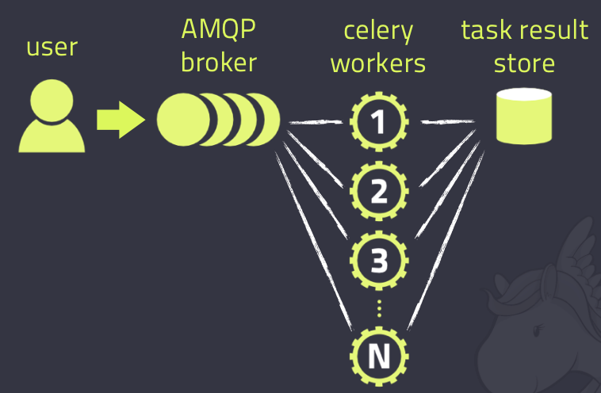

1

# 简介

Celery 是 Distributed Task Queue，分布式任务队列，

分布式决定了可以有多个 worker 的存在，

队列表示其是异步操作，

即存在一个产生任务提出需求的工头，和一群等着被分配工作的码农。


在 Python 中定义 Celery 的时候，我们要引入 Broker，

中文翻译过来就是“中间人”的意思，

在这里 Broker 起到一个中间人的角色。

在工头提出任务的时候，把所有的任务放到 Broker 里面，

在 Broker 的另外一头，一群码农等着取出一个个任务准备着手做。

这种模式注定了整个系统会是个**开环系统**，

工头对于码农们把任务做的怎样是不知情的。

所以我们要**引入 Backend 来保存每次任务的结果。**

这个 Backend 有点像我们的 Broker，也是存储任务的信息用的，

只不过这里存的是那些任务的返回结果。

我们可以选择**只让错误执行的任务返回结果到 Backend**，

这样我们取回结果，便可以知道有多少任务执行失败了。


Celery(芹菜)是一个异步任务队列/基于分布式消息传递的作业队列。

它侧重于实时操作，但对调度支持也很好。

Celery用于生产系统每天处理数以百万计的任务。

Celery是用Python编写的，但该协议可以在任何语言实现。

它也可以与其他语言通过webhooks实现。

**Celery建议的消息队列是RabbitMQ，**

但提供有限支持Redis, Beanstalk, MongoDB, CouchDB, 和数据库（使用SQLAlchemy的或Django的 ORM） 。

Celery是易于集成Django, Pylons and Flask，使用 django-celery, celery-pylons and Flask-Celery 附加包即可。


对于 brokers，官方推荐是 rabbitmq 和 redis，至于 backend，就是数据库。为了简单可以都使用 redis。




Celery的[架构](http://lib.csdn.net/base/architecture)由三部分组成，***消息中间件***（message broker），***任务执行单元\***（worker）和***任务执行结果存储***（task result store）组成。

这里我先不去看它是如何存储的，就先选用redis来存储任务执行结果。


因为涉及到消息中间件（在Celery帮助文档中称呼为中间人<broker>），为了更好的去理解文档中的例子，可以安装两个中间件，一个是RabbitMQ,一个redis。


根据 Celery的帮助文档 安装和设置RabbitMQ, 要使用 Celery，需要创建一个 RabbitMQ 用户、一个虚拟主机，并且允许这个用户访问这个虚拟主机。


# 环境准备

安装rabbitmq

```
 sudo apt-get install rabbitmq-server
```

rabbitmq的具体设置，参考本目录下的《rabbitmq（1）》。

安装celery

```
 python3 -m pip install celery
```

导入了celery，然后创建了celery 实例 app，实例化的过程中指定了任务名`tasks`（和文件名一致），传入了broker和backend。然后创建了一个任务函数`add`。

tasks.py

```
from celery import Celery

broker = 'redis://127.0.0.1:6379/5'
backend = 'redis://127.0.0.1:6379/6'

app = Celery('tasks', broker=broker, backend=backend)

@app.task
def add(x,y):
    return x+y
```


```
celery -A tasks worker --loglevel=info
```


参考资料

1、Python 并行分布式框架 Celery 详解

https://blog.csdn.net/cuomer/article/details/81214438