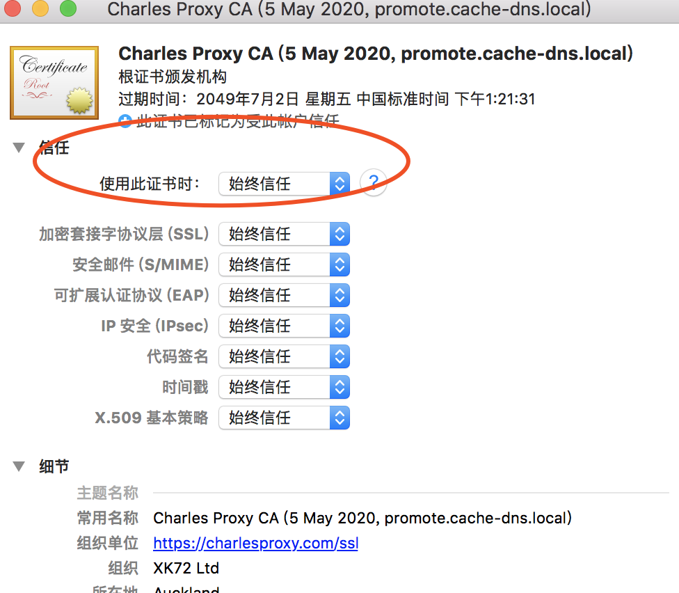

下载地址：<http://www.pc6.com/mac/137987.html>

压缩包里带了破解的方法了。

为了看到https的内容，需要安装一下证书。

点击charles的help — SSL proxy — install charles root certificate

我的macos版本比较新。所以默认是不信任这个证书的。

在证书条目上双击，弹出下面的窗口，点击信任，选择始终信任就可以了。

参考资料

1、Charles使用教程

https://www.jianshu.com/p/fc2f0afa8b56