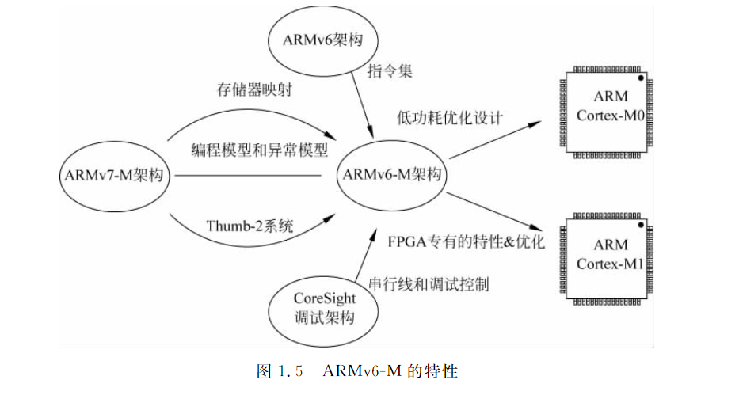

--

我看cortex-m0，主要是因为rp2040是基于这个core的。

而围绕着rp2040有很多资源可以学习使用。

所以，要深入rp2040，需要先把cortex-m0研究透彻。

这个核心也很小，适合作为研究对象。

应该从哪些资源入手？

最权威的应该是对应的官方手册。

先用metaso搜索一下资料。

https://metaso.cn/search/8517285697026527232?q=Cortex%20m0

下面cortex-m0就简称为cm0了。

cm0是一款高性能、低功耗的处理器。

适合低功耗应用。

是一款入门级的arm 32bit控制器。

具有：

* 简易的编程模型。
* 高效的中断处理。
* 出色的功耗管理。
* 极高的代码密度。

cm0基于armv6-m架构。

采用16位的thumb指令集。并包含thumb-2技术。

有32位处理器的性能和8位/16位处理器的代码密度。

cm0处理器有两种模式：

* thread模式。正常模式。
* handler模式。处理异常。

cm0支持多种调试特性：

* swd接口
* jtag接口。

cm0的功耗数据：

* 静态功耗。80uW/MHz
* 动态功耗。88uA/MHz

中断特性：

* NVIC
* 非屏蔽中断
* 零抖动中断。
* 有4个中断优先级。
* 最多32个中断。

cm0的晶体管数量只有12K个左右。

使用的是65nm的工艺。

cortex-m0权威指南

https://img.anfulai.cn/bbs/96973/Cortex-M0%E6%9D%83%E5%A8%81%E6%8C%87%E5%8D%97%EF%BC%88%E4%B8%AD%E6%96%87%E7%89%88%EF%BC%89.pdf