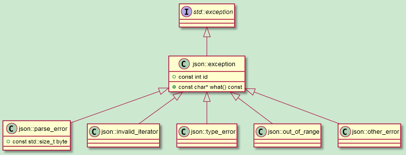

Alexa Auto里用到了json.hpp这个来做json解析。

了解一下json.hpp。

特点是：

```
1、语法直观。
2、只需要包含json.hpp这一个头文件就可以使用。
3、使用c++11语法写成。
4、使用json就像使用STL容器一样。
5、可以跟STL容器进行转换。
```

代码在这里：

https://github.com/nlohmann/json 

```
#include "json.hpp"

using json = nlohmann::json;

void test()
{
    //创建一个json对象。
    json j;
    //添加double类型的数字。
    j["pi"] = 3.14;
    //添加bool值。
    j["happy"] = true;
    //添加字符串
    j["name"] = "xx";
    // 通过传递nullptr传递另外一个对象
    j["nothing"] = nullptr;
    //在对象里添加对象
    j["answer"]["everything"] = 42;
    // 添加一个数组，存储是vector的。
    j["list"] = {1, 0, 2};
    // 在对象里添加另外一个对象。
    j["object"] = {
        {
            "currency","USD" //注意是逗号分隔的。而不是冒号。
        },
        {
            "value", 10.0
        }
    };
    json j2 = {
        {"pi", 3.14,},
        {"happy",true,},
        {"list", {1,2, 3}},
    };
    std::cout << j << std::endl;
    std::cout << j2 << std::endl;
}
```

运行输出：

```
{"answer":{"everything":42},"happy":true,"list":[1,0,2],"name":"xx","nothing":null,"object":{"currency":"USD","value":10.0},"pi":3.14}
{"happy":true,"list":[1,2,3],"pi":3.14}
```


```
std::cout << j.dump(4);
```

效果是这样：

```
{
    "answer": {
        "everything": 42
    },
    "happy": true,
    "list": [
        1,
        0,
        2
    ],
    "name": "xx",
    "nothing": null,
    "object": {
        "currency": "USD",
        "value": 10.0
    },
    "pi": 3.14
}
```


解析

```
auto j3 = json::parse(" { \" happy \":true,\" pi \":3.141} ");
```


```
void test2()
{
    std::vector < uint8_t > v = {'t','r','u','e'};
    json j = json::parse(v);
    std::cout << j.dump(4) << std::endl;
}
```

这样得到是是“true”这个词。


容器相关操作

```
void test3()
{
    json j;
    j.push_back("foo");
    j.push_back(1);
    j.push_back(true);
    j.emplace_back(1.78);
    // 使用迭代器访问
    for(json::iterator it = j.begin(); it != j.end(); it++) {
        std::cout << *it << std::endl;
    }
    // 基于范围的for循环
    for(auto& element : j) {
        std::cout << element << std::endl;
    }
    // 下标操作
    std::string str1 = j[0];
    j[1] = 2;
    j.at(2) = false;
    // 比较操作。这个不太懂。
    std::cout << (j == "[\"foo\", 1, true]"_json) << std::endl;

    // 其他操作
    std::cout << j.size() << std::endl;
    // j.type()  ;
    // j.empty() ;
    // j.clear();
    std::cout << j.dump(4) << std::endl;
}
```


如果要读源代码，就到github上多个头文件的版本。这个会清晰一下，单独一个头文件的很难读。

https://github.com/nlohmann/json

这个的复杂度，也不亚于rapidjson。


# 创建json对象

## 使用cin来输入

这个需要注意的是输入要ctrl+d来结束。

## 键值对赋值

```
// 创建一个json对象(null)
    json j;

    //添加一个存储为double的数字
    j["pi"] = 3.141;

```

## 这样更好

```
json j2 = {
  {"pi", 3.141},
  {"happy", true},
  {"name", "Niels"},
  {"nothing", nullptr},
  {"answer", {
    {"everything", 42}
  }},
  {"list", {1, 0, 2}},
  {"object", {
    {"currency", "USD"},
    {"value", 42.99}
  }}
};
```

我用这个架子来填充内容就好了。

```
json j2 =
        {
            {
                "directive",
                {
                    {
                        "header",
                        {
                            {"namespace", "AudioPlayer"},
                            {"name", "Play"},
                        },
                    },
                    {
                        "payload",
                        {
                            {"deviceId", "1sddddd"}
                        }
                    }
                }
            }
        };
```


# 把json对象转成字符串

```
std::string s = j.dump(); 
```

# 把字符串转成json对象

这样来手动生成一个json对象。

```
// or even nicer with a raw string literal
auto j2 = R"(
  {
    "happy": true,
    "pi": 3.141
  }
)"_json;
```

解析函数：

```
auto j = json::parse(str);
```


# 获取json对象里的内容

```
mylogd("%s", j["name"].get<std::string>().c_str());
```

# 查找

```
可以用三种方式  find/at/下标

j_object.find("two");
json k = j.at("non-existing");
```


# 异常




```
类：
	json
函数：
	对象检测：
        j.dump()
        j.type()
        j.is_null(),j.is_number(),...
	访问值
		j.get()
			返回当前对象。
		j.get_ptr()
			返回当前对象指针。
		j.get_ref()
			返回当前对象的引用。
		j.value("name", 0);//获取key为name的值，如果没有，则返回0 。
		
```


直接操作对象。


# 代码分析

这个代码用了很多高级技巧。值得学习。

## 模板默认值

```
using json = basic_json<>;
```

basic_json是一个复杂模板，但是里面的类型，都给了默认值，所以可以不填入模板类型。


# 参考资料

1、json for modern c++的使用

https://blog.csdn.net/fengxinlinux/article/details/71037244

2、

https://nlohmann.github.io/json/home/exceptions/

https://nlohmann.github.io/json/doxygen/

3、

https://blog.csdn.net/wphkadn/article/details/97417700

4、

https://www.jianshu.com/p/69e57f2af904