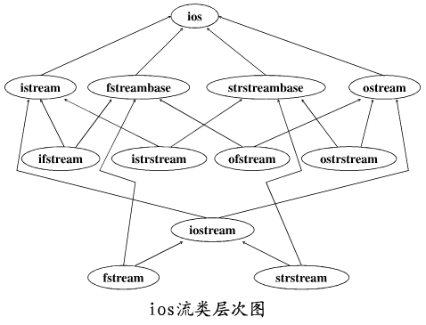
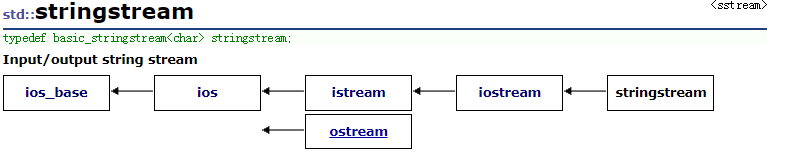

1

C++语言开发了自己的IO流类库，用以取代C语言的基本输入输出函数族。

对于有经验的C程序员来说，C语言提供的IO函数库时有效且方便的。

但是，C语言的IO函数库有其自身的缺点，特别是在C++这种面向对象的程序设计语言中，

C语言函数库无法直接支持面向对象的程序设计。

因此，C++语言开发自己的IO流类库是必然的。

具体来说，IO流类库具有以下优点。

**（1）简明与可读性** 

IO流类库用IO运算符（提取运算符>>和插入运算符<<）代替了不同的输入输出函数名，如printf和scanf等。从直观来看，这种改变使得IO语句更为简明。另外，也减轻了程序员在记忆函数名和书写程序上的一些负担。

**（2）类型安全（type safe）**

所谓类型安全，是指编译器所理解的数据实体（如变量。指针所指向的数据等）的类型，与实际数据实体的实际类型或对该数据所进行的操作之间保持一致性。

在进行IO操作时，编译器将自动检查实参的表达式类型来调用IO流类相应的重载版本的成员函数，来完成输入输出。

而采用C的IO函数，必须显示指明操作的数据类型，如采用printf（）函数，由于其参数中的数据类型必须由程序员以参数格式%d，%f，%c，%s，容易出错。


**（3）易于扩充**

C++语言的IO流类库，是建立在类的继承关系、模板和操作符重载等机制的基础上的。

把原来C语言中的左、右移位运算符<<和>>，通过运算符重载的方法，定 义为插入（输出）和提取（输入）运算符。

这就为输入输出功能对于各种用户定义的类型数据的扩充，创造了方便的条件。


ios类及其派生类是在streambuf类实现的通过缓冲区的信息交换的基础上，

进一步增加了各种格式化的输入/输出控制方法。

它们为用户提供使用流类的接口，**它们均有一个指向streambuf的指针。**





 从上图看， 实际上可以把IO类分为三类：

1. iostream类： 负责与控制台输入输出打交道， 这个我们已经很熟悉了。  注意： 实际具体又可以区分为：istream和ostream

   2. fstream类：  负责与文件输入输出打交道， 这个我们接触过。 注意： 实际具体又可以区分为：ifstream和ofstream

3. stringstream类：负责与string上的输入输出打交道， 这个我们暂时还真没用过。 注意： 实际具体又可以区分为：istringstream和ostringstream。


C++中把数据之间的传输操作称为流，

流既可以表示数据从内存传送到某个载体或设备中，即输出流，

也可以表示数据从某个载体或设备传送到内存缓冲区变量中，即输入流。


C++流涉及以下概念：

- 标准I/O流：内存与标准输入输出设备之间信息的传递；
- 文件I/O流：内存与外部文件之间信息的传递；
- 字符串I/O流：内存变量与表示字符串流的字符数组之间信息的传递

输入流

```
istream
	输入流基类。
ifstream
	文件输入流。
istrstream
	基于char* 的字符串输入流。
istringstream
	基于string的字符串输入流。
	
```

输出流的也类似。

对于串流，提供了两套类，一个基于C类型字符串char *编写（定义于头文件strstream）,一个基于std::string编写（定义于sstream), 后者是C++标准委员会推荐使用的。 


注意，<sstream>使用string对象来代替字符数组。这样可以避免缓冲区溢出的危险。

而且，传入参数和目标对象的类型被自动推导出来，即使使用了不正确的格式化符也没有危险。

string到int的转换
string result=”10000”;
int n=0;
stream<<result;
stream>>n;//n等于10000

复利用stringstream对象

如果你打算在多次转换中使用同一个stringstream对象，记住再每次转换前要使用clear()方法；


ios头文件包括的内容有：

类模板

```
basic_ios
fpos
	这个是表示stream pos的类模板
```

类

```
ios
ios_base
```

basic_ios的成员有：

```
state相关
    good()
        判断一个stream是否是好的。
    eof()
        是否到末尾了。
    fail()
    bad()
	clear()
格式化
	fill
	copyfmt
	
```

ios_base 这个是最基础的类，它没有public的构造方法，所以不能有这种类型的实例。

# stringstream

<sstream> 定义了三个类：istringstream、ostringstream 和 stringstream，分别用来进行流的输入、输出和输入输出操作。本文以 stringstream 为主，介绍流的输入和输出操作。

## 数据类型转换

```
std::stringstream ss;
std::string result;
int a = 100;
ss << a;
ss >> result;//把int类型转成了string类型。
```

## 字符串拼接

本示例介绍在 stringstream 中存放多个字符串，实现多个字符串拼接的目的（其实完全可以使用 string 类实现），同时，介绍 stringstream 的清空方法。

如果想清空 stringstream，必须使用 sstream.str(""); 方式；clear() 方法适用于进行多次数据类型转换的场景。

clear()重置流的标志状态；str()清空流的内存缓冲，重复使用内存消耗不再增加！


stringstream是ostream的子类。



```
std::stringstream ss;
    ss.write("123", 4);
    mylogd("%s", ss.str().c_str());
```


参考资料

1、浅谈C++ IO流

https://www.jb51.net/article/193805.htm

2、

https://liam.page/2017/12/31/buffer-of-stream-in-Cpp/

3、C++ 流（stream）总结

https://blog.csdn.net/luguifang2011/article/details/40979231

4、官网

http://cplusplus.com/reference/ios/

5、stringstream常见用法介绍

https://blog.csdn.net/liitdar/article/details/82598039