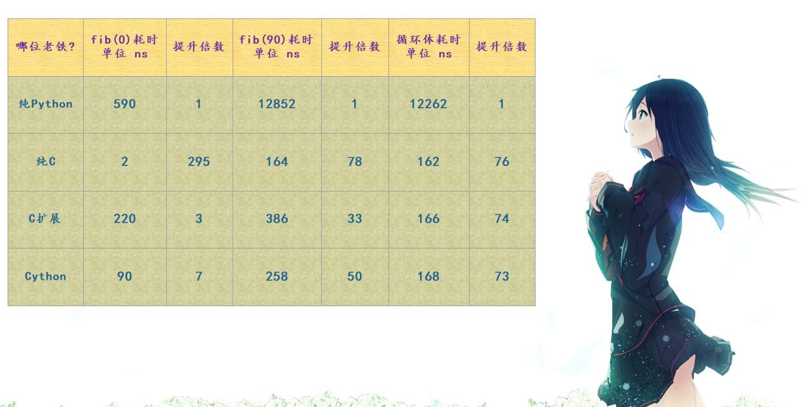

# cython基本信息

Cython 是一门编程语言，它将 C、C++ 的静态类型系统融合在了 Python 身上。

没错，Cython 是一门编程语言，文件的后缀是 .pyx，它是 Python 的一个超集；语法是 Python 语法和 C 语法的混血，当然我们说它是 Python 的一个超集，因此你写纯 Python 代码也是可以的。


但是 Python 和 C 系语言大相径庭，为什么要将它们融合在一起呢？

答案是：因为这两者并不是对立的，而是互补的。

Python 是高阶语言、动态、易于学习，并且灵活。

但是这些优秀的特性是需要付出代价的，因为Python的动态性、以及它是解释型语言，

导致其运行效率比静态编译型语言慢了好几个数量级。


而 C 语言是最古老的静态编译型语言之一，并且至今也被广泛使用。

从时间来算的话，其编译器已有将近半个世纪的历史，在性能上做了足够的优化，

因此 C 语言是非常低级、同时又非常强大的。


然而不同于 Python 的是，C 语言没有提供保护措施（没有 GC、容易内存泄露），以及使用起来很不方便。

所以两个语言都是主流语言，只是特性不同使得它们被应用在了不同的领域。

而Cython 的美丽之处就在于：

它将 Python 语言丰富的表达能力、动态机制和 C 语言的高性能汇聚在了一起，并且代码写起来仍然像写 Python 一样。


我们其实可以将 Cython 当成两个身份来看待：

如果将 Python 编译成 C，那么可以看成 Cython 的 '阴'；

如果将 Python 作为胶水连接 C 或者 C++，那么可以看成是 Cython 的 '阳'。

我们可以从需要高性能的 Python 代码开始，也可以从需要一个优化的 Python 接口的 C、C++ 开始，而我们这里是为了学习 Cython，因此显然是选择前者。

为了加速 Python 代码，Cython 将使用可选的静态类型声明并通过算法来实现大量的性能提升，尤其是静态类型系统，这是实现高性能的关键。


**最后来看看如何使用 Cython 来编写斐波那契，你觉得使用 Cython 编写的代码应该是一个什么样子的呢？**

```python
def fib(int n):
    cdef int i
    cdef double a = 0.0, b = 1.0
    for i in range(n):
        a, b = a + b, a
    return a
```

**怎么样，代码和 Python 是不是很相似呢？虽然我们现在还没有正式学习 Cython 的语法，但你也应该能够猜到上面代码的含义是什么。我们使用 cdef 关键字定义了一个 C 级别的变量，并声明了它们的类型。**





# windows下安装cython

```
pip install cython
```


# 参考资料

1、《Cython系列》1. Cython 是什么？为什么要有 Cython？为什么我们要用 Cython？ 

https://www.cnblogs.com/traditional/p/13196509.html