--

我觉得还是有必要把css研究一下。

tailwind我觉得比较符合我的需求，够用了。

简单直观。


# 简介

Tailwind CSS是一个高度可定制的CSS框架，

它专注于==提供原子级的CSS类==来构建界面。

与传统的CSS框架（如Bootstrap）不同，

==Tailwind CSS不提供预定义的组件，==

而是提供一系列小型、独立的CSS类，

每个类都代表一个具体的样式规则，例如颜色、间距、字体大小等。

使用Tailwind CSS，你可以通过组合这些类来快速构建出各种样式，==而无需编写自定义的CSS。==

这种原子级的方法使得界面开发更加灵活，因为你可以精确控制每个元素的样式，而无需担心与其他样式的冲突。

Tailwind CSS还提供了==一套可配置的插件系统，==

可以通过配置文件轻松定制主题、添加自定义样式或者禁用不需要的默认样式。

这使得Tailwind CSS非常适合团队合作，因为可以根据项目需求进行定制，而不必担心增加额外的样式文件的冲突。

总的来说，Tailwind CSS是一个强大的工具，可以帮助开发人员快速构建出现代化的、高度定制的界面，而无需牺牲灵活性和可维护性。

# 发展历史

Tailwind CSS的发展历史可以追溯到2017年。以下是关键的发展节点：

1. **创建：** Tailwind CSS由Adam Wathan、Jonathan Reinink和David Hemphill共同创建。最初的灵感来自于他们对CSS的繁琐性和重复性工作的不满，他们想要一个更灵活、更快速的解决方案来构建界面。

2. **发布初版：** Tailwind CSS的首个版本于2017年9月发布。这个版本包含了一组基本的原子级CSS类，如颜色、间距、字体等，但缺乏许多后续版本中新增的功能和优化。

3. **不断改进：** 随着时间的推移，Tailwind CSS不断改进和发展。开发团队通过收集用户反馈、解决bug以及添加新功能来逐步完善框架。

4. **社区增长：** 随着时间的推移，Tailwind CSS的社区开始迅速增长。越来越多的开发人员开始尝试并采用Tailwind CSS，同时也为框架的改进和推广做出贡献。

5. **版本升级：** Tailwind CSS在不同的版本中引入了许多重要的改进和新功能。例如，版本1.0引入了JIT编译器，大大提高了构建性能；版本2.0引入了许多新的实用工具类和插件系统，使框架更加强大和灵活。

6. **生态系统的发展：** 除了框架本身，Tailwind CSS的生态系统也在不断发展壮大。出现了许多与Tailwind CSS配套的工具、插件和扩展，如代码编辑器插件、组件库、模板等，为开发人员提供了更多的选择和便利。

总的来说，Tailwind CSS经历了持续的改进和发展，成为了一个强大、灵活的CSS框架，并吸引了广泛的用户群和活跃的社区。其发展历程也展示了开发者对于简化CSS开发流程和提高工作效率的不断追求和创新。

# 怎样快速入门

快速入门Tailwind CSS并开始构建你的项目需要以下几个步骤：

1. **安装Tailwind CSS：** 你可以通过几种方式安装Tailwind CSS，包括使用npm或yarn进行安装，或者使用CDN链接直接引入。推荐的方法是通过npm或yarn进行安装，因为这样可以更轻松地管理依赖和版本。

   ```
   npm install tailwindcss
   ```

2. **配置Tailwind CSS：** 在你的项目中创建一个Tailwind CSS配置文件，可以使用`npx tailwindcss init`命令来生成一个默认的配置文件，然后根据需要进行自定义配置。配置文件允许你定制主题、添加自定义颜色、间距和字体等。

   ```
   npx tailwindcss init
   ```

3. **集成到项目中：** 确保在你的项目中正确引入Tailwind CSS。如果你使用的是构建工具如Webpack或Parcel，你需要在构建流程中添加Tailwind CSS的处理器来处理CSS文件。如果你使用的是CDN链接，直接在HTML文件中引入即可。

4. **开始使用：** 一旦Tailwind CSS被成功集成到你的项目中，你就可以开始使用它了。在HTML文件或React/Vue组件中，通过添加Tailwind CSS的类来设置样式。你可以查看Tailwind CSS的文档，了解它提供的各种类和样式规则，以便更好地利用它。

5. **练习和实践：** 最重要的一步是练习和实践。创建一些简单的界面或组件，并尝试使用Tailwind CSS来构建它们。随着你的实践和经验的积累，你会越来越熟悉Tailwind CSS的使用方式，并能够更快地构建出复杂的界面。

6. **参考文档和社区资源：** 在学习过程中，及时查阅Tailwind CSS的官方文档和社区资源是很重要的。官方文档提供了详细的说明和示例，而社区资源（如博客、论坛、社交媒体等）则可以帮助你了解更多实践经验和最佳实践。

通过以上步骤，你应该能够快速入门Tailwind CSS，并开始在你的项目中使用它来构建灵活、高度定制的界面。

# 搭建本地测试环境

要在项目中引入Tailwind CSS，通常需要几个步骤：

1. **安装Tailwind CSS：** 通过npm或者yarn安装Tailwind CSS到你的项目中。

```bash
npm install tailwindcss
```

2. **创建配置文件：** 使用 `npx` 命令来生成一个默认的Tailwind CSS配置文件。

```bash
npx tailwindcss init
```

3. **引入Tailwind CSS：** 在你的CSS文件中引入Tailwind CSS。你可以通过以下方式之一引入：

   - 使用 `@import` 导入Tailwind CSS的全部样式：

   ```css
   @import 'tailwindcss/base';
   @import 'tailwindcss/components';
   @import 'tailwindcss/utilities';
   ```

   - 或者，如果你使用的是CSS预处理器（如Sass或Less），你可以在你的预处理器文件中导入Tailwind CSS：

   ```scss
   @import 'tailwindcss/base';
   @import 'tailwindcss/components';
   @import 'tailwindcss/utilities';
   ```

   ```less
   @import 'tailwindcss/base';
   @import 'tailwindcss/components';
   @import 'tailwindcss/utilities';
   ```

4. **使用Tailwind CSS类：** 一旦Tailwind CSS被引入到你的项目中，你就可以在HTML文件或者其他CSS文件中使用Tailwind CSS提供的类来设置样式了。

例如，在HTML文件中：

```html
<div class="bg-blue-500 text-white p-4 rounded-lg">Hello, Tailwind CSS!</div>
```

这样就会创建一个背景色为蓝色、文字颜色为白色、带有内边距、圆角边框的 `<div>` 元素。

5. **构建和处理CSS文件：** 最后，在构建过程中，确保你的CSS文件被处理并正确地包含了Tailwind CSS的样式。如果你使用的是构建工具如Webpack或Parcel，你可能需要添加相应的loader或者插件来处理CSS文件。如果你使用的是简单的HTML文件，你可能需要手动编译CSS文件或者使用在线编译工具。

通过以上步骤，你应该能够在你的项目中成功引入并开始使用Tailwind CSS。

# 给我一个完整的基于nodejs的测试tailwind的环境示例

以下是一个基于Node.js的测试Tailwind CSS的简单环境示例：

1. **创建项目文件夹：** 在你的计算机上创建一个新的文件夹，用于存放项目文件。

```bash
mkdir tailwind-test
cd tailwind-test
```

2. **初始化项目：** 在项目文件夹中初始化一个新的Node.js项目。

```bash
npm init -y
```

3. **安装Tailwind CSS：** 使用npm安装Tailwind CSS到项目中。

```bash
npm install tailwindcss
```

4. **创建配置文件：** 使用 `npx` 命令生成一个默认的Tailwind CSS配置文件。

```bash
npx tailwindcss init
```

5. **创建HTML文件：** 在项目文件夹中创建一个HTML文件，用于测试Tailwind CSS。

```html
<!-- index.html -->
<!DOCTYPE html>
<html lang="en">
<head>
    <meta charset="UTF-8">
    <meta name="viewport" content="width=device-width, initial-scale=1.0">
    <title>Tailwind CSS Test</title>
    <!-- 引入 Tailwind CSS -->
    <link href="styles.css" rel="stylesheet">
</head>
<body>
    <div class="bg-blue-500 text-white p-4 rounded-lg">
        Hello, Tailwind CSS!
    </div>
</body>
</html>
```

6. **创建CSS文件：** 在项目文件夹中创建一个CSS文件，用于引入和处理Tailwind CSS样式。

```css
/* styles.css */
@import 'tailwindcss/base';
@import 'tailwindcss/components';
@import 'tailwindcss/utilities';
```

7. **运行测试：** 在项目文件夹中启动一个本地服务器，并在浏览器中打开测试页面。

```bash
npx http-server
```

现在，你可以在浏览器中访问 `http://localhost:8080`，应该能够看到一个带有蓝色背景、白色文字、圆角边框的 `<div>` 元素，这个元素是由Tailwind CSS提供的样式设置的。这证明了你已经成功地测试了Tailwind CSS的环境。

##  npx http-server 解释

`npx http-server` 是一个命令，用于在当前目录启动一个简单的HTTP服务器。下面是对该命令的解释：

- **npx：** npx 是 npm 包执行工具，用于执行安装在项目中的 npm 包或者直接从 npm 仓库中临时安装并执行包。它的作用是为了解决在不安装全局包的情况下执行包的问题。

- **http-server：** http-server 是一个简单的Node.js HTTP服务器，它可以方便地在本地快速启动一个静态文件服务器。它默认将当前目录作为静态文件根目录，并监听默认的端口8080。当你运行 `npx http-server` 时，它会在当前目录启动一个HTTP服务器，然后你可以通过浏览器访问 `http://localhost:8080` 来访问当前目录下的文件。

综合起来，`npx http-server` 命令的作用是在当前目录启动一个HTTP服务器，方便你在本地测试静态文件，如HTML、CSS和JavaScript文件。

# 更简单一点的环境搭建

写一个html文件：

```
<!-- index.html -->
<!DOCTYPE html>
<html lang="en">
<head>
    <meta charset="UTF-8">
    <meta name="viewport" content="width=device-width, initial-scale=1.0">
    <title>Tailwind CSS Test</title>
    <!-- 引入 Tailwind CSS -->
    <!-- <link href="styles.css" rel="stylesheet"> -->
    <link href="https://cdn.jsdelivr.net/npm/tailwindcss@2.2.19/dist/tailwind.min.css" rel="stylesheet">

</head>
<body>
    <div class="bg-blue-500 text-white p-4 rounded-lg">
        Hello, Tailwind CSS!
    </div>
</body>
</html>

```

然后启动http server：

```
python3 -m http.server 8080 
```

也可以看到效果。

# tailwind学习步骤

学习Tailwind CSS的步骤可以按以下方式进行：

1. **理解核心概念：** 开始之前，确保你理解Tailwind CSS的核心概念，包括原子级类、响应式设计、实用工具类等。可以阅读官方文档或者参考相关教程来了解这些概念。

2. **安装和配置：** 在你的项目中安装和配置Tailwind CSS。使用npm或者yarn安装Tailwind CSS，并通过 `npx tailwindcss init` 命令生成默认配置文件，并根据需要进行定制。

3. **文档和示例：** 详细阅读Tailwind CSS的官方文档，并尝试在自己的项目中应用文档中的示例。文档提供了丰富的样式类和示例，可以帮助你快速理解和掌握Tailwind CSS的用法。

4. **实践项目：** 选择一个小型项目或者练习，开始使用Tailwind CSS构建界面。通过实际的项目练习，你可以更深入地理解Tailwind CSS的使用方式，并掌握一些实用技巧和最佳实践。

5. **进阶学习：** 一旦你熟悉了基本的Tailwind CSS用法，可以继续学习一些进阶的主题，如自定义主题、插件开发、响应式设计、组件库集成等。官方文档中也提供了一些进阶主题的详细说明和示例。

6. **阅读博客和社区：** 在Tailwind CSS的官方博客、论坛、社交媒体等社区平台上，可以找到许多有关Tailwind CSS的实践经验、技巧和最新动态。阅读和参与社区讨论可以帮助你不断提升自己的技能，并了解到更多有用的信息。

7. **持续实践和反馈：** 最重要的是持续实践和不断反馈。通过不断地尝试、练习和构建项目，你可以逐渐掌握Tailwind CSS的各种技巧和工具，并且发现并解决遇到的问题。

通过以上步骤，你应该能够逐步掌握Tailwind CSS，并在实际项目中应用它来构建灵活、高效的界面。

# tailwind核心概念

Tailwind CSS 的核心概念主要包括以下几个方面：

1. **原子级类 (Atomic Classes)：** Tailwind CSS 提供了大量原子级的 CSS 类，每个类都代表一个具体的样式规则，如颜色、边框、间距、字体大小等。通过组合这些类，你可以快速构建出各种样式，而无需手写自定义的 CSS。

2. **响应式设计 (Responsive Design)：** Tailwind CSS 支持响应式设计，可以根据不同的屏幕尺寸应用不同的样式。你可以通过在类名中添加前缀来指定在特定屏幕尺寸下生效的样式，例如 `sm:`、`md:`、`lg:`、`xl:` 等。

3. **实用工具类 (Utility Classes)：** 除了基本的样式类外，Tailwind CSS 还提供了一些实用的工具类，用于处理一些常见的布局和效果问题，如清除浮动、隐藏元素、定位等。

4. **定制主题 (Customization)：** Tailwind CSS 允许你通过配置文件来定制主题，包括颜色、字体、间距、边框等。你可以根据项目的需求定制自己的主题，而无需编写大量的自定义 CSS。

5. **插件系统 (Plugin System)：** Tailwind CSS 提供了一个灵活的插件系统，可以通过插件来扩展框架的功能或者添加自定义样式。你可以使用官方插件或者编写自己的插件来满足特定的需求。

6. **层叠性 (Layering)：** Tailwind CSS 的样式类是可叠加的，即可以同时应用多个类来叠加样式，而不会发生样式冲突。这种层叠性使得你可以精确地控制每个元素的样式，而不必担心样式的优先级问题。

总的来说，Tailwind CSS 的核心概念是基于原子级类、响应式设计、实用工具类等，以及可定制的主题和插件系统。通过这些核心概念，你可以快速构建灵活、高效的界面，而无需编写大量的自定义 CSS。

## Atomic Classes 说明

原子级类（Atomic Classes）是Tailwind CSS的核心特性之一。它的设计理念是将CSS样式分解成小的、独立的部分，并通过类来表示每个样式规则，从而实现高度灵活和可复用的样式定义。以下是关于原子级类的说明：

1. **每个类代表一个样式规则：** 在Tailwind CSS中，每个类都代表一个具体的样式规则，例如颜色、字体大小、边框等。这些类名通常由一个或多个单词组成，描述了它们所应用的样式，如`bg-blue-500`表示背景色为蓝色的类，`text-lg`表示文本大小为大的类。

2. **组合类来构建样式：** 通过在HTML元素的class属性中组合多个原子级类，你可以构建出各种复杂的样式。例如，`

```html
<div class="bg-blue-500 text-white p-4 rounded-lg">Hello, Tailwind CSS!</div>
```

在这个例子中，我们使用了`bg-blue-500`来设置背景颜色为蓝色，`text-white`来设置文本颜色为白色，`p-4`来设置内边距为4个间距单位，`rounded-lg`来设置圆角边框为大的值。通过组合这些类，我们创建了一个具有特定样式的 `<div>` 元素。

3. **可重复使用和可组合性：** 原子级类的设计使得样式定义变得高度可重复使用和可组合。你可以轻松地将不同的样式组合起来，创建出各种各样的界面元素，而无需重复编写相似的样式定义。

4. **易于阅读和维护：** 原子级类的命名通常很直观和描述性，使得代码易于阅读和理解。此外，由于每个类只代表一个具体的样式规则，因此修改样式时也更加直观和容易。

总的来说，原子级类是Tailwind CSS的一项重要特性，它提供了一种新的方式来定义和应用CSS样式，使得界面开发更加灵活、高效和可维护。

### Atomic Classes 所有的命名

Tailwind CSS 的原子级类包含了大量的命名，覆盖了各种常见的样式规则。以下是一些常用的原子级类及其命名示例：

1. **背景颜色 (Background Colors)：**
   - `bg-red-500`
   - `bg-blue-700`
   - `bg-green-400`
   - `bg-yellow-300`

2. **文本颜色 (Text Colors)：**
   - `text-white`
   - `text-black`
   - `text-gray-800`
   - `text-indigo-600`

3. **字体大小 (Font Sizes)：**
   - `text-xs`
   - `text-sm`
   - `text-base`
   - `text-lg`

4. **内边距 (Padding)：**
   - `p-2`
   - `p-4`
   - `p-6`
   - `py-3` (上下内边距)
   - `px-5` (左右内边距)

5. **外边距 (Margin)：**
   - `m-2`
   - `m-4`
   - `m-6`
   - `my-3` (上下外边距)
   - `mx-5` (左右外边距)

6. **圆角 (Border Radius)：**
   - `rounded-sm`
   - `rounded-md`
   - `rounded-lg`
   - `rounded-full`

7. **边框 (Border)：**
   - `border`
   - `border-2`
   - `border-solid`
   - `border-dashed`

8. **阴影 (Box Shadow)：**
   - `shadow-sm`
   - `shadow-md`
   - `shadow-lg`
   - `shadow-xl`

9. **定位 (Positioning)：**
   - `absolute`
   - `relative`
   - `fixed`
   - `static`

以上是一些常见的原子级类及其命名示例，Tailwind CSS 还提供了更多的类来覆盖更多样式规则，你可以在官方文档中找到完整的类名列表。

## Tailwind CSS 支持响应式

是的，Tailwind CSS 提供了强大的响应式设计功能，可以轻松地创建适配不同屏幕尺寸的界面。它通过使用响应式前缀来实现不同屏幕尺寸下的样式控制。

下面是 Tailwind CSS 支持的常用的响应式前缀及对应的屏幕尺寸：

- `sm:`: 表示在小屏幕（>= 640px）及以上生效。
- `md:`: 表示在中等屏幕（>= 768px）及以上生效。
- `lg:`: 表示在大屏幕（>= 1024px）及以上生效。
- `xl:`: 表示在超大屏幕（>= 1280px）及以上生效。

例如，如果你想在小屏幕以上使用大字体，你可以这样写：

```html
<div class="text-lg sm:text-xl">Responsive text</div>
```

这个例子中，`text-lg` 表示在所有屏幕尺寸上都会应用大字体样式，而 `sm:text-xl` 则表示在小屏幕及以上的屏幕尺寸上会将字体大小调整为更大的尺寸。

使用响应式设计可以使你的界面更具弹性和适配性，可以根据不同设备的屏幕尺寸提供最佳的用户体验。Tailwind CSS 提供的响应式功能非常灵活，可以让你轻松实现这一目标。

## tailwind的常用实用工具类

Tailwind CSS 提供了许多实用工具类，用于处理一些常见的布局、效果和交互问题。以下是一些常用的实用工具类及其功能：

1. **显示和隐藏：**
   - `hidden`: 隐藏元素。
   - `block`: 显示元素为块级。
   - `inline-block`: 显示元素为行内块。
   - `flex`: 显示元素为弹性盒子。
   - `inline-flex`: 显示元素为内联弹性盒子。

2. **定位：**
   - `absolute`: 绝对定位。
   - `relative`: 相对定位。
   - `fixed`: 固定定位。
   - `static`: 静态定位。

3. **清除浮动：**
   - `clearfix`: 清除浮动。

4. **边框和圆角：**
   - `border`: 添加边框。
   - `rounded`: 添加圆角。
   - `border-radius`: 设置圆角大小。
   - `border-collapse`: 边框合并。
   - `border-separate`: 边框分离。

5. **文本样式：**
   - `uppercase`: 转换为大写。
   - `lowercase`: 转换为小写。
   - `capitalize`: 首字母大写。
   - `truncate`: 截断文本。
   - `break-normal`: 正常换行。
   - `break-words`: 长单词换行。
   - `whitespace-normal`: 正常空白处理。

6. **浮动和清除浮动：**
   - `float-left`: 左浮动。
   - `float-right`: 右浮动。
   - `clear-left`: 清除左浮动。
   - `clear-right`: 清除右浮动。
   - `clear-both`: 清除两侧浮动。

7. **隐藏滚动条：**
   - `overflow-hidden`: 隐藏滚动条。

8. **背景样式：**
   - `bg-cover`: 背景图片填充。
   - `bg-center`: 背景图片居中。
   - `bg-no-repeat`: 背景图片不重复。

9. **宽度和高度：**
   - `w-auto`: 自动宽度。
   - `h-auto`: 自动高度。

10. **间距和填充：**
    - `m-auto`: 外边距自动。
    - `p-auto`: 内边距自动。

以上是一些常用的实用工具类，Tailwind CSS 还提供了更多的类来解决各种布局和样式问题。你可以根据项目的需求和设计要求选择合适的工具类来实现所需的效果。

## tailwind定制主题

定制主题是 Tailwind CSS 中非常强大的功能之一，它允许你根据项目的需求自定义颜色、字体、间距、边框等样式，并生成对应的 CSS 文件。以下是定制主题的一般步骤：

1. **生成配置文件：** 如果你还没有配置文件，可以通过以下命令生成一个默认的配置文件。

```bash
npx tailwindcss init
```

2. **编辑配置文件：** 打开生成的 `tailwind.config.js` 文件，你可以在这个文件中自定义各种样式选项。一些常用的配置选项包括：

   - `theme.colors`: 定义颜色，可以是命名颜色、十六进制颜色、RGB颜色等。
   - `theme.fontFamily`: 定义字体系列。
   - `theme.spacing`: 定义间距大小。
   - `theme.borderWidth`: 定义边框宽度。
   - `theme.borderRadius`: 定义边框圆角大小。
   - `theme.fontSize`: 定义字体大小。
   - 等等。

3. **定制主题：** 根据项目的需求修改配置文件中的各个选项，添加或者删除不需要的样式定义。

4. **生成样式文件：** 一旦你完成了配置文件的修改，运行以下命令生成对应的 CSS 文件。

```bash
npx tailwindcss build -o output.css
```

将 `output.css` 替换为你想要输出的文件名。这个文件包含了根据你的定制主题生成的所有样式。

5. **在项目中使用：** 将生成的 CSS 文件引入到你的项目中，在需要的地方使用定制的样式类即可。

通过定制主题，你可以根据项目的需求快速定制出符合设计要求的样式，并且保持 Tailwind CSS 的灵活性和易用性。

## tailwin的插件系统

Tailwind CSS 的插件系统允许开发者通过编写插件来扩展框架的功能或者添加自定义样式。这个插件系统非常灵活，可以用于添加新的工具类、扩展现有工具类、应用自定义样式等。以下是关于 Tailwind CSS 插件系统的一些重要信息：

1. **插件的类型：** Tailwind CSS 插件可以分为两种类型：简单插件和完整插件。
   - **简单插件（Simple Plugin）：** 简单插件主要用于添加新的工具类或者修改现有的工具类，通常只需要提供一个 JavaScript 函数来实现插件功能。
   - **完整插件（Complete Plugin）：** 完整插件通常包含了一组样式、配置文件和 JavaScript 代码，可以实现更复杂的功能或者添加更多的定制选项。

2. **插件的开发：** 开发 Tailwind CSS 插件通常涉及以下几个步骤：
   - 编写 JavaScript 代码：实现插件的功能，如添加新的工具类或者修改现有的工具类。
   - 编写配置文件（可选）：如果插件需要用户配置选项，可以提供一个配置文件，以便用户自定义插件的行为。
   - 编写样式文件（可选）：如果插件需要提供一些自定义样式，可以编写一个样式文件，并在 JavaScript 代码中引入。

3. **使用插件：** 使用 Tailwind CSS 插件通常需要两个步骤：
   - 安装插件：通过 npm 或者 yarn 安装插件到你的项目中。
   - 配置插件（可选）：如果插件需要配置选项，你可能需要在 Tailwind CSS 配置文件中添加相应的配置项。

4. **官方插件和社区插件：** Tailwind CSS 官方提供了一些常用的插件，如 Typography、Forms、Aspect Ratio 等，这些插件可以通过 npm 直接安装并在项目中使用。此外，还有许多社区维护的插件可供选择，你可以在 GitHub 上找到大量的 Tailwind CSS 插件项目。

通过 Tailwind CSS 的插件系统，你可以实现更多定制化的需求，扩展框架的功能，并且保持 Tailwind CSS 的简洁性和易用性。

# 一步步学习

## 写一个有hove效果的button

```
<button class="bg-blue-500 hover:bg-blue-700 text-white font-bold py-2 px-4 rounded">
    Click me
</button>
```

## 下一步

下一步，我们可以尝试构建一个更加复杂的组件，比如一个带有图标和文本的按钮。我们将使用 Tailwind CSS 提供的工具类来实现这个功能。

### 步骤 1：更新 HTML 结构

我们首先更新 HTML 结构，为按钮添加一个图标和文本。

```html
<button class="flex items-center bg-blue-500 hover:bg-blue-700 text-white font-bold py-2 px-4 rounded">
    <svg class="w-5 h-5 mr-2" fill="currentColor" viewBox="0 0 20 20">
        <path d="M10 12a2 2 0 100-4 2 2 0 000 4z" />
        <path fill-rule="evenodd" d="M10 4a6 6 0 00-6 6v2a6 6 0 0012 0v-2a6 6 0 00-6-6zm2 7v2a4 4 0 11-4 0v-2h4z" clip-rule="evenodd" />
    </svg>
    Click me
</button>
```

在这个按钮中，我们添加了一个 `<svg>` 元素作为图标，并使用了一些新的 Tailwind CSS 类：

- `flex`: 设置按钮的子元素为弹性布局。
- `items-center`: 设置按钮的子元素在主轴上居中对齐。
- `w-5`: 设置图标的宽度为 5 个间距单位。
- `h-5`: 设置图标的高度为 5 个间距单位。
- `mr-2`: 设置图标与文本之间的右边距为 2 个间距单位。

### 步骤 2：预览更新后的按钮

保存 HTML 文件，然后在浏览器中刷新页面，你将看到一个带有图标和文本的按钮。当你将鼠标悬停在按钮上时，背景颜色会变为深蓝色。

通过这个更新后的按钮示例，你已经学会了如何在 Tailwind CSS 中使用弹性布局和图标，以及如何结合使用多个样式类来创建更复杂的组件。在下一步中，我们可以继续探索更多的 Tailwind CSS 功能，或者尝试构建其他类型的组件。

## 下一步

下一步，我们可以尝试构建一个带有不同状态的按钮，比如激活状态和禁用状态。这将帮助我们了解如何使用 Tailwind CSS 中的状态类来管理按钮的不同外观。

### 步骤 1：更新 HTML 结构

我们更新 HTML 结构，为按钮添加激活状态和禁用状态的样式。

```html
<button class="bg-blue-500 hover:bg-blue-700 active:bg-blue-800 disabled:bg-gray-400 text-white font-bold py-2 px-4 rounded">
    Click me
</button>
```

在这个按钮中，我们使用了一些新的 Tailwind CSS 类来表示不同状态下的样式：

- `active:bg-blue-800`: 设置按钮在被点击时的背景颜色为深蓝色。
- `disabled:bg-gray-400`: 设置按钮被禁用时的背景颜色为灰色。

### 步骤 2：预览更新后的按钮

保存 HTML 文件，然后在浏览器中刷新页面，你将看到一个带有激活状态和禁用状态的按钮。当你点击按钮时，背景颜色会变为深蓝色；当你禁用按钮时，背景颜色会变为灰色。

通过这个更新后的按钮示例，你已经学会了如何使用 Tailwind CSS 中的状态类来管理按钮的不同外观。在下一步中，我们可以继续探索更多的 Tailwind CSS 功能，或者尝试构建其他类型的组件。

## 下一步

下一步，我们可以尝试创建一个带有不同大小和样式的输入框组件。这将帮助我们了解如何使用 Tailwind CSS 来创建表单元素并自定义它们的外观。

### 步骤 1：创建输入框组件

我们首先创建一个基本的输入框组件，并添加一些样式来自定义它的外观。

```html
<div class="flex items-center">
    <input type="text" class="border rounded-lg px-3 py-1 mr-2 focus:outline-none focus:border-blue-500" placeholder="Enter your name">
    <button class="bg-blue-500 hover:bg-blue-700 text-white font-bold py-1 px-3 rounded">
        Submit
    </button>
</div>
```

在这个输入框组件中，我们使用了以下 Tailwind CSS 类：

- `border`: 设置边框。
- `rounded-lg`: 设置圆角边框。
- `px-3`: 设置水平方向上的内边距为 3 个间距单位。
- `py-1`: 设置垂直方向上的内边距为 1 个间距单位。
- `focus:outline-none`: 设置输入框获取焦点时不显示外边框。
- `focus:border-blue-500`: 设置输入框获取焦点时的边框颜色为蓝色。

## 下一步

下一步，我们可以尝试创建一个响应式的网格布局，以展示一些内容。这将帮助我们了解如何使用 Tailwind CSS 来构建响应式的布局，并在不同的屏幕尺寸下进行适配。

### 步骤 1：创建网格布局

我们首先创建一个基本的网格布局，并在其中展示一些内容。

```html
<div class="grid grid-cols-1 md:grid-cols-2 lg:grid-cols-3 gap-4">
    <div class="bg-gray-200 p-4 rounded">
        <h2 class="text-lg font-bold mb-2">Card 1</h2>
        <p>This is some content for card 1.</p>
    </div>
    <div class="bg-gray-200 p-4 rounded">
        <h2 class="text-lg font-bold mb-2">Card 2</h2>
        <p>This is some content for card 2.</p>
    </div>
    <div class="bg-gray-200 p-4 rounded">
        <h2 class="text-lg font-bold mb-2">Card 3</h2>
        <p>This is some content for card 3.</p>
    </div>
</div>
```

在这个网格布局中，我们使用了以下 Tailwind CSS 类：

- `grid`: 创建一个网格布局。
- `grid-cols-1`: 在小屏幕上设置为一列。
- `md:grid-cols-2`: 在中等屏幕上设置为两列。
- `lg:grid-cols-3`: 在大屏幕上设置为三列。
- `gap-4`: 设置网格项之间的间距为 4 个间距单位。
- `bg-gray-200`: 设置背景颜色为灰色。
- `p-4`: 设置内边距为 4 个间距单位。
- `rounded`: 设置圆角边框。

## 下一步

下一步，我们可以尝试创建一个响应式的导航栏，这将帮助我们了解如何使用 Tailwind CSS 来构建导航栏，并使其在不同屏幕尺寸下呈现不同的布局。

### 步骤 1：创建导航栏结构

首先，我们创建一个基本的导航栏结构。

```html
<nav class="bg-gray-800 p-4">
    <div class="max-w-7xl mx-auto flex justify-between items-center">
        <div>
            <a href="#" class="text-white font-bold text-lg">Logo</a>
        </div>
        <div>
            <ul class="flex space-x-4">
                <li><a href="#" class="text-white hover:text-gray-300">Home</a></li>
                <li><a href="#" class="text-white hover:text-gray-300">About</a></li>
                <li><a href="#" class="text-white hover:text-gray-300">Services</a></li>
                <li><a href="#" class="text-white hover:text-gray-300">Contact</a></li>
            </ul>
        </div>
    </div>
</nav>
```

在这个导航栏中，我们使用了以下 Tailwind CSS 类：

- `bg-gray-800`: 设置背景颜色为深灰色。
- `p-4`: 设置内边距为 4 个间距单位。
- `max-w-7xl`: 设置最大宽度为 7xl（根据 Tailwind CSS 默认配置，7xl 等于 80rem）。
- `mx-auto`: 设置水平居中对齐。
- `flex`: 设置弹性布局。
- `justify-between`: 在主轴上两端对齐。
- `items-center`: 在交叉轴上居中对齐。
- `text-white`: 设置文本颜色为白色。
- `font-bold`: 设置文本加粗。
- `text-lg`: 设置文本大小为大号。
- `hover:text-gray-300`: 设置鼠标悬停时文本颜色为浅灰色。

### 步骤 2：预览导航栏

保存 HTML 文件，然后在浏览器中刷新页面，你将看到一个简单的响应式导航栏。当你将鼠标悬停在导航链接上时，文本颜色会变为浅灰色。

通过这个导航栏示例，你已经学会了如何使用 Tailwind CSS 创建响应式的导航栏，并且可以根据项目需要对其进行定制。在下一步中，我们可以继续探索更多的 Tailwind CSS 功能，或者尝试构建其他类型的组件。

## 下一步

下一步，我们可以为导航栏添加响应式设计，使其在小屏幕上显示为移动端样式，并在大屏幕上显示为桌面端样式。

### 步骤 1：添加响应式类

我们可以使用 Tailwind CSS 提供的响应式类来实现导航栏的响应式设计。

```html
<nav class="bg-gray-800 p-4">
    <div class="max-w-7xl mx-auto flex justify-between items-center">
        <div>
            <a href="#" class="text-white font-bold text-lg">Logo</a>
        </div>
        <div class="hidden md:block">
            <ul class="flex space-x-4">
                <li><a href="#" class="text-white hover:text-gray-300">Home</a></li>
                <li><a href="#" class="text-white hover:text-gray-300">About</a></li>
                <li><a href="#" class="text-white hover:text-gray-300">Services</a></li>
                <li><a href="#" class="text-white hover:text-gray-300">Contact</a></li>
            </ul>
        </div>
        <div class="md:hidden">
            <!-- 移动端菜单按钮 -->
            <button class="text-white focus:outline-none">
                <svg class="h-6 w-6" fill="none" viewBox="0 0 24 24" stroke="currentColor">
                    <path stroke-linecap="round" stroke-linejoin="round" stroke-width="2" d="M4 6h16M4 12h16m-7 6h7"></path>
                </svg>
            </button>
        </div>
    </div>
</nav>
```

在这个示例中，我们使用了 `hidden md:block` 和 `md:hidden` 这两个响应式类：

- `hidden md:block`：在中等屏幕及以上隐藏该元素，即在小屏幕上隐藏导航链接。
- `md:hidden`：在中等屏幕及以上隐藏该元素，即在小屏幕上显示移动端菜单按钮。

### 步骤 2：预览响应式导航栏

保存 HTML 文件，然后在浏览器中刷新页面，你将看到在小屏幕上，导航链接被隐藏，而移动端菜单按钮显示出来。

通过这个示例，你学会了如何为导航栏添加响应式设计，使其在不同屏幕尺寸下呈现不同的布局。在下一步中，我们可以继续探索 Tailwind CSS 的其他功能，或者尝试构建其他类型的组件。

## 下一步

下一步，我们可以为移动端菜单按钮添加交互功能，使其在点击时显示或隐藏导航链接。

### 步骤 1：添加移动端菜单功能

我们可以使用 JavaScript 来添加移动端菜单按钮的交互功能。

```html
<nav class="bg-gray-800 p-4">
    <div class="max-w-7xl mx-auto flex justify-between items-center">
        <div>
            <a href="#" class="text-white font-bold text-lg">Logo</a>
        </div>
        <div class="hidden md:block">
            <ul class="flex space-x-4">
                <li><a href="#" class="text-white hover:text-gray-300">Home</a></li>
                <li><a href="#" class="text-white hover:text-gray-300">About</a></li>
                <li><a href="#" class="text-white hover:text-gray-300">Services</a></li>
                <li><a href="#" class="text-white hover:text-gray-300">Contact</a></li>
            </ul>
        </div>
        <div class="md:hidden">
            <!-- 移动端菜单按钮 -->
            <button id="mobile-menu-btn" class="text-white focus:outline-none">
                <svg class="h-6 w-6" fill="none" viewBox="0 0 24 24" stroke="currentColor">
                    <path stroke-linecap="round" stroke-linejoin="round" stroke-width="2" d="M4 6h16M4 12h16m-7 6h7"></path>
                </svg>
            </button>
        </div>
    </div>
    <!-- 移动端菜单 -->
    <div id="mobile-menu" class="md:hidden hidden">
        <ul class="flex flex-col space-y-2">
            <li><a href="#" class="text-white hover:text-gray-300">Home</a></li>
            <li><a href="#" class="text-white hover:text-gray-300">About</a></li>
            <li><a href="#" class="text-white hover:text-gray-300">Services</a></li>
            <li><a href="#" class="text-white hover:text-gray-300">Contact</a></li>
        </ul>
    </div>
</nav>
```

### 步骤 2：添加交互功能

接下来，我们使用 JavaScript 来实现移动端菜单按钮的点击事件，以显示或隐藏移动端菜单。

```html
<script>
    const mobileMenuBtn = document.getElementById('mobile-menu-btn');
    const mobileMenu = document.getElementById('mobile-menu');

    mobileMenuBtn.addEventListener('click', function() {
        mobileMenu.classList.toggle('hidden');
    });
</script>
```

在这段 JavaScript 代码中，我们使用了 `addEventListener` 方法来监听移动端菜单按钮的点击事件，然后使用 `classList.toggle` 方法来切换移动端菜单的显示或隐藏状态。

### 步骤 3：预览添加了交互功能的导航栏

保存 HTML 文件，然后在浏览器中刷新页面。现在，当你点击移动端菜单按钮时，移动端菜单会显示或隐藏。

通过这个示例，你学会了如何为移动端菜单按钮添加交互功能，以实现在点击时显示或隐藏导航链接。在下一步中，我们可以继续探索 Tailwind CSS 的其他功能，或者尝试构建其他类型的组件。

## 下一步

下一步，我们可以为导航栏添加更多样式和动画效果，使其看起来更加吸引人并且交互性更强。

### 步骤 1：添加过渡效果

我们可以使用 Tailwind CSS 提供的过渡类来为导航栏添加动画效果。

```html
<nav class="bg-gray-800 p-4">
    <div class="max-w-7xl mx-auto flex justify-between items-center">
        <div>
            <a href="#" class="text-white font-bold text-lg">Logo</a>
        </div>
        <div class="hidden md:block">
            <ul class="flex space-x-4">
                <li><a href="#" class="text-white hover:text-gray-300 transition duration-300">Home</a></li>
                <li><a href="#" class="text-white hover:text-gray-300 transition duration-300">About</a></li>
                <li><a href="#" class="text-white hover:text-gray-300 transition duration-300">Services</a></li>
                <li><a href="#" class="text-white hover:text-gray-300 transition duration-300">Contact</a></li>
            </ul>
        </div>
        <div class="md:hidden">
            <!-- 移动端菜单按钮 -->
            <button id="mobile-menu-btn" class="text-white focus:outline-none">
                <svg class="h-6 w-6 transition duration-300" fill="none" viewBox="0 0 24 24" stroke="currentColor">
                    <path stroke-linecap="round" stroke-linejoin="round" stroke-width="2" d="M4 6h16M4 12h16m-7 6h7"></path>
                </svg>
            </button>
        </div>
    </div>
    <!-- 移动端菜单 -->
    <div id="mobile-menu" class="md:hidden hidden transition duration-300">
        <ul class="flex flex-col space-y-2">
            <li><a href="#" class="text-white hover:text-gray-300 transition duration-300">Home</a></li>
            <li><a href="#" class="text-white hover:text-gray-300 transition duration-300">About</a></li>
            <li><a href="#" class="text-white hover:text-gray-300 transition duration-300">Services</a></li>
            <li><a href="#" class="text-white hover:text-gray-300 transition duration-300">Contact</a></li>
        </ul>
    </div>
</nav>
```

在这个示例中，我们为导航链接和移动端菜单按钮添加了过渡类 `transition duration-300`，使颜色和图标的变化都具有平滑的动画效果。

### 步骤 2：预览添加过渡效果的导航栏

保存 HTML 文件，然后在浏览器中刷新页面。现在，当你悬停在导航链接上或点击移动端菜单按钮时，颜色和图标的变化会有平滑的过渡效果。

通过这个示例，你学会了如何使用 Tailwind CSS 的过渡类来为导航栏添加动画效果。在下一步中，我们可以继续探索 Tailwind CSS 的其他功能，或者尝试构建其他类型的组件。

## 下一步

下一步，我们可以为导航栏添加更多交互性，比如在移动端点击链接后自动关闭移动端菜单。

### 步骤 1：添加移动端菜单点击事件

我们可以使用 JavaScript 为移动端菜单中的链接添加点击事件，以在点击后自动关闭移动端菜单。

```html
<script>
    const mobileMenuBtn = document.getElementById('mobile-menu-btn');
    const mobileMenu = document.getElementById('mobile-menu');

    mobileMenuBtn.addEventListener('click', function() {
        mobileMenu.classList.toggle('hidden');
    });

    const mobileMenuLinks = document.querySelectorAll('#mobile-menu a');

    mobileMenuLinks.forEach(link => {
        link.addEventListener('click', function() {
            mobileMenu.classList.add('hidden');
        });
    });
</script>
```

在这段 JavaScript 代码中，我们为移动端菜单中的每个链接添加了点击事件，当点击链接时，会自动关闭移动端菜单。

### 步骤 2：预览添加点击事件的导航栏

保存 HTML 文件，然后在浏览器中刷新页面。现在，当你在移动端点击链接时，移动端菜单会自动关闭。

通过这个示例，你学会了如何为移动端菜单中的链接添加点击事件，以实现在点击后自动关闭移动端菜单。在下一步中，我们可以继续探索 Tailwind CSS 的其他功能，或者尝试构建其他类型的组件。


## 下一步  

下一步，我们可以尝试创建一个卡片组件，这是一个常见的 UI 元素，用于展示一些内容，比如文章摘要、产品信息等。

### 步骤 1：创建基本的卡片结构

首先，我们创建一个基本的卡片结构。

```html
<div class="max-w-sm rounded overflow-hidden shadow-lg">
    
    <div class="px-6 py-4">
        <div class="font-bold text-xl mb-2">Card Title</div>
        <p class="text-gray-700 text-base">
            Lorem ipsum dolor sit amet, consectetur adipiscing elit. Ut eget dui mauris.
        </p>
    </div>
</div>
```

在这个示例中，我们使用了一些常见的 Tailwind CSS 类：

- `max-w-sm`: 设置卡片的最大宽度为小屏幕尺寸。
- `rounded`: 设置卡片的圆角。
- `overflow-hidden`: 设置溢出隐藏，以防止图片溢出卡片。
- `shadow-lg`: 添加阴影效果，使卡片看起来更加立体。
- `px-6`: 设置水平方向上的内边距为 6 个间距单位。
- `py-4`: 设置垂直方向上的内边距为 4 个间距单位。
- `font-bold`: 设置文本加粗。
- `text-xl`: 设置文本大小为额外大号。
- `text-gray-700`: 设置文本颜色为灰色。

### 步骤 2：预览基本的卡片

保存 HTML 文件，并确保图片路径正确。然后在浏览器中刷新页面，你将看到一个简单的卡片组件，包含标题、图片和内容。

通过这个示例，你学会了如何使用 Tailwind CSS 创建一个基本的卡片组件。在下一步中，我们可以进一步定制卡片，添加更多样式和交互效果。

## 下一步

下一步，我们可以进一步定制卡片，添加更多样式和交互效果。

### 步骤 1：添加更多样式

我们可以根据需要为卡片添加更多样式，比如背景颜色、边框样式等。

```html
<div class="max-w-sm rounded overflow-hidden shadow-lg bg-white border border-gray-200">
    
    <div class="px-6 py-4">
        <div class="font-bold text-xl mb-2">Card Title</div>
        <p class="text-gray-700 text-base">
            Lorem ipsum dolor sit amet, consectetur adipiscing elit. Ut eget dui mauris.
        </p>
    </div>
</div>
```

在这个示例中，我们添加了一些新的样式：

- `bg-white`: 设置背景颜色为白色。
- `border`: 添加边框。
- `border-gray-200`: 设置边框颜色为灰色。

### 步骤 2：添加交互效果

我们可以为卡片添加一些交互效果，比如悬停时阴影变化。

```html
<div class="max-w-sm rounded overflow-hidden shadow-md bg-white border border-gray-200 transition duration-300 hover:shadow-lg">
    
    <div class="px-6 py-4">
        <div class="font-bold text-xl mb-2">Card Title</div>
        <p class="text-gray-700 text-base">
            Lorem ipsum dolor sit amet, consectetur adipiscing elit. Ut eget dui mauris.
        </p>
    </div>
</div>
```

在这个示例中，我们添加了一个过渡效果 `transition duration-300`，以及悬停时阴影变化的效果 `hover:shadow-lg`。

### 步骤 3：预览定制后的卡片

保存 HTML 文件，并在浏览器中刷新页面来查看定制后的卡片效果。

通过这个示例，你学会了如何定制卡片，添加更多样式和交互效果，使其更加符合项目的需求。在下一步中，我们可以继续探索 Tailwind CSS 的其他功能，或者尝试构建其他类型的组件。


# 布局技巧

当涉及到网页布局时，Tailwind CSS 提供了许多灵活的工具和类，使得创建各种布局变得非常简单。下面是一些布局技巧，你可以在项目中使用它们：

### 1. 使用 Flexbox 布局

Flexbox 是一种灵活的布局模型，Tailwind CSS 提供了丰富的 Flexbox 相关类，使得创建各种布局变得简单易行。例如，你可以使用以下类来控制元素的排列和对齐：

- `flex`: 启用弹性布局。
- `flex-row`: 水平排列元素。
- `flex-col`: 垂直排列元素。
- `justify-center`: 在主轴上居中对齐。
- `items-center`: 在交叉轴上居中对齐。
- `flex-wrap`: 允许弹性项目在需要时拆行。
- 等等。

### 2. 使用 Grid 布局

Grid 布局提供了更多复杂的布局选项，Tailwind CSS 也提供了一系列 Grid 相关的类来帮助你创建网格布局。你可以使用以下类来构建网格布局：

- `grid`: 启用网格布局。
- `grid-cols-{n}`: 将容器划分为 n 列。
- `grid-rows-{n}`: 将容器划分为 n 行。
- `col-span-{n}`: 元素横跨 n 列。
- `row-span-{n}`: 元素跨越 n 行。
- 等等。

### 3. 响应式布局

Tailwind CSS 支持响应式设计，你可以根据不同的屏幕尺寸定制布局。使用响应式前缀，你可以在不同的屏幕尺寸下应用不同的类。例如，`md:flex-row` 可以在中等屏幕尺寸以上使用 Flexbox 水平排列元素，而在小屏幕尺寸下默认垂直排列。

### 4. 使用间距类

Tailwind CSS 提供了丰富的间距类，你可以使用它们来控制元素之间的间距。例如，`m-4` 表示外边距为 4 个间距单位，`p-8` 表示内边距为 8 个间距单位。

### 5. 自定义网格系统

你还可以使用自定义网格系统来创建更复杂的布局。通过在 `tailwind.config.js` 文件中配置 `gridTemplateColumns` 和 `gridTemplateRows`，你可以定义自己的网格布局系统，从而更好地满足项目需求。

以上是一些 Tailwind CSS 中常用的布局技巧。通过灵活地使用这些类，你可以轻松创建出各种各样的布局。如果你有任何具体的布局需求或者想要了解更多内容，请随时告诉我！

# 常见的网站类型有哪些

常见的网站类型多种多样，涵盖了各种不同的领域和用途。以下是一些常见的网站类型：

1. **博客/个人网站**：个人用来分享生活、经验、知识或专业领域的网站。通常包括文章、照片、视频等内容。

2. **企业网站**：公司或组织用来展示产品、服务、团队和联系方式的网站。通常包括公司简介、产品介绍、客户案例、新闻发布等内容。

3. **电子商务网站**：用于在线买卖商品或服务的网站。包括商品列表、购物车、结算系统等功能。

4. **新闻/媒体网站**：提供新闻报道、时事评论、专栏文章等内容的网站。通常包括新闻分类、标签、评论等功能。

5. **论坛/社区网站**：提供讨论、交流和分享的平台，用户可以发帖、回帖、点赞等。常见的类型包括技术论坛、兴趣社区等。

6. **教育/学术网站**：提供教育资源、学术论文、课程信息等内容的网站。通常包括在线课程、学术期刊、论文库等功能。

7. **娱乐/社交网站**：提供娱乐内容、社交互动的网站。包括社交网络、视频分享、游戏平台等。

8. **政府/非营利组织网站**：政府部门或非营利组织用来发布政策信息、服务指南、社会活动等内容的网站。

9. **地图/导航网站**：提供地图、导航、路线规划等功能的网站，用于帮助用户找到特定位置或规划出行路线。

10. **协作/项目管理网站**：用于团队协作、项目管理、任务分配等功能的网站。常见的类型包括团队协作工具、项目管理平台等。

11. **音乐/视频流媒体网站**：提供音乐、电影、电视剧等媒体内容的在线播放平台。

12. **在线学习/培训网站**：提供在线课程、培训资源、学习社区等内容的网站，用于个人或组织的学习和培训。

以上是一些常见的网站类型，每种类型都有其特定的功能和设计需求。根据项目的目的和受众群体，选择合适的网站类型非常重要。

## 个人博客网站

tailwind实现一个典型的个人博客网站布局示例，如果用到图片，则都用在线图片占位

好的，我将为你创建一个典型的个人博客网站布局示例，使用 Tailwind CSS，并使用在线图片作为占位图。以下是示例代码：

```html
<!DOCTYPE html>
<html lang="en">
<head>
    <meta charset="UTF-8">
    <meta name="viewport" content="width=device-width, initial-scale=1.0">
    <title>个人博客</title>
    <link href="https://cdn.jsdelivr.net/npm/tailwindcss@2.2.19/dist/tailwind.min.css" rel="stylesheet">
</head>
<body class="bg-gray-100">
    <!-- 导航栏 -->
    <nav class="bg-gray-800 text-white p-4">
        <div class="container mx-auto flex justify-between items-center">
            <div>
                <a href="#" class="text-xl font-bold">个人博客</a>
            </div>
            <div>
                <a href="#" class="hover:text-gray-300">首页</a>
                <a href="#" class="ml-4 hover:text-gray-300">关于</a>
                <a href="#" class="ml-4 hover:text-gray-300">联系</a>
            </div>
        </div>
    </nav>

    <!-- 主要内容区域 -->
    <div class="container mx-auto mt-8">
        <div class="grid grid-cols-1 md:grid-cols-2 gap-8">
            <!-- 文章列表 -->
            <div>
                <div class="bg-white p-4 rounded shadow-md">
                    <h2 class="text-2xl font-bold mb-4">最新文章</h2>
                    <!-- 文章列表 -->
                    <div class="grid grid-cols-1 gap-4">
                        <!-- 文章卡片 -->
                        <div class="bg-gray-200 rounded overflow-hidden shadow-md">
                            
                            <div class="p-4">
                                <h3 class="text-xl font-bold mb-2">文章标题</h3>
                                <p class="text-gray-700">文章摘要或内容简介</p>
                                <a href="#" class="block mt-2 text-blue-500 font-semibold hover:underline">阅读更多</a>
                            </div>
                        </div>
                        <!-- 其他文章卡片 -->
                        <!-- 可以添加更多文章卡片 -->
                    </div>
                </div>
            </div>

            <!-- 侧边栏 -->
            <div>
                <div class="bg-white p-4 rounded shadow-md">
                    <h2 class="text-2xl font-bold mb-4">关于我</h2>
                    <p class="text-gray-700">这里是关于我部分的内容，可以介绍一些个人信息、兴趣爱好等。</p>
                </div>
            </div>
        </div>
    </div>

    <!-- 页脚 -->
    <footer class="bg-gray-800 text-white p-4 mt-8">
        <div class="container mx-auto text-center">
            © 2022 个人博客. All rights reserved.
        </div>
    </footer>
</body>
</html>
```

这个示例包含了一个典型的个人博客网站布局：

- 导航栏：包含网站标题和导航链接。
- 主要内容区域：包括文章列表和侧边栏。
- 文章列表：展示最新文章的列表，每篇文章包括标题、摘要和阅读更多链接。
- 侧边栏：展示关于我部分的内容，可以包括个人简介、联系方式等。
- 页脚：包含版权信息和网站名称。

图片使用了在线占位图来代替真实图片。你可以将这段代码复制粘贴到 HTML 文件中，并在浏览器中打开以查看效果。

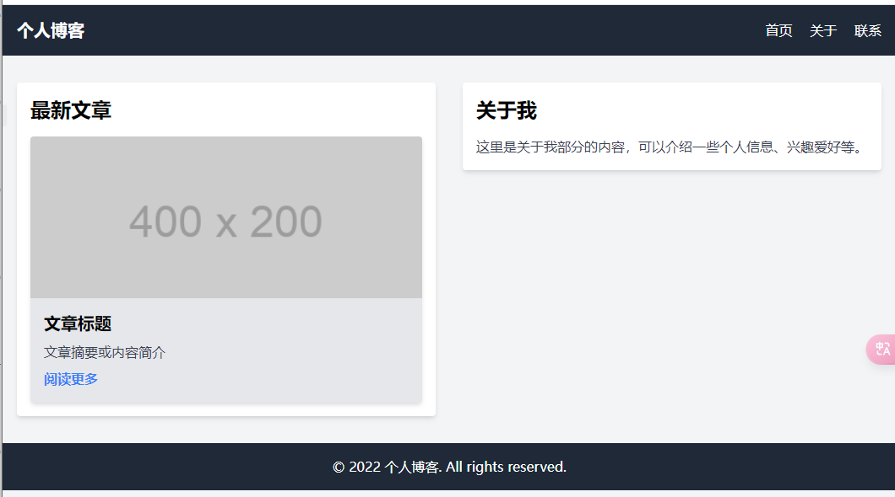


## 企业官网

下面是一个使用 Tailwind CSS 实现的典型企业官网示例：

```html
<!DOCTYPE html>
<html lang="en">
<head>
    <meta charset="UTF-8">
    <meta name="viewport" content="width=device-width, initial-scale=1.0">
    <title>企业官网</title>
    <link href="https://cdn.jsdelivr.net/npm/tailwindcss@2.2.19/dist/tailwind.min.css" rel="stylesheet">
</head>
<body class="bg-gray-100">
    <!-- 导航栏 -->
    <nav class="bg-blue-500 text-white p-4">
        <div class="container mx-auto flex justify-between items-center">
            <div>
                <a href="#" class="text-xl font-bold">企业官网</a>
            </div>
            <div>
                <a href="#" class="hover:text-gray-300">首页</a>
                <a href="#" class="ml-4 hover:text-gray-300">关于我们</a>
                <a href="#" class="ml-4 hover:text-gray-300">产品与服务</a>
                <a href="#" class="ml-4 hover:text-gray-300">联系我们</a>
            </div>
        </div>
    </nav>

    <!-- 主要内容区域 -->
    <div class="container mx-auto mt-8">
        <!-- 主页 Banner -->
        <div class="bg-gray-800 text-white p-8 rounded-lg mb-8">
            <h1 class="text-4xl font-bold mb-4">欢迎来到企业官网</h1>
            <p class="text-lg">我们提供最优质的产品和服务，让您的生活更便捷。</p>
        </div>

        <!-- 产品与服务 -->
        <div class="grid grid-cols-1 md:grid-cols-2 gap-8">
            <!-- 产品 -->
            <div class="bg-white p-6 rounded-lg shadow-md">
                <h2 class="text-2xl font-bold mb-4">我们的产品</h2>
                <p>这里可以放一些关于产品的介绍和说明。</p>
                <a href="#" class="block mt-4 text-blue-500 font-semibold hover:underline">了解更多</a>
            </div>
            <!-- 服务 -->
            <div class="bg-white p-6 rounded-lg shadow-md">
                <h2 class="text-2xl font-bold mb-4">我们的服务</h2>
                <p>这里可以放一些关于服务的介绍和说明。</p>
                <a href="#" class="block mt-4 text-blue-500 font-semibold hover:underline">了解更多</a>
            </div>
        </div>
    </div>

    <!-- 页脚 -->
    <footer class="bg-gray-800 text-white p-4 mt-8">
        <div class="container mx-auto text-center">
            © 2022 企业官网. All rights reserved.
        </div>
    </footer>
</body>
</html>
```

这个示例包含了一个典型的企业官网布局：

- 导航栏：包含网站标题和导航链接。
- 主要内容区域：包括主页 Banner 和产品与服务部分。
- 主页 Banner：包含欢迎语和简短介绍。
- 产品与服务：展示公司的产品和服务，每个部分包括标题、介绍和了解更多链接。
- 页脚：包含版权信息和网站名称。

你可以将这段代码复制粘贴到 HTML 文件中，并在浏览器中打开以查看效果。

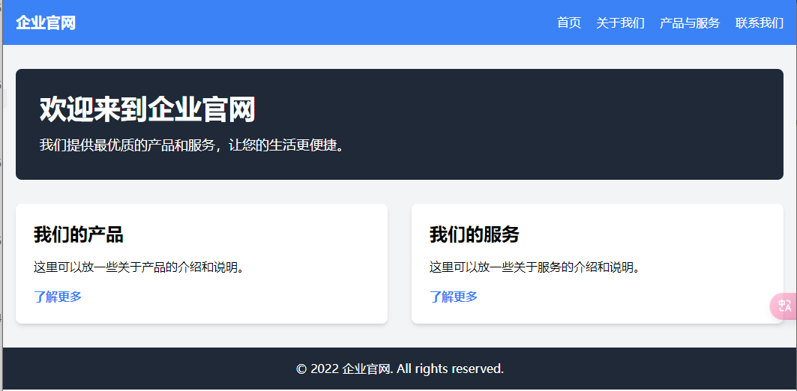


## 电商

以下是一个简单的电商网站示例，使用 Tailwind CSS 实现：

```html
<!DOCTYPE html>
<html lang="en">
<head>
    <meta charset="UTF-8">
    <meta name="viewport" content="width=device-width, initial-scale=1.0">
    <title>电商网站</title>
    <link href="https://cdn.jsdelivr.net/npm/tailwindcss@2.2.19/dist/tailwind.min.css" rel="stylesheet">
</head>
<body class="bg-gray-100">
    <!-- 导航栏 -->
    <nav class="bg-white p-4 shadow-md">
        <div class="container mx-auto flex justify-between items-center">
            <div>
                <a href="#" class="text-xl font-bold">电商网站</a>
            </div>
            <div>
                <a href="#" class="hover:text-gray-600">首页</a>
                <a href="#" class="ml-4 hover:text-gray-600">产品</a>
                <a href="#" class="ml-4 hover:text-gray-600">购物车</a>
                <a href="#" class="ml-4 hover:text-gray-600">登录</a>
            </div>
        </div>
    </nav>

    <!-- 主要内容区域 -->
    <div class="container mx-auto mt-8">
        <!-- 商品列表 -->
        <div class="grid grid-cols-1 md:grid-cols-3 gap-8">
            <!-- 商品卡片 -->
            <div class="bg-white p-4 rounded-lg shadow-md">
                
                <h2 class="text-xl font-semibold mb-2">商品名称</h2>
                <p class="text-gray-700 mb-4">商品描述或介绍</p>
                <div class="flex justify-between items-center">
                    <span class="text-xl font-bold text-gray-800">$99.99</span>
                    <button class="bg-blue-500 hover:bg-blue-600 text-white py-2 px-4 rounded">添加到购物车</button>
                </div>
            </div>
            <!-- 其他商品卡片 -->
            <!-- 可以添加更多商品卡片 -->
        </div>
    </div>

    <!-- 页脚 -->
    <footer class="bg-gray-800 text-white p-4 mt-8">
        <div class="container mx-auto text-center">
            © 2022 电商网站. All rights reserved.
        </div>
    </footer>
</body>
</html>
```

这个示例包含了一个简单的电商网站布局：

- 导航栏：包含网站标题和导航链接。
- 主要内容区域：包括商品列表，每个商品包括图片、名称、描述和价格。
- 商品列表：展示多个商品卡片，每个卡片包括商品图片、名称、描述、价格和添加到购物车按钮。
- 页脚：包含版权信息和网站名称。

你可以将这段代码复制粘贴到 HTML 文件中，并在浏览器中打开以查看效果。

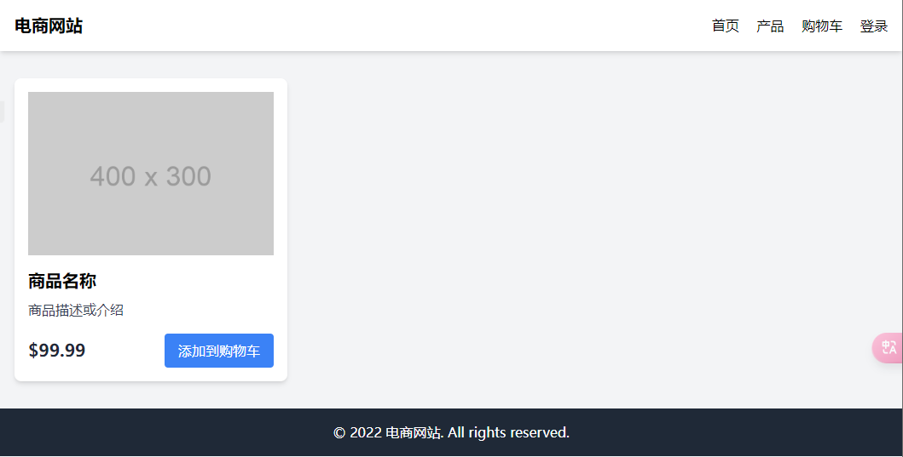

## 新闻媒体

以下是一个简单的新闻媒体网站示例，使用 Tailwind CSS 实现：

```html
<!DOCTYPE html>
<html lang="en">
<head>
    <meta charset="UTF-8">
    <meta name="viewport" content="width=device-width, initial-scale=1.0">
    <title>新闻媒体网站</title>
    <link href="https://cdn.jsdelivr.net/npm/tailwindcss@2.2.19/dist/tailwind.min.css" rel="stylesheet">
</head>
<body class="bg-gray-100">
    <!-- 导航栏 -->
    <nav class="bg-white p-4 shadow-md">
        <div class="container mx-auto flex justify-between items-center">
            <div>
                <a href="#" class="text-xl font-bold">新闻媒体网站</a>
            </div>
            <div>
                <a href="#" class="hover:text-gray-600">首页</a>
                <a href="#" class="ml-4 hover:text-gray-600">新闻</a>
                <a href="#" class="ml-4 hover:text-gray-600">文章</a>
                <a href="#" class="ml-4 hover:text-gray-600">联系</a>
            </div>
        </div>
    </nav>

    <!-- 主要内容区域 -->
    <div class="container mx-auto mt-8">
        <!-- 新闻列表 -->
        <div class="grid grid-cols-1 md:grid-cols-3 gap-8">
            <!-- 新闻卡片 -->
            <div class="bg-white p-4 rounded-lg shadow-md">
                
                <h2 class="text-xl font-semibold mb-2">新闻标题</h2>
                <p class="text-gray-700 mb-4">新闻摘要或介绍</p>
                <a href="#" class="text-blue-500 font-semibold hover:underline">阅读更多</a>
            </div>
            <!-- 其他新闻卡片 -->
            <!-- 可以添加更多新闻卡片 -->
        </div>
    </div>

    <!-- 页脚 -->
    <footer class="bg-gray-800 text-white p-4 mt-8">
        <div class="container mx-auto text-center">
            © 2022 新闻媒体网站. All rights reserved.
        </div>
    </footer>
</body>
</html>
```

这个示例包含了一个简单的新闻媒体网站布局：

- 导航栏：包含网站标题和导航链接。
- 主要内容区域：包括新闻列表，每个新闻卡片包括标题、摘要和阅读更多链接。
- 新闻列表：展示多个新闻卡片，每个卡片包括新闻图片、标题、摘要和阅读更多链接。
- 页脚：包含版权信息和网站名称。

你可以将这段代码复制粘贴到 HTML 文件中，并在浏览器中打开以查看效果。

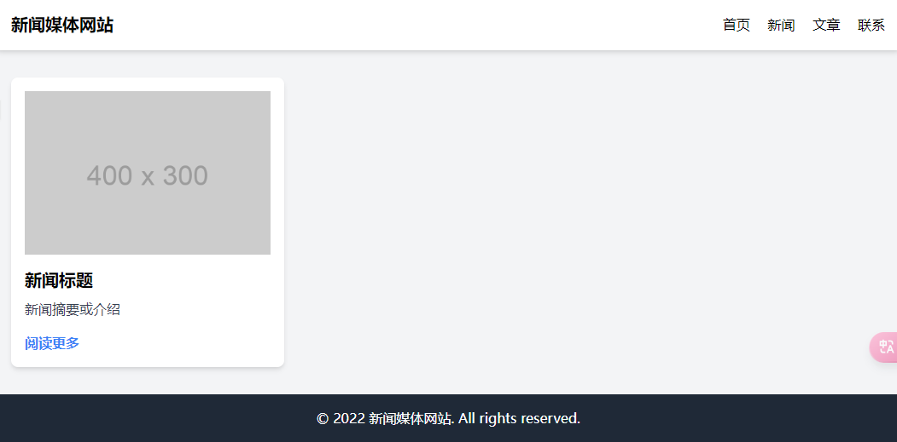


## **论坛/社区网站**

下面是一个简单的论坛/社区网站示例，使用 Tailwind CSS 实现：

```html
<!DOCTYPE html>
<html lang="en">
<head>
    <meta charset="UTF-8">
    <meta name="viewport" content="width=device-width, initial-scale=1.0">
    <title>论坛/社区网站</title>
    <link href="https://cdn.jsdelivr.net/npm/tailwindcss@2.2.19/dist/tailwind.min.css" rel="stylesheet">
</head>
<body class="bg-gray-100">
    <!-- 导航栏 -->
    <nav class="bg-white p-4 shadow-md">
        <div class="container mx-auto flex justify-between items-center">
            <div>
                <a href="#" class="text-xl font-bold">论坛/社区网站</a>
            </div>
            <div>
                <a href="#" class="hover:text-gray-600">首页</a>
                <a href="#" class="ml-4 hover:text-gray-600">话题</a>
                <a href="#" class="ml-4 hover:text-gray-600">成员</a>
                <a href="#" class="ml-4 hover:text-gray-600">登录</a>
            </div>
        </div>
    </nav>

    <!-- 主要内容区域 -->
    <div class="container mx-auto mt-8">
        <!-- 话题列表 -->
        <div class="grid grid-cols-1 md:grid-cols-2 lg:grid-cols-3 gap-8">
            <!-- 话题卡片 -->
            <div class="bg-white p-4 rounded-lg shadow-md">
                <h2 class="text-xl font-semibold mb-2">话题标题</h2>
                <p class="text-gray-700 mb-4">话题描述或介绍</p>
                <div class="flex justify-between items-center">
                    <div class="flex items-center">
                        
                        <span class="text-gray-600">用户名</span>
                    </div>
                    <span class="text-gray-600">3 小时前</span>
                </div>
            </div>
            <!-- 其他话题卡片 -->
            <!-- 可以添加更多话题卡片 -->
        </div>
    </div>

    <!-- 页脚 -->
    <footer class="bg-gray-800 text-white p-4 mt-8">
        <div class="container mx-auto text-center">
            © 2022 论坛/社区网站. All rights reserved.
        </div>
    </footer>
</body>
</html>
```

这个示例包含了一个简单的论坛/社区网站布局：

- 导航栏：包含网站标题和导航链接。
- 主要内容区域：包括话题列表，每个话题卡片包括标题、描述、用户信息和发布时间。
- 话题列表：展示多个话题卡片，每个卡片包括标题、描述、用户信息和发布时间。
- 页脚：包含版权信息和网站名称。

你可以将这段代码复制粘贴到 HTML 文件中，并在浏览器中打开以查看效果。

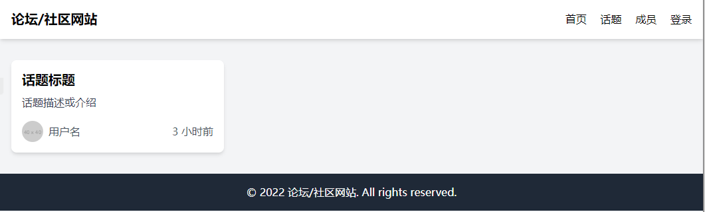

## 教育学术网站

以下是一个简单的教育学术网站示例，使用 Tailwind CSS 实现：

```html
<!DOCTYPE html>
<html lang="en">
<head>
    <meta charset="UTF-8">
    <meta name="viewport" content="width=device-width, initial-scale=1.0">
    <title>教育学术网站</title>
    <link href="https://cdn.jsdelivr.net/npm/tailwindcss@2.2.19/dist/tailwind.min.css" rel="stylesheet">
</head>
<body class="bg-gray-100">
    <!-- 导航栏 -->
    <nav class="bg-white p-4 shadow-md">
        <div class="container mx-auto flex justify-between items-center">
            <div>
                <a href="#" class="text-xl font-bold">教育学术网站</a>
            </div>
            <div>
                <a href="#" class="hover:text-gray-600">首页</a>
                <a href="#" class="ml-4 hover:text-gray-600">课程</a>
                <a href="#" class="ml-4 hover:text-gray-600">学术期刊</a>
                <a href="#" class="ml-4 hover:text-gray-600">关于我们</a>
            </div>
        </div>
    </nav>

    <!-- 主要内容区域 -->
    <div class="container mx-auto mt-8">
        <!-- 课程列表 -->
        <div class="grid grid-cols-1 md:grid-cols-2 lg:grid-cols-3 gap-8">
            <!-- 课程卡片 -->
            <div class="bg-white p-4 rounded-lg shadow-md">
                <h2 class="text-xl font-semibold mb-2">课程名称</h2>
                <p class="text-gray-700 mb-4">课程描述或介绍</p>
                <div class="flex justify-between items-center">
                    <div class="flex items-center">
                        
                        <span class="text-gray-600">讲师姓名</span>
                    </div>
                    <span class="text-gray-600">价格：$99.99</span>
                </div>
            </div>
            <!-- 其他课程卡片 -->
            <!-- 可以添加更多课程卡片 -->
        </div>
    </div>

    <!-- 页脚 -->
    <footer class="bg-gray-800 text-white p-4 mt-8">
        <div class="container mx-auto text-center">
            © 2022 教育学术网站. All rights reserved.
        </div>
    </footer>
</body>
</html>
```

这个示例包含了一个简单的教育学术网站布局：

- 导航栏：包含网站标题和导航链接。
- 主要内容区域：包括课程列表，每个课程卡片包括课程名称、描述、讲师信息和价格。
- 课程列表：展示多个课程卡片，每个卡片包括课程名称、描述、讲师信息和价格。
- 页脚：包含版权信息和网站名称。

你可以将这段代码复制粘贴到 HTML 文件中，并在浏览器中打开以查看效果。

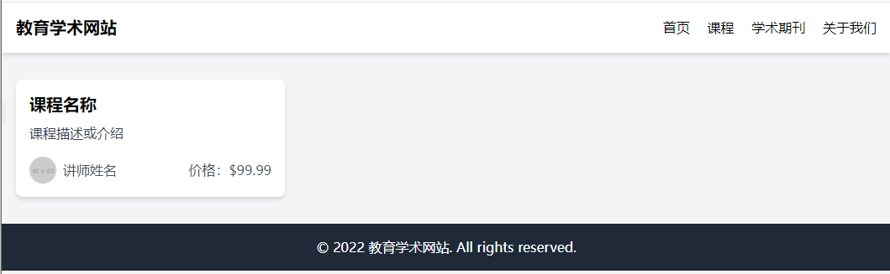


## 娱乐社交

以下是一个简单的娱乐社交网站示例，使用 Tailwind CSS 实现：

```html
<!DOCTYPE html>
<html lang="en">
<head>
    <meta charset="UTF-8">
    <meta name="viewport" content="width=device-width, initial-scale=1.0">
    <title>娱乐社交网站</title>
    <link href="https://cdn.jsdelivr.net/npm/tailwindcss@2.2.19/dist/tailwind.min.css" rel="stylesheet">
</head>
<body class="bg-gray-100">
    <!-- 导航栏 -->
    <nav class="bg-white p-4 shadow-md">
        <div class="container mx-auto flex justify-between items-center">
            <div>
                <a href="#" class="text-xl font-bold">娱乐社交网站</a>
            </div>
            <div>
                <a href="#" class="hover:text-gray-600">首页</a>
                <a href="#" class="ml-4 hover:text-gray-600">视频</a>
                <a href="#" class="ml-4 hover:text-gray-600">游戏</a>
                <a href="#" class="ml-4 hover:text-gray-600">社区</a>
            </div>
        </div>
    </nav>

    <!-- 主要内容区域 -->
    <div class="container mx-auto mt-8">
        <!-- 视频列表 -->
        <div class="grid grid-cols-1 md:grid-cols-2 lg:grid-cols-3 gap-8">
            <!-- 视频卡片 -->
            <div class="bg-white p-4 rounded-lg shadow-md">
                <h2 class="text-xl font-semibold mb-2">视频标题</h2>
                <p class="text-gray-700 mb-4">视频描述或介绍</p>
                <div class="flex justify-between items-center">
                    <div class="flex items-center">
                        
                        <span class="text-gray-600">上传者用户名</span>
                    </div>
                    <span class="text-gray-600">3 小时前</span>
                </div>
            </div>
            <!-- 其他视频卡片 -->
            <!-- 可以添加更多视频卡片 -->
        </div>
    </div>

    <!-- 页脚 -->
    <footer class="bg-gray-800 text-white p-4 mt-8">
        <div class="container mx-auto text-center">
            © 2022 娱乐社交网站. All rights reserved.
        </div>
    </footer>
</body>
</html>
```

这个示例包含了一个简单的娱乐社交网站布局：

- 导航栏：包含网站标题和导航链接。
- 主要内容区域：包括视频列表，每个视频卡片包括标题、描述、上传者信息和上传时间。
- 视频列表：展示多个视频卡片，每个卡片包括视频标题、描述、上传者信息和上传时间。
- 页脚：包含版权信息和网站名称。

你可以将这段代码复制粘贴到 HTML 文件中，并在浏览器中打开以查看效果。

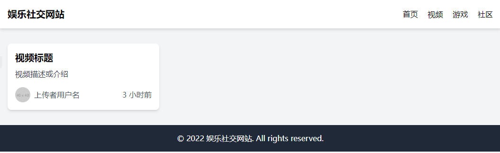


## 政府网站

以下是一个简单的政府网站示例，使用 Tailwind CSS 实现：

```html
<!DOCTYPE html>
<html lang="en">
<head>
    <meta charset="UTF-8">
    <meta name="viewport" content="width=device-width, initial-scale=1.0">
    <title>政府网站</title>
    <link href="https://cdn.jsdelivr.net/npm/tailwindcss@2.2.19/dist/tailwind.min.css" rel="stylesheet">
</head>
<body class="bg-gray-100">
    <!-- 导航栏 -->
    <nav class="bg-blue-500 text-white p-4 shadow-md">
        <div class="container mx-auto flex justify-between items-center">
            <div>
                <a href="#" class="text-xl font-bold">政府网站</a>
            </div>
            <div>
                <a href="#" class="hover:text-gray-300">首页</a>
                <a href="#" class="ml-4 hover:text-gray-300">新闻</a>
                <a href="#" class="ml-4 hover:text-gray-300">服务</a>
                <a href="#" class="ml-4 hover:text-gray-300">关于</a>
            </div>
        </div>
    </nav>

    <!-- 主要内容区域 -->
    <div class="container mx-auto mt-8">
        <!-- 欢迎信息 -->
        <div class="bg-white p-8 rounded-lg shadow-md">
            <h2 class="text-2xl font-semibold mb-4">欢迎访问政府网站</h2>
            <p class="text-gray-700">我们致力于为市民提供最好的服务和信息。</p>
        </div>

        <!-- 重要公告 -->
        <div class="mt-8">
            <h2 class="text-xl font-semibold mb-4">重要公告</h2>
            <div class="bg-white p-4 rounded-lg shadow-md">
                <h3 class="text-lg font-semibold mb-2">新冠疫情防控通知</h3>
                <p class="text-gray-700 mb-4">根据最新疫情情况，我市决定...</p>
                <a href="#" class="text-blue-500 font-semibold hover:underline">查看详情</a>
            </div>
        </div>
    </div>

    <!-- 页脚 -->
    <footer class="bg-gray-800 text-white p-4 mt-8">
        <div class="container mx-auto text-center">
            © 2022 政府网站. All rights reserved.
        </div>
    </footer>
</body>
</html>
```

这个示例包含了一个简单的政府网站布局：

- 导航栏：包含网站标题和导航链接。
- 主要内容区域：包括欢迎信息和重要公告。
- 欢迎信息：简短介绍网站的服务和目标。
- 重要公告：展示最新的重要公告，包括标题、摘要和查看详情链接。
- 页脚：包含版权信息和网站名称。

你可以将这段代码复制粘贴到 HTML 文件中，并在浏览器中打开以查看效果。

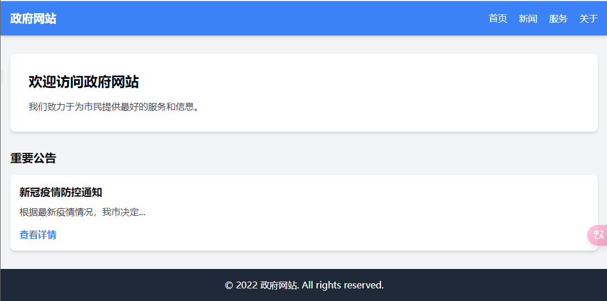

## 地图导航

以下是一个简单的地图导航网站示例，使用 Tailwind CSS 实现：

```html
<!DOCTYPE html>
<html lang="en">
<head>
    <meta charset="UTF-8">
    <meta name="viewport" content="width=device-width, initial-scale=1.0">
    <title>地图导航网站</title>
    <link href="https://cdn.jsdelivr.net/npm/tailwindcss@2.2.19/dist/tailwind.min.css" rel="stylesheet">
</head>
<body class="bg-gray-100">
    <!-- 导航栏 -->
    <nav class="bg-blue-500 text-white p-4 shadow-md">
        <div class="container mx-auto flex justify-between items-center">
            <div>
                <a href="#" class="text-xl font-bold">地图导航网站</a>
            </div>
            <div>
                <a href="#" class="hover:text-gray-300">首页</a>
                <a href="#" class="ml-4 hover:text-gray-300">地图</a>
                <a href="#" class="ml-4 hover:text-gray-300">搜索</a>
                <a href="#" class="ml-4 hover:text-gray-300">关于</a>
            </div>
        </div>
    </nav>

    <!-- 主要内容区域 -->
    <div class="container mx-auto mt-8">
        <!-- 地图显示区域 -->
        <div class="bg-white p-4 rounded-lg shadow-md">
            <!-- 这里可以使用地图 API 来显示地图 -->
            
        </div>

        <!-- 搜索框 -->
        <div class="mt-8">
            <h2 class="text-xl font-semibold mb-4">搜索地点</h2>
            <form action="#" method="GET" class="flex">
                <input type="text" name="search" placeholder="输入地点名称" class="w-full p-2 border border-gray-300 rounded-l-md focus:outline-none focus:border-blue-500">
                <button type="submit" class="bg-blue-500 text-white px-4 rounded-r-md hover:bg-blue-600">搜索</button>
            </form>
        </div>
    </div>

    <!-- 页脚 -->
    <footer class="bg-gray-800 text-white p-4 mt-8">
        <div class="container mx-auto text-center">
            © 2022 地图导航网站. All rights reserved.
        </div>
    </footer>
</body>
</html>
```

这个示例包含了一个简单的地图导航网站布局：

- 导航栏：包含网站标题和导航链接。
- 主要内容区域：包括地图显示区域和搜索框。
- 地图显示区域：展示地图，可以使用地图 API 来实现。
- 搜索框：允许用户输入地点名称进行搜索。
- 页脚：包含版权信息和网站名称。

你可以将这段代码复制粘贴到 HTML 文件中，并在浏览器中打开以查看效果。

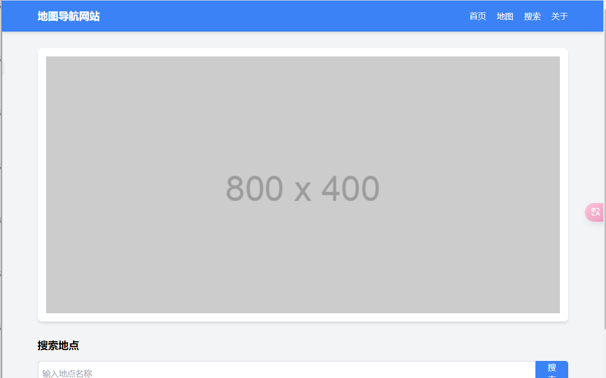

## 项目管理

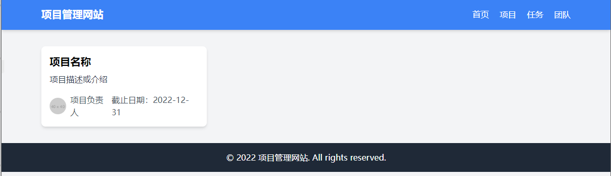

## 音乐播放

以下是一个简单的音乐播放网站示例，使用 Tailwind CSS 实现：

```html
<!DOCTYPE html>
<html lang="en">
<head>
    <meta charset="UTF-8">
    <meta name="viewport" content="width=device-width, initial-scale=1.0">
    <title>音乐播放网站</title>
    <link href="https://cdn.jsdelivr.net/npm/tailwindcss@2.2.19/dist/tailwind.min.css" rel="stylesheet">
</head>
<body class="bg-gray-100">
    <!-- 导航栏 -->
    <nav class="bg-blue-500 text-white p-4 shadow-md">
        <div class="container mx-auto flex justify-between items-center">
            <div>
                <a href="#" class="text-xl font-bold">音乐播放网站</a>
            </div>
            <div>
                <a href="#" class="hover:text-gray-300">首页</a>
                <a href="#" class="ml-4 hover:text-gray-300">音乐</a>
                <a href="#" class="ml-4 hover:text-gray-300">歌手</a>
                <a href="#" class="ml-4 hover:text-gray-300">关于</a>
            </div>
        </div>
    </nav>

    <!-- 主要内容区域 -->
    <div class="container mx-auto mt-8">
        <!-- 音乐列表 -->
        <div class="grid grid-cols-1 md:grid-cols-2 lg:grid-cols-3 gap-8">
            <!-- 音乐卡片 -->
            <div class="bg-white p-4 rounded-lg shadow-md">
                <h2 class="text-xl font-semibold mb-2">歌曲标题</h2>
                <p class="text-gray-700 mb-4">歌手：歌手名称</p>
                <div class="flex justify-between items-center">
                    <div>
                        <audio controls class="w-full">
                            <source src="audio.mp3" type="audio/mpeg">
                            Your browser does not support the audio element.
                        </audio>
                    </div>
                </div>
            </div>
            <!-- 其他音乐卡片 -->
            <!-- 可以添加更多音乐卡片 -->
        </div>
    </div>

    <!-- 页脚 -->
    <footer class="bg-gray-800 text-white p-4 mt-8">
        <div class="container mx-auto text-center">
            © 2022 音乐播放网站. All rights reserved.
        </div>
    </footer>
</body>
</html>
```

这个示例包含了一个简单的音乐播放网站布局：

- 导航栏：包含网站标题和导航链接。
- 主要内容区域：包括音乐列表，每个音乐卡片包括歌曲标题、歌手名称和音乐播放器。
- 音乐列表：展示多个音乐卡片，每个卡片包括歌曲标题、歌手名称和音乐播放器。
- 页脚：包含版权信息和网站名称。

你可以将这段代码复制粘贴到 HTML 文件中，并在浏览器中打开以查看效果。请确保替换示例中的音乐文件路径为你自己的音乐文件路径。

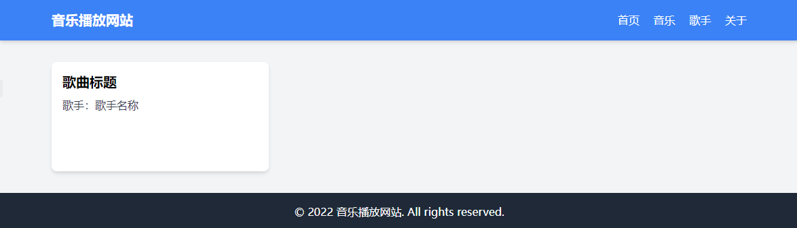

## 在线学习网站

以下是一个简单的在线学习网站示例，使用 Tailwind CSS 实现：

```html
<!DOCTYPE html>
<html lang="en">
<head>
    <meta charset="UTF-8">
    <meta name="viewport" content="width=device-width, initial-scale=1.0">
    <title>在线学习网站</title>
    <link href="https://cdn.jsdelivr.net/npm/tailwindcss@2.2.19/dist/tailwind.min.css" rel="stylesheet">
</head>
<body class="bg-gray-100">
    <!-- 导航栏 -->
    <nav class="bg-blue-500 text-white p-4 shadow-md">
        <div class="container mx-auto flex justify-between items-center">
            <div>
                <a href="#" class="text-xl font-bold">在线学习网站</a>
            </div>
            <div>
                <a href="#" class="hover:text-gray-300">首页</a>
                <a href="#" class="ml-4 hover:text-gray-300">课程</a>
                <a href="#" class="ml-4 hover:text-gray-300">讲师</a>
                <a href="#" class="ml-4 hover:text-gray-300">关于</a>
            </div>
        </div>
    </nav>

    <!-- 主要内容区域 -->
    <div class="container mx-auto mt-8">
        <!-- 推荐课程 -->
        <div>
            <h2 class="text-2xl font-semibold mb-4">推荐课程</h2>
            <div class="grid grid-cols-1 md:grid-cols-2 lg:grid-cols-3 gap-8">
                <!-- 课程卡片 -->
                <div class="bg-white p-4 rounded-lg shadow-md">
                    <h3 class="text-lg font-semibold mb-2">课程标题</h3>
                    <p class="text-gray-700 mb-4">课程描述或介绍</p>
                    <div class="flex justify-between items-center">
                        <div class="flex items-center">
                            
                            <span class="text-gray-600">讲师姓名</span>
                        </div>
                        <span class="text-gray-600">价格：$99.99</span>
                    </div>
                </div>
                <!-- 其他课程卡片 -->
                <!-- 可以添加更多课程卡片 -->
            </div>
        </div>

        <!-- 关于我们 -->
        <div class="mt-8">
            <h2 class="text-2xl font-semibold mb-4">关于我们</h2>
            <p class="text-gray-700">我们致力于为学生提供高质量的在线学习资源。</p>
        </div>
    </div>

    <!-- 页脚 -->
    <footer class="bg-gray-800 text-white p-4 mt-8">
        <div class="container mx-auto text-center">
            © 2022 在线学习网站. All rights reserved.
        </div>
    </footer>
</body>
</html>
```

这个示例包含了一个简单的在线学习网站布局：

- 导航栏：包含网站标题和导航链接。
- 主要内容区域：包括推荐课程和关于我们部分。
- 推荐课程：展示多个课程卡片，每个卡片包括课程标题、描述、讲师信息和价格。
- 关于我们：简短介绍网站的服务和目标。
- 页脚：包含版权信息和网站名称。

你可以将这段代码复制粘贴到 HTML 文件中，并在浏览器中打开以查看效果。

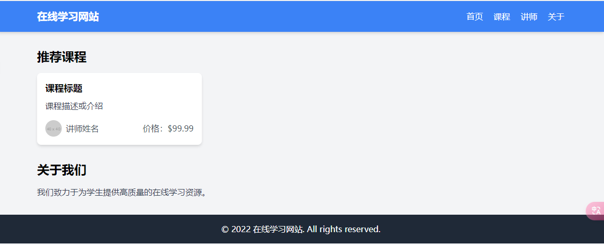


# tailwind实现todomvc

以下是一个使用 Tailwind CSS 实现的简单的 TodoMVC 示例：

```html
<!DOCTYPE html>
<html lang="en">
<head>
    <meta charset="UTF-8">
    <meta name="viewport" content="width=device-width, initial-scale=1.0">
    <title>TodoMVC</title>
    <link href="https://cdn.jsdelivr.net/npm/tailwindcss@2.2.19/dist/tailwind.min.css" rel="stylesheet">
    <style>
        /* Custom styles */
        .completed {
            text-decoration: line-through;
        }
    </style>
</head>
<body class="bg-gray-100 p-8">
    <div class="max-w-md mx-auto bg-white rounded shadow-md overflow-hidden">
        <h1 class="text-3xl font-semibold bg-gray-200 p-4">TodoMVC</h1>
        <form id="todo-form" class="p-4 border-b">
            <input type="text" id="todo-input" class="w-full p-2 border rounded" placeholder="What needs to be done?">
        </form>
        <ul id="todo-list" class="divide-y">
            <!-- Todo items will be inserted here -->
        </ul>
        <div id="todo-footer" class="p-4 bg-gray-200 flex justify-between items-center">
            <span id="todo-count">0 items left</span>
            <button id="clear-completed">Clear completed</button>
        </div>
    </div>

    <script>
        // JavaScript code for TodoMVC functionality
        const todoForm = document.getElementById('todo-form');
        const todoInput = document.getElementById('todo-input');
        const todoList = document.getElementById('todo-list');
        const todoCount = document.getElementById('todo-count');
        const clearCompletedBtn = document.getElementById('clear-completed');

        let todos = [];

        // Function to render todo items
        function renderTodos() {
            todoList.innerHTML = '';
            todos.forEach((todo, index) => {
                const todoItem = document.createElement('li');
                todoItem.classList.add('flex', 'justify-between', 'items-center', 'p-4');

                const todoLabel = document.createElement('label');
                todoLabel.classList.add('flex', 'items-center');
                const todoCheckbox = document.createElement('input');
                todoCheckbox.type = 'checkbox';
                todoCheckbox.checked = todo.completed;
                todoCheckbox.addEventListener('change', () => toggleCompleted(index));
                const todoText = document.createElement('span');
                todoText.textContent = todo.text;
                todoText.classList.add(todo.completed ? 'completed' : '');

                todoLabel.appendChild(todoCheckbox);
                todoLabel.appendChild(todoText);
                todoItem.appendChild(todoLabel);

                const todoDeleteBtn = document.createElement('button');
                todoDeleteBtn.textContent = '❌';
                todoDeleteBtn.classList.add('ml-4', 'text-red-500', 'hover:text-red-700');
                todoDeleteBtn.addEventListener('click', () => deleteTodo(index));
                todoItem.appendChild(todoDeleteBtn);

                todoList.appendChild(todoItem);
            });

            updateTodoCount();
        }

        // Function to add new todo
        function addTodo() {
            const text = todoInput.value.trim();
            if (text !== '') {
                todos.push({ text, completed: false });
                todoInput.value = '';
                renderTodos();
            }
        }

        // Function to delete todo
        function deleteTodo(index) {
            todos.splice(index, 1);
            renderTodos();
        }

        // Function to toggle todo completed status
        function toggleCompleted(index) {
            todos[index].completed = !todos[index].completed;
            renderTodos();
        }

        // Function to clear completed todos
        function clearCompleted() {
            todos = todos.filter(todo => !todo.completed);
            renderTodos();
        }

        // Function to update todo count display
        function updateTodoCount() {
            const count = todos.filter(todo => !todo.completed).length;
            const itemText = count === 1 ? 'item' : 'items';
            todoCount.textContent = `${count} ${itemText} left`;
        }

        // Event listeners
        todoForm.addEventListener('submit', (e) => {
            e.preventDefault();
            addTodo();
        });

        clearCompletedBtn.addEventListener('click', clearCompleted);

        // Initial rendering
        renderTodos();
    </script>
</body>
</html>
```

这个示例实现了基本的 TodoMVC 功能，包括添加新任务、标记任务完成、删除任务以及清除已完成任务等功能。界面使用了 Tailwind CSS 进行简单的样式设计，并使用原生 JavaScript 实现了 TodoMVC 的功能。

# tailwind 和vue实现一个简单的网站

下面是一个简单的使用 Vue.js 和 Tailwind CSS 实现的网站示例：

```html
<!DOCTYPE html>
<html lang="en">
<head>
    <meta charset="UTF-8">
    <meta name="viewport" content="width=device-width, initial-scale=1.0">
    <title>Vue.js + Tailwind CSS 网站示例</title>
    <link href="https://cdn.jsdelivr.net/npm/tailwindcss@2.2.19/dist/tailwind.min.css" rel="stylesheet">
</head>
<body class="bg-gray-100">
    <div id="app" class="container mx-auto p-8">
        <header class="mb-8">
            <h1 class="text-4xl font-bold text-center">Welcome to Vue.js + Tailwind CSS Website</h1>
        </header>
        <main>
            <div class="grid grid-cols-1 md:grid-cols-2 lg:grid-cols-3 gap-8">
                <div v-for="(item, index) in items" :key="index" class="bg-white p-4 rounded-lg shadow-md">
                    <h2 class="text-xl font-semibold mb-2">{{ item.title }}</h2>
                    <p class="text-gray-700 mb-4">{{ item.description }}</p>
                    <a :href="item.link" class="text-blue-500 font-semibold hover:underline">Read more</a>
                </div>
            </div>
        </main>
        <footer class="mt-8 text-center text-gray-500">
            © 2022 Vue.js + Tailwind CSS. All rights reserved.
        </footer>
    </div>

    <script src="https://cdn.jsdelivr.net/npm/vue@2.6.14/dist/vue.js"></script>
    <script>
        new Vue({
            el: '#app',
            data: {
                items: [
                    {
                        title: 'Article 1',
                        description: 'Description for article 1.',
                        link: '#'
                    },
                    {
                        title: 'Article 2',
                        description: 'Description for article 2.',
                        link: '#'
                    },
                    {
                        title: 'Article 3',
                        description: 'Description for article 3.',
                        link: '#'
                    }
                ]
            }
        });
    </script>
</body>
</html>
```

这个示例展示了一个简单的网站布局，包括一个标题、多个内容块和页脚。使用了 Vue.js 实现数据绑定和列表渲染，并使用了 Tailwind CSS 进行样式设计。你可以根据需要修改数据和样式来满足自己的需求。

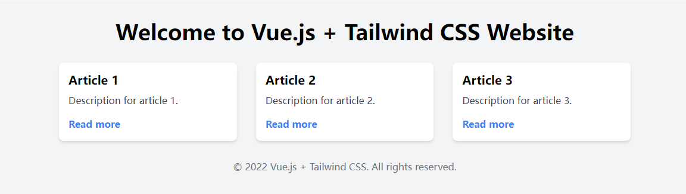


# tailwind写一个github这样布局的网站

下面是一个使用 Tailwind CSS 实现的类似 GitHub 风格的网站布局示例：

```html
<!DOCTYPE html>
<html lang="en">
<head>
    <meta charset="UTF-8">
    <meta name="viewport" content="width=device-width, initial-scale=1.0">
    <title>GitHub 风格网站布局</title>
    <link href="https://cdn.jsdelivr.net/npm/tailwindcss@2.2.19/dist/tailwind.min.css" rel="stylesheet">
</head>
<body class="bg-gray-100 font-sans">
    <div class="flex flex-col min-h-screen">
        <!-- 导航栏 -->
        <nav class="bg-gray-800 text-white p-4">
            <div class="container mx-auto flex justify-between items-center">
                <div class="flex items-center">
                    <svg class="h-6 w-6 mr-2" fill="none" viewBox="0 0 24 24" stroke="currentColor">
                        <path stroke-linecap="round" stroke-linejoin="round" stroke-width="2" d="M12 6v6m0 0v6m0-6h6m-6 0H6"></path>
                    </svg>
                    <a href="#" class="font-semibold">YourSite</a>
                </div>
                <div class="flex items-center">
                    <input type="text" placeholder="Search..." class="rounded bg-gray-700 p-2 focus:outline-none focus:bg-gray-900 text-white">
                    <button class="ml-2 p-2 bg-gray-700 hover:bg-gray-900 rounded focus:outline-none focus:bg-gray-900">
                        <svg class="h-6 w-6" fill="none" viewBox="0 0 24 24" stroke="currentColor">
                            <path stroke-linecap="round" stroke-linejoin="round" stroke-width="2" d="M15 11a4 4 0 11-8 0 4 4 0 018 0z"></path>
                            <path stroke-linecap="round" stroke-linejoin="round" stroke-width="2" d="M17 17l-5-5m0 0l-5 5m5-5V3"></path>
                        </svg>
                    </button>
                </div>
            </div>
        </nav>
        <!-- 主要内容区域 -->
        <main class="flex-grow">
            <div class="container mx-auto py-8">
                <div class="flex justify-between items-center mb-4">
                    <h1 class="text-2xl font-semibold">Repositories</h1>
                    <button class="px-4 py-2 bg-gray-800 text-white rounded focus:outline-none hover:bg-gray-900">New Repository</button>
                </div>
                <!-- 仓库列表 -->
                <div class="grid grid-cols-1 md:grid-cols-2 lg:grid-cols-3 gap-4">
                    <!-- 仓库卡片 -->
                    <div class="bg-white rounded shadow-md p-4">
                        <h2 class="text-xl font-semibold mb-2">Repository Name</h2>
                        <p class="text-gray-700 mb-4">Repository Description</p>
                        <div class="flex items-center">
                            <svg class="h-5 w-5 text-gray-600 mr-1" fill="none" viewBox="0 0 24 24" stroke="currentColor">
                                <path stroke-linecap="round" stroke-linejoin="round" stroke-width="2" d="M6 18L18 6M6 6l12 12"></path>
                            </svg>
                            <span class="text-sm text-gray-600">Updated 2 days ago</span>
                        </div>
                    </div>
                    <!-- 其他仓库卡片 -->
                    <!-- 可以添加更多仓库卡片 -->
                </div>
            </div>
        </main>
        <!-- 页脚 -->
        <footer class="bg-gray-800 text-white p-4">
            <div class="container mx-auto text-center">
                © 2022 YourSite. All rights reserved.
            </div>
        </footer>
    </div>
</body>
</html>
```

这个示例包含了一个类似 GitHub 风格的网站布局，包括了导航栏、仓库列表和页脚。你可以根据自己的需求和喜好对其进行修改和扩展。

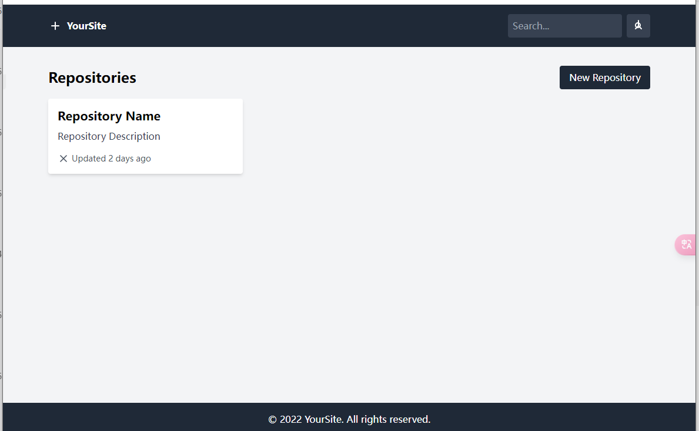

# 末尾

