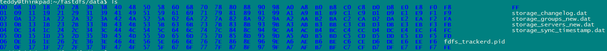

这个前端只用了jquery。没有使用bootstrap。算是比较传统的方案。

css文件就2个：

reset.css：这个是清空格式。

main.css：这个是设置格式。

代码看起来还是比较规范的。

先跑起来再说。

在windows下是不行的。

我就在Linux下来跑。

创建一个virtualenv。名字叫df_env。使用python3.8 

```
virtualenv  -p /usr/local/bin/python3 df_env
```

安装依赖：

```
 pip install -r requirements.txt 
```

然后修改settings.py的配置。

主要改数据库配置和邮箱配置。邮箱我也使用163邮箱的。

安装redis。

```
sudo apt-get install redis-server
```

另外，还有fastdfs的安装和配置。

这个没有apt-get可以安装的。

从github下载编译安装吧。

```
https://github.com/happyfish100/fastdfs
```

这个的编译依赖了libfastcommon。

```
https://github.com/happyfish100/libfastcommon
```

fastfds安装之后，还需要配置。/etc/fdfs目录下。

有这么4个sample文件。我们拷贝成client.conf这样的名字。然后修改。

```
client.conf.sample  
storage.conf.sample  
storage_ids.conf.sample  
tracker.conf.sample
```

有tracker和storage这2种节点。

tracker负责记录数据块的存放信息。

storage则负责存放数据。

我当前是测试，所以tracker和storage都设置为本机。

而且storage节点只给一个。

改tracker.conf。只修改里面一行就行了。

```
base_path = /home/teddy/fastdfs
```

保证这个目录是有的。

storage_ids.conf 这里就给一台机器，把ip设置为127.0.0.1 。

client.conf里，也改一下路径。

4个conf文件里的路径都记得改就行了。

然后启动tracker服务。

```
fdfs_trackerd /etc/fdfs/tracker.conf start
```

查看启动是否成功。

```
teddy@thinkpad:/etc/fdfs$ netstat -antulp |grep fdfs
（并非所有进程都能被检测到，所有非本用户的进程信息将不会显示，如果想看到所有信息，则必须切换到 root 用户）
tcp        0      0 0.0.0.0:22122           0.0.0.0:*               LISTEN      10732/fdfs_trackerd
```

查看目录下。

```
teddy@thinkpad:~/fastdfs$ tree
.
├── data
│   ├── fdfs_trackerd.pid
│   └── storage_changelog.dat
└── logs
    └── trackerd.log
```

然后storage.conf里，需要改一下ip。

然后路径改到/home/teddy/fastdfs/storage。

然后启动storage服务。

要有sudo权限来启动。不然说chown不允许。

但是还是不行。tracker不能是127.0.0.1 。

```
tracker: "127.0.0.1:22122" is invalid, tracker server ip can't be 127.0.0.1
```

那我改成192.168.1.102吧。

现在启动成功了。

```
teddy@thinkpad:~/fastdfs$ ps aux |grep fdfs
teddy    10732  0.0  0.1 155384  5896 ?        Sl   11:40   0:00 fdfs_trackerd /etc/fdfs/tracker.conf start
root     15426  2.8  0.1 150276  3832 ?        Sl   11:49   0:02 fdfs_storaged /etc/fdfs/storage.conf start
```

可以这样查看状态。

```
fdfs_monitor /etc/fdfs/storage.conf
```

现在目录下有这些东西。




然后安装redis和celery（包括rabbitmq）。

然后编译安装nginx和fastdfs的nginx模块。

这一步倒是有点麻烦。

我还是把这个nginx安装到我的个人目录下，不要影响系统的nginx。

或者我先把系统的nginx先卸载掉。

当前是nginx都在/usr/local/nginx目录下，我直接把这个目录删掉就好了。

当前的nginx也没有做什么。

就下载当前要求的版本，避免版本不一致的问题而浪费时间。

nginx就下载1.8.1的。

https://github.com/nginx/nginx/tree/branches/stable-1.8

https://github.com/happyfish100/fastdfs-nginx-module

```
./auto/configure --prefix=/usr/local/nginx/ --add-module=/home/teddy/work/dailyfresh_compile/fastdfs-nginx-module-master/src
```

然后make， sudo make install就好了。

nginx就安装好了。

把fastdfs-nginx-module-master下的mod_fastdfs.conf拷贝到/etc/fdfs目录下。

然后修改这些：

```
connect_timeout=10
tracker_server=192.168.1.102:22122
url_have_group_name=true
store_path0=/home/teddy/fastdfs
```

再拷贝fastdfs的配置文件到etc目录下。

```
teddy@thinkpad:~/tools/fastdfs$ sudo cp ./conf/http.conf /etc/fdfs/
teddy@thinkpad:~/tools/fastdfs$ sudo cp ./conf/mime.types /etc/fdfs/
```

修改nginx的配置文件/usr/local/nginx/conf/nginx.conf

增加一个server部分。原来的80还保留。

```
server {
    listen       8888;
    server_name  localhost;
    location ~/group[0-9]/ {
        ngx_fastdfs_module;
    }
    error_page   500 502 503 504  /50x.html;
    location = /50x.html {
    root   html;
    }
}
```


启动ngxin

```
sudo /usr/local/nginx/sbin/nginx 
```

测试一下nginx，可以正常访问80端口。


但是python依赖安装的时候，有些问题。

暂时难以解决。

所以还是只看代码，不尝试运行了。


参考资料

1、FastDFS【一】：FastDFS在Ubuntu的安装配置

https://zhuanlan.zhihu.com/p/29133587