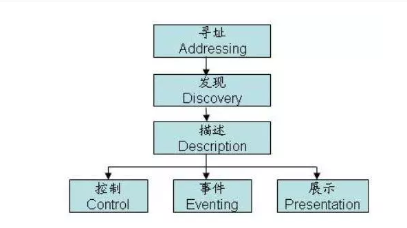

1

upnp是Universal Plug and Play的缩写。表示通用即插即用。


upnp是一种数字网络中间件技术。

建立在tcp和http之上。

采用xml作为通信手段。

目标是让家庭里的网络设备之间建立upnp网络。

但是目前upnp并没有得到预想的推广和应用。

但是upnp还是有一定的吸引力。

它的最大的特点是：它的消息是通过http协议来发送，消息内容都是用xml包装的。

**这就让我们可以通过浏览器来访问和控制支持upnp的设备。**

upnp特别适用于嵌入式网络领域。

UPnP体系允许PC间的点对点连接、网际互连和无线设备。它是一种基于TCP/IP、UDP和HTTP的分布式、开放体系。

UPnP协议无任何身份验证机制，并且现在大部分路由器都默认开启了UPnP服务。大量的设备可利用UPnP进行配置修改。
通过UPnP协议在内网可以干很多事情如：端口转换，动态DNS，查看设备状态等。


# upnp网络

upnp网络是指由upnp设备组成的网络。

它的基本组件是：

1、服务。upnp网络里的最小的逻辑功能单元。

​	服务分为：

​	1）状态表。描述服务的当前状态。

​	2）事件服务器。管理订阅请求。在服务的状态发生变化的时候，通知给订阅者。

​	3）控制服务器。处理来自控制点的请求。

2、设备。由一组子设备或者服务组成。

3、控制点。控制点的功能是发现和控制其他的设备。

控制点发现一个网络设备后，它会发出请求，获取设备的描述和服务列表。然后获取感兴趣的服务的描述。

然后通过动作请求来控制服务。


# upnp的工作过程

```
upnp的工作过程分为6步：
1、寻址。
	地址是upnp网络工作的基础。
	每个设备都通过dhcp来获取到一个ip地址。
	当局域网没有提供dhcp服务的时候，upnp将安装autoip协议，给设备分为169.254的ip地址（局域网里保证唯		一）。
	设备还可以使用friendly name，这个需要dns服务来转换name和ip地址。
	当前的路由器都可以满足上面的要求的。
2、发现。
	发现是upnp工作的第一步。
	当一个设备被加入到网络后，upnp的发现协议，允许该设备向局域网内的控制点组播自己的服务。
	当一个控制点被加入到网络后，控制点会在网络里搜索可用的设备。
	组播的消息内容是设备和服务的基本信息。
	例如：类型、uuid、当前状态参数等。
3、描述。
	一个控制点需要设备更加详细的信息。就会向对应的设备发消息。
	消息是一个xml。
	描述分为两种：
		1）设备描述。
		2）服务描述。
	设备，例如家庭影院，有显示屏，有音箱，有蓝光机。
	家庭影院，就是一个根设备（root device），下面有3个从设备。
	在家庭影院这个设备的描述xml里，就有一个device list属性，列出自己的从设备。
	
4、控制。
	拿到描述后，怎么去控制设备呢？
	在设备描述里，会给出如何控制设备的描述。还会给一个control url。
	控制点向这个control url发送不同的控制信息就可以控制设备了。
	控制点和设备直接的控制信息，用soap格式来传递。
5、事件。
	事件需要向订阅者进行组播。
	组播的端口是7900。
6、表达。presentation。
	就是html。
```

也有4步的说法：

```
就是2到5步。
发现
描述
控制
事件
```



# ssdp协议

Simple Service Discovery Protocol。简单服务发现协议。

用来描述设备怎样向网络通知或者撤销自己可用提供的服务。

控制点是如何搜索设备，设备如何回应搜索。

ssdp借用了http1.1的部分header。

SSDP 是应用层协议，使用 HTTPU 和 HTTPMU 规范，基于 UDP 端口进行通信。

SSDP 使用一个固定的组播地址 `239.255.255.250` 和 UDP 端口号 `1900` 来监听其他设备的请求。

但是不同的是，ssdp是基于udp的，而且只有header，没有body。也被叫做httpu。

```
NOTIFY HTTP/1.1

LOCATION: some url
```

```
M-SEARCH * HTTP/1.1
ST: upnp:rootdevice
MX: 3
MAN: "ssdp:discover"
```

ssdp的字段有：

1、startline。相当于的命令类型。例如NOTIFY HTTP/1.1这样。

2、HOST。例如：`HOST: 239.255.255.250：1900`。这个就是组播搜索。1900是ssdp的协议端口号。


# libupnp里的sample

## tv_device

运行：

```
teddy@teddy-ThinkPad-SL410:~/work/dossos/thirdparty/libupnp/libupnp-1.6.25/upnp/sample$ ./tv_device 
Initializing UPnP Sdk with
        ipaddress = {NULL} port = 0
UPnP Initialized
        ipaddress = 172.16.2.182 port = 49152
Specifying the webserver root directory -- ./web
Registering the RootDevice
         with desc_doc_url: http://172.16.2.182:49152/tvdevicedesc.xml
RootDevice Registered
Initializing State Table
common/sample_util.c(221): Error finding URLBase in XML Node
Found service: urn:schemas-upnp-org:service:tvcontrol:1
serviceId: urn:upnp-org:serviceId:tvcontrol1
common/sample_util.c(221): Error finding URLBase in XML Node
Found service: urn:schemas-upnp-org:service:tvpicture:1
serviceId: urn:upnp-org:serviceId:tvpicture1
State Table Initialized
Advertisements Sent

>> 
```

可以看到打印了这个url：http://172.16.2.182:49152/tvdevicedesc.xml。

我们在浏览器里打开这个地址。

这个实际上就是./web目录下的xml文件。

是设备描述，描述了一个电视设备的情况。

这个要和tv_ctrlpt配合起来看。

tv_ctrlpt是控制点，tv_device是设备。

tv_device只有一个exit命令。tv_ctrlpt有不少的命令，可以通过输入help来查看。

```
>> printdev 1
TvCtrlPointPrintDevice:
  TvDevice -- 1
    |                  
    +- UDN        = uuid:Upnp-TVEmulator-1_0-1234567890001
    +- DescDocURL     = http://172.16.2.182:49152/tvdevicedesc.xml
    +- FriendlyName   = UPnP Television Emulator
    +- PresURL        = http://172.16.2.182:49152/tvdevicepres.html
    +- Adver. TimeOut = 100
    |                  
    +- Tv Control Service
    |    +- ServiceId       = urn:upnp-org:serviceId:tvcontrol1
    |    +- ServiceType     = urn:schemas-upnp-org:service:tvcontrol:1
    |    +- EventURL        = http://172.16.2.182:49152/upnp/event/tvcontrol1
    |    +- ControlURL      = http://172.16.2.182:49152/upnp/control/tvcontrol1
    |    +- SID             = uuid:e931b3e8-2875-11ea-8a24-d0ca3f8c08d5
    |    +- ServiceStateTable
    |         +- Power      = 1
    |         +- Channel    = 1
    |         +- Volume     = 5
    |                  
    +- Tv Picture Service
         +- ServiceId       = urn:upnp-org:serviceId:tvpicture1
         +- ServiceType     = urn:schemas-upnp-org:service:tvpicture:1
         +- EventURL        = http://172.16.2.182:49152/upnp/event/tvpicture1
         +- ControlURL      = http://172.16.2.182:49152/upnp/control/tvpicture1
         +- SID             = uuid:e9321e32-2875-11ea-8a24-d0ca3f8c08d5
         +- ServiceStateTable
              +- Color      = 5
              +- Tint       = 5
              +- Contrast   = 5
              +- Brightness = 5

```

tv_ctrlpt可以进行的操作有：

```
Commands:
  Help
  HelpFull
  ListDev
  Refresh
  PrintDev      <devnum>
  PowerOn       <devnum>
  PowerOff      <devnum>
  SetChannel    <devnum> <channel>
  SetVolume     <devnum> <volume>
  SetColor      <devnum> <color>
  SetTint       <devnum> <tint>
  SetContrast   <devnum> <contrast>
  SetBrightness <devnum> <brightness>
  CtrlAction    <devnum> <action>
  PictAction    <devnum> <action>
  CtrlGetVar    <devnum> <varname>
  PictGetVar    <devnum> <action>
```


libupnp。这个库是用来实现媒体播放（DLAN）或者NAT地址转换（UPnP IGD）。智能手机上的应用程序可用这些功能播放媒体文件或者利用用户的家庭网络连接到其他的设备。


# miranda

Miranda是kali Linux提供的一个python写的upnp客户端工具。

```
git clone https://github.com/isaacfife/miranda
```

上面这个测试不能正常运行。

```
git clone https://github.com/0x90/miranda-upnp
```

这个是可以正常运行的。

```
teddy@thinkpad:~/work/dlna/miranda-upnp/src$ python ./miranda.py 

Miranda v1.3
The interactive UPnP client
Craig Heffner, http://www.devttys0.com
```


搭建一个最简单的测试环境。

我在我的笔记本上安装minidlna。安装后会自动启动。

然后打开Miranda。搜索：

```
upnp> msearch 

Entering discovery mode for 'upnp:rootdevice', Ctl+C to stop...

****************************************************************
SSDP reply message from 172.16.2.168:8200
XML file is located at http://172.16.2.168:8200/rootDesc.xml
Device is running Ubuntu DLNADOC/1.50 UPnP/1.0 MiniDLNA/1.1.5
****************************************************************
```

```
upnp> host list

        [0] 172.16.2.168:8200
```

minidlna的信息，可以通过：http://172.16.2.168:8200/ 这样的地址来查看。


# dlna server

可以在Linux上跑的dlna服务器软件有哪些？

- [Moode](https://en.wikipedia.org/w/index.php?title=Moode&action=edit&redlink=1), a music-centric DLNA server for Linux running on Raspberry Pi.

minidlna。

- [ReadyMedia](https://en.wikipedia.org/w/index.php?title=ReadyMedia&action=edit&redlink=1) (formerly known as MiniDLNA) is a **simple media server software**, with the aim of being fully compliant with DLNA/UPnP-AV clients. It is developed by a Netgear employee for the **ReadyNAS** product line.


ReadyNAS 是一个NAS硬件产品，跟群晖那些差不多。

是netgear公司的产品。


vlc能不能作为一个dlna client，来流量dlna server上的文件呢？

可以的。只要点击视图-- 播放列表 -- 左边的树状结构拉到下面，就可以看到upnp的选项了。

但是实际测试，发现一直发现不了dlna server。

所以放弃vlc的方式。

另外安装kodi来做测试看看。

```
sudo apt-get install kodi
```

minidlna测试：

    手机端安装BubbleUPnP，测试可以搜索到minidlna sever，播放音乐正常。


现在gmrender工作并没有完全正常。

所以需要找一个其他的renderer来验证一下。

在这个页面里搜索renderer。

https://en.wikipedia.org/wiki/List_of_UPnP_AV_media_servers_and_clients#Linux_2

```
upmpdcli, a free and open-source UPnP media renderer front end to MPD, the Music Player Daemon
```

upmpdcli这个不是正符合我的要求吗？

试一下这个。

这个在buildroot里默认也带了。


# 分析代码

```
服务器：minidlna。C语言。
客户端：miranda。python。
手机客户端：bubble upnp。这个也就是一个renderer。
渲染器：gmrender。C语言。
```


gmrender就是一个renderer。用来渲染媒体内容（包括视频，音频，图片），从一个upnp media server。

UPnP A/V is a three-tier system, consisting of Servers, Renderers and Controllers. With an A/V UPnP controller you can instruct a UPnP A/V Renderer (such as GMediaRender) to play multimedia content (pictures, music tracks, radio broadcasts, movies, ..) available from a UPnP A/V Server.


概念层次关系

以gmrender为例。

```
struct upnp_device
	这个是最上层的概念。
	struct upnp_device_descriptor *upnp_device_descriptor;
	ithread_mutex_t device_mutex;
    UpnpDevice_Handle device_handle;
    是对upnp_device_descriptor的简单包装。
    加上一个锁和一个handler。
    表示一种设备。可以具体到renderer设备。
```


```
struct upnp_device_descriptor
	这个就是描述一个renderer。当前音箱就是一个renderer。
	它包括了3个服务：
		传输服务
		连接管理服务。
		控制服务
```

```
struct service
	一个服务用一个service结构体来表示。
	传输服务的为例：
	id："urn:upnp-org:serviceId:AVTransport"
	type："urn:schemas-upnp-org:service:AVTransport:1"
	control_url："/upnp/control/rendertransport1"
	event_url："/upnp/event/rendertransport1"
	event的namespace："urn:schemas-upnp-org:metadata-1-0/AVT/"
	
	一个service有一个action列表。
```

```
struct action
	一个action用一个action结构体来描述。
	一个action是一个键值对：
	key是一个字符串。
	value是一个回调函数。
	例如这样：[TRANSPORT_CMD_PLAY] =                      {"Play", play},
	回调函数传递的参数是action_event。
	
```

```
struct action_event
	这个结构体有4个成员。
	UpnpActionRequest *request;
		这个是对libupnp里结构体的使用。
	int status
	struct service *service;
	struct upnp_device *device;
		这就是事件所属于的设备和服务的指针。
```

一个service还有一个argument_list。

```
struct argument
	有3个成员。
	name
	方向：in/out
	int statevar。这个怎么解释呢？也就是一个变量的id的意思吧。
	
	一个例子是这样：
	{ "InstanceID", PARAM_DIR_IN, TRANSPORT_VAR_AAT_INSTANCE_ID },
```


# 参考资料

1、Linux下UPnP sample分析

https://www.cnblogs.com/alljoyn/p/3562043.html

2、UPnP的工作过程

https://blog.csdn.net/ocean181/article/details/7406816

3、DLNA第一步UPnP协议栈

https://blog.csdn.net/kingvon_liwei/article/details/47013803

4、libUpnp缓冲区溢出、拒绝服务等漏洞分析

https://www.cnblogs.com/Shepherdzhao/p/7570632.html

5、upnp交互网络包示例

很多的缩写，这里讲得很清楚，很好。

http://www.mikewootc.com/wiki/net/protocol/upnp_netpacket_example.html

6、P2P 网络核心技术：UPnP 和 SSDP 协议

https://zhuanlan.zhihu.com/p/40407669

7、UPnP协议利用

https://www.jianshu.com/p/bce3f4047a65

8、

http://www.h3c.com/cn/d_201206/922127_30005_0.htm

9、

https://www.ibm.com/developerworks/cn/linux/other/UPnP/part1/index.html

10、List of UPnP AV media servers and clients

https://en.wikipedia.org/wiki/List_of_UPnP_AV_media_servers_and_clients

11、

http://cn.wondershare.com/vlc/play-dlna-content-using-vlc.html

12、minidlna配置

https://blog.csdn.net/x4dailanfeng/article/details/51546346

13、

http://gmrender.nongnu.org/