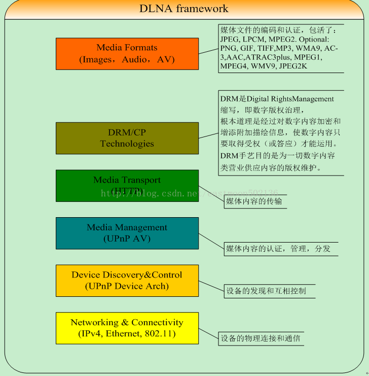

dlna是数字生活网络联盟的缩写。

目的是建立电脑、电器、移动设备之间的互联互通。

5个功能组件。

DLNA本来就是UPnP的子集，更加严格地定义了设备支持的格式而已，根本上就是用的UPnP协议。

DLNA 宣布组织在2017年1月15日正式解散，未来不会再更新DLNA标准。


 https://github.com/mrjimenez/pupnp


音箱有dlna功能，手机跟音箱在同一个局域网。

手机打开QQ音乐播放器，点击左下角的Q图标，就可以选择连接到音箱。


电脑和手机的互通

电脑上，win7的。Windows media Player里的媒体流里设置。

手机上安装MirageDLNA软件。

这样手机和电脑就能互相看到对方了，可以播放对方的文件。


# Ubuntu下搭建dlna环境

安装：

```
sudo apt-get install minidlna
```

配置文件是/etc/minidlna.conf

minidlna是一个dlna服务。

默认的配置情况：

```
# 媒体目录
media_dir=/var/lib/minidlna
```


使用vlc播放器来播放dlna

点击：视图，播放列表。

弹出的界面，往下拉，可以看到通用即插即播upnp的。

minidlna现在支持的多媒体文件格式有限，如不支持rmvb视频，

可以通过浏览器访问：http://192.168.56.101:8200 来查看minidlna的状态。

笔记本上安装kodi。

```
sudo apt-get install kodi
```

启动kodi。进入到设置界面，把dlna这些都打开。

手机跟笔记本连到同一个路由器。

手机打开酷狗音乐，点击歌曲播放界面最上面的方框，搜索一下，就可以找到我的笔记本。

连接，就可以把手机的声音传递到电脑上播放出来。就像连接蓝牙播放一样。


kodi在嵌入式设备里使用不合适。

看看mplayer能不能行。


台式机windows进入到网络里，可以看到Ubuntu笔记本的媒体设备。而且有几个设备。minidlna是一个，kodi是另外一个。退出kodi后，kodi的设备就看不到了。

mplayer好像还不支持dlna。下面这个链接，是一个简单的程序，估计可用性不高。

http://upnprenderer.sourceforge.net/


# dlna原理

DLNA不是技术，而是一种解决方案，它是多种技术的整合，并致力于构建家庭媒体共享。
DLNA包含多种网络协议，如http、https、upnp等，其中upnp是其重要组成部分。

通常 Android 手机中的 DLNA 功能是把手机作为 DMS(Digital Media Server) 或者 DMC(Digital Media Controller) 这两种角色。有时候也作为 DMP (Digital Media Player) 或者 DMD(Digital Media Downloader) 或者 DMU(Digital Media Uploader) 查看/下载/上传网络上其他服务器的内容，不过这些功能很多厂商并不一定实现了。




# 参考资料

1、

https://www.jb51.net/diannaojichu/144125.html

2、最简单的搭建minidlna服务的方法

https://blog.csdn.net/winniezhang/article/details/85861526

3、

https://jingyan.baidu.com/article/359911f59664bd57fe030693.html

4、

http://www.mz6.net/news/android/6861.html