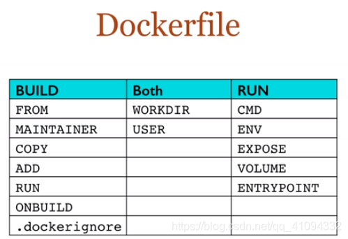
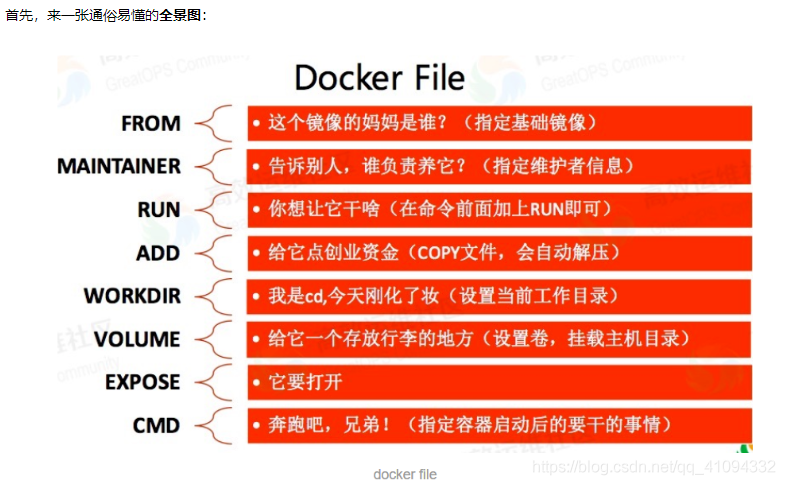

--

dockerfile本质上是脚本文件。

被docker程序来解释执行。

构成是一条一条的指令。

每条指定对应Linux下的一条命令。

类似于Makefile。

docker程序根据Dockerfile，生成镜像。

指令忽略大小写。

建议使用大写。

使用`#`作为注释。

# 官方说明

https://docs.docker.com/reference/dockerfile/

# 我的一个简单模板

Dockerfile内容：

```
from node:lts-alpine
label maintainer="teddyxiong53 <1073167306@qq.com>"
arg AUTHOR=xhl
env PATH=/usr/local/sbin:/usr/local/sbin:/usr/sbin:/usr/bin:/sbin:/bin \
    LANG=zh_CN.UTF-8 \
    SHELL=/bin/bash \
    PS1="\u@\h:\w \$ " 
    
add docker-entrypoint.sh /usr/bin
run sed -i 's/dl-cdn.alpinelinux.org/mirrors.aliyun.com/g' /etc/apk/repositories \
    && apk update -f \
    && apk upgrade \
    && apk --no-cache add -f bash coreutils moreutils git wget curl nano tzdata perl openssl \
    && rm -rf /var/cache/apk/* \
    && ln -sf /usr/share/zoneinfo/Asia/Shanghai /etc/localtime \
    && echo "Asia/Shanghai" > /etc/timezone 
    
workdir /root
entrypoint docker-entrypoint.sh
```

后续可以在这个基础上调整就好了。

当前目录再写一个docker-entrypoint.sh文件

```
#!/bin/sh

echo "hello docker"
```


生成镜像：

```
docker build -t mydocker .
```

大小有180M。不小了。

```
$ docker images
REPOSITORY            TAG          IMAGE ID       CREATED          SIZE
mydocker              latest       46e4eea5a4e2   12 seconds ago   180MB
```

运行：

```
docker run 46e4eea5a4e2
```

会打印hello docker这一行。

当前的docker-entrypoint.sh只是打印一行，然后就马上退出了。

所以docker ps看不到容器。

改动docker-entrypoint.sh文件，再执行docker build，则会重新生成镜像。如果没有改动，执行docker    build则没有什么实际效果。

镜像是另外生成了一个，抢占了之前的镜像的名字。之前的那个就变成匿名的了。

```
$ docker images
REPOSITORY            TAG          IMAGE ID       CREATED          SIZE
mydocker              latest       cde8ec019684   42 seconds ago   180MB
<none>                <none>       46e4eea5a4e2   8 minutes ago    180MB
```


为了让docker容器不要退出，我们可以在docker-entrypoint.sh的最后加一个死循环。

或者这样：

```
tail -f /dev/null
```

反正就是脚本一直阻塞就可以了。

因为docker需要一个前台进程的存在。


# 指令分类

指令分为两种：

1、build指令。

2、run指令。

build指令用于构建镜像。只在构建的时候起作用，在容器运行的时候，就不起作用。

而run指令，用来设置镜像的属性，在容器运行时执行。

（可以用C语言的编译时和运行时来对比理解）


Dockerfile中包括FROM、MAINTAINER、RUN、CMD、EXPOSE、ENV、ADD、COPY、ENTRYPOINT、VOLUME、USER、WORKDIR、ONBUILD等13个指令



# build类型指令

## from指令

这个必须放在最前面。

表示基于的镜像。

后面可以是本地的镜像，也可以是远程的镜像。

格式：

```
from <image>:<tag>
```

举例：

```
from hub.c.163.com/netease_comb/debian:7.9
from node:lts-alpine
```

## maintainer指令

docker inspect的时候，会显示镜像的这个信息。

一般这样写：

```
maintainer teddyxiong53 <1073167306@qq.com>
```

## run指令

run就是执行Linux的命令。

这个就依赖于基础镜像支持哪些命令了。

## add指令

从主机复制文件到容器的路径上。


## workdir

设置工作目录。


## arg指令

这个估计是后面新增的指令。

是设置一个shell变量。方便后面进行使用。

在build的过程中使用。


# run类型指令

## cmd指令

容器启动的时候执行的操作。

在一个dockerfile里，只能出现一次。

如果有多次，只有最后一次有效。

## entrypoint

也是在容器启动的时候执行。

也是只出现一次，多次的话，只有最后一个有效。

有两种用法：

```
1、单独用。
	如果另外还有cmd指令，而且cmd指令有效。
	那么entrypoint和cmd会相互覆盖。后面的有效。
2、跟cmd指令配合使用。
	这样cmd就不能是完整的指令，只有参数部分。
```

## expose指令

映射容器的某个端口到主机。

## env

设置环境变量

```
env PATH=/usr/local/bin SHELL=/bin/bash 
```

## volume指令

设置挂载点。




# dockerfile最佳实践

https://docs.docker.com/build/building/best-practices/


# \# syntax=docker/dockerfile:1

在 Dockerfile 的开头使用 `# syntax=docker/dockerfile:1` 是一种指定 Dockerfile 版本或语法的方式。这种语法标记允许你在构建过程中使用特定的 Dockerfile 功能和指令。以下是一些相关的细节和用法：

### 1. 语法版本

使用 `# syntax=docker/dockerfile:1` 可以确保你使用的是 Dockerfile 的特定版本语法。这样可以利用该版本提供的新特性或改进。

### 2. 多阶段构建

在较新版本的 Dockerfile 中，你可以使用多阶段构建来优化镜像。例如：

```dockerfile
# syntax=docker/dockerfile:1.2
FROM golang:1.16 AS builder
WORKDIR /app
COPY . .
RUN go build -o myapp

FROM alpine:latest
WORKDIR /app
COPY --from=builder /app/myapp .
CMD ["./myapp"]
```

### 3. 新特性

在指定语法版本后，你可以使用一些新特性，例如：

- **BuildKit 功能**：更好的缓存管理和并行构建。
- **更强大的 ARG 和 ENV 支持**：可以在构建时使用上下文中的环境变量。

### 4. 启用 BuildKit

确保 Docker 引擎启用 BuildKit，以便使用新功能。可以通过设置环境变量来启用：

```bash
export DOCKER_BUILDKIT=1
```

### 总结

在 Dockerfile 中使用 `# syntax=docker/dockerfile:1` 是一种推荐的做法，可以确保你利用最新的特性和功能。在构建复杂应用时，这将有助于提高构建效率和镜像性能。如果你有其他问题或需要更深入的解释，请告诉我！


# docker build -f- PATH 这里的-f-是什么意思

以下是对 `docker build -f- PATH` 中 `-f-` 的简短说明。

**解释**

| 选项 | 含义                           |
| ---- | ------------------------------ |
| `-f` | 指定 Dockerfile 的路径         |
| `-`  | 从标准输入读取 Dockerfile 内容 |

**使用场景**

| 场景       | 描述                                    |
| ---------- | --------------------------------------- |
| 临时构建   | 快速构建镜像而不需要创建文件            |
| 自动化脚本 | 在 CI/CD 流程中动态生成 Dockerfile 内容 |

**示例**

```bash
echo -e "FROM alpine\nCMD [\"echo\", \"Hello, World!\"]" | docker build -f- -
```


例如，以下命令使用 `container` 分支以及该分支中的 `docker` 子目录作为构建上下文：

```console
$ docker build https://github.com/user/myrepo.git#container:docker
```

| Build Syntax Suffix 构建语法后缀 | Commit Used 使用提交          | Build Context Used 构建上下文使用 |
| -------------------------------- | ----------------------------- | --------------------------------- |
| `myrepo.git`                     | `refs/heads/<default branch>` | `/`                               |
| `myrepo.git#mytag`               | `refs/tags/mytag`             | `/`                               |
| `myrepo.git#mybranch`            | `refs/heads/mybranch`         | `/`                               |
| `myrepo.git#pull/42/head`        | `refs/pull/42/head`           | `/`                               |
| `myrepo.git#:myfolder`           | `refs/heads/<default branch>` | `/myfolder`                       |
| `myrepo.git#master:myfolder`     | `refs/heads/master`           | `/myfolder`                       |
| `myrepo.git#mytag:myfolder`      | `refs/tags/mytag`             | `/myfolder`                       |
| `myrepo.git#mybranch:myfolder`   | `refs/heads/mybranch`         | `/myfolder`                       |

# 参考资料

1、dockerfile简介及书写规则

https://www.cnblogs.com/ZCQ123456/p/11918470.html

2、

https://blog.csdn.net/qq_41094332/article/details/104324620

3、

https://www.cnblogs.com/jiangbo44/archive/2004/01/13/14117328.html

