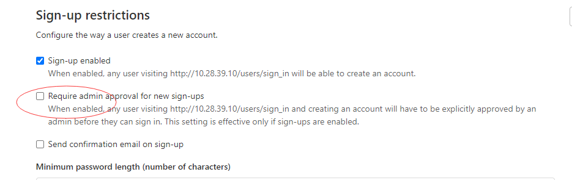

网上看了搭建gitlab的过程，需要安装的东西不少。

使用docker，就可以省去很多麻烦。

试一下。

下载镜像。

```
sudo docker pull gitlab/gitlab-ce:latest
```

运行：

```
sudo docker run --detach \
    --hostname 0.0.0.0 \
    --publish 443:443 --publish 80:80 \
    --name gitlab \
    --restart always \
    --volume /srv/gitlab/config:/etc/gitlab \
    --volume /srv/gitlab/logs:/var/log/gitlab \
    --volume /srv/gitlab/data:/var/opt/gitlab \
    gitlab/gitlab-ce:latest
```

运行后，却不能访问。

查看日志：

```
sudo docker logs -f -t --tail 10 gitlab
```

是因为启动要一段时间，过两分钟就可以访问了。

的确挺强大的。

还集成了web IDE。

默认的管理员用户是root，密码是你设置的密码。

然后进入设置，把验证关闭掉。



也可以不关闭。

那就不关闭，进入管理界面，可以看到前面的用户的申请信息。

创建2个用户：

hanliang.xiong：1073167306@qq.com  username是teddyxiong53，fullname是hanliang xiong。

webdev：teddyxiong53@163.com

创建一个group，名字为only4u。

把2个user都加到这个group里。

新建2个project，一个blog。一个web。

用repo来同步。

```
http://10.28.39.10/only4u/web
http://10.28.39.10/only4u/blog
```


现在有时间，继续研究一下gitlab。

就创建几个角色，相互提交。把各种功能都试用一遍。

# gitlab工作流

[GitLab](https://so.csdn.net/so/search?q=GitLab&spm=1001.2101.3001.7020) 工作流提供了一种简单、透明和有效的 git 工作方式，并与问题跟踪系统相结合。

git 工作流主要的问题是：

一、默认的 master 分支只是用于发布，开发都在其他分支上。

二、对于多数应用来说过于复杂，特别是 release 和 hotfix 分支的不可部署导致使用上的复杂。

[GitHub 工作流](https://guides.github.com/introduction/flow/index.html)十分简单，只有两个分支，master 和 feature。[Atlassian 公司推荐的工作流](https://www.atlassian.com/blog/archives/simple-git-workflow-simple)也基本类似。

GitHub 工作流的主要问题是过于简单，没有对于常见的工作场景中的问题提出解决办法。

GitHub 工作流隐含一个假定：

每次合并 feature，主分支的代码是立即发布的。

然而，实际中常常不能满足这个假定，

例如：

你无法控制代码发布时间，例如 App 发布要等审核通过。

再例如：发布时间窗口限制，合并分支的时候也许并不在发布时间窗口。


Gitlab flow 的最大原则叫做"上游优先"（upsteam first），

即只存在一个主分支master，

它是所有其他分支的"上游"。

只有上游分支采纳的代码变化，才能应用到其他分支。


对于"持续发布"的项目，它建议在master分支以外，再建立不同的环境分支。

比如，"开发环境"的分支是master，

"预发环境"的分支是pre-production，

"生产环境"的分支是production。


开发分支是预发分支的"上游"，

预发分支又是生产分支的"上游"。

代码的变化，必须由"上游"向"下游"发展。

比如，生产环境出现了bug，这时就要新建一个功能分支，先把它合并到master，确认没有问题，再cherry-pick到pre-production，这一步也没有问题，才进入production。


只有紧急情况，才允许跳过上游，直接合并到下游分支。


参考资料

1、

https://blog.csdn.net/henryhu712/article/details/82284702

2、Gitlab工作流程概述

https://blog.csdn.net/lss6378/article/details/86774492

3、

http://www.ruanyifeng.com/blog/2015/12/git-workflow.html

# 参考资料

1、

https://www.jianshu.com/p/24959481340e

2、官网

https://docs.gitlab.com/omnibus/docker/