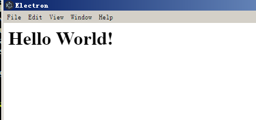

--

还是把electron的仔细学习一下。用来写跨平台的gui程序。

# 安装electron

安装全局工具

```
npm install electron-prebuilt -g
```

这样得到一个全局命令。electron。

然后下载sample例子。

https://github.com/hokein/electron-sample-apps

这个下面有不少的例子。我们看HelloWorld的。

# HelloWorld

可以看到下面有3个文件。

```
index.html  main.js  package.json
```

执行main.js。

```
electron main.js
```

就可以看到一个窗口。




你可以把electron看作成一个被 JavaScript 控制的，精简版的 Chromium 浏览器。

在 Electron 里，运行 `package.json` 里 `main` 脚本的进程被称为**主进程**。在主进程运行的脚本可以以创建 web 页面的形式展示 GUI。

由于 Electron 使用 Chromium 来展示页面，所以 Chromium 的多进程结构也被充分利用。每个 Electron 的页面都在运行着自己的进程，这样的进程我们称之为**渲染进程**。


GUI 模块或者系统底层的模块只可以在主进程中使用。要使用这些模块，你应当很熟悉主进程 vs 渲染进程脚本的概念。

如果 `main` 字段没有在 `package.json` 声明，Electron会优先加载 `index.js`。

这个是个github开发的一个开源框架。

后端是nodejs，前端的chromium。

用来开发桌面程序。

github的atom和微软的vscode都基于electron开发的编辑器。

通过把nodejs和chromium合并到同一个运行时环境里。打包为各个os的应用。

electron的版本发布非常频繁。

当nodejs和chromium有更新的时候，都会发新的版本。


一个基础的electron包含3个文件：

1、package.json。

2、main.js。

3、index.html。


官网在这里：https://electronjs.org/

基于electron开发的软件有：https://electronjs.org/apps


先看HelloWorld的。

然后看一个实用的例子。

https://electronjs.org/apps/simplenote


# 结构分析

electron运行package.json里的main脚本的进程，叫做主进程。

在主进程里运行的脚本，通过创建web页面来展示用户界面。

**一个electron应用有且仅有一个主进程。**

由于electron用到了chromium来展示web界面，所以chromium的多进程框架也被使用到。

在普通的浏览器里，web页面通常运行在一个sandbox里，不允许接触原生资源。

但是electron的通过nodejs的支持，**可以接触原生资源。**


## 主进程和渲染进程的区别

主进程使用BrowserWindow实例来创建页面。

每个BrowserWindow实例都在自己的渲染进程里运行。

主进程管理所有的web页面和他们对应的渲染进程。

每个渲染进程都是独立，它只关心自己运行的web页面。

**在web页面里操作原生资源是非常危险的。**

**渲染进程需要发消息给主进程来完成这种操作。**

# 官方教程

https://www.electronjs.org/zh/docs/latest/tutorial/quick-start

现在您有了一个页面，将它加载进应用窗口中。 要做到这一点，你需要 两个Electron模块：

- [`app`](https://www.electronjs.org/zh/docs/latest/api/app) 模块，它控制应用程序的事件生命周期。
- [`BrowserWindow`](https://www.electronjs.org/zh/docs/latest/api/browser-window) 模块，它创建和管理应用程序 窗口。

```
mkdir my-electron-app && cd my-electron-app
npm init
```

照着最新的教程，不行。我安装的electron的版本是1.4.13。现在的最新版本是20.1.1。

这个版本确实是太老了。

## 手动下载electron

先找electron和nodejs版本关系对应表。

我现在肯定以我的node为基准。node版本是v14.18.1

https://segmentfault.com/a/1190000041871749

这个是对照表。

https://github.com/electron/electron/releases/tag/v14.2.9

那就下载这个版本。

下载完成之后，将其解压到node_modules/electron下的dist文件夹（需要手动创建），然后在node_modules/electron建立一个path.txt文件。

在windows平台下，path.txt文件的内容是electron.exe，编辑保存后，即可在当前工程下引用electron了。

不用这样，我直接这样设置：

```
"scripts": {
    "test": "D:/download/electron-v14.2.9-win32-x64/electron.exe ."
  },
```

npm run test，可以正常运行。

打印的版本信息是这样，可以看出，这个node是electron内部打包的node，跟我们的node没有什么关系。

```
We are using Node.js 14.17.0, Chromium 93.0.4577.82, and Electron 14.2.9.
```

但是没事，这个版本不新不旧，应该稳定性和兼容性都可以。就在这个基础上往下练习官方例子。


您可能注意到了 **a**pp 和 **B**rowser**W**indow 两个模块名的大小写差异。 

Electron 遵循 JavaScript 传统约定，

以帕斯卡命名法 (PascalCase) 命名可实例化的类 (如 BrowserWindow, Tray 和 Notification)，

以驼峰命名法 (camelCase) 命名不可实例化的函数、变量等 (如 app, ipcRenderer, webContents) 。


但是 Electron 暴露了 `app.whenReady()` 方法，作为其 `ready` 事件的专用监听器，这样可以避免直接监听 .on 事件带来的一些问题。


Electron 目前只支持三个平台：`win32` (Windows), `linux` (Linux) 和 `darwin` (macOS) 。

## 预加载脚本

Electron 的主进程是一个拥有着完全操作系统访问权限的 Node.js 环境。 

除了 [Electron 模组](https://www.electronjs.org/zh/docs/latest/api/app) 之外，你也可以使用 [Node.js 内置模块](https://nodejs.org/dist/latest/docs/api/) 和所有通过 npm 安装的软件包。 

另一方面，出于安全原因，渲染进程默认跑在网页页面上，而并非 Node.js里。


为了将 Electron 的不同类型的进程桥接在一起，我们需要使用被称为 **预加载** 的特殊脚本。


# 使用electron的API

electron在主进程和渲染进程里，提供了大量的API给开发者使用。

开发者只需要require这个模块：

```
const electron = require("electron");
```

所有的API都有一个属性，就是进程类型，有的API只能给主进程用。

在渲染进程里，一般会这样写。这个在主进程里不能这么写，会报未定义的错误的。

```
const {remote} = require("electron");
const {BrowserWindow} = remote;
const win = new BrowserWindow();
```


# 跟nodejs关系

所有可以在nodejs里调用的东西，在electron里也可以调用。

# 调试应用的方法


# 分发应用

1、先到这里下载打包的electron执行文件。

2、解压后，在resources目录下，新建app目录。把你写的html文件、js文件、json文件都放在app目录下。

然后双击electron.exe运行就好了。

上面说的是手动打包的方式。

我感觉有点不正常。

菜单栏没有出来。

可以用工具打包。


注意：

最好全局安装，这样就可以避免每次都要安装一次的麻烦。

```
npm install -g electron
```


# helloworld

main.js

```
const {app, BrowserWindow} = require('electron');

let mainWindow;

app.on('ready', () => {
  mainWindow = new BrowserWindow({
      height: 600,
      width: 800, 
      webPreferences: {
      	nodeIntegration: true
      }
  });

  mainWindow.loadURL('file://' + __dirname + '/index.html');
});
```

看到的窗口主体是BrowserWindow

依赖的模块就是electron。

# helloworld-sharedobj

这个是演示main.js向index.html里传递内容。

main.js

```
global.sharedObj = {myvar: "hellofrommainjs"};
```

在index.html里使用

```
<script>
const {remote} = require('electron');
document.write(remote.getGlobal('sharedObj').myvar)
</script>
```

但是看最新的electron已经弃用了remote这个模块了。

我们已经着手移除[Electron 9](https://www.electronjs.org/blog/electron-9-0)中的 `remote` 模块， 计划在Electron 14中完成。

用什么来替代呢？


# api了解

先快速过一下api列表。

## 主进程api

### app

控制应用程序的事件生命周期。

app对象会发出这些event

```

will-finish-launching
	在win和linux上，等价于ready事件。
	在macos上，不等价。
ready
	当electron初始化完成的时候，发出一次。
	可以通过调用app.isReady()查询事件是否发出来过。
	也可以用app.whenReady()来得到一个Promise。
window-all-closed
	所有窗口都被关闭时发出。
	默认的行为是退出程序。
	你可以监听这个事件，改变这个默认行为。
before-quit
will-quit
quit
还有很多其他的event。不一一看了。
```

app的方法有这些：

```]
quit()
	尝试关闭所有的窗口，在关闭前发出before-quit事件，
	如果所有窗口都已经关闭，发出will-quit事件。
exit()
	不会有quit等事件，相当于强制退出。
relaunch
	重启当前实例，就像vscode的reload window。
isReady()
whenReady()
focus()
getAppPath()
	获取应用所在的路径。
getPath()
getFileIcon()
setPath()
getVersion()
getName()
setName()
getLocale()
getLocaleCountryCode()
addRecentDocument()
clearRecentDocument()

```

## BrowserWindow

创建并控制浏览器窗口。

在 `app` 模块 `emitted ready `事件之前，您不能使用此模块。

`BrowserWindow` 类暴露了各种方法来修改应用窗口的外观和行为。

### 父子窗口

通过使用 `parent` 选项，你可以创建子窗口：

```javascript
const { BrowserWindow } = require('electron')

const top = new BrowserWindow()
const child = new BrowserWindow({ parent: top })
child.show()
top.show()
```

`child` 窗口将总是显示在 `top` 窗口的顶部.

### 模态窗口

模态窗口是禁用父窗口的子窗口，创建模态窗口必须设置 `parent` 和 `modal` 选项：


`BrowserWindow`是一个[EventEmitter](https://nodejs.org/api/events.html#events_class_eventemitter).

通过 `options` 可以创建一个具有原生属性的 `BrowserWindow` 。

## 渲染进程

### contextBridge

### ipcRender

# 找一找有用的应用

先把优秀的而且使用的应用找来使用起来。看看可以做哪些想法。

看可以做出什么样的效果。

这个生成手绘风格的流程图，看起来不错。但是要收费28元。

https://www.electronjs.org/apps/umlboard

这个是连接数据库进行sql操作。感觉没有什么使用价值。

https://github.com/synle/sqlui-native

这个website builder，看看是做了什么。不错，拖拽式的界面设计，效果不错。

https://www.electronjs.org/apps/silex

这个是商业软件，

https://www.electronjs.org/apps/bootstrap-studio

我的总体感受就是，还是笔记类的居多。

# 参考资料

1、electron

https://zh.wikipedia.org/wiki/Electron_(%E8%BD%AF%E4%BB%B6%E6%A1%86%E6%9E%B6)

2、如何利用 Electron 开发一个桌面 APP

https://zhuanlan.zhihu.com/p/32765171

3、

https://www.w3cschool.cn/electronmanual/p9al1qkx.html

