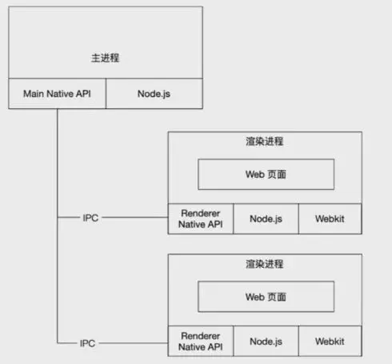
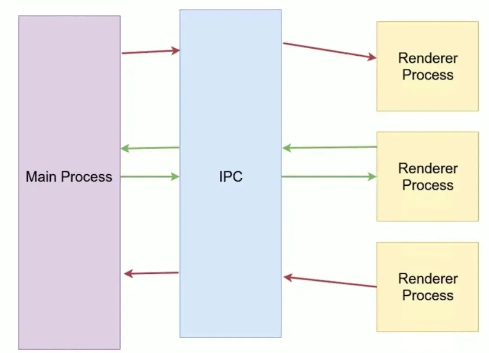

--

还是把electron的仔细学习一下。用来写跨平台的gui程序。

# 资源

github上 electron的topic下面有不少的东西。

https://github.com/topics/electron


https://github.com/sindresorhus/awesome-electron

# 安装electron

安装全局工具

```
npm install electron-prebuilt -g
```

这样得到一个全局命令。electron。

然后下载sample例子。

https://github.com/hokein/electron-sample-apps

这个下面有不少的例子。我们看HelloWorld的。

# 介绍

Electron是一个开源的桌面应用程序开发框架，

它允许开发者使用Web技术（如HTML、CSS和JavaScript）构建跨平台的桌面应用程序。

以下是Electron框架的简要介绍：

1. **跨平台支持：** Electron使开发者能够构建跨平台的桌面应用程序，可以运行在Windows、macOS和Linux操作系统上。开发者只需编写一次代码，就可以在多个平台上部署应用程序。

2. **基于Web技术：** Electron应用程序的用户界面使用Web技术构建，主要是HTML、CSS和JavaScript。这意味着前端开发者可以使用他们熟悉的技能来构建桌面应用程序。

3. **Chromium内核：** Electron应用程序的渲染引擎基于Chromium，这是Google Chrome浏览器的开源版本。这意味着应用程序可以充分利用Chromium的先进的Web渲染能力，并保持与Web标准的兼容性。

4. **Node.js集成：** Electron集成了Node.js，这意味着开发者可以使用JavaScript编写应用程序的后端逻辑。这种前后端一体化的开发方式使开发人员能够轻松地与操作系统进行交互、访问本地文件系统和执行系统级任务。

5. **强大的生态系统：** Electron具有丰富的第三方库和插件，可以帮助开发者扩展应用程序的功能，包括窗口管理、自动更新、访问硬件设备等。

6. **自动更新和部署：** Electron允许开发者轻松实现应用程序的自动更新，以确保用户始终使用最新版本。此外，开发者可以使用各种工具将应用程序部署到不同的应用商店和分发渠道。

7. **开源和活跃的社区：** Electron是一个开源项目，拥有庞大的社区支持。这意味着开发者可以获得广泛的文档、教程和支持，以解决问题和改进应用程序。

8. **用例广泛：** Electron已经被用于构建各种类型的应用程序，包括文本编辑器、聊天客户端、开发工具、音视频播放器、桌面游戏等。

总的来说，Electron是一个强大的桌面应用程序开发框架，使开发者能够使用Web技术构建跨平台的应用程序，同时获得访问操作系统和硬件的能力。这使得它成为许多开发者和公司的首选选择，用于快速构建桌面应用程序。

# 发展历史

Electron GUI 技术的发展历史可以追溯到2013年，当时是由GitHub公司开发的用于构建跨平台桌面应用程序的开源框架。以下是 Electron 的主要发展历程：

1. **诞生和初期发展（2013-2015年）**：
   - Electron 最初被称为 Atom Shell，是为了支持 GitHub 的文本编辑器 Atom 的开发而创建的。
   - GitHub 公司将 Atom Shell 开源，并迅速吸引了开发者的关注，因为它为使用 Web 技术构建桌面应用提供了一种简单而强大的方式。

2. **正式更名为 Electron（2015年）**：
   - 由于 Atom Shell 在开源社区中获得了广泛的认可和使用，GitHub 宣布将其正式更名为 Electron，并专注于提供更好的文档和支持。

3. **增长和普及（2015-至今）**：
   - 随着时间的推移，Electron 在开发者社区中变得越来越流行。它的简单易用性和基于 Web 技术的开发方式吸引了许多开发者。
   - 许多知名的应用程序开始采用 Electron，包括 Visual Studio Code、Slack、Discord 等，这些应用程序的成功案例进一步促进了 Electron 的普及和发展。
   - 随着时间的推移，Electron 的生态系统不断壮大，涌现了大量的插件和工具，为开发者提供了丰富的资源和支持。

4. **持续改进和发展**：
   - Electron 框架本身也在不断地改进和发展，发布了许多版本，引入了新的功能、性能优化和安全增强等。
   - 开发者社区也在不断地贡献代码、修复 Bug，并提出了各种改进建议，以使 Electron 框架更加完善和强大。

总的来说，Electron 在过去的几年中已经成为了构建跨平台桌面应用程序的首选框架之一，它的发展历程充满了活力和创新，为开发者提供了丰富的工具和资源，助力他们构建出更加强大、灵活和易用的应用程序。

# 入门

当然，让我们一步步来学习如何入门开发 Electron 应用程序：

### 步骤 1：安装 Node.js 和 npm

首先，你需要安装 Node.js 和 npm（Node 包管理器），因为 Electron 是基于 Node.js 的。你可以从 Node.js 官网下载并安装最新版本的 Node.js：[https://nodejs.org](https://nodejs.org)。

安装完成后，你可以在命令行中运行以下命令来验证 Node.js 和 npm 是否已经正确安装：

```bash
node -v
npm -v
```

### 步骤 2：创建新的 Electron 项目

1. 在命令行中，创建一个新的目录用于你的 Electron 项目：

```bash
mkdir my-electron-app
cd my-electron-app
```

2. 初始化一个新的 npm 项目：

```bash
npm init -y
```

### 步骤 3：安装 Electron

在项目目录中，使用 npm 安装 Electron：

```bash
npm install electron
```

### 步骤 4：创建主进程和渲染进程文件

1. 创建一个名为 `main.js` 的文件作为 Electron 应用的主进程文件。这个文件将控制整个应用的生命周期和窗口管理等。

```javascript
// main.js
const { app, BrowserWindow } = require('electron');

function createWindow() {
  const win = new BrowserWindow({
    width: 800,
    height: 600,
    webPreferences: {
      nodeIntegration: true
    }
  });

  win.loadFile('index.html');
}

app.whenReady().then(createWindow);
```

2. 创建一个名为 `index.html` 的文件作为 Electron 应用的渲染进程文件。这个文件将作为应用的主界面。

```html
<!-- index.html -->
<!DOCTYPE html>
<html lang="en">
<head>
  <meta charset="UTF-8">
  <meta name="viewport" content="width=device-width, initial-scale=1.0">
  <title>My Electron App</title>
</head>
<body>
  <h1>Hello, Electron!</h1>
</body>
</html>
```

### 步骤 5：运行 Electron 应用

在项目目录中，运行以下命令启动 Electron 应用：

```bash
npx electron .
```

这将启动 Electron 应用，并显示一个窗口，窗口中将加载 `index.html` 文件中的内容。

### 结束语

至此，你已经成功创建了一个简单的 Electron 应用程序。从这个基础上，你可以继续学习如何添加更多功能、界面和交互性，开发出更加丰富和复杂的 Electron 应用。祝你开发愉快！

# HelloWorld


可以看到下面有3个文件。

```
index.html  main.js  package.json
```

执行main.js。

```
electron main.js
```

就可以看到一个窗口。


你可以把electron看作成一个被 JavaScript 控制的，精简版的 Chromium 浏览器。

在 Electron 里，运行 `package.json` 里 `main` 脚本的进程被称为**主进程**。在主进程运行的脚本可以以创建 web 页面的形式展示 GUI。

由于 Electron 使用 Chromium 来展示页面，所以 Chromium 的多进程结构也被充分利用。每个 Electron 的页面都在运行着自己的进程，这样的进程我们称之为**渲染进程**。


GUI 模块或者系统底层的模块只可以在主进程中使用。要使用这些模块，你应当很熟悉主进程 vs 渲染进程脚本的概念。

如果 `main` 字段没有在 `package.json` 声明，Electron会优先加载 `index.js`。

这个是个github开发的一个开源框架。

后端是nodejs，前端的chromium。

用来开发桌面程序。

github的atom和微软的vscode都基于electron开发的编辑器。

通过把nodejs和chromium合并到同一个运行时环境里。打包为各个os的应用。

electron的版本发布非常频繁。

当nodejs和chromium有更新的时候，都会发新的版本。


一个基础的electron包含3个文件：

1、package.json。

2、main.js。

3、index.html。


官网在这里：https://electronjs.org/

基于electron开发的软件有：https://electronjs.org/apps


先看HelloWorld的。

然后看一个实用的例子。

https://electronjs.org/apps/simplenote

## chromium的多进程结构介绍

Chromium是一个开源的Web浏览器项目，

而Google Chrome则是基于Chromium开发的一个流行的Web浏览器。

Chromium采用了多进程的架构，这种架构有助于提高浏览器的性能、稳定性和安全性。

下面是Chromium的多进程结构的简要介绍：

1. 主进程（Main Process）：
   - **主进程是Chromium浏览器的控制中心。**
   - 它负责启动和管理浏览器窗口，以及处理用户界面元素，如地址栏、书签和扩展。
   - **主进程也负责协调其他进程的工作**，包括渲染进程、插件进程和GPU进程。

2. 渲染进程（Renderer Process）：
   - **每个标签页或窗口都在单独的渲染进程中运行。**
   - 渲染进程负责加载和渲染网页内容，执行JavaScript代码，处理HTML和CSS等。
   - 这种隔离的方式有助于防止一个网页崩溃影响整个浏览器，提高了浏览器的稳定性。

3. GPU进程（GPU Process）：
   - GPU进程负责处理与图形相关的任务，如绘制网页中的图形和视频。
   - 这有助于加速页面渲染，尤其是在需要使用硬件加速的情况下。
   - 使用独立的GPU进程可以提高性能和安全性，因为GPU进程与渲染进程和主进程隔离开。

4. 插件进程（Plugin Process）：
   - 插件进程是用于运行浏览器插件（如Adobe Flash Player或PDF查看器）的独立进程。
   - 这有助于防止插件崩溃或导致浏览器的崩溃，保持浏览器的稳定性。

5. 媒体进程（Media Process）：
   - 媒体进程用于处理音频和视频播放。
   - 这有助于隔离媒体播放的相关任务，提高了媒体播放的性能和稳定性。

Chromium的多进程结构带来了一些显著的优点，

包括更好的性能、更好的安全性和更好的稳定性。

每个进程都在自己的沙盒中运行，从而限制了恶意网页或插件对整个浏览器系统的访问。

此外，即使一个进程崩溃，其他进程仍然可以正常工作，使浏览器保持可用状态。这种多进程结构已经成为现代Web浏览器的标准，用于提供更好的用户体验。


当开发 Electron 应用时，主要有两种类型的进程：主进程和渲染进程。以下是它们的基本概念和区别：

### 主进程（Main Process）：

- 主进程是 Electron 应用的核心进程，负责控制应用的生命周期、管理窗口和执行系统级别的操作。
- 一个 Electron 应用只有一个主进程，通常由一个名为 `main.js` 的脚本文件控制。
- 主进程中可以创建和管理多个渲染进程，每个渲染进程对应一个窗口。

在主进程中，通常会执行以下任务：

1. 创建主窗口和其他辅助窗口。
2. 监听应用生命周期事件（如应用启动、退出等）。
3. 处理系统级别的操作和事件。
4. 与底层操作系统进行交互，如文件系统、网络请求等。
5. 创建和管理渲染进程。

### 渲染进程（Renderer Process）：

- 渲染进程是 Electron 应用中用于显示界面的进程，通常由一个 HTML 页面和相关的前端代码组成。
- 一个 Electron 应用可以有一个或多个渲染进程，每个渲染进程对应一个窗口。
- 渲染进程通过渲染器进程 API（Renderer APIs）与主进程进行通信和交互。

在渲染进程中，通常会执行以下任务：

1. 显示用户界面，呈现 HTML、CSS 和 JavaScript。
2. 处理用户输入和交互事件。
3. 通过 IPC（进程间通信）与主进程进行通信，以执行一些需要主进程权限的任务，比如文件操作、系统调用等。
4. 加载和管理渲染进程内的网页或应用。

### 通信机制：

主进程和渲染进程之间通过 IPC（进程间通信）进行通信，Electron 提供了一些 API 来实现这种通信。比如，在渲染进程中可以使用 `ipcRenderer` 对象来发送事件和数据到主进程，而在主进程中可以使用 `ipcMain` 模块来监听和处理渲染进程发送过来的事件。

这种进程间通信机制使得主进程和渲染进程可以进行数据交换和协作，实现更复杂的应用逻辑和功能。

总的来说，主进程负责控制整个应用的生命周期和系统级别的操作，而渲染进程则负责显示用户界面和处理用户交互。通过这种分工，Electron 应用可以实现丰富的功能和交互性。

# 结构分析

electron运行package.json里的main脚本的进程，叫做主进程。

在主进程里运行的脚本，通过创建web页面来展示用户界面。

**一个electron应用有且仅有一个主进程。**

由于electron用到了chromium来展示web界面，所以chromium的多进程框架也被使用到。

在普通的浏览器里，web页面通常运行在一个sandbox里，不允许接触原生资源。

但是electron的通过nodejs的支持，**可以接触原生资源。**


## 主进程和渲染进程的区别

主进程使用BrowserWindow实例来创建页面。

每个BrowserWindow实例都在自己的渲染进程里运行。

主进程管理所有的web页面和他们对应的渲染进程。

每个渲染进程都是独立，它只关心自己运行的web页面。

**在web页面里操作原生资源是非常危险的。**

**渲染进程需要发消息给主进程来完成这种操作。**

# 复杂一点的例子

好的，以下是一个稍微复杂一些的 Electron 应用示例，它包含了界面的一些复杂设计、对本地文件的操作以及进程间通信。

### 主进程（main.js）

```javascript
const { app, BrowserWindow, ipcMain, dialog } = require('electron');
const fs = require('fs');

let mainWindow;

function createWindow() {
  mainWindow = new BrowserWindow({
    width: 800,
    height: 600,
    webPreferences: {
      nodeIntegration: true
    }
  });

  mainWindow.loadFile('index.html');

  mainWindow.on('closed', () => {
    mainWindow = null;
  });
}

app.on('ready', createWindow);

// 打开文件对话框
ipcMain.on('open-file-dialog', (event) => {
  dialog.showOpenDialog(mainWindow, {
    properties: ['openFile']
  }).then(result => {
    if (!result.canceled && result.filePaths.length > 0) {
      const filePath = result.filePaths[0];
      fs.readFile(filePath, 'utf-8', (err, data) => {
        if (err) {
          event.sender.send('file-opened', { error: err.message });
        } else {
          event.sender.send('file-opened', { data });
        }
      });
    }
  });
});
```

### 渲染进程（index.html）

```html
<!DOCTYPE html>
<html lang="en">
<head>
  <meta charset="UTF-8">
  <meta name="viewport" content="width=device-width, initial-scale=1.0">
  <title>Complex Electron App</title>
</head>
<body>
  <h1>Complex Electron App</h1>
  <button id="open-file-btn">Open File</button>
  <div id="file-content"></div>

  <script>
    const { ipcRenderer } = require('electron');

    document.getElementById('open-file-btn').addEventListener('click', () => {
      ipcRenderer.send('open-file-dialog');
    });

    ipcRenderer.on('file-opened', (event, data) => {
      const fileContentDiv = document.getElementById('file-content');
      if (data.error) {
        fileContentDiv.innerHTML = `<p>Error: ${data.error}</p>`;
      } else {
        fileContentDiv.innerHTML = `<pre>${data.data}</pre>`;
      }
    });
  </script>
</body>
</html>
```

在这个示例中，主进程负责创建窗口、处理文件操作和进程通信。渲染进程负责显示界面、处理用户交互和显示文件内容。

当用户点击 "Open File" 按钮时，渲染进程会发送一个事件到主进程，请求打开文件对话框。主进程接收到事件后，打开文件对话框并读取所选文件的内容，然后将内容发送回渲染进程。渲染进程接收到内容后，将其显示在界面上。

这个示例展示了如何使用 Electron 来实现一个包含界面设计、本地文件操作和进程通信的复杂应用。

# 更复杂一些的例子

好的，让我们创建一个更丰富的示例，其中包含更复杂的界面布局和更多实用的功能，例如菜单栏、工具栏、文件浏览器、文本编辑器等。我们将使用 Electron 的常见模块来实现这些功能。

### 主进程（main.js）

```javascript
const { app, BrowserWindow, ipcMain, dialog, Menu } = require('electron');
const fs = require('fs');

let mainWindow;

function createWindow() {
  mainWindow = new BrowserWindow({
    width: 1024,
    height: 768,
    webPreferences: {
      nodeIntegration: true
    }
  });

  mainWindow.loadFile('index.html');

  const mainMenu = Menu.buildFromTemplate([
    {
      label: 'File',
      submenu: [
        {
          label: 'Open File',
          accelerator: 'CmdOrCtrl+O',
          click() {
            mainWindow.webContents.send('open-file-dialog');
          }
        },
        {
          label: 'Save File',
          accelerator: 'CmdOrCtrl+S',
          click() {
            mainWindow.webContents.send('save-file-dialog');
          }
        },
        { type: 'separator' },
        {
          label: 'Exit',
          accelerator: 'CmdOrCtrl+Q',
          click() {
            app.quit();
          }
        }
      ]
    }
  ]);
  Menu.setApplicationMenu(mainMenu);

  mainWindow.on('closed', () => {
    mainWindow = null;
  });
}

app.on('ready', createWindow);

ipcMain.on('open-file-dialog', (event) => {
  dialog.showOpenDialog(mainWindow, {
    properties: ['openFile']
  }).then(result => {
    if (!result.canceled && result.filePaths.length > 0) {
      const filePath = result.filePaths[0];
      fs.readFile(filePath, 'utf-8', (err, data) => {
        if (err) {
          event.sender.send('file-opened', { error: err.message });
        } else {
          event.sender.send('file-opened', { filePath, data });
        }
      });
    }
  });
});

ipcMain.on('save-file-dialog', (event, data) => {
  dialog.showSaveDialog(mainWindow, {
    title: 'Save File',
    defaultPath: app.getPath('documents'),
    filters: [{ name: 'Text Files', extensions: ['txt'] }]
  }).then(result => {
    if (!result.canceled && result.filePath) {
      fs.writeFile(result.filePath, data, (err) => {
        if (err) {
          event.sender.send('file-saved', { error: err.message });
        } else {
          event.sender.send('file-saved', { success: true });
        }
      });
    }
  });
});
```

### 渲染进程（index.html）

```html
<!DOCTYPE html>
<html lang="en">
<head>
  <meta charset="UTF-8">
  <meta name="viewport" content="width=device-width, initial-scale=1.0">
  <title>Advanced Electron App</title>
</head>
<body>
  <header>
    <h1>Advanced Electron App</h1>
  </header>
  <main>
    <div id="file-explorer">
      <h2>File Explorer</h2>
      <ul id="file-list"></ul>
    </div>
    <div id="editor">
      <h2>Text Editor</h2>
      <textarea id="editor-text"></textarea>
    </div>
  </main>
  <script>
    const { ipcRenderer } = require('electron');

    ipcRenderer.on('file-opened', (event, data) => {
      if (data.error) {
        alert(`Error: ${data.error}`);
      } else {
        document.getElementById('editor-text').value = data.data;
      }
    });

    ipcRenderer.on('file-saved', (event, data) => {
      if (data.error) {
        alert(`Error: ${data.error}`);
      } else if (data.success) {
        alert('File saved successfully!');
      }
    });
  </script>
</body>
</html>
```

这个示例中，我们创建了一个包含文件浏览器和文本编辑器的应用。用户可以通过菜单栏中的选项来打开和保存文件。打开文件后，文件内容将显示在文本编辑器中，用户可以对其进行编辑并保存。

# 大型的electron应用的目录结构和架构

针对大型 Electron 应用程序，一个清晰且可维护的目录结构和良好的架构设计非常重要。下面是一个针对大型 Electron 应用的典型目录结构和架构设计示例：

### 目录结构：

```
your-electron-app/
│
├── package.json          # npm 包配置文件
├── main.js               # 主进程入口文件
├── preload.js            # 预加载脚本文件（可选）
│
├── app/
│   ├── index.html        # 渲染进程入口 HTML 文件
│   ├── renderer.js       # 渲染进程脚本文件
│   ├── styles.css        # 渲染进程样式文件
│   ├── components/       # 可复用的组件目录
│   ├── pages/            # 页面组件目录
│   ├── assets/           # 图片、字体等资源文件目录
│   └── ...
│
├── main-process/         # 主进程相关文件目录
│   ├── windows/          # 窗口管理器目录
│   ├── ipc/              # 进程间通信相关文件目录
│   └── ...
│
├── renderer-process/     # 渲染进程相关文件目录
│   ├── components/       # 可复用的组件目录
│   ├── pages/            # 页面组件目录
│   ├── services/         # 服务相关文件目录
│   └── ...
│
└── ...
```

### 架构设计：

1. **主进程（Main Process）**：
   - `main.js` 文件负责创建应用的主窗口和处理应用的生命周期事件。
   - `preload.js` 文件可选，用于预加载一些在渲染进程中需要用到的模块或变量。
   - `main-process/` 目录用于存放主进程相关的模块和功能，如窗口管理、进程间通信等。
   - `main-process/windows/` 目录可以包含窗口相关的代码，如窗口的创建、关闭、最小化等。
   - `main-process/ipc/` 目录可以包含进程间通信相关的代码，如处理渲染进程发送的事件等。

2. **渲染进程（Renderer Process）**：
   - `app/` 目录存放渲染进程相关的文件，包括主 HTML 文件、渲染进程脚本和样式文件。
   - `renderer-process/` 目录用于存放渲染进程相关的模块和功能，如页面组件、服务等。
   - `renderer-process/components/` 目录可以包含可复用的组件，如按钮、表单等。
   - `renderer-process/pages/` 目录包含应用的不同页面组件。
   - `renderer-process/services/` 目录可以包含与后端通信、数据处理等服务相关的代码。

3. **资源文件（Assets）**：
   - `app/assets/` 目录存放应用所需的资源文件，如图片、字体等。

4. **其他目录和文件**：
   - `package.json` 文件用于配置应用的依赖和脚本。
   - 其他目录和文件根据实际需要添加，例如测试文件、文档等。

通过以上的目录结构和架构设计，可以将大型 Electron 应用分为多个模块和组件，使代码结构清晰、可维护性高，并且方便团队协作。

# 对于工厂场景，electron可以做哪些应用

Electron 在工厂场景中可以实现许多应用，例如：

1. **生产过程监控系统**：通过 Electron 应用可以实时监控工厂中的生产过程，包括设备运行状态、生产数据采集、生产线效率分析等，从而提高生产效率和质量管理水平。

2. **设备远程控制系统**：Electron 应用可以连接到工厂中的设备，实现远程监控和控制，包括设备开关、参数调整、故障诊断等功能，从而实现远程设备管理和维护。

3. **质量检测和品质管理系统**：通过 Electron 应用可以实现工厂中产品的质量检测和品质管理，包括自动化检测、缺陷识别、数据分析等功能，从而提高产品质量和生产效率。

4. **生产计划和调度系统**：Electron 应用可以帮助工厂制定生产计划和调度方案，包括订单管理、生产排程、物料管理等功能，从而优化生产资源利用和生产进度管理。

5. **员工培训和知识管理系统**：Electron 应用可以用于员工培训和知识管理，包括培训课程管理、知识库查询、在线考试等功能，从而提高员工技能和工作效率。

6. **能源监测和节能管理系统**：Electron 应用可以用于监测工厂中的能源消耗情况，包括电力、水、气等能源的监测和分析，从而实现节能减排和成本控制。

7. **物料追溯和供应链管理系统**：Electron 应用可以用于物料追溯和供应链管理，包括物料入库、出库、流转等过程的追踪和管理，从而保证产品质量和供应链的可控性。

8. **安全监控和环境管理系统**：Electron 应用可以用于监控工厂中的安全和环境情况，包括生产现场的安全监控、环境污染检测等功能，从而保障员工安全和环境保护。

总的来说，Electron 在工厂场景中可以实现许多应用，帮助工厂提高生产效率、质量管理水平和安全环保水平，从而实现智能制造和工业升级。

# 官方教程

https://www.electronjs.org/zh/docs/latest/tutorial/quick-start

现在您有了一个页面，将它加载进应用窗口中。 要做到这一点，你需要 两个Electron模块：

- [`app`](https://www.electronjs.org/zh/docs/latest/api/app) 模块，它控制应用程序的事件生命周期。
- [`BrowserWindow`](https://www.electronjs.org/zh/docs/latest/api/browser-window) 模块，它创建和管理应用程序 窗口。

```
mkdir my-electron-app && cd my-electron-app
npm init
```

照着最新的教程，不行。我安装的electron的版本是1.4.13。现在的最新版本是20.1.1。

这个版本确实是太老了。

## 手动下载electron

先找electron和nodejs版本关系对应表。

我现在肯定以我的node为基准。node版本是v14.18.1

https://segmentfault.com/a/1190000041871749

这个是对照表。

https://github.com/electron/electron/releases/tag/v14.2.9

那就下载这个版本。

下载完成之后，将其解压到node_modules/electron下的dist文件夹（需要手动创建），然后在node_modules/electron建立一个path.txt文件。

在windows平台下，path.txt文件的内容是electron.exe，编辑保存后，即可在当前工程下引用electron了。

不用这样，我直接这样设置：

```
"scripts": {
    "test": "D:/download/electron-v14.2.9-win32-x64/electron.exe ."
  },
```

npm run test，可以正常运行。

打印的版本信息是这样，可以看出，这个node是electron内部打包的node，跟我们的node没有什么关系。

```
We are using Node.js 14.17.0, Chromium 93.0.4577.82, and Electron 14.2.9.
```

但是没事，这个版本不新不旧，应该稳定性和兼容性都可以。就在这个基础上往下练习官方例子。


您可能注意到了 **a**pp 和 **B**rowser**W**indow 两个模块名的大小写差异。 

Electron 遵循 JavaScript 传统约定，

以帕斯卡命名法 (PascalCase) 命名可实例化的类 (如 BrowserWindow, Tray 和 Notification)，

以驼峰命名法 (camelCase) 命名不可实例化的函数、变量等 (如 app, ipcRenderer, webContents) 。


但是 Electron 暴露了 `app.whenReady()` 方法，作为其 `ready` 事件的专用监听器，这样可以避免直接监听 .on 事件带来的一些问题。


Electron 目前只支持三个平台：`win32` (Windows), `linux` (Linux) 和 `darwin` (macOS) 。

## 预加载脚本

Electron 的主进程是一个拥有着完全操作系统访问权限的 Node.js 环境。 

除了 [Electron 模组](https://www.electronjs.org/zh/docs/latest/api/app) 之外，你也可以使用 [Node.js 内置模块](https://nodejs.org/dist/latest/docs/api/) 和所有通过 npm 安装的软件包。 

另一方面，出于安全原因，渲染进程默认跑在网页页面上，而并非 Node.js里。


==为了将 Electron 的不同类型的进程桥接在一起，我们需要使用被称为 **预加载** 的特殊脚本。==


# 使用electron的API

electron在主进程和渲染进程里，提供了大量的API给开发者使用。

开发者只需要require这个模块：

```
const electron = require("electron");
```

所有的API都有一个属性，就是进程类型，有的API只能给主进程用。

在渲染进程里，一般会这样写。这个在主进程里不能这么写，会报未定义的错误的。

```
const {remote} = require("electron");
const {BrowserWindow} = remote;
const win = new BrowserWindow();
```


# 跟nodejs关系

所有可以在nodejs里调用的东西，在electron里也可以调用。

# 调试应用的方法


# 分发应用

1、先到这里下载打包的electron执行文件。

2、解压后，在resources目录下，新建app目录。把你写的html文件、js文件、json文件都放在app目录下。

然后双击electron.exe运行就好了。

上面说的是手动打包的方式。

我感觉有点不正常。

菜单栏没有出来。

可以用工具打包。


注意：

最好全局安装，这样就可以避免每次都要安装一次的麻烦。

```
npm install -g electron
```


# helloworld

main.js

```
const {app, BrowserWindow} = require('electron');

let mainWindow;

app.on('ready', () => {
  mainWindow = new BrowserWindow({
      height: 600,
      width: 800, 
      webPreferences: {
      	nodeIntegration: true
      }
  });

  mainWindow.loadURL('file://' + __dirname + '/index.html');
});
```

看到的窗口主体是BrowserWindow

依赖的模块就是electron。

# helloworld-sharedobj

这个是演示main.js向index.html里传递内容。

main.js

```
global.sharedObj = {myvar: "hellofrommainjs"};
```

在index.html里使用

```
<script>
const {remote} = require('electron');
document.write(remote.getGlobal('sharedObj').myvar)
</script>
```

但是看最新的electron已经弃用了remote这个模块了。

我们已经着手移除[Electron 9](https://www.electronjs.org/blog/electron-9-0)中的 `remote` 模块， 计划在Electron 14中完成。

用什么来替代呢？


# api了解

先快速过一下api列表。

## 主进程api

### app

控制应用程序的事件生命周期。

app对象会发出这些event

```

will-finish-launching
	在win和linux上，等价于ready事件。
	在macos上，不等价。
ready
	当electron初始化完成的时候，发出一次。
	可以通过调用app.isReady()查询事件是否发出来过。
	也可以用app.whenReady()来得到一个Promise。
window-all-closed
	所有窗口都被关闭时发出。
	默认的行为是退出程序。
	你可以监听这个事件，改变这个默认行为。
before-quit
will-quit
quit
还有很多其他的event。不一一看了。
```

app的方法有这些：

```]
quit()
	尝试关闭所有的窗口，在关闭前发出before-quit事件，
	如果所有窗口都已经关闭，发出will-quit事件。
exit()
	不会有quit等事件，相当于强制退出。
relaunch
	重启当前实例，就像vscode的reload window。
isReady()
whenReady()
focus()
getAppPath()
	获取应用所在的路径。
getPath()
getFileIcon()
setPath()
getVersion()
getName()
setName()
getLocale()
getLocaleCountryCode()
addRecentDocument()
clearRecentDocument()

```

## BrowserWindow

创建并控制浏览器窗口。

在 `app` 模块 `emitted ready `事件之前，您不能使用此模块。

`BrowserWindow` 类暴露了各种方法来修改应用窗口的外观和行为。

### 父子窗口

通过使用 `parent` 选项，你可以创建子窗口：

```javascript
const { BrowserWindow } = require('electron')

const top = new BrowserWindow()
const child = new BrowserWindow({ parent: top })
child.show()
top.show()
```

`child` 窗口将总是显示在 `top` 窗口的顶部.

### 模态窗口

模态窗口是禁用父窗口的子窗口，创建模态窗口必须设置 `parent` 和 `modal` 选项：


`BrowserWindow`是一个[EventEmitter](https://nodejs.org/api/events.html#events_class_eventemitter).

通过 `options` 可以创建一个具有原生属性的 `BrowserWindow` 。

## 渲染进程

### contextBridge

### ipcRender

# 找一找有用的应用

先把优秀的而且使用的应用找来使用起来。看看可以做哪些想法。

看可以做出什么样的效果。

这个生成手绘风格的流程图，看起来不错。但是要收费28元。

https://www.electronjs.org/apps/umlboard

这个是连接数据库进行sql操作。感觉没有什么使用价值。

https://github.com/synle/sqlui-native

这个website builder，看看是做了什么。不错，拖拽式的界面设计，效果不错。

https://www.electronjs.org/apps/silex

这个是商业软件，

https://www.electronjs.org/apps/bootstrap-studio

我的总体感受就是，还是笔记类的居多。


参考资料

1、

https://www.zhihu.com/question/281593001/answer/2676366761

# Electron Fiddle 介绍

Electron Fiddle 是一个用于创建、编辑和调试 Electron 应用程序的开发工具。它提供了一个交互式的开发环境，让开发人员能够快速地构建和测试 Electron 应用，而无需设置繁杂的开发环境。以下是 Electron Fiddle 的一些关键特点和介绍：

1. Electron 开发环境：Electron Fiddle 提供了一个完整的 Electron 开发环境，包括 Electron 运行时和调试工具，使开发人员能够轻松地构建和调试桌面应用程序。

2. 交互式编辑器：Electron Fiddle 包含一个交互式的代码编辑器，让你能够编辑主进程和渲染进程代码，并实时查看应用程序的变化。这有助于快速迭代和调试。

3. 集成的调试器：Electron Fiddle 集成了 Chrome 开发者工具，你可以使用它来调试你的 Electron 应用程序。你可以查看控制台输出、检查 DOM 元素和分析性能。

4. 模板和示例：Electron Fiddle 包括一些常见的 Electron 应用程序模板和示例，帮助你入门和了解如何构建不同类型的应用。

5. 快速预览和分享：你可以轻松地预览你的 Electron 应用程序，并分享它们的代码和运行时环境，以便与团队成员或社区进行协作或寻求帮助。

6. 插件支持：Electron Fiddle 支持插件，这意味着你可以扩展其功能，以满足你的特定需求。

总的来说，Electron Fiddle 是一个方便的工具，特别适用于快速原型设计和学习 Electron 开发。它可以减少开发过程中的繁琐配置，让你专注于构建应用程序的功能和界面。


# quickstart模板

https://github.com/electron/electron-quick-start


#  ipcRenderer 和 ipcMain 模块

`ipcRenderer` 和 `ipcMain` 是 Electron 框架中的两个核心模块，用于实现主进程（Main Process）和渲染进程（Renderer Process）之间的进程间通信（IPC，Inter-Process Communication）。这种通信机制使得主进程和渲染进程能够相互发送消息和数据，以便协作和执行各种任务。以下是它们的主要作用和用法：

1. **ipcMain**:

   - `ipcMain` 是 Electron 主进程中的模块，负责监听和处理来自渲染进程的 IPC 事件。
   - 使用 `ipcMain`，你可以注册事件处理程序，用于处理从渲染进程发送来的消息或事件。
   - 主要用途包括响应渲染进程请求、执行文件系统或底层操作等需要在主进程中执行的任务。
   - 示例代码：

     ```javascript
     const { ipcMain } = require('electron');

     ipcMain.on('message-from-renderer', (event, arg) => {
       console.log(arg); // 打印渲染进程发送的数据
       event.reply('reply-to-renderer', 'Message received in the main process.'); // 回复渲染进程
     });
     ```

2. **ipcRenderer**:

   - `ipcRenderer` 是 Electron 渲染进程中的模块，负责向主进程发送 IPC 事件，并处理主进程的响应。
   - 使用 `ipcRenderer`，你可以向主进程发送消息或请求，并监听主进程发送回来的响应。
   - 主要用途包括向主进程请求数据、执行主进程中的任务以获取结果等。
   - 示例代码：

     ```javascript
     const { ipcRenderer } = require('electron');

     ipcRenderer.send('message-from-renderer', 'Hello from the renderer process.');

     ipcRenderer.on('reply-to-renderer', (event, arg) => {
       console.log(arg); // 打印主进程回复的数据
     });
     ```

通过 `ipcMain` 和 `ipcRenderer`，你可以建立强大的通信桥梁，使主进程和渲染进程之间能够协作，共享数据和执行不同的任务。这种通信方式在 Electron 应用程序中非常常见，例如用于将用户界面中的操作传递到主进程执行特定任务，或从主进程检索数据并在渲染进程中呈现。

# electron架构






https://zhuanlan.zhihu.com/p/549734690

# 经验


https://zhuanlan.zhihu.com/p/420238372

# 学习总结

就用fiddler来做。下载后不用安装，直接打开就可以了。


# 参考资料

1、electron

https://zh.wikipedia.org/wiki/Electron_(%E8%BD%AF%E4%BB%B6%E6%A1%86%E6%9E%B6)

2、如何利用 Electron 开发一个桌面 APP

https://zhuanlan.zhihu.com/p/32765171

3、

https://www.w3cschool.cn/electronmanual/p9al1qkx.html

