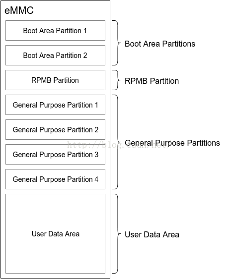
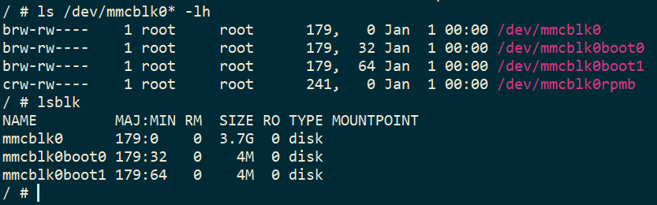

--

# eMMC 里 DDR52 HS200 HS400 等的含义

DDR52就是最高 52M clock，数据速率就是 52 x 2 = 104
HS200 就是最高 200M clock，单[通道](https://so.csdn.net/so/search?q=通道&spm=1001.2101.3001.7020)，数据速率也是 200
HS400 也是最高 200M clock，但是是双通道，所以数据速率是 200 x 2 = 400

HS200和HS400 是 5.0 协议才有的。

# emmc和nand flash的关系

emmc是在nand的基础上增加了控制器，自动管理坏块。

写emmc的驱动比写nand的驱动要简单。

# emmc分区

eMMC 标准中，将内部的 Flash Memory 划分为 4 类区域，

最多可以支持 8 个硬件分区，

如下图所示：

一般情况下，Boot Area Partitions 和 RPMB Partition 的容量大小通常都为 4MB，

部分芯片厂家也会提供配置的机会。

General Purpose Partitions (GPP) 则在出厂时默认不被支持，

即不存在这些分区，

需要用户主动使能，

并配置其所要使用的 GPP 的容量大小，

GPP 的数量可以为 1 - 4 个，

各个 GPP 的容量大小可以不一样。

User Data Area (UDA) 的容量大小则为总容量大小减去其他分区所占用的容量。

更多各个分区的细节将在后续章节中描述。

eMMC 的**每一个硬件分区的存储空间都是独立编址的**，

即访问地址为 0 - partition size。

具体的数据读写操作实际访问哪一个硬件分区，

是由 eMMC 的 Extended CSD register 的 PARTITION_CONFIG Field 中 的 Bit[2:0]: PARTITION_ACCESS 决定的，

用户可以通过配置 PARTITION_ACCESS 来切换硬件分区的访问。

也就是说，用户在访问特定的分区前，需要先发送命令，配置 PARTITION_ACCESS，

然后再发送相关的数据访问请求。

更多数据读写相关的细节，请参考 eMMC 总线协议 章节。

**Boot Area 包含两个 Boot Area Partitions，**

**主要用于存储 Bootloader，**

**支持 SOC 从 eMMC 启动系统。**

RPMB（Replay Protected Memory Block）Partition 是 eMMC 中的一个具有安全特性的分区。

eMMC 在写入数据到 RPMB 时，会校验数据的合法性，

只有指定的 Host 才能够写入，

同时在读数据时，也提供了签名机制，

保证 Host 读取到的数据是 RPMB 内部数据，

而不是攻击者伪造的数据。

RPMB 在实际应用中，通常用于存储一些有防止非法篡改需求的数据，

例如手机上指纹支付相关的公钥、序列号等。

RPMB 可以对写入操作进行鉴权，但是读取并不需要鉴权，

任何人都可以进行读取的操作，因此存储到 RPMB 的数据通常会进行加密后再存储。

eMMC Device 在 Power On、HW Reset 或者 SW Reset 时，

Host 可以触发 eMMC Boot，

让 eMMC 进入Boot Mode。

在此模式下，eMMC Device 会将 Boot Data 发送给 Host，

这部分内容通常为系统的启动代码，如 BootLoader。

# eMMC 里 DDR52 HS200 HS400 等的含义

eMMC 里 DDR52 HS200 HS400 这些名词指的是不同的速度

DDR52就是最高 52M clock，数据速率就是 52 x 2 = 104
HS200 就是最高 200M clock，单通道，数据速率也是 200
HS400 也是最高 200M clock，但是是双通道，所以数据速率是 200 x 2 = 400

HS200和HS400 是 5.0 协议才有的。

更详细信息可以从 spec 上找到。

# emmc为什么还没有淘汰掉nand

Flash 存储问题总是在我们技术支持渠道位列榜首。

Toradex 投入了大量资源保证存储尽可能的稳定。

然而，了解一些关于存储的基本知识还是十分重要的。

首先你需要知道存储是否磨损，当往内置的存储设备上写入大量数据后，你就很容易损坏它。

通过这篇博文，我们想要告诉你 Flash 存储可能会遇到的一些问题。

我们先简单介绍技术内容。

Flash 类型：

Raw Flash vs Managed Flash

目前，Toradex 计算机模块采用 NOR、NAND 和 eMMC Flash。

NOR 和 NAND 是 raw 存储设备。

NAND 和 NOR 之间的主要差别是 NOR 允许随机寻址，不需要纠错以及较高的每比特成本。

NAND 则只能页读取，每页中的一些位可能出错，因此需要纠错机制。

eMMC Flash 则结合使用 NAND 和一个内置控制器，后者处理大部分使用 NAND flash 时候，本来需要你自己完成的一些列任务。

**eMMC 也称为 managed NAND。**

在另一方面，NAND 和 NOR 需要有 OS 和驱动来完成对应的处理。

我们稍后会在本博文中讨论这两种不同的挑战。

参考资料

1、

https://www.toradex.com/zh-cn/blog/what-you-should-know-about-flash-storage

# emmc为什么可以不关注坏块问题

为什么写驱动的时候，nand flash的坏块是可见的，需要特别处理，而emmc驱动则不用关注坏块

EMMC（嵌入式多媒体卡）和 NAND Flash 是两种不同类型的存储设备，它们在物理结构和工作原理上有很大的差异。这些差异导致了在处理坏块问题上的不同行为。

**NAND Flash：**

NAND Flash 存储设备通常存在坏块问题，这是因为在 NAND Flash 中，数据是以块（block）为单位进行擦除的，而不是以字节或页为单位。当块中的某个页出现故障时，整个块被标记为坏块。在编写驱动程序时，开发者需要考虑坏块的处理，通常的做法是在文件系统或驱动程序层面进行坏块管理。

**EMMC：**

相比之下，EMMC 设备通常由于其内部处理逻辑的不同而不太容易出现坏块。EMMC 的控制器在底层已经对坏块进行了处理，因此在驱动层面通常不需要太多关注坏块的处理。EMMC 通常提供了更高层次的抽象，将坏块管理的细节隐藏在底层。

总体而言，对于 Nand Flash 驱动程序，坏块管理通常是由驱动或文件系统来处理的，而对于 EMMC 驱动程序，底层控制器通常已经处理了这个问题，因此开发者在编写 EMMC 驱动时通常不需要过多关注坏块的处理。

# emmc长时间使用，会因为坏块太多而导致系统工作异常吗

EMMC 设备的寿命通常由于坏块的增加而受到影响，但对于正常的使用情况，EMMC 设备通常具有相对较长的寿命，能够满足大多数嵌入式系统的需求。然而，在某些极端情况下，坏块的增加可能会导致一些问题。

以下是可能的影响和注意事项：

1. **坏块增加：** 长时间的读写操作可能导致坏块的增加。EMMC 设备通常使用坏块管理机制来尽量减小坏块的影响，但坏块的存在仍可能对寿命产生影响。

2. **性能下降：** 坏块的存在可能导致对坏块管理算法的额外开销，从而导致设备性能的轻微下降。

3. **数据完整性：** 当坏块增加到一定程度时，可能会影响数据的完整性。因此，在设计系统时，需要考虑使用适当的纠错码（ECC）和坏块管理策略，以确保数据的可靠性。

4. **寿命平均性：** 不同的存储块可能具有不同的寿命，坏块的增加可能导致寿命的不均匀分布。

为了最大限度地延长 EMMC 设备的寿命，开发者可以考虑以下几点：

- **使用 Wear Leveling：** Wear leveling 技术有助于平均分配写入操作，减少特定块的磨损。
  
- **合理的坏块管理：** 采用有效的坏块管理策略，确保及时检测和处理坏块。

- **数据备份：** 对于关键数据，进行适当的备份以防止数据丢失。

- **监控寿命：** 在系统中实施监控机制，定期检查设备寿命和坏块的情况。

总体而言，EMMC 设备在正常使用和适当维护的情况下，寿命应该足够长，不太容易因为坏块而导致系统异常。

# 参考资料

1、

https://blog.csdn.net/boyemachao/article/details/109227536

2、

https://linux-sunxi.org/Replace_NAND_with_eMMC_howto

3、emmc 分区管理

https://blog.csdn.net/u014645605/article/details/52212622

4、EMMC与NAND的区别？

https://www.zhihu.com/question/22688853

4、eMMC 里 DDR52 HS200 HS400 等的含义

https://blog.csdn.net/boyemachao/article/details/109227536