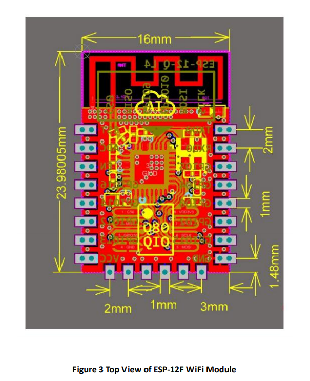
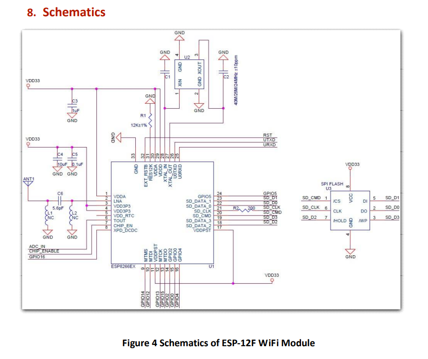

1

esp8266还是值得研究一下的。打算写一个系统，把这个模块的各个方面都了解清楚。

esp8266的最大一样，就是把wifi模组的价格降到了10元RMB这种价位。在物联网时代，很有价格优势。


esp8266芯片架构

不是基于arm架构，而是基于一个叫tensillica的架构的。

tensillica是一家成立于1997年的公司。主要是设计专业微处理器的。为高容量嵌入式系统提供最优良的解决方案。这家公司现在已经被cadence公司（就是那家做EDA画板工具的公司）收购了。

研究架构本身没有什么太大的意义。

是32位的。

cpu时钟最高是160M。

支持rtos和wifi协议栈。


官网的资源比较丰富。例如相关的课程、图书，都有给出链接。虽然都是商品，但是可以了解一下。

官方提供pcb审阅、RF调试、认证支持服务。

官网做得不错。

官方提供了3个文档：

```
0a-esp8266ex_datasheet_cn.pdf  
	《ESP8266技术规格》，30页。
	就是datasheet，描述了模组的参数。
2a-esp8266-sdk_getting_started_guide_cn.pdf  
	《ESP8266 sdk入门指南》
	36页。
	
esp8266-technical_reference_cn.pdf
	《ESP8266技术参考》
	这个是具体的使用细节。有120页。
```


# 《ESP8266技术规格》

```
6个章节。
1、概述
2、管脚定义
3、功能描述
4、外设接口
5、电气参数
6、封装信息
```

## 1 概述

ESP8266是一套高度集成的wifi soc解决方案。

有完整且自成体系的wifi网络功能，既能够独立应用，也可以作为从机跟其他的MCU配合工作。

ESP8266单独工作的时候，可以直接从外界的flash启动，内置的高速缓冲存储器有利于提高系统性能。

当作为一个wifi模块被其他MCU使用的时候，通过SPI/sdio接口或者串口，都可以的。

wifi的主要特性

```
1、支持802.11 b/g/n
2、速度可以达到72Mbps
3、支持2个虚拟的wifi接口。
4、支持sta、ap、混杂模式。
```

## 2 管脚定义

一共33个引脚。

7号管脚是芯片使能脚，高电平有效。

## 3 功能描述

内置了ram和rom。

目前在ap连上网络后，留给用户使用的内存还有50KB。

没有带flash。

需要自己外界，理论上最大支持16M。flash接口是spi flash。

如果不支持ota功能，那么最小需要512K。

如果支持ota功能，最小需要1M。

## 4 外设接口

一共17个gpio管脚。

只有一个脚是内部下拉的，其余的都是内部上拉。这个上拉下拉功能可能禁用。

sdio：有一个从机接口。

spi；有一个主机接口和一个从机接口。

i2c：有一个接口。频率最高100K。

i2s：有一个输出接口和一个输出接口。主要用于音频采集和传输。但是也可以用来做串行数据的输入输出。

uart：有2个，uart0和uart1 。

pwm：有4个。

ir接口：1个红外接口。

adc：1个10bit的SAC adc。


# 编译sdk


sdk分为2套：

1、nonos版本。不带os的。https://github.com/espressif/ESP8266_NONOS_SDK 。代码压缩包大概5M。

2、rtos版本。https://github.com/espressif/ESP8266_RTOS_SDK

另外有第三方的开源：https://github.com/pfalcon/esp-open-sdk

编译sdk需要基于Linux环境。

我在我的Ubuntu笔记本上搭建编译。

先编译nonos版本的。从github里的readme看出，nonos版本，已经不再继续维护了。

当前我手里的板子是这样的：

主wifi芯片ESP8266,FLASH闪存芯片25Q32 4M（32mbit）串口芯片CH340！

下载nonos版本的sdk。

看看怎样进行编译。

看顶层的Makefile。

```
ifeq ($(COMPILE), gcc)
	AR = xtensa-lx106-elf-ar
	CC = xtensa-lx106-elf-gcc
else
	AR = xt-ar
	CC = xt-xcc
endif
```

xtensa-lx106-elf-gcc 和xt-xcc，这2套编译器，我的Ubuntu里目前都没有安装。

那么从哪里可以获取到xtensa-lx106-elf-gcc这一套工具链呢？

这里可以：https://github.com/esp8266/esp8266-wiki/wiki/Toolchain

是需要自己编译工具链。

先安装依赖。

```
sudo apt-get install make unrar-free autoconf automake libtool gcc g++ gperf \
    flex bison texinfo gawk ncurses-dev libexpat-dev python-dev python python-serial \
    sed git unzip bash help2man wget bzip2 libtool-bin
```

需要clone所有的模块下来。

```
git clone --recursive https://github.com/pfalcon/esp-open-sdk.git
```

编译过程花了一个多小时。最后打印的这个。

```
Xtensa toolchain is built, to use it:

export PATH=/home/teddy/work/esp8266/toolchain-compile/esp-open-sdk/xtensa-lx106-elf/bin:$PATH

Espressif ESP8266 SDK is installed, its libraries and headers are merged with the toolchain
```

整个目录有3.7G。


现在工具链有了，这里虽然也给我们编译了sdk。但是我们还是先用之前下载的sdk。

编译方法：

1、进入sdk目录，从examples拷贝一个目录，例如esp_mqtt_proj，到sdk顶层目录。

2、cd sdk/esp_mqtt_proj，执行gen_misc.sh脚本，会提示你进行很多的选择。根据你的情况进行选择，如果一路回车，是编译不过的。

其实主要还是flash布局那里。

```
!!!
No boot needed.
Generate eagle.flash.bin and eagle.irom0text.bin successully in folder bin.
eagle.flash.bin-------->0x00000
eagle.irom0text.bin---->0x10000
!!!
```


esp8266需要3.3V的电压，电流需要500mA。


内存布局：

iram是64K，dram是96K。


eagle.app.v6.ld

```
MEMORY
{
  dport0_0_seg :                        org = 0x3FF00000, len = 0x10
  dram0_0_seg :                         org = 0x3FFE8000, len = 0x14000
  iram1_0_seg :                         org = 0x40100000, len = 0x8000
  irom0_0_seg :                         org = 0x40210000, len = 0x5C000
}
```


这个是python写的烧录脚本。

```
 sudo pip install esptool
```

Linux上，插入板子，串口设备是：/dev/ttyUSB0

除了官方提供的基于C语言的SDK外，NodeMCU项目提供了基于Lua语言的脚本式开发环境。此外，这块芯片也可以烧录AT协议的固件，在系统中充当一块无线网卡。


# ESP12

ESP12是一个模组，封装了ESP8266。

wemos d1就是用了这个模组，再加上usb转串口芯片，电源芯片、按键等外围电路做的一块板子。

那么ESP12有哪些特点呢？

说明文档：https://www.elecrow.com/download/ESP-12F.pdf

采用的是邮票封装样式。

左边、下边、右边，是引脚，左右都是8个，下边是6个。上边是天线。



模组内部封装了哪些东西呢？封装了晶振和一个4MB的spi flash。




参考资料

1、官网介绍

https://www.espressif.com/zh-hans/products/hardware/esp8266ex/overview

2、ESP8266 architecture and Arduino GUI

https://annefou.github.io/IoT_introduction/02-ESP8266/index.html

3、ESP8266 基础篇：内存分布

官方的csdn博客。

https://blog.csdn.net/espressif/article/details/78563753

4、ESP8266的一些小知识

https://blog.csdn.net/ReCclay/article/details/77865568?depth_1-utm_source=distribute.pc_relevant.none-task&utm_source=distribute.pc_relevant.none-task

5、MicroPython Basics: Load Files & Run Code

https://www.digikey.com/en/maker/projects/micropython-basics-load-files-run-code/fb1fcedaf11e4547943abfdd8ad825ce

6、如何在20元小板子上跑Python

https://zhuanlan.zhihu.com/p/24644526

7、BUILDING EXAMPLES IN ESP8266 NON-OS SDK V.2.0.0

http://iot-bits.com/articles/building-examples-in-esp8266-non-os-sdk-v-2-0-0/

8、

https://www.instructables.com/id/Getting-Started-with-the-ESP8266-ESP-12/