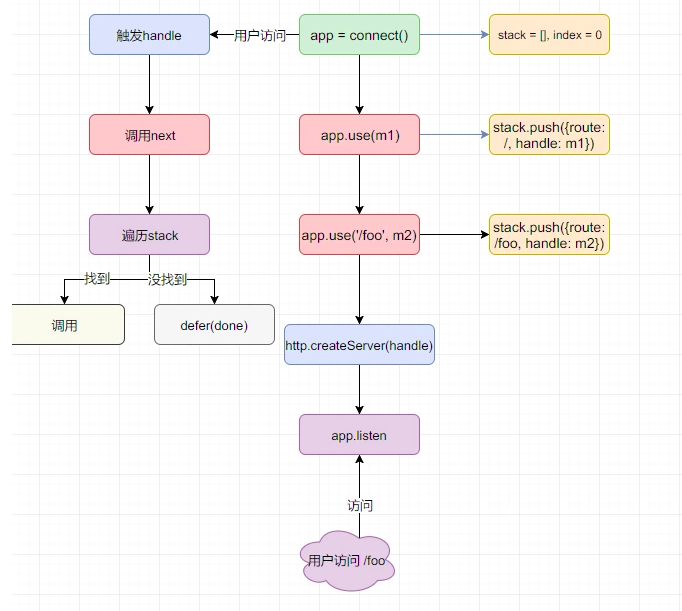
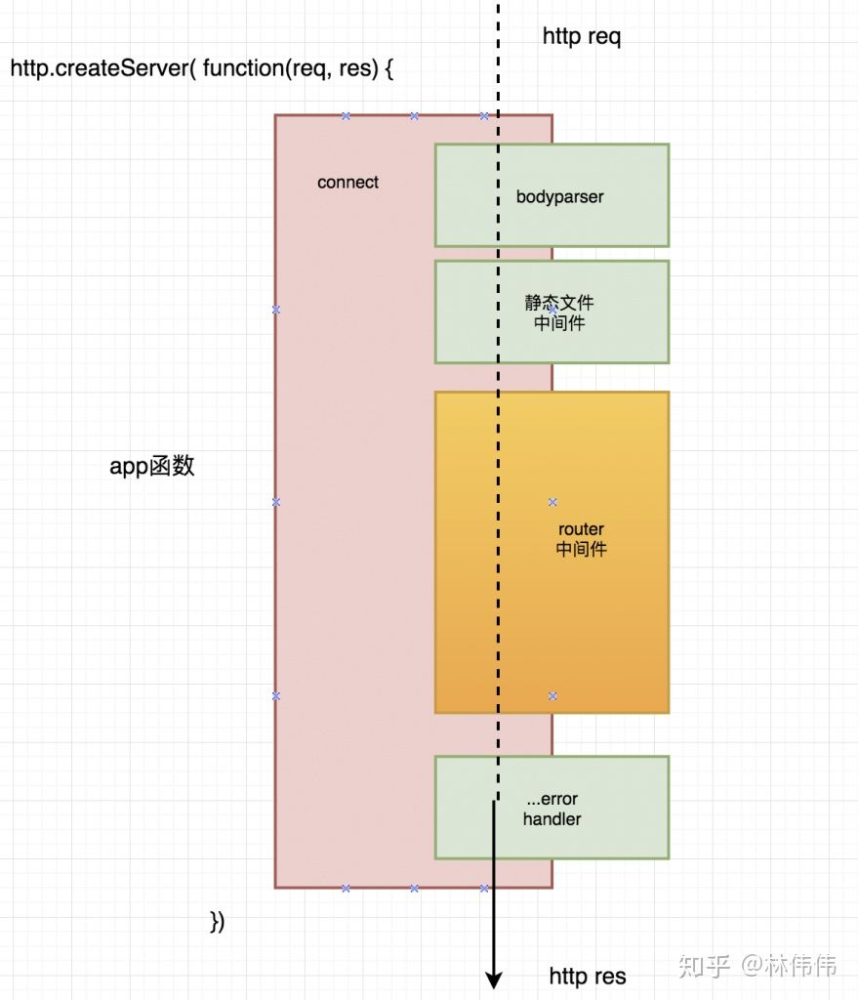

代码在这里：https://github.com/expressjs/express

```
hlxiong@hlxiong-VirtualBox:~/work/test/express/express/lib$ tree
.
├── application.js
├── express.js
├── middleware
│   ├── init.js
│   └── query.js
├── request.js
├── response.js
├── router
│   ├── index.js
│   ├── layer.js
│   └── route.js
├── utils.js
└── view.js
```

主要代码就这些。

express.js是入口文件。

主要的组成部分有：

```
application
router
route
request 
response
```

express.js的输出就是一个函数。

```
exports = module.exports = createApplication;
```

然后给这个函数增加了一些属性。

```

```


我看到array-flatten，这个模块只有一个功能。

我看lodash里，有函数可以实现这个功能。

为什么不用lodash？

我测试了一些，作用还是不一样。

```
var flatten = require("array-flatten")
var arr = [1,[2,[3,[4]]]]

var ret = flatten(arr)
console.log(ret)

var _ = require("lodash")
ret = _.flatten(arr)
console.log(ret)
```

```
[ 1, 2, 3, 4 ]
[ 1, 2, [ 3, [ 4 ] ] ]
```


req的内容有哪些？

对象内容挺多的。

重要的有

```
url: '/',
method: 'GET',
headers:
baseUrl: '',
originalUrl: '/',
_parsedUrl:
Url {
    protocol: null,
    slashes: null,
    auth: null,
    host: null,
    port: null,
    hostname: null,
    hash: null,
    search: null,
    query: null,
    pathname: '/',
    path: '/',
    href: '/',
    _raw: '/' },
params: {},
query: {},
```

res跟req的差不多。

而且他们互相持有对方的引用。

res

```
locals

```


examples目录值得看看。


默认的app.locals的内容

```
{ settings:
   { 'x-powered-by': true,
     etag: 'weak',
     'etag fn': [Function: generateETag],
     env: 'development',
     'query parser': 'extended',
     'query parser fn': [Function: parseExtendedQueryString],
     'subdomain offset': 2,
     'trust proxy': false,
     'trust proxy fn': [Function: trustNone],
     view: [Function: View],
     views: '/home/hlxiong/work/test/express/test/views',
     'jsonp callback name': 'callback' } }
```


# express和connect关系

connect的代码：https://github.com/senchalabs/connect/

实际上只有一个文件。index.js。

里面只有几个函数。



```
var proto = {}

var createServer = function () {}

proto.use = function () {}

proto.handle = function () {}

proto.listen = function () {}
```


讨论express，还是先从nodejs最基础的http模块开始。

最简单的http服务器，就2行。

```
var http = require('http')
http.createServer(function(req, res) {
  res.end('hello http')
}).listen(8080)
```

实际上，express是一个函数，运行后，可以构造出上面http.createServer所需要的回调函数。

express所做的一切文章都是在这个回调函数上。

在这个函数上，mixin了其他的能力，

例如：req、res处理，模板引擎，静态文件服务，router能力。




app.use是往一个数组里push。

所以顺序是有关系的。

处理的时候，就遍历数组。

通过next来执行下一个，如果没有next，流程就结束。


# 实现自己的express

写一个MyExpress.js文件

```
var http = require('http')

function createApplication() {
    //定义入口函数，初始化
    var app = function(req, res) {

    }
    //定义监听方法
    app.listen = function() {
        var server = http.createServer(app)
        server.listen(...arguments)
    }
    //返回该函数
    return app
}
module.exports = createApplication
```

routes相当于一个堆栈。

```
---------------
layer，一个route包括：method、path、handler这3个元素
---------------
layer
---------------
```

我们在上面MyExpress.js的基础上，增加routes。

```
var http = require('http')

function createApplication() {
    //定义入口函数，初始化
    var app = function(req, res) {

    }
    app.routes = []//定义路由数组
    var methods = http.METHODS
    methods.forEach(method=> {
        method = method.toLowerCase()
        app[method]= function(path, handler) {
            let layer = {
                method,
                path,
                handler
            }
            app.routes.push(layer)
        }
    })
    //定义监听方法
    app.listen = function() {
        var server = http.createServer(app)
        server.listen(...arguments)
    }
    //返回该函数
    return app
}
module.exports = createApplication
```

现在我们把layer存入到routes里。

接下来，我们需要根据path来查找handler进行处理。

需要在`var app = function(req, res) {`这个大括号里加代码。

```
    var app = function(req, res) {
        let reqMethod = req.method.toLocaleLowerCase()
        let pathName = url.parse(req.url, true).pathname
        console.log(app.routes)
        app.routes.forEach(layer=> {
            let {method, path, handler} = layer
            if(method === reqMethod && path === pathName) {
                handler(req, res)
            }
        })
    }
```

然后，就是中间件。这个是重点。

中间件的定义其实跟路由的差不多。也是存放在routes数组里。

但是，必须放在所有路由layer的前面。（除了错误处理，这个放在路由的后面）

中间件都有一个next方法。这个是中间件的核心。


最后的代码是这样：

```
const e = require('express')
var http = require('http')
var url = require('url')

function createApplication() {
    //定义入口函数，初始化
    var app = function(req, res) {
        let reqMethod = req.method.toLocaleLowerCase()
        let pathName = url.parse(req.url, true).pathname
        let index = 0
        function next(err) {
            if(app.routes.length == index) {
                return res.end(`can not ${reqMethod} ${pathName}`)
            }
            let {method, path, handler} = app.routes[index++]
            if(err) {
                console.log(handler.length)
                if(handler.length === 4) {
                    console.log(1)
                    handler(err, req, res, next)
                } else {
                    next(err)
                }
            } else {
                if(method === 'middle') {
                    if(path === '/' || pathName===path ||
                        pathName.startsWith('/')) {
                        handler(req, res, next)
                    } else {
                        next()
                    }
                } else {
                    if(method === reqMethod && path === pathName) {
                        handler(req, res)
                    } else {
                        next()
                    }
                }
            }
        }
        console.log(app.routes)
        app.routes.forEach(layer=> {
            let {method, path, handler} = layer
            if(method === reqMethod && path === pathName) {
                handler(req, res)
            }
        })
        next() //需要调用一次，相当于触发执行。
    }

    app.routes = []//定义路由数组
    var methods = http.METHODS
    methods.forEach(method=> {
        method = method.toLowerCase()
        app[method]= function(path, handler) {
            let layer = {
                method,
                path,
                handler
            }
            app.routes.push(layer)
        }
    })
    app.use = function(path, handler) {
        if(typeof path === 'function') {
            handler = path
            path = '/'
        }
        let layer = {
            method: 'middle',
            handler,
            path
        }
        app.routes.push(layer)
    }
    //定义监听方法
    app.listen = function() {
        var server = http.createServer(app)
        server.listen(...arguments)
    }
    //返回该函数
    return app
}
module.exports = createApplication
```

80行左右。

测试代码：

```
var express = require('./MyExpress')
var log = console.log
var app = express()
app.use(function(req, res, next) {
  log("mid 1")
  next()
})
app.use(function(req, res, next) {
  log("mid 2")
  next()
})
app.get('/', function(req, res) {
  res.end('hello myexpress get /')
})
app.use(function(err, req, res, next) {
  log('mid 3')
  log("err:"+err)
})
app.listen(8080)

```

访问的打印：

```
[ { method: 'middle', handler: [Function], path: '/' },
  { method: 'middle', handler: [Function], path: '/' },
  { method: 'get', path: '/', handler: [Function] },
  { method: 'middle', handler: [Function], path: '/' } ]
mid 1
mid 2
[ { method: 'middle', handler: [Function], path: '/' },
  { method: 'middle', handler: [Function], path: '/' },
  { method: 'get', path: '/', handler: [Function] },
  { method: 'middle', handler: [Function], path: '/' } ]
mid 1
mid 2
mid 3
err:[object Object]
```

之所以有2次的，是因为用浏览器访问，

第一个访问网页，第二次访问icon。icon是访问不到的。所以有错误。


# req对象分析

req的层级关系

```
req
	http.IncomingMessage.prototype
		stream.Readable 
			extends Stream implements NodeJS.ReadableStream
				ReadableStream extends EventEmitter
```

EventEmitter

```
跟eventproxy很像。
就addListener、on、off、emit这些方法。
```

ReadableStream

```
属性：
	readable
	
方法：
	read
	setEncoding
	pause
	resume
	isPaused
	pipe
	unpipe
	unshift
	wrap
```

Stream

```
这个没有什么可说的，代码就这些。
 class Stream extends internal {
            constructor(opts?: ReadableOptions);
        }
```

Readable

```
方式就是override了ReadableStream的内容。
```

IncomingMessage

```
属性
	aborted
	httpVersion
	complete
	
	connection
	socket
	headers
	tailers
	method
	url
	statusCode
	
方法：
	destroy
```

req本身的属性和方法

```
req.get = 
req.header = function header(name) {
	//这个是取得headers里的某个key对应的value。
}

req.range(size, options)

req.param = function param(name, defaultValue) {

}

req.is('html')
req.is('json')

req.protocol == https/http
req.secure 
req.ip
req.ips
req.path
req.hostname
req.host

req.xhr 是否是一个ajax请求。

```


# res对象分析

层级关系

```
res
	http.ServerResponse
		OutgoingMessage
			stream.Writable 
				NodeJS.WritableStream
					EventEmitter
```

WritableStream

```
writable
write
end
```

Writable

```
writable
writableEnded
writableFinished
writableHighWaterMark
writableLength
writableObjectMode
writableCorked

destroyed
write
end
cork
uncork
destroy
```

OutgoingMessage

```
upgrading
chunkedEncoding
shouldKeepAlive
sendDate

finished
headersSent

setTimeout
setHeader
getHeader


```

ServerResponse

```
statusCode
statusMessage

assignSocket
detachSocket

writeContinue
writeHead
writeProcessing
```


res

```
res.status = function status(code) {
	this.statusCode = code
	return this
}

res.send
	这个函数内容较多。
	最后调用的end函数。
	  if (req.method === 'HEAD') {
        // skip body for HEAD
        this.end();
      } else {
        // respond
        this.end(chunk, encoding);
      }
res.json
	最后调用的send函数。
	就是先设置了一下header为json。
	this.set('Content-Type', 'application/json');
	
res.sendStatus
	res.sendStatus(200); 这样用的。
	
res.sendFile 
	直接发送静态文件，里面的内容不需要渲染的。
	
res.download
	这个是让浏览器这边弹窗下载窗口。
	
res.type
res.format
res.attachment
res.appendres.header
res.clearCookie
res.cookie
res.location
res.redirect
res.render

```


# 参考资料

1、深入理解connect/express

https://segmentfault.com/a/1190000012714389

2、NodeJS express框架核心原理全揭秘

https://zhuanlan.zhihu.com/p/56947560

3、

https://segmentfault.com/a/1190000019607502