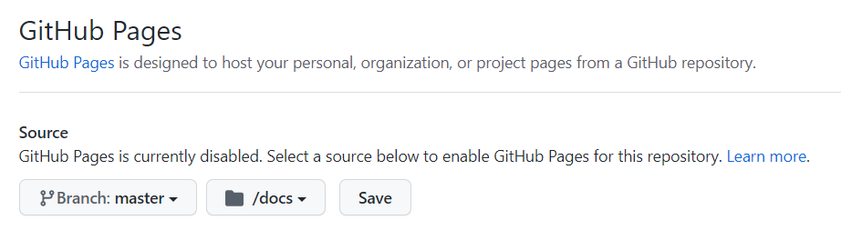
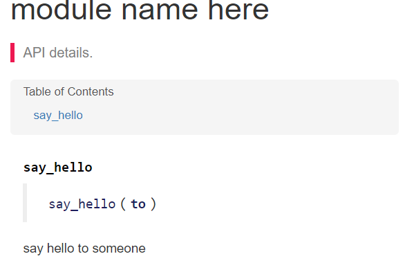
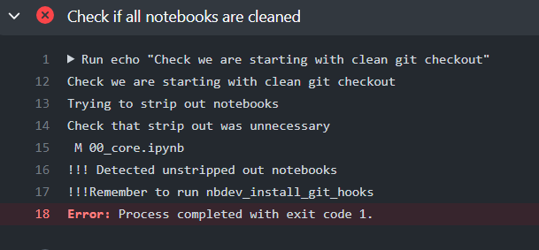

--

现在决定彻底学习掌握fastai相关的知识。

先从nbdev入手。

在我的虚拟机上进行实验。

```
pip install nbdev
```

点击下面的连接，表示基于nbdev_template在github上创建一个repo。

https://github.com/fastai/nbdev_template/generate

我取名为test_nbdev。

https://github.com/teddyxiong53/test_nbdev

repo的名字会成为package的名字。

所以需要符合Python的package的命名规则。

所以，横杠不允许，但是下划线是允许的。我当前的名字符合规则。

这里还提供了一个gitlab上的模板。了解一下即可。

https://gitlab.com/thomas.capelle/nbdev_template/

nbdev使用jekyll作为文档。

因为github pages支持jekyll，所以你可以在github上托管你的网站。

而不需要额外的操作。

打开你的repo的github pages的方法是：

点击github的settings，找到pages选项。选择分支和目录如下。点击save



然后访问这个链接就可以看到你的repo的文档了， https://teddyxiong53.github.io/test_nbdev/

点击访问，现在是404错误。


然后收到了邮件，是github actions出错了。


改一下repo里的settings.ini文件。直接在网页上修改提交。

然后我们对notebook文件进行修改。

这个就需要把repo clone到本地来修改。

本地安装jupyter。

```
sudo apt-get install jupyter
```

现在不知道为什么nbdev的命令又找不到了。

可能我还是得安装nbdev的docker镜像来做。

这些环境问题挺烦人的 。

发现是path里没有加进去。我在bashrc里手动加进去。可以找到命令了。

现在在本地修改00_core.ipynb

加入一个cell。内容如下：

```
#export
def say_hello(to):
    "say hello to someone"
    return f'Hello {to}'
```

然后执行：

```
nbdev_build_lib
nbdev_build_docs
```

然后把代码提交到github上。

然后刷新页面。就可以看到文档已经生成了。



但是现在github actions还是失败。



这个难道是因为我没有加nbdev_install_git_hooks导致？

我加一下。

就是在本地执行一下这个命令：

```
nbdev_install_git_hooks
```

生成了一下内容到.gitconfig里，但是这个文件被.gitigore了。

先不管吧。


参考资料

1、

https://nbdev.fast.ai/tutorial.html