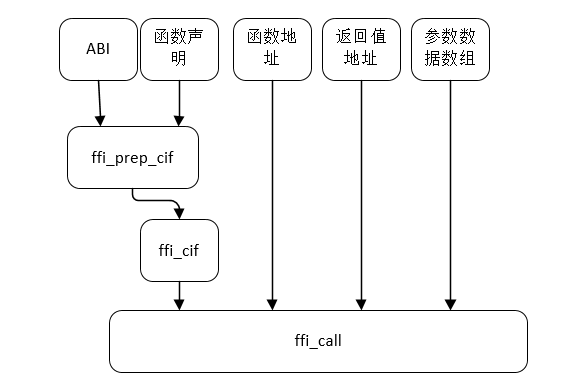

在elk这个迷你js引擎的时候，看到有这样的代码：

```
static jsval_t fficb1(jw_t w1, jw_t w2, jw_t w3, jw_t w4, jw_t w5, jw_t w6) 
```

ffi，这就是涉及到不同语言之间进行相互调用的场景了。

这块需要学习了解一下。


在虚拟机中经常遇到这么一个问题，

我在一个二进制库，里面有一组函数，

但是我 **不能通过C语言来调用** 它们，

或者是，我能使用C语言来调用，却 **不能在调用的时候知道它们的函数声明**。

怎么办？


FFI 全名 Foreign Function Interface ，中文名 外部函数接口。

其实 FFI 很简单，就是一个接口。

这个接口可以让你在不清楚参数的个数和类型的情况下调用一个函数。


常被用于问题二的场景，成为 **高级语言的虚拟机与底层二进制代码之间的交互** 的桥梁。

FFI 的主流实现，libffi 在它的 [官网](https://link.zhihu.com/?target=https%3A//sourceware.org/libffi/) 上列出了它被哪些项目所使用：

- CPython
- OpenJDK
- js-ctypes
- Dalvik
- Java Native Access (JNA)
- Ruby-FFI
- fsbv
- JSCocoa
- PyObjC
- RubyCocoa
- PLT Scheme
- gcj

你一定用过其中某一款虚拟机/解释器，但是你未必知道 FFI。

没错，FFI 就是这么默默无闻，但它的贡献巨大。因为它实现了一种不通过 C语言 进行底层交互的功能，因为它，虚拟机解决问题的范围大大地扩展了。两个世界联系在了一起，世界变得更加宽广。


# 对两个问题的分析


***第一个问题：如何实现apply？\***

这个问题示例的写法非常方便，而且支持这种写法有着重要的意义。


好了，我们来问一下， C 中的 apply ，到底能不能实现呢？


```text
apply(add_int, data);
```

问： 这一句中，有哪些是已知的，哪些是未知的？

答：函数的地址 已知，数据 已知，参数的个数未知，类型未知（如果想要那种单类型的apply，可以算作已知）。

因为至少有一点是未知的，那么就不能通过这种方式调用。

因此，在目前的C标准下， 仅仅使用标准C语言，apply 的实现是**不可能**的。

那么真的是没有办法吗？

[gkmail：C 语言有没有办法实现类似 Scheme 里的 apply 函数？](https://www.zhihu.com/question/54627596/answer/142304962)

这个回答提到了 libffi 。没错， libffi = lib + ffi，**libffi** 就是我们这篇文章的主角 FFI 的主流实现。


***第二个问题：如何不通过C来调用C函数？\***

要解决这个问题，首先我们要知道如何调用一个函数。

大体上来说，从汇编层面来讲，调用一个函数，

就是先将参数放置在函数所要求的寄存器、栈等位置，

然后从该函数的最初的指令开始执行，

执行后从特定的位置取出调用的结果来使用。

（在后面的小节我会结合具体的平台详细地说明这一点。）

总的来说，调用函数经历了这样一个过程：**参数传递 -> 函数调用 -> 返回值传递**。

C语言所编译的调用函数，硬编码了 参数传递 和 返回值传递。

传递方式 是代码指定，而不是数据指定。

也就是说，如果想要能够自由地调用函数，必须拥有 **指定传递方式** 的能力。

将数据放置在什么位置，将结果从哪里取出，

只要解决了这个问题，就解决了动态调用函数的问题。

而传递方式，是由 ABI 来规定的。

函数的传递方式，就是通过ABI根据该函数的 函数声明来指定的。

所以，理论上，只要知道了 **函数声明 和 ABI**，就能过获取函数的 参数和返回值的传递方式，再加上 函数的地址以及数据，就可以**不通过 C语言 的编译，来调用这个函数**。


```text
函数声明 + ABI --- 某种工具 --> 传递方式
传递方式 + 函数地址 + 数据 ---调用--> 结果
```

这个过程，就是 主流的 FFI 库，libffi 的调用原理。


# FFI 的基本原理

FFI 的本质其实是 **参数传递 + 函数调用 + 返回值传递**，

而参数传递和返回值传递的方式，都是由 **具体的 ABI 所规定** 的。


基于这种情况，我们可以把 参数传递、函数调用、返回值传递 这三个过程分开。

函数调用就是调用 call 指令，它上面就是 参数传递，下面就是返回值传递。

**参数传递 + 函数调用 + 返回值传递，这三者组合就能构成一个调用函数。**

**FFI 的本质就是这些的组合，上面给出的 caller 函数其实就是 FFI 函数的雏形。**


那么参数放置位置以及返回值的位置如何确定？这个是 ABI 所规定的。

在 SysV64 ABI 下， (int64_t, int64_t) -> int64_t 这种声明，一定是按照 (rdi, rsi) -> rax 这种方式来传递的。

所以，只需要确定 函数声明 和 ABI ，就能够确定 参数和返回值的传递方式。


**传递方式** 是 基于 函数声明 和 ABI 的固定不变的东西，再加上能够变化的 **函数地址**、**数据**，就可以调用这个函数。

libffi 的调用过程如下：



libffi 将 调用方式->汇编调用过程 都写在了 ffi_call 中，ffi_call 的核心是使用汇编书写的。其本质就是如上的过程。


# 参考资料

1、

https://zhuanlan.zhihu.com/p/32134367


