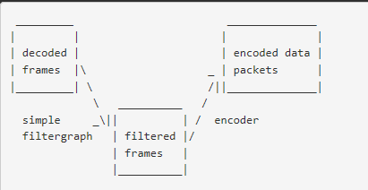
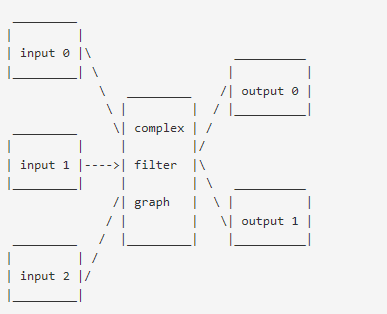

下载windows版本的ffmpeg，在git bash行下执行，比较习惯bash的命令行风格。

# 基本命令
1、`./ffmpeg`。
可以看到版权信息和编译时打开的功能。
可以看到命令的基本格式是：`./ffmpeg [opt] [in opt] -i infile [out opt] outfile`。
用`./ffmpeg -h`。可以看到更多的帮助信息。

`./ffmpeg -h long`看到的帮助信息更加详细。

分析一下帮助信息，分为以下5种：
1）通用选项。
2）per file选项。
3）video选项。
4）audio选项。
5）subtitle选项。

2、查询性质的命令。
格式都是`./ffmpeg -xxx`。
xxx可能的取值是：
formats：查询支持的文件格式。
protocols：查询支持的协议。
colors：颜色。

`./ffmpeg -i test.mp4`。查询文件的信息。

# 视频处理

## 从mp4文件中提取h264码流。

```
ffmpeg -i test.mp4 -codec copy -bsf: h264_mp4toannexb -f h264 test.264
```

h264有两种封装，一种是annexb模式，传统模式，有startcode，SPS和PPS是在ES中。一种是mp4模式，一般mp4 mkv会有，没有startcode，SPS和PPS以及其它信息被封装在Container中，每一个frame前面是这个frame的长度。
很多解码器只支持annexb这种模式，因此需要将mp4做转换，在ffmpeg中用`h264_mp4toannexb_filter`可以做转换。
3.5M的mp4文件得到的h264码流文件是2.8M。
得到的h264文件，可以用vlc播放器来播放。默认vlc不能播放。打开`工具--首选项--左下角选择全部显示设置--找到输入/编解码器--去复用器--去复用模块--选择H264视频去复用器`。再进行h264文件播放就可以了。
看媒体信息，可以看到只有视频流。
播放完之后，要把刚刚改的设置改回去，不然vlc就没法播放mp4文件了。

## 从mp4文件提取音频。

```
ffmpeg.exe -i test.mp4 -vn test.aac
```

vn表示no video的意思。

可以指定格式：

```
ffmpeg -i input.mp4 -f mp3 output.mp3
```

指定输出的详细参数：

```
ffmpeg -i input.mp4 -vn -ar 16000 -ac 1 -ab 320 -f mp3 output.mp3
```

## 把声音合成到视频里

```
ffmpeg -i input_music.mp3 -i input_video.mp4 output.mp4
```


## 把aac和h264合并成mp4文件。

```
ffmpeg.exe -i test.aac -i test.264 test2.mp4
```

得到的文件比原来的test.mp4要小，只有800K左右。原来是3.5M左右。


## 把图片合并为一个mp4文件

```
ffmpeg.exe -f image2 -i pic/test%d.jpg test3.mp4
```

得到的test3.mp4大小是1.5M左右。

## 把视频切分为图片

```
ffmpeg -i input.mp4 frames/frame%03d.png
```


## 从mp4文件中提取yuv数据

`./ffmpeg.exe -i test.mp4 -vcodec rawvideo -an test.yuv`

## 格式转化

直接靠后缀名就可以了。

```
ffmpeg -i input.mp4 output.avi
```

还可以指定详细一点。

```
ffmpeg -i input.flv -vcodec copy -acodec copy output.mp4
```

上面命令是把flv转为mp4，只是改了封装。音频和视频直接拷贝过去的。

更加详细指定参数。

```
ffmpeg -y -i input_video.mp4 -bitexact -vcodec h263 -b 128 -r 15 -s 176x144 -acodec aac -ac 2 -ar 22500 -ab 24 -f 3gp output.3gp
```

## 从视频中剪切一段

```
ffmpeg -i input.mp4 -ss 00:01:45 -t 10 output.mp4
```

上面命令表示从视频的1分45秒处，剪切10秒的视频出来。

## 视频加速

```
ffmpeg -i input.mp4 -vf "setpts=0.5*PTS" output.mp4
```

## 视频减速

```
ffmpeg -i input.mp4 -vf "setpts=2.0*PTS" output.mp4
```

## 视频截图

```
ffmpeg -i input.mp4 -f image2 -t 0.001 -ss 10 -s 1920x1080 output.jpg
```

上面命令表示，在10秒的位置，截取一张1920x1080的图片。

也可以这样：

```
ffmpeg -i  input.mp4 -vframes 1 -ss 00:00:06.000 output.jpg
```

## 视频转gif

```
ffmpeg -i input.mp4 -vframes 30 -f gif output.gif
```

上面命令表示把视频的前面30帧转成gif。

## gif转视频

```
ffmpeg -i input.gif 
```


## 加水印

```
ffmpeg -i input.mp4 -vf "drawtext=fontfile=simhei.ttf: text=‘技术是第一生产力’:x=10:y=10:fontsize=24:fontcolor=white:shadowy=2" output.mp4
```


# 音频处理

打印音频文件信息。

```
ffprobe -v quiet -print_format json -show_format -show_streams startup.wav  
```

pcm转wav

```
ffmpeg -f s16le -ar 16k -ac 1 -i data2.pcm data2.wav
```


wav转pcm

```
ffmpeg -i volume_new.wav -f s16le -acodec pcm_s16le volume_new.pcm
```

mp3转wav

```
ffmpeg  -i  input.mp3 output.wav
```

降低mp3文件的码率

```
ffmpeg -i dudu.mp3 -b:a 16k dudu_out.mp3
```

MP3转pcm

```
ffmpeg -i input.mp3 -acodec pcm_s16le -f s16le -ac 1 -ar 16000 output.pcm
```

调节音量

```
ffmpeg -i input.mp3 -af volume=-3dB output.mp3
```


录音

```

```

## 生成正弦波信号

```
ffmpeg -f lavfi -i "sine=frequency=16000:duration=2" 1.wav
```

但是为什么是44100的采样率呢？

而且得到的波形不是正弦波。


# 图片处理

批量缩放图片。

```
#!/bin/sh
in_dir=in
out_dir=out
files=`ls $in_dir`
for f in $files; do
	ffmpeg -i $in_dir/$f -f scale=320:249 $out_dir/$f
donef in $files; do
	ffmpeg -i $in_dir/$f -f scale=320:249 $out_dir/$f
done
```


# rtsp相关


# 字幕相关

下面的代码可以做硬字幕。

```
./ffmpeg.exe -i cn.vtt cn.ass 
./ffmpeg.exe -i en.vtt en.ass

./ffmpeg.exe -y -i input.mp4 \
-filter_complex "[0:v]ass=en.ass[tmp];[tmp]ass=cn.ass[sub]" \
-map [sub] -map 0:1 \
output.mp4
```

但是中英文有的地方有重叠。

了解一下这个几个选项的含义。

这个算是比较高级的用法。没有搜索到什么文章。只能看官网文档。

ffmpeg通过-i选项来识别input文件。

可以有多个input文件。

任何不是input，又不是options的，会被当成output。（选项都是-开头的）

input和output，可以有任意多个stream在里面。

stream可以是video、audio、subtitle、attachment、data。

stream的类型和数量，受到容器类型的限制。

从哪个input的stream里取数据，以及输出到哪个output的哪个stream。

这个要么是你不管，ffmpeg自动完成。

如果要你自己控制，使用-map选项。

如果你要在选项里去引用input文件，用0开始的编号来引用。

input里的stream，也是用0开始的编号。

例如第三个文件的第4个stream就是：`2:3`


作为通用规则，option对下一个文件起作用。

因此，option的位置很重要。

而且，同一个option可以出现多次。

每次出现，都是对下一个input或者下一个output起作用。

如果是希望对所有的文件都起作用，你写到最前面。第一个input文件之前。


ffmpeg的主要处理，解码、编码、过滤。

在编码之前，ffmpeg可以进行过滤处理。过滤处理是libavfilter来做。

多个filter连在一起，构成了filtergraph。

ffmpeg有两种filtergraph。simple和complex。

简单的filtergraph是这样：只有一个input和一个output。而且类型是一样的。

可以认为是解码和编码之间的一个多出来的步骤。



简单的 filtergraph，用-filter选项，-vf和-af是两个简写的alias。

复杂的filtergraph，就不是线性的了。有多个input和多个output。



复杂filtergraph，用-filter_complex选项。

这个选项是全局的。因为很自然的，这选项不可能是只对一个stream起作用。

-lavfi等价于-filter_complex。

一个容易的复杂filtergraph例子就是overlay过滤器，它用来把2个视频合成一个，一个叠在另一个上面。


stream拷贝

这个是绕过了解码和编码的过程，所以很快。

这样一般是在修改容器类型，或者修改容器的参数的时候用到。


-map选项，这个是用来手动控制stream的。

-vn、-an、-sn、-dn。这4个是简单的控制，分别用来去掉视频、去掉音频，去掉字幕，去掉数据。


下面看看stream操作的例子。

假设有这么3个文件。

```
input file 'A.avi'
      stream 0: video 640x360
      stream 1: audio 2 channels

input file 'B.mp4'
      stream 0: video 1920x1080
      stream 1: audio 2 channels
      stream 2: subtitles (text)
      stream 3: audio 5.1 channels
      stream 4: subtitles (text)

input file 'C.mkv'
      stream 0: video 1280x720
      stream 1: audio 2 channels
      stream 2: subtitles (image)
```

先看自动选择。

```
ffmpeg -i A.avi -i B.mp4 out1.mkv out2.wav -map 1:a -c:a copy out3.mov
```

这个命令里，有3个输入文件，也有3个输出文件。

前面2个输出文件，因为在-map选项前面。所以是自动处理的。

out1.mkv是一个Matroska容器。这种容器可以接收video、audio、subtitle。

所以ffmpeg会尝试去选择其中一种。

对于video，ffmpeg会从B.MP4里选择stream0 （因为默认规则就是选择分辨率最大的）

对于audio，ffmpeg会选择B.mp4的stream3，因为默认规则就是选择通道最多的。

对于subtitle，会选择B.mp4的stream2，因为默认规则是选择第一个subtitle。


而output.wav，是一个音频容器。它只接收音频。

所以是选择B.mp4的stream3.（还是选通道数最多的）


对于out3.mov，它使用了-map选项。

1：a 这个表示input文件1，就是B.mp4的所有音频stream。

前面2个文件，会进行编解码。

第三个文件，只是copy。


自动选择字幕。

```
ffmpeg -i C.mkv out1.mkv -c:s dvdsub -an out2.mkv
```

我们要注意一下，C.mkv里是subtitle是image类型。

mkv这个容器，接收subtitle stream（注意是stream），所以C.mkv里的的image就会被丢掉。

out2.mkv则把音频丢掉了。

在看一个例子。

```
ffmpeg -i A.avi -i C.mkv -i B.mp4 -filter_complex "overlay" out1.mp4 out2.srt
```

这个使用了复杂filtergraph。它的构成 是一个video filter。

overlay这个filter，需要2个输入video 。但是没有明确指定，所以就自动用前面2个。

也就是A和C。

这个filter的输出端，没有用label来标记。

所以就是给第一个output。也就是out1.MP4文件。

不会选择subtitle，因为mp4容器没有默认的subtitle编码器。而且用户没有指定subtitle编码器。

第二个输出文件，因为后缀名，它只接收text类型的subtitle stream。

所以尽管第一个subtitle是C.mkv里来的，但是它类型不对，所以还是选择了B.mp4里的subtitle。

上面我们看的是没有label标记的filtergraph，下面我们看看用label标记了的filtergraph是怎么用的。

```
ffmpeg -i A.avi -i B.mp4 -i C.mkv -filter_complex "[1:v]hue=s=0[outv];overlay;aresample" \
	-map '[outv]' -an out1.mp4 \
						out2.mkv \
	-map '[outv]' -map 1:a:0 out3.mkv
```

上面这个命令会失败。

因为outv这个label被map了2次。

```
ffmpeg -i A.avi -i B.mp4 -i C.mkv -filter_complex "[1:v]hue=s=0[outv];overlay;aresample" \
       -an        out1.mp4 \
                  out2.mkv \
       -map 1:a:0 out3.mkv
```

上面这个也会失败，因为outv没有哪里被map了。

所以是只能映射一次。

下面这样就是正常的。

```
ffmpeg -i A.avi -i B.mp4 -i C.mkv -filter_complex "[1:v]hue=s=0,split=2[outv1][outv2];overlay;aresample" \
        -map '[outv1]' -an        out1.mp4 \
                                  out2.mkv \
        -map '[outv2]' -map 1:a:0 out3.mkv
```


参考资料

1、ffmpeg入门笔记

http://einverne.github.io/post/2015/12/ffmpeg-first.html

2、How to specify audio and video bitrate

https://superuser.com/questions/319542/how-to-specify-audio-and-video-bitrate

3、

https://blog.csdn.net/u013010310/article/details/52371440